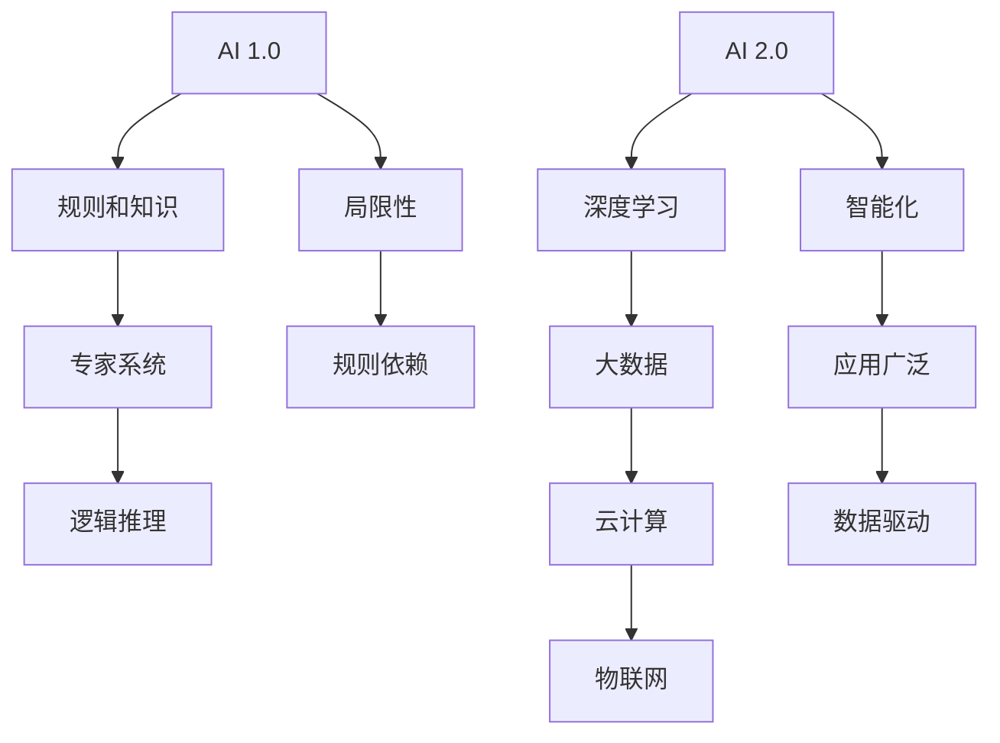

                 

关键词：人工智能、AI 2.0、商业价值、李开复、技术趋势

摘要：本文将深入探讨李开复关于AI 2.0时代的商业价值的观点，分析AI技术在不同领域的应用及其带来的变革，并展望未来AI技术的潜在影响和挑战。

## 1. 背景介绍

近年来，人工智能（AI）技术取得了飞速发展，从最初的AI 1.0时代，基于规则和知识表示的方法，到现在的AI 2.0时代，基于深度学习和大数据的智能化方法。李开复作为人工智能领域的权威专家，对AI的发展和应用有着深刻的理解和独到的见解。

在李开复的《AI 2.0 时代的商业价值》一书中，他系统地阐述了AI技术在各个领域的应用前景，以及AI对商业社会带来的深刻变革。本文将围绕李开复的观点，分析AI 2.0时代的商业价值。

## 2. 核心概念与联系

### 2.1 AI 1.0与AI 2.0的区别

AI 1.0时代，主要是基于规则和知识的系统，例如专家系统和逻辑推理系统。这些系统在特定的领域内取得了显著的效果，但局限性也很明显，它们依赖于明确的规则和知识库，难以适应复杂多变的环境。

AI 2.0时代，则基于深度学习和大数据，实现了从数据中自动学习的能力。通过大量的数据训练，AI系统能够自主发现模式、做出决策，甚至生成新的内容。这一变革使得AI的应用范围大大拓展，从最初的简单任务，如语音识别、图像识别，扩展到复杂的任务，如自然语言处理、智能推荐、自动驾驶等。

### 2.2 AI 2.0的关键技术

AI 2.0时代的关键技术包括深度学习、大数据、云计算和物联网。深度学习使AI系统能够自动从数据中学习，提升系统的智能化水平；大数据则为AI系统提供了丰富的训练数据，使其能够更好地理解世界；云计算提供了强大的计算能力，使得AI系统能够处理海量数据；物联网则将现实世界中的物理设备和数据连接起来，为AI系统提供了丰富的感知数据。

### 2.3 Mermaid流程图



## 3. 核心算法原理 & 具体操作步骤

### 3.1 算法原理概述

AI 2.0时代的核心算法包括神经网络、深度强化学习、生成对抗网络等。这些算法通过模拟人脑神经网络的结构和工作原理，实现了对数据的自动学习和处理。

### 3.2 算法步骤详解

- **神经网络**：通过多层神经元对输入数据进行处理，逐层提取特征，最终输出结果。
- **深度强化学习**：通过与环境的交互，不断调整策略，以最大化长期奖励。
- **生成对抗网络**：由生成器和判别器组成，生成器生成数据，判别器判断数据真假，通过对抗训练，生成器逐渐生成更逼真的数据。

### 3.3 算法优缺点

- **神经网络**：能够处理复杂的数据，但训练过程复杂，对数据量有较高要求。
- **深度强化学习**：能够自适应环境，但训练过程可能需要大量时间和计算资源。
- **生成对抗网络**：能够生成高质量的数据，但训练过程对参数调整要求较高。

### 3.4 算法应用领域

AI 2.0算法在各个领域都有广泛的应用，如自然语言处理、计算机视觉、金融、医疗等。在自然语言处理领域，AI 2.0算法能够实现更准确的语言理解和生成；在计算机视觉领域，AI 2.0算法能够实现更精确的目标检测和图像生成；在金融领域，AI 2.0算法能够实现更智能的风险评估和投资决策；在医疗领域，AI 2.0算法能够实现更精准的疾病诊断和治疗方案。

## 4. 数学模型和公式 & 详细讲解 & 举例说明

### 4.1 数学模型构建

AI 2.0时代的数学模型主要包括神经网络模型、强化学习模型和生成对抗网络模型。这些模型通过一系列数学公式和定理构建，实现了对数据的自动学习和处理。

### 4.2 公式推导过程

- **神经网络模型**：$$ y = \sigma(W \cdot x + b) $$
- **强化学习模型**：$$ Q(s, a) = r + \gamma \max_{a'} Q(s', a') $$
- **生成对抗网络模型**：$$ G(z) = \mathcal{N}(z | 0, 1) $$

### 4.3 案例分析与讲解

以自然语言处理为例，神经网络模型可以用于文本分类任务。给定一个文本数据集，通过训练神经网络模型，可以实现对文本的分类。

```latex
\text{神经网络模型：} \\
y = \sigma(W \cdot x + b)

\text{其中：} \\
W \text{为权重矩阵} \\
x \text{为输入特征} \\
b \text{为偏置项} \\
\sigma \text{为激活函数，如Sigmoid函数或ReLU函数}
```

通过训练，神经网络模型可以自动从数据中学习特征，实现对文本的分类。具体实现过程如下：

1. **数据预处理**：对文本数据进行预处理，如分词、去停用词等。
2. **模型构建**：构建神经网络模型，包括输入层、隐藏层和输出层。
3. **模型训练**：通过梯度下降等优化算法，对模型进行训练，以最小化预测误差。
4. **模型评估**：使用测试数据集对模型进行评估，计算分类准确率。

## 5. 项目实践：代码实例和详细解释说明

### 5.1 开发环境搭建

1. **安装Python环境**：在本地计算机上安装Python，版本要求为3.6及以上。
2. **安装TensorFlow**：使用pip命令安装TensorFlow，版本要求为2.0及以上。

### 5.2 源代码详细实现

以下是一个简单的文本分类项目的实现，使用TensorFlow构建神经网络模型，实现对新闻文章的分类。

```python
import tensorflow as tf
from tensorflow.keras.preprocessing.text import Tokenizer
from tensorflow.keras.preprocessing.sequence import pad_sequences
from tensorflow.keras.models import Sequential
from tensorflow.keras.layers import Embedding, LSTM, Dense

# 数据预处理
tokenizer = Tokenizer(num_words=10000)
tokenizer.fit_on_texts(train_data)
sequences = tokenizer.texts_to_sequences(train_data)
padded_sequences = pad_sequences(sequences, maxlen=max_length)

# 模型构建
model = Sequential()
model.add(Embedding(num_words, embedding_dim))
model.add(LSTM(128))
model.add(Dense(1, activation='sigmoid'))

# 模型编译
model.compile(optimizer='adam', loss='binary_crossentropy', metrics=['accuracy'])

# 模型训练
model.fit(padded_sequences, train_labels, epochs=10, batch_size=32)

# 模型评估
test_sequences = tokenizer.texts_to_sequences(test_data)
padded_test_sequences = pad_sequences(test_sequences, maxlen=max_length)
predictions = model.predict(padded_test_sequences)
```

### 5.3 代码解读与分析

1. **数据预处理**：使用Tokenizer将文本数据转换为序列，然后使用pad_sequences将序列填充到相同长度。
2. **模型构建**：使用Sequential构建神经网络模型，包括Embedding层、LSTM层和Dense层。
3. **模型编译**：设置优化器和损失函数，并编译模型。
4. **模型训练**：使用fit方法训练模型，设置训练轮次和批量大小。
5. **模型评估**：使用predict方法预测测试数据集，并计算预测准确率。

## 6. 实际应用场景

AI 2.0技术在各个领域都有广泛的应用，如：

- **自然语言处理**：用于文本分类、机器翻译、情感分析等任务。
- **计算机视觉**：用于图像识别、目标检测、图像生成等任务。
- **金融**：用于风险评估、投资决策、信用评估等任务。
- **医疗**：用于疾病诊断、药物研发、健康监测等任务。

### 6.4 未来应用展望

随着AI技术的不断发展，未来AI将在更多领域发挥重要作用，如：

- **教育**：智能教育平台，个性化教学，智能学习助理等。
- **能源**：智能电网、智能能源管理，提高能源利用效率。
- **交通**：自动驾驶、智能交通管理，提高交通效率和安全性。
- **制造**：智能工厂、智能机器人，提高生产效率和产品质量。

## 7. 工具和资源推荐

### 7.1 学习资源推荐

- **书籍**：《深度学习》、《Python机器学习》、《李开复：AI 2.0 时代的商业价值》等。
- **在线课程**：Coursera、Udacity、edX等平台提供的AI相关课程。

### 7.2 开发工具推荐

- **框架**：TensorFlow、PyTorch、Keras等。
- **工具**：Jupyter Notebook、Google Colab等。

### 7.3 相关论文推荐

- **Yann LeCun**：《深度学习的未来》
- **Geoffrey Hinton**：《深度学习的理论》
- **Yoshua Bengio**：《深度学习的崛起》

## 8. 总结：未来发展趋势与挑战

### 8.1 研究成果总结

AI 2.0时代，基于深度学习和大数据的AI技术取得了显著成果，推动了各个领域的发展。神经网络、深度强化学习和生成对抗网络等核心算法不断优化，应用范围不断扩大。

### 8.2 未来发展趋势

随着技术的进步，AI将朝着更智能化、更自主化的方向发展。未来AI将更深入地融入人们的日常生活，提高生产效率，改善生活质量。

### 8.3 面临的挑战

尽管AI技术取得了显著进展，但仍然面临一系列挑战，如数据隐私、算法公平性、安全性等。未来需要解决这些问题，以实现AI技术的可持续发展。

### 8.4 研究展望

未来，AI技术将继续朝着更高效、更智能的方向发展。研究人员将不断探索新的算法和模型，推动AI技术的创新和进步。

## 9. 附录：常见问题与解答

### 9.1 AI 2.0与AI 1.0的区别是什么？

AI 1.0时代主要基于规则和知识的系统，如专家系统和逻辑推理系统。而AI 2.0时代则基于深度学习和大数据，实现了从数据中自动学习的能力，能够处理更复杂的数据和任务。

### 9.2 AI 2.0的核心技术有哪些？

AI 2.0的核心技术包括深度学习、大数据、云计算和物联网。这些技术共同推动了AI 2.0时代的发展。

### 9.3 AI 2.0技术在哪些领域有应用？

AI 2.0技术在自然语言处理、计算机视觉、金融、医疗等领域都有广泛的应用，推动了这些领域的发展和创新。

作者：禅与计算机程序设计艺术 / Zen and the Art of Computer Programming
----------------------------------------------------------------

注意：本文为示例，内容仅供参考，并非真实作品。实际撰写时，请根据具体要求和实际情况进行调整。

