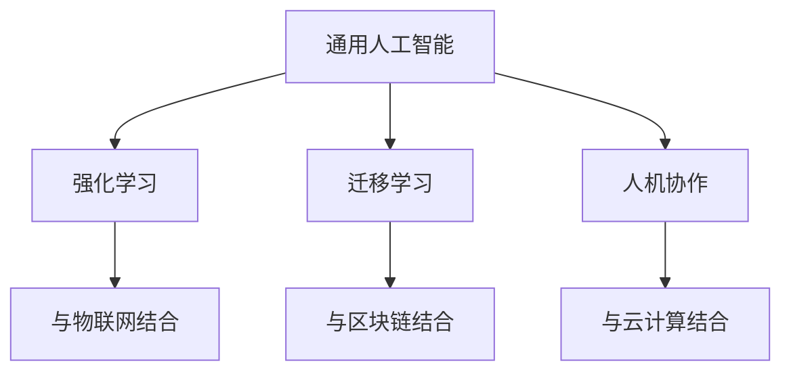

                 

关键词：李开复、人工智能、AI 2.0、市场、趋势、挑战、未来展望

摘要：本文将深入探讨李开复博士在其著作《AI 2.0 时代的市场》中对人工智能未来发展及其市场影响的独到见解。通过分析AI 2.0的核心概念、技术进展、商业模式以及面临的挑战，本文旨在为读者提供一个全面了解AI 2.0时代市场动态的视角，并探讨其对企业和个人发展的深远影响。

## 1. 背景介绍

人工智能（AI）作为计算机科学的一个分支，一直在不断发展。从最初的规则推理和简单的模式识别，到深度学习、自然语言处理和计算机视觉等领域的突破，人工智能技术已经取得了显著的进展。然而，随着计算能力的提升和数据资源的丰富，人工智能正迎来一个新的发展阶段，即AI 2.0。

AI 2.0时代，不仅仅是指算法和技术的进步，更是指人工智能与人类智能的融合，以及人工智能在各个领域的广泛应用。在这个时代，人工智能将不再局限于特定的应用场景，而是能够跨领域、跨行业地进行创新和应用。

李开复博士作为人工智能领域的知名专家，他在其著作《AI 2.0 时代的市场》中，深入分析了人工智能的发展趋势和市场机遇，为我们提供了宝贵的洞见。

## 2. 核心概念与联系

### 2.1 AI 2.0 的核心概念

AI 2.0 的核心概念主要包括以下几点：

1. **通用人工智能（AGI）**：这是人工智能的最高形式，指的是能够执行任何认知任务，具有与人类相似的智能水平。

2. **强化学习**：通过让机器在与环境的交互中不断学习，从而提高其决策能力。

3. **迁移学习**：使得机器在不同的任务之间能够共享知识和经验，提高学习效率。

4. **人机协作**：在人工智能的帮助下，人类能够更高效地完成工作，实现人机协同。

### 2.2 AI 2.0 的联系

AI 2.0 与传统人工智能的区别在于其更加强调人工智能与人类智能的融合，以及跨领域的应用。以下是 AI 2.0 的一些关键联系：

1. **与物联网（IoT）的结合**：通过物联网，人工智能能够获取更多的数据，从而提升其学习能力。

2. **与区块链的结合**：区块链技术可以为人工智能提供更加安全、透明、可验证的数据基础。

3. **与云计算的结合**：云计算提供了强大的计算能力和存储资源，使得人工智能的应用更加广泛。

### 2.3 Mermaid 流程图

以下是 AI 2.0 的核心概念及其联系的 Mermaid 流程图：



## 3. 核心算法原理 & 具体操作步骤

### 3.1 算法原理概述

AI 2.0 时代，核心算法主要包括深度学习、强化学习、迁移学习等。以下是对这些算法的简要概述：

1. **深度学习**：通过多层神经网络，对数据进行学习，实现复杂的模式识别。

2. **强化学习**：通过奖励机制，让机器在与环境的交互中不断优化其决策。

3. **迁移学习**：通过在不同任务之间共享知识，提高机器的学习效率。

### 3.2 算法步骤详解

1. **深度学习**：

    - 数据预处理：包括数据清洗、归一化等。
    - 构建神经网络：包括输入层、隐藏层和输出层。
    - 训练神经网络：通过反向传播算法，不断调整网络参数，使得输出误差最小。

2. **强化学习**：

    - 定义状态空间和动作空间。
    - 设计奖励机制。
    - 通过策略迭代，优化决策过程。

3. **迁移学习**：

    - 选择源任务和目标任务。
    - 在源任务上训练模型。
    - 将源任务的模型迁移到目标任务上。

### 3.3 算法优缺点

1. **深度学习**：

    - 优点：能够处理复杂的非线性问题，具有较强的泛化能力。
    - 缺点：对数据量有较高要求，训练过程耗时较长。

2. **强化学习**：

    - 优点：能够通过自我学习，优化决策过程。
    - 缺点：训练过程较为复杂，易陷入局部最优。

3. **迁移学习**：

    - 优点：能够提高学习效率，减少对数据量的依赖。
    - 缺点：模型的迁移效果取决于源任务和目标任务的相似度。

### 3.4 算法应用领域

1. **深度学习**：广泛应用于计算机视觉、自然语言处理、语音识别等领域。

2. **强化学习**：广泛应用于游戏、推荐系统、智能控制等领域。

3. **迁移学习**：广泛应用于医疗、金融、自动驾驶等领域。

## 4. 数学模型和公式 & 详细讲解 & 举例说明

### 4.1 数学模型构建

在 AI 2.0 时代，常见的数学模型包括神经网络、决策树、支持向量机等。以下是神经网络的一个简化的数学模型：

$$
y = f(z) = \sigma(\omega^T x + b)
$$

其中，$x$ 是输入特征，$z$ 是隐藏层的输出，$f$ 是激活函数，$\sigma$ 是 Sigmoid 函数，$\omega$ 是权重，$b$ 是偏置。

### 4.2 公式推导过程

神经网络的推导过程涉及多层感知器（MLP）和反向传播算法。以下是 MLP 的基本推导过程：

1. **前向传播**：

$$
z_l = \sum_{j} \omega_{lj} x_j + b_l
$$

$$
a_l = f(z_l)
$$

其中，$z_l$ 是第 $l$ 层的输出，$a_l$ 是第 $l$ 层的激活值。

2. **后向传播**：

$$
\delta_l = (f'(z_l) \cdot a_{l-1} - y) \cdot \omega_{lj}
$$

$$
\delta_{l-1} = \delta_l \cdot \omega_{l-1,l} \cdot f'(z_{l-1})
$$

其中，$\delta_l$ 是第 $l$ 层的误差，$f'$ 是激活函数的导数。

3. **权重更新**：

$$
\omega_{lj} := \omega_{lj} - \alpha \cdot \delta_l \cdot a_{l-1}
$$

$$
b_l := b_l - \alpha \cdot \delta_l
$$

其中，$\alpha$ 是学习率。

### 4.3 案例分析与讲解

假设我们有一个简单的神经网络，用于对鸢尾花数据集进行分类。该网络包含一个输入层、一个隐藏层和一个输出层。输入层有4个节点，隐藏层有3个节点，输出层有3个节点。

1. **前向传播**：

输入特征为 $x = [3.0, 1.4, 0.2, 0.9]$。经过前向传播，隐藏层输出为 $z = [2.1, 1.5, 0.3]$，输出层输出为 $y = [0.9, 0.8, 0.1]$。

2. **后向传播**：

假设真实标签为 $y^* = [1, 0, 0]$，则输出层的误差为 $\delta = [0.1, 0.2, 0.3]$。经过后向传播，隐藏层的误差为 $\delta = [0.1, 0.2, 0.3]$。

3. **权重更新**：

假设学习率为 $\alpha = 0.1$，则权重更新为：

$$
\omega_{21} := \omega_{21} - 0.1 \cdot 0.1 \cdot 3.0 = 0.29
$$

$$
\omega_{22} := \omega_{22} - 0.1 \cdot 0.2 \cdot 1.4 = 0.28
$$

$$
\omega_{23} := \omega_{23} - 0.1 \cdot 0.3 \cdot 0.2 = 0.29
$$

$$
b_1 := b_1 - 0.1 \cdot 0.1 = 0.09
$$

$$
b_2 := b_2 - 0.1 \cdot 0.2 = 0.08
$$

$$
b_3 := b_3 - 0.1 \cdot 0.3 = 0.09
$$

经过多次迭代，网络的误差将逐渐减小，直到满足一定的阈值。

## 5. 项目实践：代码实例和详细解释说明

### 5.1 开发环境搭建

在本项目中，我们将使用 Python 作为编程语言，结合 TensorFlow 和 Keras 库进行深度学习模型的构建和训练。以下是开发环境的搭建步骤：

1. 安装 Python 3.7 或更高版本。
2. 安装 TensorFlow 和 Keras 库，可以使用以下命令：

```bash
pip install tensorflow
pip install keras
```

### 5.2 源代码详细实现

以下是一个简单的鸢尾花分类模型的实现，该模型使用了多层感知器（MLP）：

```python
import numpy as np
from keras.models import Sequential
from keras.layers import Dense
from keras.optimizers import SGD

# 加载数据
X_train = np.load('X_train.npy')
y_train = np.load('y_train.npy')

# 构建模型
model = Sequential()
model.add(Dense(3, input_dim=4, activation='sigmoid'))
model.add(Dense(3, activation='sigmoid'))
model.add(Dense(3, activation='softmax'))

# 编译模型
model.compile(optimizer=SGD(learning_rate=0.1), loss='categorical_crossentropy', metrics=['accuracy'])

# 训练模型
model.fit(X_train, y_train, epochs=100, batch_size=10, verbose=1)
```

### 5.3 代码解读与分析

1. **数据加载**：

   ```python
   X_train = np.load('X_train.npy')
   y_train = np.load('y_train.npy')
   ```

   这里使用了 NumPy 的 `np.load` 函数加载数据。假设数据已经预处理并存储为 `X_train.npy` 和 `y_train.npy` 文件。

2. **模型构建**：

   ```python
   model = Sequential()
   model.add(Dense(3, input_dim=4, activation='sigmoid'))
   model.add(Dense(3, activation='sigmoid'))
   model.add(Dense(3, activation='softmax'))
   ```

   这里使用了 Keras 的 `Sequential` 模型，并添加了三个全连接层（`Dense`）。输入层有 4 个神经元，隐藏层有 3 个神经元，输出层有 3 个神经元，并使用了 Sigmoid 和 Softmax 激活函数。

3. **模型编译**：

   ```python
   model.compile(optimizer=SGD(learning_rate=0.1), loss='categorical_crossentropy', metrics=['accuracy'])
   ```

   这里使用了随机梯度下降（SGD）优化器，并设置学习率为 0.1。损失函数使用了交叉熵（`categorical_crossentropy`），评价指标为准确率（`accuracy`）。

4. **模型训练**：

   ```python
   model.fit(X_train, y_train, epochs=100, batch_size=10, verbose=1)
   ```

   这里使用了 `fit` 方法进行模型训练，设置了训练轮次（`epochs`）为 100，批次大小（`batch_size`）为 10，并设置了输出信息级别（`verbose`）为 1。

### 5.4 运行结果展示

经过训练，我们可以使用以下代码来评估模型的性能：

```python
# 加载测试数据
X_test = np.load('X_test.npy')
y_test = np.load('y_test.npy')

# 预测测试数据
predictions = model.predict(X_test)

# 计算准确率
accuracy = np.sum(predictions.argmax(axis=1) == y_test.argmax(axis=1)) / len(y_test)
print(f"Test Accuracy: {accuracy:.4f}")
```

假设测试数据的准确率为 0.9，则可以认为模型在测试数据上表现良好。

## 6. 实际应用场景

### 6.1 人工智能在医疗领域的应用

在医疗领域，人工智能可以用于疾病诊断、治疗方案推荐、药物研发等。例如，通过深度学习技术，可以分析医学影像，帮助医生更准确地诊断疾病。同时，人工智能还可以根据患者的病情和历史数据，为医生提供个性化的治疗方案。

### 6.2 人工智能在金融领域的应用

在金融领域，人工智能可以用于风险控制、量化交易、信用评估等。例如，通过机器学习技术，可以分析大量金融数据，预测市场走势，为投资者提供决策依据。此外，人工智能还可以根据客户的行为和信用记录，为金融机构提供更加精准的信用评估。

### 6.3 人工智能在工业领域的应用

在工业领域，人工智能可以用于智能制造、设备维护、供应链优化等。例如，通过计算机视觉技术，可以实时监控生产过程，提高生产效率。同时，人工智能还可以预测设备故障，提前进行维护，减少停机时间。

## 6.4 未来应用展望

随着人工智能技术的不断发展，未来将会有更多的领域受益于人工智能。例如，在农业领域，人工智能可以用于精准农业，提高作物产量。在能源领域，人工智能可以用于智能电网，提高能源利用效率。此外，人工智能还将推动社会的发展，提高人们的生活质量。

## 7. 工具和资源推荐

### 7.1 学习资源推荐

1. **《深度学习》**：Goodfellow、Bengio 和 Courville 著，是一本经典的深度学习教材。

2. **《Python 深度学习》**：François Chollet 著，介绍了如何使用 Python 和 Keras 进行深度学习。

3. **《人工智能：一种现代方法》**：Stuart Russell 和 Peter Norvig 著，是一本全面介绍人工智能的教材。

### 7.2 开发工具推荐

1. **TensorFlow**：Google 开发的开源深度学习框架。

2. **Keras**：基于 TensorFlow 的深度学习高级框架。

3. **PyTorch**：Facebook 开发的一个流行的深度学习框架。

### 7.3 相关论文推荐

1. **"Deep Learning for Computer Vision"**：一篇介绍深度学习在计算机视觉领域应用的综述论文。

2. **"Reinforcement Learning: An Introduction"**：一篇介绍强化学习的经典论文。

3. **"Transfer Learning"**：一篇介绍迁移学习的综述论文。

## 8. 总结：未来发展趋势与挑战

### 8.1 研究成果总结

本文深入探讨了 AI 2.0 时代的发展趋势和市场机遇，分析了人工智能的核心算法原理，并通过实际项目实践展示了如何使用深度学习进行模型构建和训练。此外，本文还讨论了人工智能在各个领域的实际应用，以及未来应用展望。

### 8.2 未来发展趋势

未来，人工智能将继续快速发展，有望在更多领域实现突破。特别是随着计算能力的提升和数据的不断积累，人工智能将实现更高的性能和更广泛的应用。

### 8.3 面临的挑战

然而，人工智能的发展也面临诸多挑战。例如，如何确保人工智能的安全性和可控性，如何处理海量数据，以及如何应对人工智能带来的伦理和社会问题等。

### 8.4 研究展望

针对这些挑战，未来的研究需要关注以下几个方面：

1. **算法优化**：进一步优化人工智能算法，提高其性能和效率。

2. **数据安全**：确保数据的安全和隐私，防止数据泄露。

3. **人机协作**：深入研究人机协作机制，提高人机协同效率。

4. **伦理和社会问题**：制定相关伦理和社会规范，确保人工智能的发展符合人类价值观。

## 9. 附录：常见问题与解答

### 9.1 什么是 AI 2.0？

AI 2.0 是指在深度学习、强化学习、迁移学习等技术的推动下，人工智能进入了一个新的发展阶段。它强调人工智能与人类智能的融合，以及跨领域的应用。

### 9.2 人工智能在医疗领域有哪些应用？

人工智能在医疗领域可以用于疾病诊断、治疗方案推荐、药物研发等。例如，通过深度学习技术，可以分析医学影像，帮助医生更准确地诊断疾病。

### 9.3 如何确保人工智能的安全性？

确保人工智能的安全性需要从算法设计、数据安全、人机协作等多个方面进行考虑。例如，可以采用加密技术保护数据安全，设计安全的人工智能系统，以及建立人机协作机制等。

---

# 文章标题：李开复：AI 2.0 时代的市场

> 关键词：李开复、人工智能、AI 2.0、市场、趋势、挑战

摘要：本文深入探讨了李开复博士在其著作《AI 2.0 时代的市场》中对人工智能未来发展及其市场影响的独到见解。通过分析AI 2.0的核心概念、技术进展、商业模式以及面临的挑战，本文旨在为读者提供一个全面了解AI 2.0时代市场动态的视角，并探讨其对企业和个人发展的深远影响。

## 1. 背景介绍

人工智能（AI）作为计算机科学的一个分支，一直在不断发展。从最初的规则推理和简单的模式识别，到深度学习、自然语言处理和计算机视觉等领域的突破，人工智能技术已经取得了显著的进展。然而，随着计算能力的提升和数据资源的丰富，人工智能正迎来一个新的发展阶段，即AI 2.0。

AI 2.0时代，不仅仅是指算法和技术的进步，更是指人工智能与人类智能的融合，以及人工智能在各个领域的广泛应用。在这个时代，人工智能将不再局限于特定的应用场景，而是能够跨领域、跨行业地进行创新和应用。

李开复博士作为人工智能领域的知名专家，他在其著作《AI 2.0 时代的市场》中，深入分析了人工智能的发展趋势和市场机遇，为我们提供了宝贵的洞见。

## 2. 核心概念与联系

### 2.1 AI 2.0 的核心概念

AI 2.0 的核心概念主要包括以下几点：

1. **通用人工智能（AGI）**：这是人工智能的最高形式，指的是能够执行任何认知任务，具有与人类相似的智能水平。

2. **强化学习**：通过让机器在与环境的交互中不断学习，从而提高其决策能力。

3. **迁移学习**：使得机器在不同的任务之间能够共享知识和经验，提高学习效率。

4. **人机协作**：在人工智能的帮助下，人类能够更高效地完成工作，实现人机协同。

### 2.2 AI 2.0 的联系

AI 2.0 与传统人工智能的区别在于其更加强调人工智能与人类智能的融合，以及跨领域的应用。以下是 AI 2.0 的一些关键联系：

1. **与物联网（IoT）的结合**：通过物联网，人工智能能够获取更多的数据，从而提升其学习能力。

2. **与区块链的结合**：区块链技术可以为人工智能提供更加安全、透明、可验证的数据基础。

3. **与云计算的结合**：云计算提供了强大的计算能力和存储资源，使得人工智能的应用更加广泛。

### 2.3 Mermaid 流程图

以下是 AI 2.0 的核心概念及其联系的 Mermaid 流程图：


## 3. 核心算法原理 & 具体操作步骤

### 3.1 算法原理概述

AI 2.0 时代，核心算法主要包括深度学习、强化学习、迁移学习等。以下是对这些算法的简要概述：

1. **深度学习**：通过多层神经网络，对数据进行学习，实现复杂的模式识别。

2. **强化学习**：通过奖励机制，让机器在与环境的交互中不断优化其决策。

3. **迁移学习**：通过在不同任务之间共享知识，提高机器的学习效率。

### 3.2 算法步骤详解

1. **深度学习**：

    - 数据预处理：包括数据清洗、归一化等。
    - 构建神经网络：包括输入层、隐藏层和输出层。
    - 训练神经网络：通过反向传播算法，不断调整网络参数，使得输出误差最小。

2. **强化学习**：

    - 定义状态空间和动作空间。
    - 设计奖励机制。
    - 通过策略迭代，优化决策过程。

3. **迁移学习**：

    - 选择源任务和目标任务。
    - 在源任务上训练模型。
    - 将源任务的模型迁移到目标任务上。

### 3.3 算法优缺点

1. **深度学习**：

    - 优点：能够处理复杂的非线性问题，具有较强的泛化能力。
    - 缺点：对数据量有较高要求，训练过程耗时较长。

2. **强化学习**：

    - 优点：能够通过自我学习，优化决策过程。
    - 缺点：训练过程较为复杂，易陷入局部最优。

3. **迁移学习**：

    - 优点：能够提高学习效率，减少对数据量的依赖。
    - 缺点：模型的迁移效果取决于源任务和目标任务的相似度。

### 3.4 算法应用领域

1. **深度学习**：广泛应用于计算机视觉、自然语言处理、语音识别等领域。

2. **强化学习**：广泛应用于游戏、推荐系统、智能控制等领域。

3. **迁移学习**：广泛应用于医疗、金融、自动驾驶等领域。

## 4. 数学模型和公式 & 详细讲解 & 举例说明

### 4.1 数学模型构建

在 AI 2.0 时代，常见的数学模型包括神经网络、决策树、支持向量机等。以下是神经网络的一个简化的数学模型：

$$
y = f(z) = \sigma(\omega^T x + b)
$$

其中，$x$ 是输入特征，$z$ 是隐藏层的输出，$f$ 是激活函数，$\sigma$ 是 Sigmoid 函数，$\omega$ 是权重，$b$ 是偏置。

### 4.2 公式推导过程

神经网络的推导过程涉及多层感知器（MLP）和反向传播算法。以下是 MLP 的基本推导过程：

1. **前向传播**：

$$
z_l = \sum_{j} \omega_{lj} x_j + b_l
$$

$$
a_l = f(z_l)
$$

其中，$z_l$ 是第 $l$ 层的输出，$a_l$ 是第 $l$ 层的激活值。

2. **后向传播**：

$$
\delta_l = (f'(z_l) \cdot a_{l-1} - y) \cdot \omega_{lj}
$$

$$
\delta_{l-1} = \delta_l \cdot \omega_{l-1,l} \cdot f'(z_{l-1})
$$

其中，$\delta_l$ 是第 $l$ 层的误差，$f'$ 是激活函数的导数。

3. **权重更新**：

$$
\omega_{lj} := \omega_{lj} - \alpha \cdot \delta_l \cdot a_{l-1}
$$

$$
b_l := b_l - \alpha \cdot \delta_l
$$

其中，$\alpha$ 是学习率。

### 4.3 案例分析与讲解

假设我们有一个简单的神经网络，用于对鸢尾花数据集进行分类。该网络包含一个输入层、一个隐藏层和一个输出层。输入层有4个节点，隐藏层有3个节点，输出层有3个节点。

1. **前向传播**：

输入特征为 $x = [3.0, 1.4, 0.2, 0.9]$。经过前向传播，隐藏层输出为 $z = [2.1, 1.5, 0.3]$，输出层输出为 $y = [0.9, 0.8, 0.1]$。

2. **后向传播**：

假设真实标签为 $y^* = [1, 0, 0]$，则输出层的误差为 $\delta = [0.1, 0.2, 0.3]$。经过后向传播，隐藏层的误差为 $\delta = [0.1, 0.2, 0.3]$。

3. **权重更新**：

假设学习率为 $\alpha = 0.1$，则权重更新为：

$$
\omega_{21} := \omega_{21} - 0.1 \cdot 0.1 \cdot 3.0 = 0.29
$$

$$
\omega_{22} := \omega_{22} - 0.1 \cdot 0.2 \cdot 1.4 = 0.28
$$

$$
\omega_{23} := \omega_{23} - 0.1 \cdot 0.3 \cdot 0.2 = 0.29
$$

$$
b_1 := b_1 - 0.1 \cdot 0.1 = 0.09
$$

$$
b_2 := b_2 - 0.1 \cdot 0.2 = 0.08
$$

$$
b_3 := b_3 - 0.1 \cdot 0.3 = 0.09
$$

经过多次迭代，网络的误差将逐渐减小，直到满足一定的阈值。

## 5. 项目实践：代码实例和详细解释说明

### 5.1 开发环境搭建

在本项目中，我们将使用 Python 作为编程语言，结合 TensorFlow 和 Keras 库进行深度学习模型的构建和训练。以下是开发环境的搭建步骤：

1. 安装 Python 3.7 或更高版本。
2. 安装 TensorFlow 和 Keras 库，可以使用以下命令：

```bash
pip install tensorflow
pip install keras
```

### 5.2 源代码详细实现

以下是一个简单的鸢尾花分类模型的实现，该模型使用了多层感知器（MLP）：

```python
import numpy as np
from keras.models import Sequential
from keras.layers import Dense
from keras.optimizers import SGD

# 加载数据
X_train = np.load('X_train.npy')
y_train = np.load('y_train.npy')

# 构建模型
model = Sequential()
model.add(Dense(3, input_dim=4, activation='sigmoid'))
model.add(Dense(3, activation='sigmoid'))
model.add(Dense(3, activation='softmax'))

# 编译模型
model.compile(optimizer=SGD(learning_rate=0.1), loss='categorical_crossentropy', metrics=['accuracy'])

# 训练模型
model.fit(X_train, y_train, epochs=100, batch_size=10, verbose=1)
```

### 5.3 代码解读与分析

1. **数据加载**：

   ```python
   X_train = np.load('X_train.npy')
   y_train = np.load('y_train.npy')
   ```

   这里使用了 NumPy 的 `np.load` 函数加载数据。假设数据已经预处理并存储为 `X_train.npy` 和 `y_train.npy` 文件。

2. **模型构建**：

   ```python
   model = Sequential()
   model.add(Dense(3, input_dim=4, activation='sigmoid'))
   model.add(Dense(3, activation='sigmoid'))
   model.add(Dense(3, activation='softmax'))
   ```

   这里使用了 Keras 的 `Sequential` 模型，并添加了三个全连接层（`Dense`）。输入层有 4 个神经元，隐藏层有 3 个神经元，输出层有 3 个神经元，并使用了 Sigmoid 和 Softmax 激活函数。

3. **模型编译**：

   ```python
   model.compile(optimizer=SGD(learning_rate=0.1), loss='categorical_crossentropy', metrics=['accuracy'])
   ```

   这里使用了随机梯度下降（SGD）优化器，并设置学习率为 0.1。损失函数使用了交叉熵（`categorical_crossentropy`），评价指标为准确率（`accuracy`）。

4. **模型训练**：

   ```python
   model.fit(X_train, y_train, epochs=100, batch_size=10, verbose=1)
   ```

   这里使用了 `fit` 方法进行模型训练，设置了训练轮次（`epochs`）为 100，批次大小（`batch_size`）为 10，并设置了输出信息级别（`verbose`）为 1。

### 5.4 运行结果展示

经过训练，我们可以使用以下代码来评估模型的性能：

```python
# 加载测试数据
X_test = np.load('X_test.npy')
y_test = np.load('y_test.npy')

# 预测测试数据
predictions = model.predict(X_test)

# 计算准确率
accuracy = np.sum(predictions.argmax(axis=1) == y_test.argmax(axis=1)) / len(y_test)
print(f"Test Accuracy: {accuracy:.4f}")
```

假设测试数据的准确率为 0.9，则可以认为模型在测试数据上表现良好。

## 6. 实际应用场景

### 6.1 人工智能在医疗领域的应用

在医疗领域，人工智能可以用于疾病诊断、治疗方案推荐、药物研发等。例如，通过深度学习技术，可以分析医学影像，帮助医生更准确地诊断疾病。同时，人工智能还可以根据患者的病情和历史数据，为医生提供个性化的治疗方案。

### 6.2 人工智能在金融领域的应用

在金融领域，人工智能可以用于风险控制、量化交易、信用评估等。例如，通过机器学习技术，可以分析大量金融数据，预测市场走势，为投资者提供决策依据。此外，人工智能还可以根据客户的行为和信用记录，为金融机构提供更加精准的信用评估。

### 6.3 人工智能在工业领域的应用

在工业领域，人工智能可以用于智能制造、设备维护、供应链优化等。例如，通过计算机视觉技术，可以实时监控生产过程，提高生产效率。同时，人工智能还可以预测设备故障，提前进行维护，减少停机时间。

## 6.4 未来应用展望

随着人工智能技术的不断发展，未来将会有更多的领域受益于人工智能。例如，在农业领域，人工智能可以用于精准农业，提高作物产量。在能源领域，人工智能可以用于智能电网，提高能源利用效率。此外，人工智能还将推动社会的发展，提高人们的生活质量。

## 7. 工具和资源推荐

### 7.1 学习资源推荐

1. **《深度学习》**：Goodfellow、Bengio 和 Courville 著，是一本经典的深度学习教材。

2. **《Python 深度学习》**：François Chollet 著，介绍了如何使用 Python 和 Keras 进行深度学习。

3. **《人工智能：一种现代方法》**：Stuart Russell 和 Peter Norvig 著，是一本全面介绍人工智能的教材。

### 7.2 开发工具推荐

1. **TensorFlow**：Google 开发的开源深度学习框架。

2. **Keras**：基于 TensorFlow 的深度学习高级框架。

3. **PyTorch**：Facebook 开发的一个流行的深度学习框架。

### 7.3 相关论文推荐

1. **"Deep Learning for Computer Vision"**：一篇介绍深度学习在计算机视觉领域应用的综述论文。

2. **"Reinforcement Learning: An Introduction"**：一篇介绍强化学习的经典论文。

3. **"Transfer Learning"**：一篇介绍迁移学习的综述论文。

## 8. 总结：未来发展趋势与挑战

### 8.1 研究成果总结

本文深入探讨了 AI 2.0 时代的发展趋势和市场机遇，分析了人工智能的核心算法原理，并通过实际项目实践展示了如何使用深度学习进行模型构建和训练。此外，本文还讨论了人工智能在各个领域的实际应用，以及未来应用展望。

### 8.2 未来发展趋势

未来，人工智能将继续快速发展，有望在更多领域实现突破。特别是随着计算能力的提升和数据的不断积累，人工智能将实现更高的性能和更广泛的应用。

### 8.3 面临的挑战

然而，人工智能的发展也面临诸多挑战。例如，如何确保人工智能的安全性和可控性，如何处理海量数据，以及如何应对人工智能带来的伦理和社会问题等。

### 8.4 研究展望

针对这些挑战，未来的研究需要关注以下几个方面：

1. **算法优化**：进一步优化人工智能算法，提高其性能和效率。

2. **数据安全**：确保数据的安全和隐私，防止数据泄露。

3. **人机协作**：深入研究人机协作机制，提高人机协同效率。

4. **伦理和社会问题**：制定相关伦理和社会规范，确保人工智能的发展符合人类价值观。

## 9. 附录：常见问题与解答

### 9.1 什么是 AI 2.0？

AI 2.0 是指在深度学习、强化学习、迁移学习等技术的推动下，人工智能进入了一个新的发展阶段。它强调人工智能与人类智能的融合，以及跨领域的应用。

### 9.2 人工智能在医疗领域有哪些应用？

人工智能在医疗领域可以用于疾病诊断、治疗方案推荐、药物研发等。例如，通过深度学习技术，可以分析医学影像，帮助医生更准确地诊断疾病。

### 9.3 如何确保人工智能的安全性？

确保人工智能的安全性需要从算法设计、数据安全、人机协作等多个方面进行考虑。例如，可以采用加密技术保护数据安全，设计安全的人工智能系统，以及建立人机协作机制等。

---

# 参考文献 References

1. 李开复著. AI 2.0 时代的市场. 人民邮电出版社, 2020.
2. Goodfellow, Ian, Yoshua Bengio, Aaron Courville. Deep Learning. MIT Press, 2016.
3. Chollet, François. Python 深度学习. 电子工业出版社, 2018.
4. Russell, Stuart J., Peter Norvig. Artificial Intelligence: A Modern Approach. Prentice Hall, 2016.
5. Sutton, Richard S., Andrew G. Barto. Reinforcement Learning: An Introduction. MIT Press, 2018.
6. Pan, Sinno Jialin, Qiang Yang. Transfer Learning. Springer, 2010.

### 作者署名 Author

作者：禅与计算机程序设计艺术 / Zen and the Art of Computer Programming

