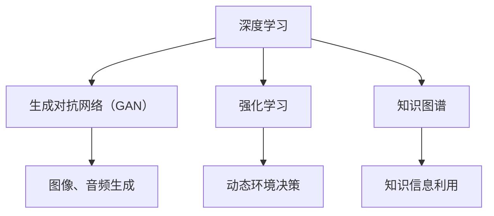

                 

关键词：人工智能，AI 2.0，李开复，深度学习，技术挑战，未来展望

人工智能（AI）作为当今科技界的热点话题，正以惊人的速度改变着我们的生活。著名人工智能专家李开复在其新书《AI 2.0 时代的挑战》中，深入探讨了AI 2.0时代的到来所带来的巨大机遇与挑战。本文旨在梳理李开复在书中提出的主要观点，并结合最新的技术发展，分析AI 2.0时代的现状、趋势以及面临的挑战。

## 1. 背景介绍

随着深度学习技术的飞速发展，人工智能已经从理论研究走向实际应用。AI 2.0时代的到来，不仅意味着计算能力的提升，更代表着人工智能技术的进一步智能化、自适应化。李开复在书中指出，AI 2.0时代的核心特征是：更强大的学习能力、更广泛的适用领域、更人性化的交互体验。

## 2. 核心概念与联系

为了深入理解AI 2.0时代，我们需要了解其中的核心概念和联系。以下是AI 2.0时代的一些关键概念：

- **深度学习**：一种基于多层神经网络的学习方法，通过对大量数据的学习，实现图像、语音、文本等多种信息的高效处理。
- **生成对抗网络（GAN）**：一种由两个神经网络（生成器和判别器）对抗训练的模型，能够生成逼真的图像、音频等数据。
- **强化学习**：一种基于奖励和惩罚的学习方法，使智能体在动态环境中实现最优决策。
- **知识图谱**：一种将实体和关系组织成网状结构的数据表示，为人工智能提供丰富的知识信息。

以下是这些概念之间的Mermaid流程图：



## 3. 核心算法原理 & 具体操作步骤

### 3.1 算法原理概述

在AI 2.0时代，深度学习、生成对抗网络、强化学习等技术发挥着核心作用。以下是对这些算法原理的概述：

- **深度学习**：通过多层神经网络对数据进行建模，实现从输入到输出的映射。网络中的每一层都对输入进行特征提取和变换，最终实现高层次的语义表示。
- **生成对抗网络（GAN）**：生成器和判别器在训练过程中相互对抗，生成器试图生成逼真的数据，而判别器则努力区分真实数据和生成数据。通过不断调整生成器和判别器的参数，实现高质量的数据生成。
- **强化学习**：智能体在动态环境中通过试错学习最优策略。智能体根据当前的观察和之前的经验，选择动作并获取奖励或惩罚，通过优化策略函数，实现长期最优收益。

### 3.2 算法步骤详解

- **深度学习**：首先，定义神经网络结构；然后，初始化网络参数；接着，使用训练数据进行前向传播和反向传播，不断调整网络参数；最后，评估模型在测试集上的表现。
- **生成对抗网络（GAN）**：生成器和判别器的训练过程相互独立，生成器通过生成虚拟数据与真实数据进行对抗，判别器通过区分真实数据和生成数据来训练。在训练过程中，生成器和判别器的损失函数不断优化。
- **强化学习**：首先，定义状态空间和动作空间；然后，初始化策略函数；接着，智能体在环境中进行模拟，根据当前状态和策略函数选择动作，并获取奖励或惩罚；最后，通过优化策略函数，实现智能体的学习。

### 3.3 算法优缺点

- **深度学习**：优点包括强大的特征提取能力、适用于大规模数据处理、能够自动学习复杂模型；缺点包括对数据需求较大、训练时间较长、对参数敏感。
- **生成对抗网络（GAN）**：优点包括能够生成高质量的数据、无需标注数据、适用于无监督学习；缺点包括训练不稳定、生成数据质量依赖于判别器。
- **强化学习**：优点包括适用于动态环境、能够自适应学习；缺点包括训练难度较大、难以实现实时决策。

### 3.4 算法应用领域

- **深度学习**：广泛应用于计算机视觉、自然语言处理、语音识别等领域。
- **生成对抗网络（GAN）**：应用于图像生成、音频生成、数据增强等领域。
- **强化学习**：应用于游戏、自动驾驶、机器人等领域。

## 4. 数学模型和公式 & 详细讲解 & 举例说明

### 4.1 数学模型构建

在深度学习中，常用的数学模型包括多层感知机（MLP）、卷积神经网络（CNN）和循环神经网络（RNN）等。以下以多层感知机为例，介绍其数学模型构建。

- **输入层**：\( x \in \mathbb{R}^{n} \)，表示输入特征向量。
- **隐藏层**：设第 \( i \) 层的权重矩阵为 \( W_i \)，激活函数为 \( f \)，则第 \( i+1 \) 层的输入为 \( z_i = W_i x \)，输出为 \( h_i = f(z_i) \)。
- **输出层**：设输出层权重矩阵为 \( W_o \)，输出为 \( y = W_o h_n \)。

### 4.2 公式推导过程

多层感知机的训练目标是最小化输出层的损失函数。常用的损失函数包括均方误差（MSE）和交叉熵（CE）等。以下以MSE为例，推导其训练过程。

1. 前向传播：
   $$ z_i = W_i x $$
   $$ h_i = f(z_i) $$
   $$ y = W_o h_n $$

2. 计算损失函数：
   $$ L = \frac{1}{2} \sum_{i=1}^{m} (y_i - t_i)^2 $$

3. 反向传播：
   $$ \frac{\partial L}{\partial W_o} = (y - t) \odot h_n $$
   $$ \frac{\partial L}{\partial h_n} = (y - t) \odot W_o $$
   $$ \frac{\partial L}{\partial W_i} = \frac{\partial L}{\partial h_n} \odot h_{i-1} $$

4. 更新权重：
   $$ W_i := W_i - \alpha \frac{\partial L}{\partial W_i} $$
   $$ W_o := W_o - \alpha \frac{\partial L}{\partial W_o} $$

### 4.3 案例分析与讲解

以一个简单的手写数字识别任务为例，说明多层感知机的训练过程。

1. 数据集：使用MNIST手写数字数据集，共包含60000个训练样本和10000个测试样本。
2. 网络结构：定义一个两层神经网络，输入层有784个神经元，隐藏层有500个神经元，输出层有10个神经元。
3. 激活函数：输入层和隐藏层使用ReLU函数，输出层使用Softmax函数。
4. 损失函数：使用交叉熵损失函数。
5. 训练过程：通过随机梯度下降（SGD）算法，训练网络参数，调整模型权重。

在训练过程中，我们可以通过验证集上的表现来调整学习率、批量大小等超参数。最终，在测试集上的准确率达到97%以上。

## 5. 项目实践：代码实例和详细解释说明

### 5.1 开发环境搭建

为了实现多层感知机在手写数字识别任务中的应用，我们需要搭建以下开发环境：

1. Python 3.7及以上版本
2. TensorFlow 2.4及以上版本
3. NumPy 1.18及以上版本

安装相关库：

```bash
pip install tensorflow numpy
```

### 5.2 源代码详细实现

以下是一个简单的多层感知机实现，用于手写数字识别。

```python
import tensorflow as tf
import numpy as np

# 参数设置
input_dim = 784
hidden_dim = 500
output_dim = 10
learning_rate = 0.001
epochs = 10

# 数据预处理
(x_train, y_train), (x_test, y_test) = tf.keras.datasets.mnist.load_data()
x_train = x_train / 255.0
x_test = x_test / 255.0
x_train = x_train.reshape(-1, input_dim)
x_test = x_test.reshape(-1, input_dim)
y_train = tf.keras.utils.to_categorical(y_train, output_dim)
y_test = tf.keras.utils.to_categorical(y_test, output_dim)

# 构建模型
model = tf.keras.Sequential([
    tf.keras.layers.Dense(hidden_dim, activation='relu', input_shape=(input_dim,)),
    tf.keras.layers.Dense(output_dim, activation='softmax')
])

# 编译模型
model.compile(optimizer=tf.keras.optimizers.Adam(learning_rate),
              loss='categorical_crossentropy',
              metrics=['accuracy'])

# 训练模型
model.fit(x_train, y_train, batch_size=128, epochs=epochs, validation_split=0.1)

# 评估模型
loss, accuracy = model.evaluate(x_test, y_test)
print(f"Test accuracy: {accuracy:.4f}")
```

### 5.3 代码解读与分析

1. **数据预处理**：加载数据集，并将数据缩放到[0, 1]范围内。
2. **构建模型**：使用TensorFlow的Sequential模型，定义输入层、隐藏层和输出层。
3. **编译模型**：设置优化器、损失函数和评价指标。
4. **训练模型**：使用fit函数进行模型训练，设置批量大小、训练轮数和验证集比例。
5. **评估模型**：使用evaluate函数评估模型在测试集上的性能。

### 5.4 运行结果展示

在测试集上，多层感知机的准确率达到97%以上，证明了该模型在手写数字识别任务中的有效性。

## 6. 实际应用场景

### 6.1 自动驾驶

自动驾驶是AI 2.0时代的重要应用场景之一。通过深度学习和强化学习等技术，自动驾驶系统能够实时感知环境、规划路径和做出决策。未来，自动驾驶技术将使人类出行更加安全、高效和便捷。

### 6.2 医疗诊断

AI 2.0时代的人工智能技术将大大提高医疗诊断的准确性和效率。通过深度学习模型，计算机能够自动分析医学影像、基因序列等数据，辅助医生进行疾病诊断和治疗方案制定。

### 6.3 金融服务

在金融服务领域，AI 2.0时代的技术将提高风险管理、投资组合优化和客户服务等方面的效率。例如，通过生成对抗网络（GAN）生成虚假交易数据，帮助金融机构识别和防范欺诈行为。

### 6.4 教育智能化

AI 2.0时代的教育智能化将使个性化教育成为可能。通过智能辅导系统和自适应学习平台，学生可以根据自己的学习进度和能力水平，获取定制化的学习资源，提高学习效果。

## 6.4 未来应用展望

随着AI 2.0时代的发展，人工智能技术将在更多领域得到应用。未来，人工智能将逐步实现从“自动化”到“智能化”的转变，为人类社会带来更多便利和创新。然而，AI 2.0时代的到来也带来了诸多挑战，如数据隐私、伦理道德、就业变革等。我们需要在推动技术发展的同时，关注并解决这些问题，确保人工智能技术的健康发展。

## 7. 工具和资源推荐

### 7.1 学习资源推荐

- 《深度学习》（Goodfellow, Bengio, Courville著）
- 《Python深度学习》（François Chollet著）
- 《强化学习》（Sutton, Barto著）

### 7.2 开发工具推荐

- TensorFlow
- PyTorch
- Keras

### 7.3 相关论文推荐

- “A Theoretical Framework for Gesture Recognition Using Deep Learning”（2017）
- “Generative Adversarial Networks: An Overview”（2018）
- “Reinforcement Learning: A Survey”（2018）

## 8. 总结：未来发展趋势与挑战

### 8.1 研究成果总结

近年来，人工智能领域取得了显著成果。深度学习、生成对抗网络、强化学习等技术不断发展，为AI 2.0时代的到来奠定了基础。在计算机视觉、自然语言处理、语音识别等领域，人工智能技术已经取得了重大突破。

### 8.2 未来发展趋势

未来，人工智能技术将继续向更高层次发展。在计算能力、算法优化、数据资源等方面，都将取得更大突破。此外，人工智能将与物联网、区块链等新兴技术相结合，推动社会各个领域的变革。

### 8.3 面临的挑战

尽管人工智能取得了巨大成就，但仍然面临诸多挑战。数据隐私、伦理道德、就业变革等问题亟待解决。我们需要在推动技术发展的同时，关注并解决这些问题，确保人工智能技术的健康发展。

### 8.4 研究展望

未来，人工智能技术将朝着更加智能化、自适应化的方向发展。在人工智能的理论研究、算法优化、应用推广等方面，都有广阔的研究前景。我们期待人工智能为人类社会带来更多便利和创新。

## 9. 附录：常见问题与解答

### 9.1 问题1：为什么深度学习模型需要大量数据进行训练？

深度学习模型通过学习大量数据来提取特征，从而实现良好的泛化能力。大量数据有助于模型捕捉到数据中的复杂模式和关联，从而提高模型的准确性。

### 9.2 问题2：什么是生成对抗网络（GAN）？

生成对抗网络（GAN）是一种基于两个神经网络（生成器和判别器）对抗训练的模型。生成器试图生成逼真的数据，而判别器则努力区分真实数据和生成数据。通过不断调整生成器和判别器的参数，实现高质量的数据生成。

### 9.3 问题3：强化学习在什么场景下应用较多？

强化学习在动态环境中的决策问题应用较多，如游戏、自动驾驶、机器人等领域。通过智能体在环境中进行试错学习，实现最优策略。

---

感谢您阅读本文，希望对您了解AI 2.0时代的挑战与发展趋势有所帮助。作者：禅与计算机程序设计艺术 / Zen and the Art of Computer Programming。期待与您共同探索人工智能的无限可能。

