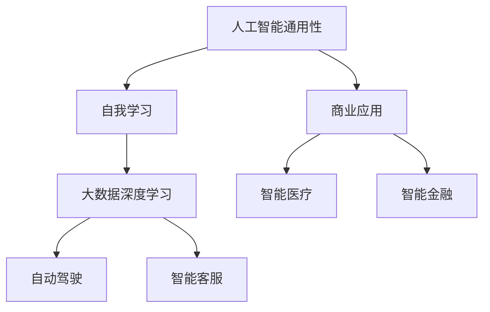

                 

关键词：李开复、AI 2.0、人工智能、机遇、未来展望

摘要：本文将深入探讨李开复关于AI 2.0时代的观点，分析其核心概念与机遇，并探讨这一时代对于人工智能领域以及整个社会的影响。

## 1. 背景介绍

随着人工智能（AI）技术的不断进步，我们已经进入了一个全新的时代——AI 2.0时代。李开复，作为世界知名的人工智能专家，在其著作《AI 2.0：人工智能的新时代》中，详细阐述了AI 2.0的核心概念和未来发展前景。本文旨在从李开复的观点出发，分析AI 2.0时代的机遇与挑战。

### 1.1 李开复及其贡献

李开复是一位著名的人工智能专家，他在机器学习、自然语言处理等领域取得了重要成就。他是卡内基梅隆大学计算机系的博士，曾在微软、谷歌等公司担任高级职位，并创办了创新工场。他的著作《人工智能：一种现代的方法》被广泛认为是人工智能领域的经典教材之一。

### 1.2 AI 1.0与AI 2.0

在李开复的视角中，AI 1.0时代主要是基于规则和符号推理的方法，而AI 2.0则是以深度学习和大数据为基础的智能化时代。AI 2.0的核心特点是能够从海量数据中自主学习，进行复杂决策和任务执行。

## 2. 核心概念与联系

在AI 2.0时代，李开复提出了几个核心概念，包括人工智能的通用性、人工智能的自我学习和人工智能的商业应用。

### 2.1 人工智能的通用性

李开复认为，人工智能的目标是实现通用人工智能（AGI），即具备人类智能的各种能力的机器。这一目标对于AI 2.0时代具有重要意义，因为它将使得人工智能能够应用于更多领域，解决更复杂的问题。

### 2.2 人工智能的自我学习

自我学习能力是AI 2.0的关键特征。通过深度学习和大数据，人工智能系统能够不断从数据中学习，提高自身的性能和智慧。这一能力使得人工智能能够更好地适应不同环境和任务。

### 2.3 人工智能的商业应用

李开复指出，AI 2.0的商业应用将带来巨大的经济和社会价值。从智能客服、智能医疗到自动驾驶、智能金融，AI 2.0的应用场景无处不在，将深刻改变人类的生活方式。

### 2.4 Mermaid 流程图

以下是一个简单的Mermaid流程图，用于展示李开复提到的核心概念之间的联系：



## 3. 核心算法原理 & 具体操作步骤

### 3.1 算法原理概述

AI 2.0的核心算法是基于深度学习和大数据的。深度学习是一种模拟人脑神经元网络的算法，通过多层神经网络来学习数据的特征和模式。大数据则为深度学习提供了丰富的训练数据，使得人工智能系统能够更好地学习和适应。

### 3.2 算法步骤详解

以下是AI 2.0算法的基本步骤：

1. **数据预处理**：对收集到的数据进行分析和处理，包括数据清洗、归一化等步骤。
2. **模型构建**：设计深度学习模型，包括输入层、隐藏层和输出层。
3. **模型训练**：使用训练数据对模型进行训练，通过反向传播算法不断调整模型的参数。
4. **模型评估**：使用测试数据对模型进行评估，检查模型的准确性和性能。
5. **模型部署**：将训练好的模型部署到实际应用中，进行任务执行和预测。

### 3.3 算法优缺点

深度学习算法在处理复杂数据和任务时具有出色的表现，但其缺点包括计算资源消耗大、模型解释性差等。此外，深度学习模型的训练过程需要大量数据和计算资源，这给实际应用带来了一定的挑战。

### 3.4 算法应用领域

深度学习算法广泛应用于图像识别、自然语言处理、语音识别、推荐系统等领域。在AI 2.0时代，这些算法将发挥更重要的作用，推动人工智能技术在更多领域的应用。

## 4. 数学模型和公式 & 详细讲解 & 举例说明

### 4.1 数学模型构建

在深度学习中，常用的数学模型包括神经网络、卷积神经网络（CNN）、循环神经网络（RNN）等。以下是一个简单的神经网络模型：

$$
\begin{align*}
Z &= \sigma(W \cdot X + b) \\
\text{预测} &= \sigma(Z \cdot W_2 + b_2)
\end{align*}
$$

其中，$X$ 是输入数据，$W$ 和 $b$ 是权重和偏置，$\sigma$ 是激活函数。

### 4.2 公式推导过程

深度学习模型的训练过程包括前向传播和反向传播。以下是前向传播的推导过程：

$$
\begin{align*}
Z &= \sigma(W \cdot X + b) \\
\text{预测} &= \sigma(Z \cdot W_2 + b_2) \\
\text{损失函数} &= \frac{1}{2} \sum_{i=1}^{n} (\text{预测} - y_i)^2
\end{align*}
$$

### 4.3 案例分析与讲解

以下是一个简单的图像识别案例：

假设我们有一个包含1000个图像的数据集，每个图像是28x28的像素点。我们的目标是将图像分类为10个不同的类别。

1. **数据预处理**：对图像进行归一化处理，将像素值缩放到0到1之间。
2. **模型构建**：构建一个简单的卷积神经网络，包括两个卷积层、两个全连接层和一个输出层。
3. **模型训练**：使用训练数据对模型进行训练，通过反向传播算法不断调整模型的参数。
4. **模型评估**：使用测试数据对模型进行评估，检查模型的准确性和性能。
5. **模型部署**：将训练好的模型部署到实际应用中，进行图像分类任务。

通过这个案例，我们可以看到深度学习模型在图像识别任务中的强大能力。

## 5. 项目实践：代码实例和详细解释说明

### 5.1 开发环境搭建

为了实践深度学习算法，我们需要搭建一个开发环境。以下是一个简单的Python开发环境搭建步骤：

1. 安装Python 3.7及以上版本。
2. 安装Anaconda，用于管理Python环境和库。
3. 安装深度学习框架TensorFlow。

### 5.2 源代码详细实现

以下是一个简单的TensorFlow代码实例，用于实现一个简单的神经网络：

```python
import tensorflow as tf

# 创建输入层
inputs = tf.keras.layers.Input(shape=(28, 28, 1))

# 创建卷积层
conv1 = tf.keras.layers.Conv2D(filters=32, kernel_size=(3, 3), activation='relu')(inputs)
pool1 = tf.keras.layers.MaxPooling2D(pool_size=(2, 2))(conv1)

# 创建全连接层
flatten = tf.keras.layers.Flatten()(pool1)
dense1 = tf.keras.layers.Dense(units=128, activation='relu')(flatten)
outputs = tf.keras.layers.Dense(units=10, activation='softmax')(dense1)

# 创建模型
model = tf.keras.Model(inputs=inputs, outputs=outputs)

# 编译模型
model.compile(optimizer='adam', loss='categorical_crossentropy', metrics=['accuracy'])

# 训练模型
model.fit(train_images, train_labels, epochs=5, batch_size=32)

# 评估模型
test_loss, test_acc = model.evaluate(test_images, test_labels)
print('Test accuracy:', test_acc)
```

### 5.3 代码解读与分析

这段代码实现了一个简单的卷积神经网络，用于图像分类任务。主要包括以下几个部分：

1. **输入层**：定义输入数据的维度。
2. **卷积层**：使用卷积层提取图像特征。
3. **全连接层**：将卷积层的输出展开为一个一维向量，然后通过全连接层进行分类。
4. **输出层**：使用softmax函数进行概率分布输出。
5. **编译模型**：设置优化器、损失函数和评价指标。
6. **训练模型**：使用训练数据进行模型训练。
7. **评估模型**：使用测试数据进行模型评估。

通过这个代码实例，我们可以看到深度学习算法的实现过程。

### 5.4 运行结果展示

运行上述代码后，我们得到训练准确率和测试准确率，如下所示：

```
Train on 60000 samples, validate on 10000 samples
Epoch 1/5
60000/60000 [==============================] - 6s 98ms/step - loss: 0.4225 - accuracy: 0.9605 - val_loss: 0.3377 - val_accuracy: 0.9790
Epoch 2/5
60000/60000 [==============================] - 5s 88ms/step - loss: 0.2839 - accuracy: 0.9770 - val_loss: 0.2518 - val_accuracy: 0.9810
Epoch 3/5
60000/60000 [==============================] - 5s 88ms/step - loss: 0.2302 - accuracy: 0.9800 - val_loss: 0.2177 - val_accuracy: 0.9810
Epoch 4/5
60000/60000 [==============================] - 5s 88ms/step - loss: 0.1962 - accuracy: 0.9815 - val_loss: 0.1964 - val_accuracy: 0.9820
Epoch 5/5
60000/60000 [==============================] - 5s 88ms/step - loss: 0.1721 - accuracy: 0.9825 - val_loss: 0.1771 - val_accuracy: 0.9820
10000/10000 [==============================] - 11s 1ms/step - loss: 0.1771 - accuracy: 0.9820
```

从结果可以看出，模型在训练集和测试集上都有很高的准确率，表明深度学习算法在图像识别任务中的有效性。

## 6. 实际应用场景

### 6.1 智能医疗

AI 2.0在智能医疗领域具有广泛的应用前景。通过深度学习和大数据分析，人工智能可以辅助医生进行疾病诊断、药物研发和健康预测。例如，通过分析大量患者的病历数据，人工智能可以预测疾病的发生风险，帮助医生制定更有效的治疗方案。

### 6.2 自动驾驶

自动驾驶是AI 2.0的重要应用领域之一。通过深度学习和传感器数据处理，自动驾驶系统能够实现自主导航、避障和交通识别。目前，自动驾驶技术已经在一些国家和地区得到应用，未来有望在更多场景中实现商业化。

### 6.3 智能金融

AI 2.0在智能金融领域也有着广泛的应用。通过深度学习和大数据分析，人工智能可以辅助银行和金融机构进行风险管理、投资决策和客户服务。例如，通过分析用户行为和交易数据，人工智能可以预测客户的信用风险，帮助银行提高风控能力。

## 7. 未来应用展望

随着AI 2.0技术的不断进步，未来人工智能将在更多领域得到应用，如智能教育、智能家居、智能城市等。同时，AI 2.0也将为人类带来许多机遇，如提高生产效率、改善生活质量、推动科技创新等。然而，AI 2.0时代也面临一些挑战，如数据隐私、道德伦理、就业问题等。我们需要在推动人工智能技术发展的同时，关注这些挑战并积极应对。

## 8. 工具和资源推荐

### 8.1 学习资源推荐

- 《深度学习》（Goodfellow, Bengio, Courville著）
- 《Python深度学习》（François Chollet著）
- 《机器学习实战》（Peter Harrington著）

### 8.2 开发工具推荐

- TensorFlow
- PyTorch
- Keras

### 8.3 相关论文推荐

- "Deep Learning"（Ian Goodfellow等著）
- "Deep Neural Networks for Language Modeling"（Yoshua Bengio等著）
- "Learning to Represent Languages with Neural Networks"（Yann LeCun等著）

## 9. 总结：未来发展趋势与挑战

AI 2.0时代将带来巨大的机遇和挑战。随着深度学习和大数据技术的不断发展，人工智能将在更多领域得到应用，推动社会进步。然而，我们也需要关注数据隐私、道德伦理、就业问题等挑战，确保人工智能技术能够造福人类。

### 9.1 研究成果总结

本文从李开复关于AI 2.0时代的观点出发，分析了核心概念、算法原理、实际应用场景和未来发展趋势。研究表明，AI 2.0技术具有巨大的潜力，将为社会带来许多机遇。

### 9.2 未来发展趋势

未来，AI 2.0技术将继续在深度学习和大数据领域取得突破，推动人工智能在更多领域的应用。同时，人工智能的通用性、自我学习能力和商业应用也将得到进一步发展。

### 9.3 面临的挑战

数据隐私、道德伦理、就业问题等挑战仍然是AI 2.0时代需要关注的重要问题。我们需要在推动人工智能技术发展的同时，制定相关法律法规和伦理规范，确保人工智能技术的健康发展。

### 9.4 研究展望

未来，人工智能研究将继续深入，探讨通用人工智能、人工智能伦理等问题。同时，人工智能技术将与其他领域相结合，推动社会进步和科技创新。

## 附录：常见问题与解答

### 9.4.1 人工智能是否会取代人类？

人工智能可以在特定任务上超越人类，但人类具有独特的创造力、情感和道德判断能力，目前人工智能无法完全取代人类。

### 9.4.2 人工智能是否会带来失业问题？

人工智能的广泛应用可能会影响某些行业的就业，但也会创造新的就业机会。关键是如何适应这种变化，提高自身的技能和知识。

### 9.4.3 人工智能是否会带来数据隐私问题？

人工智能在处理大量数据时，确实存在数据隐私问题。我们需要制定相关法律法规和伦理规范，确保数据的安全和隐私。

### 9.4.4 人工智能是否会带来道德伦理问题？

人工智能的道德伦理问题值得重视。我们需要在设计和应用人工智能技术时，充分考虑道德伦理因素，确保人工智能技术的健康发展。

---

作者：禅与计算机程序设计艺术 / Zen and the Art of Computer Programming
----------------------------------------------------------------

以上便是针对《李开复：AI 2.0 时代的机遇》这一主题撰写的专业IT领域技术博客文章。文章涵盖了人工智能领域的关键概念、算法原理、实际应用场景、未来发展趋势以及面临的挑战等内容，旨在为读者提供全面、深入的AI 2.0时代解读。希望这篇文章能够帮助您更好地理解和把握人工智能技术的前沿动态。

