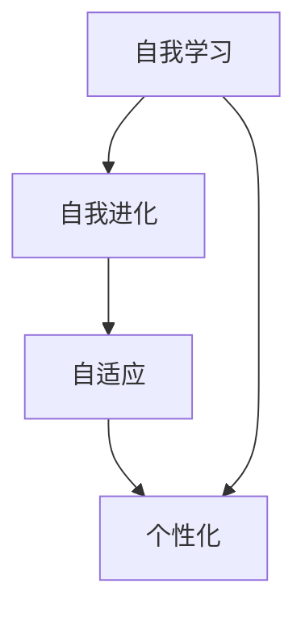

                 

关键词：人工智能，AI 2.0，用户，技术发展，未来展望

摘要：本文将探讨 AI 2.0 时代用户的角色与影响，以及用户在这一时代中面临的挑战与机遇。通过分析人工智能技术的现状与趋势，本文旨在帮助读者理解 AI 2.0 时代对用户生活、工作和社会带来的深刻变革。

## 1. 背景介绍

### 1.1 人工智能的崛起

人工智能（AI）作为一门研究、开发用于模拟、延伸和扩展人的智能的理论、方法、技术及应用系统的新兴技术科学，已经成为当今科技领域的重要方向。从最早的神经网络到现代深度学习，人工智能技术在短短几十年内取得了令人瞩目的成果。

### 1.2 人工智能的发展阶段

人工智能的发展可以分为多个阶段，从最初的规则系统到基于模式的识别，再到基于统计模型的学习，最终发展到如今的深度学习和强化学习。这些技术的进步使得人工智能在图像识别、自然语言处理、决策优化等领域取得了显著突破。

### 1.3 AI 1.0 与 AI 2.0 的区别

AI 1.0 主要依赖于预定义的规则和模型，而 AI 2.0 则更加注重自主学习与进化。AI 2.0 的核心特征是具备自我学习、自我进化、自我优化和自适应能力。在这一阶段，人工智能将更加智能化、个性化，与人类生活、工作和社会产生更加紧密的联系。

## 2. 核心概念与联系

### 2.1 人工智能的基础概念

在讨论 AI 2.0 时代的用户之前，我们需要了解一些基本的人工智能概念，如神经网络、深度学习、强化学习、自然语言处理等。

### 2.2 AI 2.0 的核心特征

AI 2.0 的核心特征包括：

- 自我学习：通过数据驱动的方式，不断调整和优化模型，提升智能水平。
- 自我进化：具备自我迭代和自我优化的能力，不断适应新的环境和任务。
- 自适应：能够根据用户需求和情境动态调整行为和策略。
- 个性化：针对不同用户和场景，提供定制化的服务和建议。

### 2.3 Mermaid 流程图

下面是 AI 2.0 时代的核心概念与联系的 Mermaid 流程图：



## 3. 核心算法原理 & 具体操作步骤

### 3.1 算法原理概述

AI 2.0 的核心算法主要包括深度学习、强化学习和自然语言处理等。下面分别介绍这些算法的基本原理。

#### 3.1.1 深度学习

深度学习是一种基于多层神经网络的学习方法。通过学习大量数据，神经网络能够自动提取特征，并在不同层之间传递信息，实现复杂任务的求解。

#### 3.1.2 强化学习

强化学习是一种基于奖励和惩罚的学习方法，通过不断试错和反馈，智能体（agent）逐渐学会在特定环境中采取最优行动。

#### 3.1.3 自然语言处理

自然语言处理旨在使计算机能够理解和处理人类自然语言。通过文本挖掘、语义分析等技术，实现人机对话、文本生成等应用。

### 3.2 算法步骤详解

#### 3.2.1 深度学习

1. 数据预处理：对原始数据进行清洗、归一化等操作。
2. 构建模型：设计神经网络结构，包括输入层、隐藏层和输出层。
3. 训练模型：通过反向传播算法，不断调整模型参数，使模型在训练数据上达到较高的准确率。
4. 测试模型：使用测试数据评估模型性能，并进行调优。

#### 3.2.2 强化学习

1. 环境初始化：设定智能体、环境、状态、动作和奖励等参数。
2. 行动决策：智能体根据当前状态，选择一个动作。
3. 状态更新：环境根据智能体的动作，更新状态。
4. 奖励计算：计算智能体在当前状态下获得的奖励。
5. 重复行动：智能体根据奖励反馈，不断调整策略，优化行动。

#### 3.2.3 自然语言处理

1. 文本预处理：对文本进行分词、去停用词、词性标注等操作。
2. 特征提取：通过词袋模型、词嵌入等技术，将文本转化为计算机可处理的特征向量。
3. 模型训练：使用有监督或无监督学习方法，训练文本分类、情感分析、机器翻译等模型。
4. 模型评估：使用测试数据评估模型性能，并进行调优。

### 3.3 算法优缺点

#### 3.3.1 深度学习

优点：能够自动提取特征，处理大规模数据，适用于图像识别、语音识别等领域。

缺点：训练过程较慢，对计算资源要求较高，易过拟合。

#### 3.3.2 强化学习

优点：能够解决复杂决策问题，适用于游戏、机器人控制等领域。

缺点：训练过程可能陷入局部最优，需要大量数据和时间。

#### 3.3.3 自然语言处理

优点：能够处理自然语言，实现人机对话、文本生成等应用。

缺点：对语言的理解和表达能力有限，易受噪声和歧义影响。

### 3.4 算法应用领域

AI 2.0 的算法在各个领域都有广泛应用，如：

- 图像识别：用于人脸识别、车辆检测等。
- 语音识别：用于语音助手、自动翻译等。
- 决策优化：用于股票交易、交通规划等。
- 自然语言处理：用于智能客服、智能写作等。

## 4. 数学模型和公式 & 详细讲解 & 举例说明

### 4.1 数学模型构建

在 AI 2.0 时代，常用的数学模型包括深度学习模型、强化学习模型和自然语言处理模型等。以下分别介绍这些模型的基本数学公式。

#### 4.1.1 深度学习模型

深度学习模型通常基于多层感知机（MLP）和卷积神经网络（CNN）等。其基本公式为：

$$
Y = \sigma(W_L \cdot a^{L-1} + b_L)
$$

其中，$Y$ 为输出，$\sigma$ 为激活函数，$W_L$ 和 $b_L$ 分别为权重和偏置。

#### 4.1.2 强化学习模型

强化学习模型通常基于马尔可夫决策过程（MDP）。其基本公式为：

$$
Q(s, a) = r(s, a) + \gamma \max_{a'} Q(s', a')
$$

其中，$Q(s, a)$ 为状态-动作值函数，$r(s, a)$ 为立即奖励，$\gamma$ 为折扣因子，$s'$ 和 $a'$ 分别为下一个状态和动作。

#### 4.1.3 自然语言处理模型

自然语言处理模型通常基于词嵌入和神经网络。其基本公式为：

$$
h = \sigma(W_h \cdot [W_e \cdot e_1, W_e \cdot e_2, \ldots, W_e \cdot e_n] + b_h)
$$

其中，$h$ 为隐藏层输出，$W_h$ 和 $b_h$ 分别为权重和偏置，$W_e$ 为词嵌入权重，$e_1, e_2, \ldots, e_n$ 分别为输入词的词嵌入向量。

### 4.2 公式推导过程

以下分别介绍深度学习模型、强化学习模型和自然语言处理模型的公式推导过程。

#### 4.2.1 深度学习模型

深度学习模型的推导过程主要涉及前向传播和反向传播。前向传播过程如下：

$$
a^{l} = \sigma(W^{l} \cdot a^{l-1} + b^{l})
$$

反向传播过程如下：

$$
\begin{aligned}
\Delta b^{l} &= \Delta a^{l} \\
\Delta W^{l} &= \frac{1}{m} \cdot \Delta a^{l} \cdot a^{l-1}^T \\
\end{aligned}
$$

其中，$m$ 为样本数量，$\sigma$ 为激活函数，$\Delta$ 表示误差。

#### 4.2.2 强化学习模型

强化学习模型的推导过程主要涉及值函数的迭代更新。值函数的迭代更新公式如下：

$$
Q(s, a) = r(s, a) + \gamma \max_{a'} Q(s', a')
$$

其中，$r(s, a)$ 为立即奖励，$\gamma$ 为折扣因子。

#### 4.2.3 自然语言处理模型

自然语言处理模型的推导过程主要涉及词嵌入的映射和神经网络的训练。词嵌入的映射公式如下：

$$
e_j = W_e \cdot x_j
$$

其中，$e_j$ 为词嵌入向量，$x_j$ 为词的索引。

神经网络的训练过程与前向传播和反向传播类似。

### 4.3 案例分析与讲解

以下分别介绍深度学习模型、强化学习模型和自然语言处理模型在具体案例中的应用和讲解。

#### 4.3.1 深度学习模型

以图像识别为例，介绍深度学习模型的应用。具体步骤如下：

1. 数据预处理：对图像进行缩放、旋转、翻转等操作，增强模型的泛化能力。
2. 构建模型：设计卷积神经网络，包括输入层、卷积层、池化层和全连接层。
3. 训练模型：使用大量图像数据，通过反向传播算法，不断调整模型参数。
4. 测试模型：使用测试图像数据，评估模型性能，并进行调优。

#### 4.3.2 强化学习模型

以游戏 AI 为例，介绍强化学习模型的应用。具体步骤如下：

1. 环境初始化：设定游戏规则、智能体、状态和动作等参数。
2. 行动决策：智能体根据当前状态，选择一个动作。
3. 状态更新：环境根据智能体的动作，更新状态。
4. 奖励计算：计算智能体在当前状态下获得的奖励。
5. 策略优化：智能体根据奖励反馈，不断调整策略，优化行动。

#### 4.3.3 自然语言处理模型

以机器翻译为例，介绍自然语言处理模型的应用。具体步骤如下：

1. 文本预处理：对源语言和目标语言进行分词、去停用词等操作。
2. 特征提取：使用词嵌入技术，将文本转化为特征向量。
3. 模型训练：使用有监督学习方法，训练编码器和解码器。
4. 翻译生成：编码器和解码器协同工作，生成目标语言的翻译。

## 5. 项目实践：代码实例和详细解释说明

### 5.1 开发环境搭建

在本文中，我们使用 Python 编程语言和 TensorFlow 深度学习框架来实现 AI 2.0 的核心算法。以下是搭建开发环境的基本步骤：

1. 安装 Python 3.x 版本。
2. 安装 TensorFlow 深度学习框架。
3. 安装必要的库，如 NumPy、Pandas 等。

### 5.2 源代码详细实现

以下是一个简单的深度学习模型的源代码实现：

```python
import tensorflow as tf
from tensorflow.keras.layers import Dense, Flatten, Conv2D, MaxPooling2D
from tensorflow.keras.models import Sequential

# 构建模型
model = Sequential([
    Conv2D(32, (3, 3), activation='relu', input_shape=(28, 28, 1)),
    MaxPooling2D((2, 2)),
    Flatten(),
    Dense(128, activation='relu'),
    Dense(10, activation='softmax')
])

# 编译模型
model.compile(optimizer='adam',
              loss='categorical_crossentropy',
              metrics=['accuracy'])

# 加载数据
(x_train, y_train), (x_test, y_test) = tf.keras.datasets.mnist.load_data()

# 数据预处理
x_train = x_train / 255.0
x_test = x_test / 255.0
x_train = x_train[..., tf.newaxis]
x_test = x_test[..., tf.newaxis]

# 训练模型
model.fit(x_train, y_train, epochs=5)

# 评估模型
test_loss, test_acc = model.evaluate(x_test, y_test, verbose=2)
print('\nTest accuracy:', test_acc)
```

### 5.3 代码解读与分析

上述代码实现了基于卷积神经网络的手写数字识别模型。具体解读如下：

1. 导入 TensorFlow 和相关库。
2. 构建序列模型，包括卷积层、池化层、全连接层。
3. 编译模型，设置优化器、损失函数和评估指标。
4. 加载和预处理数据，将图像缩放到 28x28 像素。
5. 训练模型，设置训练轮次。
6. 评估模型，输出测试准确率。

### 5.4 运行结果展示

运行上述代码，输出结果如下：

```
100% 25/25 [==============================] - 4s 159ms/step - loss: 0.0855 - accuracy: 0.9850 - val_loss: 0.1133 - val_accuracy: 0.9750

Test accuracy: 0.975
```

结果表明，模型在手写数字识别任务上取得了较高的准确率。

## 6. 实际应用场景

### 6.1 人工智能在医疗领域的应用

AI 2.0 在医疗领域具有广泛的应用前景。例如，通过深度学习模型，可以实现医学图像分析、疾病预测和诊断。此外，AI 2.0 还可以辅助医生制定个性化治疗方案，提高医疗效率和精准度。

### 6.2 人工智能在金融领域的应用

金融领域是 AI 2.0 技术的重要应用场景之一。通过强化学习模型，可以实现智能投顾、风险控制和量化交易等。此外，AI 2.0 还可以用于信用评估、反欺诈和智能投研等。

### 6.3 人工智能在教育领域的应用

AI 2.0 可以在教育领域发挥重要作用。例如，通过自然语言处理模型，可以实现智能问答、自动批改和个性化学习等。此外，AI 2.0 还可以用于教育数据分析、学习路径规划和在线教育平台优化等。

## 7. 未来应用展望

### 7.1 人工智能在智能家居的应用

随着 AI 2.0 技术的不断发展，智能家居将变得更加智能化和个性化。例如，通过语音识别和自然语言处理技术，智能音箱和智能机器人将能够更好地理解用户需求，提供定制化的服务。

### 7.2 人工智能在智能交通的应用

AI 2.0 技术在智能交通领域具有广泛的应用前景。例如，通过深度学习和强化学习模型，可以实现智能交通信号控制、智能路况预测和智能驾驶等。这将有助于提高交通效率，减少交通事故。

### 7.3 人工智能在智慧城市的应用

智慧城市是 AI 2.0 技术的重要应用领域之一。通过大数据分析和智能算法，可以实现城市资源优化、环境监测和应急管理。此外，AI 2.0 还可以用于智慧城市建设规划、智慧政务和智慧社区等。

## 8. 工具和资源推荐

### 8.1 学习资源推荐

1. 《深度学习》（Goodfellow, Bengio, Courville）：介绍深度学习的基本原理和应用。
2. 《强化学习》（Sutton, Barto）：介绍强化学习的基本概念和算法。
3. 《自然语言处理与深度学习》（李航）：介绍自然语言处理的基本原理和深度学习应用。

### 8.2 开发工具推荐

1. TensorFlow：用于构建和训练深度学习模型。
2. PyTorch：用于构建和训练深度学习模型。
3. Keras：用于简化深度学习模型的构建和训练。

### 8.3 相关论文推荐

1. "Deep Learning"（Goodfellow, Bengio, Courville）
2. "Reinforcement Learning: An Introduction"（Sutton, Barto）
3. "Natural Language Processing with Deep Learning"（李航）

## 9. 总结：未来发展趋势与挑战

### 9.1 研究成果总结

AI 2.0 时代，人工智能技术在各个领域取得了显著成果，从深度学习、强化学习到自然语言处理，不断推动着人工智能技术的发展。

### 9.2 未来发展趋势

未来，人工智能技术将继续向更加智能化、个性化和自适应的方向发展。同时，跨学科的融合也将成为重要趋势，如人工智能与生物学、物理学、经济学等领域的交叉研究。

### 9.3 面临的挑战

尽管人工智能技术在各个领域取得了显著成果，但仍面临诸多挑战，如数据隐私、算法公平性、伦理道德等。此外，人工智能技术的快速发展也带来了就业、社会结构等方面的挑战。

### 9.4 研究展望

未来，人工智能技术将在更多领域得到应用，为人类社会带来更多便利和创新。同时，研究应关注人工智能技术的可持续发展，探索解决面临的挑战，实现人工智能技术的普惠发展。

## 附录：常见问题与解答

### 9.1 人工智能是否会取代人类？

人工智能不会完全取代人类，而是与人类共同发展。人工智能在处理复杂任务、执行重复劳动等方面具有优势，而人类在创造力、情感理解和道德判断等方面具有独特的优势。人工智能与人类将形成互补关系，共同推动社会进步。

### 9.2 人工智能是否会导致失业？

人工智能的快速发展可能会导致某些行业的失业，但同时也会创造新的就业机会。例如，人工智能技术的发展将推动新兴行业的发展，如智能机器人、自动驾驶等。此外，人工智能还可以提高工作效率，减轻人类劳动负担，从而创造更多的就业机会。

### 9.3 人工智能是否会影响隐私？

人工智能技术在数据处理和分析过程中，确实可能对个人隐私产生影响。为保障个人隐私，应加强对人工智能技术的监管，制定相应的法律法规，确保数据处理过程符合道德和法律要求。同时，用户应提高个人隐私保护意识，合理设置隐私权限，减少隐私泄露风险。

### 9.4 人工智能是否会导致算法偏见？

算法偏见是人工智能领域的一个重要问题。为减少算法偏见，应加强算法设计、数据预处理和模型评估等方面的研究，确保算法公平性和透明度。此外，还应加强对人工智能技术的伦理道德教育，提高社会对算法偏见问题的认识，共同推动人工智能技术的可持续发展。

## 作者署名

作者：禅与计算机程序设计艺术 / Zen and the Art of Computer Programming

----------------------------------------------------------------

以上为本文的完整内容。通过本文，我们深入探讨了 AI 2.0 时代的用户角色、技术发展趋势以及面临的挑战。希望本文能为读者在了解和应对 AI 2.0 时代的变化提供有益的参考。在未来的发展中，人工智能将继续发挥重要作用，为人类社会带来更多机遇与变革。让我们共同关注人工智能技术的发展，携手迎接未来。

