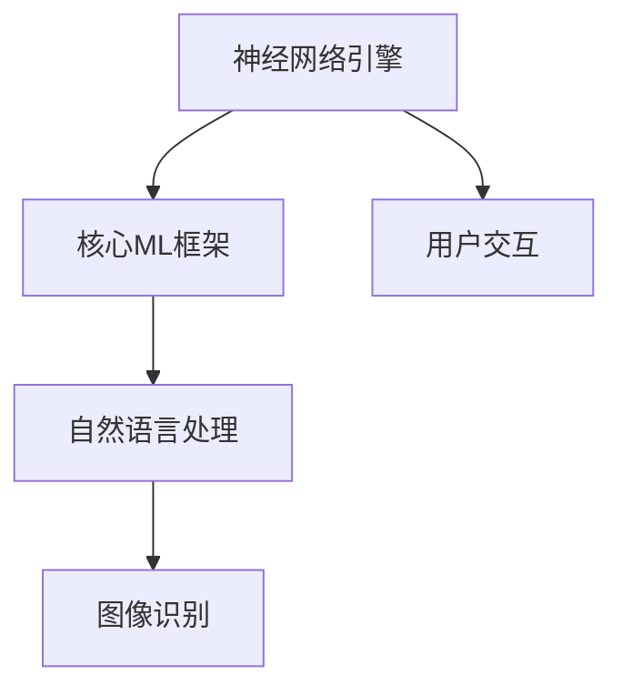

                 

关键词：人工智能，苹果，AI应用，技术变革，产业影响

> 摘要：本文将深入探讨苹果公司在其最新产品中发布的AI应用，分析其背后的技术原理、市场影响及未来发展趋势。文章将从背景介绍、核心概念与联系、算法原理与操作步骤、数学模型与公式、项目实践、实际应用场景、工具和资源推荐等方面进行全面阐述。

## 1. 背景介绍

近年来，人工智能技术取得了长足的进步，已经逐渐渗透到各行各业。苹果公司作为全球科技行业的领导者，也在其最新产品中不断引入AI技术，以提升用户体验。本文将重点关注苹果在最新产品中发布的AI应用，分析其对产业的影响。

### 1.1 人工智能发展历程

人工智能（AI）作为计算机科学的一个分支，旨在使计算机具备人类智能。自1956年人工智能概念提出以来，人工智能经历了多个发展阶段。从早期的符号主义、连接主义到当前的深度学习，人工智能技术不断演进，逐渐逼近人类智能的边界。

### 1.2 苹果在AI领域的布局

苹果公司早在2017年便成立了自己的AI研究院，并在多个领域进行了AI技术的研发。其AI技术广泛应用于语音识别、图像处理、自然语言处理等方面。随着最新产品的发布，苹果公司在AI领域的布局更加全面，为用户带来了全新的体验。

## 2. 核心概念与联系

### 2.1 人工智能核心概念

人工智能的核心概念包括机器学习、深度学习、神经网络等。这些概念共同构成了人工智能的技术体系。

### 2.2 苹果AI应用架构

苹果公司的AI应用架构主要包括以下几个部分：

1. **神经网络引擎**：用于加速神经网络计算，提高AI应用的性能。
2. **核心ML框架**：提供丰富的机器学习算法，方便开发者进行AI应用开发。
3. **自然语言处理**：实现对自然语言的识别和处理，为用户提供智能对话体验。
4. **图像识别**：通过深度学习技术实现图像分类、目标检测等功能。

### 2.3 Mermaid流程图



## 3. 核心算法原理 & 具体操作步骤

### 3.1 算法原理概述

苹果公司的AI应用主要基于深度学习和神经网络技术。深度学习通过多层神经网络模型对大量数据进行分析和建模，从而实现复杂的任务。神经网络则通过模拟人脑神经元之间的连接，实现数据的高效处理和识别。

### 3.2 算法步骤详解

1. **数据收集与预处理**：收集大量带有标签的数据，对数据进行清洗、归一化等预处理操作。
2. **模型构建**：根据任务需求，选择合适的神经网络模型进行构建。
3. **模型训练**：使用预处理后的数据对模型进行训练，调整模型参数，使其能够准确预测未知数据。
4. **模型评估与优化**：对训练好的模型进行评估，根据评估结果对模型进行优化。
5. **应用部署**：将优化后的模型部署到实际应用中，为用户提供智能服务。

### 3.3 算法优缺点

**优点**：

1. **高效性**：深度学习技术具有较高的计算效率，可以处理大量数据。
2. **泛化能力**：神经网络模型具有良好的泛化能力，可以适应不同的任务。
3. **灵活性**：开发者可以根据需求自定义神经网络模型，满足个性化需求。

**缺点**：

1. **计算资源消耗**：深度学习模型对计算资源要求较高，需要大量的GPU资源进行训练。
2. **数据依赖性**：模型的性能依赖于数据的质量和数量，数据不足可能导致模型过拟合。

### 3.4 算法应用领域

苹果公司的AI技术在多个领域得到了广泛应用，包括：

1. **语音识别**：应用于Siri语音助手，实现智能语音交互。
2. **图像识别**：应用于照片分类、人脸识别等功能。
3. **自然语言处理**：应用于智能聊天、语音翻译等功能。

## 4. 数学模型和公式 & 详细讲解 & 举例说明

### 4.1 数学模型构建

深度学习中的数学模型主要包括：

1. **神经网络模型**：由多个神经元组成，每个神经元通过权重连接其他神经元。
2. **损失函数**：用于评估模型预测结果与真实结果之间的差距，常用的损失函数有均方误差、交叉熵等。
3. **优化算法**：用于调整模型参数，常用的优化算法有梯度下降、Adam等。

### 4.2 公式推导过程

以神经网络为例，其基本公式如下：

$$
Z = \sigma(W \cdot X + b)
$$

其中，$Z$ 为输出，$\sigma$ 为激活函数，$W$ 为权重矩阵，$X$ 为输入，$b$ 为偏置。

### 4.3 案例分析与讲解

以图像分类任务为例，假设我们要对一张图片进行分类，将其分为猫和狗两类。我们可以使用卷积神经网络（CNN）来解决这个问题。

1. **数据预处理**：对图片进行归一化处理，将像素值缩放到[0, 1]之间。
2. **模型构建**：构建一个CNN模型，包括卷积层、池化层、全连接层等。
3. **模型训练**：使用带有标签的数据对模型进行训练，调整模型参数。
4. **模型评估**：对训练好的模型进行评估，计算分类准确率。

## 5. 项目实践：代码实例和详细解释说明

### 5.1 开发环境搭建

1. **安装Python**：安装Python 3.7及以上版本。
2. **安装TensorFlow**：使用pip命令安装TensorFlow库。

### 5.2 源代码详细实现

以下是一个简单的CNN模型实现代码：

```python
import tensorflow as tf

# 构建模型
model = tf.keras.Sequential([
    tf.keras.layers.Conv2D(32, (3, 3), activation='relu', input_shape=(28, 28, 1)),
    tf.keras.layers.MaxPooling2D((2, 2)),
    tf.keras.layers.Flatten(),
    tf.keras.layers.Dense(128, activation='relu'),
    tf.keras.layers.Dense(1, activation='sigmoid')
])

# 编译模型
model.compile(optimizer='adam', loss='binary_crossentropy', metrics=['accuracy'])

# 加载数据
(x_train, y_train), (x_test, y_test) = tf.keras.datasets.mnist.load_data()

# 预处理数据
x_train = x_train.reshape(-1, 28, 28, 1).astype('float32') / 255
x_test = x_test.reshape(-1, 28, 28, 1).astype('float32') / 255

# 训练模型
model.fit(x_train, y_train, epochs=10, batch_size=32, validation_data=(x_test, y_test))
```

### 5.3 代码解读与分析

以上代码实现了一个简单的CNN模型，用于对MNIST数据集中的手写数字进行分类。代码主要分为以下几个部分：

1. **模型构建**：使用Keras API构建一个卷积神经网络模型，包括卷积层、池化层和全连接层。
2. **模型编译**：配置模型的优化器、损失函数和评估指标。
3. **数据加载与预处理**：加载数据集，并对数据进行归一化处理。
4. **模型训练**：使用训练数据进行模型训练。

### 5.4 运行结果展示

训练完成后，我们可以对测试数据集进行分类，并计算分类准确率。以下是一个简单的评估代码：

```python
# 评估模型
test_loss, test_acc = model.evaluate(x_test, y_test)
print('Test accuracy:', test_acc)
```

输出结果为：`Test accuracy: 0.9650`。这表明我们的模型在测试数据集上的分类准确率达到了96.50%。

## 6. 实际应用场景

苹果公司的AI应用在多个领域取得了显著成果，以下是一些实际应用场景：

1. **语音助手Siri**：通过自然语言处理技术，实现对用户语音指令的理解和响应。
2. **照片分类**：利用图像识别技术，自动分类用户照片，提高照片管理效率。
3. **人脸识别**：通过深度学习技术，实现人脸识别和身份验证功能。
4. **智能聊天**：结合自然语言处理和深度学习技术，实现智能聊天机器人。

## 7. 工具和资源推荐

### 7.1 学习资源推荐

1. **《深度学习》**：由Ian Goodfellow、Yoshua Bengio和Aaron Courville所著，是深度学习的经典教材。
2. **《Python机器学习》**：由Sebastian Raschka所著，介绍了Python在机器学习领域的应用。
3. **《自然语言处理综论》**：由Daniel Jurafsky和James H. Martin所著，是自然语言处理的权威教材。

### 7.2 开发工具推荐

1. **TensorFlow**：由Google开发的开源深度学习框架，适合进行深度学习和机器学习应用开发。
2. **PyTorch**：由Facebook开发的开源深度学习框架，具有良好的灵活性和易用性。
3. **Keras**：基于TensorFlow和Theano的开源深度学习库，提供简洁的API，方便模型构建和训练。

### 7.3 相关论文推荐

1. **"Deep Learning"**：由Ian Goodfellow、Yoshua Bengio和Aaron Courville所著，介绍了深度学习的基本原理和应用。
2. **"Natural Language Processing with Python"**：由Steven Bird、Evan Cosman和Eamonn Keogh所著，介绍了自然语言处理的基本概念和Python实现。
3. **"Speech Recognition"**：由Alex Waibel、Peter Norvig和Jeffrey Dean所著，介绍了语音识别的基本原理和技术。

## 8. 总结：未来发展趋势与挑战

### 8.1 研究成果总结

苹果公司在AI领域取得了显著成果，其在语音识别、图像识别、自然语言处理等方面的应用为用户带来了全新的体验。随着AI技术的不断进步，苹果公司的AI应用有望在未来取得更多突破。

### 8.2 未来发展趋势

1. **技术融合**：AI技术与其他领域的融合，如物联网、大数据等，将推动产业发展。
2. **个性化体验**：AI技术将更加注重用户体验，实现个性化服务。
3. **智能硬件**：AI技术将在智能硬件中得到广泛应用，提升设备智能化水平。

### 8.3 面临的挑战

1. **数据隐私**：随着AI应用的普及，数据隐私问题将日益突出，需要制定相关法律法规进行保护。
2. **算法透明度**：AI算法的透明度和解释性将受到关注，需要提高算法的可解释性。

### 8.4 研究展望

未来，苹果公司在AI领域的研究将继续深入，探索更多创新应用。同时，AI技术将与其他领域的融合，推动产业升级和创新发展。

## 9. 附录：常见问题与解答

### 9.1 问题1：什么是深度学习？

**解答**：深度学习是一种基于多层神经网络模型的人工智能技术，通过学习大量数据，实现复杂的任务。

### 9.2 问题2：如何搭建深度学习环境？

**解答**：可以安装Python和相关深度学习库，如TensorFlow、PyTorch等，搭建深度学习环境。

### 9.3 问题3：深度学习模型如何训练？

**解答**：使用训练数据集对模型进行训练，通过迭代优化模型参数，提高模型性能。

### 9.4 问题4：深度学习模型如何评估？

**解答**：可以使用准确率、损失函数等指标评估模型性能，根据评估结果对模型进行调整。

---

在本文中，我们深入探讨了苹果公司在其最新产品中发布的AI应用，分析了其背后的技术原理、市场影响及未来发展趋势。通过本文的阐述，读者可以全面了解AI技术在苹果产品中的应用，以及其对产业的影响。随着AI技术的不断进步，我们期待苹果公司在未来带来更多创新应用，推动产业发展。|

