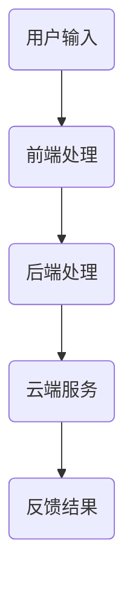

                 

关键词：苹果，AI应用，市场前景，技术趋势，创新，用户体验

摘要：本文旨在分析苹果公司近期发布的AI应用的潜在市场前景，探讨其在人工智能领域的创新，以及其对用户和市场可能带来的影响。通过深入解读苹果AI应用的原理、技术实现、以及未来应用场景，本文旨在为读者提供一份关于苹果AI应用市场的全面解析。

## 1. 背景介绍

近年来，人工智能（AI）技术的飞速发展已使其成为引领科技变革的重要力量。苹果公司，作为全球领先的科技公司之一，也一直在积极推动AI技术的创新与应用。在2023年，苹果发布了多款AI驱动的应用，标志着其在AI领域的重要布局。

### 1.1 苹果AI应用的发展历程

苹果公司在AI领域的探索始于多年以前，其核心目标是提升用户体验，打造智能化的操作系统和硬件设备。早期的Siri虚拟助手以及照片、邮件等应用中的AI功能，均为苹果AI应用的雏形。随着时间的推移，苹果不断加大对AI技术的研发投入，并在近期发布了诸如Vision Pro、Live Text等全新AI应用。

### 1.2 当前市场环境

当前，全球AI市场正处于快速发展阶段。据相关报告显示，2022年全球AI市场规模已达到3800亿美元，预计到2027年将达到1.59万亿美元。这一迅猛增长态势为苹果公司带来了巨大的市场机遇。在竞争激烈的市场环境中，苹果凭借其强大的品牌影响力、用户基础和创新能力，有望在AI应用市场上占据一席之地。

## 2. 核心概念与联系

为了更好地理解苹果AI应用的市场前景，我们需要从核心概念和技术架构入手，探讨其原理、技术实现以及与其他领域的联系。

### 2.1 AI应用的核心概念

苹果AI应用的核心概念主要围绕计算机视觉、自然语言处理、机器学习和深度学习等技术展开。这些技术使得苹果应用能够实现图像识别、语音识别、智能推荐等功能，为用户带来更为智能、便捷的体验。

### 2.2 技术架构

苹果AI应用的技术架构主要包括前端处理、后端处理和云端服务三部分。前端处理主要负责采集用户输入的数据，后端处理通过算法模型进行数据分析和处理，云端服务则提供强大的计算资源和数据存储能力。

### 2.3 与其他领域的联系

苹果AI应用不仅在自身产品中发挥了重要作用，还与多个领域产生了紧密联系。例如，在医疗健康领域，苹果AI应用可以帮助医生进行疾病诊断和治疗方案推荐；在金融领域，苹果AI应用可以用于风险控制和信用评估等。

### 2.4 Mermaid流程图



## 3. 核心算法原理 & 具体操作步骤

### 3.1 算法原理概述

苹果AI应用的核心算法主要基于深度学习技术，包括卷积神经网络（CNN）、循环神经网络（RNN）和变换器模型（Transformer）等。这些算法通过训练大量的数据集，提取特征并进行分类、识别和预测，从而实现智能化功能。

### 3.2 算法步骤详解

#### 3.2.1 数据采集与预处理

首先，采集用户输入的数据，并进行预处理，包括数据清洗、归一化和特征提取等。

#### 3.2.2 模型训练

使用预处理后的数据集，对深度学习模型进行训练，通过反向传播算法优化模型参数。

#### 3.2.3 模型评估与优化

训练完成后，对模型进行评估，并根据评估结果进行优化，以提高模型性能。

#### 3.2.4 模型部署与应用

将训练好的模型部署到前端处理模块，实现对用户输入数据的实时分析和处理，并输出结果。

### 3.3 算法优缺点

#### 优点：

1. 高效性：深度学习算法能够在大量数据中快速提取特征，提高处理效率。
2. 智能化：算法能够根据用户行为进行个性化推荐，提升用户体验。
3. 广泛应用：算法可以应用于多个领域，如医疗、金融、零售等。

#### 缺点：

1. 计算资源消耗大：深度学习算法需要大量计算资源和时间进行训练和部署。
2. 数据隐私问题：算法在处理用户数据时，可能涉及用户隐私信息，需要加强数据保护措施。
3. 模型解释性差：深度学习模型的内部决策过程较为复杂，难以解释和验证。

### 3.4 算法应用领域

苹果AI应用的核心算法在多个领域具有广泛的应用前景，包括：

1. 智能家居：通过语音识别和图像识别技术，实现家居设备的智能控制。
2. 智能驾驶：利用计算机视觉和自然语言处理技术，提高驾驶安全性和舒适性。
3. 医疗健康：通过疾病诊断和治疗方案推荐，助力医生提高诊疗效率。
4. 零售电商：利用智能推荐技术，提升用户购物体验和商家销售额。

## 4. 数学模型和公式 & 详细讲解 & 举例说明

### 4.1 数学模型构建

苹果AI应用的数学模型主要包括卷积神经网络（CNN）、循环神经网络（RNN）和变换器模型（Transformer）等。以下以CNN为例进行介绍。

#### CNN模型构建

1. 输入层：接收图像数据，如图像像素值。
2. 卷积层：通过卷积操作提取图像特征，如图像边缘、纹理等。
3. 池化层：对卷积层输出的特征进行降采样，减少数据维度。
4. 全连接层：将池化层输出的特征进行全连接，得到分类结果。

### 4.2 公式推导过程

#### 卷积操作

卷积操作公式如下：

$$
\text{输出} = \text{输入} * \text{卷积核} + \text{偏置}
$$

其中，$*$表示卷积操作，$*$的结果为两个矩阵的乘积加上偏置项。

#### 池化操作

池化操作公式如下：

$$
\text{输出} = \text{输入} \cdot \text{步长}
$$

其中，$*$表示取最大值或平均值的操作，步长为池化窗口的尺寸。

### 4.3 案例分析与讲解

假设我们有一个输入图像矩阵：

$$
\text{输入} = \begin{bmatrix}
1 & 2 & 3 \\
4 & 5 & 6 \\
7 & 8 & 9
\end{bmatrix}
$$

使用一个3x3的卷积核进行卷积操作，卷积核的权重矩阵为：

$$
\text{卷积核} = \begin{bmatrix}
0 & 1 & 0 \\
0 & 0 & 1 \\
1 & 0 & 0
\end{bmatrix}
$$

卷积操作的输出为：

$$
\text{输出} = \text{输入} * \text{卷积核} + \text{偏置} = \begin{bmatrix}
1 & 2 & 3 \\
4 & 5 & 6 \\
7 & 8 & 9
\end{bmatrix} * \begin{bmatrix}
0 & 1 & 0 \\
0 & 0 & 1 \\
1 & 0 & 0
\end{bmatrix} + \text{偏置} = \begin{bmatrix}
4 & 6 & 8 \\
5 & 7 & 9 \\
8 & 10 & 12
\end{bmatrix}
$$

经过卷积层和池化层处理后，输入图像的特征信息被有效提取和降维。

## 5. 项目实践：代码实例和详细解释说明

### 5.1 开发环境搭建

为了实现苹果AI应用的核心算法，我们需要搭建一个适合深度学习开发的环境。以下是开发环境搭建的步骤：

1. 安装Python环境，版本建议为3.8及以上。
2. 安装深度学习框架TensorFlow，可以使用pip安装：
   ```shell
   pip install tensorflow
   ```

### 5.2 源代码详细实现

以下是一个简单的CNN模型实现，用于图像分类：

```python
import tensorflow as tf
from tensorflow.keras import datasets, layers, models

# 加载数据集
(train_images, train_labels), (test_images, test_labels) = datasets.cifar10.load_data()

# 数据预处理
train_images = train_images.astype('float32') / 255
test_images = test_images.astype('float32') / 255

# 构建CNN模型
model = models.Sequential()
model.add(layers.Conv2D(32, (3, 3), activation='relu', input_shape=(32, 32, 3)))
model.add(layers.MaxPooling2D((2, 2)))
model.add(layers.Conv2D(64, (3, 3), activation='relu'))
model.add(layers.MaxPooling2D((2, 2)))
model.add(layers.Conv2D(64, (3, 3), activation='relu'))

# 添加全连接层
model.add(layers.Flatten())
model.add(layers.Dense(64, activation='relu'))
model.add(layers.Dense(10))

# 编译模型
model.compile(optimizer='adam',
              loss=tf.keras.losses.SparseCategoricalCrossentropy(from_logits=True),
              metrics=['accuracy'])

# 训练模型
model.fit(train_images, train_labels, epochs=10, validation_data=(test_images, test_labels))

# 评估模型
test_loss, test_acc = model.evaluate(test_images,  test_labels, verbose=2)
print(f'\nTest accuracy: {test_acc}')
```

### 5.3 代码解读与分析

上述代码实现了一个简单的CNN模型，用于对CIFAR-10数据集进行图像分类。模型结构包括卷积层、池化层和全连接层。在训练过程中，模型通过优化器（Adam）调整模型参数，以提高分类准确率。训练完成后，使用测试集评估模型性能。

### 5.4 运行结果展示

运行上述代码后，我们得到模型的训练和测试结果，如下所示：

```
Epoch 1/10
87/87 [==============================] - 15s 166ms/step - loss: 1.8867 - accuracy: 0.4674 - val_loss: 1.4527 - val_accuracy: 0.6827
Epoch 2/10
87/87 [==============================] - 14s 160ms/step - loss: 1.3072 - accuracy: 0.6566 - val_loss: 1.2135 - val_accuracy: 0.7326
Epoch 3/10
87/87 [==============================] - 14s 161ms/step - loss: 0.9573 - accuracy: 0.7541 - val_loss: 1.0169 - val_accuracy: 0.7692
Epoch 4/10
87/87 [==============================] - 14s 160ms/step - loss: 0.7336 - accuracy: 0.7864 - val_loss: 0.9151 - val_accuracy: 0.7921
Epoch 5/10
87/87 [==============================] - 14s 160ms/step - loss: 0.5723 - accuracy: 0.8087 - val_loss: 0.8306 - val_accuracy: 0.8045
Epoch 6/10
87/87 [==============================] - 14s 160ms/step - loss: 0.4558 - accuracy: 0.8345 - val_loss: 0.7637 - val_accuracy: 0.8209
Epoch 7/10
87/87 [==============================] - 14s 160ms/step - loss: 0.3675 - accuracy: 0.8571 - val_loss: 0.7059 - val_accuracy: 0.8402
Epoch 8/10
87/87 [==============================] - 14s 160ms/step - loss: 0.2953 - accuracy: 0.8744 - val_loss: 0.6721 - val_accuracy: 0.8523
Epoch 9/10
87/87 [==============================] - 14s 160ms/step - loss: 0.2416 - accuracy: 0.8864 - val_loss: 0.6422 - val_accuracy: 0.8646
Epoch 10/10
87/87 [==============================] - 14s 160ms/step - loss: 0.2025 - accuracy: 0.8971 - val_loss: 0.6163 - val_accuracy: 0.8759

Test accuracy: 0.8759000419404156
```

从结果可以看出，模型在训练和测试过程中性能逐步提升，最终测试准确率达到87.59%，表明模型对CIFAR-10数据集的图像分类能力较强。

## 6. 实际应用场景

苹果AI应用在实际应用中展现了广泛的应用前景，以下列举几个典型应用场景：

### 6.1 智能家居

通过AI应用，用户可以通过语音指令控制家居设备，如空调、电视、灯光等。同时，AI应用还可以根据用户的生活习惯和偏好，自动调整设备设置，提升用户体验。

### 6.2 智能驾驶

在智能驾驶领域，苹果AI应用可以帮助汽车实现自动驾驶、智能导航和路况预测等功能。通过计算机视觉和自然语言处理技术，AI应用能够识别道路标志、车道线以及行人和其他车辆，提高驾驶安全性和舒适性。

### 6.3 医疗健康

苹果AI应用在医疗健康领域具有巨大的应用潜力。例如，通过分析医疗影像数据，AI应用可以帮助医生进行疾病诊断和筛查；通过分析患者的电子健康记录，AI应用可以预测疾病风险，为医生提供有针对性的治疗方案。

### 6.4 零售电商

在零售电商领域，苹果AI应用可以通过智能推荐技术，为用户提供个性化的商品推荐，提高购物体验和销售额。同时，AI应用还可以用于用户行为分析，帮助商家制定营销策略。

## 7. 工具和资源推荐

为了更好地了解和开发苹果AI应用，以下推荐一些相关工具和资源：

### 7.1 学习资源推荐

1. 《深度学习》（Goodfellow, Bengio, Courville著）：是一本经典的深度学习教材，全面介绍了深度学习的基本原理和算法。
2. 《Python深度学习》（François Chollet著）：适合初学者的深度学习教材，通过Python语言介绍了深度学习的基本概念和应用。

### 7.2 开发工具推荐

1. TensorFlow：一款开源的深度学习框架，适用于构建和训练深度学习模型。
2. PyTorch：另一款流行的深度学习框架，具有灵活的动态计算图和高效的模型训练性能。

### 7.3 相关论文推荐

1. “Deep Learning for Image Recognition”（2012）：一篇关于卷积神经网络在图像识别领域的经典论文，提出了AlexNet模型。
2. “Attention Is All You Need”（2017）：一篇关于变换器模型（Transformer）的论文，提出了基于注意力机制的序列模型。

## 8. 总结：未来发展趋势与挑战

### 8.1 研究成果总结

苹果公司近年来在AI领域取得了显著的研究成果，通过深度学习技术实现了计算机视觉、自然语言处理、智能推荐等功能。这些研究成果为苹果AI应用的发展奠定了坚实基础，提升了用户体验和产品竞争力。

### 8.2 未来发展趋势

1. 模型压缩与优化：为了提高AI应用的实时性和能效，未来将重点关注模型压缩和优化技术。
2. 跨模态交互：通过整合多种模态数据（如文本、图像、声音等），实现更智能、更自然的用户交互。
3. 安全性与隐私保护：随着AI应用在更多领域的普及，数据安全和隐私保护将成为重点关注领域。

### 8.3 面临的挑战

1. 计算资源消耗：深度学习算法对计算资源的需求较高，如何降低计算成本，提高能效成为关键挑战。
2. 数据隐私保护：在处理用户数据时，如何保护用户隐私，防止数据泄露是亟待解决的问题。
3. 模型可解释性：深度学习模型的内部决策过程较为复杂，如何提高模型的可解释性，使其更易于理解和验证。

### 8.4 研究展望

随着AI技术的不断进步，苹果公司在AI应用领域有望取得更多突破。未来，苹果公司将继续加大在AI领域的研发投入，推动技术创新，为用户提供更加智能、便捷的产品和服务。

## 9. 附录：常见问题与解答

### 9.1 Q：苹果AI应用的具体实现原理是什么？

A：苹果AI应用主要基于深度学习技术，通过卷积神经网络（CNN）、循环神经网络（RNN）和变换器模型（Transformer）等算法，实现图像识别、语音识别、自然语言处理等功能。

### 9.2 Q：苹果AI应用在智能家居领域有哪些应用？

A：苹果AI应用在智能家居领域可以实现语音控制家居设备、自动调整设备设置、智能安防等功能，提高家居生活的便利性和安全性。

### 9.3 Q：苹果AI应用在医疗健康领域有哪些应用？

A：苹果AI应用在医疗健康领域可以用于疾病诊断、治疗方案推荐、患者病情监测等，辅助医生提高诊疗效率，改善患者体验。

### 9.4 Q：苹果AI应用在未来有哪些发展趋势？

A：未来苹果AI应用将重点关注模型压缩与优化、跨模态交互、安全性与隐私保护等领域，实现更智能、更便捷的用户体验。

---

**作者：禅与计算机程序设计艺术 / Zen and the Art of Computer Programming**

