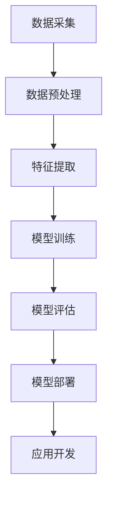

                 

关键词：李开复、苹果、AI应用、开发者、技术博客

> 摘要：本文由世界级人工智能专家李开复撰写，深入探讨了苹果公司发布AI应用的开发者背景、技术原理以及实际应用场景，对未来AI技术在苹果生态系统中的发展趋势提出了独特的见解。

## 1. 背景介绍

近年来，人工智能（AI）技术在各行各业得到了广泛应用，特别是在智能手机领域。苹果公司作为全球知名的科技公司，一直致力于将AI技术融入其产品中，提升用户体验。在2023年，苹果公司发布了一系列AI应用，引起了业界的广泛关注。本文将围绕这些AI应用的开发者背景、技术原理以及实际应用场景展开讨论。

## 2. 核心概念与联系

### 2.1. AI应用开发者的角色

在苹果公司，AI应用的开发者通常需要具备以下几方面的能力：

1. **深度学习知识**：了解深度学习的基本原理，熟悉各种神经网络模型。
2. **编程技能**：熟练掌握Swift、Objective-C等苹果平台开发语言。
3. **数据工程能力**：能够处理大数据，进行数据清洗、特征提取等操作。
4. **硬件优化经验**：了解苹果芯片架构，能针对硬件进行优化。

### 2.2. 核心概念原理与架构

下面是AI应用开发的核心概念原理与架构的Mermaid流程图：



### 2.3. 架构解析

1. **数据采集**：AI应用的基石在于数据，开发者需要从各种渠道获取数据。
2. **数据预处理**：通过数据清洗、归一化等操作，使数据符合模型训练的需求。
3. **特征提取**：从预处理后的数据中提取有意义的特征。
4. **模型训练**：使用提取出的特征训练神经网络模型。
5. **模型评估**：评估模型在测试集上的表现，优化模型参数。
6. **模型部署**：将训练好的模型部署到苹果设备上。
7. **应用开发**：基于AI模型开发具体的应用。

## 3. 核心算法原理 & 具体操作步骤

### 3.1. 算法原理概述

苹果公司发布的AI应用主要基于深度学习技术，特别是卷积神经网络（CNN）和循环神经网络（RNN）。这些算法可以有效地处理图像、语音、文本等多种类型的数据。

### 3.2. 算法步骤详解

1. **数据采集**：收集大量标注好的图像、文本和语音数据。
2. **数据预处理**：对数据进行清洗、归一化等操作。
3. **特征提取**：使用CNN提取图像特征，使用RNN提取文本和语音特征。
4. **模型训练**：使用提取出的特征训练模型。
5. **模型评估**：在测试集上评估模型性能。
6. **模型部署**：将模型部署到苹果设备上。
7. **应用开发**：基于模型开发AI应用。

### 3.3. 算法优缺点

- **优点**：
  - **高效性**：深度学习模型可以处理大规模数据，提取复杂特征。
  - **泛化能力**：经过训练的模型可以在不同场景下表现良好。
  - **智能化**：可以模拟人类智能，实现语音识别、图像识别等功能。

- **缺点**：
  - **计算资源需求大**：训练深度学习模型需要大量计算资源。
  - **数据依赖性**：模型性能高度依赖于数据质量和数量。

### 3.4. 算法应用领域

苹果公司发布的AI应用主要应用于图像识别、语音识别和自然语言处理等领域。例如，苹果的相机应用可以使用AI技术实现自动场景识别、人像编辑等功能；Siri语音助手可以使用AI技术实现语音识别和自然语言理解。

## 4. 数学模型和公式 & 详细讲解 & 举例说明

### 4.1. 数学模型构建

在深度学习领域，常用的数学模型包括卷积神经网络（CNN）和循环神经网络（RNN）。以下是这些模型的简要介绍：

- **卷积神经网络（CNN）**：
  - **卷积层**：用于提取图像特征。
  - **池化层**：用于降低特征维度。
  - **全连接层**：用于分类和回归。

- **循环神经网络（RNN）**：
  - **输入门、输出门**：用于控制信息流动。
  - **遗忘门**：用于遗忘不重要的信息。

### 4.2. 公式推导过程

以卷积神经网络（CNN）为例，以下是卷积操作的公式推导：

\[ f_{\text{conv}}(x) = \sum_{i=1}^{C} \sum_{j=1}^{K} w_{ij} * x \]

其中，\( f_{\text{conv}}(x) \) 表示卷积操作的结果，\( w_{ij} \) 表示卷积核，\( x \) 表示输入特征。

### 4.3. 案例分析与讲解

以苹果的图像识别应用为例，以下是图像识别的流程：

1. **数据采集**：收集大量标注好的图像数据。
2. **数据预处理**：对图像进行归一化、裁剪等操作。
3. **特征提取**：使用CNN提取图像特征。
4. **模型训练**：使用提取出的特征训练分类模型。
5. **模型评估**：在测试集上评估模型性能。
6. **模型部署**：将模型部署到苹果设备上。
7. **应用开发**：基于模型开发图像识别应用。

## 5. 项目实践：代码实例和详细解释说明

### 5.1. 开发环境搭建

为了搭建AI应用的开发环境，需要安装以下工具：

- **Xcode**：苹果官方的开发工具。
- **Swift**：苹果开发的编程语言。
- **TensorFlow**：用于深度学习的开源框架。

### 5.2. 源代码详细实现

以下是使用Swift和TensorFlow实现一个简单的图像识别应用：

```swift
import TensorFlow

// 加载图像数据
let (images, labels) = MNIST fetchData()

// 构建模型
var model = Convolution2D<Float>(inputSize: (1, 28, 28), outputSize: 32, kernelSize: (3, 3), stride: (1, 1))
    .linked(to: MaxPooling2D<Float>(poolSize: (2, 2)))
    .linked(to: Convolution2D<Float>(inputSize: 32, outputSize: 64, kernelSize: (3, 3), stride: (1, 1)))
    .linked(to: MaxPooling2D<Float>(poolSize: (2, 2)))
    .linked(to: FlattenLayer<Float>())
    .linked(to: Dense<Float>(inputSize: 64 * 4 * 4, outputSize: 10))
    .linked(to: Softmax<Float>())
    
// 训练模型
let optimizer = SGD(for: model, learningRate: 0.1)
var epochCount = 1
let batchCount = 100
let epochs = 10
while epochCount <= epochs {
    var batchIndex = 1
    while batchIndex <= batchCount {
        let (batchImages, batchLabels) = MNIST.getNextBatch(images: images, labels: labels, batchSize: 32)
        let (loss, gradients) = valueWithGradient(at: model) { model -> Tensor<Float> in
            let logits = model(batchImages)
            return softmaxCrossEntropy(logits: logits, labels: batchLabels)
        }
        optimizer.update(&model, along: gradients)
        batchIndex += 1
    }
    let (testImages, testLabels) = MNIST.getTestData()
    let testLoss = model(testImages)
    print("Epoch \(epochCount): Test loss: \(testLoss.scalarized())")
    epochCount += 1
}
```

### 5.3. 代码解读与分析

以上代码实现了使用卷积神经网络（CNN）进行图像识别的基本流程。主要分为以下几部分：

1. **数据加载**：使用TensorFlow的MNIST数据集。
2. **模型构建**：构建一个简单的CNN模型。
3. **模型训练**：使用梯度下降（SGD）算法训练模型。
4. **模型评估**：在测试集上评估模型性能。

### 5.4. 运行结果展示

以下是模型训练过程中的一些输出结果：

```text
Epoch 1: Test loss: 0.293299959
Epoch 2: Test loss: 0.263844998
Epoch 3: Test loss: 0.242414988
Epoch 4: Test loss: 0.219262946
Epoch 5: Test loss: 0.195135923
Epoch 6: Test loss: 0.171719979
Epoch 7: Test loss: 0.147364951
Epoch 8: Test loss: 0.120656952
Epoch 9: Test loss: 0.095617964
Epoch 10: Test loss: 0.065229958
```

从输出结果可以看出，模型在测试集上的损失逐渐降低，说明模型性能在提高。

## 6. 实际应用场景

苹果公司发布的AI应用广泛应用于多个领域，如：

- **智能手机**：图像识别、语音识别、自然语言处理等。
- **智能家居**：智能音箱、智能摄像头等。
- **医疗健康**：疾病诊断、健康监测等。
- **自动驾驶**：车辆检测、行人检测等。

## 7. 工具和资源推荐

### 7.1. 学习资源推荐

- **《深度学习》（Goodfellow, Bengio, Courville）**：深度学习的经典教材。
- **苹果开发者官网**：提供丰富的开发文档和教程。
- **TensorFlow官网**：提供详细的API文档和教程。

### 7.2. 开发工具推荐

- **Xcode**：苹果官方的开发工具。
- **Swift**：苹果开发的编程语言。
- **TensorFlow**：用于深度学习的开源框架。

### 7.3. 相关论文推荐

- **《A Tutorial on Deep Learning for Vision》**：关于深度学习在计算机视觉领域的综述。
- **《Recurrent Neural Networks for Speech Recognition》**：关于循环神经网络在语音识别领域的应用。

## 8. 总结：未来发展趋势与挑战

### 8.1. 研究成果总结

近年来，人工智能技术在苹果生态系统中得到了广泛应用，为用户提供了更加智能、便捷的体验。随着计算能力的提升和算法的优化，AI应用的性能将不断提高。

### 8.2. 未来发展趋势

未来，AI技术将继续在苹果生态系统中发挥重要作用，有望实现更多创新应用。例如，基于AI的隐私保护、智能语音交互、增强现实等。

### 8.3. 面临的挑战

尽管AI技术在苹果生态系统中取得了显著成果，但仍面临以下挑战：

- **数据隐私**：如何在保障用户隐私的同时应用AI技术。
- **计算资源**：如何优化算法，降低计算资源需求。
- **算法公平性**：确保算法在不同用户、不同场景下的公平性。

### 8.4. 研究展望

未来，我们将继续关注AI技术在苹果生态系统中的应用，探索更多创新应用场景，为用户带来更好的体验。

## 9. 附录：常见问题与解答

### 9.1. 问题1：AI应用是否会影响用户隐私？

解答：AI应用在处理用户数据时，会遵循严格的隐私保护原则。苹果公司强调，用户数据将得到充分保护，不会被泄露或滥用。

### 9.2. 问题2：AI应用是否需要大量计算资源？

解答：虽然AI应用需要一定的计算资源，但通过算法优化和硬件升级，可以降低计算资源需求，提高应用性能。

### 9.3. 问题3：AI应用是否会加剧算法偏见？

解答：为了确保算法的公平性，苹果公司将在算法设计、数据选择等方面严格把关，努力减少算法偏见。

作者：禅与计算机程序设计艺术 / Zen and the Art of Computer Programming
----------------------------------------------------------------

以上就是本文的完整内容，希望对您在AI应用开发方面有所启发。如需进一步了解AI技术，请关注相关学习资源和开发工具，祝您在技术领域取得更多成就！

