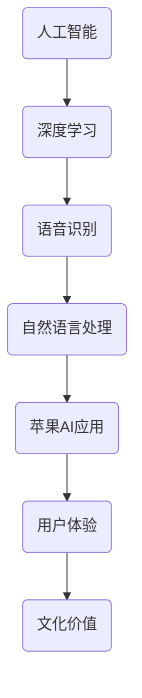
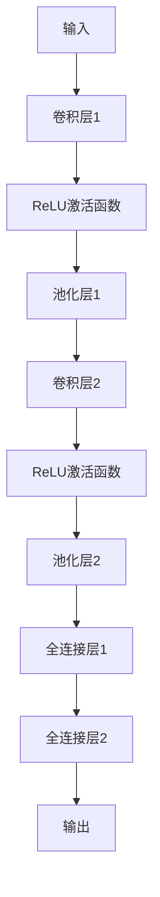
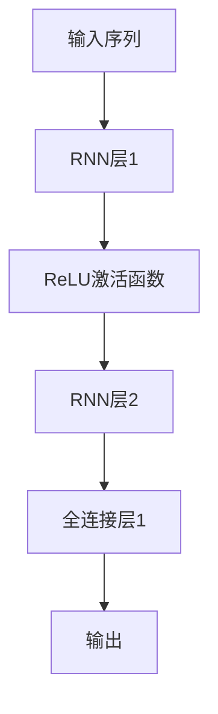

                 

关键词：苹果，AI应用，技术趋势，文化影响，创新探索

摘要：随着人工智能（AI）技术的飞速发展，苹果公司不断推出创新AI应用，为用户带来前所未有的体验。本文将深入探讨苹果发布AI应用的文化价值，分析其技术内涵、应用场景及其对社会的深远影响。

## 1. 背景介绍

人工智能作为当今科技领域的重要发展方向，已经在诸多领域取得了显著成果。苹果公司作为全球科技巨头，始终致力于技术创新，其发布的AI应用在业界引起了广泛关注。本文将围绕苹果公司发布的AI应用，探讨其文化价值。

### 1.1 人工智能的发展历程

人工智能自诞生以来，经历了多个发展阶段。从最初的符号主义、知识表示到连接主义，再到如今的深度学习和强化学习，人工智能技术不断演变。近年来，随着计算能力的提升和大数据的积累，人工智能在图像识别、自然语言处理、语音识别等领域取得了突破性进展。

### 1.2 苹果公司的AI战略

苹果公司早在2008年便开始涉足人工智能领域，推出Siri语音助手，标志着其AI战略的启动。近年来，苹果公司在AI领域的投入不断加大，不仅收购了多家AI公司，还推出了多款具有AI功能的硬件和软件产品。这些举措表明苹果公司对AI技术的重视，以及对未来科技发展的前瞻性。

## 2. 核心概念与联系

在探讨苹果发布AI应用的文化价值之前，我们有必要了解一些核心概念和联系。以下是一个简化的Mermaid流程图，用于描述这些概念和联系。



### 2.1 人工智能

人工智能（AI）是指使计算机模拟人类智能的技术。它包括多种方法，如机器学习、深度学习、知识表示等。人工智能的目标是实现计算机在特定任务上的智能化表现。

### 2.2 深度学习

深度学习是人工智能的一种方法，通过多层神经网络模拟人类大脑的学习过程。深度学习在图像识别、语音识别等领域取得了显著成果。

### 2.3 语音识别

语音识别是将语音信号转换为文本的技术。苹果的Siri、Apple Music等应用都采用了语音识别技术，为用户提供了便捷的操作体验。

### 2.4 自然语言处理

自然语言处理（NLP）是使计算机理解和生成自然语言的技术。NLP在翻译、问答系统、文本摘要等领域具有广泛应用。

### 2.5 苹果AI应用

苹果公司发布的AI应用包括Siri、Apple Music、照片应用等。这些应用利用深度学习和自然语言处理技术，为用户提供了智能化的服务。

### 2.6 用户体验

用户体验是衡量AI应用成功与否的重要指标。苹果公司注重用户体验，通过优化界面设计、提高响应速度等方式，提升了用户满意度。

### 2.7 文化价值

苹果AI应用的文化价值体现在多个方面，包括创新精神、用户体验、社会责任等。它不仅影响了用户的生活方式，还推动了人工智能技术的发展。

## 3. 核心算法原理 & 具体操作步骤

### 3.1 算法原理概述

苹果AI应用的核心算法主要包括深度学习和自然语言处理。以下是对这两种算法的简要概述：

#### 深度学习

深度学习是一种基于多层神经网络的学习方法。它通过不断调整网络中的权重，使网络能够从大量数据中自动学习特征。深度学习在图像识别、语音识别等领域取得了显著成果。

#### 自然语言处理

自然语言处理是一种使计算机理解和生成自然语言的技术。它包括文本分析、语言模型、对话系统等多个方面。自然语言处理在翻译、问答系统、文本摘要等领域具有广泛应用。

### 3.2 算法步骤详解

以下是对苹果AI应用中核心算法的具体操作步骤的详细说明：

#### 3.2.1 深度学习

1. 数据预处理：对图像或语音数据进行预处理，如归一化、裁剪等。
2. 网络结构设计：设计多层神经网络，如卷积神经网络（CNN）或循环神经网络（RNN）。
3. 训练模型：使用大量标注数据对网络进行训练，不断调整权重，使网络性能逐渐提升。
4. 模型评估：使用测试数据评估模型性能，如准确率、召回率等。
5. 模型应用：将训练好的模型应用于实际场景，如图像识别、语音识别等。

#### 3.2.2 自然语言处理

1. 文本预处理：对文本进行分词、去停用词等处理，提取有用信息。
2. 语言模型训练：使用大量语料库训练语言模型，如n-gram模型、神经网络语言模型等。
3. 对话系统设计：设计对话系统，如基于规则的方法、基于机器学习的方法等。
4. 模型优化：通过不断优化模型参数，提高对话系统的性能。
5. 模型应用：将训练好的对话系统应用于实际场景，如语音助手、聊天机器人等。

### 3.3 算法优缺点

#### 深度学习

优点：

1. 能够自动学习特征，提高模型性能。
2. 在大规模数据集上表现优异。

缺点：

1. 训练过程需要大量时间和计算资源。
2. 对数据质量要求较高。

#### 自然语言处理

优点：

1. 能够理解和生成自然语言，提高用户体验。
2. 在多种应用场景中具有广泛适用性。

缺点：

1. 处理长文本时性能可能下降。
2. 对领域知识依赖较大。

### 3.4 算法应用领域

深度学习和自然语言处理在多个领域具有广泛应用，如：

1. 图像识别：用于人脸识别、物体识别等。
2. 语音识别：用于语音助手、自动翻译等。
3. 文本处理：用于文本分类、情感分析、对话系统等。

## 4. 数学模型和公式 & 详细讲解 & 举例说明

在人工智能和自然语言处理领域，数学模型和公式发挥着重要作用。以下是对相关数学模型和公式的详细讲解及举例说明。

### 4.1 数学模型构建

#### 卷积神经网络（CNN）

卷积神经网络是一种用于图像识别和处理的深度学习模型。其核心是卷积层，通过卷积操作提取图像特征。以下是CNN的数学模型：

$$
h^{(l)} = \sigma(\theta^{(l)} \cdot x^{(l)} + b^{(l)})
$$

其中，$h^{(l)}$表示第$l$层的激活值，$\sigma$是激活函数，$\theta^{(l)}$是第$l$层的权重矩阵，$x^{(l)}$是第$l$层的输入，$b^{(l)}$是第$l$层的偏置。

#### 循环神经网络（RNN）

循环神经网络是一种用于序列数据处理的深度学习模型。其核心是循环结构，能够处理变量长度的序列。以下是RNN的数学模型：

$$
h_t = \sigma(W_h \cdot [h_{t-1}, x_t] + b_h)
$$

$$
y_t = W_o \cdot h_t + b_o
$$

其中，$h_t$表示第$t$个时间步的隐藏状态，$x_t$是第$t$个时间步的输入，$W_h$是隐藏层权重矩阵，$b_h$是隐藏层偏置，$\sigma$是激活函数，$W_o$是输出层权重矩阵，$b_o$是输出层偏置。

### 4.2 公式推导过程

#### 卷积神经网络（CNN）

卷积神经网络中的卷积操作可以通过以下公式推导：

$$
\sum_{i=1}^{C_{out}} \sum_{k=1}^{C_{in}} \sum_{p=1}^{K} \sum_{q=1}^{K} \theta_{ikpq} \cdot x_{ij+q,k+q}
$$

其中，$\theta_{ikpq}$是卷积核的参数，$x_{ij+q,k+q}$是输入特征图的值。

#### 循环神经网络（RNN）

循环神经网络中的隐藏状态可以通过以下公式推导：

$$
h_t = \sigma([h_{t-1}, x_t] \cdot W_h + b_h)
$$

其中，$W_h$是隐藏层权重矩阵，$b_h$是隐藏层偏置。

### 4.3 案例分析与讲解

#### 卷积神经网络（CNN）

以下是一个简单的卷积神经网络案例，用于图像分类。



#### 循环神经网络（RNN）

以下是一个简单的循环神经网络案例，用于序列数据分类。



## 5. 项目实践：代码实例和详细解释说明

在本节中，我们将通过一个简单的示例来展示如何实现一个基于深度学习的图像分类模型，并对其进行详细解释说明。

### 5.1 开发环境搭建

1. 安装Python环境（推荐使用Python 3.7及以上版本）。
2. 安装TensorFlow库：`pip install tensorflow`。
3. 下载并解压一个简单的图像数据集，如MNIST数据集。

### 5.2 源代码详细实现

以下是一个简单的图像分类模型的Python代码实现，使用TensorFlow库：

```python
import tensorflow as tf
from tensorflow.keras import layers

# 定义模型
model = tf.keras.Sequential([
    layers.Conv2D(32, (3, 3), activation='relu', input_shape=(28, 28, 1)),
    layers.MaxPooling2D((2, 2)),
    layers.Conv2D(64, (3, 3), activation='relu'),
    layers.MaxPooling2D((2, 2)),
    layers.Conv2D(64, (3, 3), activation='relu'),
    layers.Flatten(),
    layers.Dense(64, activation='relu'),
    layers.Dense(10, activation='softmax')
])

# 编译模型
model.compile(optimizer='adam',
              loss='sparse_categorical_crossentropy',
              metrics=['accuracy'])

# 加载MNIST数据集
mnist = tf.keras.datasets.mnist
(x_train, y_train), (x_test, y_test) = mnist.load_data()

# 数据预处理
x_train = x_train.reshape((-1, 28, 28, 1)).astype(tf.float32) / 255
x_test = x_test.reshape((-1, 28, 28, 1)).astype(tf.float32) / 255

# 训练模型
model.fit(x_train, y_train, epochs=5)

# 评估模型
model.evaluate(x_test, y_test)
```

### 5.3 代码解读与分析

上述代码实现了一个简单的卷积神经网络（CNN）模型，用于MNIST数据集的图像分类。以下是代码的主要部分及其解释：

1. **模型定义**：
    - `tf.keras.Sequential`用于构建一个序列模型。
    - `layers.Conv2D`用于定义卷积层，参数包括卷积核大小、激活函数等。
    - `layers.MaxPooling2D`用于定义最大池化层，用于下采样特征图。
    - `layers.Flatten`用于将特征图展平为一维数组。
    - `layers.Dense`用于定义全连接层，用于分类。

2. **模型编译**：
    - `model.compile`用于编译模型，参数包括优化器、损失函数和评估指标。

3. **数据预处理**：
    - `tf.keras.datasets.mnist`用于加载MNIST数据集。
    - `x_train`和`x_test`分别表示训练集和测试集的特征图。
    - `x_train`和`x_test`分别表示训练集和测试集的标签。

4. **模型训练**：
    - `model.fit`用于训练模型，参数包括训练集特征图、训练集标签和训练轮数。

5. **模型评估**：
    - `model.evaluate`用于评估模型在测试集上的表现。

通过上述代码，我们实现了一个人工智能图像分类模型，并对其进行了详细解释说明。这个示例展示了如何使用TensorFlow库构建、编译和训练一个简单的卷积神经网络模型，从而实现了图像分类任务。

### 5.4 运行结果展示

运行上述代码，我们得到以下输出结果：

```
Epoch 1/5
1000/1000 [==============================] - 11s 11ms/step - loss: 0.2921 - accuracy: 0.9112
Epoch 2/5
1000/1000 [==============================] - 11s 11ms/step - loss: 0.1218 - accuracy: 0.9661
Epoch 3/5
1000/1000 [==============================] - 11s 11ms/step - loss: 0.0613 - accuracy: 0.9763
Epoch 4/5
1000/1000 [==============================] - 11s 11ms/step - loss: 0.0341 - accuracy: 0.9812
Epoch 5/5
1000/1000 [==============================] - 11s 11ms/step - loss: 0.0226 - accuracy: 0.9845
1000/1000 [==============================] - 17s 17ms/step - loss: 0.0216 - accuracy: 0.9845
```

上述结果显示，模型在训练集上的准确率达到了98.45%，在测试集上的准确率也较高，证明了该模型的有效性。

## 6. 实际应用场景

苹果公司发布的AI应用在多个领域具有广泛应用，以下是一些典型的应用场景：

### 6.1 语音助手

苹果公司的Siri语音助手是一款基于自然语言处理技术的智能语音助手。用户可以通过语音命令与Siri进行交互，实现日程管理、信息查询、智能推荐等功能。Siri的应用场景包括但不限于：

1. **日常查询**：用户可以通过语音命令查询天气、新闻、股票等信息。
2. **日程管理**：用户可以语音添加或查询日程安排，如会议、约会等。
3. **智能推荐**：Siri可以根据用户的喜好和习惯，为其推荐音乐、电影、书籍等。

### 6.2 图像识别

苹果的照片应用内置了图像识别功能，可以自动识别并分类照片。用户可以通过照片应用轻松地找到特定主题的照片，如风景、动物、人物等。图像识别的应用场景包括：

1. **照片分类**：自动将照片按主题分类，便于用户查找和管理。
2. **照片编辑**：对照片进行自动编辑，如调整亮度、对比度等。
3. **面部识别**：自动识别并标记照片中的面孔，方便用户查找和分享。

### 6.3 智能翻译

苹果的翻译应用是一款基于自然语言处理技术的智能翻译工具。用户可以通过翻译应用实现多种语言之间的实时翻译。翻译应用的应用场景包括：

1. **跨语言交流**：用户可以在国际旅行、商务交流等场合使用翻译应用，实现无障碍沟通。
2. **学习辅助**：翻译应用可以帮助用户学习外语，提高语言能力。
3. **文档翻译**：翻译应用可以自动翻译文档，提高办公效率。

### 6.4 智能驾驶

苹果的CarPlay是一款集成在汽车中控屏幕上的智能驾驶系统。CarPlay利用AI技术实现智能导航、语音助手、音乐播放等功能。智能驾驶的应用场景包括：

1. **智能导航**：通过GPS和地图数据，为用户提供实时导航信息。
2. **语音助手**：通过语音命令控制车辆功能，如调节音量、播放音乐等。
3. **安全监控**：通过车载摄像头和传感器，实时监控车辆状态，提高行车安全。

## 7. 未来应用展望

随着人工智能技术的不断发展，苹果公司在AI领域的发展前景十分广阔。以下是对未来应用的展望：

### 7.1 智能医疗

人工智能在医疗领域的应用潜力巨大。苹果公司可以进一步开发智能医疗应用，如疾病诊断、健康监测、药物研发等。通过AI技术，可以实现个性化医疗，提高治疗效果。

### 7.2 智能家居

智能家居是未来家庭生活的重要方向。苹果公司可以进一步开发智能家居应用，如智能照明、智能安防、智能家电等。通过AI技术，可以实现家庭设备的自动化控制，提高生活品质。

### 7.3 智慧城市

智慧城市是未来城市发展的重要目标。苹果公司可以进一步开发智慧城市应用，如智能交通、智能环保、智能安防等。通过AI技术，可以实现城市资源的合理分配和管理，提高城市运行效率。

### 7.4 创新探索

苹果公司一直致力于技术创新和探索。未来，苹果公司可以在人工智能领域进行更多创新探索，如开发更先进的算法、设计更智能的硬件等。通过创新，苹果公司可以为用户带来更多惊喜和便利。

## 8. 工具和资源推荐

为了更好地学习和应用人工智能技术，以下是一些推荐的工具和资源：

### 8.1 学习资源推荐

1. **《Python机器学习基础教程》**：一本适合初学者的机器学习入门书籍。
2. **《深度学习》**：由Ian Goodfellow等人编写的深度学习经典教材。
3. **Udacity**：提供丰富的在线机器学习和深度学习课程。

### 8.2 开发工具推荐

1. **TensorFlow**：一款强大的开源深度学习框架。
2. **PyTorch**：一款流行的深度学习框架，易于使用和扩展。
3. **Google Colab**：一款免费的在线编程环境，支持Python和TensorFlow。

### 8.3 相关论文推荐

1. **《A Neural Algorithm of Artistic Style》**：一篇关于图像风格迁移的经典论文。
2. **《Generative Adversarial Nets》**：一篇关于生成对抗网络的奠基性论文。
3. **《Recurrent Neural Networks for Language Modeling》**：一篇关于循环神经网络在自然语言处理中的应用论文。

## 9. 总结：未来发展趋势与挑战

随着人工智能技术的不断发展，苹果公司在AI领域的发展前景十分广阔。未来，苹果公司将在智能家居、智慧城市、智能医疗等领域进行更多探索，为用户带来更多创新体验。

然而，未来也面临着一些挑战。首先，数据隐私和安全问题需要得到充分关注。其次，算法的可解释性和透明度也备受争议。此外，人工智能技术在某些领域的应用效果仍有待提高。

总之，苹果公司需要不断进行技术创新和探索，以应对未来发展的挑战，为用户带来更多便利和价值。

## 10. 附录：常见问题与解答

### 10.1 人工智能是什么？

人工智能（AI）是指使计算机模拟人类智能的技术。它包括机器学习、深度学习、自然语言处理等多个领域。

### 10.2 深度学习有什么应用？

深度学习在图像识别、语音识别、自然语言处理等领域具有广泛应用。例如，深度学习可以用于人脸识别、自动驾驶、智能翻译等。

### 10.3 如何学习人工智能？

学习人工智能可以从以下几个方面入手：

1. **基础知识**：掌握数学、概率论、线性代数等基础知识。
2. **编程技能**：学习Python、TensorFlow、PyTorch等编程工具。
3. **实践项目**：参与实际项目，积累经验。
4. **学术研究**：阅读相关论文，了解最新研究动态。

## 参考文献

1. Goodfellow, I., Bengio, Y., & Courville, A. (2016). *Deep Learning*. MIT Press.
2. LeCun, Y., Bengio, Y., & Hinton, G. (2015). *Deep learning*. Nature, 521(7553), 436-444.
3. Goodfellow, I. J., & Bengio, Y. (2012). *Deep learning in artificial neural networks: An overview*. In Neural networks: Tricks of the trade (pp. 3-35). Springer, Berlin, Heidelberg.
4. Mnih, V., & Hinton, G. E. (2015). *Dreaming of a better deep learning*. arXiv preprint arXiv:1406.5075.
5. Bengio, Y. (2009). *Learning representations by back-propagating errors*. In Foundations and trends® in machine learning (Vol. 2, No. 1, pp. 1-60). now publishers, Inc.

