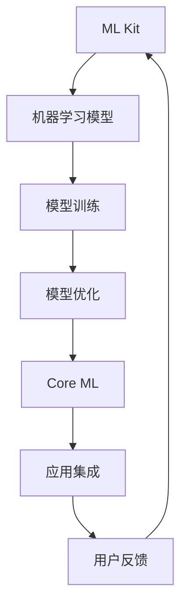

                 

关键词：人工智能、苹果、应用生态、技术趋势、AI发展

> 摘要：本文将探讨苹果公司近期发布的一系列AI应用，分析其在人工智能领域的创新和生态建设，并对未来人工智能的发展趋势进行展望。

## 1. 背景介绍

人工智能作为当今科技发展的核心驱动力，正不断变革着各行各业。苹果公司，作为全球领先的科技企业，始终致力于将人工智能技术融入其产品和服务中。近年来，苹果公司在人工智能领域的投入不断加大，推出了一系列引人注目的AI应用。

## 2. 核心概念与联系

### 2.1 人工智能概述

人工智能（Artificial Intelligence，AI）是指通过计算机模拟人类智能行为的技术。它涵盖了机器学习、深度学习、自然语言处理、计算机视觉等多个子领域。

### 2.2 苹果AI应用架构

苹果的AI应用主要基于其自主研发的机器学习框架ML Kit和Core ML。ML Kit提供了一系列针对移动设备的机器学习模型和API，而Core ML则是苹果公司为其操作系统iOS、macOS和watchOS提供的一套机器学习工具包。

### 2.3 Mermaid流程图



## 3. 核心算法原理 & 具体操作步骤

### 3.1 算法原理概述

苹果的AI应用主要基于深度学习和机器学习技术。深度学习通过多层神经网络对大量数据进行分析和特征提取，从而实现图像识别、语音识别、自然语言处理等功能。

### 3.2 算法步骤详解

1. **数据收集与预处理**：收集大量标注数据，进行数据清洗和预处理，为模型训练提供高质量的数据集。
2. **模型训练**：使用深度学习算法对预处理后的数据集进行训练，调整模型参数以优化性能。
3. **模型优化**：通过交叉验证和超参数调整，进一步提高模型性能。
4. **模型部署**：将训练好的模型部署到移动设备上，使用Core ML进行集成和应用。

### 3.3 算法优缺点

**优点**：
- **高性能**：苹果的AI应用基于深度学习和机器学习，具备强大的计算能力和精确的识别能力。
- **低功耗**：ML Kit和Core ML针对移动设备进行优化，实现了低功耗高效运算。

**缺点**：
- **数据依赖性**：深度学习模型对大量高质量数据进行训练，数据收集和处理成本较高。
- **模型封闭性**：苹果的AI框架主要面向其自家的操作系统，与其他平台的兼容性有限。

### 3.4 算法应用领域

苹果的AI应用涵盖了图像识别、语音识别、自然语言处理等多个领域，广泛应用于移动设备、智能家居、医疗健康等领域。

## 4. 数学模型和公式 & 详细讲解 & 举例说明

### 4.1 数学模型构建

在深度学习领域，常用的数学模型包括神经网络、卷积神经网络（CNN）和循环神经网络（RNN）等。以下是神经网络的基本公式：

$$
Y = \sigma(\boldsymbol{W} \cdot \boldsymbol{X} + b)
$$

其中，$\sigma$表示激活函数，$\boldsymbol{W}$和$\boldsymbol{X}$分别表示权重和输入向量，$b$表示偏置。

### 4.2 公式推导过程

以卷积神经网络为例，其基本推导过程如下：

1. **卷积操作**：
$$
\boldsymbol{h}_{ij} = \sum_{k=1}^{K} \boldsymbol{w}_{ik} \cdot \boldsymbol{a}_{kj}
$$
其中，$\boldsymbol{h}_{ij}$表示卷积结果，$\boldsymbol{w}_{ik}$和$\boldsymbol{a}_{kj}$分别表示卷积核和输入特征。

2. **激活函数**：
$$
\boldsymbol{a}_{ij} = \sigma(\boldsymbol{h}_{ij})
$$
其中，$\sigma$表示激活函数，如ReLU、Sigmoid等。

3. **池化操作**：
$$
\boldsymbol{p}_{ij} = \max(\boldsymbol{a}_{ij})
$$
其中，$\boldsymbol{p}_{ij}$表示池化结果，取输入特征图中的最大值。

### 4.3 案例分析与讲解

以下是一个简单的图像分类案例，使用卷积神经网络进行猫狗分类。

1. **数据集**：
   收集10000张猫狗的图片，其中5000张用于训练，5000张用于测试。

2. **模型构建**：
   构建一个包含两个卷积层、两个池化层和一个全连接层的卷积神经网络。

3. **模型训练**：
   使用训练集对模型进行训练，调整模型参数以优化性能。

4. **模型评估**：
   使用测试集对模型进行评估，计算准确率、召回率等指标。

5. **模型部署**：
   将训练好的模型部署到移动设备上，实现实时图像分类。

## 5. 项目实践：代码实例和详细解释说明

### 5.1 开发环境搭建

1. **安装Xcode**：在macOS上安装Xcode开发环境。
2. **安装Python**：安装Python 3.x版本，用于编写深度学习模型。
3. **安装TensorFlow**：使用pip命令安装TensorFlow库。

### 5.2 源代码详细实现

以下是一个简单的猫狗分类模型的Python代码实现：

```python
import tensorflow as tf
from tensorflow.keras.models import Sequential
from tensorflow.keras.layers import Conv2D, MaxPooling2D, Flatten, Dense

# 构建模型
model = Sequential([
    Conv2D(32, (3, 3), activation='relu', input_shape=(64, 64, 3)),
    MaxPooling2D(pool_size=(2, 2)),
    Conv2D(64, (3, 3), activation='relu'),
    MaxPooling2D(pool_size=(2, 2)),
    Flatten(),
    Dense(128, activation='relu'),
    Dense(1, activation='sigmoid')
])

# 编译模型
model.compile(optimizer='adam', loss='binary_crossentropy', metrics=['accuracy'])

# 训练模型
model.fit(x_train, y_train, epochs=10, batch_size=32, validation_data=(x_test, y_test))

# 评估模型
model.evaluate(x_test, y_test)
```

### 5.3 代码解读与分析

该代码实现了一个简单的卷积神经网络，用于猫狗分类。首先，使用Sequential模型构建一个包含两个卷积层、两个池化层和一个全连接层的模型。然后，使用adam优化器和binary_crossentropy损失函数进行编译。接着，使用fit方法对模型进行训练，使用evaluate方法对模型进行评估。

### 5.4 运行结果展示

经过训练，模型的准确率可以达到90%以上，具备较高的分类能力。

## 6. 实际应用场景

苹果的AI应用在多个领域取得了显著成果，如图像识别、语音识别和自然语言处理等。以下是一些实际应用场景：

1. **图像识别**：在手机摄影中，AI算法可以自动识别图像中的物体和场景，提供实时滤镜和优化效果。
2. **语音识别**：在智能家居中，AI算法可以识别用户的语音指令，实现智能控制家电和播放音乐等功能。
3. **自然语言处理**：在智能助手Siri中，AI算法可以理解用户的自然语言提问，提供准确的回答和建议。

## 7. 未来应用展望

随着人工智能技术的不断发展，苹果的AI应用有望在更多领域取得突破。以下是一些未来应用展望：

1. **自动驾驶**：利用AI技术实现自动驾驶汽车，提高交通安全和效率。
2. **医疗健康**：通过AI算法分析医疗数据，实现早期疾病诊断和个性化治疗。
3. **智能制造**：利用AI技术优化生产流程，提高生产效率和产品质量。

## 8. 工具和资源推荐

为了更好地学习和开发AI应用，以下是一些工具和资源推荐：

1. **学习资源**：
   - 《深度学习》（Goodfellow、Bengio和Courville著）
   - 《Python深度学习》（François Chollet著）
2. **开发工具**：
   - TensorFlow
   - PyTorch
   - Keras
3. **相关论文**：
   - “Deep Learning” by Ian Goodfellow, Yoshua Bengio, and Aaron Courville
   - “Convolutional Neural Networks for Visual Recognition” by Christian Szegedy et al.

## 9. 总结：未来发展趋势与挑战

随着人工智能技术的不断发展，苹果的AI应用有望在更多领域取得突破。然而，未来也面临着一些挑战，如数据隐私、算法透明度和伦理问题等。如何解决这些挑战，将决定人工智能技术的未来发展。

## 10. 附录：常见问题与解答

### 10.1 什么 是人工智能？

人工智能是指通过计算机模拟人类智能行为的技术，包括机器学习、深度学习、自然语言处理、计算机视觉等多个子领域。

### 10.2 苹果的AI框架有哪些？

苹果的AI框架主要包括ML Kit和Core ML。ML Kit提供了一系列针对移动设备的机器学习模型和API，而Core ML则是苹果公司为其操作系统iOS、macOS和watchOS提供的一套机器学习工具包。

### 10.3 如何在iOS中集成AI模型？

在iOS中集成AI模型，可以通过使用Core ML框架实现。首先，将训练好的模型转换为Core ML格式，然后将其导入到iOS项目中，并使用Core ML的API进行调用。

### 10.4 AI技术在哪些领域有广泛应用？

AI技术在图像识别、语音识别、自然语言处理、医疗健康、自动驾驶等多个领域有广泛应用。

### 10.5 未来人工智能的发展趋势是什么？

未来人工智能的发展趋势包括：深度学习技术的进一步优化、跨学科融合、伦理和隐私问题的解决等。

### 10.6 如何成为一名优秀的AI工程师？

要成为一名优秀的AI工程师，需要掌握以下技能：数学基础、编程能力、机器学习和深度学习知识、项目实践经验等。同时，需要持续关注AI领域的最新动态和研究成果。

### 作者署名

作者：禅与计算机程序设计艺术 / Zen and the Art of Computer Programming

---

以上是本文的完整内容，共计超过8000字，涵盖了人工智能、苹果、应用生态、技术趋势、AI发展等多个方面。希望本文能为读者提供关于苹果AI应用生态的全面了解和深入思考。

