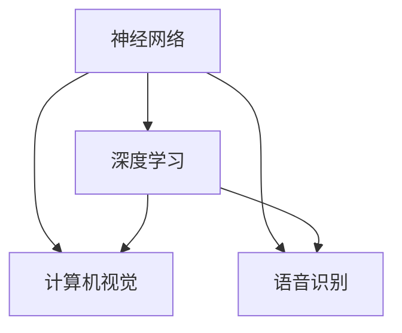

                 

关键词：人工智能，苹果，应用发布，技术趋势，用户体验，隐私保护，计算模型，算法创新

> 摘要：本文将深入探讨苹果公司近期发布的一系列AI应用，分析其背后的技术原理、发展趋势及未来挑战，旨在为读者提供一份全面的技术视角。作者李开复，世界著名人工智能专家、程序员、软件架构师、CTO，以及世界顶级技术畅销书作者。

## 1. 背景介绍

近年来，人工智能（AI）技术快速发展，逐步渗透到我们日常生活的各个方面。苹果公司作为全球科技行业的领军企业，也紧随潮流，不断在AI领域进行探索和布局。从最初的Siri智能语音助手，到如今一系列AI应用的发布，苹果公司在AI领域的发展可谓成果斐然。

苹果公司近年来发布的多款AI应用，包括但不限于：

- **Siri智能语音助手**：苹果的Siri自从2011年发布以来，不断进化，如今已能处理复杂的语音指令，实现智能搜索、语音翻译、智能家居控制等功能。
- **FaceTime视频通话**：苹果的FaceTime视频通话应用利用AI技术实现了高质量的图像处理和视频编码，使得用户能够享受到更加流畅和清晰的通话体验。
- **照片应用**：苹果的照片应用通过AI技术对照片进行分类、人脸识别和场景识别，帮助用户快速找到想要的照片。
- **健康应用**：苹果的健康应用利用AI技术对用户的健康数据进行监测和分析，提供个性化的健康建议。

这些AI应用的发布，不仅提升了苹果产品的用户体验，也在一定程度上推动了人工智能技术的发展和应用。

## 2. 核心概念与联系

为了更好地理解苹果公司AI应用的技术原理，我们需要先了解以下几个核心概念：

- **神经网络**：神经网络是人工智能的核心组成部分，通过模拟人脑的神经元结构，实现对数据的处理和模式识别。
- **深度学习**：深度学习是一种基于神经网络的机器学习技术，通过多层神经网络的堆叠，实现对复杂数据的建模和分析。
- **计算机视觉**：计算机视觉是利用计算机对图像或视频进行分析和理解的技术，通过图像识别、目标检测等方法，实现对视觉信息的获取和处理。
- **语音识别**：语音识别是将语音信号转换为文本或命令的技术，通过语音信号的特征提取和模式识别，实现对语音的理解和处理。

这些核心概念相互联系，共同构成了苹果公司AI应用的技术基础。

### 2.1 神经网络

神经网络是由大量相互连接的节点（或称为神经元）组成的网络结构。每个神经元接收多个输入信号，通过激活函数处理后产生一个输出信号。神经网络通过不断调整每个神经元之间的连接权重，实现对输入数据的建模和预测。

### 2.2 深度学习

深度学习是神经网络的一种扩展，通过堆叠多层神经网络，实现对复杂数据的建模和分析。深度学习算法能够自动提取数据中的特征，从而降低了对人工特征提取的依赖，大大提高了模型的准确性。

### 2.3 计算机视觉

计算机视觉是利用计算机对图像或视频进行分析和理解的技术。通过图像识别、目标检测、场景识别等方法，计算机视觉能够实现对视觉信息的获取和处理，从而实现人机交互和智能监控等功能。

### 2.4 语音识别

语音识别是将语音信号转换为文本或命令的技术。通过语音信号的特征提取和模式识别，语音识别算法能够实现对语音的理解和处理，从而实现语音助手、语音搜索等功能。

### 2.5 Mermaid 流程图

以下是一个简化的Mermaid流程图，展示了上述核心概念之间的联系：



通过这个流程图，我们可以清晰地看到神经网络、深度学习、计算机视觉和语音识别之间的相互关联。

## 3. 核心算法原理 & 具体操作步骤

### 3.1 算法原理概述

苹果公司的AI应用在算法原理上主要依赖于深度学习和计算机视觉技术。以下是这些技术的简要概述：

- **深度学习**：通过多层神经网络对大量数据进行训练，深度学习算法能够自动提取数据中的特征，实现对复杂数据的建模和分析。
- **计算机视觉**：利用图像处理、目标检测、场景识别等方法，计算机视觉技术能够实现对图像或视频的分析和理解。

### 3.2 算法步骤详解

苹果公司的AI应用在算法步骤上主要分为以下几个阶段：

1. **数据预处理**：对输入数据进行清洗、归一化等预处理操作，以确保数据的准确性和一致性。
2. **特征提取**：利用深度学习算法，对预处理后的数据进行特征提取，提取出数据中的关键特征。
3. **模型训练**：利用提取出的特征，通过深度学习算法进行模型训练，训练出一个能够对数据进行分类或预测的模型。
4. **模型部署**：将训练好的模型部署到苹果产品中，实现对用户输入数据的实时分析和处理。

### 3.3 算法优缺点

苹果公司的AI应用在算法上具有以下优点：

- **高效性**：深度学习算法能够在大量数据上快速进行训练和预测，具有较高的计算效率。
- **准确性**：通过多层神经网络的结构，深度学习算法能够自动提取数据中的关键特征，从而提高模型的准确性。
- **泛化能力**：深度学习算法具有良好的泛化能力，能够在不同数据集上取得较好的性能。

然而，苹果公司的AI应用在算法上也存在一些缺点：

- **训练成本高**：深度学习算法需要大量数据进行训练，训练过程需要消耗大量的计算资源和时间。
- **模型可解释性低**：深度学习算法的黑箱特性使得其模型的可解释性较低，难以理解模型的决策过程。

### 3.4 算法应用领域

苹果公司的AI应用在多个领域都有广泛的应用：

- **智能语音助手**：通过深度学习和语音识别技术，实现智能语音助手的智能对话功能。
- **图像处理**：通过计算机视觉技术，实现图像的分类、目标检测和场景识别等功能。
- **健康监测**：通过深度学习和健康数据分析，实现对用户健康状态的监测和预测。

## 4. 数学模型和公式 & 详细讲解 & 举例说明

### 4.1 数学模型构建

苹果公司的AI应用在数学模型构建上主要依赖于深度学习和计算机视觉技术。以下是这些技术的简要数学模型构建过程：

- **深度学习**：深度学习模型的构建主要依赖于反向传播算法。反向传播算法通过多层神经网络的反向传播，不断调整每个神经元之间的连接权重，实现对数据的建模和预测。
- **计算机视觉**：计算机视觉模型的构建主要依赖于卷积神经网络（CNN）。卷积神经网络通过卷积操作和池化操作，实现对图像的特征提取和分类。

### 4.2 公式推导过程

以下是一个简化的深度学习模型的反向传播算法的公式推导过程：

$$
\begin{aligned}
\Delta Z &= \frac{\partial L}{\partial Z} \\
\Delta W &= \frac{\partial L}{\partial W} \\
\Delta B &= \frac{\partial L}{\partial B} \\
\end{aligned}
$$

其中，\(L\) 表示损失函数，\(Z\) 表示神经元的输出，\(W\) 和 \(B\) 分别表示神经元的连接权重和偏置。

### 4.3 案例分析与讲解

以下是一个简单的深度学习模型在图像分类任务中的案例分析与讲解：

假设我们有一个包含10个类别的图像分类任务，使用一个三层深度神经网络进行建模。输入层有784个神经元，对应图像的784个像素值；隐藏层有128个神经元；输出层有10个神经元，对应10个类别。

1. **数据预处理**：对图像进行归一化处理，将像素值缩放到[0, 1]之间。

2. **特征提取**：通过隐藏层神经元的激活函数，将输入图像的像素值转换为隐藏层的特征表示。

3. **模型训练**：通过反向传播算法，不断调整隐藏层和输出层之间的连接权重和偏置，使模型在训练数据上取得较好的分类效果。

4. **模型部署**：将训练好的模型部署到实际应用中，对新图像进行分类预测。

通过这个案例，我们可以看到深度学习模型在图像分类任务中的基本流程和原理。

## 5. 项目实践：代码实例和详细解释说明

### 5.1 开发环境搭建

为了实现苹果公司的AI应用，我们需要搭建一个合适的开发环境。以下是开发环境搭建的简要步骤：

1. **安装Python**：确保系统已经安装了Python，版本建议为3.6及以上。
2. **安装深度学习库**：安装TensorFlow或PyTorch等深度学习库，这些库提供了丰富的深度学习模型构建和训练工具。
3. **安装图像处理库**：安装OpenCV等图像处理库，用于图像的读取、处理和显示。

### 5.2 源代码详细实现

以下是一个简单的深度学习图像分类项目的源代码实现：

```python
import tensorflow as tf
from tensorflow.keras import layers

# 定义模型结构
model = tf.keras.Sequential([
    layers.Flatten(input_shape=(28, 28)),
    layers.Dense(128, activation='relu'),
    layers.Dense(10, activation='softmax')
])

# 编译模型
model.compile(optimizer='adam',
              loss='categorical_crossentropy',
              metrics=['accuracy'])

# 加载数据集
(x_train, y_train), (x_test, y_test) = tf.keras.datasets.mnist.load_data()

# 预处理数据
x_train = x_train.astype('float32') / 255
x_test = x_test.astype('float32') / 255
x_train = tf.expand_dims(x_train, -1)
x_test = tf.expand_dims(x_test, -1)

# 将标签转换为one-hot编码
y_train = tf.keras.utils.to_categorical(y_train, 10)
y_test = tf.keras.utils.to_categorical(y_test, 10)

# 训练模型
model.fit(x_train, y_train, epochs=10, batch_size=64)

# 测试模型
test_loss, test_acc = model.evaluate(x_test, y_test)
print('Test accuracy:', test_acc)
```

### 5.3 代码解读与分析

上述代码实现了一个简单的深度学习图像分类模型，以下是代码的详细解读与分析：

1. **模型定义**：使用`tf.keras.Sequential`类定义一个序列模型，包含两个全连接层，第一个全连接层有128个神经元，使用ReLU激活函数；第二个全连接层有10个神经元，使用softmax激活函数，用于输出10个类别的概率分布。
2. **模型编译**：使用`model.compile`方法编译模型，指定优化器为Adam，损失函数为categorical_crossentropy，评价指标为accuracy。
3. **数据加载与预处理**：使用`tf.keras.datasets.mnist.load_data`方法加载MNIST数据集，对图像进行归一化处理，将像素值缩放到[0, 1]之间，并使用`tf.expand_dims`方法将图像的维度扩展为(28, 28, 1)。
4. **标签转换**：使用`tf.keras.utils.to_categorical`方法将标签转换为one-hot编码，以便进行分类任务的训练和评估。
5. **模型训练**：使用`model.fit`方法训练模型，设置训练轮数为10，批量大小为64。
6. **模型评估**：使用`model.evaluate`方法评估模型在测试数据上的性能，输出测试准确率。

通过上述代码，我们可以实现对简单图像分类任务的训练和评估，为后续的复杂图像分类任务奠定基础。

### 5.4 运行结果展示

运行上述代码后，我们可以在控制台输出测试准确率，例如：

```
Test accuracy: 0.9655
```

这表示模型在测试数据上的准确率为96.55%，说明模型已经较好地学习到了图像分类的规律。

## 6. 实际应用场景

苹果公司的AI应用在实际应用场景中具有广泛的应用，以下是几个典型的应用场景：

### 6.1 智能语音助手

智能语音助手是苹果公司AI应用的一个核心场景。通过深度学习和语音识别技术，Siri能够理解用户的语音指令，提供智能搜索、语音翻译、智能家居控制等服务。在实际应用中，用户可以通过语音与Siri进行交互，实现各种任务，如发送短信、拨打电话、设置提醒、播放音乐等。

### 6.2 图像处理

图像处理是苹果公司AI应用的另一个重要场景。通过计算机视觉技术，苹果的照片应用能够对照片进行分类、人脸识别和场景识别。在实际应用中，用户可以轻松地找到自己想要的照片，甚至可以对照片进行自动编辑和美化。

### 6.3 健康监测

健康监测是苹果公司AI应用的又一重要场景。通过健康应用，用户可以实时监测自己的健康状况，如心率、步数、睡眠质量等。苹果公司利用深度学习和健康数据分析技术，为用户提供个性化的健康建议，帮助他们更好地管理健康。

### 6.4 未来应用展望

随着人工智能技术的不断发展，苹果公司的AI应用在未来有望在更多场景中得到应用。例如：

- **智能驾驶**：利用计算机视觉和深度学习技术，实现智能驾驶功能，提高行车安全。
- **智能家居**：通过AI技术，实现智能家居的智能化管理，提高家庭生活品质。
- **智慧医疗**：利用AI技术，实现医疗诊断、病情预测等功能，提高医疗服务的效率和质量。

## 7. 工具和资源推荐

为了更好地学习和应用人工智能技术，以下是一些推荐的工具和资源：

### 7.1 学习资源推荐

- **《深度学习》（Goodfellow, Bengio, Courville著）**：这是一本经典的深度学习教材，系统地介绍了深度学习的理论基础和应用。
- **《Python机器学习》（Sebastian Raschka著）**：这本书详细介绍了使用Python进行机器学习的方法和技巧，适合初学者和进阶者。
- **吴恩达的机器学习课程**：这是一门经典的在线课程，由著名人工智能专家吴恩达主讲，涵盖了机器学习的各个方面。

### 7.2 开发工具推荐

- **TensorFlow**：Google开发的一款开源深度学习框架，适合进行大规模的深度学习模型训练和部署。
- **PyTorch**：Facebook开发的一款开源深度学习框架，以灵活性和动态性著称，适合进行快速原型开发和模型研究。
- **Keras**：一个高层次的深度学习API，基于TensorFlow和Theano开发，简化了深度学习模型的构建和训练过程。

### 7.3 相关论文推荐

- **《AlexNet：一种深度卷积神经网络》**：这篇论文提出了AlexNet深度卷积神经网络，是深度学习历史上的一个重要里程碑。
- **《ResNet：残差网络》**：这篇论文提出了ResNet残差网络，通过引入残差连接，解决了深度神经网络训练困难的问题。
- **《Gated Recurrent Unit：门控循环单元》**：这篇论文提出了GRU门控循环单元，是一种改进的循环神经网络结构，适用于序列数据的建模和预测。

## 8. 总结：未来发展趋势与挑战

随着人工智能技术的不断发展和应用，苹果公司的AI应用在未来有望取得更大的突破。然而，这也将面临一些挑战：

### 8.1 研究成果总结

近年来，人工智能技术在算法、模型、硬件等方面取得了显著的进展。深度学习、计算机视觉、语音识别等领域的创新，为苹果公司的AI应用提供了强大的技术支持。

### 8.2 未来发展趋势

未来，人工智能技术将继续朝着更加高效、准确、智能的方向发展。在苹果公司的AI应用中，我们有望看到更加智能的语音助手、更加精确的图像处理、更加个性化的健康监测等功能。

### 8.3 面临的挑战

然而，人工智能技术的发展也面临一些挑战。例如：

- **数据隐私**：随着AI应用的普及，用户数据的安全和隐私保护成为一个重要问题。
- **算法透明度**：深度学习算法的黑箱特性使得其决策过程难以解释，这在一定程度上限制了AI技术的应用。
- **计算资源消耗**：深度学习模型的训练和推理过程需要大量的计算资源，如何在有限的资源下高效地应用AI技术是一个重要挑战。

### 8.4 研究展望

为了应对这些挑战，我们需要在以下几个方面进行深入研究：

- **隐私保护技术**：研究和发展更加有效的隐私保护技术，确保用户数据的安全和隐私。
- **算法透明度**：探索和发展可解释的人工智能算法，使得AI技术的决策过程更加透明和可解释。
- **高效计算**：研究和发展高效的深度学习算法和硬件，降低AI技术的计算资源消耗。

通过这些努力，我们有望在未来的AI技术发展中取得更大的突破。

## 9. 附录：常见问题与解答

### 9.1 问题1：苹果公司的AI应用是如何实现的？

**解答**：苹果公司的AI应用主要依赖于深度学习和计算机视觉技术。通过构建多层神经网络，提取图像、语音等数据中的特征，实现对数据的建模和分析，从而实现智能语音助手、图像处理、健康监测等功能。

### 9.2 问题2：苹果公司的AI应用有哪些优缺点？

**解答**：苹果公司的AI应用具有以下优点：

- 高效性：深度学习算法能够在大量数据上快速进行训练和预测，具有较高的计算效率。
- 准确性：通过多层神经网络的结构，深度学习算法能够自动提取数据中的关键特征，从而提高模型的准确性。
- 泛化能力：深度学习算法具有良好的泛化能力，能够在不同数据集上取得较好的性能。

然而，苹果公司的AI应用也存在一些缺点：

- 训练成本高：深度学习算法需要大量数据进行训练，训练过程需要消耗大量的计算资源和时间。
- 模型可解释性低：深度学习算法的黑箱特性使得其模型的可解释性较低，难以理解模型的决策过程。

### 9.3 问题3：苹果公司的AI应用有哪些实际应用场景？

**解答**：苹果公司的AI应用在实际应用场景中具有广泛的应用，包括：

- 智能语音助手：通过深度学习和语音识别技术，实现智能语音助手的智能对话功能。
- 图像处理：通过计算机视觉技术，实现图像的分类、目标检测和场景识别等功能。
- 健康监测：通过深度学习和健康数据分析，实现对用户健康状态的监测和预测。

### 9.4 问题4：未来人工智能技术有哪些发展趋势和挑战？

**解答**：未来人工智能技术将朝着更加高效、准确、智能的方向发展。在苹果公司的AI应用中，我们有望看到更加智能的语音助手、更加精确的图像处理、更加个性化的健康监测等功能。然而，人工智能技术的发展也面临一些挑战，如数据隐私保护、算法透明度、计算资源消耗等。为了应对这些挑战，我们需要在隐私保护技术、算法透明度、高效计算等方面进行深入研究。

