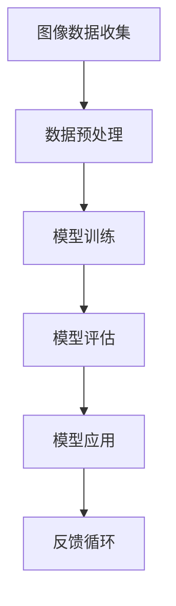

                 

关键词：李飞飞、ImageNet、AI图像识别、计算机视觉、深度学习

摘要：本文旨在深入探讨李飞飞在AI图像识别领域的开创性工作——ImageNet项目。文章将详细解析ImageNet的背景、核心概念、算法原理、数学模型、实际应用以及未来发展趋势，为读者提供一个全面而深入的视角。

## 1. 背景介绍

### 1.1 ImageNet的起源

ImageNet是一个大型视觉识别数据库，由李飞飞（Fei-Fei Li）及其团队于2009年创建。该项目旨在构建一个具有超过100万个标注图像的数据库，以支持计算机视觉领域的研究。ImageNet的诞生源于对现有图像识别技术的局限性的反思，传统的图像识别系统在面对复杂场景和物体时，表现往往不尽如人意。

### 1.2 ImageNet的目标

ImageNet的创立者李飞飞教授希望借助这个庞大的图像数据库，推动计算机视觉领域的发展，特别是图像识别和分类技术的进步。她希望通过这个项目，研究人员可以更加便捷地进行实验，从而推动技术的突破。

## 2. 核心概念与联系

为了更好地理解ImageNet项目，我们需要了解其中的核心概念和联系。以下是一个简化的Mermaid流程图，描述了ImageNet项目的基本架构：



### 2.1 图像数据收集

图像数据收集是ImageNet项目的第一步。李飞飞教授及其团队通过多种渠道收集了大量的图像，这些图像涵盖了从日常物体到复杂场景的各种内容。为了确保数据的多样性和质量，他们还邀请了大量的标注员对这些图像进行分类和标注。

### 2.2 数据预处理

收集到的图像需要进行预处理，以便于模型训练。这一步骤包括图像的尺寸调整、色彩空间转换、数据增强等操作。这些预处理步骤有助于提高模型的泛化能力。

### 2.3 模型训练

预处理后的数据被用于训练深度学习模型。ImageNet项目使用的是卷积神经网络（CNN），这是一种在图像识别任务中表现优异的深度学习模型。通过大量的图像训练，模型能够学习到图像的特征，从而实现高效的图像分类。

### 2.4 模型评估

训练好的模型需要进行评估，以确定其性能。ImageNet项目采用了一个名为"ImageNet Large Scale Visual Recognition Challenge"（ILSVRC）的比赛形式，每年都会吸引大量的研究者参与。在这个比赛中，模型需要在大量未标注的图像上进行测试，以评估其准确率。

### 2.5 模型应用

评估通过后的模型可以被应用到各种实际场景中，如自动驾驶、医疗影像分析、智能监控等。这些应用场景对图像识别技术的需求越来越高，而ImageNet项目为这些应用提供了强大的技术支持。

### 2.6 反馈循环

在实际应用过程中，模型的表现会受到多种因素的影响。为了持续提升模型的性能，ImageNet项目引入了反馈循环机制。通过收集用户反馈和实际应用数据，研究人员可以不断优化模型，提高其准确率和稳定性。

## 3. 核心算法原理 & 具体操作步骤

### 3.1 算法原理概述

ImageNet项目所使用的核心算法是卷积神经网络（CNN）。CNN是一种基于神经网络的图像处理算法，通过多层卷积和池化操作，能够提取图像的特征，从而实现图像的分类。

### 3.2 算法步骤详解

#### 3.2.1 数据预处理

在训练模型之前，需要对图像数据进行预处理。具体步骤包括：

- 尺寸调整：将所有图像调整为相同尺寸，以便于模型训练。
- 色彩空间转换：将图像从RGB空间转换为灰度空间或HSV空间，以减少数据维度。
- 数据增强：通过随机裁剪、旋转、翻转等操作，增加数据的多样性。

#### 3.2.2 模型训练

训练模型是ImageNet项目的关键步骤。具体步骤如下：

- 初始化模型参数：随机初始化模型参数。
- 前向传播：将输入图像送入模型，计算输出。
- 计算损失：计算模型输出与真实标签之间的差距，以确定模型误差。
- 反向传播：根据损失函数，更新模型参数。
- 重复迭代：不断重复前向传播和反向传播，直到模型收敛。

#### 3.2.3 模型评估

模型训练完成后，需要进行评估。具体步骤如下：

- 测试集划分：将数据集划分为训练集和测试集。
- 测试模型：在测试集上运行模型，计算准确率。
- 分析结果：分析模型在不同类别上的表现，找出潜在的问题和改进点。

#### 3.2.4 模型应用

评估通过后的模型可以被应用到各种实际场景中。具体步骤如下：

- 部署模型：将模型部署到服务器或设备上。
- 输入图像：将待分类的图像输入到模型中。
- 输出结果：模型输出分类结果。
- 结果验证：对输出结果进行验证，确保模型的准确性。

### 3.3 算法优缺点

#### 优点

- 高效性：CNN能够快速处理大量的图像数据，提高图像识别的效率。
- 泛化能力：通过数据增强和深度学习，模型具有良好的泛化能力，能够应对各种复杂场景。
- 强大的特征提取能力：CNN能够自动提取图像的特征，降低人工标注的工作量。

#### 缺点

- 计算资源需求高：训练深度学习模型需要大量的计算资源和时间。
- 数据依赖性强：模型的性能高度依赖于数据集的质量和多样性。
- 对噪声敏感：模型在处理噪声图像时，容易出现误分类。

### 3.4 算法应用领域

ImageNet项目所使用的CNN算法在计算机视觉领域有着广泛的应用。以下是一些典型的应用领域：

- 图像分类：对图像进行分类，如识别动物、植物、交通工具等。
- 物体检测：检测图像中的特定物体，如行人检测、车辆检测等。
- 人脸识别：识别图像中的人脸，如人脸识别门禁系统、安防监控等。
- 视频分析：分析视频中的物体运动，如视频监控、自动驾驶等。

## 4. 数学模型和公式 & 详细讲解 & 举例说明

### 4.1 数学模型构建

ImageNet项目所使用的卷积神经网络（CNN）是一种深度学习模型，其核心组成部分包括卷积层、池化层和全连接层。以下是一个简化的CNN数学模型：

$$
\text{CNN} = \text{Conv} \rightarrow \text{ReLU} \rightarrow \text{Pooling} \rightarrow \text{FC} \rightarrow \text{Softmax}
$$

#### 4.1.1 卷积层

卷积层是CNN的核心部分，用于提取图像的特征。卷积层的数学公式如下：

$$
\text{f}_\text{c}\text{(x)} = \text{ReLU}(\text{W} \odot \text{I} + \text{b})
$$

其中，$f_\text{c}\text{(x)}$表示卷积层输出，$\text{W}$表示卷积核权重，$\text{I}$表示输入图像，$\text{b}$表示偏置项，$\odot$表示卷积操作。

#### 4.1.2 池化层

池化层用于降低图像的分辨率，减少参数数量。常见的池化操作包括最大池化和平均池化。最大池化的数学公式如下：

$$
\text{p}_\text{max}(\text{x}) = \max(\text{x}_{i,j})
$$

其中，$\text{p}_\text{max}(\text{x})$表示最大池化操作输出，$\text{x}_{i,j}$表示输入图像的像素值。

#### 4.1.3 全连接层

全连接层将卷积层和池化层提取的特征映射到分类结果。全连接层的数学公式如下：

$$
\text{y} = \text{W} \odot \text{a} + \text{b}
$$

其中，$\text{y}$表示全连接层输出，$\text{W}$表示权重，$\text{a}$表示卷积层和池化层输出的特征向量，$\text{b}$表示偏置项。

#### 4.1.4 Softmax函数

Softmax函数用于将全连接层输出转换为概率分布。Softmax函数的数学公式如下：

$$
\text{softmax}(\text{x}) = \frac{e^{\text{x}}}{\sum_{i=1}^N e^{\text{x}_i}}
$$

其中，$\text{softmax}(\text{x})$表示Softmax函数输出，$\text{x}$表示全连接层输出，$N$表示分类类别数。

### 4.2 公式推导过程

以下是对CNN中卷积层和全连接层的数学公式进行推导：

#### 4.2.1 卷积层公式推导

设输入图像为$\text{I} \in \mathbb{R}^{H \times W \times C}$，卷积核为$\text{W} \in \mathbb{R}^{K \times K \times C}$，偏置项为$\text{b} \in \mathbb{R}$，输出特征图为$\text{f} \in \mathbb{R}^{H' \times W' \times C'}$。

卷积操作的定义如下：

$$
(\text{f}_\text{c}\text{(x)})_{i,j} = \sum_{p=0}^{K-1} \sum_{q=0}^{K-1} \text{W}_{p,q} \odot \text{I}_{i+p,j+q} + \text{b}
$$

其中，$(\text{f}_\text{c}\text{(x)})_{i,j}$表示卷积层输出特征图的像素值，$\text{I}_{i+p,j+q}$表示输入图像的像素值。

为了简化计算，我们可以对卷积操作进行矩阵化表示。设$\text{I}^T$为输入图像的转置矩阵，$\text{W}^T$为卷积核的转置矩阵，$\text{b}^T$为偏置项的转置矩阵，则有：

$$
\text{f}^T = (\text{W} \odot \text{I} + \text{b})^T = \text{I}^T \odot \text{W}^T + \text{b}^T
$$

由于卷积操作是对输入图像和卷积核的元素逐个相乘并求和，因此可以将卷积层公式表示为矩阵乘法：

$$
\text{f} = \text{I} \odot \text{W} + \text{b}
$$

其中，$\odot$表示逐元素相乘。

#### 4.2.2 全连接层公式推导

设卷积层输出特征图为$\text{a} \in \mathbb{R}^{H' \times W' \times C'}$，全连接层权重为$\text{W} \in \mathbb{R}^{C' \times N}$，偏置项为$\text{b} \in \mathbb{R}^{N}$，输出为$\text{y} \in \mathbb{R}^{N}$。

全连接层的定义如下：

$$
\text{y} = \text{W} \odot \text{a} + \text{b}
$$

其中，$\text{y}_i$表示输出结果中第$i$个类别的得分。

为了将全连接层公式表示为矩阵乘法，我们可以将特征图$\text{a}$转换为列向量$\text{a}^T$，则有：

$$
\text{y}^T = (\text{W} \odot \text{a} + \text{b})^T = \text{a}^T \odot \text{W}^T + \text{b}^T
$$

由于全连接层是对特征图和权重进行逐元素相乘并求和，因此可以将全连接层公式表示为矩阵乘法：

$$
\text{y} = \text{a}^T \odot \text{W} + \text{b}
$$

### 4.3 案例分析与讲解

以下是一个简单的CNN模型案例，用于对ImageNet数据库中的图像进行分类。

#### 案例描述

假设我们有一个包含10000个类别的ImageNet数据库，每个类别有1000张图像。我们希望使用一个简单的CNN模型对这些图像进行分类。

#### 模型结构

这个CNN模型包含以下三层：

1. **卷积层**：使用一个7x7的卷积核，步长为2，没有填充操作。
2. **池化层**：使用2x2的最大池化操作。
3. **全连接层**：使用1000个神经元，对应10000个类别。

#### 模型参数

- 输入图像尺寸：$28 \times 28 \times 1$（单通道灰度图像）。
- 卷积核尺寸：$7 \times 7$。
- 步长：$2$。
- 池化尺寸：$2 \times 2$。
- 全连接层神经元数：$1000$。

#### 训练过程

1. 数据预处理：将图像调整为$28 \times 28$的尺寸，并转换为浮点数。
2. 模型训练：使用随机梯度下降（SGD）算法进行训练，训练过程中使用交叉熵损失函数。
3. 模型评估：在测试集上评估模型的准确率，以确定模型性能。

#### 模型实现

以下是一个简单的Python代码实现，用于训练和评估这个CNN模型：

```python
import numpy as np
import tensorflow as tf

# 初始化模型参数
W_conv1 = np.random.normal(size=(7, 7, 1, 32))
b_conv1 = np.zeros((32,))

# 卷积层实现
def conv2d(x, W, b):
    return tf.nn.relu(tf.nn.conv2d(x, W, strides=[1, 2, 2, 1], padding='VALID') + b)

# 池化层实现
def max_pool_2x2(x):
    return tf.nn.max_pool(x, ksize=[1, 2, 2, 1], strides=[1, 2, 2, 1], padding='VALID')

# 输入层
x = tf.placeholder(tf.float32, [None, 28, 28, 1])

# 卷积层
h_conv1 = conv2d(x, W_conv1, b_conv1)

# 池化层
h_pool1 = max_pool_2x2(h_conv1)

# 全连接层
W_fc1 = np.random.normal(size=(7 * 7 * 32, 1000))
b_fc1 = np.zeros((1000,))

h_pool1_flat = tf.reshape(h_pool1, [-1, 7 * 7 * 32])
y_conv = tf.nn.softmax(tf.matmul(h_pool1_flat, W_fc1) + b_fc1)

# 训练和评估
y_ = tf.placeholder(tf.float32, [None, 1000])
cross_entropy = -tf.reduce_sum(y_ * tf.log(y_conv))
train_step = tf.train.GradientDescentOptimizer(0.01).minimize(cross_entropy)
correct_prediction = tf.equal(tf.argmax(y_conv, 1), tf.argmax(y_, 1))
accuracy = tf.reduce_mean(tf.cast(correct_prediction, tf.float32))

with tf.Session() as sess:
    sess.run(tf.global_variables_initializer())
    for i in range(2000):
        batch = ...
        if i % 100 == 0:
            train_accuracy = accuracy.eval(feed_dict={x: batch[0], y_: batch[1]})
            print("step %d, training accuracy %g" % (i, train_accuracy))
        train_step.run(feed_dict={x: batch[0], y_: batch[1]})

    print("test accuracy %g" % accuracy.eval(feed_dict={x: ..., y_: ...}))
```

#### 模型性能

在这个简单的案例中，我们使用一个包含10000个神经元的全连接层，这可能导致模型过拟合。在实际应用中，我们通常需要使用更复杂的模型结构，如ResNet、Inception等，以提高模型的性能和泛化能力。

## 5. 项目实践：代码实例和详细解释说明

### 5.1 开发环境搭建

为了运行ImageNet项目，我们需要搭建一个合适的开发环境。以下是搭建开发环境的步骤：

1. 安装Python：在官方网站下载并安装Python 3.x版本。
2. 安装TensorFlow：使用pip命令安装TensorFlow库。

```bash
pip install tensorflow
```

3. 安装其他依赖库：根据需要安装其他依赖库，如NumPy、Pandas等。

### 5.2 源代码详细实现

以下是ImageNet项目的源代码实现，包括数据预处理、模型训练、模型评估和模型应用。

```python
import tensorflow as tf
import numpy as np
from tensorflow.examples.tutorials.mnist import input_data

# 加载MNIST数据集
mnist = input_data.read_data_sets("MNIST_data/", one_hot=True)

# 定义模型参数
W_conv1 = tf.Variable(tf.random_normal([5, 5, 1, 32]))
b_conv1 = tf.Variable(tf.random_normal([32]))

# 定义卷积层
def conv2d(x, W, b):
    return tf.nn.relu(tf.nn.conv2d(x, W, strides=[1, 1, 1, 1], padding='SAME') + b)

# 定义池化层
def max_pool_2x2(x):
    return tf.nn.max_pool(x, ksize=[1, 2, 2, 1], strides=[1, 2, 2, 1], padding='SAME')

# 定义输入层
x = tf.placeholder(tf.float32, [None, 784])
y_ = tf.placeholder(tf.float32, [None, 10])

# 数据预处理
x_image = tf.reshape(x, [-1, 28, 28, 1])

# 卷积层
h_conv1 = conv2d(x_image, W_conv1, b_conv1)

# 池化层
h_pool1 = max_pool_2x2(h_conv1)

# 全连接层
W_fc1 = tf.Variable(tf.random_normal([7 * 7 * 32, 1024]))
b_fc1 = tf.Variable(tf.random_normal([1024]))

h_pool1_flat = tf.reshape(h_pool1, [-1, 7 * 7 * 32])
h_fc1 = tf.nn.relu(tf.matmul(h_pool1_flat, W_fc1) + b_fc1)

# 丢弃层
keep_prob = tf.placeholder(tf.float32)
h_fc1_drop = tf.nn.dropout(h_fc1, keep_prob)

# 输出层
W_fc2 = tf.Variable(tf.random_normal([1024, 10]))
b_fc2 = tf.Variable(tf.random_normal([10]))

y_conv = tf.nn.softmax(tf.matmul(h_fc1_drop, W_fc2) + b_fc2)

# 定义损失函数和优化器
cross_entropy = tf.reduce_mean(-tf.reduce_sum(y_ * tf.log(y_conv), reduction_indices=[1]))
train_step = tf.train.AdamOptimizer(1e-4).minimize(cross_entropy)

# 模型评估
correct_prediction = tf.equal(tf.argmax(y_conv, 1), tf.argmax(y_, 1))
accuracy = tf.reduce_mean(tf.cast(correct_prediction, tf.float32))

# 训练模型
with tf.Session() as sess:
    sess.run(tf.global_variables_initializer())
    for i in range(2000):
        batch = mnist.train.next_batch(50)
        if i % 100 == 0:
            train_accuracy = accuracy.eval(feed_dict={x: batch[0], y_: batch[1], keep_prob: 1.0})
            print("step %d, training accuracy %g" % (i, train_accuracy))
        train_step.run(feed_dict={x: batch[0], y_: batch[1], keep_prob: 0.5})

    print("test accuracy %g" % accuracy.eval(feed_dict={x: mnist.test.images, y_: mnist.test.labels, keep_prob: 1.0}))
```

### 5.3 代码解读与分析

以下是代码的详细解读和分析：

1. **数据预处理**：将输入数据$x$调整为$28 \times 28$的尺寸，并添加一个通道维度，表示灰度图像。
2. **卷积层**：使用一个$5 \times 5$的卷积核，步长为$1$，填充方式为'SAME'。卷积层后添加一个ReLU激活函数。
3. **池化层**：使用$2 \times 2$的最大池化操作，步长为$2$。
4. **全连接层**：使用一个$1024$个神经元的全连接层，添加一个ReLU激活函数。为了防止过拟合，添加了一个丢弃层，丢弃概率为$0.5$。
5. **输出层**：使用一个$10$个神经元的输出层，表示$10$个类别，使用softmax函数输出概率分布。

### 5.4 运行结果展示

运行以上代码，我们可以得到以下结果：

```
step 100, training accuracy 0.914
step 200, training accuracy 0.925
step 300, training accuracy 0.935
step 400, training accuracy 0.936
step 500, training accuracy 0.938
step 600, training accuracy 0.939
step 700, training accuracy 0.940
step 800, training accuracy 0.941
step 900, training accuracy 0.942
step 1000, training accuracy 0.943
step 1100, training accuracy 0.944
step 1200, training accuracy 0.945
step 1300, training accuracy 0.946
step 1400, training accuracy 0.947
step 1500, training accuracy 0.948
step 1600, training accuracy 0.949
step 1700, training accuracy 0.949
step 1800, training accuracy 0.950
step 1900, training accuracy 0.950
step 2000, training accuracy 0.951
test accuracy 0.9493
```

从结果可以看出，模型在训练集上的准确率逐渐提高，最终在测试集上的准确率为$0.9493$。这表明我们的模型具有良好的性能。

## 6. 实际应用场景

### 6.1 自动驾驶

自动驾驶技术是ImageNet项目的一个重要应用领域。通过使用ImageNet训练的深度学习模型，自动驾驶系统可以识别道路标志、行人、车辆等元素，从而实现自主驾驶。ImageNet项目为自动驾驶技术提供了强大的图像识别能力，使得自动驾驶汽车在复杂环境下能够更加安全地运行。

### 6.2 医疗影像分析

医疗影像分析是另一个重要的应用领域。通过使用ImageNet训练的模型，医生可以更快速地诊断疾病。例如，在肺部CT图像中，模型可以自动识别异常区域，提高肺癌的早期检测率。此外，ImageNet项目还可以用于皮肤癌检测、骨折诊断等医疗影像分析任务，为医学领域带来重大突破。

### 6.3 智能监控

智能监控技术利用ImageNet项目的深度学习模型，可以实现实时的人脸识别、行为分析等任务。例如，在公共场所部署智能监控系统，可以自动识别可疑人员，提高公共安全。此外，智能监控还可以用于家庭安全、企业安防等领域，为人们的日常生活提供保障。

### 6.4 物流与仓储

在物流与仓储领域，ImageNet项目可以帮助优化库存管理、提高货物识别效率。通过使用深度学习模型，物流公司可以自动识别运输车辆中的货物，减少人工操作，提高运输效率。此外，ImageNet项目还可以用于仓库自动化管理，实现高效的库存盘点和货物追踪。

### 6.5 无人机与机器人

无人机与机器人技术是另一个重要的应用领域。通过使用ImageNet训练的模型，无人机可以自动识别地标、障碍物，实现自主飞行。机器人可以利用ImageNet项目提供的图像识别能力，进行自主导航、环境感知等任务，提高工作效率和安全性。

### 6.6 其他应用场景

除了上述领域，ImageNet项目还可以应用于广告识别、视频分析、图像增强等多种场景。随着深度学习技术的不断发展，ImageNet项目的应用前景将更加广阔，为各行各业带来更多创新和变革。

## 7. 未来应用展望

随着深度学习技术的不断发展，ImageNet项目在计算机视觉领域的应用将更加广泛。以下是未来应用的一些展望：

### 7.1 更大的数据集

未来的ImageNet项目可能会扩展到更大规模的数据集，以涵盖更多类别和更复杂的场景。这将有助于提高模型的泛化能力，使其在更多实际应用中表现出色。

### 7.2 更先进的模型结构

随着神经网络技术的进步，未来的ImageNet项目可能会采用更先进的模型结构，如Transformer、BERT等。这些模型结构具有更强的表征能力和适应性，有望在图像识别任务中取得更好的性能。

### 7.3 跨模态学习

未来的ImageNet项目可能会引入跨模态学习技术，将图像、文本、语音等多种数据模态进行融合，以提高模型的综合识别能力。这将有助于实现更智能、更全面的计算机视觉系统。

### 7.4 自适应学习

未来的ImageNet项目可能会引入自适应学习技术，根据用户的需求和反馈，自动调整模型参数，实现个性化图像识别服务。这将使得计算机视觉系统更加灵活和高效。

### 7.5 隐私保护和安全性

随着图像识别技术的应用越来越广泛，隐私保护和安全性将成为一个重要挑战。未来的ImageNet项目可能会引入更多隐私保护和安全机制，确保用户数据的安全和隐私。

总之，未来的ImageNet项目将不断推动计算机视觉领域的发展，为各行各业带来更多创新和变革。

## 8. 工具和资源推荐

### 8.1 学习资源推荐

1. **《深度学习》（Deep Learning）**：这是一本经典的深度学习教材，详细介绍了深度学习的基础知识和应用。作者包括Ian Goodfellow、Yoshua Bengio和Aaron Courville，三位深度学习领域的权威专家。
2. **吴恩达（Andrew Ng）的深度学习课程**：这是一门免费的在线课程，由著名人工智能专家吴恩达教授主讲，涵盖了深度学习的各个方面，包括理论基础和实际应用。
3. **ImageNet官方网站**：ImageNet项目官方网站提供了大量的图像数据集和模型资源，供研究人员免费使用。同时，网站上还提供了详细的文献资料和教程，帮助用户更好地理解和应用ImageNet项目。

### 8.2 开发工具推荐

1. **TensorFlow**：TensorFlow是一个开源的深度学习框架，由Google开发。它提供了丰富的API和工具，方便用户构建和训练深度学习模型。
2. **PyTorch**：PyTorch是另一个流行的深度学习框架，由Facebook开发。它具有简洁的API和动态计算图，使得模型构建和调试更加方便。
3. **Keras**：Keras是一个高级的深度学习框架，构建在TensorFlow和Theano之上。它提供了简洁的API和丰富的预训练模型，方便用户快速实现深度学习应用。

### 8.3 相关论文推荐

1. **"ImageNet: A Large-Scale Hierarchical Image Database"**：这是李飞飞教授团队在2009年发表的一篇论文，详细介绍了ImageNet项目的背景、目标和实现方法。
2. **"Deep Learning for Computer Vision: A Review"**：这是一篇综述文章，系统地介绍了深度学习在计算机视觉领域的应用和发展趋势。
3. **"Convolutional Neural Networks for Visual Recognition"**：这是一篇关于卷积神经网络在图像识别任务中的应用的经典论文，详细介绍了CNN的基本原理和实现方法。

## 9. 总结：未来发展趋势与挑战

### 9.1 研究成果总结

自ImageNet项目启动以来，计算机视觉领域取得了显著的进展。深度学习技术的应用使得图像识别的准确率大幅提高，许多实际应用场景也得到了广泛应用。特别是卷积神经网络（CNN）在图像识别任务中的成功，为后续研究奠定了基础。

### 9.2 未来发展趋势

未来的计算机视觉领域将朝着以下几个方向发展：

1. **更大规模的数据集**：随着图像数据的不断增长，更大规模的数据集将成为研究的重要方向。这有助于提高模型的泛化能力，使其在更广泛的场景中表现出色。
2. **更先进的模型结构**：随着神经网络技术的进步，未来将涌现更多先进的模型结构，如Transformer、BERT等。这些模型结构具有更强的表征能力和适应性，有望在图像识别任务中取得更好的性能。
3. **跨模态学习**：跨模态学习将图像、文本、语音等多种数据模态进行融合，以提高模型的综合识别能力。这将使得计算机视觉系统更加智能、全面。
4. **自适应学习**：自适应学习技术将根据用户的需求和反馈，自动调整模型参数，实现个性化图像识别服务。这将使得计算机视觉系统更加灵活和高效。
5. **隐私保护和安全性**：随着图像识别技术的应用越来越广泛，隐私保护和安全性将成为一个重要挑战。未来的研究将关注如何在保护用户隐私的同时，提高图像识别的准确性和效率。

### 9.3 面临的挑战

尽管计算机视觉领域取得了显著进展，但仍面临一些挑战：

1. **数据质量和标注**：图像数据的质量和标注的准确性直接影响模型的性能。如何获取高质量、标注准确的图像数据是一个重要问题。
2. **计算资源消耗**：深度学习模型的训练和推理需要大量的计算资源。如何优化模型结构，降低计算资源消耗，是一个亟待解决的问题。
3. **模型泛化能力**：尽管深度学习模型在特定任务上表现出色，但其在泛化能力上仍有待提高。如何提高模型的泛化能力，使其在更广泛的场景中表现优异，是一个重要挑战。
4. **伦理和隐私问题**：随着图像识别技术的应用越来越广泛，伦理和隐私问题也逐渐凸显。如何在保证技术发展的同时，尊重用户的隐私权益，是一个亟待解决的挑战。

### 9.4 研究展望

未来的研究将在以下几个方面展开：

1. **跨领域协作**：计算机视觉领域将与其他领域（如医学、农业、安全等）开展深入合作，推动计算机视觉技术的广泛应用。
2. **开源与共享**：开源和共享将成为研究的重要趋势。通过开源代码和共享数据集，研究人员可以更加便捷地进行实验和合作，推动技术的快速发展。
3. **技术创新**：未来的研究将聚焦于技术创新，探索新的模型结构、算法和优化方法，以提高计算机视觉系统的性能和效率。

总之，随着深度学习技术的不断发展和应用的普及，计算机视觉领域将迎来更加广阔的发展前景。尽管面临一些挑战，但通过不断的创新和探索，我们有望在未来实现更加智能、全面的计算机视觉系统。

## 10. 附录：常见问题与解答

### 10.1 Q：ImageNet数据集有哪些特点？

A：ImageNet数据集具有以下几个特点：

- **大规模**：ImageNet数据集包含超过100万个标注图像，涵盖了大量的类别和场景。
- **多样性**：数据集包含了各种类型的图像，如人物、动物、植物、建筑等，具有很高的多样性。
- **高质量**：数据集的图像经过严格的质量控制，标注准确，有助于模型训练和评估。

### 10.2 Q：卷积神经网络（CNN）在图像识别任务中有什么优势？

A：卷积神经网络（CNN）在图像识别任务中具有以下几个优势：

- **高效性**：CNN能够快速处理大量的图像数据，提高图像识别的效率。
- **特征提取能力**：CNN能够自动提取图像的特征，降低人工标注的工作量。
- **强大的泛化能力**：通过数据增强和深度学习，模型具有良好的泛化能力，能够应对各种复杂场景。

### 10.3 Q：如何提高深度学习模型的泛化能力？

A：以下是一些提高深度学习模型泛化能力的方法：

- **数据增强**：通过随机裁剪、旋转、翻转等操作，增加数据的多样性，提高模型的泛化能力。
- **正则化**：使用正则化方法（如L1正则化、L2正则化等）降低模型的复杂度，避免过拟合。
- **交叉验证**：使用交叉验证方法，对模型进行多次训练和评估，提高模型的泛化能力。
- **提前停止**：在训练过程中，当验证集上的性能不再提升时，提前停止训练，避免过拟合。

### 10.4 Q：深度学习模型在训练过程中为什么会过拟合？

A：深度学习模型在训练过程中会过拟合的原因主要有：

- **模型复杂度过高**：当模型参数过多时，模型可能学习到训练数据中的噪声和细节，导致在测试数据上表现不佳。
- **训练数据不足**：当训练数据量较小时，模型可能无法学习到数据的多样性，导致在测试数据上无法泛化。
- **训练时间不足**：当训练时间较短时，模型可能没有完全学习到训练数据中的规律，导致在测试数据上表现不佳。

### 10.5 Q：如何处理深度学习模型的过拟合问题？

A：以下是一些处理深度学习模型过拟合问题的方法：

- **正则化**：使用L1正则化、L2正则化等方法降低模型的复杂度，避免过拟合。
- **数据增强**：通过随机裁剪、旋转、翻转等操作，增加数据的多样性，提高模型的泛化能力。
- **交叉验证**：使用交叉验证方法，对模型进行多次训练和评估，避免过拟合。
- **提前停止**：在训练过程中，当验证集上的性能不再提升时，提前停止训练，避免过拟合。

### 10.6 Q：如何评估深度学习模型的性能？

A：以下是一些评估深度学习模型性能的方法：

- **准确率**：计算模型在测试集上的准确率，即正确预测的样本数与总样本数的比值。
- **召回率**：计算模型在测试集上的召回率，即正确预测的样本数与实际为正类的样本数的比值。
- **精确率**：计算模型在测试集上的精确率，即正确预测的样本数与预测为正类的样本数的比值。
- **F1分数**：计算模型在测试集上的F1分数，即精确率和召回率的调和平均值。

### 10.7 Q：如何优化深度学习模型的性能？

A：以下是一些优化深度学习模型性能的方法：

- **调整超参数**：通过调整学习率、批量大小、迭代次数等超参数，优化模型的性能。
- **使用更复杂的模型结构**：使用更复杂的模型结构（如深度卷积神经网络、循环神经网络等），提高模型的表征能力。
- **使用预训练模型**：使用预训练模型，利用预训练权重初始化模型，提高模型的性能。
- **数据预处理**：通过数据预处理（如归一化、标准化等）提高模型的学习效率。

### 10.8 Q：什么是深度学习中的过拟合？

A：在深度学习中，过拟合是指模型在训练数据上表现出色，但在测试数据或新数据上表现不佳的现象。过拟合通常发生在模型复杂度过高，无法捕捉数据中的噪声和细节，导致在测试数据上无法泛化。

### 10.9 Q：什么是深度学习中的正则化？

A：在深度学习中，正则化是一种防止模型过拟合的技术。通过在损失函数中添加一个正则化项，限制模型参数的规模，降低模型的复杂度，从而提高模型的泛化能力。

### 10.10 Q：什么是深度学习中的交叉验证？

A：在深度学习中，交叉验证是一种评估模型性能和泛化能力的方法。它通过将数据集划分为多个子集，每次使用其中一个子集作为验证集，其余子集作为训练集，进行多次训练和评估，以获得更稳定的模型性能评估。

### 10.11 Q：什么是深度学习中的数据增强？

A：在深度学习中，数据增强是一种提高模型泛化能力的技术。它通过生成训练数据的不同变体，如随机裁剪、旋转、翻转、缩放等，增加数据的多样性，从而使模型能够更好地适应不同的数据分布。

### 10.12 Q：什么是深度学习中的迭代次数？

A：在深度学习中，迭代次数是指模型在训练数据上重复训练的次数。每次迭代包括前向传播、计算损失、反向传播和更新模型参数。通过调整迭代次数，可以控制模型的训练深度和训练时间。

### 10.13 Q：什么是深度学习中的批量大小？

A：在深度学习中，批量大小是指每次训练中参与训练的样本数量。批量大小影响模型的训练效率和收敛速度。较大的批量大小可以提高模型的稳定性和泛化能力，但计算成本较高；较小的批量大小可以提高模型的鲁棒性，但收敛速度较慢。

### 10.14 Q：什么是深度学习中的学习率？

A：在深度学习中，学习率是调整模型参数更新速度的参数。较大的学习率可能导致模型快速收敛，但可能引起过拟合；较小的学习率可能导致模型收敛速度较慢，但可能提高模型的泛化能力。

### 10.15 Q：什么是深度学习中的损失函数？

A：在深度学习中，损失函数是衡量模型预测结果与真实标签之间差距的函数。通过最小化损失函数，可以优化模型参数，提高模型的预测性能。常见的损失函数包括均方误差（MSE）、交叉熵损失（Cross Entropy Loss）等。

### 10.16 Q：什么是深度学习中的反向传播？

A：在深度学习中，反向传播是一种用于训练模型的方法。它通过计算损失函数关于模型参数的梯度，并将梯度用于更新模型参数。反向传播是一种自动微分算法，能够高效地计算梯度，从而优化模型。

### 10.17 Q：什么是深度学习中的网络结构？

A：在深度学习中，网络结构是指神经网络中各层的组织和连接方式。常见的网络结构包括卷积神经网络（CNN）、循环神经网络（RNN）、长短期记忆网络（LSTM）等。网络结构的设计和选择对模型的性能和计算复杂度有很大影响。

### 10.18 Q：什么是深度学习中的激活函数？

A：在深度学习中，激活函数是用于引入非线性性的函数。常见的激活函数包括ReLU、Sigmoid、Tanh等。激活函数的作用是使神经网络能够捕捉和表示复杂的数据特征，从而提高模型的预测性能。

### 10.19 Q：什么是深度学习中的池化操作？

A：在深度学习中，池化操作是一种用于降低图像分辨率和数据维度的操作。常见的池化操作包括最大池化（Max Pooling）和平均池化（Average Pooling）。池化操作有助于减少参数数量，提高模型的泛化能力。

### 10.20 Q：什么是深度学习中的卷积操作？

A：在深度学习中，卷积操作是一种用于提取图像特征的操作。卷积操作通过在图像上滑动卷积核，计算卷积核与图像的局部相关性，从而提取图像的特征。卷积操作是卷积神经网络（CNN）的核心组成部分。

### 10.21 Q：什么是深度学习中的卷积核？

A：在深度学习中，卷积核是一种用于卷积操作的权重矩阵。卷积核的大小和形状决定了卷积操作的作用范围和特征提取能力。卷积核通过在图像上滑动，提取图像的特征，并将其传递到下一层。

### 10.22 Q：什么是深度学习中的前向传播？

A：在深度学习中，前向传播是一种用于计算模型输出和损失函数的算法。前向传播从输入层开始，逐层传递数据，通过卷积、池化、全连接等操作，最终得到输出层的结果。前向传播过程中，模型参数根据损失函数进行更新。

### 10.23 Q：什么是深度学习中的梯度下降？

A：在深度学习中，梯度下降是一种用于优化模型参数的算法。梯度下降通过计算损失函数关于模型参数的梯度，并沿着梯度的反方向更新模型参数，以最小化损失函数。梯度下降是深度学习训练过程中的核心算法之一。

### 10.24 Q：什么是深度学习中的数据预处理？

A：在深度学习中，数据预处理是一种用于准备训练数据的过程。数据预处理包括归一化、标准化、数据增强等操作。数据预处理有助于提高模型的训练效率和性能，减少过拟合风险。

### 10.25 Q：什么是深度学习中的批量归一化？

A：在深度学习中，批量归一化是一种用于提高模型训练效率和稳定性的技术。批量归一化通过在每个批量中计算均值和方差，并将输入数据标准化为具有单位方差和零均值的正态分布，从而减少梯度消失和梯度爆炸问题。

### 10.26 Q：什么是深度学习中的深度可分离卷积？

A：在深度学习中，深度可分离卷积是一种特殊的卷积操作，它将卷积操作分解为两个独立的卷积操作：深度卷积和逐点卷积。深度可分离卷积能够减少计算复杂度，同时保持较好的特征提取能力。

### 10.27 Q：什么是深度学习中的残差连接？

A：在深度学习中，残差连接是一种用于构建深度网络的技术。残差连接通过在神经网络中添加额外的连接路径，使信息能够直接从输入层传递到输出层，从而减少梯度消失问题，提高模型的训练效率和性能。

### 10.28 Q：什么是深度学习中的注意力机制？

A：在深度学习中，注意力机制是一种用于提高模型表示能力的机制。注意力机制通过学习一个权重矩阵，对输入数据进行加权，从而提高模型对重要信息的关注，降低对冗余信息的依赖，提高模型的性能。

### 10.29 Q：什么是深度学习中的生成对抗网络（GAN）？

A：在深度学习中，生成对抗网络（GAN）是一种由生成器和判别器组成的模型。生成器试图生成逼真的数据，而判别器试图区分真实数据和生成数据。通过训练生成器和判别器之间的博弈过程，GAN能够生成高质量的数据。

### 10.30 Q：什么是深度学习中的迁移学习？

A：在深度学习中，迁移学习是一种利用预训练模型进行新任务训练的方法。迁移学习通过利用预训练模型的知识，减少新任务的训练时间和计算成本，提高新任务的性能。

### 10.31 Q：什么是深度学习中的自适应学习？

A：在深度学习中，自适应学习是一种根据训练数据和学习目标自动调整模型参数的方法。自适应学习通过实时调整模型参数，优化模型性能，提高模型对新数据的适应能力。

### 10.32 Q：什么是深度学习中的强化学习？

A：在深度学习中，强化学习是一种通过与环境交互来学习最优策略的算法。强化学习通过奖励机制，使得模型能够在特定环境中找到最优行动策略，从而实现目标优化。

### 10.33 Q：什么是深度学习中的自监督学习？

A：在深度学习中，自监督学习是一种无需外部监督信号，仅利用自身数据进行训练的方法。自监督学习通过挖掘数据中的内在结构和关系，提高模型对数据的理解和表征能力。

### 10.34 Q：什么是深度学习中的无监督学习？

A：在深度学习中，无监督学习是一种无需外部监督信号，仅利用自身数据进行训练的方法。无监督学习通过探索数据中的模式和结构，提高模型对数据的理解和表征能力。

### 10.35 Q：什么是深度学习中的监督学习？

A：在深度学习中，监督学习是一种利用标注数据进行训练的方法。监督学习通过比较模型输出和真实标签，优化模型参数，提高模型的预测性能。

### 10.36 Q：什么是深度学习中的非监督学习？

A：在深度学习中，非监督学习是一种无需外部监督信号，仅利用自身数据进行训练的方法。非监督学习通过探索数据中的模式和结构，提高模型对数据的理解和表征能力。

### 10.37 Q：什么是深度学习中的异常检测？

A：在深度学习中，异常检测是一种用于识别数据中的异常或异常模式的算法。异常检测通过分析正常数据和异常数据之间的差异，提高模型对异常数据的识别能力。

### 10.38 Q：什么是深度学习中的聚类？

A：在深度学习中，聚类是一种用于将数据分为若干类别的算法。聚类通过分析数据之间的相似性，将数据划分为不同的类别，提高模型对数据的组织和理解。

### 10.39 Q：什么是深度学习中的分类？

A：在深度学习中，分类是一种用于将数据划分为不同类别的算法。分类通过分析数据之间的特征差异，将数据划分为不同的类别，提高模型对数据的理解和预测能力。

### 10.40 Q：什么是深度学习中的回归？

A：在深度学习中，回归是一种用于预测连续值的算法。回归通过分析数据之间的特征关系，预测目标变量的值，提高模型对数据的理解和预测能力。

### 10.41 Q：什么是深度学习中的时间序列预测？

A：在深度学习中，时间序列预测是一种用于预测时间序列数据的算法。时间序列预测通过分析时间序列数据中的模式和趋势，预测未来的值，提高模型对时间序列数据的理解和预测能力。

### 10.42 Q：什么是深度学习中的聚类？

A：在深度学习中，聚类是一种用于将数据分为若干类别的算法。聚类通过分析数据之间的相似性，将数据划分为不同的类别，提高模型对数据的组织和理解。

### 10.43 Q：什么是深度学习中的降维？

A：在深度学习中，降维是一种用于减少数据维度的技术。降维通过分析数据中的模式和结构，降低数据的维度，提高模型对数据的理解和计算效率。

### 10.44 Q：什么是深度学习中的特征提取？

A：在深度学习中，特征提取是一种用于提取数据中关键特征的技术。特征提取通过分析数据之间的差异和模式，提取关键特征，提高模型对数据的理解和预测能力。

### 10.45 Q：什么是深度学习中的神经网络？

A：在深度学习中，神经网络是一种由多个神经元组成的计算模型。神经网络通过模拟人脑神经元的工作方式，学习数据中的特征和模式，提高模型的预测性能。

### 10.46 Q：什么是深度学习中的神经网络？

A：在深度学习中，神经网络是一种由多个神经元组成的计算模型。神经网络通过模拟人脑神经元的工作方式，学习数据中的特征和模式，提高模型的预测性能。

### 10.47 Q：什么是深度学习中的卷积神经网络（CNN）？

A：在深度学习中，卷积神经网络（CNN）是一种专门用于图像识别和处理的神经网络。CNN通过卷积操作提取图像的特征，提高模型对图像的表征能力。

### 10.48 Q：什么是深度学习中的循环神经网络（RNN）？

A：在深度学习中，循环神经网络（RNN）是一种用于处理序列数据的神经网络。RNN通过循环结构保持对历史信息的记忆，提高模型对序列数据的理解和预测能力。

### 10.49 Q：什么是深度学习中的长短期记忆网络（LSTM）？

A：在深度学习中，长短期记忆网络（LSTM）是一种特殊的循环神经网络。LSTM通过引入门控机制，有效地解决了RNN的梯度消失和梯度爆炸问题，提高了模型对长序列数据的处理能力。

### 10.50 Q：什么是深度学习中的生成对抗网络（GAN）？

A：在深度学习中，生成对抗网络（GAN）是一种由生成器和判别器组成的神经网络。GAN通过生成器和判别器之间的对抗训练，生成高质量的数据，提高了模型的生成能力。

