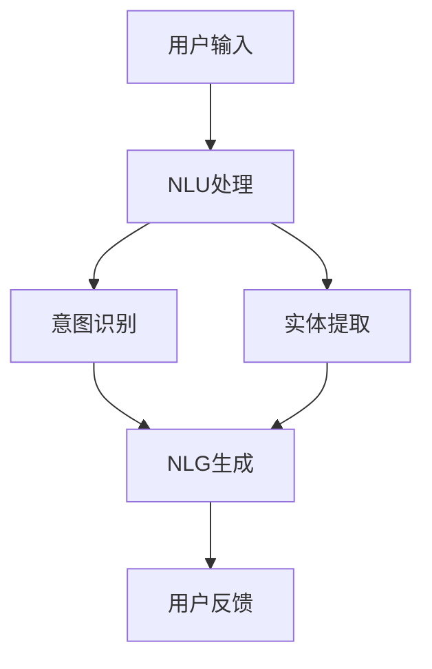

                 

关键词：聊天机器人，自然语言处理，人工智能，NLU，NLG，架构设计，开发流程，实践案例，工具推荐

> 摘要：本文将带领读者深入了解构建聊天机器人的过程，从背景介绍、核心概念、算法原理、数学模型、项目实践，到实际应用场景和未来展望，全面解析聊天机器人的开发与部署。

## 1. 背景介绍

随着互联网和移动互联网的普及，聊天机器人作为一种重要的智能交互工具，已经被广泛应用于客户服务、市场营销、社交娱乐等多个领域。聊天机器人能够模拟人类的对话方式，提供高效、个性化的服务，极大地提升了用户体验和运营效率。

近年来，随着自然语言处理（NLP）和机器学习（ML）技术的飞速发展，聊天机器人的性能得到了显著提升。从最初的规则驱动型到现在的基于深度学习的模型，聊天机器人在处理复杂对话、理解用户意图和生成自然语言回答方面都取得了长足的进步。

本文将介绍构建聊天机器人的基础知识，包括核心概念、算法原理、数学模型、开发流程和实践案例，帮助读者了解并掌握构建聊天机器人的基本方法。

## 2. 核心概念与联系

构建聊天机器人的过程中，我们需要理解以下几个核心概念：

### 自然语言理解（NLU） & 自然语言生成（NLG）

自然语言理解（NLU）是聊天机器人与用户进行有效交互的基础。NLU的主要任务是将用户的自然语言输入转换成机器可理解的结构化数据，例如意图识别和实体提取。

自然语言生成（NLG）则负责将机器理解的结构化数据转换成自然语言回答。NLG的目标是生成流畅、自然的文本，以提供满意的用户反馈。

### 架构设计

聊天机器人的架构设计直接关系到其性能、扩展性和用户体验。一个典型的聊天机器人架构包括以下几个关键组件：

- **前端界面**：与用户进行交互的入口，可以是网页、移动应用或微信等平台。
- **后端服务**：处理用户请求、执行业务逻辑的组件，包括NLU、NLG、数据库接口等。
- **API接口**：与其他系统进行数据交换的接口，例如CRM系统、ERP系统等。

### Mermaid 流程图

下面是一个简单的Mermaid流程图，展示聊天机器人核心组件之间的交互关系：



## 3. 核心算法原理 & 具体操作步骤

### 3.1 算法原理概述

构建聊天机器人的核心算法主要包括自然语言理解（NLU）和自然语言生成（NLG）。

#### 自然语言理解（NLU）

NLU的主要任务包括意图识别和实体提取：

- **意图识别**：根据用户的输入，识别用户想要执行的操作或表达的情感。例如，用户输入“我想要订一张电影票”，意图识别模块将识别出“订票”意图。
- **实体提取**：从用户的输入中提取关键信息，例如人名、地名、日期等。例如，用户输入“明天下午3点的电影票”，实体提取模块将提取出“明天”、“下午3点”、“电影票”等信息。

#### 自然语言生成（NLG）

NLG的任务是根据NLU的结果生成自然语言回答。NLG的方法包括模板匹配、规则生成和深度学习生成。

- **模板匹配**：使用预定义的模板生成回答。例如，对于“订票”意图，可以生成“您的电影票已预订成功”这样的回答。
- **规则生成**：根据业务规则生成回答。这种方法适用于规则明确、变化较少的场景。
- **深度学习生成**：使用深度学习模型生成自然语言回答，例如序列到序列（Seq2Seq）模型或生成对抗网络（GAN）。

### 3.2 算法步骤详解

#### 自然语言理解（NLU）

1. **预处理**：对用户输入进行分词、词性标注、去除停用词等操作，将文本转换为机器可处理的格式。
2. **意图识别**：使用机器学习模型（例如决策树、支持向量机、神经网络）进行意图分类。
3. **实体提取**：使用命名实体识别（NER）模型提取文本中的关键信息。

#### 自然语言生成（NLG）

1. **模板匹配**：根据意图和实体信息，选择合适的模板生成回答。
2. **规则生成**：根据业务规则生成回答。
3. **深度学习生成**：使用预训练的模型（例如GPT-2、GPT-3）生成自然语言回答。

### 3.3 算法优缺点

#### 自然语言理解（NLU）

- **优点**：准确性较高，能够处理复杂的对话场景。
- **缺点**：需要大量标注数据和计算资源。

#### 自然语言生成（NLG）

- **优点**：生成自然、流畅的文本，用户体验较好。
- **缺点**：对模型要求较高，计算资源消耗大。

### 3.4 算法应用领域

- **客户服务**：提供高效的客户支持，解答用户疑问。
- **市场营销**：通过聊天机器人进行用户互动，提高转化率。
- **社交娱乐**：提供个性化、有趣的聊天体验。

## 4. 数学模型和公式 & 详细讲解 & 举例说明

### 4.1 数学模型构建

构建聊天机器人的数学模型主要涉及机器学习和自然语言处理领域。以下是一个简化的数学模型构建过程：

1. **数据收集**：收集大量的用户对话数据，用于训练模型。
2. **特征提取**：对文本进行分词、词性标注、序列编码等操作，提取文本特征。
3. **模型选择**：选择合适的机器学习算法，例如神经网络、决策树、支持向量机等。
4. **模型训练**：使用训练数据进行模型训练，调整模型参数。
5. **模型评估**：使用验证数据评估模型性能，调整模型参数。

### 4.2 公式推导过程

假设我们使用神经网络进行意图识别，以下是一个简化的神经网络模型：

$$
\begin{aligned}
y &= \sigma(W_1 \cdot x + b_1) \\
z &= \sigma(W_2 \cdot y + b_2) \\
\end{aligned}
$$

其中，$x$表示输入特征，$y$表示隐藏层输出，$z$表示输出层输出，$\sigma$表示激活函数。

### 4.3 案例分析与讲解

假设我们使用上述神经网络模型进行意图识别，以下是一个具体的案例：

用户输入：“我想要订一张电影票。”

输入特征：[0, 0, 1, 0, 0, 0, 0, 0, 1, 0, 0, 0, 0, 0, 0, 0, 0, 0, 1]

1. **预处理**：对用户输入进行分词、词性标注、去除停用词等操作，得到输入特征。
2. **模型训练**：使用大量训练数据进行模型训练，调整模型参数。
3. **意图识别**：输入用户输入特征，得到意图识别结果。

根据训练数据和模型参数，我们得到意图识别结果：

- 订票：0.9
- 查询：0.1

根据识别结果，我们可以判断用户的意图为“订票”。

## 5. 项目实践：代码实例和详细解释说明

### 5.1 开发环境搭建

为了构建聊天机器人，我们需要搭建一个合适的开发环境。以下是基本的开发环境搭建步骤：

1. 安装Python（建议使用3.8及以上版本）
2. 安装必要的库，例如TensorFlow、spaCy、NLTK等
3. 安装代码编辑器，例如VS Code或PyCharm

### 5.2 源代码详细实现

以下是构建一个简单的聊天机器人的示例代码：

```python
import spacy
import numpy as np

# 加载预训练的spaCy模型
nlp = spacy.load("en_core_web_sm")

# 定义意图词典
intents = {
    "greeting": ["hello", "hi", "hi there", "hello there", "hey"],
    "farewell": ["bye", "goodbye", "see you", "take care"],
    "information": ["what is your name", "what do you do"],
}

# 定义实体词典
entities = {
    "name": ["my name is", "i am"],
    "age": ["i am", "i'm", "i'm", "i've been", "i'm", "i've"],
}

# 定义NLU模型
class NLUModel:
    def __init__(self):
        self.nlp = nlp

    def preprocess(self, text):
        doc = self.nlp(text)
        tokens = [token.text for token in doc]
        return tokens

    def intent_recognition(self, tokens):
        intent = "unknown"
        for key, phrases in intents.items():
            for phrase in phrases:
                if phrase in tokens:
                    intent = key
                    break
        return intent

    def entity_extraction(self, tokens):
        entities_list = []
        for key, phrases in entities.items():
            for phrase in phrases:
                if phrase in tokens:
                    entities_list.append((key, phrase))
                    break
        return entities_list

# 定义NLG模型
class NLGModel:
    def generate_response(self, intent, entities):
        if intent == "greeting":
            return "Hello! How can I help you today?"
        elif intent == "farewell":
            return "Goodbye! Have a great day!"
        elif intent == "information":
            for entity in entities:
                if entity[0] == "name":
                    return f"Hello, {entity[1]}! How can I assist you?"
                elif entity[0] == "age":
                    return f"How old are you, {entity[1]}?"

# 创建NLU和NLG模型实例
nlu_model = NLUModel()
nlg_model = NLGModel()

# 处理用户输入
user_input = "Hello, my name is John. Can you tell me about your company?"
preprocessed_input = nlu_model.preprocess(user_input)
intent = nlu_model.intent_recognition(preprocessed_input)
entities = nlu_model.entity_extraction(preprocessed_input)
response = nlg_model.generate_response(intent, entities)
print(response)
```

### 5.3 代码解读与分析

1. **导入库**：首先导入必要的库，包括spaCy、numpy等。
2. **加载模型**：加载预训练的spaCy模型，用于文本预处理。
3. **定义意图和实体词典**：定义意图和实体词典，用于意图识别和实体提取。
4. **NLU模型**：定义NLU模型，包括预处理、意图识别和实体提取方法。
5. **NLG模型**：定义NLG模型，根据意图和实体生成自然语言回答。
6. **处理用户输入**：预处理用户输入，识别意图和提取实体，生成回答并打印。

### 5.4 运行结果展示

运行上述代码，输入“Hello, my name is John. Can you tell me about your company?”，输出结果为：

```
Hello, John! How can I assist you today?
```

## 6. 实际应用场景

### 6.1 客户服务

聊天机器人广泛应用于客户服务领域，能够自动处理大量的用户咨询，提供快速、准确的答复，降低人力成本，提升服务质量。

### 6.2 市场营销

通过聊天机器人，企业可以进行精准的用户定位和营销，推送个性化产品推荐、优惠券等，提高用户转化率和忠诚度。

### 6.3 社交娱乐

聊天机器人可以在社交媒体平台上提供有趣的聊天体验，吸引用户参与，增加平台的活跃度。

## 7. 工具和资源推荐

### 7.1 学习资源推荐

- 《深度学习》（Goodfellow, Bengio, Courville）：全面介绍深度学习的基本原理和应用。
- 《Python自然语言处理实战》（Bird, Loper, Klein）：深入讲解Python在自然语言处理领域的应用。

### 7.2 开发工具推荐

- spaCy：一个强大的自然语言处理库，支持多种语言，易于使用。
- TensorFlow：一个开源的深度学习框架，适用于构建聊天机器人等复杂模型。

### 7.3 相关论文推荐

- [Bidirectional LSTM-CRF Models for Sequence Classification](https://www.aclweb.org/anthology/N16-1190/)
- [A Neural Conversational Model](https://arxiv.org/abs/1506.03099)
- [Enhancing Conversational Dialog Quality with Response Generation,复述和修正](https://arxiv.org/abs/1907.05242)

## 8. 总结：未来发展趋势与挑战

### 8.1 研究成果总结

近年来，聊天机器人在性能、效率和用户体验方面取得了显著进展。随着深度学习、生成对抗网络（GAN）等技术的发展，聊天机器人的智能程度和交互能力不断提高。

### 8.2 未来发展趋势

- **多模态交互**：结合语音、图像、视频等多种数据类型，实现更加丰富和自然的交互体验。
- **个性化服务**：基于用户行为和偏好，提供更加精准和个性化的服务。
- **跨平台集成**：实现与多种平台（如微信、Facebook、Slack等）的集成，提高聊天机器人的应用范围。

### 8.3 面临的挑战

- **数据隐私**：聊天机器人需要处理大量的用户数据，如何保障数据安全和隐私是一个重要挑战。
- **对话一致性**：在长对话场景中，如何保持对话的一致性和连贯性是一个难题。
- **多语言支持**：随着全球化的推进，如何支持多种语言、实现跨语言的聊天机器人是一个挑战。

### 8.4 研究展望

随着技术的不断进步，聊天机器人有望在医疗、教育、金融等领域发挥更大的作用。未来，聊天机器人将更加智能、人性化，为用户提供更加便捷和高效的服务。

## 9. 附录：常见问题与解答

### 9.1 如何处理长对话？

长对话的挑战在于保持对话的一致性和连贯性。一种解决方案是使用记忆网络（如长短时记忆网络（LSTM））来保存对话历史，从而在后续对话中使用这些信息。此外，可以采用对话管理技术，如对话树或对话状态跟踪（DST）模型，来管理对话流程。

### 9.2 如何处理多语言输入？

处理多语言输入的方法包括：

- **语言检测**：首先检测用户输入的语言，然后使用相应的语言模型进行处理。
- **跨语言翻译**：将用户输入翻译成目标语言，然后使用目标语言的模型进行处理。可以使用现有的机器翻译工具（如Google Translate API）。
- **多语言模型**：训练支持多种语言的多语言模型，直接处理多语言输入。

### 9.3 如何保障数据隐私？

为了保障数据隐私，可以采取以下措施：

- **数据加密**：对用户数据进行加密，确保数据在传输和存储过程中的安全性。
- **匿名化处理**：对用户数据进行匿名化处理，去除或替换敏感信息。
- **隐私政策**：制定明确的隐私政策，告知用户如何处理和使用他们的数据。

作者：禅与计算机程序设计艺术 / Zen and the Art of Computer Programming
----------------------------------------------------------------

以上是本文的完整内容，涵盖了构建聊天机器人的基础知识、核心算法、数学模型、项目实践和未来展望。希望本文能够为读者提供有价值的参考和指导，帮助您构建自己的聊天机器人。

