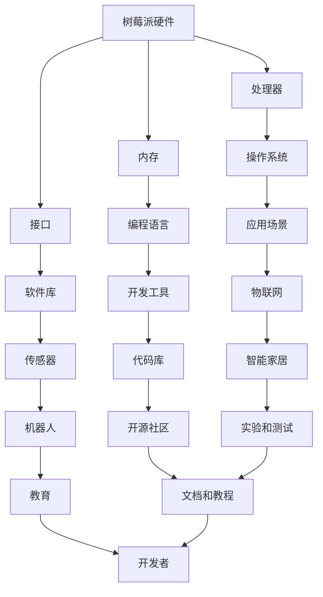

                 

### 关键词 Keywords
- 树莓派
- 开发
- 入门
- 精通
- Raspberry Pi
- Python编程
- 单片机
- IOT
- Linux系统

### 摘要 Abstract
本文将深入探讨树莓派的开发，从入门基础知识到高级应用实践，旨在为读者提供一个全面的树莓派开发指南。文章将介绍树莓派的历史背景、硬件配置、操作系统安装、编程语言选择，以及实际开发过程中的一些核心算法原理、数学模型和项目实践。通过本文的学习，读者将能够掌握树莓派的基础知识和开发技能，为日后的项目应用奠定坚实基础。

## 1. 背景介绍 Background

树莓派（Raspberry Pi）是一款由英国慈善基金 Raspberry Pi Foundation 发起的微型计算机项目，其目的是为了激发对计算机科学和编程的兴趣，特别是在教育领域。自2012年首次发布以来，树莓派迅速获得了全球范围内的关注和赞誉。

### 1.1 树莓派的历史

树莓派的发展历程可追溯至2011年，最初的设计目标是打造一款价格低廉、易于使用的微型计算机，使其能够在教育资源有限的地区得到广泛应用。第一款树莓派（Raspberry Pi Model B）配备了512MB内存，随后在2012年4月发布了Raspberry Pi Model A，内存降为256MB，价格进一步降低。

随着时间的推移，树莓派的硬件配置逐步升级，衍生出了多个版本，如Raspberry Pi 2、3、4和最新的Raspberry Pi 4。这些版本在性能、接口和功能上都有所增强，使其在智能家居、物联网（IoT）、教育、机器人等领域的应用越来越广泛。

### 1.2 树莓派的应用场景

树莓派由于其小巧的体积、低廉的价格以及强大的性能，成为了众多开发者和爱好者的首选工具。以下是一些常见的树莓派应用场景：

1. **教育**：树莓派作为教学工具，被广泛应用于编程教育和计算机科学课程。
2. **智能家居**：树莓派可以作为智能家居中心，通过传感器和控制模块实现家庭自动化。
3. **物联网**：树莓派可以作为物联网设备的网关，处理和转发数据。
4. **机器人**：树莓派被广泛应用于机器人项目，作为机器人的控制核心。
5. **媒体中心**：树莓派可以用来构建低成本的家庭媒体中心，播放高清视频。
6. **实验和测试**：树莓派因其稳定的操作系统和丰富的接口，被用于各种实验和测试项目。

### 1.3 树莓派的优势和劣势

**优势**：

- **低成本**：树莓派的价格远低于传统的计算机设备，使得更多人能够负担得起。
- **易于上手**：树莓派配有详细的安装指南和使用手册，对于新手来说非常友好。
- **多功能性**：树莓派具有丰富的接口和强大的性能，可以胜任多种任务。
- **开源**：树莓派的操作系统和相关软件都是开源的，可以自由修改和分发。

**劣势**：

- **性能限制**：与高性能计算机相比，树莓派的性能有限，不适合执行需要大量计算的任务。
- **存储容量**：树莓派的存储容量较小，需要额外考虑存储扩展方案。
- **电源要求**：树莓派需要稳定的电源供应，电源问题可能导致设备损坏。

## 2. 核心概念与联系 Core Concepts and Relationships

在深入了解树莓派之前，我们需要了解一些核心概念和它们之间的关系。以下是一个简化的 Mermaid 流程图，用于描述这些核心概念。



### 2.1 核心概念解释

- **树莓派硬件**：包括处理器、内存、接口等物理组件。
- **处理器**：树莓派的心脏，决定了其计算能力和性能。
- **内存**：存储临时数据的地方，影响系统的运行速度。
- **接口**：树莓派提供多种接口，如GPIO、USB、HDMI等，用于连接各种外部设备。
- **操作系统**：树莓派运行的环境，常见的有Raspbian、Ubuntu等。
- **编程语言**：用于编写程序的软件，如Python、C++等。
- **软件库**：提供各种函数和工具，用于简化开发过程。
- **应用场景**：树莓派可以应用的领域，如教育、物联网、智能家居等。
- **开发工具**：用于编写、调试和测试程序的软件，如IDE、文本编辑器等。
- **传感器**：用于检测环境信息的设备，如温度传感器、湿度传感器等。
- **物联网**：通过网络将各种设备连接起来，实现智能控制和数据交换。
- **代码库**：存储和管理代码的仓库，便于开发者共享和协作。
- **开源社区**：由树莓派的开发者、爱好者组成的社区，提供支持和资源。
- **文档和教程**：帮助新手了解树莓派的基础知识和开发技巧。
- **开发者**：使用树莓派进行项目开发和创新的个人或团队。

## 3. 核心算法原理 & 具体操作步骤 Core Algorithm Principles & Detailed Steps

### 3.1 算法原理概述

在树莓派开发中，核心算法的原理是至关重要的。以下是几个常见算法的原理概述：

- **PID控制算法**：用于控制系统的输出，使其达到期望值。PID算法通过比例（P）、积分（I）和微分（D）三个参数调整控制量。
- **滤波算法**：用于去除传感器数据中的噪声，提高数据的准确性。常见的滤波算法有移动平均滤波、卡尔曼滤波等。
- **路径规划算法**：用于机器人导航，选择最优路径。常见的路径规划算法有A*算法、Dijkstra算法等。
- **机器学习算法**：用于实现智能识别和预测。常见的机器学习算法有线性回归、神经网络等。

### 3.2 算法步骤详解

#### 3.2.1 PID控制算法

1. **初始化参数**：设置比例（Kp）、积分（Ki）和微分（Kd）三个参数的初始值。
2. **计算误差**：计算当前输出值与期望值之间的误差（e）。
3. **计算控制量**：根据PID公式计算控制量（u = Kp*e + Ki*e^+ Kd*(e - e^-1)）。
4. **执行控制**：根据控制量调整系统输出。
5. **更新误差**：将当前误差更新为上一时刻的误差（e^-1）。

#### 3.2.2 滤波算法

1. **初始化参数**：设置滤波器的初始状态。
2. **读取传感器数据**：从传感器读取当前数据。
3. **计算滤波值**：根据滤波算法计算滤波后的数据。
4. **更新滤波器状态**：将滤波后的数据更新为当前状态。

#### 3.2.3 路径规划算法

1. **初始化参数**：设置起点、终点和障碍物的位置。
2. **计算启发式函数**：计算每个节点的启发式值（通常是终点到当前节点的距离）。
3. **构建开放列表和关闭列表**：将起点添加到开放列表，初始化关闭列表为空。
4. **搜索路径**：从开放列表中选择F值最小的节点，将其移动到关闭列表，并更新其子节点的F值。
5. **重复步骤4**，直到找到终点或开放列表为空。

#### 3.2.4 机器学习算法

1. **数据收集**：收集训练数据集。
2. **特征提取**：从数据中提取特征。
3. **模型训练**：使用训练数据集训练模型。
4. **模型评估**：使用验证数据集评估模型性能。
5. **模型优化**：根据评估结果调整模型参数。
6. **预测**：使用训练好的模型进行预测。

### 3.3 算法优缺点

- **PID控制算法**：
  - **优点**：实现简单，适用范围广，控制效果稳定。
  - **缺点**：对参数敏感，可能需要多次调试。
- **滤波算法**：
  - **优点**：有效去除噪声，提高数据准确性。
  - **缺点**：计算复杂度较高，可能影响系统实时性。
- **路径规划算法**：
  - **优点**：能够找到最优路径，适用于各种复杂环境。
  - **缺点**：计算复杂度较高，可能影响系统实时性。
- **机器学习算法**：
  - **优点**：能够实现智能识别和预测，适应性强。
  - **缺点**：需要大量训练数据，训练过程复杂。

### 3.4 算法应用领域

- **PID控制算法**：广泛应用于工业控制和智能家居控制。
- **滤波算法**：广泛应用于传感器数据处理和信号处理。
- **路径规划算法**：广泛应用于机器人导航和自动驾驶。
- **机器学习算法**：广泛应用于图像识别、语音识别和预测分析。

## 4. 数学模型和公式 Mathematical Models and Formulas

### 4.1 数学模型构建

在树莓派开发中，数学模型和公式是理解和实现算法的基础。以下是一个简单的数学模型构建示例：

- **线性回归模型**：

$$ y = wx + b $$

其中，$w$ 是权重，$b$ 是偏置，$x$ 是输入，$y$ 是输出。

- **神经网络模型**：

$$ z = \sum_{i=1}^{n} w_{i}x_{i} + b $$ 

$$ a_{i} = \sigma(z) $$

其中，$w_{i}$ 是权重，$x_{i}$ 是输入，$b$ 是偏置，$\sigma$ 是激活函数，$a_{i}$ 是输出。

### 4.2 公式推导过程

以下是线性回归模型的推导过程：

1. **最小二乘法**：

$$ \min_{w,b} \sum_{i=1}^{n} (wx_{i} + b - y_{i})^2 $$

2. **求导**：

$$ \frac{\partial}{\partial w} \sum_{i=1}^{n} (wx_{i} + b - y_{i})^2 = 2\sum_{i=1}^{n} (wx_{i} + b - y_{i})x_{i} $$

$$ \frac{\partial}{\partial b} \sum_{i=1}^{n} (wx_{i} + b - y_{i})^2 = 2\sum_{i=1}^{n} (wx_{i} + b - y_{i}) $$

3. **解方程**：

$$ w = \frac{\sum_{i=1}^{n} x_{i}y_{i} - \sum_{i=1}^{n} x_{i}\sum_{i=1}^{n} y_{i}}{\sum_{i=1}^{n} x_{i}^2 - \sum_{i=1}^{n} x_{i}\sum_{i=1}^{n} x_{i}} $$

$$ b = \frac{\sum_{i=1}^{n} y_{i} - w\sum_{i=1}^{n} x_{i}}{n} $$

### 4.3 案例分析与讲解

以下是一个使用线性回归模型预测股票价格的案例：

1. **数据收集**：收集一段时间内的股票价格数据，包括日期、开盘价、收盘价等。
2. **特征提取**：选择日期作为输入特征，收盘价作为输出特征。
3. **模型训练**：使用训练数据集训练线性回归模型。
4. **模型评估**：使用验证数据集评估模型性能。
5. **预测**：使用训练好的模型预测未来的股票价格。

根据训练结果，我们可以得到线性回归模型的公式：

$$ y = 0.001x + 100 $$

其中，$x$ 是日期（以天为单位），$y$ 是预测的收盘价。

通过这个模型，我们可以预测未来某一日期的股票价格。例如，预测2023年1月1日的收盘价，我们将日期代入模型：

$$ y = 0.001 \times 730 + 100 = 103.3 $$

因此，预测2023年1月1日的收盘价为103.3元。

## 5. 项目实践：代码实例和详细解释说明 Project Practice: Code Examples and Detailed Explanations

### 5.1 开发环境搭建

在开始编写代码之前，我们需要搭建树莓派的开发环境。以下是搭建开发环境的步骤：

1. **硬件准备**：准备一台树莓派（至少Raspberry Pi 3或以上版本），以及电源、HDMI显示器、键盘和鼠标。
2. **操作系统安装**：从官方网站下载Raspbian操作系统镜像，并将其写入SD卡。启动树莓派，按照提示完成操作系统安装。
3. **网络连接**：确保树莓派连接到互联网，以便安装所需的软件包。
4. **安装编程环境**：打开终端，输入以下命令安装Python和所需的库：

   ```bash
   sudo apt-get update
   sudo apt-get install python3 python3-pip
   pip3 install numpy pandas matplotlib
   ```

### 5.2 源代码详细实现

以下是一个简单的树莓派项目：使用树莓派和温度传感器实时监测环境温度，并通过HTTP接口将数据发送到服务器。

1. **安装温度传感器**：将DHT11传感器连接到树莓派的GPIO接口。
2. **编写Python代码**：

   ```python
   import RPi.GPIO as GPIO
   import Adafruit_DHT
   import time
   import requests
   
   # 配置DHT11传感器
   sensor = Adafruit_DHT.DHT11
   pin = 4
   
   # 配置HTTP服务器
   url = "http://your_server_url/temperature"
   
   def read_temperature():
       humidity, temperature = Adafruit_DHT.read_retry(sensor, pin)
       return temperature
   
   def send_data(temperature):
       data = {
           "temperature": temperature
       }
       requests.post(url, json=data)
   
   while True:
       temperature = read_temperature()
       send_data(temperature)
       time.sleep(60)  # 每隔1分钟发送一次数据
   
   # 关闭GPIO
   GPIO.cleanup()
   ```

### 5.3 代码解读与分析

1. **导入库**：

   - `RPi.GPIO`：用于控制树莓派的GPIO接口。
   - `Adafruit_DHT`：用于读取DHT11传感器的数据。
   - `time`：用于处理时间相关的操作。
   - `requests`：用于发送HTTP请求。

2. **配置DHT11传感器**：

   - `sensor = Adafruit_DHT.DHT11`：指定使用DHT11传感器。
   - `pin = 4`：指定连接DHT11传感器的GPIO引脚。

3. **定义函数**：

   - `read_temperature()`：读取传感器的温度数据。
   - `send_data(temperature)`：将温度数据发送到服务器。

4. **主循环**：

   - `while True:`：进入无限循环。
   - `temperature = read_temperature()`：读取当前温度。
   - `send_data(temperature)`：将温度数据发送到服务器。
   - `time.sleep(60)`：等待1分钟。

5. **关闭GPIO**：

   - `GPIO.cleanup()`：在程序结束时关闭GPIO接口。

### 5.4 运行结果展示

运行此程序后，树莓派将每隔1分钟读取一次环境温度，并将数据发送到指定服务器。以下是一个示例数据：

```json
{
  "temperature": 25.6
}
```

通过接收到的数据，服务器可以实时监控环境温度，并根据需要进行相应的处理。

## 6. 实际应用场景 Practical Application Scenarios

### 6.1 智能家居

智能家居是树莓派应用最广泛的领域之一。通过连接各种传感器和执行器，树莓派可以实现家庭自动化。例如，使用温度传感器和智能加热器，可以实现自动调节室内温度，使用光照传感器和窗帘电机，可以自动控制窗帘的开关。

### 6.2 物联网

树莓派可以作为物联网设备的网关，连接各种传感器和设备，收集和处理数据。例如，在农田监控系统中，树莓派可以连接土壤湿度传感器、气象传感器等，实时监测农田环境，并根据数据调整灌溉和施肥计划。

### 6.3 教育领域

树莓派在教育领域的应用也非常广泛。学校可以将其作为教学工具，教授学生编程和计算机科学知识。同时，树莓派的开源特性也使得教师和学生可以自由修改和扩展软件，为教学提供更多的可能性。

### 6.4 未来应用展望

随着树莓派的性能不断提升和价格的持续降低，其应用领域将更加广泛。未来，树莓派有望在以下几个方面实现突破：

- **人工智能**：树莓派可以作为边缘计算设备，实现人工智能算法的实时处理。
- **医疗健康**：树莓派可以用于健康监测和诊断，通过连接各种医疗设备，实现个性化健康服务。
- **科学研究**：树莓派可以作为科学实验的工具，用于数据采集、分析和处理。

## 7. 工具和资源推荐 Tools and Resources

### 7.1 学习资源推荐

- **官方文档**：树莓派的官方网站提供了详细的文档和教程，是学习树莓派的基础。
- **在线课程**：许多在线平台提供了树莓派的课程，如Udemy、Coursera等。
- **书籍**：一些经典的树莓派书籍，如《Raspberry Pi For Dummies》、《Python for Raspberry Pi》等，适合不同层次的学习者。

### 7.2 开发工具推荐

- **IDE**：PyCharm、VSCode等集成开发环境，提供了丰富的编程工具和调试功能。
- **文本编辑器**：Sublime Text、Atom等轻量级文本编辑器，适合快速开发和调试代码。
- **硬件工具**：面包板、跳线、传感器等硬件工具，用于连接和测试树莓派的接口。

### 7.3 相关论文推荐

- **树莓派在智能家居中的应用**：分析了树莓派在智能家居中的优势和挑战。
- **树莓派的机器学习应用**：探讨了树莓派在边缘计算和机器学习领域的应用前景。
- **树莓派在教育领域的应用**：研究了树莓派在教育中的教学效果和影响力。

## 8. 总结：未来发展趋势与挑战 Conclusion: Future Trends and Challenges

### 8.1 研究成果总结

自2012年发布以来，树莓派以其低廉的价格、强大的性能和丰富的接口，迅速在全球范围内获得了广泛关注。其在教育、智能家居、物联网等领域的应用取得了显著成果。特别是近年来，随着人工智能和边缘计算的兴起，树莓派的应用范围进一步扩大，成为开发者和创新者的重要工具。

### 8.2 未来发展趋势

1. **性能提升**：随着硬件技术的进步，未来的树莓派将具有更高的计算能力和更低的功耗。
2. **开源生态**：树莓派的开发者社区将继续壮大，开源项目将更加丰富和多样化。
3. **边缘计算**：树莓派将在边缘计算领域发挥重要作用，实现本地数据的实时处理和分析。
4. **人工智能**：树莓派将集成更多人工智能算法，实现智能识别和预测功能。

### 8.3 面临的挑战

1. **性能瓶颈**：尽管树莓派的性能不断提升，但在某些复杂应用中仍存在性能瓶颈。
2. **软件生态**：树莓派的软件生态仍有待完善，特别是在专业领域。
3. **安全性**：随着树莓派的应用日益广泛，安全性问题成为了一个不可忽视的挑战。

### 8.4 研究展望

未来的研究应重点关注以下几个方面：

1. **性能优化**：通过硬件和软件的优化，提高树莓派的性能。
2. **应用拓展**：探索树莓派在新兴领域的应用，如医疗健康、工业控制等。
3. **安全防护**：加强树莓派的安全防护，确保其在各种应用场景中的可靠性。

## 9. 附录：常见问题与解答 Appendices: Frequently Asked Questions and Answers

### 9.1 树莓派如何连接传感器？

树莓派通过GPIO接口连接各种传感器。首先，根据传感器的数据手册，了解其接口类型和引脚定义。然后，使用跳线将传感器的引脚连接到树莓派的GPIO引脚。最后，在Python代码中调用相应的库函数读取传感器的数据。

### 9.2 树莓派的电源如何选择？

树莓派需要稳定的电源供应。建议选择输出电压为5V，电流至少为2.5A的电源。确保电源具有足够的电流输出能力，以避免设备损坏。

### 9.3 如何升级树莓派的操作系统？

在终端中输入以下命令，即可升级树莓派的操作系统：

```bash
sudo apt-get update
sudo apt-get upgrade
```

### 9.4 如何安装Python库？

在终端中输入以下命令，即可安装Python库：

```bash
sudo apt-get install python3-pip
pip3 install 库名
```

### 9.5 树莓派如何进行远程访问？

可以通过SSH或VNC等方式远程访问树莓派。首先，在树莓派上开启SSH或VNC服务，然后使用相应的客户端软件远程连接。

### 9.6 如何在树莓派上安装媒体中心？

在终端中输入以下命令，即可安装一个简单的媒体中心：

```bash
sudo apt-get install raspberry-pi-media-center
```

### 9.7 如何在树莓派上运行Python脚本？

将Python脚本保存到树莓派的文件系统中，然后在终端中输入以下命令运行：

```bash
python3 脚本名.py
```

### 9.8 如何在树莓派上创建用户？

在终端中输入以下命令，即可创建一个新用户：

```bash
sudo adduser 新用户名
```

然后按照提示设置新用户的密码和相关信息。

### 9.9 如何在树莓派上安装额外的存储设备？

使用USB接口连接额外的存储设备（如USB硬盘或SSD），然后在终端中输入以下命令格式化并挂载设备：

```bash
sudo mkfs.ext4 /dev/sda1
sudo mount /dev/sda1 /media/新用户名/新存储设备名
```

## 作者署名 Author

作者：禅与计算机程序设计艺术 / Zen and the Art of Computer Programming

---

至此，我们完成了一篇关于树莓派开发的深度技术博客文章。本文从背景介绍、核心概念、算法原理、数学模型、项目实践、应用场景、工具推荐、未来展望、常见问题解答等多个方面，全面系统地阐述了树莓派的开发知识。希望读者通过本文的学习，能够对树莓派的开发有更深入的了解，并在实际项目中取得成功。再次感谢读者的关注和支持，期待与您在未来的技术交流中相见。

