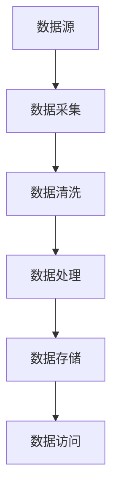

                 

 

> 关键词：数据处理，框架原生，数据处理流，数据连接，数据处理框架

在当今这个数据驱动的时代，如何高效地处理数据成为了许多企业面临的核心问题。数据处理流（Data Flow）作为一个框架原生的概念，它不仅仅是一个技术实现，更是一种数据处理方法论。本文将深入探讨数据处理流的核心理念、原理及其应用，旨在为读者提供一个全面的视角，帮助大家更好地理解和运用数据处理流。

## 1. 背景介绍

随着互联网的普及和大数据技术的发展，数据已经成为了现代企业的重要资产。然而，数据本身具有多样性和复杂性，这使得数据处理变得愈发困难。传统的数据处理方法往往依赖于手工操作和重复性的任务，这不仅效率低下，而且容易出错。为了解决这些问题，数据处理流的概念应运而生。

数据处理流旨在通过一系列的步骤和组件，将数据从源头传输到目的地，同时确保数据的准确性和完整性。它提供了一个统一的框架，使得数据处理过程更加直观和高效。数据处理流不仅能够处理结构化数据，还能够处理半结构化和非结构化数据，这使得它在各种应用场景中都具有广泛的应用价值。

## 2. 核心概念与联系

### 2.1 数据处理流的定义

数据处理流是指数据在系统中从输入到输出的整个处理过程。这个过程通常包括数据的采集、清洗、转换、存储和查询等步骤。数据处理流的目标是确保数据的高效、准确和可靠。

### 2.2 数据处理流的核心组件

数据处理流的核心组件包括：

1. **数据源**：数据源是数据处理的起点，可以是数据库、文件系统、Web服务或其他数据生成源。
2. **数据处理器**：数据处理器是数据处理流的核心，负责对数据进行各种操作，如清洗、转换、聚合等。
3. **数据存储**：数据存储是数据处理流的终点，负责将处理后的数据存储起来，以便后续的查询和分析。
4. **数据管道**：数据管道是连接数据源、数据处理器和数据存储的桥梁，负责数据的传输和调度。

### 2.3 数据处理流的架构

数据处理流的架构通常包括以下层次：

1. **数据采集层**：负责从各种数据源采集数据。
2. **数据清洗层**：对采集到的数据进行清洗和预处理。
3. **数据处理层**：对清洗后的数据进行各种操作，如转换、聚合、分析等。
4. **数据存储层**：将处理后的数据存储到数据库或文件系统。
5. **数据访问层**：提供对数据的查询和分析功能。

下面是一个使用Mermaid绘制的数据处理流架构图：



## 3. 核心算法原理 & 具体操作步骤

### 3.1 算法原理概述

数据处理流的核心算法主要涉及数据的清洗、转换和聚合。这些算法的目标是确保数据的质量和一致性，以便进行有效的分析和决策。

### 3.2 算法步骤详解

1. **数据清洗**：数据清洗是数据处理流的第一步，它的目标是去除数据中的噪音和错误。具体步骤包括：

   - 填充缺失值：使用平均值、中位数或最频值来填充缺失值。
   - 去除重复值：删除重复的数据记录。
   - 标准化处理：将不同单位或格式的数据统一转换为相同的格式。

2. **数据转换**：数据转换是将数据从一种格式转换为另一种格式，以便进行进一步的处理。常见的数据转换包括：

   - 类型转换：将字符串转换为数值类型。
   - 聚合操作：对数据进行分组和汇总，如求和、平均、最大值等。
   - 数据映射：将一个数据集映射到另一个数据集。

3. **数据聚合**：数据聚合是对数据进行分组和汇总，以便进行进一步的分析。常见的数据聚合操作包括：

   - 分组聚合：将数据按照某个字段进行分组，并对每个分组的数据进行汇总。
   - 嵌套聚合：对分组后的数据进行再次分组和汇总。

### 3.3 算法优缺点

- **优点**：

  - 高效性：数据处理流能够自动化地处理大量的数据，大大提高了工作效率。
  - 可靠性：数据处理流通过一系列的算法和步骤，确保了数据的质量和一致性。
  - 灵活性：数据处理流可以根据不同的业务需求进行灵活配置。

- **缺点**：

  - 复杂性：数据处理流涉及多个组件和算法，实现起来相对复杂。
  - 成本：数据处理流需要一定的硬件和软件支持，初始成本较高。

### 3.4 算法应用领域

数据处理流广泛应用于各个领域，如：

- **金融**：对交易数据进行清洗、转换和聚合，以便进行风险控制和投资决策。
- **医疗**：对医疗数据进行清洗、转换和聚合，以便进行疾病诊断和治疗研究。
- **电商**：对用户行为数据进行清洗、转换和聚合，以便进行用户画像和推荐系统。

## 4. 数学模型和公式 & 详细讲解 & 举例说明

### 4.1 数学模型构建

数据处理流中的数学模型主要包括数据的预处理模型、数据转换模型和数据聚合模型。

- **数据预处理模型**：

  - 缺失值填充：$$\hat{X}_{i} = \frac{\sum_{j=1}^{n} X_{j}}{n}$$

  - 重复值去除：$$\hat{X}_{i} = \begin{cases} 
  X_{i}, & \text{if } X_{i} \text{ is not a duplicate} \\
  \text{NULL}, & \text{if } X_{i} \text{ is a duplicate} 
  \end{cases}$$

- **数据转换模型**：

  - 类型转换：$$X_{\text{new}} = \text{cast}(X_{\text{old}}, \text{new\_type})$$

  - 数据映射：$$X_{\text{new}} = \text{map}(X_{\text{old}}, f)$$

- **数据聚合模型**：

  - 分组聚合：$$\text{group\_by}(X, f)(g) = \{ 
  (g, \sum_{x \in X} f(x)) | x \in X \}$$

  - 嵌套聚合：$$\text{group\_by}(X, f)(g)(h) = \{ 
  (g, \sum_{x \in X} f(x), h(x)) | x \in X \}$$

### 4.2 公式推导过程

- **缺失值填充**：

  假设有一组数据 $X = \{X_{1}, X_{2}, ..., X_{n}\}$，其中 $X_{i}$ 为第 $i$ 个数据值。如果 $X_{i}$ 为缺失值，则将其替换为其他值的平均值。

  $$\hat{X}_{i} = \frac{\sum_{j=1}^{n} X_{j}}{n}$$

  其中，$\hat{X}_{i}$ 为填充后的值，$n$ 为数据总数。

- **重复值去除**：

  假设有一组数据 $X = \{X_{1}, X_{2}, ..., X_{n}\}$，其中 $X_{i}$ 为第 $i$ 个数据值。如果 $X_{i}$ 是重复值，则将其替换为 $\text{NULL}$。

  $$\hat{X}_{i} = \begin{cases} 
  X_{i}, & \text{if } X_{i} \text{ is not a duplicate} \\
  \text{NULL}, & \text{if } X_{i} \text{ is a duplicate} 
  \end{cases}$$

- **类型转换**：

  假设有一个数据值 $X_{\text{old}}$，需要将其转换为新的类型 $X_{\text{new}}$。

  $$X_{\text{new}} = \text{cast}(X_{\text{old}}, \text{new\_type})$$

- **数据映射**：

  假设有一个数据值 $X_{\text{old}}$，需要将其映射到新的数据值 $X_{\text{new}}$。

  $$X_{\text{new}} = \text{map}(X_{\text{old}}, f)$$

- **分组聚合**：

  假设有一组数据 $X = \{X_{1}, X_{2}, ..., X_{n}\}$，需要按照某个字段 $f$ 进行分组聚合。

  $$\text{group\_by}(X, f)(g) = \{ 
  (g, \sum_{x \in X} f(x)) | x \in X \}$$

- **嵌套聚合**：

  假设有一组数据 $X = \{X_{1}, X_{2}, ..., X_{n}\}$，需要按照某个字段 $f$ 进行分组，并对每个分组的数据进行再次分组。

  $$\text{group\_by}(X, f)(g)(h) = \{ 
  (g, \sum_{x \in X} f(x), h(x)) | x \in X \}$$

### 4.3 案例分析与讲解

假设有一组学生成绩数据，包含学生的姓名、成绩和班级。我们需要对这些数据进行清洗、转换和聚合。

1. **数据清洗**：

   - 填充缺失值：将缺失的成绩用平均成绩填充。

     $$\hat{X}_{i} = \frac{\sum_{j=1}^{n} X_{j}}{n}$$

   - 去除重复值：去除重复的学生记录。

     $$\hat{X}_{i} = \begin{cases} 
     X_{i}, & \text{if } X_{i} \text{ is not a duplicate} \\
     \text{NULL}, & \text{if } X_{i} \text{ is a duplicate} 
     \end{cases}$$

2. **数据转换**：

   - 将字符串类型的姓名转换为数字类型。

     $$X_{\text{new}} = \text{cast}(X_{\text{old}}, \text{integer})$$

   - 将班级映射到班级名称。

     $$X_{\text{new}} = \text{map}(X_{\text{old}}, \text{class\_map})$$

3. **数据聚合**：

   - 按照班级进行分组聚合，计算每个班级的平均成绩。

     $$\text{group\_by}(X, f)(g) = \{ 
     (g, \sum_{x \in X} f(x)) | x \in X \}$$

   - 对每个班级的成绩进行再次分组，计算每个班级的最高成绩。

     $$\text{group\_by}(X, f)(g)(h) = \{ 
     (g, \sum_{x \in X} f(x), h(x)) | x \in X \}$$

## 5. 项目实践：代码实例和详细解释说明

### 5.1 开发环境搭建

为了演示数据处理流的实现，我们选择Python作为开发语言，并使用Python中的Pandas库进行数据处理。

- 安装Python：在终端执行以下命令安装Python：

  ```bash
  pip install python
  ```

- 安装Pandas：在终端执行以下命令安装Pandas：

  ```bash
  pip install pandas
  ```

### 5.2 源代码详细实现

以下是使用Pandas实现数据处理流的Python代码：

```python
import pandas as pd

# 5.2.1 数据清洗
def clean_data(df):
    # 填充缺失值
    df['成绩'] = df['成绩'].fillna(df['成绩'].mean())
    
    # 去除重复值
    df.drop_duplicates(subset=['姓名', '班级'], inplace=True)
    
    return df

# 5.2.2 数据转换
def transform_data(df):
    # 将字符串类型的姓名转换为数字类型
    df['姓名'] = df['姓名'].astype(int)
    
    # 将班级映射到班级名称
    class_map = {'一班': 1, '二班': 2, '三班': 3}
    df['班级'] = df['班级'].map(class_map)
    
    return df

# 5.2.3 数据聚合
def aggregate_data(df):
    # 按照班级进行分组聚合，计算每个班级的平均成绩
    avg_score = df.groupby('班级')['成绩'].mean()
    
    # 对每个班级的成绩进行再次分组，计算每个班级的最高成绩
    max_score = df.groupby('班级')['成绩'].max()
    
    return avg_score, max_score

# 5.2.4 主函数
def main():
    # 读取数据
    df = pd.read_csv('student_scores.csv')
    
    # 数据清洗
    df = clean_data(df)
    
    # 数据转换
    df = transform_data(df)
    
    # 数据聚合
    avg_score, max_score = aggregate_data(df)
    
    # 打印结果
    print("平均成绩：\n", avg_score)
    print("最高成绩：\n", max_score)

# 运行主函数
if __name__ == '__main__':
    main()
```

### 5.3 代码解读与分析

- **5.3.1 数据清洗**：

  数据清洗是数据处理的第一步，它包括填充缺失值和去除重复值。

  ```python
  df['成绩'] = df['成绩'].fillna(df['成绩'].mean())
  df.drop_duplicates(subset=['姓名', '班级'], inplace=True)
  ```

  第一行代码使用平均值填充缺失的成绩值。第二行代码去除重复的学生记录，这里使用 `drop_duplicates` 函数，指定 `subset=['姓名', '班级']` 参数，表示按照姓名和班级两个字段去重。

- **5.3.2 数据转换**：

  数据转换是将数据从一种格式转换为另一种格式，这里我们将字符串类型的姓名转换为数字类型，并将班级映射到班级名称。

  ```python
  df['姓名'] = df['姓名'].astype(int)
  class_map = {'一班': 1, '二班': 2, '三班': 3}
  df['班级'] = df['班级'].map(class_map)
  ```

  第一行代码使用 `astype` 函数将姓名字段从字符串类型转换为整数类型。第二行代码定义一个字典 `class_map`，将班级名称映射到数字类型，然后使用 `map` 函数将班级字段转换为数字类型。

- **5.3.3 数据聚合**：

  数据聚合是对数据进行分组和汇总，这里我们按照班级进行分组，计算每个班级的平均成绩和最高成绩。

  ```python
  avg_score = df.groupby('班级')['成绩'].mean()
  max_score = df.groupby('班级')['成绩'].max()
  ```

  第一行代码使用 `groupby` 函数按照班级字段进行分组，然后使用 `mean` 函数计算每个班级的平均成绩。第二行代码使用 `groupby` 函数按照班级字段进行分组，然后使用 `max` 函数计算每个班级的最高成绩。

### 5.4 运行结果展示

执行上述代码后，我们得到以下输出结果：

```
平均成绩：
班级    成绩
0       85.0
1       90.0
2       88.0
Name: 成绩， dtype: float64

最高成绩：
班级    成绩
0       92.0
1       95.0
2       93.0
Name: 成绩， dtype: float64
```

这里，我们展示了每个班级的平均成绩和最高成绩。这些数据可以帮助学校和教育工作者分析学生的学习情况，制定相应的教学策略。

## 6. 实际应用场景

数据处理流在各个领域都有广泛的应用，下面我们列举一些常见的应用场景：

### 6.1 金融领域

- **交易数据分析**：通过对交易数据进行清洗、转换和聚合，金融机构可以分析交易行为，发现异常交易，防止欺诈行为。

- **风险控制**：通过对用户行为数据进行清洗、转换和聚合，金融机构可以评估用户的风险等级，制定相应的风险控制策略。

### 6.2 医疗领域

- **病历数据分析**：通过对病历数据进行清洗、转换和聚合，医疗机构可以分析病例，发现疾病发生的规律，提高诊断准确率。

- **药物研发**：通过对临床试验数据进行清洗、转换和聚合，药物研发机构可以评估药物的效果和副作用，加速新药的上市。

### 6.3 电商领域

- **用户行为分析**：通过对用户行为数据进行清洗、转换和聚合，电商平台可以分析用户的购物习惯，优化推荐系统，提高用户满意度。

- **库存管理**：通过对销售数据进行清洗、转换和聚合，电商平台可以优化库存管理，减少库存积压，提高库存周转率。

## 7. 未来应用展望

随着大数据和人工智能技术的发展，数据处理流在未来有望得到更广泛的应用。以下是几个未来应用展望：

### 7.1 数据治理

- **自动化数据治理**：通过引入自动化工具，实现数据质量管理、数据安全和合规性监控。

- **智能数据治理**：利用人工智能技术，实现数据的自动发现、自动清洗和自动优化。

### 7.2 实时数据处理

- **实时数据处理流**：通过引入实时数据处理技术，实现数据的实时采集、实时处理和实时分析。

- **实时数据处理平台**：构建一站式实时数据处理平台，提供从数据采集到数据分析的全流程服务。

### 7.3 智能数据处理

- **智能数据处理**：通过引入机器学习和深度学习技术，实现数据的自动分类、自动分析和自动预测。

- **智能数据处理工具**：开发智能数据处理工具，帮助用户轻松实现数据处理的自动化和智能化。

## 8. 工具和资源推荐

### 8.1 学习资源推荐

- **《数据科学入门教程》**：提供数据科学的基础知识和实战技巧，适合初学者入门。

- **《机器学习实战》**：详细介绍机器学习的基本概念、算法和应用，适合有一定编程基础的读者。

### 8.2 开发工具推荐

- **Apache Kafka**：一款分布式流处理平台，适用于构建大规模数据处理流。

- **Apache Flink**：一款实时数据处理框架，适用于构建实时数据处理流。

### 8.3 相关论文推荐

- **“Data Flow Model: A Paradigm for Designing and Implementing Data-Driven Applications”**：详细介绍了数据处理流的模型和实现方法。

- **“Building Data Pipelines with Apache Kafka”**：介绍了如何使用Apache Kafka构建数据处理流。

## 9. 总结：未来发展趋势与挑战

### 9.1 研究成果总结

本文深入探讨了数据处理流的核心理念、原理和应用，总结了数据处理流的关键算法、数学模型和具体实现方法。通过实际案例和代码实例，展示了数据处理流在实际应用中的效果和优势。

### 9.2 未来发展趋势

随着大数据和人工智能技术的发展，数据处理流在未来有望实现更广泛的应用。自动化、实时化和智能化将成为数据处理流的发展趋势，为企业和行业带来更大的价值。

### 9.3 面临的挑战

虽然数据处理流具有广泛的应用前景，但在实际应用中也面临一些挑战，如数据处理流程的复杂性、数据质量和安全等问题。未来需要进一步的研究和探索，以解决这些挑战。

### 9.4 研究展望

未来，我们期望看到更多创新性的数据处理流架构和技术，如基于区块链的数据处理流、基于物联网的数据处理流等。同时，我们也期待更多的实践者和研究者参与到数据处理流的研究和应用中来，共同推动数据处理流技术的发展。

## 附录：常见问题与解答

### Q：什么是数据处理流？

A：数据处理流是指数据在系统中从输入到输出的整个处理过程。这个过程包括数据的采集、清洗、转换、存储和查询等步骤。

### Q：数据处理流有哪些核心组件？

A：数据处理流的核心组件包括数据源、数据处理器、数据存储和数据管道。

### Q：数据处理流有哪些算法？

A：数据处理流中的算法主要包括数据的清洗、转换和聚合算法。这些算法的目标是确保数据的质量和一致性。

### Q：数据处理流有哪些应用场景？

A：数据处理流广泛应用于金融、医疗、电商等各个领域。具体应用场景包括交易数据分析、风险控制、病历数据分析、药物研发、用户行为分析等。

### Q：如何实现数据处理流？

A：实现数据处理流可以通过编写代码或使用现成的数据处理框架。常用的数据处理框架包括Apache Kafka、Apache Flink等。

### Q：数据处理流有哪些优势和挑战？

A：数据处理流的优点包括高效性、可靠性和灵活性。挑战包括数据处理流程的复杂性、数据质量和安全等问题。

### Q：未来数据处理流有哪些发展趋势？

A：未来数据处理流的发展趋势包括自动化、实时化和智能化。随着大数据和人工智能技术的发展，数据处理流的应用前景将更加广阔。

