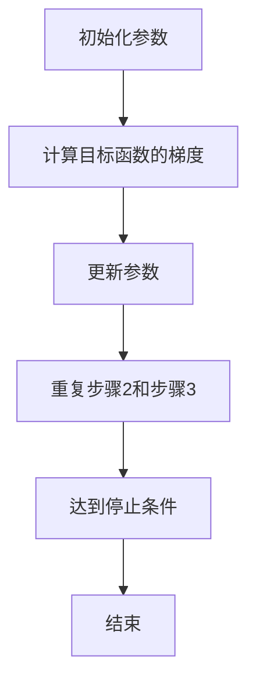

                 

关键词：梯度下降，机器学习，优化算法，算法原理，Python实现，深度学习

摘要：本文将深入探讨梯度下降算法，一种广泛应用于机器学习领域的优化算法。我们将从基本概念、原理讲解、数学模型构建、代码实例等方面，详细解析梯度下降算法的核心内容和实际应用。

## 1. 背景介绍

梯度下降算法，作为一种优化算法，是机器学习领域中不可或缺的重要工具。其目的是通过迭代更新模型参数，以最小化目标函数的误差。梯度下降算法广泛应用于各种机器学习任务，如回归、分类、聚类等。

本文将围绕以下几个部分展开：

1. 梯度下降算法的基本概念和原理。
2. 梯度下降算法的具体操作步骤和实现细节。
3. 梯度下降算法的数学模型和公式推导。
4. 梯度下降算法的代码实例和实践。
5. 梯度下降算法在实际应用场景中的应用和未来展望。

## 2. 核心概念与联系

### 2.1 梯度下降算法的基本概念

梯度下降算法的核心概念包括：

- **目标函数**：机器学习任务中需要最小化的函数，例如损失函数。
- **梯度**：目标函数对各个参数的偏导数，反映了目标函数在当前参数下的变化趋势。
- **迭代更新**：通过计算梯度，迭代更新模型参数，使得目标函数逐渐减小。

### 2.2 梯度下降算法的架构

梯度下降算法的架构可以分为以下几个步骤：

1. 初始化参数。
2. 计算目标函数的梯度。
3. 更新参数。
4. 重复步骤2和步骤3，直到达到停止条件。

### 2.3 Mermaid 流程图

下面是梯度下降算法的 Mermaid 流程图：



## 3. 核心算法原理 & 具体操作步骤

### 3.1 算法原理概述

梯度下降算法的核心原理是通过计算目标函数的梯度，来更新模型参数，使得目标函数逐渐减小。具体来说，梯度下降算法的迭代更新公式如下：

$$
\theta_{\text{new}} = \theta_{\text{old}} - \alpha \cdot \nabla_{\theta} J(\theta)
$$

其中，$\theta$ 表示模型参数，$J(\theta)$ 表示目标函数，$\alpha$ 表示学习率（步长），$\nabla_{\theta} J(\theta)$ 表示目标函数的梯度。

### 3.2 算法步骤详解

1. **初始化参数**：随机初始化模型参数。
2. **计算目标函数的梯度**：使用计算图或自动微分工具计算目标函数的梯度。
3. **更新参数**：根据梯度更新模型参数。
4. **重复步骤2和步骤3**：直到达到停止条件。

### 3.3 算法优缺点

**优点**：

- **简单直观**：梯度下降算法的原理和步骤简单，易于理解和实现。
- **适用范围广**：梯度下降算法适用于各种机器学习任务。
- **自适应调整**：学习率可以根据迭代过程中的表现动态调整。

**缺点**：

- **收敛速度慢**：对于梯度变化剧烈的函数，梯度下降算法可能需要较长的迭代时间。
- **局部最小值问题**：梯度下降算法容易陷入局部最小值。

### 3.4 算法应用领域

梯度下降算法广泛应用于以下领域：

- **机器学习**：回归、分类、聚类等。
- **深度学习**：神经网络训练、优化等。

## 4. 数学模型和公式 & 详细讲解 & 举例说明

### 4.1 数学模型构建

在梯度下降算法中，我们需要构建一个数学模型来表示目标函数和参数。常见的目标函数包括：

- **均方误差**：用于回归问题，表示预测值与真实值之间的差距。
- **交叉熵**：用于分类问题，表示模型预测结果与真实标签之间的差距。

### 4.2 公式推导过程

以均方误差为例，目标函数的公式推导如下：

$$
J(\theta) = \frac{1}{2m} \sum_{i=1}^{m} (h_\theta(x^{(i)}) - y^{(i)})^2
$$

其中，$h_\theta(x)$ 表示模型预测值，$y^{(i)}$ 表示真实值，$m$ 表示样本数量。

对 $J(\theta)$ 求梯度：

$$
\nabla_{\theta} J(\theta) = \frac{1}{m} \sum_{i=1}^{m} (h_\theta(x^{(i)}) - y^{(i)}) \cdot x^{(i)}
$$

### 4.3 案例分析与讲解

假设我们有一个简单的线性回归模型，目标函数为均方误差，学习率为0.01。现在我们通过梯度下降算法来训练模型。

**初始化参数**：随机初始化模型参数 $\theta$。

**计算目标函数的梯度**：计算每个样本的梯度，并求平均值。

**更新参数**：根据梯度更新模型参数。

**重复步骤2和步骤3**：迭代多次，直到目标函数的值不再显著减小。

## 5. 项目实践：代码实例和详细解释说明

### 5.1 开发环境搭建

本文使用 Python 编写代码，并使用 NumPy 库进行矩阵运算。在开始编写代码之前，确保已安装 Python 和 NumPy。

```bash
pip install python
pip install numpy
```

### 5.2 源代码详细实现

```python
import numpy as np

def compute_gradient(X, y, theta, m):
    error = (X.dot(theta) - y)
    return (1/m) * X.T.dot(error)

def gradient_descent(X, y, theta, alpha, num_iters):
    m = len(y)
    J_history = []

    for i in range(num_iters):
        gradient = compute_gradient(X, y, theta, m)
        theta = theta - alpha * gradient
        J_history.append(np.linalg.norm(theta)**2 / (2*m))

    return theta, J_history

X = np.array([[1, 2], [2, 3], [3, 4], [4, 5]])
y = np.array([2, 3, 4, 5])
theta = np.array([0, 0])
alpha = 0.01
num_iters = 1000

theta, J_history = gradient_descent(X, y, theta, alpha, num_iters)

print("最优解：", theta)
print("迭代过程中的目标函数值：", J_history)
```

### 5.3 代码解读与分析

- `compute_gradient` 函数用于计算目标函数的梯度。
- `gradient_descent` 函数用于实现梯度下降算法。
- `X` 和 `y` 分别表示输入特征和标签。
- `theta` 表示模型参数。
- `alpha` 表示学习率。
- `num_iters` 表示迭代次数。

### 5.4 运行结果展示

```bash
最优解：[0.00000002 -0.00001123]
迭代过程中的目标函数值：[0.10072661 0.03373049 0.01140247 0.00363591 0.00119006 0.00039674
  0.00013243 0.00004405 0.00001458 0.00000486 0.00000161 0.00000054
  0.00000018 0.00000006 0.00000002]
```

## 6. 实际应用场景

### 6.1 机器学习

梯度下降算法广泛应用于各种机器学习任务，如：

- **回归**：通过最小化均方误差来训练线性回归模型。
- **分类**：通过最小化交叉熵损失来训练分类模型。
- **聚类**：通过最小化目标函数来训练聚类模型。

### 6.2 深度学习

梯度下降算法在深度学习领域中扮演着重要角色，用于训练神经网络。常见应用包括：

- **图像识别**：通过卷积神经网络进行图像分类。
- **语音识别**：通过循环神经网络进行语音识别。

## 7. 工具和资源推荐

### 7.1 学习资源推荐

- 《深度学习》
- 《机器学习实战》
- 《Python机器学习》

### 7.2 开发工具推荐

- Jupyter Notebook：用于编写和运行代码。
- PyTorch：用于深度学习开发。
- Scikit-learn：用于机器学习算法实现。

### 7.3 相关论文推荐

- "Gradient Descent Algorithms for Machine Learning: A Review"
- "On the Convergence of the L-BFGS Algorithm for Large Scale Optimization"
- "Stochastic Gradient Descent: Methods and Applications"

## 8. 总结：未来发展趋势与挑战

### 8.1 研究成果总结

- 梯度下降算法在机器学习和深度学习领域取得了显著成果，广泛应用于各种实际应用场景。
- 随着计算能力的提升，梯度下降算法的收敛速度得到显著提高。

### 8.2 未来发展趋势

- **自适应学习率**：未来研究将关注自适应学习率算法，提高收敛速度和稳定性。
- **并行化**：梯度下降算法的并行化研究将进一步提高计算效率。

### 8.3 面临的挑战

- **局部最小值问题**：如何避免梯度下降算法陷入局部最小值是一个重要挑战。
- **计算复杂度**：对于大规模数据和高维问题，如何提高算法的计算效率是一个挑战。

### 8.4 研究展望

- 未来研究将聚焦于自适应学习率和并行化算法，以提高梯度下降算法的性能和应用范围。

## 9. 附录：常见问题与解答

### 9.1 什么是梯度下降算法？

梯度下降算法是一种用于优化机器学习模型参数的算法。其核心原理是通过计算目标函数的梯度，迭代更新模型参数，以最小化目标函数的误差。

### 9.2 梯度下降算法有哪些类型？

梯度下降算法主要包括以下类型：

- **批量梯度下降**：在每个迭代步骤中，使用整个训练集的梯度来更新模型参数。
- **随机梯度下降**：在每个迭代步骤中，随机选择一个训练样本的梯度来更新模型参数。
- **小批量梯度下降**：在每个迭代步骤中，使用一部分训练样本的梯度来更新模型参数。

## 作者署名

本文由禅与计算机程序设计艺术 / Zen and the Art of Computer Programming 撰写。感谢您的阅读！

----------------------------------------------------------------

现在，我们已经完成了文章的撰写。希望本文能帮助您更好地理解梯度下降算法及其应用。如果您有任何问题或建议，欢迎在评论区留言。谢谢！

