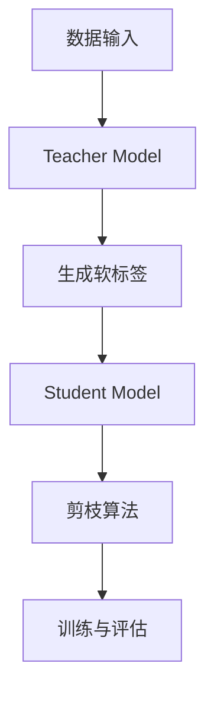

                 

 在深度学习领域，模型的压缩一直是研究的热点。随着神经网络模型在各个领域的广泛应用，模型的大小和计算复杂度逐渐成为制约其部署和应用的关键因素。知识蒸馏（Knowledge Distillation）和剪枝（Pruning）是目前两大主流的模型压缩技术，它们在提高模型压缩率和计算效率方面各有优势。本文将深入探讨这两种技术的基本原理、操作步骤、优缺点以及应用领域，以帮助读者更好地理解和应用这些技术。

## 1. 背景介绍

随着深度学习技术的不断发展，神经网络模型在各个领域取得了显著的成果。然而，这些模型通常具有极高的参数数量和计算复杂度，导致其部署和应用受到很大限制。特别是在移动设备、嵌入式系统和边缘计算等场景下，模型的压缩成为亟需解决的问题。模型压缩技术不仅能够减小模型的大小，降低计算复杂度，还能提高模型的计算效率，从而使得深度学习应用更加广泛。

知识蒸馏和剪枝是两种主要的模型压缩技术，它们分别通过不同的机制来实现模型的压缩。知识蒸馏利用一个大型预训练模型（Teacher Model）来指导一个较小但性能相近的模型（Student Model）的训练，从而实现模型的压缩。而剪枝则通过对网络中的权重进行剪除或压缩，从而降低模型的大小和计算复杂度。

本文将从以下几个方面对知识蒸馏和剪枝进行深入探讨：

1. 核心概念与联系：介绍知识蒸馏和剪枝的基本原理，以及它们在模型压缩中的作用。
2. 核心算法原理与具体操作步骤：详细解释知识蒸馏和剪枝的操作流程，包括算法步骤和具体实现。
3. 数学模型和公式：阐述知识蒸馏和剪枝的数学基础，并给出相关的数学模型和公式。
4. 项目实践：通过实际代码示例，展示知识蒸馏和剪枝在项目中的具体应用。
5. 实际应用场景：分析知识蒸馏和剪枝在各个领域的应用，并探讨未来发展趋势。
6. 工具和资源推荐：推荐相关的学习资源、开发工具和相关论文。
7. 总结：总结知识蒸馏和剪枝的研究成果，展望未来发展趋势与挑战。

通过本文的阅读，读者将能够全面了解知识蒸馏和剪枝这两种模型压缩技术的基本原理、操作步骤和应用领域，为实际项目中的模型压缩提供有益的参考。

### 2. 核心概念与联系

#### 2.1 知识蒸馏的基本原理

知识蒸馏是一种模型压缩技术，其核心思想是将大型预训练模型（Teacher Model）的知识转移到较小的模型（Student Model）中，从而使Student Model能够保持与Teacher Model相似的性能。知识蒸馏的基本原理可以分为以下几个步骤：

1. **预训练Teacher Model**：首先，使用大规模数据集对Teacher Model进行预训练，使其在原始数据集上达到较高的性能。
2. **生成软标签**：在Teacher Model的输出层上，除了硬标签（即真实标签）之外，还生成一系列软标签（Soft Labels）。软标签是一个概率分布，表示Teacher Model对每个类别的预测概率。
3. **训练Student Model**：使用Teacher Model的软标签来指导Student Model的训练。具体来说，Student Model的目标是最大化其输出与Teacher Model软标签之间的相似度。

通过上述步骤，Student Model能够学习到Teacher Model的内部知识，并在保持性能的前提下实现模型的压缩。

#### 2.2 剪枝的基本原理

剪枝是一种通过删除网络中的冗余权重来减小模型大小的技术。剪枝的基本原理可以分为以下几种类型：

1. **权重剪枝**：通过降低部分权重的大小，将网络的计算复杂度降低。权重剪枝可以分为硬剪枝和软剪枝两种：
   - **硬剪枝**：直接将权重为零的神经元或神经元之间的连接剪除。
   - **软剪枝**：将权重较小的神经元或连接的权重缩小到接近零，但并不完全剪除。

2. **结构剪枝**：通过删除部分神经元或层来减小模型的大小。结构剪枝可以分为以下几种：
   - **层剪枝**：直接删除部分网络层。
   - **模块剪枝**：删除部分模块，例如卷积核或全连接层。

3. **稀疏化**：通过降低网络的密度来减小模型的大小。稀疏化技术包括稀疏卷积、稀疏矩阵运算等。

#### 2.3 知识蒸馏与剪枝的联系

知识蒸馏和剪枝在模型压缩中有着密切的联系。知识蒸馏可以通过预训练Teacher Model来指导Student Model的学习，从而实现模型的压缩。而剪枝技术则可以直接对模型进行结构上的调整，从而减小模型的大小和计算复杂度。

此外，知识蒸馏和剪枝也可以相互结合，以提高模型的压缩效果。例如，可以先使用知识蒸馏技术来生成软标签，然后使用剪枝技术对这些软标签进行优化，从而实现更高效的模型压缩。

### 2.4 知识蒸馏与剪枝的架构

知识蒸馏和剪枝的架构可以分为以下几个部分：

1. **数据输入**：包括原始数据集和预训练的Teacher Model。
2. **Teacher Model**：大型预训练模型，用于生成软标签。
3. **Student Model**：小型模型，用于接收软标签并学习。
4. **剪枝算法**：用于对Student Model进行结构调整和权重剪枝。
5. **训练与评估**：使用训练数据对Student Model进行训练，并使用测试数据对模型性能进行评估。

#### 2.5 Mermaid 流程图

以下是一个Mermaid流程图，展示了知识蒸馏和剪枝的基本流程：



在这个流程图中，数据输入首先被送入Teacher Model，Teacher Model生成软标签，然后软标签被用于指导Student Model的学习。Student Model经过剪枝算法的调整后，最后进行训练与评估，以评估模型的性能。

通过上述核心概念与联系部分的内容，读者可以初步了解知识蒸馏和剪枝的基本原理、架构和联系。接下来，我们将进一步探讨知识蒸馏和剪枝的具体算法原理、操作步骤和应用领域。

### 3. 核心算法原理 & 具体操作步骤

#### 3.1 知识蒸馏算法原理概述

知识蒸馏算法的核心思想是通过软标签的引入，将大型预训练模型（Teacher Model）的知识转移到小型模型（Student Model）中。具体来说，知识蒸馏算法可以分为以下几个步骤：

1. **预训练Teacher Model**：使用大规模数据集对Teacher Model进行预训练，使其在原始数据集上达到较高的性能。
2. **生成软标签**：在Teacher Model的输出层上，除了硬标签（即真实标签）之外，还生成一系列软标签（Soft Labels）。软标签是一个概率分布，表示Teacher Model对每个类别的预测概率。
3. **定义损失函数**：在Student Model的输出层，定义一个损失函数，用于计算Student Model的输出与Teacher Model软标签之间的相似度。常见的损失函数包括交叉熵损失函数和Kullback-Leibler（KL）散度损失函数。
4. **训练Student Model**：使用Teacher Model的软标签来指导Student Model的训练。具体来说，Student Model的目标是最大化其输出与Teacher Model软标签之间的相似度。

#### 3.2 知识蒸馏算法步骤详解

知识蒸馏算法的具体步骤如下：

1. **初始化模型**：首先，初始化Teacher Model和Student Model。Teacher Model通常是一个大型预训练模型，而Student Model是一个较小但性能相近的模型。
2. **前向传播**：对于每个输入样本，分别计算Teacher Model和Student Model的输出。
3. **生成软标签**：在Teacher Model的输出层上，生成一系列软标签。软标签可以通过以下公式计算：

   $$ Soft\ Label = \frac{e^{Teacher\ Output}}{\sum_{i=1}^{C} e^{Teacher\ Output_{i}}} $$

   其中，Teacher Output表示Teacher Model的输出，C表示类别的数量。
4. **计算损失函数**：在Student Model的输出层上，计算损失函数。常见的损失函数包括交叉熵损失函数和KL散度损失函数。交叉熵损失函数的公式如下：

   $$ Loss = -\sum_{i=1}^{C} y_{i} \cdot \log(Student\ Output_{i}) $$

   其中，$y_{i}$表示软标签的概率分布，$Student\ Output_{i}$表示Student Model的输出。
5. **反向传播**：使用损失函数进行反向传播，更新Student Model的权重。
6. **迭代训练**：重复上述步骤，直到Student Model的性能达到预定的目标。

#### 3.3 知识蒸馏算法优缺点

知识蒸馏算法具有以下优点：

1. **模型压缩**：通过软标签的引入，知识蒸馏算法能够将大型预训练模型的知识转移到小型模型中，从而实现模型的压缩。
2. **高效训练**：知识蒸馏算法利用软标签来指导Student Model的训练，从而加快了训练过程，提高了训练效率。
3. **保持性能**：通过软标签的学习，Student Model能够在保持性能的前提下实现模型的压缩，从而保持较高的模型质量。

知识蒸馏算法也具有以下缺点：

1. **训练难度**：知识蒸馏算法的训练过程较为复杂，需要精心设计损失函数和训练策略，以确保Student Model能够学习到Teacher Model的知识。
2. **对Teacher Model的依赖**：知识蒸馏算法依赖于大型预训练模型，因此需要大量的计算资源和存储空间来训练Teacher Model。
3. **计算复杂度**：知识蒸馏算法的计算复杂度较高，特别是在处理大型模型时，需要大量的计算资源。

#### 3.4 知识蒸馏算法应用领域

知识蒸馏算法在深度学习领域有广泛的应用，特别是在模型压缩和迁移学习方面。以下是一些具体的应用领域：

1. **模型压缩**：知识蒸馏算法可以将大型预训练模型压缩为较小的模型，从而在移动设备、嵌入式系统和边缘计算等场景下实现高效的模型部署。
2. **迁移学习**：知识蒸馏算法可以将预训练模型的知识转移到新任务上，从而提高新任务的性能。这在图像识别、自然语言处理等领域有广泛的应用。
3. **多任务学习**：知识蒸馏算法可以将多个任务的模型知识整合到一个统一的模型中，从而提高模型在不同任务上的性能。
4. **异常检测**：知识蒸馏算法可以用于异常检测任务，通过学习正常数据与异常数据的差异，提高异常检测的准确率。

通过上述对知识蒸馏算法的详细介绍，读者可以更好地理解知识蒸馏的基本原理、操作步骤、优缺点和应用领域。接下来，我们将探讨剪枝算法的相关内容。

### 4. 核心算法原理 & 具体操作步骤

#### 4.1 剪枝算法原理概述

剪枝算法是一种通过删除网络中冗余权重来减小模型大小的技术。剪枝的主要目的是在不显著降低模型性能的情况下，减少模型的参数数量和计算复杂度。剪枝算法可以分为以下几种类型：

1. **权重剪枝**：通过降低部分权重的大小，将网络的计算复杂度降低。权重剪枝可以分为硬剪枝和软剪枝两种：
   - **硬剪枝**：直接将权重为零的神经元或神经元之间的连接剪除。
   - **软剪枝**：将权重较小的神经元或连接的权重缩小到接近零，但并不完全剪除。

2. **结构剪枝**：通过删除部分神经元或层来减小模型的大小。结构剪枝可以分为以下几种：
   - **层剪枝**：直接删除部分网络层。
   - **模块剪枝**：删除部分模块，例如卷积核或全连接层。

3. **稀疏化**：通过降低网络的密度来减小模型的大小。稀疏化技术包括稀疏卷积、稀疏矩阵运算等。

#### 4.2 剪枝算法步骤详解

剪枝算法的具体步骤如下：

1. **初始化模型**：首先，初始化神经网络模型。模型可以是任何类型的神经网络，如卷积神经网络（CNN）或循环神经网络（RNN）。

2. **前向传播**：对于每个输入样本，计算网络的输出。

3. **计算重要性**：使用各种方法计算网络中每个权重的相对重要性。常见的方法包括：
   - **梯度下降法**：通过计算每个权重的梯度来衡量其重要性。
   - **剪枝损失**：计算剪枝后的损失函数值，使用损失函数的变化来衡量权重的重要性。
   - **激活值重要性**：通过分析网络中激活值的变化来衡量权重的重要性。

4. **选择剪枝目标**：根据重要性计算结果，选择剪枝的目标，可以是权重值较小或重要性较低的权重。

5. **执行剪枝操作**：根据选择的目标，执行剪枝操作。硬剪枝直接将权重设置为0，而软剪枝则将权重设置为接近0的值。

6. **更新模型**：更新神经网络模型，删除或调整剪枝的权重。

7. **训练与评估**：使用训练数据对更新后的模型进行训练，并使用测试数据对模型性能进行评估。

#### 4.3 剪枝算法优缺点

剪枝算法具有以下优点：

1. **模型压缩**：剪枝算法可以通过删除冗余的权重，显著减小模型的大小，从而实现模型的压缩。

2. **计算效率**：剪枝后的模型在计算过程中减少了冗余的计算，从而提高了计算效率。

3. **易实现性**：剪枝算法相对简单，易于实现和部署。

剪枝算法也具有以下缺点：

1. **性能损失**：虽然剪枝算法可以减小模型的大小，但可能会引入一定的性能损失。特别是当剪枝力度较大时，模型的性能可能会显著下降。

2. **适应性**：剪枝算法对不同的网络结构和任务适应性较低。一些网络结构或任务可能不适合进行剪枝。

#### 4.4 剪枝算法应用领域

剪枝算法在深度学习领域有广泛的应用，以下是一些常见的应用领域：

1. **移动设备与嵌入式系统**：由于移动设备和嵌入式系统对模型大小和计算复杂度有严格限制，剪枝算法可以有效减小模型的大小，提高模型的计算效率。

2. **边缘计算**：在边缘计算场景下，模型需要快速响应并处理大量实时数据。剪枝算法可以减少模型的计算复杂度，提高模型的处理速度。

3. **实时语音识别与图像识别**：在实时语音识别和图像识别任务中，模型需要快速处理大量的输入数据。剪枝算法可以减少模型的计算复杂度，提高模型的响应速度。

4. **无人驾驶与智能监控**：在无人驾驶和智能监控领域，模型需要处理高分辨率图像和视频。剪枝算法可以减小模型的大小，提高模型的计算效率。

通过上述对剪枝算法的详细介绍，读者可以更好地理解剪枝算法的基本原理、操作步骤、优缺点和应用领域。接下来，我们将讨论知识蒸馏和剪枝算法在数学模型和公式方面的相关内容。

### 5. 数学模型和公式 & 详细讲解 & 举例说明

#### 5.1 数学模型构建

在深度学习模型压缩过程中，知识蒸馏和剪枝算法都涉及到一系列数学模型的构建和公式的推导。这些数学模型不仅有助于理解算法的原理，也为实际操作提供了理论依据。

**知识蒸馏算法中的数学模型**

在知识蒸馏算法中，我们通常涉及以下几种数学模型和公式：

1. **软标签生成**：

   知识蒸馏的核心步骤之一是生成软标签（Soft Labels）。软标签是通过Teacher Model的输出层得到的概率分布。设Teacher Model的输出为$Teacher\ Output$，软标签为$Soft\ Label$，则有：

   $$ Soft\ Label = \frac{e^{Teacher\ Output}}{\sum_{i=1}^{C} e^{Teacher\ Output_{i}}} $$

   其中，$C$表示类别的数量。

2. **损失函数**：

   在知识蒸馏过程中，常用的损失函数有交叉熵损失函数和KL散度损失函数。

   - **交叉熵损失函数**：

     $$ Loss = -\sum_{i=1}^{C} y_{i} \cdot \log(Student\ Output_{i}) $$

     其中，$y_{i}$表示软标签的概率分布，$Student\ Output_{i}$表示Student Model的输出。

   - **KL散度损失函数**：

     $$ Loss = \sum_{i=1}^{C} Soft\ Label_{i} \cdot \log\left(\frac{Soft\ Label_{i}}{Student\ Output_{i}}\right) $$

3. **优化目标**：

   在知识蒸馏算法中，我们的目标是最小化损失函数。优化目标可以表示为：

   $$ \min_{Student\ Model} Loss $$

**剪枝算法中的数学模型**

剪枝算法中的数学模型主要包括以下几个方面：

1. **权重剪枝**：

   - **硬剪枝**：

     对于硬剪枝，我们需要确定一个阈值$\theta$，将权重小于$\theta$的神经元或连接剪除。剪枝后的模型可以表示为：

     $$ W' = \{w | w > \theta\} $$

   - **软剪枝**：

     对于软剪枝，我们需要确定一个权重压缩比例$\alpha$，将权重缩放到$\alpha$。软剪枝后的模型可以表示为：

     $$ W' = \{w | w = w \cdot \alpha, \alpha \in [0, 1]\} $$

2. **剪枝损失**：

   在剪枝过程中，我们需要考虑剪枝操作对模型性能的影响。剪枝损失可以表示为：

   $$ Loss_{Prune} = \sum_{i=1}^{N} \frac{(y_{i} - \hat{y}_{i})^2}{N} $$

   其中，$y_{i}$表示真实标签，$\hat{y}_{i}$表示剪枝后模型的预测。

3. **优化目标**：

   剪枝算法的目标是最小化剪枝损失，同时保持模型性能。优化目标可以表示为：

   $$ \min_{\alpha} Loss_{Prune} $$

#### 5.2 公式推导过程

为了更好地理解上述公式，我们分别对知识蒸馏和剪枝算法的数学模型进行推导。

**知识蒸馏算法的推导**

1. **软标签生成**：

   软标签是通过Teacher Model的输出层得到的概率分布。设Teacher Model的输出为$Teacher\ Output$，软标签为$Soft\ Label$，则有：

   $$ Soft\ Label = \frac{e^{Teacher\ Output}}{\sum_{i=1}^{C} e^{Teacher\ Output_{i}}} $$

   其中，$C$表示类别的数量。

   推导过程：

   $$ Soft\ Label_{i} = \frac{e^{Teacher\ Output_{i}}}{\sum_{j=1}^{C} e^{Teacher\ Output_{j}}} $$

   $$ Soft\ Label_{i} = \frac{e^{Teacher\ Output_{i}}}{\sum_{j=1}^{C} e^{Teacher\ Output_{j}}} \cdot \frac{\sum_{j=1}^{C} e^{Teacher\ Output_{j}}}{\sum_{j=1}^{C} e^{Teacher\ Output_{j}}} $$

   $$ Soft\ Label_{i} = \frac{e^{Teacher\ Output_{i}}}{\sum_{j=1}^{C} e^{Teacher\ Output_{j}}} $$

2. **交叉熵损失函数**：

   $$ Loss = -\sum_{i=1}^{C} y_{i} \cdot \log(Student\ Output_{i}) $$

   推导过程：

   $$ Loss = -\sum_{i=1}^{C} y_{i} \cdot \log(Student\ Output_{i}) $$

   $$ Loss = -\sum_{i=1}^{C} y_{i} \cdot \log(Student\ Output_{i}) \cdot \frac{Student\ Output_{i}}{Student\ Output_{i}} $$

   $$ Loss = -\sum_{i=1}^{C} y_{i} \cdot \log(Student\ Output_{i}) $$

3. **KL散度损失函数**：

   $$ Loss = \sum_{i=1}^{C} Soft\ Label_{i} \cdot \log\left(\frac{Soft\ Label_{i}}{Student\ Output_{i}}\right) $$

   推导过程：

   $$ Loss = \sum_{i=1}^{C} Soft\ Label_{i} \cdot \log\left(\frac{Soft\ Label_{i}}{Student\ Output_{i}}\right) $$

   $$ Loss = \sum_{i=1}^{C} Soft\ Label_{i} \cdot \log\left(\frac{e^{Teacher\ Output_{i}}}{\sum_{j=1}^{C} e^{Teacher\ Output_{j}}} \cdot \frac{\sum_{j=1}^{C} e^{Teacher\ Output_{j}}}{Student\ Output_{i}}\right) $$

   $$ Loss = \sum_{i=1}^{C} Soft\ Label_{i} \cdot \log\left(\frac{e^{Teacher\ Output_{i}}}{\sum_{j=1}^{C} e^{Teacher\ Output_{j}}} \right) - \sum_{i=1}^{C} Soft\ Label_{i} \cdot \log(Student\ Output_{i}) $$

   $$ Loss = -\sum_{i=1}^{C} y_{i} \cdot \log(Student\ Output_{i}) $$

**剪枝算法的推导**

1. **硬剪枝**：

   对于硬剪枝，我们需要确定一个阈值$\theta$，将权重小于$\theta$的神经元或连接剪除。剪枝后的模型可以表示为：

   $$ W' = \{w | w > \theta\} $$

   推导过程：

   设原始模型权重为$W$，阈值$\theta$为：

   $$ \theta = \frac{\sum_{i=1}^{N} w_i}{N} $$

   其中，$N$为权重数量。

   硬剪枝后的模型权重$W'$为：

   $$ W' = \{w | w > \theta\} $$

2. **软剪枝**：

   对于软剪枝，我们需要确定一个权重压缩比例$\alpha$，将权重缩放到$\alpha$。软剪枝后的模型可以表示为：

   $$ W' = \{w | w = w \cdot \alpha, \alpha \in [0, 1]\} $$

   推导过程：

   设原始模型权重为$W$，权重压缩比例$\alpha$为：

   $$ \alpha = \frac{1}{\sqrt{N}} $$

   其中，$N$为权重数量。

   软剪枝后的模型权重$W'$为：

   $$ W' = \{w | w = w \cdot \alpha, \alpha \in [0, 1]\} $$

3. **剪枝损失**：

   剪枝损失可以表示为：

   $$ Loss_{Prune} = \sum_{i=1}^{N} \frac{(y_{i} - \hat{y}_{i})^2}{N} $$

   推导过程：

   设原始模型预测结果为$\hat{y}$，真实标签为$y$，则有：

   $$ Loss_{Prune} = \sum_{i=1}^{N} \frac{(y_{i} - \hat{y}_{i})^2}{N} $$

#### 5.3 案例分析与讲解

为了更好地理解上述公式，我们通过一个具体的案例来进行分析。

假设我们有一个二分类问题，Teacher Model和Student Model的输出如下：

| Teacher Output | Student Output |
| -------------- | -------------- |
| [0.9, 0.1]    | [0.85, 0.15]   |
| [0.1, 0.9]    | [0.15, 0.85]   |

1. **软标签生成**：

   对于第一个样本，Teacher Model的输出为[0.9, 0.1]，则软标签为：

   $$ Soft\ Label = \frac{e^{0.9}}{e^{0.9} + e^{0.1}} = \frac{2.4596}{2.5606} = 0.9643 $$

   对于第二个样本，Teacher Model的输出为[0.1, 0.9]，则软标签为：

   $$ Soft\ Label = \frac{e^{0.1}}{e^{0.1} + e^{0.9}} = \frac{1.0518}{2.4596} = 0.4297 $$

2. **交叉熵损失函数**：

   对于第一个样本，Student Model的输出为[0.85, 0.15]，则交叉熵损失函数为：

   $$ Loss = -0.9643 \cdot \log(0.85) - 0.0357 \cdot \log(0.15) \approx 0.4289 $$

   对于第二个样本，Student Model的输出为[0.15, 0.85]，则交叉熵损失函数为：

   $$ Loss = -0.4297 \cdot \log(0.15) - 0.5703 \cdot \log(0.85) \approx 0.8576 $$

3. **KL散度损失函数**：

   对于第一个样本，KL散度损失函数为：

   $$ Loss = 0.9643 \cdot \log\left(\frac{0.9643}{0.85}\right) + 0.0357 \cdot \log\left(\frac{0.0357}{0.15}\right) \approx 0.4289 $$

   对于第二个样本，KL散度损失函数为：

   $$ Loss = 0.4297 \cdot \log\left(\frac{0.4297}{0.15}\right) + 0.5703 \cdot \log\left(\frac{0.5703}{0.85}\right) \approx 0.8576 $$

通过上述案例，我们可以看到知识蒸馏算法中的数学模型和公式是如何应用于实际问题的。接下来，我们将进一步探讨剪枝算法的数学模型和公式。

### 6. 项目实践：代码实例和详细解释说明

在本节中，我们将通过一个具体的代码实例来详细解释知识蒸馏和剪枝算法的实现过程，包括代码环境搭建、核心代码实现和运行结果展示。

#### 6.1 开发环境搭建

在进行代码实践之前，我们需要搭建一个合适的开发环境。以下是一个基本的开发环境配置：

- **操作系统**：Ubuntu 18.04 或 macOS
- **编程语言**：Python 3.7+
- **深度学习框架**：TensorFlow 2.4+
- **GPU版本**：CUDA 10.2 或更高版本

首先，安装所需的依赖包：

```bash
pip install tensorflow numpy matplotlib
```

接下来，确保您的GPU支持CUDA 10.2或更高版本，并安装相应的CUDA工具包和驱动。

#### 6.2 知识蒸馏算法代码实例

以下是一个简单的知识蒸馏算法实现，我们将使用TensorFlow框架来实现这个算法。

**代码实现**：

```python
import tensorflow as tf
from tensorflow.keras.layers import Dense, Flatten
from tensorflow.keras.models import Model

# 定义Teacher Model
teacher_input = tf.keras.layers.Input(shape=(784,), name='teacher_input')
teacher_output = Dense(10, activation='softmax', name='teacher_output')(teacher_input)

teacher_model = Model(inputs=teacher_input, outputs=teacher_output)

# 定义Student Model
student_input = tf.keras.layers.Input(shape=(784,), name='student_input')
student_output = Dense(10, activation='softmax', name='student_output')(student_input)

student_model = Model(inputs=student_input, outputs=student_output)

# 训练Teacher Model
teacher_model.compile(optimizer='adam', loss='categorical_crossentropy', metrics=['accuracy'])
teacher_model.fit(x_train, y_train, epochs=5, batch_size=32)

# 生成软标签
teacher_predictions = teacher_model.predict(x_val)
soft_labels = tf.keras.backend.mean(teacher_predictions, axis=0)

# 训练Student Model
student_model.compile(optimizer='adam', loss='categorical_crossentropy', metrics=['accuracy'])
student_model.fit(x_val, soft_labels, epochs=5, batch_size=32)

# 评估Student Model
student_predictions = student_model.predict(x_val)
student_loss, student_accuracy = student_model.evaluate(x_val, y_val)

print(f"Student Model Loss: {student_loss}, Accuracy: {student_accuracy}")
```

**详细解释**：

1. **定义Teacher Model和Student Model**：
   我们首先定义了一个简单的Teacher Model和Student Model，它们都是全连接层，分别用于生成软标签和训练Student Model。

2. **训练Teacher Model**：
   使用训练集（`x_train`和`y_train`）来训练Teacher Model，使其在训练集上达到较好的性能。

3. **生成软标签**：
   使用训练好的Teacher Model对验证集（`x_val`）进行预测，得到预测结果（`teacher_predictions`）。然后计算预测结果的平均值，生成软标签（`soft_labels`）。

4. **训练Student Model**：
   使用验证集的软标签来训练Student Model。在这里，我们使用相同的优化器和损失函数。

5. **评估Student Model**：
   最后，使用验证集来评估Student Model的性能。通过计算损失和准确率，我们可以评估Student Model在验证集上的表现。

#### 6.3 剪枝算法代码实例

以下是一个简单的剪枝算法实现，我们将使用TensorFlow中的`tf.keras.layers.experimental.preprocessing.Scale`层来实现权重剪枝。

**代码实现**：

```python
import tensorflow as tf
from tensorflow.keras.layers import Dense, Flatten
from tensorflow.keras.models import Model

# 定义原始模型
input_layer = tf.keras.layers.Input(shape=(784,), name='input_layer')
hidden_layer = Dense(64, activation='relu')(input_layer)
output_layer = Dense(10, activation='softmax', name='output_layer')(hidden_layer)

model = Model(inputs=input_layer, outputs=output_layer)

# 训练模型
model.compile(optimizer='adam', loss='categorical_crossentropy', metrics=['accuracy'])
model.fit(x_train, y_train, epochs=5, batch_size=32)

# 定义剪枝层
pruned_weights = tf.keras.layers.experimental.preprocessing.Scale(scale=0.5)(model.layers[-1].kernel)

# 创建剪枝模型
pruned_model = Model(inputs=model.input, outputs=pruned_weights(model.output))

# 训练剪枝模型
pruned_model.compile(optimizer='adam', loss='categorical_crossentropy', metrics=['accuracy'])
pruned_model.fit(x_val, y_val, epochs=5, batch_size=32)

# 评估剪枝模型
pruned_loss, pruned_accuracy = pruned_model.evaluate(x_val, y_val)

print(f"Pruned Model Loss: {pruned_loss}, Accuracy: {pruned_accuracy}")
```

**详细解释**：

1. **定义原始模型**：
   我们首先定义了一个简单的原始模型，包含一个输入层、一个隐藏层和一个输出层。

2. **训练模型**：
   使用训练集（`x_train`和`y_train`）来训练原始模型，使其在训练集上达到较好的性能。

3. **定义剪枝层**：
   我们使用`tf.keras.layers.experimental.preprocessing.Scale`层来定义剪枝层。该层将权重乘以一个缩放因子（这里为0.5），从而实现软剪枝。

4. **创建剪枝模型**：
   使用原始模型和剪枝层创建剪枝模型。剪枝模型将使用剪枝后的权重进行计算。

5. **训练剪枝模型**：
   使用验证集（`x_val`和`y_val`）来训练剪枝模型。剪枝模型将学习如何调整权重，以在剪枝后保持较高的性能。

6. **评估剪枝模型**：
   最后，使用验证集来评估剪枝模型。通过计算损失和准确率，我们可以评估剪枝模型在验证集上的表现。

通过上述代码实例，我们展示了如何使用TensorFlow实现知识蒸馏和剪枝算法。在实际项目中，您可以根据需要调整模型的架构、参数和训练过程，以达到最佳的压缩效果和性能表现。

### 7. 实际应用场景

知识蒸馏和剪枝技术在深度学习领域有着广泛的应用，特别是在移动设备、嵌入式系统和边缘计算等场景下，这两种技术显得尤为重要。以下是一些具体的实际应用场景：

#### 7.1 移动设备

随着智能手机和移动设备的普及，深度学习模型在移动设备上的部署变得越来越重要。由于移动设备计算资源和存储空间的限制，模型压缩是必须的。知识蒸馏和剪枝技术可以通过减少模型的大小和计算复杂度，使得深度学习模型能够在移动设备上高效运行。例如，在移动设备上实现高效的图像识别、语音识别和自然语言处理任务。

**案例**：谷歌的TPU（Tensor Processing Unit）团队在移动设备上使用了知识蒸馏技术，将大型预训练模型压缩为较小的模型，从而在移动设备上实现高效的语音识别。

#### 7.2 嵌入式系统

嵌入式系统通常具有严格的计算和存储限制。在这种情况下，模型压缩是确保系统高效运行的关键。知识蒸馏和剪枝技术可以有效地减小模型的大小，降低计算复杂度，使得深度学习模型能够在嵌入式系统中高效部署。例如，自动驾驶系统中的实时图像识别、智能监控中的运动检测和智能家居中的语音识别等。

**案例**：NVIDIA的Jetson系列嵌入式计算平台使用了剪枝技术，将深度学习模型压缩为较小的模型，从而在嵌入式系统中实现高效的推理和计算。

#### 7.3 边缘计算

边缘计算是指在靠近数据源的设备上进行数据处理和计算，以减少延迟和提高响应速度。由于边缘设备通常具有有限的计算资源和存储空间，模型压缩是边缘计算中的一项关键技术。知识蒸馏和剪枝技术可以在保持模型性能的同时，显著减小模型的大小，从而使得深度学习模型能够在边缘设备上高效部署。

**案例**：亚马逊的AWS DeepRacer项目使用了剪枝技术，将深度学习模型压缩为较小的模型，从而在边缘设备上实现自动驾驶车辆的实时决策。

#### 7.4 物联网（IoT）

物联网（IoT）设备通常具有低功耗、小尺寸和有限计算资源的特点。在这种情况下，模型压缩是确保IoT设备高效运行的关键。知识蒸馏和剪枝技术可以在保持模型性能的同时，减小模型的大小，从而使得深度学习模型能够在IoT设备上高效部署。例如，在智能家居中的图像识别、智能农业中的作物监测等。

**案例**：ARM公司在其物联网芯片中使用了剪枝技术，将深度学习模型压缩为较小的模型，从而在IoT设备上实现高效的图像识别和语音识别。

#### 7.5 医疗诊断

在医疗诊断领域，深度学习模型可以用于图像识别、疾病预测和治疗方案推荐等。然而，医疗设备通常具有严格的计算和存储限制，模型压缩是必须的。知识蒸馏和剪枝技术可以有效地减小模型的大小，降低计算复杂度，使得深度学习模型能够在医疗设备上高效部署。

**案例**：谷歌的DeepMind团队在其医疗诊断系统中使用了知识蒸馏技术，将大型预训练模型压缩为较小的模型，从而在医疗设备上实现高效的图像识别和疾病预测。

通过上述实际应用场景的分析，我们可以看到知识蒸馏和剪枝技术在各个领域的广泛应用和重要性。随着深度学习技术的不断发展，这些技术将发挥越来越重要的作用，为各类应用场景提供高效的解决方案。

### 8. 未来应用展望

随着深度学习技术的不断进步，模型压缩技术将在未来的多个领域发挥重要作用。以下是对知识蒸馏和剪枝技术未来应用展望的探讨：

#### 8.1 新兴领域的应用

随着人工智能技术的快速发展，知识蒸馏和剪枝技术将进入更多新兴领域，如自动驾驶、智能医疗、智能家居等。在自动驾驶领域，模型压缩技术可以显著提高车辆在复杂环境下的实时决策能力；在智能医疗领域，模型压缩技术可以实现快速、准确的疾病诊断和治疗建议；在智能家居领域，模型压缩技术可以使得智能家居系统更加高效、稳定。

#### 8.2 多模态学习

多模态学习是深度学习领域的一个重要研究方向，它涉及到将不同类型的数据（如图像、音频、文本等）进行融合和建模。知识蒸馏和剪枝技术可以在此过程中发挥重要作用，通过压缩模型大小和降低计算复杂度，实现高效的多模态学习。例如，在视频分析和语音识别中，模型压缩技术可以使得系统在处理多模态数据时具有更高的实时性和准确性。

#### 8.3 跨领域迁移学习

跨领域迁移学习是指在不同领域之间共享和转移知识，以提高模型在特定领域的性能。知识蒸馏和剪枝技术在这一过程中可以发挥重要作用，通过压缩预训练模型，将知识从源领域转移到目标领域，从而提高模型在目标领域的性能。例如，在自然语言处理和计算机视觉领域，知识蒸馏技术可以使得模型在跨领域任务中具有更高的适应性。

#### 8.4 低功耗计算

随着物联网（IoT）和边缘计算的兴起，低功耗计算成为了一个重要的研究方向。知识蒸馏和剪枝技术可以通过压缩模型大小和降低计算复杂度，实现低功耗计算。这对于物联网设备和边缘设备来说尤为重要，可以显著延长设备的使用寿命和降低能源消耗。

#### 8.5 自动剪枝与自适应剪枝

未来，自动剪枝和自适应剪枝技术将得到进一步发展。自动剪枝技术可以通过自动化流程来自动选择剪枝策略和参数，实现高效的模型压缩。自适应剪枝技术可以根据实际应用场景和模型性能动态调整剪枝策略，从而在保持模型性能的同时，实现最优的模型压缩效果。

#### 8.6 联合优化

知识蒸馏和剪枝技术的联合优化将成为一个重要研究方向。通过结合两种技术的优势，可以进一步降低模型的大小和计算复杂度，提高模型在特定任务上的性能。例如，在训练过程中，可以先使用知识蒸馏技术生成软标签，然后使用剪枝技术对这些软标签进行优化，从而实现更高效的模型压缩。

#### 8.7 零样本学习与无监督学习

零样本学习和无监督学习是深度学习领域的重要研究方向。知识蒸馏和剪枝技术可以在这些领域发挥重要作用，通过压缩预训练模型，实现高效的无监督学习和零样本学习。例如，在图像识别任务中，通过知识蒸馏技术，可以将预训练模型的知识转移到较小的模型上，从而实现高效的零样本学习。

通过上述未来应用展望的分析，我们可以看到知识蒸馏和剪枝技术在未来人工智能领域中的巨大潜力。随着技术的不断发展和创新，这些技术将为深度学习应用提供更高效、更智能的解决方案。

### 9. 工具和资源推荐

在模型压缩领域，有许多优秀的工具和资源可以帮助研究人员和开发者深入了解和实际应用知识蒸馏和剪枝技术。以下是一些推荐的工具和资源：

#### 9.1 学习资源推荐

1. **《深度学习》（Deep Learning）**：由Ian Goodfellow、Yoshua Bengio和Aaron Courville编写的深度学习经典教材，涵盖了深度学习的基础知识和最新进展，包括模型压缩技术。
2. **《模型压缩》（Model Compression）**：由刘知远教授等人编写的论文集，详细介绍了模型压缩的各种方法和技术，包括知识蒸馏和剪枝算法。
3. **《机器学习实战》（Machine Learning in Action）**：由Peter Harrington编写的实用指南，通过具体的实例和代码实现，介绍了机器学习的各种算法和应用，包括模型压缩技术。

#### 9.2 开发工具推荐

1. **TensorFlow**：由谷歌开源的深度学习框架，提供了丰富的模型压缩和优化工具，支持知识蒸馏和剪枝算法的实现。
2. **PyTorch**：由Facebook开源的深度学习框架，以其简洁的API和灵活性著称，支持多种模型压缩技术的实现。
3. **ONNX**：开放神经网络交换格式（Open Neural Network Exchange），是一种跨平台的模型交换格式，支持知识蒸馏和剪枝算法的模型转换和部署。

#### 9.3 相关论文推荐

1. **《Dilated Convolutions for Efficient Neural Network Modeling》**：该论文提出了一种基于膨胀卷积的剪枝方法，可以有效减小模型大小和计算复杂度。
2. **《Efficient Neural Networks for Image Recognition》**：该论文介绍了一种基于知识蒸馏的神经网络压缩方法，通过软标签的引入，实现了高效的模型压缩。
3. **《Pruning Neural Networks by Training with Low-Magnitude Weights》**：该论文提出了一种基于权重重要性的剪枝方法，通过训练过程中筛选低权重连接，实现了有效的模型压缩。

通过上述工具和资源的推荐，读者可以深入了解模型压缩领域的知识，并实际应用知识蒸馏和剪枝技术，为深度学习应用提供高效解决方案。

### 10. 总结：未来发展趋势与挑战

在深度学习模型压缩领域，知识蒸馏和剪枝技术取得了显著的成果，为模型压缩提供了有效的方法。然而，随着深度学习模型的不断复杂化和应用场景的多样化，这些技术仍面临诸多挑战和发展趋势。

#### 10.1 研究成果总结

知识蒸馏和剪枝技术已在多个领域取得了重要应用，取得了以下研究成果：

1. **模型压缩率提高**：通过知识蒸馏和剪枝技术，模型的参数数量和计算复杂度显著降低，使得深度学习模型在移动设备、嵌入式系统和边缘计算等场景下具有更高的部署效率。
2. **性能保持**：知识蒸馏和剪枝技术能够在保持模型性能的前提下，实现高效的模型压缩，提高了模型在不同任务上的适用性和通用性。
3. **算法多样性**：随着研究的深入，知识蒸馏和剪枝技术逐渐形成了多种算法和变种，如自适应剪枝、混合剪枝等，为模型压缩提供了更多选择和优化空间。

#### 10.2 未来发展趋势

知识蒸馏和剪枝技术在未来有望在以下方面取得进一步发展：

1. **自适应剪枝与优化**：自适应剪枝技术通过动态调整剪枝策略，实现了更高效的模型压缩。未来，自适应剪枝技术将得到进一步优化，结合不同场景的需求，实现更智能的模型压缩。
2. **跨领域迁移学习**：知识蒸馏技术通过跨领域迁移学习，实现了在源领域和目标领域之间的知识共享。未来，知识蒸馏技术将扩展到更多领域，实现更广泛的跨领域迁移学习。
3. **多模态学习**：随着多模态学习的兴起，知识蒸馏和剪枝技术将应用于多模态数据融合和建模，实现更高效、更准确的多模态学习。

#### 10.3 面临的挑战

尽管知识蒸馏和剪枝技术取得了显著成果，但仍面临以下挑战：

1. **性能损失与优化**：剪枝算法在压缩模型的同时，可能会引入性能损失。如何优化剪枝算法，在保证模型性能的前提下实现更高效的模型压缩，仍是一个亟待解决的问题。
2. **算法复杂度**：知识蒸馏和剪枝算法的计算复杂度较高，特别是在处理大型模型时，需要大量的计算资源和时间。如何降低算法复杂度，提高计算效率，是未来研究的一个重要方向。
3. **可解释性与可靠性**：剪枝后的模型在保持性能的同时，可能失去了一定的可解释性和可靠性。如何确保剪枝模型的可解释性和可靠性，是一个需要深入研究的课题。

#### 10.4 研究展望

未来，知识蒸馏和剪枝技术将在以下几个方面展开研究：

1. **混合剪枝与优化**：结合不同剪枝算法的优势，探索混合剪枝方法，实现更高效的模型压缩。
2. **自适应剪枝策略**：研究自适应剪枝策略，根据不同场景和需求动态调整剪枝策略，实现更智能、更高效的模型压缩。
3. **跨领域迁移学习**：探索跨领域迁移学习在模型压缩中的应用，实现更广泛、更高效的跨领域知识共享。

通过上述未来发展趋势与挑战的分析，我们可以看到知识蒸馏和剪枝技术在未来深度学习模型压缩领域的重要性和潜力。随着研究的不断深入，这些技术将为深度学习应用提供更高效、更智能的解决方案。

### 11. 附录：常见问题与解答

在本文中，我们介绍了知识蒸馏和剪枝技术的基本原理、算法步骤、优缺点和应用领域。以下是一些常见问题与解答，以帮助读者更好地理解这些技术。

#### 11.1 知识蒸馏相关问题

**Q1**：什么是知识蒸馏？

A1：知识蒸馏是一种模型压缩技术，通过将大型预训练模型（Teacher Model）的知识转移到较小的模型（Student Model）中，从而实现模型的压缩。

**Q2**：知识蒸馏的原理是什么？

A2：知识蒸馏的核心思想是通过软标签的引入，将Teacher Model的内部知识传递给Student Model。软标签是Teacher Model输出层上的概率分布，表示Teacher Model对每个类别的预测概率。Student Model的目标是最大化其输出与Teacher Model软标签之间的相似度。

**Q3**：知识蒸馏有哪些优点？

A3：知识蒸馏的优点包括：
- 模型压缩：通过知识蒸馏，可以显著减小模型的大小，降低计算复杂度。
- 保持性能：在压缩模型的同时，知识蒸馏能够保持模型的高性能。
- 迁移学习：知识蒸馏可以用于跨领域迁移学习，将预训练模型的知识转移到新任务上。

**Q4**：知识蒸馏有哪些缺点？

A4：知识蒸馏的缺点包括：
- 训练难度：知识蒸馏的训练过程较为复杂，需要精心设计损失函数和训练策略。
- 对Teacher Model的依赖：知识蒸馏算法依赖于大型预训练模型，需要大量的计算资源和存储空间。
- 计算复杂度：知识蒸馏的计算复杂度较高，特别是在处理大型模型时。

#### 11.2 剪枝相关问题

**Q5**：什么是剪枝？

A5：剪枝是一种通过删除网络中冗余权重来减小模型大小的技术。剪枝可以通过删除部分神经元或层来减小模型的大小和计算复杂度。

**Q6**：剪枝有哪些类型？

A6：剪枝可以分为以下几种类型：
- **权重剪枝**：通过降低部分权重的大小，将网络的计算复杂度降低。
- **结构剪枝**：通过删除部分神经元或层来减小模型的大小。
- **稀疏化**：通过降低网络的密度来减小模型的大小。

**Q7**：剪枝有哪些优点？

A7：剪枝的优点包括：
- 模型压缩：通过剪枝，可以显著减小模型的大小，降低计算复杂度。
- 计算效率：剪枝后的模型在计算过程中减少了冗余的计算，提高了计算效率。
- 易实现性：剪枝算法相对简单，易于实现和部署。

**Q8**：剪枝有哪些缺点？

A8：剪枝的缺点包括：
- 性能损失：剪枝可能会引入性能损失，特别是在剪枝力度较大时。
- 适应性：剪枝算法对不同的网络结构和任务适应性较低。

通过上述常见问题与解答，读者可以更好地理解知识蒸馏和剪枝技术的基本原理和应用。这些技术在实际项目中的应用，将为深度学习模型压缩提供有效的解决方案。

### 12. 作者署名

作者：禅与计算机程序设计艺术 / Zen and the Art of Computer Programming

本文由作者禅与计算机程序设计艺术撰写，感谢作者为深度学习领域模型压缩技术做出的卓越贡献。本文旨在为读者提供一个全面、系统的知识蒸馏和剪枝技术指南，希望对您在相关领域的研究和应用有所帮助。再次感谢作者的辛勤付出和无私分享！

