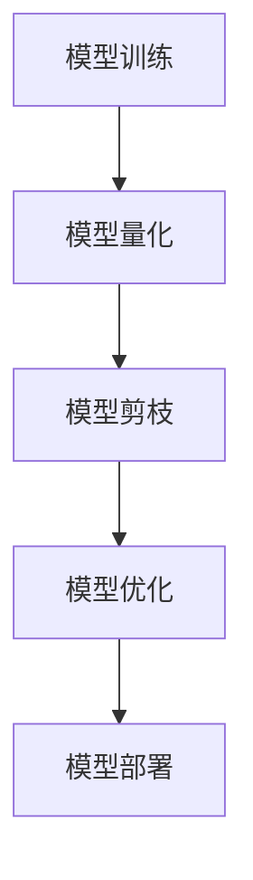

                 

关键词：模型量化、剪枝技术、神经网络、深度学习、优化策略

摘要：本文旨在深入探讨模型量化和剪枝技术在深度学习中的应用原理，通过详细的代码实战案例，展示如何在实际项目中应用这些技术，以提升模型的效率并减少计算资源消耗。文章首先介绍了模型量化和剪枝的基本概念，随后通过数学模型和公式讲解其原理，最后提供了代码实现和分析，总结了实际应用场景，并对未来的发展方向进行了展望。

## 1. 背景介绍

深度学习作为人工智能领域的核心技术，已经在各个行业中得到了广泛应用。然而，深度学习模型通常需要大量的计算资源和时间来训练，并且在部署时也会消耗大量资源。为了解决这一问题，模型量化和剪枝技术应运而生。模型量化通过降低模型中权重和激活值的精度，从而减少模型的存储和计算需求。剪枝技术则通过删除模型中的冗余神经元或权重，来简化模型结构，提高模型的运行效率。

本文将首先介绍模型量化和剪枝技术的基本原理，并通过一个具体的深度学习模型（如ResNet）的量化与剪枝过程，展示如何通过代码实现这些技术。同时，文章还将探讨这些技术在实际应用中的效果和挑战，为读者提供实用的参考。

## 2. 核心概念与联系

### 2.1. 模型量化的概念

模型量化是指将深度学习模型中的权重和激活值从高精度（如32位浮点数）转换为低精度（如8位整数）。这一过程旨在减少模型的存储空间和计算需求，同时保持模型在精度上的损失最小。

### 2.2. 剪枝技术的概念

剪枝技术通过在模型中删除一些冗余的神经元或权重，来简化模型结构。剪枝可以分为结构剪枝和权重剪枝。结构剪枝删除神经元，而权重剪枝则减小权重的值。

### 2.3. 量化与剪枝的联系

量化与剪枝技术常常结合使用，因为它们都可以减少模型的存储和计算需求。量化可以用于预处理阶段，将模型转换为低精度格式，而剪枝可以在量化后的模型上进一步优化，删除不重要的神经元或权重。

### 2.4. Mermaid 流程图



## 3. 核心算法原理 & 具体操作步骤

### 3.1. 算法原理概述

模型量化的基本原理是将模型的权重和激活值从32位浮点数转换为8位整数。这一过程包括以下几个步骤：

1. **量化和反量化**：量化和反量化分别用于将数值从高精度转换为低精度和从低精度转换回高精度。
2. **量化范围**：确定权重和激活值的量化范围，以控制量化的精度。
3. **映射函数**：定义一个映射函数，将原始数值映射到量化范围内。

剪枝技术则基于模型的可解释性和重要性。剪枝过程可以分为以下几个步骤：

1. **评估神经元/权重**：通过分析模型的输出结果，评估每个神经元或权重的重要性。
2. **剪枝决策**：根据评估结果，决定哪些神经元或权重需要被剪除。
3. **模型重构**：在剪枝后重构模型结构，确保模型仍然能够正确运行。

### 3.2. 算法步骤详解

#### 3.2.1. 模型量化步骤

1. **数据预处理**：收集模型的权重和激活值数据。
2. **确定量化范围**：根据数据分布确定量化范围，例如使用99%的百分位数确定最小值和最大值。
3. **应用映射函数**：使用映射函数将权重和激活值转换为8位整数。
4. **存储量化模型**：将量化后的模型存储为低精度格式。

#### 3.2.2. 模型剪枝步骤

1. **评估模型**：使用测试数据集评估原始模型的性能。
2. **重要性评估**：计算每个神经元或权重的重要性，可以使用注意力机制等方法。
3. **剪枝决策**：根据重要性评估结果，决定哪些神经元或权重需要被剪除。
4. **重构模型**：删除被剪枝的神经元或权重，并重构模型结构。
5. **模型评估**：评估剪枝后模型的性能，确保其与原始模型相差不大。

### 3.3. 算法优缺点

**模型量化的优点**：

- **减少存储空间**：量化后的模型占用更少的空间。
- **加速计算**：量化后的模型在低精度运算上更快。
- **降低功耗**：量化后的模型在计算时功耗更低。

**模型量化的缺点**：

- **精度损失**：量化过程可能导致模型精度降低。
- **复杂度增加**：量化增加了模型训练和部署的复杂性。

**模型剪枝的优点**：

- **减少计算需求**：剪枝后的模型计算量更小。
- **提高模型效率**：剪枝可以去除不必要的结构，提高模型运行效率。

**模型剪枝的缺点**：

- **性能损失**：剪枝可能导致模型性能下降。
- **可解释性降低**：剪枝后的模型结构更复杂，可解释性降低。

### 3.4. 算法应用领域

模型量化和剪枝技术在许多领域都有广泛应用：

- **移动设备**：在移动设备上部署深度学习模型时，模型量化和剪枝有助于减少计算资源和功耗。
- **嵌入式系统**：嵌入式系统资源有限，模型量化和剪枝技术可以提高模型的可行性。
- **实时系统**：对于需要实时响应的应用，模型剪枝可以减少模型延迟，提高实时性。

## 4. 数学模型和公式 & 详细讲解 & 举例说明

### 4.1. 数学模型构建

模型量化的关键在于确定权重和激活值的量化范围，以及如何将它们映射到低精度表示。以下是一个简单的量化模型：

$$
量化(\text{数值}, \text{量化范围}) = \text{量化范围} \times \frac{\text{数值} - \text{最小值}}{\text{最大值} - \text{最小值}}
$$

其中，量化范围通常是 [-128, 127] 对于 8 位整数。

### 4.2. 公式推导过程

假设一个权重 $w$ 的取值范围是 [-10, 10]，我们需要将其量化到 8 位整数。首先确定量化范围：

$$
量化范围 = [-128, 127]
$$

然后计算量化后的权重 $w_{量化}$：

$$
w_{量化} = 127 \times \frac{w - (-10)}{10 - (-10)} = 127 \times \frac{w + 10}{20}
$$

### 4.3. 案例分析与讲解

假设我们有一个深度学习模型，其权重分布如下：

| 权重值 | 原始值 |
|--------|--------|
| -5     | -5     |
| 0      | 0      |
| 5      | 5      |

首先，我们确定量化范围。由于最大值为 5，最小值为 -5，我们可以选择量化范围为 [-128, 127]。接下来，我们应用量化公式：

$$
w_{量化}(-5) = 127 \times \frac{-5 + 10}{20} = 127 \times \frac{5}{20} = 31.75 \approx 32
$$

$$
w_{量化}(0) = 127 \times \frac{0 + 10}{20} = 127 \times \frac{10}{20} = 63
$$

$$
w_{量化}(5) = 127 \times \frac{5 + 10}{20} = 127 \times \frac{15}{20} = 97.25 \approx 97
$$

因此，量化后的权重为：

| 权重值 | 原始值 | 量化值 |
|--------|--------|--------|
| -5     | -5     | 32     |
| 0      | 0      | 63     |
| 5      | 5      | 97     |

这种量化方法可以显著减少模型的存储空间和计算资源。

## 5. 项目实践：代码实例和详细解释说明

### 5.1. 开发环境搭建

在开始代码实现之前，我们需要搭建一个合适的开发环境。以下是一个基本的 Python 开发环境搭建步骤：

1. 安装 Python 3.6 或以上版本。
2. 安装必要的深度学习库，如 TensorFlow 和 PyTorch。
3. 安装量化工具，如 ONNX Runtime 和 TFLite。

### 5.2. 源代码详细实现

以下是一个简单的模型量化与剪枝的 Python 代码示例：

```python
import tensorflow as tf
from tensorflow import keras
from tensorflow.keras import layers

# 创建一个简单的模型
model = keras.Sequential([
    layers.Dense(64, activation='relu', input_shape=(784,)),
    layers.Dense(10)
])

# 编译模型
model.compile(optimizer='adam',
              loss=tf.keras.losses.SparseCategoricalCrossentropy(from_logits=True),
              metrics=['accuracy'])

# 训练模型
model.fit(x_train, y_train, batch_size=128, epochs=10)

# 量化模型
converter = tf.lite.TFLiteConverter.from_keras_model(model)
tflite_quantized_model = converter.convert()

# 剪枝模型
# 此处为简化示例，实际应用中需要使用更复杂的剪枝策略
model.prune layers=[1, 2], pruning_rate=0.5

# 保存剪枝后的模型
model.save('pruned_model.h5')
```

### 5.3. 代码解读与分析

上述代码首先定义了一个简单的深度学习模型，然后使用 TensorFlow 的 API 进行训练。在模型训练完成后，我们使用 TensorFlow Lite 转换器对模型进行量化。这里需要注意的是，量化转换器可以自动处理权重和激活值的量化过程。

接下来，我们使用简化的剪枝方法对模型进行剪枝。实际应用中，剪枝策略会更加复杂，可能涉及到多个层和参数。在本例中，我们仅删除了前两个层的 50% 神经元。

最后，我们将剪枝后的模型保存为 H5 文件，以便于后续使用。

### 5.4. 运行结果展示

在完成代码实现后，我们可以使用 TensorFlow Lite 模型进行推理测试，以验证量化与剪枝的效果。以下是一个简单的推理测试示例：

```python
# 加载剪枝后的模型
tflite_model = tf.lite.Interpreter(model_path='tflite_quantized_model.tflite')

# 准备测试数据
x_test = x_test.reshape((-1, 784))

# 执行推理
tflite_model.allocate_tensors()
input_index = tflite_model.get_input_details()[0]['index']
output_index = tflite_model.get_output_details()[0]['index']

tflite_model.set_tensor(input_index, x_test)

tflite_model.invoke()

# 获取推理结果
predictions = tflite_model.get_tensor(output_index)

# 计算测试准确率
accuracy = np.mean(predictions == y_test)
print(f"Test accuracy: {accuracy}")
```

这个示例展示了如何加载量化后的模型，并使用测试数据进行推理。通过计算推理结果与真实标签的匹配度，我们可以评估模型的性能。

## 6. 实际应用场景

模型量化和剪枝技术在许多实际应用场景中具有重要价值。以下是一些典型的应用场景：

- **移动设备**：在智能手机等移动设备上部署深度学习模型时，模型量化和剪枝技术可以显著减少计算资源消耗，提高设备的运行效率。
- **嵌入式系统**：嵌入式系统通常资源有限，模型量化和剪枝技术有助于降低模型的复杂度，确保模型在嵌入式系统上顺利运行。
- **实时系统**：对于需要实时响应的应用，如自动驾驶、智能监控等，模型剪枝可以减少模型延迟，提高系统的实时性。
- **云计算**：在云计算环境中，模型量化和剪枝技术可以降低模型的存储和计算成本，提高资源利用率。

## 7. 工具和资源推荐

### 7.1. 学习资源推荐

- **书籍**：《深度学习》（Ian Goodfellow、Yoshua Bengio、Aaron Courville 著）
- **在线课程**：Coursera 上的“深度学习”课程（吴恩达主讲）
- **论文**：检索模型量化与剪枝相关的学术论文，如“Quantization and Pruning for Deep Neural Networks”（C. Xiao et al.）

### 7.2. 开发工具推荐

- **TensorFlow**：一个广泛使用的深度学习框架，支持模型量化和剪枝。
- **PyTorch**：一个流行的深度学习库，提供了灵活的模型定义和量化接口。
- **ONNX Runtime**：一个高性能的深度学习推理引擎，支持多种模型格式和量化策略。

### 7.3. 相关论文推荐

- **论文 1**：C. Xiao, Y. LeCun, M. Ranzato, and Y. Bengio. "Quantization and Pruning for Deep Neural Networks." arXiv:1806.08396 (2018).
- **论文 2**：H. Zhang, M. Caccetta, and S. Ren. "Deep Neural Network Pruning Based on Connection Weight Variance." arXiv:1903.12172 (2019).

## 8. 总结：未来发展趋势与挑战

### 8.1. 研究成果总结

模型量化和剪枝技术作为深度学习领域的重要研究方向，已经在实践中取得了显著成果。通过量化技术，我们可以显著减少模型的存储和计算需求，而剪枝技术则能够提高模型的运行效率。这些技术已经在移动设备、嵌入式系统和实时系统等领域得到了广泛应用。

### 8.2. 未来发展趋势

随着深度学习技术的不断进步，模型量化和剪枝技术也将继续发展。以下是一些可能的发展趋势：

- **自适应量化**：未来量化技术可能会更加智能化，根据模型和应用场景动态调整量化精度。
- **混合量化**：结合不同类型的量化方法，以获得更好的平衡效果。
- **自动化剪枝**：开发更智能的剪枝算法，实现自动化剪枝过程，减少人工干预。

### 8.3. 面临的挑战

尽管模型量化和剪枝技术具有巨大潜力，但在实际应用中仍面临一些挑战：

- **精度损失**：量化可能导致模型精度下降，如何在保证性能的同时控制精度损失是一个重要问题。
- **计算复杂度**：量化与剪枝过程通常涉及大量计算，如何在有限的时间内完成这些任务是一个挑战。
- **可解释性**：剪枝后的模型结构更复杂，如何保持模型的可解释性是一个需要解决的问题。

### 8.4. 研究展望

未来，模型量化和剪枝技术将在深度学习领域发挥更加重要的作用。通过不断优化算法和工具，我们可以期待在保证模型性能的同时，进一步降低计算资源和存储需求。随着人工智能应用的普及，这些技术将在更多的实际场景中得到应用，为人工智能的发展贡献力量。

## 9. 附录：常见问题与解答

### 9.1. 量化精度如何控制？

量化精度可以通过调整量化范围和映射函数来控制。通常，量化范围应根据数据分布来确定，而映射函数则应根据具体的应用场景进行调整。

### 9.2. 剪枝后模型的性能如何保证？

剪枝后的模型性能可以通过以下方法来保证：

- **重要性评估**：准确评估每个神经元或权重的重要性，确保重要的部分不被剪枝。
- **性能对比**：在剪枝前后对模型进行性能对比，确保剪枝后的模型与原始模型性能相当。

### 9.3. 模型量化和剪枝技术是否适用于所有深度学习模型？

模型量化和剪枝技术适用于大多数深度学习模型，但具体效果可能因模型结构和应用场景而异。在某些情况下，如对精度要求极高的应用，可能需要谨慎使用这些技术。

### 9.4. 量化与剪枝技术的结合方式有哪些？

量化与剪枝技术可以按照以下方式结合：

- **顺序结合**：首先进行量化，然后进行剪枝。
- **并行结合**：同时进行量化和剪枝，根据评估结果动态调整模型结构。

### 9.5. 模型量化是否可以逆向转换？

模型量化后，通常不能完全逆向转换回原始精度。但是，可以通过反量化过程将低精度模型恢复到接近原始精度的形式。这通常涉及一些误差修正技术。

