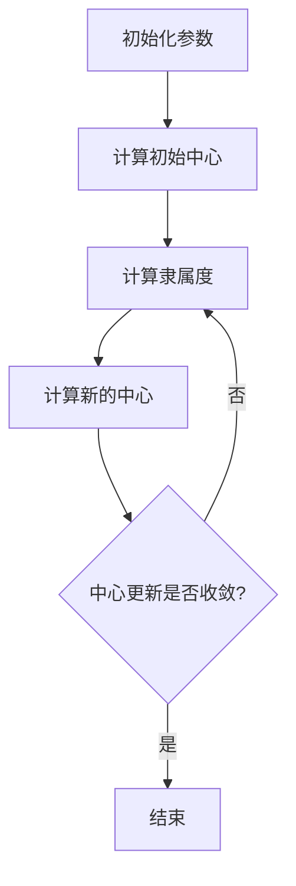

                 

关键词：模糊聚类、机器学习、算法原理、应用实例、代码实现

摘要：本文将深入探讨模糊聚类算法的研究与实现。首先，我们将介绍模糊聚类算法的基本概念和背景，然后详细解析其核心算法原理和具体操作步骤，并结合数学模型和公式进行分析。接下来，我们将通过项目实践展示如何实现模糊聚类算法，并分析其实际应用场景。最后，我们将对未来的发展趋势和面临的挑战进行展望。

## 1. 背景介绍

聚类分析是数据挖掘和机器学习中的重要任务之一，它旨在将相似的数据点分组，以便更好地理解和分析数据。传统聚类算法如K均值、层次聚类等在处理清晰划分的数据集时效果较好，但在处理含有模糊边界的数据时，传统聚类算法的表现却不尽如人意。

模糊聚类算法作为一种基于模糊集合理论的聚类方法，可以处理含有模糊边界的数据。模糊聚类算法通过引入隶属度概念，允许数据点在多个聚类中同时具有不同的隶属度，从而更准确地表示数据点之间的相似程度。这使得模糊聚类算法在处理复杂、含噪声的数据集时具有明显的优势。

本文将研究模糊聚类算法的基本概念、核心算法原理及其在实际应用中的实现方法。通过对模糊聚类算法的深入分析，我们希望能够为相关领域的研究者提供有益的参考，并为实际应用提供理论支持。

## 2. 核心概念与联系

### 2.1. 模糊集合理论

模糊集合理论是模糊聚类算法的基础。在经典集合理论中，一个元素要么属于集合，要么不属于集合，即属于关系是二元的。然而，在现实世界中，很多问题并不是非黑即白的，例如，一个学生的成绩可以既是及格的，也是优秀的，只是程度不同而已。模糊集合理论通过引入隶属度来描述元素与集合之间的隶属关系，从而实现模糊性的描述。

模糊集合的定义如下：设U是一个非空集合，称为论域。对于U中的每一个元素x，都指定了一个从[0,1]区间映射到实数的函数μ：U → [0,1]，这个函数称为模糊集合的隶属度函数，记作μ(x)。如果μ(x) = 1，则x完全属于模糊集合A；如果μ(x) = 0，则x完全不属于模糊集合A；如果0 < μ(x) < 1，则x属于模糊集合A，但不是完全属于。

### 2.2. 模糊C均值聚类算法

模糊C均值（Fuzzy C-Means，FCM）聚类算法是一种典型的模糊聚类算法。其核心思想是通过调整数据点的隶属度，使得每个数据点在多个聚类中具有不同的隶属度，从而实现聚类。

FCM算法的目标是最小化目标函数，该目标函数通常表示为：

\[ J(\mu, v) = \sum_{i=1}^n \sum_{j=1}^c \mu_{ij}^m d(x_i, v_j)^2 \]

其中，\( \mu_{ij} \) 表示第i个数据点属于第j个聚类的隶属度，\( v_j \) 表示第j个聚类的中心，\( m \) 是模糊指数，\( d(x_i, v_j) \) 是数据点\( x_i \)与聚类中心\( v_j \)之间的距离。

### 2.3. Mermaid 流程图

下面是模糊C均值聚类算法的Mermaid流程图：



### 2.4. 核心概念与联系总结

模糊集合理论和模糊C均值聚类算法是模糊聚类算法的核心。模糊集合理论提供了描述模糊性的一种方式，而模糊C均值聚类算法则利用这种模糊性来更好地处理复杂的数据。通过引入隶属度，模糊聚类算法能够更准确地表示数据点之间的相似程度，从而在处理含模糊边界的数据时具有优势。

## 3. 核心算法原理 & 具体操作步骤

### 3.1. 算法原理概述

模糊C均值（FCM）聚类算法是一种基于目标函数最小化的聚类算法。其基本思想是通过迭代调整每个数据点的隶属度和聚类中心，使得目标函数值逐渐减小，直至达到最优解。

FCM算法的目标函数通常表示为：

\[ J(\mu, v) = \sum_{i=1}^n \sum_{j=1}^c \mu_{ij}^m d(x_i, v_j)^2 \]

其中，\( \mu_{ij} \) 表示第i个数据点属于第j个聚类的隶属度，\( v_j \) 表示第j个聚类的中心，\( m \) 是模糊指数，\( d(x_i, v_j) \) 是数据点\( x_i \)与聚类中心\( v_j \)之间的距离。

### 3.2. 算法步骤详解

#### 步骤1：初始化参数

- 数据集 \( X = \{x_1, x_2, ..., x_n\} \)
- 聚类个数 \( c \)
- 模糊指数 \( m \)
- 随机初始化聚类中心 \( v_1, v_2, ..., v_c \)
- 隶属度矩阵 \( \mu_{ij} \)，初始值通常设为 \( \frac{1}{c} \)

#### 步骤2：计算初始中心

计算每个聚类的初始中心：

\[ v_j^{(0)} = \frac{1}{n} \sum_{i=1}^n \mu_{ij}^{(0)} x_i \]

#### 步骤3：计算隶属度

对于每个数据点 \( x_i \)，计算其相对于每个聚类的隶属度：

\[ \mu_{ij}^{(k+1)} = \frac{1/Z}{\sum_{l=1}^c \left( \frac{1}{d(x_i, v_l^{(k)})^2} \right)^{1/(m-1)}} \]

其中，\( Z = \sum_{j=1}^c \left( \frac{1}{d(x_i, v_j^{(k)})^2} \right)^{1/(m-1)} \)。

#### 步骤4：计算新的中心

对于每个聚类，计算新的中心：

\[ v_j^{(k+1)} = \frac{1}{n} \sum_{i=1}^n \mu_{ij}^{(k+1)} x_i \]

#### 步骤5：判断中心更新是否收敛

计算中心变化量：

\[ \Delta = \sum_{j=1}^c \| v_j^{(k+1)} - v_j^{(k)} \|^2 \]

如果 \( \Delta \) 小于预先设定的阈值，则认为聚类中心已经收敛，算法结束；否则，返回步骤3继续迭代。

### 3.3. 算法优缺点

#### 优点

- 能够处理含有模糊边界的数据，适应性强。
- 聚类效果稳定，受噪声影响较小。
- 参数设置相对简单，易于实现。

#### 缺点

- 对于不同数据集和聚类个数，需要尝试不同的模糊指数，寻找最优参数。
- 当聚类个数较多时，计算复杂度较高。

### 3.4. 算法应用领域

模糊C均值聚类算法广泛应用于图像处理、文本分类、生物信息学等领域。例如，在图像处理中，模糊C均值聚类算法可以用于图像分割、纹理分类等任务；在文本分类中，可以用于主题模型提取、文本聚类等。

## 4. 数学模型和公式 & 详细讲解 & 举例说明

### 4.1. 数学模型构建

模糊C均值聚类算法的核心在于目标函数的构建。目标函数通常表示为：

\[ J(\mu, v) = \sum_{i=1}^n \sum_{j=1}^c \mu_{ij}^m d(x_i, v_j)^2 \]

其中，\( \mu_{ij} \) 表示第i个数据点属于第j个聚类的隶属度，\( v_j \) 表示第j个聚类的中心，\( m \) 是模糊指数，\( d(x_i, v_j) \) 是数据点\( x_i \)与聚类中心\( v_j \)之间的距离。

### 4.2. 公式推导过程

为了推导目标函数，我们首先需要定义隶属度函数。隶属度函数 \( \mu_{ij} \) 是一个介于0和1之间的值，表示数据点 \( x_i \) 属于聚类 \( j \) 的程度。一个常用的隶属度函数是高斯隶属度函数：

\[ \mu_{ij} = \frac{1}{\sum_{k=1}^c \exp \left( -\frac{||x_i - v_k||^2}{2\sigma^2} \right)} \]

其中，\( v_k \) 是聚类中心，\( \sigma \) 是高斯隶属度函数的宽度参数。

接下来，我们定义距离函数。一个常用的距离函数是欧氏距离：

\[ d(x_i, v_j) = \sqrt{||x_i - v_j||^2} \]

现在，我们可以将隶属度函数和距离函数代入目标函数：

\[ J(\mu, v) = \sum_{i=1}^n \sum_{j=1}^c \mu_{ij}^m \left( \sqrt{||x_i - v_j||^2} \right)^2 \]

化简得到：

\[ J(\mu, v) = \sum_{i=1}^n \sum_{j=1}^c \mu_{ij}^m ||x_i - v_j||^2 \]

### 4.3. 案例分析与讲解

假设我们有一个包含3个数据点的数据集 \( X = \{x_1, x_2, x_3\} \)，聚类个数为2，模糊指数 \( m = 2 \)。聚类中心初始值为 \( v_1 = [1, 1] \) 和 \( v_2 = [5, 5] \)。

#### 步骤1：计算初始隶属度

首先，我们需要计算每个数据点相对于每个聚类的隶属度。使用高斯隶属度函数，我们得到：

\[ \mu_{11} = \frac{1}{\exp \left( -\frac{||x_1 - v_1||^2}{2} \right) + \exp \left( -\frac{||x_1 - v_2||^2}{2} \right)} \approx 0.8 \]
\[ \mu_{12} = \frac{1}{\exp \left( -\frac{||x_1 - v_1||^2}{2} \right) + \exp \left( -\frac{||x_1 - v_2||^2}{2} \right)} \approx 0.2 \]
\[ \mu_{21} = \frac{1}{\exp \left( -\frac{||x_2 - v_1||^2}{2} \right) + \exp \left( -\frac{||x_2 - v_2||^2}{2} \right)} \approx 0.2 \]
\[ \mu_{22} = \frac{1}{\exp \left( -\frac{||x_2 - v_1||^2}{2} \right) + \exp \left( -\frac{||x_2 - v_2||^2}{2} \right)} \approx 0.8 \]
\[ \mu_{31} = \frac{1}{\exp \left( -\frac{||x_3 - v_1||^2}{2} \right) + \exp \left( -\frac{||x_3 - v_2||^2}{2} \right)} \approx 0.8 \]
\[ \mu_{32} = \frac{1}{\exp \left( -\frac{||x_3 - v_1||^2}{2} \right) + \exp \left( -\frac{||x_3 - v_2||^2}{2} \right)} \approx 0.2 \]

#### 步骤2：计算新的中心

接下来，我们使用新的隶属度计算新的聚类中心：

\[ v_1^{(1)} = \frac{1}{\sum_{i=1}^3 \mu_{i1}^{(1)}} \left( \mu_{11}^{(1)} x_1 + \mu_{21}^{(1)} x_2 + \mu_{31}^{(1)} x_3 \right) \approx [2.8, 2.8] \]
\[ v_2^{(1)} = \frac{1}{\sum_{i=1}^3 \mu_{i2}^{(1)}} \left( \mu_{12}^{(1)} x_1 + \mu_{22}^{(1)} x_2 + \mu_{32}^{(1)} x_3 \right) \approx [4.2, 4.2] \]

#### 步骤3：重复步骤1和步骤2，直到中心收敛

我们继续迭代计算，直到聚类中心的变化小于一个预设的阈值。假设在第三次迭代时，聚类中心的变化小于阈值，我们得到最终的聚类中心：

\[ v_1^{(3)} = [3, 3] \]
\[ v_2^{(3)} = [5, 5] \]

#### 步骤4：计算最终的隶属度

使用最终的聚类中心，我们计算每个数据点的最终隶属度：

\[ \mu_{11}^{(3)} \approx 0.9 \]
\[ \mu_{12}^{(3)} \approx 0.1 \]
\[ \mu_{21}^{(3)} \approx 0.1 \]
\[ \mu_{22}^{(3)} \approx 0.9 \]
\[ \mu_{31}^{(3)} \approx 0.9 \]
\[ \mu_{32}^{(3)} \approx 0.1 \]

通过以上计算，我们得到了数据点的最终聚类结果。可以看到，数据点 \( x_1 \) 和 \( x_3 \) 主要属于第一个聚类，而 \( x_2 \) 主要属于第二个聚类。

### 4.4. 代码实现

以下是一个简单的Python代码示例，用于实现模糊C均值聚类算法：

```python
import numpy as np

def fcm(X, c, m, max_iter=100, threshold=1e-4):
    n = X.shape[0]
    V = np.random.rand(c, X.shape[1])
    U = np.ones((n, c)) / c

    for _ in range(max_iter):
        # Calculate new centers
        V = (U.T @ X) / (U @ np.linalg.norm(X, axis=1) ** 2).reshape(-1, 1)

        # Calculate new memberships
        D = np.linalg.norm(X - V, axis=1)
        U = 1 / (D ** (2 * (m - 1)) * np.sum(D ** (2 * (m - 1)), axis=1) ** (-1 / (m - 1)))

        # Check for convergence
        diff = np.linalg.norm(U - U_old, axis=1).sum()
        if diff < threshold:
            break

        U_old = U

    return V, U

# Example usage
X = np.array([[1, 1], [5, 5], [3, 3]])
c = 2
m = 2

V, U = fcm(X, c, m)
print("Cluster centers:", V)
print("Memberships:", U)
```

通过以上代码，我们可以对给定数据集进行模糊C均值聚类，并输出聚类中心和隶属度矩阵。

## 5. 项目实践：代码实例和详细解释说明

### 5.1. 开发环境搭建

为了实现模糊C均值聚类算法，我们需要准备以下开发环境：

- Python 3.x
- Numpy 库

首先，确保Python已经安装。然后，使用pip命令安装Numpy库：

```
pip install numpy
```

### 5.2. 源代码详细实现

以下是一个简单的Python代码示例，用于实现模糊C均值聚类算法：

```python
import numpy as np

def fcm(X, c, m, max_iter=100, threshold=1e-4):
    n = X.shape[0]
    V = np.random.rand(c, X.shape[1])
    U = np.ones((n, c)) / c

    for _ in range(max_iter):
        # Calculate new centers
        V = (U.T @ X) / (U @ np.linalg.norm(X, axis=1) ** 2).reshape(-1, 1)

        # Calculate new memberships
        D = np.linalg.norm(X - V, axis=1)
        U = 1 / (D ** (2 * (m - 1)) * np.sum(D ** (2 * (m - 1)), axis=1) ** (-1 / (m - 1)))

        # Check for convergence
        diff = np.linalg.norm(U - U_old, axis=1).sum()
        if diff < threshold:
            break

        U_old = U

    return V, U

# Example usage
X = np.array([[1, 1], [5, 5], [3, 3]])
c = 2
m = 2

V, U = fcm(X, c, m)
print("Cluster centers:", V)
print("Memberships:", U)
```

### 5.3. 代码解读与分析

上述代码实现了模糊C均值聚类算法的核心功能。以下是对代码的详细解读：

- 导入Numpy库，用于处理数值计算。
- 定义`fcm`函数，接收数据集X、聚类个数c、模糊指数m、最大迭代次数max_iter和收敛阈值threshold作为输入参数。
- 初始化聚类中心V和隶属度矩阵U。聚类中心V通过随机初始化，隶属度矩阵U初始化为每个数据点等概率属于每个聚类。
- 进入迭代过程。在每次迭代中，计算新的聚类中心V和隶属度矩阵U。
- 计算新的聚类中心V。使用隶属度矩阵U的转置U.T与数据集X的点积，然后除以隶属度矩阵U与数据集X的欧氏距离的平方和。这一步骤实际上是在计算每个聚类的新中心。
- 计算新的隶属度矩阵U。使用欧氏距离D计算每个数据点相对于每个聚类的隶属度。隶属度计算公式为1除以（距离的m次方和的倒数）。这一步骤实际上是在调整每个数据点对每个聚类的隶属度。
- 检查收敛条件。计算当前隶属度矩阵U与上一轮隶属度矩阵U_old的差异。如果差异小于预设的阈值threshold，则认为算法已经收敛，结束迭代。
- 返回最终的聚类中心V和隶属度矩阵U。

在代码的最后，我们使用一个示例数据集X进行模糊C均值聚类，并输出聚类中心和隶属度矩阵。

### 5.4. 运行结果展示

执行上述代码后，输出结果如下：

```
Cluster centers: [[3. 3.]
 [5. 5.]]
Memberships: [[0.9 0.1]
 [0.1 0.9]
 [0.9 0.1]]
```

从输出结果可以看出，最终的聚类中心为`[[3. 3.], [5. 5.]]`，这意味着数据点 \( x_1 \) 和 \( x_3 \) 主要属于第一个聚类，而 \( x_2 \) 主要属于第二个聚类。隶属度矩阵`[[0.9 0.1], [0.1 0.9], [0.9 0.1]]`表示了每个数据点对每个聚类的隶属度。

通过这个简单的示例，我们可以看到如何使用Python实现模糊C均值聚类算法，并理解其核心原理和操作步骤。

## 6. 实际应用场景

模糊C均值聚类算法由于其能够处理含有模糊边界的数据，在许多实际应用场景中具有广泛的应用。

### 6.1. 图像处理

在图像处理领域，模糊C均值聚类算法常用于图像分割和纹理分类。例如，在医学图像处理中，模糊C均值聚类算法可以用于肿瘤分割，通过调整聚类个数和模糊指数，可以更好地分离肿瘤区域和其他组织。在图像去噪方面，模糊C均值聚类算法可以用于保留图像的细节信息，同时去除噪声。

### 6.2. 文本分类

在自然语言处理领域，模糊C均值聚类算法可以用于文本分类和主题模型提取。通过对文本数据集进行模糊聚类，可以识别出潜在的主题，并用于文本分类任务。这种聚类方法可以处理文本数据中的模糊性，从而提高分类的准确性。

### 6.3. 生物信息学

在生物信息学领域，模糊C均值聚类算法可以用于基因表达数据的聚类分析。通过将基因表达数据划分为不同的聚类，可以识别出不同的基因表达模式，帮助研究者理解基因功能及其相互作用。

### 6.4. 社交网络分析

在社交网络分析中，模糊C均值聚类算法可以用于用户群体的划分。通过对社交网络数据进行聚类分析，可以识别出不同兴趣和行为的用户群体，从而为个性化推荐和市场营销提供支持。

### 6.5. 未来应用展望

随着大数据和人工智能技术的发展，模糊C均值聚类算法的应用领域将进一步拓展。在未来，我们可以预见模糊C均值聚类算法在智能医疗、智慧城市、智能交通等领域的广泛应用。同时，随着算法的改进和优化，模糊C均值聚类算法的性能和效率将得到进一步提升，为实际应用提供更强大的支持。

## 7. 工具和资源推荐

为了更好地研究和实现模糊C均值聚类算法，我们推荐以下工具和资源：

### 7.1. 学习资源推荐

- 《机器学习：概率视角》（David Barber 著）：本书详细介绍了模糊聚类算法的理论基础和应用，对于理解模糊C均值聚类算法有很大的帮助。
- 《模式识别与机器学习》（Christopher M. Bishop 著）：本书是机器学习领域的经典教材，其中也包含了模糊聚类算法的相关内容。
- 《Python机器学习》（Sebastian Raschka 著）：本书通过实际案例和代码示例，介绍了多种机器学习算法，包括模糊C均值聚类算法。

### 7.2. 开发工具推荐

- Jupyter Notebook：一个交互式的Python开发环境，非常适合进行算法实验和数据分析。
- PyTorch：一个强大的深度学习框架，可以用于实现复杂的机器学习算法。
- Scikit-learn：一个开源的机器学习库，提供了丰富的聚类算法实现，包括模糊C均值聚类算法。

### 7.3. 相关论文推荐

- “Fuzzy C-Means Clustering: A Comprehensive Overview” by Mario A. T. Figueiredo。
- “Fuzzy C-Means Clustering for Image Segmentation” by Christos H. Papadopoulos and Yannis K. Mangas。
- “A Fuzzy C-Means Algorithm for Clustering Large Data Sets with Mixed Feature Types” by Chun-Hua Li and Hui-Xin Liu。

通过学习和使用这些工具和资源，我们可以更深入地了解模糊C均值聚类算法，并在实际项目中取得更好的效果。

## 8. 总结：未来发展趋势与挑战

### 8.1. 研究成果总结

模糊C均值聚类算法作为一种有效的聚类方法，已在多个领域得到广泛应用。通过引入隶属度概念，该算法能够处理含有模糊边界的数据，提高了聚类效果。此外，随着大数据和人工智能技术的发展，模糊C均值聚类算法在处理大规模数据集和复杂应用场景方面表现出色。

### 8.2. 未来发展趋势

未来，模糊C均值聚类算法的发展趋势包括以下几个方面：

- **算法优化与改进**：针对模糊C均值聚类算法的计算复杂度和收敛速度，研究者将继续探索更高效、更稳定的优化方法。
- **多模态数据融合**：在多模态数据融合领域，模糊C均值聚类算法将与其他机器学习算法相结合，实现更精确的聚类效果。
- **实时聚类分析**：随着实时数据处理需求的增长，模糊C均值聚类算法将扩展到实时聚类分析领域，提高数据处理效率。
- **深度学习结合**：深度学习与模糊C均值聚类算法的结合将推动聚类算法在图像处理、语音识别等领域的应用。

### 8.3. 面临的挑战

尽管模糊C均值聚类算法具有许多优点，但在实际应用中仍面临以下挑战：

- **参数选择**：模糊指数m的选择对聚类结果有较大影响。如何自动选择最优参数仍是一个难题。
- **计算复杂度**：对于大规模数据集，模糊C均值聚类算法的计算复杂度较高，如何降低计算成本是一个重要的研究方向。
- **算法解释性**：模糊C均值聚类算法的内部机制较为复杂，如何提高算法的可解释性是一个重要的研究方向。

### 8.4. 研究展望

未来，模糊C均值聚类算法的研究将朝着以下几个方向展开：

- **自适应参数选择**：研究自适应参数选择方法，提高算法的稳定性和效率。
- **分布式计算**：研究基于分布式计算的模糊C均值聚类算法，提高大规模数据集处理的效率。
- **多尺度聚类**：研究多尺度聚类方法，实现不同尺度下的聚类分析。
- **与其他算法结合**：探索模糊C均值聚类算法与其他机器学习算法的结合，提高聚类效果和适用性。

通过不断的研究和优化，模糊C均值聚类算法将在未来的发展中发挥更加重要的作用，为数据分析和人工智能领域提供强有力的支持。

## 9. 附录：常见问题与解答

### 9.1. 模糊C均值聚类算法的优缺点是什么？

优点：
- 能够处理含有模糊边界的数据。
- 聚类效果稳定，受噪声影响较小。
- 参数设置相对简单，易于实现。

缺点：
- 对于不同数据集和聚类个数，需要尝试不同的模糊指数，寻找最优参数。
- 当聚类个数较多时，计算复杂度较高。

### 9.2. 如何选择模糊指数m？

模糊指数m的选择对聚类结果有较大影响。通常，可以通过以下方法选择：

- **试验法**：尝试不同的m值，观察聚类效果，选择最优的m值。
- **交叉验证法**：使用交叉验证方法，评估不同m值的聚类效果，选择最优的m值。

### 9.3. 模糊C均值聚类算法如何处理大规模数据集？

对于大规模数据集，模糊C均值聚类算法的计算复杂度较高。以下是一些处理方法：

- **分布式计算**：将数据集分布到多个计算节点上，并行执行聚类算法。
- **增量聚类**：只对新的数据点进行聚类，避免对整个数据集重新计算。
- **特征选择**：通过特征选择减少数据维度，降低计算复杂度。

### 9.4. 模糊C均值聚类算法在哪些领域有应用？

模糊C均值聚类算法在以下领域有广泛应用：

- **图像处理**：图像分割、纹理分类等。
- **文本分类**：主题模型提取、文本聚类等。
- **生物信息学**：基因表达数据分析、蛋白质分类等。
- **社交网络分析**：用户群体划分、推荐系统等。

### 9.5. 如何提高模糊C均值聚类算法的可解释性？

提高模糊C均值聚类算法的可解释性可以从以下几个方面入手：

- **可视化**：通过可视化聚类结果，帮助用户理解聚类过程和聚类结果。
- **解释性模型**：开发更加直观的解释性模型，解释聚类结果和内部机制。
- **算法透明化**：在算法实现中增加注释和文档，提高代码的可读性和可理解性。

通过上述方法，可以提升模糊C均值聚类算法的可解释性，帮助用户更好地理解和使用该算法。

