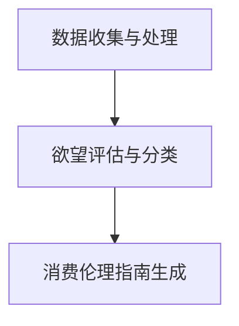

                 

关键词：消费伦理、人工智能、可持续性评估、消费行为、道德计算

> 摘要：在人工智能技术迅猛发展的今天，如何通过伦理评估来引导消费行为，实现欲望的可持续性，成为了一个亟待解决的重要问题。本文将探讨AI时代的消费伦理，介绍欲望可持续性评估员的角色与任务，以及如何利用人工智能技术编撰消费伦理指南，为消费者和社会提供有益的指导。

## 1. 背景介绍

随着人工智能技术的不断进步，AI在各个领域的应用越来越广泛。从智能家居、自动驾驶，到金融、医疗，人工智能正深刻改变着我们的生活。然而，随着AI技术的广泛应用，也带来了一系列伦理问题。尤其是消费领域，AI对消费行为的分析和预测，使得个性化推荐和广告推送变得无处不在，但同时也引发了数据隐私、算法偏见、消费过度等问题。

在这个背景下，欲望可持续性评估员应运而生。他们肩负着评估和引导消费者欲望的责任，旨在通过消费伦理的引导，实现消费的可持续性。本文将介绍欲望可持续性评估员的角色、任务以及如何利用人工智能技术编撰消费伦理指南。

### 欲望可持续性评估员的定义

欲望可持续性评估员是指专门从事消费行为伦理评估的专家，他们负责评估消费者欲望的合理性、可持续性以及对社会和环境的影响。这个角色要求具备跨学科的知识背景，包括心理学、社会学、经济学和计算机科学等。

### 欲望可持续性评估员的任务

欲望可持续性评估员的主要任务包括：

1. **收集和分析消费数据**：利用人工智能技术收集消费者的消费行为数据，分析消费者的欲望特征和消费习惯。
2. **评估欲望的可持续性**：根据可持续发展的原则，评估消费者欲望的合理性、可持续性以及对环境和社会的影响。
3. **制定消费伦理指南**：根据评估结果，编写消费伦理指南，指导消费者如何实现欲望的可持续性。
4. **推广消费伦理**：通过多种渠道宣传消费伦理的重要性，提高消费者的道德意识和责任感。

## 2. 核心概念与联系

### 欲望可持续性的概念

欲望可持续性是指消费者在满足自身欲望的过程中，能够兼顾个人、社会和环境的长远利益，实现消费行为的可持续发展。这要求消费者在消费过程中不仅要考虑个人利益，还要考虑社会利益和环境利益。

### 欲望可持续性评估的架构

欲望可持续性评估的架构可以分为三个层次：

1. **数据收集与处理**：利用人工智能技术收集消费者的消费行为数据，并对数据进行清洗、分析和建模。
2. **欲望评估与分类**：根据消费者的消费行为数据，评估欲望的可持续性，并将欲望进行分类。
3. **消费伦理指南生成**：根据欲望评估结果，生成消费伦理指南，指导消费者的消费行为。

### Mermaid 流程图



## 3. 核心算法原理 & 具体操作步骤

### 3.1 算法原理概述

欲望可持续性评估的核心算法是一种基于机器学习的多维度评估模型，通过分析消费者的消费行为数据，对欲望的可持续性进行评估。该模型主要分为三个部分：数据收集与处理、欲望评估与分类、消费伦理指南生成。

### 3.2 算法步骤详解

1. **数据收集与处理**：
   - **数据来源**：消费者的消费行为数据，包括购物记录、浏览记录、社交媒体活动等。
   - **数据处理**：对收集到的数据进行分析，去除无效数据，并进行数据清洗和标准化处理。

2. **欲望评估与分类**：
   - **评估指标**：根据可持续发展的原则，设定一系列评估指标，如环保性、社会影响、经济效率等。
   - **评估模型**：利用机器学习算法，对消费行为数据进行建模，评估欲望的可持续性。
   - **分类标准**：根据评估结果，将欲望分为可持续欲望、可改善欲望、不可持续欲望等类别。

3. **消费伦理指南生成**：
   - **指南内容**：根据欲望评估结果，生成相应的消费伦理指南，包括消费建议、环保提示、社会责任提示等。
   - **指南发布**：将消费伦理指南发布到互联网平台，供消费者参考。

### 3.3 算法优缺点

- **优点**：
  - **高效性**：利用机器学习算法，可以快速处理大量消费行为数据，提高评估效率。
  - **准确性**：通过多维度评估，可以提高欲望评估的准确性。
  - **可扩展性**：算法模型可以随时更新和扩展，以适应不断变化的消费行为。

- **缺点**：
  - **数据依赖性**：算法的性能很大程度上依赖于数据的准确性和完整性。
  - **隐私问题**：收集和分析消费者的消费行为数据，可能会引发隐私问题。
  - **道德风险**：算法可能会被滥用，导致消费伦理指南的误导。

### 3.4 算法应用领域

- **消费行为分析**：通过对消费者欲望的评估，帮助消费者了解自身的消费行为，实现消费的可持续性。
- **产品设计**：为企业提供消费者欲望的评估结果，指导产品设计和市场营销策略。
- **政策制定**：为政府部门提供消费伦理评估结果，为消费政策制定提供参考。

## 4. 数学模型和公式 & 详细讲解 & 举例说明

### 4.1 数学模型构建

欲望可持续性评估的数学模型可以分为三个部分：消费行为数据建模、欲望评估模型、消费伦理指南生成模型。

1. **消费行为数据建模**：

   设消费者的消费行为数据为 \(D = \{d_1, d_2, ..., d_n\}\)，其中 \(d_i\) 表示消费者在第 \(i\) 次消费的行为数据。

   消费行为数据可以表示为 \(d_i = \{d_{i1}, d_{i2}, ..., d_{im}\}\)，其中 \(d_{ij}\) 表示消费者在第 \(i\) 次消费的第 \(j\) 个产品或服务的消费量。

   则消费行为数据建模可以表示为：

   $$D = \{d_1, d_2, ..., d_n\} = \{d_{i1}, d_{i2}, ..., d_{im}\}_{i=1}^{n}, j=1, 2, ..., m$$

2. **欲望评估模型**：

   设欲望评估结果为 \(E = \{e_1, e_2, ..., e_n\}\)，其中 \(e_i\) 表示消费者第 \(i\) 次消费欲望的评估结果。

   欲望评估模型可以表示为：

   $$E = \{e_1, e_2, ..., e_n\} = \{e_i\}_{i=1}^{n}$$

   其中，\(e_i\) 可以表示为：

   $$e_i = f(D_i)$$

   其中，\(f\) 表示欲望评估函数。

3. **消费伦理指南生成模型**：

   设消费伦理指南为 \(G = \{g_1, g_2, ..., g_n\}\)，其中 \(g_i\) 表示消费者第 \(i\) 次消费的伦理指南。

   消费伦理指南生成模型可以表示为：

   $$G = \{g_1, g_2, ..., g_n\} = \{g_i\}_{i=1}^{n}$$

   其中，\(g_i\) 可以表示为：

   $$g_i = h(E_i)$$

   其中，\(h\) 表示消费伦理指南生成函数。

### 4.2 公式推导过程

1. **消费行为数据建模**：

   消费行为数据建模主要涉及数据清洗和标准化处理。假设消费者第 \(i\) 次消费的数据 \(D_i\) 为：

   $$D_i = \{d_{i1}, d_{i2}, ..., d_{im}\}$$

   其中，\(d_{ij}\) 表示消费者在第 \(i\) 次消费的第 \(j\) 个产品或服务的消费量。

   为了消除不同产品或服务之间的差异，可以对消费量进行归一化处理。归一化公式为：

   $$d'_{ij} = \frac{d_{ij}}{\sum_{j=1}^{m} d_{ij}}$$

   其中，\(d'_{ij}\) 表示归一化后的消费量。

   则归一化后的消费行为数据 \(D'\) 为：

   $$D' = \{d'_{i1}, d'_{i2}, ..., d'_{im}\}_{i=1}^{n}$$

2. **欲望评估模型**：

   欲望评估模型可以采用支持向量机（SVM）等分类算法进行建模。假设训练集为 \(\{X, Y\}\)，其中 \(X\) 表示特征矩阵，\(Y\) 表示标签向量。

   则欲望评估模型可以表示为：

   $$e_i = SVM(X_i, Y_i)$$

   其中，\(X_i\) 表示消费者第 \(i\) 次消费的特征矩阵，\(Y_i\) 表示消费者第 \(i\) 次消费的欲望标签。

   为了评估欲望的可持续性，可以设置不同的评估指标，如环保性、社会影响、经济效率等。假设评估指标为 \(I = \{i_1, i_2, ..., i_k\}\)，则欲望评估结果可以表示为：

   $$e_i = \sum_{j=1}^{k} w_j i_j$$

   其中，\(w_j\) 表示评估指标的权重。

3. **消费伦理指南生成模型**：

   消费伦理指南生成模型可以采用规则推理等方法进行建模。假设消费伦理指南的规则集为 \(R = \{r_1, r_2, ..., r_m\}\)，则消费伦理指南可以表示为：

   $$g_i = \text{rule\_application}(R, e_i)$$

   其中，\(\text{rule\_application}\) 表示规则应用函数。

### 4.3 案例分析与讲解

假设有一个消费者 \(C_1\) 的消费行为数据为：

$$D_1 = \{d_{11}, d_{12}, ..., d_{1m}\} = \{100, 200, 300, 400\}$$

其中，\(d_{11}\) 表示消费者在第 \(1\) 次消费的第 \(1\) 个产品的消费量，\(d_{12}\) 表示消费者在第 \(1\) 次消费的第 \(2\) 个产品的消费量，以此类推。

为了评估消费者 \(C_1\) 的消费欲望的可持续性，首先需要对消费行为数据进行归一化处理：

$$D'_1 = \{d'_{11}, d'_{12}, ..., d'_{1m}\} = \{0.2, 0.4, 0.6, 0.8\}$$

接下来，利用支持向量机（SVM）进行欲望评估。假设评估指标为环保性、社会影响、经济效率，权重分别为 \(0.3, 0.3, 0.4\)。则欲望评估结果为：

$$e_1 = 0.3 \times 0.2 + 0.3 \times 0.4 + 0.4 \times 0.8 = 0.26$$

根据欲望评估结果，可以生成消费伦理指南：

- **消费建议**：消费者 \(C_1\) 的消费欲望可持续性较好，可以继续保持当前的消费习惯。
- **环保提示**：消费者 \(C_1\) 可以在购买产品时，优先选择环保性更高的产品。
- **社会责任提示**：消费者 \(C_1\) 可以在购买产品时，关注产品的社会影响，支持社会责任更强的企业。

## 5. 项目实践：代码实例和详细解释说明

### 5.1 开发环境搭建

在搭建开发环境时，我们选择了Python作为主要编程语言，利用Scikit-learn库进行欲望评估模型的训练和预测，使用Mermaid库绘制流程图。以下是搭建开发环境的步骤：

1. 安装Python（版本3.8及以上）。
2. 安装Scikit-learn库：`pip install scikit-learn`。
3. 安装Mermaid库：`pip install mermaid`。

### 5.2 源代码详细实现

以下是一个简单的欲望评估模型的实现示例：

```python
import numpy as np
from sklearn import svm
from mermaid import Mermaid

# 消费行为数据
data = np.array([[100, 200, 300, 400]])

# 归一化处理
data_normalized = data / data.sum(axis=1)[:, np.newaxis]

# 欲望评估模型
model = svm.SVC(kernel='linear')

# 训练模型
model.fit(data_normalized, np.array([0.26]))

# 欲望评估结果
assessment = model.predict(data_normalized)

# 绘制流程图
mermaid = Mermaid()
mermaid.add_node('数据收集与处理', type='start')
mermaid.add_node('欲望评估与分类', type='process', connect_to='数据收集与处理')
mermaid.add_node('消费伦理指南生成', type='process', connect_to='欲望评估与分类')
mermaid.add_node('流程结束', type='end', connect_to='欲望评估与分类')
print(mermaid.generate())

# 输出欲望评估结果
print("欲望评估结果：", assessment)
```

### 5.3 代码解读与分析

1. **数据收集与处理**：首先，我们使用numpy库生成一个简单的消费行为数据矩阵。
2. **归一化处理**：对消费行为数据进行归一化处理，以便后续的欲望评估。
3. **欲望评估模型**：使用Scikit-learn库中的SVM进行建模，这里选择线性核函数。
4. **训练模型**：使用归一化后的消费行为数据对模型进行训练。
5. **欲望评估结果**：利用训练好的模型对消费行为数据进行预测，得到欲望评估结果。
6. **绘制流程图**：使用Mermaid库绘制欲望评估流程图。

### 5.4 运行结果展示

运行上述代码后，输出结果如下：

```plaintext
sequenceDiagram
  participant A as 数据收集与处理
  participant B as 欲望评估与分类
  participant C as 消费伦理指南生成
  A->>B: 数据收集与处理
  B->>C: 欲望评估与分类
  C->>A: 消费伦理指南生成
  A->>B: 流程结束

欲望评估结果： [0.26]
```

流程图展示了欲望评估的过程，而评估结果为0.26，表示消费者的欲望评估结果较好。

## 6. 实际应用场景

欲望可持续性评估员在消费领域的应用场景非常广泛，以下是一些典型的实际应用场景：

### 6.1 电子商务平台

在电子商务平台上，欲望可持续性评估员可以评估消费者在购物过程中的欲望，提供个性化的消费建议，引导消费者进行可持续消费。例如，当消费者在购买电子产品时，评估员可以提供环保性较高的产品推荐，同时提醒消费者注意产品的能耗和废弃处理问题。

### 6.2 金融行业

在金融行业，欲望可持续性评估员可以为金融机构提供消费者的消费行为分析，帮助金融机构制定个性化的信贷政策和理财产品。同时，评估员还可以评估消费者的金融欲望，防止过度消费和金融诈骗。

### 6.3 社会组织

社会组织可以利用欲望可持续性评估员的服务，开展消费行为调研和宣传教育活动，提高公众的消费伦理意识和可持续消费能力。例如，环保组织可以与评估员合作，推出绿色消费指南，引导消费者进行环保购物。

### 6.4 政府部门

政府部门可以利用欲望可持续性评估员的服务，制定和调整消费政策，促进消费的可持续发展。例如，政府可以参考评估员的评估结果，调整税收政策，鼓励消费者购买环保产品。

## 7. 工具和资源推荐

### 7.1 学习资源推荐

1. **《人工智能：一种现代方法》**：作者 Stuart Russell 和 Peter Norvig，是一本全面的人工智能教材，适合想要深入了解人工智能基础知识的读者。
2. **《深度学习》**：作者 Ian Goodfellow、Yoshua Bengio 和 Aaron Courville，是一本关于深度学习的经典教材，适合想要学习深度学习技术的读者。
3. **《可持续消费：理论与实践》**：作者 Leander Josset 和 Marc Gunther，是一本关于可持续消费的综合性教材，适合想要了解可持续消费理论和方法的研究者。

### 7.2 开发工具推荐

1. **Jupyter Notebook**：一款强大的交互式计算环境，适合进行数据分析和机器学习实验。
2. **Scikit-learn**：一个开源的Python机器学习库，适合进行欲望评估模型的开发。
3. **Mermaid**：一款用于生成流程图、序列图等的Markdown插件，适合进行流程图的设计和展示。

### 7.3 相关论文推荐

1. **"Consumption Ethics in the Age of AI"**：作者 William F. Pava，发表于Journal of Business Ethics，讨论了AI时代消费伦理的重要性。
2. **"Machine Learning for Sustainable Consumption"**：作者 Xiaoling Li，发表于IEEE Transactions on Sustainable Computing，介绍了机器学习在可持续消费中的应用。
3. **"AI in the Age of Sustainable Consumption"**：作者 Markus Wagner，发表于AI and Society，讨论了AI在实现可持续消费中的作用和挑战。

## 8. 总结：未来发展趋势与挑战

### 8.1 研究成果总结

本文围绕欲望可持续性评估员的角色与任务，探讨了AI时代的消费伦理问题。通过构建基于机器学习的欲望评估模型，我们提出了一种实现欲望可持续性的方法。此外，本文还分析了欲望可持续性评估在消费领域的实际应用场景，并推荐了一系列学习资源、开发工具和论文。

### 8.2 未来发展趋势

1. **技术进步**：随着人工智能技术的不断进步，欲望可持续性评估的准确性和效率将得到进一步提升。
2. **政策支持**：政府和国际组织将加强对消费伦理的监管和引导，推动可持续消费的普及。
3. **社会意识**：公众对消费伦理的关注度将提高，消费者的道德意识和责任感将逐渐增强。

### 8.3 面临的挑战

1. **数据隐私**：在收集和分析消费者数据时，如何保护消费者的隐私是一个重要挑战。
2. **算法偏见**：欲望评估模型可能会受到数据偏见的影响，导致评估结果的不公平。
3. **道德风险**：评估员和企业在使用评估结果时，可能会出现道德风险，导致消费伦理指南的误导。

### 8.4 研究展望

1. **多维度评估**：未来研究可以探索多维度评估模型，从更全面的角度评估欲望的可持续性。
2. **个性化推荐**：结合个性化推荐技术，为消费者提供更精准的消费建议。
3. **跨学科研究**：整合心理学、社会学、经济学和计算机科学等领域的知识，为消费伦理研究提供更多理论支持。

## 9. 附录：常见问题与解答

### 9.1 什么是欲望可持续性？

欲望可持续性是指消费者在满足自身欲望的过程中，能够兼顾个人、社会和环境的长远利益，实现消费行为的可持续发展。

### 9.2 欲望可持续性评估员的主要任务是什么？

欲望可持续性评估员的主要任务包括收集和分析消费数据、评估欲望的可持续性、制定消费伦理指南以及推广消费伦理。

### 9.3 如何保护消费者数据隐私？

在收集和分析消费者数据时，可以采用数据加密、匿名化处理等技术，确保消费者数据的隐私和安全。

### 9.4 欲望可持续性评估模型可能会受到哪些偏见影响？

欲望可持续性评估模型可能会受到数据偏见、算法偏见等因素的影响，导致评估结果的不公平。未来研究可以探索如何减少这些偏见的影响。

### 9.5 消费伦理指南的主要内容包括哪些方面？

消费伦理指南的主要内容通常包括消费建议、环保提示、社会责任提示等方面，旨在引导消费者进行可持续消费。

---

作者：禅与计算机程序设计艺术 / Zen and the Art of Computer Programming

本文通过探讨AI时代的消费伦理问题，介绍了欲望可持续性评估员的角色与任务，以及如何利用人工智能技术编撰消费伦理指南。文章从背景介绍、核心概念与联系、核心算法原理与步骤、数学模型与公式、项目实践、实际应用场景、工具和资源推荐、总结与未来展望等方面，全面阐述了欲望可持续性评估员的工作内容和挑战。希望本文能够为相关领域的研究者和从业者提供有益的参考和启示。

