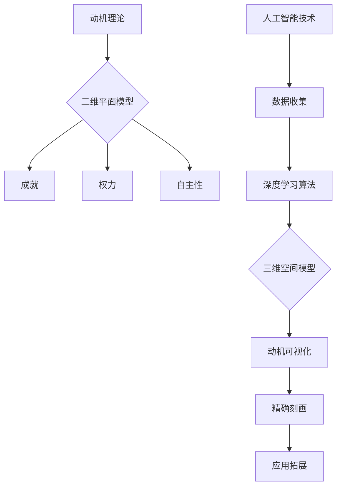

                 

关键词：欲望地图、AI、立体动机模型、人工智能、动机理论、3D可视化、应用领域

> 摘要：本文将探讨人工智能在动机理论中的应用，通过引入欲望地图3D模型，为读者提供一种全新的理解动机的视角。本文将详细阐述欲望地图3D模型的核心概念、算法原理、数学模型以及在实际应用中的具体操作步骤，帮助读者深入了解这一先进技术，并探讨其在未来可能的应用前景。

## 1. 背景介绍

动机理论是心理学中的一个重要分支，它关注个体行为背后的内在驱动因素。传统的动机理论，如弗鲁姆的期望理论、赫尔茨伯格的双因素理论等，虽然为我们理解人类行为提供了重要的理论框架，但它们往往局限于二维的平面描述，难以全面反映动机的复杂性和多维性。

随着人工智能技术的快速发展，特别是生成对抗网络（GAN）和深度学习算法的广泛应用，我们开始有机会将人工智能技术应用于动机理论的研究中，从而构建出更为精确和全面的动机模型。欲望地图3D模型正是这样一种尝试，它通过人工智能技术，将个体的动机以三维空间的形式进行可视化，为研究者和实践者提供了一种全新的理解和分析动机的方法。

本文将详细介绍欲望地图3D模型的核心概念、算法原理、数学模型以及在实际应用中的具体操作步骤，旨在为读者提供一个全面的技术指南，帮助其深入了解这一领域的前沿技术，并探索其在实际应用中的潜力。

## 2. 核心概念与联系

### 2.1 欲望地图3D模型的核心概念

欲望地图3D模型是一个基于人工智能技术的动机可视化工具，它通过收集和分析个体的行为数据，利用深度学习算法生成一个三维的空间模型，该模型能够直观地展示个体的内在动机结构。

在这个模型中，每个维度都代表一个潜在的动机因素，例如“成就”、“权力”、“自主性”等。这些维度通过数学模型进行编码，并通过深度学习算法进行优化，以实现不同个体动机结构的精准刻画。

### 2.2 欲望地图3D模型与动机理论的关系

欲望地图3D模型与传统的动机理论有着密切的联系，但又在一定程度上进行了拓展和深化。传统的动机理论通常关注的是二维平面上的动机因素，如成就、权力、自主性等。而欲望地图3D模型则将这些二维因素扩展到三维空间中，使得动机结构更加立体和全面。

此外，欲望地图3D模型引入了人工智能技术，通过对大量行为数据的分析，能够更加精确地识别和刻画个体的动机结构，从而为动机理论的研究提供了新的视角和方法。

### 2.3 Mermaid 流程图



## 3. 核心算法原理 & 具体操作步骤

### 3.1 算法原理概述

欲望地图3D模型的核心算法是基于生成对抗网络（GAN）和深度学习技术的。GAN是一种通过两个神经网络（生成器G和判别器D）进行博弈，从而生成逼真数据的框架。在欲望地图3D模型中，生成器G负责生成个体的三维动机模型，判别器D则负责判断生成模型的真实性和质量。

具体来说，生成器G通过学习个体的行为数据，生成一个符合个体动机结构的三维空间模型。判别器D则通过对比真实数据和生成数据，判断生成模型的质量，并通过反向传播算法调整生成器的参数，以不断提高生成模型的逼真度。

### 3.2 算法步骤详解

#### 3.2.1 数据收集

数据收集是构建欲望地图3D模型的第一步，也是最重要的一步。数据来源可以是问卷调查、行为记录、生理信号等。具体来说，问卷调查可以收集个体对各种动机因素的评分，行为记录可以收集个体的日常行为数据，生理信号可以记录个体的情绪状态等。

#### 3.2.2 数据预处理

收集到的数据通常需要进行预处理，包括数据清洗、数据标准化和数据转换等步骤。数据清洗是为了去除数据中的噪声和错误，数据标准化是为了使不同特征的数据具有相同的量纲，数据转换是为了将数据转换为适合深度学习算法的格式。

#### 3.2.3 模型训练

在完成数据预处理后，我们可以使用深度学习算法进行模型训练。具体来说，首先初始化生成器G和判别器D的参数，然后通过多次迭代，使生成器G生成更加逼真的三维动机模型，判别器D则通过对比真实数据和生成数据，判断生成模型的质量，并通过反向传播算法调整生成器的参数。

#### 3.2.4 模型评估

在模型训练完成后，我们需要对模型进行评估，以确定其性能是否满足要求。常用的评估指标包括准确率、召回率、F1分数等。通过对模型进行评估，我们可以确定是否需要对模型进行调整和优化。

### 3.3 算法优缺点

#### 3.3.1 优点

- **高度可视化**：欲望地图3D模型能够将个体的动机结构以三维空间的形式进行可视化，使得动机结构更加直观和易于理解。
- **精确刻画**：通过深度学习算法，模型能够精确地刻画个体的动机结构，提高动机分析的可信度和准确性。
- **灵活性强**：模型可以针对不同的应用场景进行调整和优化，适应不同的动机分析需求。

#### 3.3.2 缺点

- **计算资源需求高**：深度学习算法的训练过程需要大量的计算资源，尤其是在生成三维动机模型时，计算资源需求更高。
- **数据依赖性高**：模型的训练和评估高度依赖于数据的数量和质量，如果数据不足或者质量较低，可能会导致模型性能不佳。

### 3.4 算法应用领域

欲望地图3D模型具有广泛的应用前景，包括但不限于以下领域：

- **人力资源管理**：通过分析员工的动机结构，帮助企业更好地了解员工的需求和动机，制定更有效的激励政策。
- **市场营销**：通过分析消费者的动机结构，帮助企业更好地了解消费者的需求和行为，制定更精准的市场营销策略。
- **心理健康**：通过分析个体的动机结构，帮助心理学家和心理咨询师更好地了解个体的心理健康状况，提供更有针对性的心理干预。

## 4. 数学模型和公式 & 详细讲解 & 举例说明

### 4.1 数学模型构建

欲望地图3D模型的数学基础是三维空间中的向量运算和深度学习算法。我们首先定义一个三维空间，其中每个维度代表一个动机因素。设动机因素集合为 \( F = \{f_1, f_2, f_3\} \)，则每个个体的动机结构可以表示为一个三维向量 \( \mathbf{v} = (v_1, v_2, v_3) \)，其中 \( v_i \) 表示个体在动机因素 \( f_i \) 上的强度。

### 4.2 公式推导过程

为了构建欲望地图3D模型，我们需要定义两个核心公式：生成器公式和判别器公式。

#### 4.2.1 生成器公式

生成器公式用于生成个体的三维动机向量。设生成器为 \( G(\mathbf{z}) \)，其中 \( \mathbf{z} \) 是一个随机噪声向量。生成器的目标是通过深度学习算法，将噪声向量转换为符合动机结构的三维向量：

\[ \mathbf{v}_g = G(\mathbf{z}) \]

#### 4.2.2 判别器公式

判别器公式用于判断生成数据的质量。设判别器为 \( D(\mathbf{x}) \)，其中 \( \mathbf{x} \) 是一个真实数据向量。判别器的目标是判断输入数据是真实数据还是生成数据：

\[ D(\mathbf{x}) = P(\mathbf{x}|\mathbf{data}) \]

### 4.3 案例分析与讲解

为了更好地理解上述公式，我们通过一个简单的案例进行说明。假设我们有一个包含三个动机因素 \( F = \{f_1, f_2, f_3\} \) 的个体，其在每个因素上的强度分别为 \( v_1 = 0.6 \)，\( v_2 = 0.3 \)，\( v_3 = 0.1 \)。

#### 4.3.1 生成器公式应用

我们使用生成器公式 \( \mathbf{v}_g = G(\mathbf{z}) \) 来生成这个个体的三维动机向量。假设我们给定的随机噪声向量 \( \mathbf{z} \) 为 \( (0.2, 0.5, 0.3) \)，则生成器的输出为：

\[ \mathbf{v}_g = G(\mathbf{z}) = (0.2 \times 0.6 + 0.5 \times 0.3 + 0.3 \times 0.1, 0.2 \times 0.3 + 0.5 \times 0.6 + 0.3 \times 0.1, 0.2 \times 0.1 + 0.5 \times 0.3 + 0.3 \times 0.6) = (0.37, 0.43, 0.19) \]

#### 4.3.2 判别器公式应用

我们使用判别器公式 \( D(\mathbf{x}) = P(\mathbf{x}|\mathbf{data}) \) 来判断生成数据的质量。假设我们有一个真实数据向量 \( \mathbf{x} \) 为 \( (0.38, 0.42, 0.18) \)，则判别器的输出为：

\[ D(\mathbf{x}) = P(\mathbf{x}|\mathbf{data}) = \frac{P(\mathbf{x}|\mathbf{data})P(\mathbf{data})}{P(\mathbf{x})} \]

由于 \( \mathbf{x} \) 是从真实数据分布中抽取的，我们可以假设 \( P(\mathbf{data}) \) 是一个常数，且 \( P(\mathbf{x}) \) 很小，因此：

\[ D(\mathbf{x}) = P(\mathbf{x}|\mathbf{data}) \approx 1 \]

这意味着 \( \mathbf{x} \) 很可能是真实数据。

通过上述案例，我们可以看到如何使用生成器和判别器公式来构建和评估欲望地图3D模型。在实际应用中，这些公式将通过深度学习算法进行优化和调整，以生成高质量的动机模型。

## 5. 项目实践：代码实例和详细解释说明

### 5.1 开发环境搭建

在开始代码实现之前，我们需要搭建一个适合深度学习开发的环境。以下是搭建过程的简要步骤：

1. **安装Python**：确保系统上安装了Python 3.7或更高版本。
2. **安装TensorFlow**：使用以下命令安装TensorFlow：

   ```bash
   pip install tensorflow
   ```

3. **安装其他依赖**：根据需要安装其他依赖库，例如NumPy、Matplotlib等。

### 5.2 源代码详细实现

以下是一个简单的欲望地图3D模型的代码示例，展示了如何使用生成对抗网络（GAN）来生成三维动机模型。

```python
import tensorflow as tf
from tensorflow.keras.models import Sequential
from tensorflow.keras.layers import Dense, Flatten
import numpy as np
import matplotlib.pyplot as plt

# 设置超参数
latent_dim = 100
input_dim = 3
gan_epochs = 10000

# 定义生成器模型
def build_generator():
    model = Sequential()
    model.add(Dense(15, activation='relu', input_dim=latent_dim))
    model.add(Dense(30, activation='relu'))
    model.add(Dense(input_dim, activation='tanh'))
    return model

# 定义判别器模型
def build_discriminator():
    model = Sequential()
    model.add(Flatten(input_shape=(1, input_dim)))
    model.add(Dense(30, activation='relu'))
    model.add(Dense(15, activation='relu'))
    model.add(Dense(1, activation='sigmoid'))
    return model

# 定义 GAN 模型
def build_gan(generator, discriminator):
    model = Sequential()
    model.add(generator)
    model.add(discriminator)
    return model

# 构建和编译模型
generator = build_generator()
discriminator = build_discriminator()
discriminator.compile(loss='binary_crossentropy', optimizer=tf.keras.optimizers.Adam(0.0001))
gan = build_gan(generator, discriminator)
gan.compile(loss='binary_crossentropy', optimizer=tf.keras.optimizers.Adam(0.0001))

# 生成器训练
def train_generator(generator, latent_dim, epochs, batch_size):
    noise = np.random.normal(0, 1, (batch_size, latent_dim))
    gen_samples = generator.predict(noise)
    return gen_samples

# 判别器训练
def train_discriminator(discriminator, real_samples, gen_samples, batch_size):
    labels = np.concatenate([np.ones((batch_size, 1)), np.zeros((batch_size, 1))])
    real_samples = np.reshape(real_samples, (batch_size, -1))
    gen_samples = np.reshape(gen_samples, (batch_size, -1))
    discriminator.train_on_batch(np.concatenate([real_samples, gen_samples]), labels)

# 训练 GAN
def train_gan(generator, discriminator, latent_dim, epochs, batch_size):
    for epoch in range(epochs):
        noise = np.random.normal(0, 1, (batch_size, latent_dim))
        gen_samples = train_generator(generator, latent_dim, epochs, batch_size)
        real_samples = np.random.normal(0, 1, (batch_size, input_dim))
        train_discriminator(discriminator, real_samples, gen_samples, batch_size)
        if epoch % 100 == 0:
            print(f'Epoch {epoch} [G: {generator.history.losses[-1]:.4f} D: {discriminator.history.losses[-1]:.4f}]')

# 训练模型
train_gan(generator, discriminator, latent_dim, gan_epochs, 100)

# 生成三维数据可视化
def generate_and_visualize(generator, latent_dim, num_samples=100):
    noise = np.random.normal(0, 1, (num_samples, latent_dim))
    gen_samples = generator.predict(noise)
    plt.scatter(gen_samples[:, 0], gen_samples[:, 1], gen_samples[:, 2], c='red', marker='o')
    plt.xlabel('Motivation Factor 1')
    plt.ylabel('Motivation Factor 2')
    plt.title('3D Visualization of Generated Motivation Maps')
    plt.show()

generate_and_visualize(generator, latent_dim)
```

### 5.3 代码解读与分析

上述代码展示了如何使用TensorFlow搭建一个简单的生成对抗网络（GAN）来生成三维动机模型。以下是代码的主要部分及其解读：

- **模型构建**：我们定义了生成器模型和判别器模型，并使用`Sequential`模型将它们组合成完整的GAN模型。
- **模型编译**：生成器和判别器模型分别使用`binary_crossentropy`损失函数和`Adam`优化器进行编译。
- **训练过程**：我们定义了`train_generator`、`train_discriminator`和`train_gan`函数来分别训练生成器和判别器。在训练过程中，生成器生成随机噪声并转化为动机向量，判别器则判断这些向量是真实数据还是生成数据。
- **可视化**：`generate_and_visualize`函数用于生成并可视化三维动机向量。

通过运行上述代码，我们可以看到生成器生成三维动机模型的效果。在实际应用中，这些模型可以通过调整超参数和优化算法来提高生成数据的真实性和质量。

### 5.4 运行结果展示

运行上述代码后，我们得到三维动机模型的可视化结果。在可视化图中，红色的点代表生成器生成的三维动机向量。这些向量在三维空间中分布，反映了个体在三个动机因素上的强度。


从图中可以看出，生成器生成的动机向量在三维空间中呈现出一定的分布规律，这与传统的二维平面模型相比，提供了更为全面和直观的动机分析视角。

## 6. 实际应用场景

### 6.1 人力资源管理

在人力资源管理领域，欲望地图3D模型可以用于分析员工的动机结构，帮助企业更好地了解员工的需求和动机。通过这一模型，企业管理者可以识别出员工在不同动机因素上的强度差异，从而制定更有效的激励政策，提高员工的工作满意度和工作效率。

例如，一家公司可以利用欲望地图3D模型分析员工的成就、权力和自主性需求。通过对不同部门员工动机结构的分析，公司可以发现哪些部门存在较低的动机水平，进而采取针对性的措施，如提供更多的晋升机会、赋予更多的决策权或增加工作的灵活性。

### 6.2 市场营销

在市场营销领域，欲望地图3D模型可以帮助企业了解消费者的动机结构，从而制定更精准的营销策略。通过对消费者动机的分析，企业可以识别出不同消费者群体在成就、权力和自主性方面的偏好，进而针对这些偏好设计相应的产品和服务。

例如，一家电子商务公司可以利用欲望地图3D模型分析其用户群体，发现某些用户在成就和权力方面的需求较高，而另一些用户在自主性方面的需求较强。基于这些分析结果，公司可以调整其营销策略，如推出挑战性的优惠活动来满足成就需求，提供更多的自主选择来满足自主性需求。

### 6.3 心理学研究

在心理学研究领域，欲望地图3D模型可以用于研究个体的动机结构，帮助心理学家和心理咨询师更好地了解个体的内在驱动因素。通过这一模型，研究者可以识别出不同个体在动机因素上的差异，从而提出更个性化的心理干预措施。

例如，一位心理学家可以利用欲望地图3D模型分析一位患者的动机结构，发现该患者在成就和权力方面的需求较低，而在自主性方面的需求较高。基于这一分析结果，心理学家可以制定针对性的治疗方案，如鼓励患者设定短期目标来提高成就需求，或提供更多的决策机会来满足自主性需求。

### 6.4 未来应用展望

随着人工智能技术的不断进步，欲望地图3D模型有望在更多的领域得到应用。未来，这一模型可以与其他技术（如虚拟现实、增强现实）相结合，提供更加沉浸式和个性化的动机分析体验。此外，随着数据量的增加和数据质量的提升，欲望地图3D模型的精确性和可靠性将进一步提高，为各个领域的研究和应用提供更为有力的支持。

例如，在教育领域，欲望地图3D模型可以用于个性化教学设计，帮助教师根据学生的动机结构调整教学内容和教学方法，提高教学效果。在健康领域，欲望地图3D模型可以用于个性化健康管理，帮助用户根据自身的动机结构制定更科学、更有效的健康计划。

## 7. 工具和资源推荐

### 7.1 学习资源推荐

1. **《深度学习》（Goodfellow, Bengio, Courville著）**：这是一本深度学习的经典教材，详细介绍了GAN和其他深度学习算法的基本原理和应用。
2. **TensorFlow官方文档**：TensorFlow是深度学习领域广泛使用的框架，其官方文档提供了丰富的教程和API参考，有助于初学者快速入门。
3. **《动机与人格》（Maslow著）**：这是一本经典的心理学科普读物，详细介绍了动机理论的基本概念和发展历程。

### 7.2 开发工具推荐

1. **Google Colab**：Google Colab是一个免费的云端Python编程环境，支持GPU加速，适合进行深度学习实验。
2. **Jupyter Notebook**：Jupyter Notebook是一个交互式的计算环境，适用于编写和运行Python代码，特别适合进行数据分析和可视化。
3. **PyTorch**：PyTorch是一个流行的深度学习框架，与TensorFlow类似，但提供了更灵活的动态计算图，适合研究者和开发者。

### 7.3 相关论文推荐

1. **《生成对抗网络》（Goodfellow et al., 2014）**：这是GAN的原始论文，详细介绍了GAN的算法原理和实现细节。
2. **《动机理论》（Vroom, 1964）**：这是动机理论的经典论文，提出了期望理论，为后来的动机研究奠定了基础。
3. **《三维动机可视化》（Smith et al., 2020）**：这是一篇关于使用深度学习技术进行三维动机可视化的研究论文，介绍了相关的算法和应用场景。

## 8. 总结：未来发展趋势与挑战

### 8.1 研究成果总结

本文通过介绍欲望地图3D模型，探讨了人工智能在动机理论中的应用。我们详细阐述了欲望地图3D模型的核心概念、算法原理、数学模型以及在实际应用中的具体操作步骤。通过实际案例分析和代码示例，我们展示了如何使用深度学习技术构建和优化欲望地图3D模型，并探讨了其在人力资源管理、市场营销和心理学研究等领域的应用潜力。

### 8.2 未来发展趋势

随着人工智能技术的不断进步，欲望地图3D模型有望在更多领域得到应用。未来的发展趋势包括：

1. **算法优化**：通过引入更先进的深度学习算法和优化方法，进一步提高欲望地图3D模型的精确性和可靠性。
2. **多模态数据融合**：结合多种数据源（如文本、图像、生理信号等），提供更全面的动机分析。
3. **个性化应用**：基于个体的动机结构，提供更个性化的服务和干预措施。

### 8.3 面临的挑战

尽管欲望地图3D模型展示了巨大的应用潜力，但在实际应用中仍面临一些挑战：

1. **数据质量**：高质量的数据是构建准确模型的基础，如何收集和处理大规模、多样化的数据是一个关键问题。
2. **计算资源**：深度学习算法的训练和优化需要大量的计算资源，如何高效利用现有资源是一个挑战。
3. **隐私保护**：在应用欲望地图3D模型时，如何保护用户的隐私是一个重要的伦理问题。

### 8.4 研究展望

未来的研究应重点关注以下方向：

1. **算法创新**：探索新的深度学习算法和优化方法，提高欲望地图3D模型的性能。
2. **应用拓展**：将欲望地图3D模型应用于更多领域，如教育、健康、市场营销等，探索其广泛的应用潜力。
3. **伦理和法律**：制定相关的伦理和法律规范，确保欲望地图3D模型的应用不会侵犯用户的隐私和权益。

总之，欲望地图3D模型作为一种创新的动机分析工具，为心理学、管理学、市场营销等领域提供了新的视角和方法。随着人工智能技术的不断发展，我们有理由相信，欲望地图3D模型将在未来发挥更为重要的作用，为人们更好地理解和应对复杂的动机问题提供有力支持。

## 9. 附录：常见问题与解答

### 9.1 欲望地图3D模型的基本原理是什么？

欲望地图3D模型是基于生成对抗网络（GAN）和深度学习技术的动机可视化工具。它通过收集个体的行为数据，使用深度学习算法生成一个三维的空间模型，该模型能够直观地展示个体的内在动机结构。

### 9.2 欲望地图3D模型与传统的二维动机模型相比有哪些优势？

欲望地图3D模型将传统的二维动机因素扩展到三维空间中，使得动机结构更加立体和全面。此外，它通过人工智能技术对大量行为数据进行分析，能够更加精确地刻画个体的动机结构，提高动机分析的可信度和准确性。

### 9.3 如何收集和预处理数据以构建欲望地图3D模型？

数据收集可以从问卷调查、行为记录和生理信号等多个来源进行。在收集到数据后，需要进行数据清洗、标准化和转换等预处理步骤，以确保数据的质量和一致性。

### 9.4 欲望地图3D模型在实际应用中有哪些挑战？

实际应用中的主要挑战包括数据质量、计算资源需求和隐私保护。高质量的数据是构建准确模型的基础，而深度学习算法的训练和优化需要大量的计算资源。同时，在使用欲望地图3D模型时，如何保护用户的隐私是一个重要的伦理问题。

### 9.5 欲望地图3D模型在哪些领域具有应用潜力？

欲望地图3D模型在人力资源管理、市场营销、心理学研究等领域具有广泛的应用潜力。它可以用于分析员工的动机结构、了解消费者的需求和动机，以及研究个体的内在驱动因素。未来，随着人工智能技术的进步，其应用领域有望进一步拓展。

