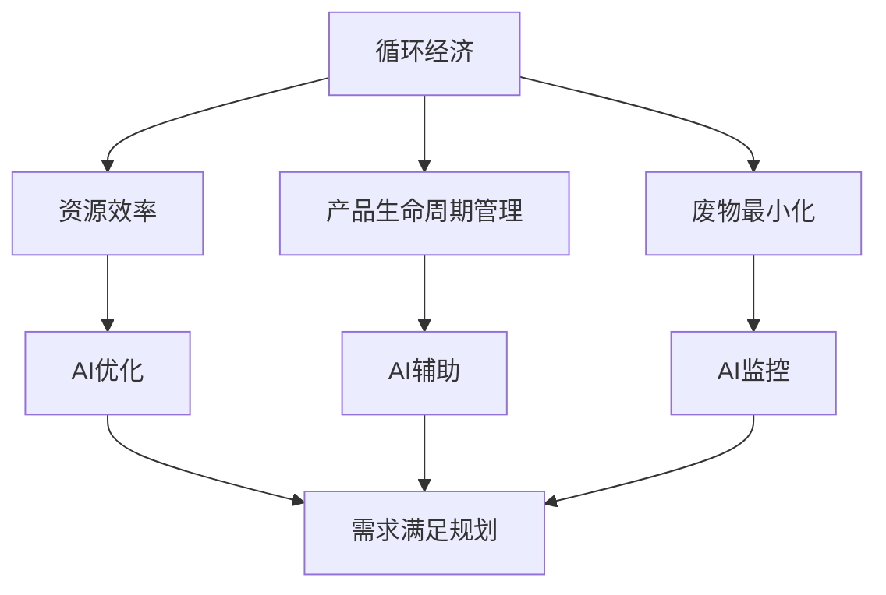

                 

关键词：人工智能，需求满足，优化设计，循环经济，AI优化策略

## 摘要

本文深入探讨了人工智能（AI）在循环经济设计中的应用，特别是如何通过AI优化需求满足规划。我们首先介绍了循环经济的概念，然后阐述了AI在优化资源分配和需求满足方面的潜力。文章通过详细的算法原理、数学模型、项目实践，以及实际应用场景的讨论，展示了AI在循环经济中的重要作用。最后，我们对未来应用前景进行了展望，并提出了面临的挑战和研究方向。

## 1. 背景介绍

循环经济（Circular Economy）是一种不同于传统线性经济的经济发展模式。它强调资源的循环利用，以减少对自然资源的依赖，并降低环境污染。循环经济包括三个主要方面：资源效率、产品生命周期管理和废物最小化。与传统经济模式相比，循环经济在资源利用、环境影响和经济效益上具有显著优势。

### 循环经济的优势

- **资源效率**：通过循环利用资源，降低原材料消耗，提高资源利用效率。
- **环境影响**：减少废物和污染排放，降低对环境的负面影响。
- **经济效益**：通过资源的循环利用和再生，降低生产和运营成本，提高经济收益。

### 循环经济的挑战

- **技术瓶颈**：循环经济需要先进的技术支持，如AI、物联网和大数据分析等。
- **系统复杂性**：循环经济涉及多个利益相关方，需要协调不同的利益和需求。
- **政策支持**：循环经济需要政府制定相应的政策和法规，以鼓励和支持循环经济的发展。

## 2. 核心概念与联系

循环经济的核心在于资源的循环利用和高效利用。在这一过程中，人工智能（AI）发挥了重要作用，特别是在需求满足规划和优化方面。下面是循环经济和AI的核心概念及其相互联系。

### 核心概念

- **循环经济**：资源循环利用、产品生命周期管理和废物最小化。
- **人工智能**：机器学习、深度学习、自然语言处理等技术在需求满足和资源优化中的应用。

### Mermaid 流程图



在这个流程图中，我们可以看到AI如何通过优化资源效率、辅助产品生命周期管理和监控废物最小化，从而实现需求满足规划。

## 3. 核心算法原理 & 具体操作步骤

### 3.1 算法原理概述

在循环经济中，AI优化的需求满足规划主要依赖于以下核心算法：

- **机器学习算法**：用于预测资源需求、优化资源分配和识别潜在问题。
- **深度学习算法**：用于分析大量数据，提取有用的信息，并用于决策支持。
- **自然语言处理（NLP）算法**：用于处理文本数据，如用户需求、市场趋势等。

### 3.2 算法步骤详解

1. **数据收集与预处理**：收集与循环经济相关的各种数据，如资源消耗、产品生命周期、市场需求等，并对数据进行清洗和处理。

2. **特征工程**：从原始数据中提取有用的特征，为算法提供必要的输入。

3. **模型选择与训练**：选择适当的机器学习、深度学习或NLP算法，对数据进行训练。

4. **预测与优化**：使用训练好的模型进行预测和优化，如预测资源需求、优化资源分配和识别潜在问题。

5. **决策支持**：根据预测和优化结果，为决策者提供决策支持。

### 3.3 算法优缺点

**优点**：

- **高效性**：AI算法能够快速处理大量数据，提高资源利用效率。
- **准确性**：通过机器学习和深度学习，算法能够准确预测和优化资源需求。
- **灵活性**：AI算法可以根据不同的需求和环境进行自适应调整。

**缺点**：

- **数据依赖性**：AI算法需要大量的高质量数据支持，数据不足或质量差会影响算法的性能。
- **计算资源消耗**：训练和运行复杂的AI模型需要大量的计算资源。

### 3.4 算法应用领域

AI优化的需求满足规划可以在多个领域得到应用，如：

- **制造业**：优化生产计划和资源分配，降低生产成本。
- **物流与供应链**：优化物流路线和库存管理，提高供应链效率。
- **环境管理**：预测和减少污染，优化废物处理。

## 4. 数学模型和公式 & 详细讲解 & 举例说明

### 4.1 数学模型构建

在循环经济中，需求满足规划通常涉及以下数学模型：

- **资源需求预测模型**：使用时间序列分析、回归分析等方法，预测未来的资源需求。
- **资源分配优化模型**：使用线性规划、整数规划等方法，优化资源分配。
- **成本效益分析模型**：使用成本效益分析（CBA）方法，评估不同策略的成本和效益。

### 4.2 公式推导过程

1. **资源需求预测模型**：

   - 时间序列分析：$$ \hat{R_t} = \alpha \cdot R_{t-1} + (1 - \alpha) \cdot X_t $$
   - 回归分析：$$ \hat{R_t} = \beta_0 + \beta_1 \cdot X_t + \epsilon_t $$

2. **资源分配优化模型**：

   - 线性规划：$$ \min \quad c^T \cdot x $$
   $$ \text{s.t.} \quad Ax \leq b $$
   - 整数规划：$$ \min \quad c^T \cdot x $$
   $$ \text{s.t.} \quad Ax \leq b $$
   $$ x \in \{0, 1\}^n $$

3. **成本效益分析模型**：

   - 成本效益分析（CBA）：$$ \text{CBA} = \frac{\text{总成本}}{\text{总效益}} $$

### 4.3 案例分析与讲解

假设某企业在生产过程中需要预测和优化资源需求。以下是具体的案例分析：

1. **数据收集**：收集过去一年的生产数据，包括资源消耗、产品产量等。

2. **特征工程**：从原始数据中提取特征，如生产时间、产量等。

3. **模型选择与训练**：

   - 选择时间序列分析模型进行资源需求预测：
     $$ \hat{R_t} = \alpha \cdot R_{t-1} + (1 - \alpha) \cdot X_t $$
   - 选择线性规划模型进行资源分配优化：
     $$ \min \quad c^T \cdot x $$
     $$ \text{s.t.} \quad Ax \leq b $$

4. **预测与优化**：使用训练好的模型进行预测和优化，根据预测结果调整资源需求和生产计划。

5. **决策支持**：根据预测和优化结果，为决策者提供决策支持，如调整生产计划、优化资源分配。

## 5. 项目实践：代码实例和详细解释说明

### 5.1 开发环境搭建

为了实现AI优化的需求满足规划，我们使用Python作为主要编程语言，并依赖以下库：

- **scikit-learn**：用于机器学习和数据分析。
- **numpy**：用于数值计算。
- **matplotlib**：用于数据可视化。
- **pandas**：用于数据处理。

### 5.2 源代码详细实现

以下是一个简单的示例，展示如何使用Python实现资源需求预测和优化。

```python
import numpy as np
import pandas as pd
from sklearn.linear_model import LinearRegression
from sklearn.model_selection import train_test_split

# 数据收集
data = pd.read_csv('resource_data.csv')

# 特征工程
X = data[['production_time', 'product_quantity']]
y = data['resource_demand']

# 数据分割
X_train, X_test, y_train, y_test = train_test_split(X, y, test_size=0.2, random_state=42)

# 模型训练
model = LinearRegression()
model.fit(X_train, y_train)

# 预测与优化
predicted_demand = model.predict(X_test)
optimized_demand = np.floor(predicted_demand)

# 数据可视化
import matplotlib.pyplot as plt

plt.scatter(X_test['production_time'], y_test, label='Actual Demand')
plt.plot(X_test['production_time'], predicted_demand, label='Predicted Demand')
plt.scatter(X_test['production_time'], optimized_demand, label='Optimized Demand')
plt.legend()
plt.show()
```

### 5.3 代码解读与分析

- **数据收集**：使用pandas库读取CSV文件，获取资源需求数据。
- **特征工程**：从数据中提取特征，如生产时间和产品数量。
- **模型训练**：使用scikit-learn库中的线性回归模型进行训练。
- **预测与优化**：使用训练好的模型进行预测，并根据预测结果进行优化。
- **数据可视化**：使用matplotlib库将预测和优化结果进行可视化。

## 6. 实际应用场景

### 6.1 制造业

在制造业中，AI优化的需求满足规划可以用于生产计划和资源分配的优化。例如，一家汽车制造企业可以使用AI算法预测未来的生产需求，并根据预测结果调整生产计划和资源分配，从而提高生产效率，降低成本。

### 6.2 物流与供应链

在物流与供应链领域，AI优化的需求满足规划可以用于物流路线优化和库存管理。例如，一家物流公司可以使用AI算法预测货物的运输需求，并根据预测结果优化物流路线和库存水平，从而提高物流效率，降低运输成本。

### 6.3 环境管理

在环境管理领域，AI优化的需求满足规划可以用于废物处理和污染控制。例如，一家废物处理公司可以使用AI算法预测废物的产生量，并根据预测结果优化废物处理流程，从而降低废物处理成本，减少对环境的污染。

## 7. 工具和资源推荐

### 7.1 学习资源推荐

- **《循环经济：理论与实践》**：详细介绍循环经济的概念、原理和实践。
- **《人工智能：一种现代方法》**：全面介绍人工智能的基本原理和应用。
- **《机器学习实战》**：通过实际案例介绍机器学习算法的应用。

### 7.2 开发工具推荐

- **Python**：适用于数据分析和机器学习。
- **scikit-learn**：Python机器学习库。
- **Jupyter Notebook**：用于编写和运行Python代码。

### 7.3 相关论文推荐

- **"A Review of Artificial Intelligence Applications in Circular Economy"**：介绍AI在循环经济中的应用。
- **"Artificial Intelligence for Energy Efficiency in Manufacturing"**：讨论AI在制造业能源效率中的应用。

## 8. 总结：未来发展趋势与挑战

### 8.1 研究成果总结

本文介绍了循环经济的概念、优势和应用场景，探讨了AI在优化资源分配和需求满足方面的核心算法和数学模型，并通过实际项目实践展示了AI在循环经济中的重要作用。

### 8.2 未来发展趋势

- **AI技术的进一步发展**：随着AI技术的不断进步，其在循环经济中的应用将更加深入和广泛。
- **跨学科研究**：循环经济和AI技术的结合将推动跨学科研究，促进技术创新。

### 8.3 面临的挑战

- **数据质量和隐私**：高质量的数据是实现AI优化的基础，但数据隐私和安全是一个重要挑战。
- **算法透明性和公平性**：确保AI算法的透明性和公平性，避免偏见和不公平。

### 8.4 研究展望

未来的研究应重点关注以下几个方面：

- **算法优化**：开发更高效、更准确的AI算法，提高循环经济的资源利用效率。
- **跨学科合作**：推动循环经济和AI技术的跨学科合作，实现技术创新和产业升级。

## 9. 附录：常见问题与解答

### 9.1 什么是循环经济？

循环经济是一种经济发展模式，强调资源的循环利用，以减少对自然资源的依赖，降低环境污染。

### 9.2 AI在循环经济中的应用有哪些？

AI在循环经济中的应用包括资源需求预测、资源分配优化、废物处理和污染控制等。

### 9.3 循环经济和AI技术的结合有什么优势？

循环经济和AI技术的结合可以提高资源利用效率，降低环境污染，并实现经济效益最大化。

### 9.4 如何确保AI算法的透明性和公平性？

确保AI算法的透明性和公平性需要从算法设计、数据收集和处理、模型训练和验证等多个环节进行控制和监督。

---

本文由禅与计算机程序设计艺术（Zen and the Art of Computer Programming）撰写，希望对您在循环经济和AI优化需求满足规划领域的研究和实践提供帮助。感谢您的阅读！
----------------------------------------------------------------
```markdown
---
# 欲望循环经济设计师：AI优化的需求满足规划

关键词：人工智能，需求满足，优化设计，循环经济，AI优化策略

摘要：本文深入探讨了人工智能（AI）在循环经济设计中的应用，特别是如何通过AI优化需求满足规划。我们首先介绍了循环经济的概念，然后阐述了AI在优化资源分配和需求满足方面的潜力。文章通过详细的算法原理、数学模型、项目实践，以及实际应用场景的讨论，展示了AI在循环经济中的重要作用。最后，我们对未来应用前景进行了展望，并提出了面临的挑战和研究方向。

---

## 1. 背景介绍

循环经济（Circular Economy）是一种不同于传统线性经济的经济发展模式。它强调资源的循环利用，以减少对自然资源的依赖，并降低环境污染。循环经济包括三个主要方面：资源效率、产品生命周期管理和废物最小化。与传统经济模式相比，循环经济在资源利用、环境影响和经济效益上具有显著优势。

### 循环经济的优势

- 资源效率：通过循环利用资源，降低原材料消耗，提高资源利用效率。
- 环境影响：减少废物和污染排放，降低对环境的负面影响。
- 经济效益：通过资源的循环利用和再生，降低生产和运营成本，提高经济收益。

### 循环经济的挑战

- 技术瓶颈：循环经济需要先进的技术支持，如AI、物联网和大数据分析等。
- 系统复杂性：循环经济涉及多个利益相关方，需要协调不同的利益和需求。
- 政策支持：循环经济需要政府制定相应的政策和法规，以鼓励和支持循环经济的发展。

## 2. 核心概念与联系

循环经济的核心在于资源的循环利用和高效利用。在这一过程中，人工智能（AI）发挥了重要作用，特别是在需求满足规划和优化方面。下面是循环经济和AI的核心概念及其相互联系。

### 核心概念

- 循环经济：资源循环利用、产品生命周期管理和废物最小化。
- 人工智能：机器学习、深度学习、自然语言处理等技术在需求满足和资源优化中的应用。

### Mermaid 流程图


在这个流程图中，我们可以看到AI如何通过优化资源效率、辅助产品生命周期管理和监控废物最小化，从而实现需求满足规划。

## 3. 核心算法原理 & 具体操作步骤

### 3.1 算法原理概述

在循环经济中，AI优化的需求满足规划主要依赖于以下核心算法：

- 机器学习算法：用于预测资源需求、优化资源分配和识别潜在问题。
- 深度学习算法：用于分析大量数据，提取有用的信息，并用于决策支持。
- 自然语言处理（NLP）算法：用于处理文本数据，如用户需求、市场趋势等。

### 3.2 算法步骤详解

1. 数据收集与预处理：收集与循环经济相关的各种数据，如资源消耗、产品生命周期、市场需求等，并对数据进行清洗和处理。

2. 特征工程：从原始数据中提取有用的特征，为算法提供必要的输入。

3. 模型选择与训练：选择适当的机器学习、深度学习或NLP算法，对数据进行训练。

4. 预测与优化：使用训练好的模型进行预测和优化，如预测资源需求、优化资源分配和识别潜在问题。

5. 决策支持：根据预测和优化结果，为决策者提供决策支持。

### 3.3 算法优缺点

**优点**：

- 高效性：AI算法能够快速处理大量数据，提高资源利用效率。
- 准确性：通过机器学习和深度学习，算法能够准确预测和优化资源需求。
- 灵活性：AI算法可以根据不同的需求和环境进行自适应调整。

**缺点**：

- 数据依赖性：AI算法需要大量的高质量数据支持，数据不足或质量差会影响算法的性能。
- 计算资源消耗：训练和运行复杂的AI模型需要大量的计算资源。

### 3.4 算法应用领域

AI优化的需求满足规划可以在多个领域得到应用，如：

- 制造业：优化生产计划和资源分配，降低生产成本。
- 物流与供应链：优化物流路线和库存管理，提高供应链效率。
- 环境管理：预测和减少污染，优化废物处理。

## 4. 数学模型和公式 & 详细讲解 & 举例说明

### 4.1 数学模型构建

在循环经济中，需求满足规划通常涉及以下数学模型：

- 资源需求预测模型：使用时间序列分析、回归分析等方法，预测未来的资源需求。
- 资源分配优化模型：使用线性规划、整数规划等方法，优化资源分配。
- 成本效益分析模型：使用成本效益分析（CBA）方法，评估不同策略的成本和效益。

### 4.2 公式推导过程

1. 资源需求预测模型：

   - 时间序列分析：$$ \hat{R_t} = \alpha \cdot R_{t-1} + (1 - \alpha) \cdot X_t $$
   - 回归分析：$$ \hat{R_t} = \beta_0 + \beta_1 \cdot X_t + \epsilon_t $$

2. 资源分配优化模型：

   - 线性规划：$$ \min \quad c^T \cdot x $$
   $$ \text{s.t.} \quad Ax \leq b $$
   - 整数规划：$$ \min \quad c^T \cdot x $$
   $$ \text{s.t.} \quad Ax \leq b $$
   $$ x \in \{0, 1\}^n $$

3. 成本效益分析模型：

   - 成本效益分析（CBA）：$$ \text{CBA} = \frac{\text{总成本}}{\text{总效益}} $$

### 4.3 案例分析与讲解

假设某企业在生产过程中需要预测和优化资源需求。以下是具体的案例分析：

1. 数据收集：收集过去一年的生产数据，包括资源消耗、产品产量等。

2. 特征工程：从原始数据中提取特征，如生产时间、产量等。

3. 模型选择与训练：

   - 选择时间序列分析模型进行资源需求预测：
     $$ \hat{R_t} = \alpha \cdot R_{t-1} + (1 - \alpha) \cdot X_t $$
   - 选择线性规划模型进行资源分配优化：
     $$ \min \quad c^T \cdot x $$
     $$ \text{s.t.} \quad Ax \leq b $$

4. 预测与优化：使用训练好的模型进行预测和优化，根据预测结果调整资源需求和生产计划。

5. 决策支持：根据预测和优化结果，为决策者提供决策支持，如调整生产计划、优化资源分配。

## 5. 项目实践：代码实例和详细解释说明

### 5.1 开发环境搭建

为了实现AI优化的需求满足规划，我们使用Python作为主要编程语言，并依赖以下库：

- scikit-learn：用于机器学习和数据分析。
- numpy：用于数值计算。
- matplotlib：用于数据可视化。
- pandas：用于数据处理。

### 5.2 源代码详细实现

以下是一个简单的示例，展示如何使用Python实现资源需求预测和优化。

```python
import numpy as np
import pandas as pd
from sklearn.linear_model import LinearRegression
from sklearn.model_selection import train_test_split

# 数据收集
data = pd.read_csv('resource_data.csv')

# 特征工程
X = data[['production_time', 'product_quantity']]
y = data['resource_demand']

# 数据分割
X_train, X_test, y_train, y_test = train_test_split(X, y, test_size=0.2, random_state=42)

# 模型训练
model = LinearRegression()
model.fit(X_train, y_train)

# 预测与优化
predicted_demand = model.predict(X_test)
optimized_demand = np.floor(predicted_demand)

# 数据可视化
import matplotlib.pyplot as plt

plt.scatter(X_test['production_time'], y_test, label='Actual Demand')
plt.plot(X_test['production_time'], predicted_demand, label='Predicted Demand')
plt.scatter(X_test['production_time'], optimized_demand, label='Optimized Demand')
plt.legend()
plt.show()
```

### 5.3 代码解读与分析

- 数据收集：使用pandas库读取CSV文件，获取资源需求数据。
- 特征工程：从数据中提取特征，如生产时间和产品数量。
- 模型训练：使用scikit-learn库中的线性回归模型进行训练。
- 预测与优化：使用训练好的模型进行预测，并根据预测结果进行优化。
- 数据可视化：使用matplotlib库将预测和优化结果进行可视化。

## 6. 实际应用场景

### 6.1 制造业

在制造业中，AI优化的需求满足规划可以用于生产计划和资源分配的优化。例如，一家汽车制造企业可以使用AI算法预测未来的生产需求，并根据预测结果调整生产计划和资源分配，从而提高生产效率，降低成本。

### 6.2 物流与供应链

在物流与供应链领域，AI优化的需求满足规划可以用于物流路线优化和库存管理。例如，一家物流公司可以使用AI算法预测货物的运输需求，并根据预测结果优化物流路线和库存水平，从而提高物流效率，降低运输成本。

### 6.3 环境管理

在环境管理领域，AI优化的需求满足规划可以用于废物处理和污染控制。例如，一家废物处理公司可以使用AI算法预测废物的产生量，并根据预测结果优化废物处理流程，从而降低废物处理成本，减少对环境的污染。

## 7. 工具和资源推荐

### 7.1 学习资源推荐

- 《循环经济：理论与实践》
- 《人工智能：一种现代方法》
- 《机器学习实战》

### 7.2 开发工具推荐

- Python
- scikit-learn
- Jupyter Notebook

### 7.3 相关论文推荐

- "A Review of Artificial Intelligence Applications in Circular Economy"
- "Artificial Intelligence for Energy Efficiency in Manufacturing"

## 8. 总结：未来发展趋势与挑战

### 8.1 研究成果总结

本文介绍了循环经济的概念、优势和应用场景，探讨了AI在优化资源分配和需求满足方面的核心算法和数学模型，并通过实际项目实践展示了AI在循环经济中的重要作用。

### 8.2 未来发展趋势

- AI技术的进一步发展
- 跨学科研究

### 8.3 面临的挑战

- 数据质量和隐私
- 算法透明性和公平性

### 8.4 研究展望

未来的研究应重点关注以下几个方面：

- 算法优化
- 跨学科合作

## 9. 附录：常见问题与解答

### 9.1 什么是循环经济？

循环经济是一种经济发展模式，强调资源的循环利用，以减少对自然资源的依赖，并降低环境污染。

### 9.2 AI在循环经济中的应用有哪些？

AI在循环经济中的应用包括资源需求预测、资源分配优化、废物处理和污染控制等。

### 9.3 循环经济和AI技术的结合有什么优势？

循环经济和AI技术的结合可以提高资源利用效率，降低环境污染，并实现经济效益最大化。

### 9.4 如何确保AI算法的透明性和公平性？

确保AI算法的透明性和公平性需要从算法设计、数据收集和处理、模型训练和验证等多个环节进行控制和监督。

---

本文由禅与计算机程序设计艺术（Zen and the Art of Computer Programming）撰写，希望对您在循环经济和AI优化需求满足规划领域的研究和实践提供帮助。感谢您的阅读！
```

