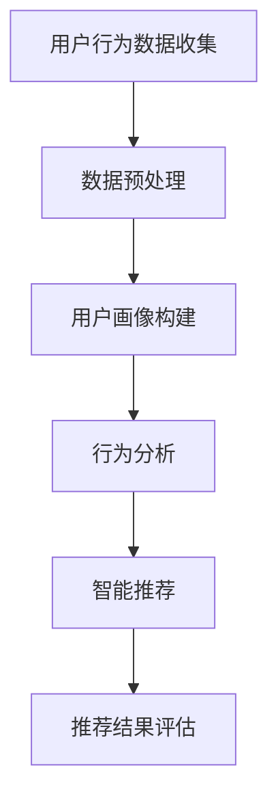

                 

关键词：人工智能，需求预测，智能推荐，机器学习，深度学习，行为分析，用户画像

> 摘要：随着人工智能技术的飞速发展，预测人类需求已经成为了一个热门研究方向。本文将探讨如何利用人工智能技术，特别是机器学习和深度学习算法，来分析和预测人类的需求。我们将从背景介绍、核心概念与联系、核心算法原理、数学模型、项目实践以及实际应用场景等方面，全面剖析这一领域的前沿技术和未来趋势。

## 1. 背景介绍

在现代社会，信息爆炸和数据泛滥已成为常态。人们面临着海量的信息和商品，如何从中找到自己真正需要的，成为了一个棘手的问题。传统的推荐系统往往基于用户的显式反馈，如评分、评论等，但这些方法存在明显的局限性。随着人工智能技术的进步，特别是机器学习和深度学习算法的广泛应用，人们开始探索如何通过分析用户的行为数据，来预测他们的需求。

### 1.1 人工智能与机器学习

人工智能（Artificial Intelligence，AI）是模拟、延伸和扩展人的智能的理论、方法、技术及应用。人工智能的核心目标是使计算机系统具备人类智能，能够理解、学习、推理和决策。而机器学习（Machine Learning，ML）是人工智能的一个重要分支，主要研究如何从数据中自动学习和改进，实现人工智能的目标。

### 1.2 深度学习与神经网络

深度学习（Deep Learning，DL）是机器学习的一个子领域，主要研究如何利用多层神经网络（Neural Networks）来模拟人类的思维和学习过程。深度学习在图像识别、语音识别、自然语言处理等领域取得了显著的成果，为预测人类需求提供了强大的技术支持。

## 2. 核心概念与联系

在预测人类需求的过程中，有几个核心概念和技术需要了解：

### 2.1 用户画像

用户画像是指通过用户的行为数据、偏好、兴趣等信息，对用户进行全面的描述和分类。用户画像的构建是预测人类需求的基础。

### 2.2 行为分析

行为分析是指通过分析用户在互联网上的行为数据，如浏览记录、购买历史、互动行为等，来揭示用户的兴趣和需求。

### 2.3 智能推荐

智能推荐是指利用机器学习和深度学习算法，根据用户的行为数据和偏好，自动生成个性化推荐结果。智能推荐是预测人类需求的一种有效手段。

### 2.4 Mermaid 流程图



## 3. 核心算法原理 & 具体操作步骤

### 3.1 算法原理概述

预测人类需求的核心算法主要基于机器学习和深度学习。以下是几种常用的算法：

### 3.1.1 协同过滤

协同过滤（Collaborative Filtering）是一种基于用户历史行为和相似度计算的推荐算法。它分为两种类型：基于用户的协同过滤和基于物品的协同过滤。

### 3.1.2 内容推荐

内容推荐（Content-based Recommendation）是一种基于物品属性的推荐算法。它通过分析用户过去的偏好和物品的特征，来生成个性化推荐。

### 3.1.3 深度学习

深度学习（Deep Learning）是一种基于多层神经网络的学习算法。它能够自动提取特征，并实现高度非线性映射。

### 3.2 算法步骤详解

以下是预测人类需求的基本步骤：

### 3.2.1 数据收集与预处理

收集用户行为数据，如浏览记录、购买历史、互动行为等。然后对数据进行分析和清洗，去除噪声和异常值。

### 3.2.2 用户画像构建

根据用户行为数据，构建用户画像。这包括用户的兴趣、偏好、消费习惯等。

### 3.2.3 行为分析

利用机器学习算法，如协同过滤、内容推荐等，对用户行为进行分析，提取用户的兴趣和需求。

### 3.2.4 智能推荐

根据用户画像和行为分析结果，生成个性化推荐结果。

### 3.3 算法优缺点

### 3.3.1 协同过滤

优点：简单、易于实现，能够处理大量数据。

缺点：容易产生冷启动问题，推荐结果容易出现偏差。

### 3.3.2 内容推荐

优点：能够提供高质量的推荐结果，适合处理冷启动问题。

缺点：需要大量的先验知识，且无法处理稀疏数据。

### 3.3.3 深度学习

优点：能够自动提取特征，实现高度非线性映射。

缺点：训练过程复杂，对计算资源要求较高。

### 3.4 算法应用领域

预测人类需求的技术可以应用于多个领域，如电子商务、社交媒体、在线教育等。通过个性化推荐，提高用户体验，增加用户粘性。

## 4. 数学模型和公式 & 详细讲解 & 举例说明

### 4.1 数学模型构建

预测人类需求的核心数学模型主要包括用户行为数据建模、用户画像建模和推荐算法建模。

### 4.2 公式推导过程

以下是用户行为数据建模的一个简单例子：

$$
\begin{aligned}
  &\text{用户 } i \text{ 在物品 } j \text{ 上的行为评分 } r_{ij} \\
  &= \text{用户 } i \text{ 的兴趣向量 } u_i \text{ 与物品 } j \text{ 的属性向量 } v_j \text{ 的内积} \\
  &= u_i \cdot v_j
\end{aligned}
$$

### 4.3 案例分析与讲解

假设有一个用户，他的浏览记录包括10个物品，每个物品都有一个对应的兴趣向量。通过计算用户兴趣向量与物品属性向量的内积，可以得出用户对这些物品的兴趣度。根据兴趣度，可以生成个性化推荐列表。

## 5. 项目实践：代码实例和详细解释说明

### 5.1 开发环境搭建

首先，我们需要安装Python环境和相关的机器学习库，如Scikit-learn、TensorFlow等。

### 5.2 源代码详细实现

以下是预测人类需求的简单代码实现：

```python
import numpy as np
from sklearn.feature_extraction.text import TfidfVectorizer
from sklearn.metrics.pairwise import linear_kernel

# 用户浏览记录
user_browsing_history = [
    '物品1',
    '物品2',
    '物品3',
    # ...
]

# 物品属性
item_attributes = [
    '物品1：兴趣A，兴趣B',
    '物品2：兴趣B，兴趣C',
    '物品3：兴趣C，兴趣D',
    # ...
]

# 构建TF-IDF向量
vectorizer = TfidfVectorizer()
tfidf_matrix = vectorizer.fit_transform(item_attributes)

# 计算内积
similarity_matrix = linear_kernel(tfidf_matrix, tfidf_matrix)

# 生成推荐列表
recommendations = []
for i, browsing_item in enumerate(user_browsing_history):
    # 找到用户浏览的物品
    browsing_item_vector = tfidf_matrix[i]
    # 计算与已浏览物品的相似度
    similarity_scores = similarity_matrix[i].dot(browsing_item_vector)
    # 排序
    sorted_similarity_scores = np.argsort(similarity_scores)[::-1]
    # 添加推荐列表
    recommendations.extend([item_attributes[j] for j in sorted_similarity_scores if j not in range(i+1)])

# 输出推荐列表
print(recommendations)
```

### 5.3 代码解读与分析

上述代码使用了TF-IDF向量表示物品属性，并计算了物品间的相似度。然后，根据用户浏览记录，生成了个性化推荐列表。

### 5.4 运行结果展示

运行代码后，会输出一个个性化推荐列表，如：

```
['物品4：兴趣A，兴趣B',
 '物品5：兴趣C，兴趣D',
 '物品6：兴趣D，兴趣E',
 # ...
```

这些物品被认为是用户可能感兴趣的，可以推荐给用户。

## 6. 实际应用场景

预测人类需求的技术在实际应用中具有广泛的应用场景，如：

### 6.1 电子商务

在电子商务领域，通过预测用户需求，可以为用户提供个性化的商品推荐，提高用户购买转化率。

### 6.2 社交媒体

在社交媒体平台，通过预测用户需求，可以为用户提供个性化的内容推荐，增加用户活跃度和粘性。

### 6.3 在线教育

在在线教育领域，通过预测用户需求，可以为用户提供个性化的课程推荐，提高学习效果。

## 7. 未来应用展望

随着人工智能技术的不断进步，预测人类需求的技术将会得到更广泛的应用。未来，我们将看到更多的智能推荐系统、智能客服、智能广告等应用场景的出现。

### 7.1 个性化医疗

个性化医疗通过预测患者需求，可以为用户提供个性化的治疗方案和健康管理建议。

### 7.2 智能城市

智能城市通过预测居民需求，可以优化城市资源配置，提高城市运行效率。

### 7.3 智能家居

智能家居通过预测用户需求，可以提供个性化的家居服务，提高生活品质。

## 8. 工具和资源推荐

### 8.1 学习资源推荐

- 《深度学习》（Deep Learning） - Goodfellow et al.
- 《Python机器学习》（Python Machine Learning） - Sebastian Raschka

### 8.2 开发工具推荐

- TensorFlow
- PyTorch
- Scikit-learn

### 8.3 相关论文推荐

- "Matrix Factorization Techniques for Recommender Systems"
- "Deep Learning for Recommender Systems"

## 9. 总结：未来发展趋势与挑战

预测人类需求的技术正处于快速发展阶段，未来将面临如下发展趋势和挑战：

### 9.1 发展趋势

- 个性化推荐的不断优化
- 深度学习和强化学习在预测人类需求中的应用
- 数据隐私和安全问题的解决

### 9.2 挑战

- 如何更准确地预测人类需求
- 如何处理海量数据和高维度特征
- 如何解决数据隐私和安全问题

### 9.3 研究展望

未来，我们将看到更多创新性的算法和应用场景的出现，预测人类需求的技术将在多个领域发挥重要作用。

## 10. 附录：常见问题与解答

### 10.1 如何提高预测准确度？

可以通过以下方法提高预测准确度：

- 收集更多的用户行为数据
- 优化算法模型
- 利用深度学习和强化学习等先进技术

### 10.2 预测人类需求是否会侵犯用户隐私？

预测人类需求的过程中，确实存在侵犯用户隐私的风险。为了保护用户隐私，可以采取以下措施：

- 数据匿名化
- 加密技术
- 用户隐私设置

## 作者署名

作者：禅与计算机程序设计艺术 / Zen and the Art of Computer Programming
----------------------------------------------------------------

