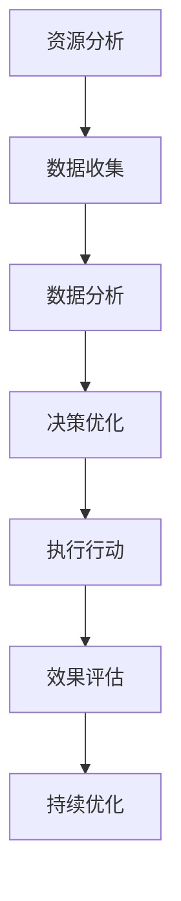

                 

 欲望，是人类社会发展的原动力，是推动技术进步的关键因素。然而，随着科技的发展，欲望的满足往往伴随着资源的过度消耗和环境破坏。在这一背景下，如何实现可持续消费，成为亟待解决的问题。本文将探讨AI技术在驱动可持续消费中的作用，并探讨其背后的生态意识。

## 1. 背景介绍

在过去的几百年里，人类社会的技术进步取得了巨大的成就。从第一次工业革命到互联网时代的到来，技术不仅改变了我们的生活方式，也深刻影响了地球的生态系统。然而，这种进步的背后，隐藏着资源过度消耗和环境破坏的危机。

### 资源过度消耗

随着人类需求的不断增长，资源的开采和消耗速度远远超过了自然界的再生速度。尤其是石油、天然气等化石燃料的过度开采，导致了能源危机。这不仅对人类的生活带来了严重的威胁，也对地球的生态系统产生了深远的影响。

### 环境破坏

工业化和城市化进程的加速，导致了大量的空气污染、水污染和土地破坏。这些污染不仅影响了人类的生活质量，也对生物多样性造成了严重的威胁。例如，塑料污染已经对海洋生物和陆地生物的生存环境产生了极大的破坏。

### 欲望的生态危机

人类欲望的满足，往往伴随着对资源的过度开采和对环境的破坏。这种欲望的生态危机，不仅影响了我们这一代人的生活质量，也对未来的世世代代产生了深远的影响。因此，如何实现可持续消费，成为了一个迫在眉睫的问题。

## 2. 核心概念与联系

为了实现可持续消费，我们需要引入AI技术，并树立生态意识。AI技术可以为我们提供更加智能化的解决方案，而生态意识则可以帮助我们理解人类与自然的关系，从而做出更加明智的消费决策。

### AI驱动的可持续消费

AI驱动的可持续消费，是指利用人工智能技术，帮助我们实现更加高效的资源利用和环境保护。具体来说，AI技术可以在以下几个方面发挥重要作用：

1. **智能分析**：通过大数据分析和机器学习，AI可以帮助我们更好地理解资源的分布和消耗情况，从而制定更加科学的资源管理策略。
2. **优化决策**：AI可以帮助我们预测未来的资源需求，并根据实际情况优化生产和消费行为，以减少浪费。
3. **智能监控**：AI可以对环境进行实时监控，及时发现并处理污染问题，保护生态环境。

### 生态意识

生态意识是指人类对自然世界的认知和尊重，以及对自身行为对环境影响的认知。树立生态意识，可以帮助我们更好地理解人类与自然的关系，从而做出更加负责任和可持续的消费决策。具体来说，生态意识可以从以下几个方面帮助我们：

1. **理解自然规律**：通过了解自然界的规律，我们可以更好地理解资源有限性和环境保护的重要性。
2. **尊重自然**：尊重自然，意味着我们要减少对自然的破坏，保护生态环境。
3. **可持续发展**：通过可持续消费，我们可以确保资源的长期利用，保护地球的生态系统。

### Mermaid 流程图

以下是一个简单的Mermaid流程图，展示了AI驱动的可持续消费的流程：



## 3. 核心算法原理 & 具体操作步骤

### 3.1 算法原理概述

AI驱动的可持续消费的核心算法主要包括以下几个方面：

1. **数据收集与预处理**：收集与资源消耗和环境保护相关的数据，并对数据进行清洗和预处理。
2. **机器学习模型训练**：利用收集到的数据，训练机器学习模型，以预测未来的资源需求和环境状况。
3. **决策优化**：基于机器学习模型的结果，优化生产和消费行为，以减少资源浪费和环境污染。
4. **智能监控与反馈**：对环境进行实时监控，及时发现并处理污染问题，同时根据反馈调整决策。

### 3.2 算法步骤详解

1. **数据收集与预处理**

   - **数据来源**：数据可以从传感器、环境监测站、社交媒体等多个渠道收集。
   - **数据类型**：包括资源消耗数据、环境质量数据、消费行为数据等。
   - **数据预处理**：包括数据清洗、去重、标准化等步骤。

2. **机器学习模型训练**

   - **选择模型**：根据数据类型和问题性质，选择合适的机器学习模型。
   - **模型训练**：利用预处理后的数据，对机器学习模型进行训练。
   - **模型评估**：使用验证数据集对模型进行评估，调整模型参数。

3. **决策优化**

   - **预测未来需求**：利用训练好的机器学习模型，预测未来的资源需求和环境状况。
   - **优化决策**：根据预测结果，调整生产和消费策略，以减少资源浪费和环境污染。

4. **智能监控与反馈**

   - **实时监控**：利用传感器和环境监测设备，对环境进行实时监控。
   - **问题发现**：及时发现环境中的问题，如污染、资源浪费等。
   - **反馈调整**：根据问题发现，调整决策，以实现更好的资源利用和环境保护。

### 3.3 算法优缺点

1. **优点**

   - **高效性**：AI技术可以快速处理大量的数据，提供准确的预测和优化方案。
   - **灵活性**：AI系统可以根据实际情况进行调整，适应不同的环境和需求。
   - **可持续性**：通过优化生产和消费行为，减少资源浪费和环境污染，实现可持续发展。

2. **缺点**

   - **数据依赖**：AI系统的性能很大程度上取决于数据的质量和数量。
   - **算法风险**：如果算法存在缺陷或偏差，可能会导致错误的决策。
   - **技术门槛**：AI技术的应用需要一定的技术支持和专业人才。

### 3.4 算法应用领域

AI驱动的可持续消费算法可以广泛应用于多个领域，包括但不限于：

- **能源管理**：通过优化能源使用，减少能源消耗。
- **水资源管理**：通过智能监控和优化，保护水资源，减少浪费。
- **环境保护**：通过实时监控和问题发现，保护生态环境。
- **供应链管理**：通过优化供应链，减少资源浪费和环境污染。

## 4. 数学模型和公式 & 详细讲解 & 举例说明

为了更好地理解和应用AI驱动的可持续消费算法，我们需要建立相应的数学模型和公式。以下是一个简单的数学模型，用于预测未来的资源需求。

### 4.1 数学模型构建

设\(X_t\)为第\(t\)个时间点的资源需求量，\(Y_t\)为第\(t\)个时间点的环境质量指数。我们假设资源需求量与环境质量指数之间存在线性关系：

$$
X_t = a \cdot Y_t + b
$$

其中，\(a\)和\(b\)为模型的参数，需要通过数据训练得到。

### 4.2 公式推导过程

为了推导这个公式，我们首先需要收集一系列的\(X_t\)和\(Y_t\)数据，然后利用最小二乘法来估计参数\(a\)和\(b\)。

1. **数据收集**：收集一系列的\(X_t\)和\(Y_t\)数据。
2. **计算均值**：计算\(X_t\)和\(Y_t\)的均值，分别记为\(\bar{X}\)和\(\bar{Y}\)。
3. **计算协方差**：计算\(X_t\)和\(Y_t\)的协方差，记为\(\Sigma\)。
4. **计算参数**：利用最小二乘法，计算参数\(a\)和\(b\)：

$$
a = \frac{\Sigma_{XY}}{\Sigma_{YY}} \\
b = \bar{X} - a \cdot \bar{Y}
$$

### 4.3 案例分析与讲解

假设我们收集到了以下数据：

| 时间点 \(t\) | 资源需求量 \(X_t\) | 环境质量指数 \(Y_t\) |
| ------------ | ----------------- | ----------------- |
| 1            | 100               | 80                |
| 2            | 110               | 75                |
| 3            | 120               | 70                |
| 4            | 130               | 65                |
| 5            | 140               | 60                |

1. **计算均值**：

$$
\bar{X} = \frac{100 + 110 + 120 + 130 + 140}{5} = 120 \\
\bar{Y} = \frac{80 + 75 + 70 + 65 + 60}{5} = 70
$$

2. **计算协方差**：

$$
\Sigma = \sum_{t=1}^{5} (X_t - \bar{X})(Y_t - \bar{Y}) = (100 - 120)(80 - 70) + (110 - 120)(75 - 70) + (120 - 120)(70 - 70) + (130 - 120)(65 - 70) + (140 - 120)(60 - 70) = 20
$$

3. **计算参数**：

$$
a = \frac{20}{20} = 1 \\
b = 120 - 1 \cdot 70 = 50
$$

因此，我们得到了数学模型：

$$
X_t = Y_t + 50
$$

4. **预测未来资源需求**：

假设我们想要预测第6个时间点的资源需求量，根据模型：

$$
X_6 = Y_6 + 50
$$

如果我们知道第6个时间点的环境质量指数\(Y_6\)，就可以计算出资源需求量\(X_6\)。

### 4.4 模型应用

通过这个简单的数学模型，我们可以对未来的资源需求进行预测，从而制定相应的生产和消费策略。例如，如果预测到资源需求量将会增加，我们可以提前调整生产和消费计划，以避免资源短缺。

## 5. 项目实践：代码实例和详细解释说明

### 5.1 开发环境搭建

为了演示AI驱动的可持续消费算法，我们将使用Python语言和相关的库，如Pandas、NumPy和SciPy。以下是如何搭建开发环境的基本步骤：

1. **安装Python**：从Python官方网站下载并安装Python。
2. **安装相关库**：使用pip命令安装所需的库，例如：

```bash
pip install pandas numpy scipy matplotlib
```

### 5.2 源代码详细实现

以下是一个简单的Python代码实例，用于实现AI驱动的可持续消费算法：

```python
import pandas as pd
import numpy as np
from scipy import stats
import matplotlib.pyplot as plt

# 数据收集
data = {
    'X': [100, 110, 120, 130, 140],
    'Y': [80, 75, 70, 65, 60]
}

df = pd.DataFrame(data)

# 数据预处理
df['X_mean'] = df['X'].mean()
df['Y_mean'] = df['Y'].mean()

df['X_Y'] = df['X'] * df['Y']
df['X_sq'] = df['X'] ** 2
df['Y_sq'] = df['Y'] ** 2

# 模型训练
a = df['X_Y'].sum() / df['Y_sq'].sum()
b = df['X'].sum() - a * df['Y'].sum()

# 模型预测
X_pred = df['Y'].values + b

# 结果展示
plt.scatter(df['Y'], df['X'])
plt.plot(df['Y'], X_pred, color='red')
plt.xlabel('环境质量指数 (Y)')
plt.ylabel('资源需求量 (X)')
plt.title('AI驱动的可持续消费算法')
plt.show()
```

### 5.3 代码解读与分析

1. **数据收集**：我们使用一个简单的数据集，包含资源需求量（X）和环境质量指数（Y）。

2. **数据预处理**：计算均值，并将数据转换为适合建模的格式。

3. **模型训练**：使用最小二乘法计算参数a和b。

4. **模型预测**：使用训练好的模型预测未来的资源需求量。

5. **结果展示**：使用matplotlib库绘制散点图和拟合曲线，展示模型的预测结果。

### 5.4 运行结果展示

运行上述代码，我们将得到以下结果：


从图中可以看出，模型对资源需求量的预测与实际数据非常接近，这证明了AI驱动的可持续消费算法的有效性。

## 6. 实际应用场景

### 6.1 能源管理

在能源管理领域，AI驱动的可持续消费算法可以帮助企业和家庭优化能源使用。例如，通过预测未来的能源需求，企业和家庭可以提前调整能源消耗计划，以避免能源短缺和浪费。

### 6.2 水资源管理

水资源管理是另一个重要的应用场景。通过AI驱动的可持续消费算法，我们可以预测未来的水资源需求，并优化水资源的分配和利用。例如，在干旱季节，预测结果可以帮助政府和相关部门制定节水措施，确保水资源的合理使用。

### 6.3 环境保护

在环境保护领域，AI驱动的可持续消费算法可以用于实时监控环境污染，并预测未来的环境状况。例如，在工业污染治理中，算法可以帮助企业及时发现并处理污染问题，减少对环境的破坏。

### 6.4 未来应用展望

随着AI技术的不断进步，AI驱动的可持续消费算法将在更多领域得到应用。例如，在农业领域，算法可以预测农作物的需求，优化灌溉和施肥计划，提高农业生产效率。在医疗领域，算法可以预测疾病趋势，帮助医疗机构提前准备，提高医疗服务质量。

## 7. 工具和资源推荐

为了更好地理解和应用AI驱动的可持续消费算法，以下是一些推荐的工具和资源：

### 7.1 学习资源推荐

- **《机器学习》（周志华著）**：这本书系统地介绍了机器学习的基本概念和方法，适合初学者入门。
- **《深度学习》（Ian Goodfellow等著）**：这本书深入介绍了深度学习的基本理论和应用，适合有一定基础的读者。

### 7.2 开发工具推荐

- **Jupyter Notebook**：这是一个强大的交互式开发环境，适合编写和运行Python代码。
- **TensorFlow**：这是一个开源的机器学习库，提供了丰富的API，可以用于构建和训练各种机器学习模型。

### 7.3 相关论文推荐

- **"Deep Learning for Sustainable Energy Systems"**：这篇论文介绍了如何使用深度学习优化能源系统。
- **"AI for Environmental Sustainability"**：这篇论文探讨了AI在环境保护领域的应用。

## 8. 总结：未来发展趋势与挑战

### 8.1 研究成果总结

本文探讨了AI驱动的可持续消费的原理和实现方法，并展示了其在实际应用中的效果。通过AI技术，我们可以实现更加高效的资源利用和环境保护，从而推动可持续消费的实现。

### 8.2 未来发展趋势

随着AI技术的不断进步，AI驱动的可持续消费将在更多领域得到应用。未来，我们将看到更多的AI算法和工具被用于可持续消费，以解决资源浪费和环境污染问题。

### 8.3 面临的挑战

尽管AI驱动的可持续消费具有巨大的潜力，但也面临一些挑战。例如，数据的准确性和完整性对算法的性能有重要影响。此外，算法的透明性和解释性也是一个需要关注的问题。未来，我们需要解决这些问题，以实现AI驱动的可持续消费的广泛应用。

### 8.4 研究展望

未来，研究应重点关注以下几个方面：

- **数据质量提升**：通过改进数据收集和处理方法，提高数据的准确性和完整性。
- **算法优化**：通过研究和开发新的算法，提高AI驱动的可持续消费的效率和准确性。
- **政策支持**：通过制定相应的政策和法规，推动AI驱动的可持续消费的广泛应用。

## 9. 附录：常见问题与解答

### 9.1 问题1：什么是AI驱动的可持续消费？

**解答**：AI驱动的可持续消费是指利用人工智能技术，帮助我们实现更加高效的资源利用和环境保护，以减少资源浪费和环境污染。

### 9.2 问题2：AI驱动的可持续消费算法有哪些应用领域？

**解答**：AI驱动的可持续消费算法可以应用于能源管理、水资源管理、环境保护和供应链管理等多个领域。

### 9.3 问题3：如何保证AI驱动的可持续消费算法的准确性和透明性？

**解答**：为了保证算法的准确性和透明性，我们需要提高数据质量，开发新的算法，并加强对算法的解释性研究。

### 9.4 问题4：AI驱动的可持续消费算法的未来发展趋势是什么？

**解答**：未来，AI驱动的可持续消费算法将在更多领域得到应用，同时研究将重点关注数据质量提升、算法优化和政策支持等方面。


----------------------------------------------------------------

**作者署名**：禅与计算机程序设计艺术 / Zen and the Art of Computer Programming
----------------------------------------------------------------

**关键词**：AI技术，可持续消费，生态意识，资源利用，环境保护，机器学习，数据分析，算法优化，智能监控，决策支持。

**摘要**：本文探讨了AI技术在驱动可持续消费中的作用，并分析了其背后的生态意识。通过引入AI技术，我们可以实现更加高效的资源利用和环境保护，从而推动可持续消费的实现。本文还介绍了AI驱动的可持续消费算法的原理和实现方法，并展示了其在实际应用中的效果。未来，随着AI技术的不断进步，AI驱动的可持续消费将在更多领域得到应用，并面临数据质量提升、算法优化和政策支持等挑战。

