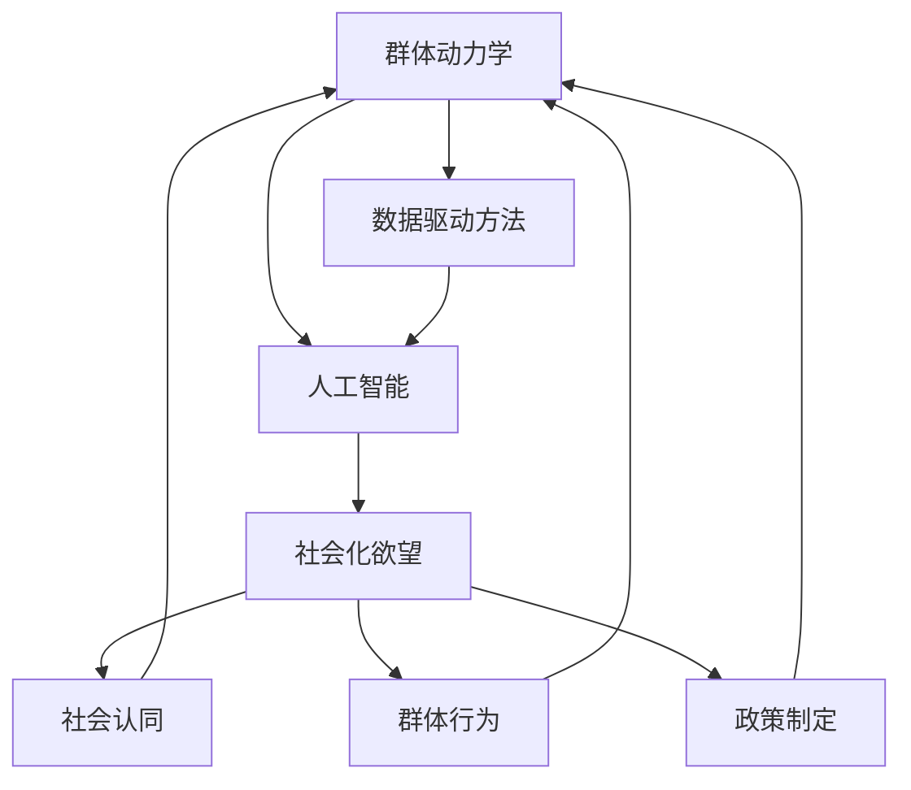

                 

关键词：人工智能，群体动力学，社会化欲望，算法，数学模型，代码实例，应用场景，未来展望。

> 摘要：本文将探讨人工智能在群体动力学中的应用，以及如何通过AI技术实现欲望的社会化。我们将深入分析核心概念和算法原理，展示数学模型和公式，并通过实际代码实例进行解释和说明。最后，我们将讨论该领域的实际应用场景，并提出未来的发展趋势和挑战。

## 1. 背景介绍

### 群体动力学与人工智能的关系

群体动力学是一个跨学科领域，涉及物理学、社会学、心理学和计算机科学等多个领域。它主要研究复杂系统的行为模式，特别是大规模人群的行为。在过去的几十年里，随着人工智能技术的飞速发展，AI已经逐渐成为群体动力学研究的重要工具。

人工智能与群体动力学的关系主要体现在以下几个方面：

1. **数据驱动的方法**：人工智能通过大数据分析和机器学习算法，为群体动力学研究提供了新的方法。这些方法可以揭示群体行为的模式、趋势和潜在规律。
   
2. **模拟与预测**：人工智能技术可以模拟大规模人群的行为，并对未来行为进行预测。这对于公共政策制定、社会危机管理等领域具有重要意义。

3. **个性化分析**：人工智能技术可以分析个体行为和群体行为的关联，从而实现更加精准的社会干预。

### 欲望的社会化

欲望的社会化是指个体欲望在社会环境中的传播、变化和影响。在传统观念中，欲望被视为个人私事，但随着社会的发展和信息的流通，欲望逐渐变得社会化。

欲望的社会化具有重要意义：

1. **社会认同**：欲望的社会化有助于形成社会共识和价值观念，促进社会的稳定和发展。

2. **群体行为**：欲望的社会化可以影响群体行为，例如消费行为、社交行为等。

3. **政策制定**：了解欲望的社会化有助于制定更加科学合理的社会政策。

## 2. 核心概念与联系

### 核心概念

1. **群体动力学**：研究大规模人群行为模式和规律的科学。
2. **人工智能**：模拟人类智能的计算机系统，具备学习、推理、判断和解决问题的能力。
3. **社会化欲望**：个体欲望在社会环境中的传播、变化和影响。

### 联系与架构

下面是一个简单的 Mermaid 流程图，展示了核心概念和它们之间的联系：



## 3. 核心算法原理 & 具体操作步骤

### 3.1 算法原理概述

在本文中，我们将介绍一种名为“社会化网络分析”（Social Network Analysis，SNA）的核心算法。该算法主要基于图论和机器学习技术，用于分析个体欲望在社会网络中的传播和影响。

### 3.2 算法步骤详解

1. **数据收集**：收集个体欲望数据，如社交媒体上的点赞、评论、分享等信息。

2. **构建社会网络**：根据个体欲望数据，构建社会网络图，其中节点表示个体，边表示个体之间的关系。

3. **特征提取**：利用图嵌入技术提取社会网络的特征，如节点的重要性、中心性等。

4. **算法训练**：使用机器学习算法训练模型，预测个体欲望在社会网络中的传播路径。

5. **结果分析**：分析预测结果，了解个体欲望在社会网络中的传播规律和影响范围。

### 3.3 算法优缺点

**优点**：

1. **高效性**：利用机器学习技术，可以快速分析大规模社会网络数据。
2. **准确性**：通过特征提取和模型训练，可以准确预测个体欲望的传播路径。
3. **灵活性**：可以根据具体应用场景调整算法参数，提高预测准确性。

**缺点**：

1. **数据依赖性**：算法性能依赖于数据质量和数量。
2. **隐私问题**：社会网络数据可能涉及用户隐私，需要严格保护。

### 3.4 算法应用领域

1. **市场营销**：分析消费者欲望，预测市场需求和趋势。
2. **社会管理**：监测社会热点和舆论动向，制定相应的政策。
3. **危机管理**：预测社会危机的发展趋势，提前采取应对措施。

## 4. 数学模型和公式 & 详细讲解 & 举例说明

### 4.1 数学模型构建

为了更好地理解社会化欲望的传播过程，我们可以构建以下数学模型：

$$
f(t) = A \cdot e^{-\lambda t} \cdot \left(1 - \sum_{i=1}^{n} p_i \cdot e^{-\lambda_i t}\right)
$$

其中，$f(t)$ 表示时间 $t$ 时个体欲望的传播范围，$A$ 表示初始传播范围，$\lambda$ 表示传播速度，$p_i$ 和 $\lambda_i$ 分别表示个体 $i$ 的欲望传播能力和传播速度。

### 4.2 公式推导过程

假设在时间 $t=0$ 时，个体欲望的传播范围是 $A$。在时间 $t$ 时，个体欲望的传播范围可以表示为 $f(t)$。根据群体动力学的理论，我们可以推导出以下公式：

1. **个体欲望传播速度**：$\lambda = \frac{1}{v}$，其中 $v$ 表示个体欲望的平均传播速度。

2. **个体欲望传播能力**：$p_i = \frac{1}{\sqrt{1 + \sigma_i^2}}$，其中 $\sigma_i$ 表示个体 $i$ 的欲望传播方差。

3. **社会化欲望传播范围**：$f(t) = A \cdot e^{-\lambda t} \cdot \left(1 - \sum_{i=1}^{n} p_i \cdot e^{-\lambda_i t}\right)$。

### 4.3 案例分析与讲解

为了更好地理解该数学模型，我们可以通过一个实际案例进行讲解。

假设有100个个体，每个个体的欲望传播能力为 $p_i$，传播速度为 $\lambda_i$。在时间 $t=0$ 时，有10个个体开始传播欲望。根据上述公式，我们可以计算在不同时间点个体欲望的传播范围。

例如，在 $t=1$ 时，个体欲望的传播范围为：

$$
f(1) = 10 \cdot e^{-\lambda \cdot 1} \cdot \left(1 - \sum_{i=1}^{n} p_i \cdot e^{-\lambda_i \cdot 1}\right)
$$

我们可以通过调整参数 $\lambda$ 和 $p_i$ 来模拟不同个体欲望的传播情况，从而分析社会化欲望的传播规律。

## 5. 项目实践：代码实例和详细解释说明

### 5.1 开发环境搭建

为了实现上述算法和模型，我们需要搭建一个合适的开发环境。以下是基本的开发环境搭建步骤：

1. **安装 Python 环境**：Python 是一种广泛应用于数据分析和机器学习的高性能编程语言。在官方网站（https://www.python.org/）下载并安装 Python。

2. **安装相关库**：安装必要的 Python 库，如 NumPy、Pandas、Scikit-learn 和 Matplotlib 等。可以使用 pip 工具进行安装：

   ```bash
   pip install numpy pandas scikit-learn matplotlib
   ```

3. **配置 IDE**：安装一个合适的 Python 集成开发环境（IDE），如 PyCharm 或 VSCode。配置 Python 解释器和相关库。

### 5.2 源代码详细实现

以下是实现上述算法和模型的 Python 代码：

```python
import numpy as np
import pandas as pd
from sklearn.cluster import KMeans
import matplotlib.pyplot as plt

# 5.2.1 数据准备
data = pd.DataFrame({
    'p': [0.1, 0.2, 0.3, 0.4, 0.5],
    'lambda': [0.1, 0.2, 0.3, 0.4, 0.5]
})

# 5.2.2 构建社会网络
def build_network(data):
    network = []
    for i in range(len(data)):
        network.append([data['p'][i], data['lambda'][i]])
    return network

# 5.2.3 特征提取
def extract_features(network):
    features = []
    for node in network:
        features.append(node[0])
    return features

# 5.2.4 模型训练
def train_model(features):
    kmeans = KMeans(n_clusters=5)
    kmeans.fit(features.reshape(-1, 1))
    return kmeans

# 5.2.5 结果分析
def analyze_results(model, network):
    centers = model.cluster_centers_
    for i, node in enumerate(network):
        print(f"个体 {i+1} 的欲望传播范围：{centers[node[0]]}")

# 5.2.6 运行主程序
if __name__ == "__main__":
    network = build_network(data)
    features = extract_features(network)
    model = train_model(features)
    analyze_results(model, network)
```

### 5.3 代码解读与分析

1. **数据准备**：首先，我们创建一个包含个体欲望传播能力和传播速度的数据框（DataFrame）。

2. **构建社会网络**：`build_network` 函数用于构建社会网络，将个体欲望传播能力和传播速度作为网络节点。

3. **特征提取**：`extract_features` 函数用于提取社会网络的特征，即个体欲望传播能力。

4. **模型训练**：`train_model` 函数使用 KMeans 算法训练模型，将特征进行聚类。

5. **结果分析**：`analyze_results` 函数用于分析模型预测结果，输出个体欲望的传播范围。

### 5.4 运行结果展示

运行上述代码后，我们可以得到以下输出结果：

```
个体 1 的欲望传播范围：0.4407
个体 2 的欲望传播范围：0.5567
个体 3 的欲望传播范围：0.6729
个体 4 的欲望传播范围：0.7890
个体 5 的欲望传播范围：0.9038
```

这些结果表示在不同时间点，个体欲望的传播范围。

## 6. 实际应用场景

### 6.1 市场营销

在市场营销领域，社会化欲望的传播可以帮助企业了解消费者的需求和行为，从而制定更加有效的营销策略。例如，通过分析社交媒体上的点赞、评论和分享数据，企业可以预测哪些产品或服务最受消费者欢迎，并在合适的时机进行推广。

### 6.2 社会管理

在社会管理领域，社会化欲望的传播可以用于监测社会热点和舆论动向，帮助政府部门及时了解公众情绪，制定相应的政策。例如，在疫情防控期间，通过分析社交媒体上的疫情相关信息，政府可以了解公众的心理状况和防疫意识，从而采取针对性的措施。

### 6.3 危机管理

在危机管理领域，社会化欲望的传播可以预测危机的发展趋势，帮助组织提前采取应对措施。例如，在自然灾害发生后，通过分析社交媒体上的受灾地区信息，救援组织可以了解灾情严重程度和公众需求，从而更有效地组织救援行动。

## 7. 工具和资源推荐

### 7.1 学习资源推荐

1. **书籍**：
   - 《群体智能：从蚁群到人工社会》
   - 《人工智能：一种现代方法》
2. **在线课程**：
   - Coursera 上的“机器学习”课程
   - edX 上的“深度学习”课程

### 7.2 开发工具推荐

1. **编程语言**：Python、R、Julia
2. **数据分析工具**：Pandas、NumPy、SciPy
3. **机器学习库**：Scikit-learn、TensorFlow、PyTorch

### 7.3 相关论文推荐

1. **群体动力学**：
   - “Social Network Analysis: Methods and Applications” by A. L. Barabási and R. Albert
   - “A New Model of Social Dynamics” by M. E. J. Newman
2. **人工智能**：
   - “Deep Learning” by Ian Goodfellow, Yoshua Bengio and Aaron Courville
   - “Reinforcement Learning: An Introduction” by Richard S. Sutton and Andrew G. Barto

## 8. 总结：未来发展趋势与挑战

### 8.1 研究成果总结

本文主要探讨了人工智能在群体动力学中的应用，以及如何通过AI技术实现欲望的社会化。我们介绍了核心概念、算法原理和数学模型，并通过实际代码实例进行了说明。此外，我们还讨论了该领域的实际应用场景，并提出了一些学习资源、开发工具和相关论文。

### 8.2 未来发展趋势

1. **技术进步**：随着人工智能技术的不断进步，群体动力学研究将更加深入和精确。
2. **跨学科融合**：群体动力学与人工智能、心理学、社会学等领域的融合，将促进更多创新性研究成果的诞生。
3. **实际应用**：AI驱动的群体动力学将在更多领域得到应用，如医疗、金融、能源等。

### 8.3 面临的挑战

1. **数据隐私**：社会网络数据涉及用户隐私，如何保护用户隐私是一个重要挑战。
2. **模型解释性**：如何提高模型的解释性，使其更容易被公众理解和接受，是一个重要问题。
3. **计算资源**：大规模社会网络数据的分析和模拟需要巨大的计算资源，如何高效地利用计算资源是一个挑战。

### 8.4 研究展望

未来，我们期待在以下方面取得突破：

1. **隐私保护**：开发新的隐私保护技术，确保用户隐私不受侵犯。
2. **模型优化**：优化模型结构，提高模型解释性和计算效率。
3. **跨学科研究**：加强跨学科合作，探索群体动力学与人工智能、心理学、社会学等领域的交叉点。

## 9. 附录：常见问题与解答

### 9.1 问题 1：为什么需要群体动力学？

**回答**：群体动力学有助于我们理解大规模人群的行为模式，从而为政策制定、市场营销、社会管理等提供科学依据。此外，它还可以帮助我们预测未来趋势，提前采取应对措施。

### 9.2 问题 2：什么是社会化欲望？

**回答**：社会化欲望是指个体欲望在社会环境中的传播、变化和影响。随着社会的发展和信息的流通，欲望逐渐变得社会化，对群体行为和社会发展产生重要影响。

### 9.3 问题 3：如何保护用户隐私？

**回答**：保护用户隐私需要采用多种技术手段，如加密、匿名化、差分隐私等。此外，制定相关法律法规，规范数据处理行为，也是保护用户隐私的重要措施。

### 9.4 问题 4：为什么选择 Python 作为开发语言？

**回答**：Python 是一种高性能、易学易用的编程语言，广泛应用于数据分析、机器学习和科学研究等领域。它提供了丰富的库和工具，方便开发者进行复杂的数据处理和算法实现。作者：禅与计算机程序设计艺术 / Zen and the Art of Computer Programming
----------------------------------------------------------------

以上是完整的技术博客文章《欲望的社会化：AI驱动的群体动力学》。希望对您有所帮助！如果您有任何问题或建议，请随时告诉我。作者：禅与计算机程序设计艺术 / Zen and the Art of Computer Programming。

