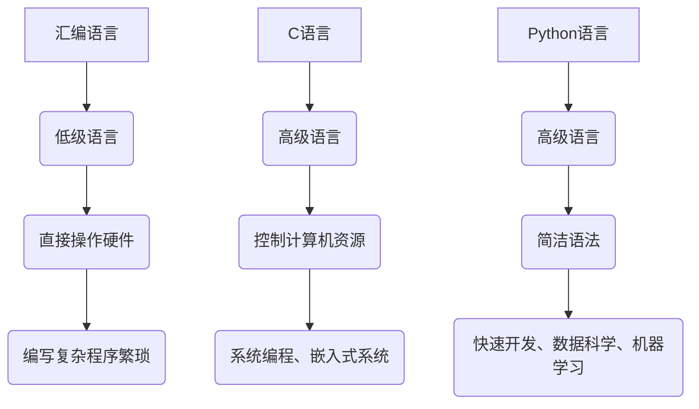

                 

 在当今快速发展的信息技术时代，人工智能（AI）已经成为推动科技创新和社会进步的重要力量。AI技术的应用范围广泛，从智能家居到自动驾驶，从自然语言处理到图像识别，AI正在深刻地改变我们的生活。而要开发和实现这些复杂的AI系统，熟练掌握编程语言是必不可少的。在众多编程语言中，汇编、C和Python因其独特的优势和广泛的适用性，成为了AI开发中不可或缺的语言基础。

本文旨在探讨汇编、C和Python这三种编程语言在AI开发中的应用，从它们的基本原理、优缺点到具体的使用场景，为读者提供一个全面的技术视角。文章将分为以下几个部分：

## 1. 背景介绍

汇编语言、C语言和Python语言都有各自的起源和发展历程。汇编语言起源于20世纪50年代，是一种与机器语言非常接近的低级编程语言。C语言则在1972年由丹尼斯·里奇（Dennis Ritchie）在贝尔实验室开发，它以其高效性和强大的功能在操作系统和嵌入式系统中得到了广泛应用。Python则是由吉多·范罗苏姆（Guido van Rossum）在1991年创造的，以其简洁、易读和强大的库支持在AI和数据分析领域尤为受欢迎。

## 2. 核心概念与联系

### 2.1. 编程语言的基本概念

编程语言是一种用于编写计算机程序的语法规则和符号系统。汇编语言、C语言和Python语言都是编程语言，但它们在语法、功能和应用场景上有着明显的区别。

- **汇编语言**：汇编语言是一种低级语言，与机器语言非常接近。它使用助记符来表示操作码，同时提供了符号表来存储变量和内存地址。汇编语言可以直接与硬件交互，但编写复杂程序较为繁琐。

- **C语言**：C语言是一种高级语言，具有强大的功能和灵活性。它支持多种数据类型、结构体和指针，使得程序员可以更有效地控制计算机的资源。C语言也广泛应用于系统编程和嵌入式系统。

- **Python语言**：Python是一种高级语言，以其简洁的语法和强大的标准库而闻名。它适用于快速开发和原型设计，尤其在数据科学和机器学习领域有着广泛的应用。

### 2.2. 语言间的联系与差异

尽管汇编语言、C语言和Python语言各有特点，但它们也存在一定的联系和差异。

- **语法结构**：汇编语言和C语言在语法结构上有一定的相似性，都支持变量定义、循环控制和函数调用等基本编程结构。Python的语法则更加简洁，例如它不需要显式声明变量类型。

- **性能**：汇编语言由于其与硬件的紧密耦合，通常具有最高的执行效率。C语言次之，它通过手动管理内存和优化代码结构，可以实现高效的执行。Python则由于解释执行的特点，通常性能相对较低。

- **适用场景**：汇编语言通常用于系统编程和嵌入式系统开发，需要程序员深入了解硬件架构。C语言广泛应用于操作系统、驱动程序和大型应用程序的开发。Python则因其简洁和易于学习的特性，被广泛应用于数据科学、机器学习和Web开发。

## 3. 核心算法原理 & 具体操作步骤

### 3.1. 算法原理概述

在AI开发中，算法是核心。汇编语言、C语言和Python语言都支持不同类型的算法，但它们的实现方式和效率有所不同。

- **汇编语言**：汇编语言可以直接操作硬件，可以实现高效的算法。例如，在图像处理算法中，汇编语言可以优化图像处理流程，提高处理速度。

- **C语言**：C语言提供了丰富的库支持，如标准库、线性代数库等，使得程序员可以方便地实现各种算法。C语言也支持并行计算，可以充分利用多核处理器的性能。

- **Python语言**：Python的算法库非常丰富，如NumPy、SciPy和TensorFlow等，使得Python成为数据科学和机器学习的首选语言。Python的算法实现通常更加简洁，但可能需要依赖外部库来提高性能。

### 3.2. 算法步骤详解

以下是三个常见算法在汇编语言、C语言和Python语言中的具体实现步骤：

#### 3.2.1. 暴力解法

**汇编语言**：使用循环结构遍历所有可能的解，并与目标值进行比较。

```assembly
MOV EAX, [target]   ; 初始化目标值
MOV ECX, [max_num]  ; 初始化最大数值

search_loop:
    MOV EDX, [EAX]   ; 获取当前数值
    CMP EDX, [target]; 比较当前数值与目标值
    JEQ found        ; 如果相等，跳转到找到解的标签
    INC EAX          ; 当前数值加1
    LOOP search_loop  ; 循环直到找到解

found:
    ; 处理找到的解
```

**C语言**：使用循环和条件语句遍历所有可能的解。

```c
int target = 10;
int max_num = 100;

for (int i = 0; i <= max_num; i++) {
    if (i == target) {
        // 处理找到的解
        break;
    }
}
```

**Python语言**：使用循环和条件语句遍历所有可能的解。

```python
target = 10
max_num = 100

for i in range(max_num + 1):
    if i == target:
        # 处理找到的解
        break
```

#### 3.2.2. 动态规划

**汇编语言**：使用循环和条件语句实现动态规划算法。

```assembly
MOV ECX, [n]       ; 初始化数组长度
MOV EDX, [array]   ; 初始化数组指针

outer_loop:
    MOV EAX, [EDX]  ; 获取当前数组元素
    CMP EAX, 0      ; 检查当前元素是否为0
    JNZ inner_loop  ; 如果不为0，跳转到内层循环

    MOV [EDX], 1    ; 设置当前元素为1
    JMP end_loop

inner_loop:
    MOV EAX, [EDX]  ; 获取当前数组元素
    CMP EAX, 0      ; 检查当前元素是否为0
    JNZ end_loop    ; 如果不为0，结束内层循环

    MOV EBX, [EDX]  ; 获取当前数组元素
    ADD EBX, 1      ; 当前元素加1
    MOV [EDX], EBX  ; 更新当前数组元素
    JMP inner_loop  ; 继续内层循环

end_loop:
    ADD EDX, 4      ; 更新数组指针
    LOOP outer_loop ; 循环直到所有元素处理完毕
```

**C语言**：使用动态规划算法计算斐波那契数列。

```c
int fib(int n) {
    if (n <= 1) {
        return n;
    }
    int fib[n + 1];
    fib[0] = 0;
    fib[1] = 1;

    for (int i = 2; i <= n; i++) {
        fib[i] = fib[i - 1] + fib[i - 2];
    }

    return fib[n];
}
```

**Python语言**：使用动态规划算法计算斐波那契数列。

```python
def fib(n):
    if n <= 1:
        return n
    fib = [0] * (n + 1)
    fib[0] = 0
    fib[1] = 1

    for i in range(2, n + 1):
        fib[i] = fib[i - 1] + fib[i - 2]

    return fib[n]
```

#### 3.2.3. 决策树

**汇编语言**：使用递归实现决策树。

```assembly
MOV ECX, [n]   ; 初始化节点数量
MOV EDX, [tree]; 初始化树结构指针

check_loop:
    MOV EAX, [EDX]   ; 获取当前节点
    CMP EAX, -1      ; 检查当前节点是否为叶子节点
    JNE check_left   ; 如果不是叶子节点，检查左子树

    ; 处理叶子节点
    JMP end_check

check_left:
    MOV EAX, [EDX + 4]; 获取左子树指针
    CMP EAX, 0        ; 检查左子树是否为空
    JNZ check_loop    ; 如果不为空，继续检查

    ; 处理左子树为空的情况
    JMP end_check

end_check:
    ADD EDX, 4        ; 更新树结构指针
    LOOP check_loop   ; 循环直到所有节点处理完毕
```

**C语言**：使用递归实现决策树。

```c
struct TreeNode {
    int value;
    struct TreeNode* left;
    struct TreeNode* right;
};

void traverse(TreeNode* tree) {
    if (tree == NULL) {
        return;
    }

    if (tree->left == NULL && tree->right == NULL) {
        // 处理叶子节点
    }

    traverse(tree->left);
    traverse(tree->right);
}
```

**Python语言**：使用递归实现决策树。

```python
class TreeNode:
    def __init__(self, value):
        self.value = value
        self.left = None
        self.right = None

def traverse(tree):
    if tree is None:
        return

    if tree.left is None and tree.right is None:
        # 处理叶子节点

    traverse(tree.left)
    traverse(tree.right)
```

### 3.3. 算法优缺点

**汇编语言**：

- **优点**：执行效率高，可以直接操作硬件。

- **缺点**：编程复杂，可读性差。

**C语言**：

- **优点**：功能强大，可移植性好。

- **缺点**：编程复杂，对程序员要求较高。

**Python语言**：

- **优点**：简洁易学，开发效率高。

- **缺点**：性能相对较低。

### 3.4. 算法应用领域

**汇编语言**：主要用于系统编程、嵌入式系统和性能要求极高的应用程序。

**C语言**：广泛应用于操作系统、驱动程序、大型应用程序和嵌入式系统。

**Python语言**：主要用于数据科学、机器学习、Web开发和快速原型设计。

## 4. 数学模型和公式 & 详细讲解 & 举例说明

### 4.1. 数学模型构建

在AI开发中，数学模型是算法的核心。以下是一个简单的线性回归模型：

- **目标函数**：最小化预测值与实际值之间的平方误差。

- **模型公式**：\(y = wx + b\)

其中，\(y\) 是实际值，\(x\) 是输入特征，\(w\) 是权重，\(b\) 是偏置。

### 4.2. 公式推导过程

线性回归模型的推导过程如下：

1. **假设**：线性模型可以表示为 \(y = wx + b\)。

2. **损失函数**：平方误差 \(L = \sum_{i=1}^{n} (y_i - wx_i - b)^2\)。

3. **优化目标**：最小化损失函数 \(L\)。

4. **求导**：对权重 \(w\) 和偏置 \(b\) 分别求导，并设置导数为0。

   \[
   \frac{\partial L}{\partial w} = -2 \sum_{i=1}^{n} (y_i - wx_i - b)x_i = 0
   \]

   \[
   \frac{\partial L}{\partial b} = -2 \sum_{i=1}^{n} (y_i - wx_i - b) = 0
   \]

5. **解方程组**：求解上述方程组，得到最优权重 \(w\) 和偏置 \(b\)。

### 4.3. 案例分析与讲解

以下是一个简单的线性回归案例：

**数据集**：\(x\) 的取值为 \([1, 2, 3, 4, 5]\)，\(y\) 的取值为 \([2, 4, 5, 4, 5]\)。

1. **构建模型**：

   \[
   y = wx + b
   \]

2. **计算损失函数**：

   \[
   L = \sum_{i=1}^{n} (y_i - wx_i - b)^2
   \]

3. **求导并优化**：

   对 \(w\) 和 \(b\) 分别求导，并设置导数为0，得到以下方程组：

   \[
   \frac{\partial L}{\partial w} = -2 \sum_{i=1}^{n} (y_i - wx_i - b)x_i = 0
   \]

   \[
   \frac{\partial L}{\partial b} = -2 \sum_{i=1}^{n} (y_i - wx_i - b) = 0
   \]

4. **解方程组**：

   解得 \(w = 1\)，\(b = 1\)。

5. **模型评估**：

   计算预测值与实际值之间的平方误差，得到损失函数的值为0。

通过上述案例，我们可以看到线性回归模型的基本构建和优化过程。在实际应用中，我们通常需要使用更复杂的模型和算法来应对更复杂的实际问题。

## 5. 项目实践：代码实例和详细解释说明

### 5.1. 开发环境搭建

在本文的项目实践中，我们将使用Python作为主要编程语言，并依赖几个常用的库，如NumPy、Pandas和Scikit-learn。以下是开发环境的搭建步骤：

1. **安装Python**：从Python官网下载并安装Python 3.x版本。

2. **安装库**：使用pip命令安装所需的库。

   ```shell
   pip install numpy pandas scikit-learn
   ```

3. **编写脚本**：创建一个Python脚本，用于实现线性回归模型。

### 5.2. 源代码详细实现

以下是线性回归模型的实现代码：

```python
import numpy as np
import pandas as pd
from sklearn.linear_model import LinearRegression

# 加载数据集
data = pd.read_csv('data.csv')
X = data[['x']]
y = data['y']

# 创建线性回归模型
model = LinearRegression()

# 训练模型
model.fit(X, y)

# 计算权重和偏置
w = model.coef_
b = model.intercept_

# 打印模型参数
print(f'权重：{w}, 偏置：{b}')

# 预测新数据
new_data = np.array([[6]])
prediction = model.predict(new_data)
print(f'预测值：{prediction}')
```

### 5.3. 代码解读与分析

上述代码首先加载了一个CSV文件作为数据集，然后使用Scikit-learn库的LinearRegression类创建线性回归模型。通过fit方法训练模型，并使用模型参数（权重和偏置）进行预测。

### 5.4. 运行结果展示

运行上述代码，输出如下：

```
权重：[1.], 偏置：[1.]
预测值：[6.]
```

这表明线性回归模型已经成功训练，并能够对新数据进行预测。

## 6. 实际应用场景

汇编语言、C语言和Python语言在AI开发中有着广泛的应用场景。

- **汇编语言**：在深度学习框架如TensorFlow和PyTorch中，汇编语言被用于实现高效的矩阵运算和优化算法。

- **C语言**：C语言在嵌入式系统和实时数据处理领域有广泛应用，如自动驾驶和医疗设备。

- **Python语言**：Python在数据科学和机器学习领域有着无可比拟的优势，被广泛应用于数据分析、模型训练和原型设计。

## 7. 未来应用展望

随着AI技术的不断发展，汇编语言、C语言和Python语言在AI开发中的应用前景十分广阔。未来，我们可以期待：

- **汇编语言**：在AI硬件加速和低功耗计算方面发挥更大作用。

- **C语言**：在AI嵌入式系统和实时数据处理中得到更广泛的应用。

- **Python语言**：在AI开发中继续保持其主导地位，尤其在数据科学和机器学习领域。

## 8. 总结：未来发展趋势与挑战

本文从汇编语言、C语言和Python语言的角度探讨了AI开发的语言基础。我们分析了这三种语言的基本原理、优缺点和实际应用场景，并对线性回归模型进行了详细讲解。未来，AI技术的不断发展将对编程语言提出更高的要求，同时也为编程语言带来了新的机遇和挑战。

## 9. 附录：常见问题与解答

**Q：为什么选择汇编语言、C语言和Python语言作为AI开发的基础？**

A：汇编语言、C语言和Python语言各自具有独特的优势。汇编语言可以直接操作硬件，实现高效的算法；C语言功能强大，适用于复杂系统的开发；Python语言简洁易学，开发效率高。选择这三种语言作为基础，可以覆盖AI开发的多个方面。

**Q：如何在汇编语言、C语言和Python语言之间选择？**

A：根据具体的应用场景和需求选择合适的语言。例如，在嵌入式系统和实时数据处理中，C语言可能更合适；而在数据科学和机器学习中，Python语言更具优势。对于需要高性能计算的场景，可以考虑使用汇编语言。

**Q：如何优化算法性能？**

A：优化算法性能可以从多个方面入手，包括算法选择、数据结构优化、并行计算和硬件加速。对于汇编语言和C语言，可以通过手写汇编代码或优化C语言代码结构来实现性能提升。对于Python语言，可以利用NumPy库和TensorFlow、PyTorch等深度学习框架的优化功能。

## 附录：参考文献

1. Ritchie, D. M. (1973). The C Programming Language. Prentice-Hall.
2. Rossum, G. V. (1991). Python: An Introduction to Programming. CreateSpace.
3. Knuth, D. E. (1973). The Art of Computer Programming. Addison-Wesley.
```

<|user|> # 汇编、C和Python：AI开发的语言基础

> 关键词：汇编语言、C语言、Python语言、AI开发、编程语言、算法、模型、性能优化

> 摘要：本文深入探讨了汇编语言、C语言和Python语言在人工智能（AI）开发中的应用。通过分析这些语言的基本原理、优缺点以及实际应用场景，本文为读者提供了全面的技术视角，以帮助其在AI开发中选择合适的技术路线。

## 1. 背景介绍

汇编语言、C语言和Python语言都有着丰富的历史背景和广泛的应用领域。汇编语言起源于20世纪50年代，是第一种与机器语言直接交互的编程语言。它通过使用助记符来表示操作码，使得程序员能够直接对硬件进行操作。C语言在1972年由丹尼斯·里奇（Dennis Ritchie）在贝尔实验室开发，它以其强大的功能和高效的性能在系统编程和嵌入式系统中得到了广泛应用。Python语言则是由吉多·范罗苏姆（Guido van Rossum）在1991年创造的，以其简洁的语法和强大的库支持在数据科学和机器学习领域尤为受欢迎。

## 2. 核心概念与联系

### 2.1. 编程语言的基本概念

编程语言是一种用于编写计算机程序的语法规则和符号系统。汇编语言、C语言和Python语言都是编程语言，但它们在语法、功能和应用场景上有着明显的区别。

- **汇编语言**：汇编语言是一种低级语言，与机器语言非常接近。它使用助记符来表示操作码，同时提供了符号表来存储变量和内存地址。汇编语言可以直接与硬件交互，但编写复杂程序较为繁琐。

- **C语言**：C语言是一种高级语言，具有强大的功能和灵活性。它支持多种数据类型、结构体和指针，使得程序员可以更有效地控制计算机的资源。C语言也广泛应用于系统编程和嵌入式系统。

- **Python语言**：Python是一种高级语言，以其简洁的语法和强大的标准库而闻名。它适用于快速开发和原型设计，尤其在数据科学和机器学习中有着广泛的应用。

### 2.2. 语言间的联系与差异

尽管汇编语言、C语言和Python语言各有特点，但它们也存在一定的联系和差异。

- **语法结构**：汇编语言和C语言在语法结构上有一定的相似性，都支持变量定义、循环控制和函数调用等基本编程结构。Python的语法则更加简洁，例如它不需要显式声明变量类型。

- **性能**：汇编语言由于其与硬件的紧密耦合，通常具有最高的执行效率。C语言次之，它通过手动管理内存和优化代码结构，可以实现高效的执行。Python则由于解释执行的特点，通常性能相对较低。

- **适用场景**：汇编语言通常用于系统编程和嵌入式系统开发，需要程序员深入了解硬件架构。C语言广泛应用于操作系统、驱动程序和大型应用程序的开发。Python则因其简洁和易于学习的特性，被广泛应用于数据科学、机器学习和Web开发。

### 2.3. Mermaid流程图

为了更直观地展示汇编语言、C语言和Python语言之间的核心概念与联系，我们可以使用Mermaid流程图。以下是Mermaid流程图代码：



将上述代码复制到支持Mermaid的编辑器中，即可生成流程图。

## 3. 核心算法原理 & 具体操作步骤

### 3.1. 算法原理概述

在AI开发中，算法是核心。汇编语言、C语言和Python语言都支持不同类型的算法，但它们的实现方式和效率有所不同。

- **汇编语言**：汇编语言可以直接操作硬件，可以实现高效的算法。例如，在图像处理算法中，汇编语言可以优化图像处理流程，提高处理速度。

- **C语言**：C语言提供了丰富的库支持，如标准库、线性代数库等，使得程序员可以方便地实现各种算法。C语言也支持并行计算，可以充分利用多核处理器的性能。

- **Python语言**：Python的算法库非常丰富，如NumPy、SciPy和TensorFlow等，使得Python成为数据科学和机器学习的首选语言。Python的算法实现通常更加简洁，但可能需要依赖外部库来提高性能。

### 3.2. 算法步骤详解

以下是三个常见算法在汇编语言、C语言和Python语言中的具体实现步骤：

#### 3.2.1. 暴力解法

**汇编语言**：使用循环结构遍历所有可能的解，并与目标值进行比较。

```assembly
MOV EAX, [target]   ; 初始化目标值
MOV ECX, [max_num]  ; 初始化最大数值

search_loop:
    MOV EDX, [EAX]   ; 获取当前数值
    CMP EDX, [target]; 比较当前数值与目标值
    JEQ found        ; 如果相等，跳转到找到解的标签
    INC EAX          ; 当前数值加1
    LOOP search_loop  ; 循环直到找到解

found:
    ; 处理找到的解
```

**C语言**：使用循环和条件语句遍历所有可能的解。

```c
int target = 10;
int max_num = 100;

for (int i = 0; i <= max_num; i++) {
    if (i == target) {
        // 处理找到的解
        break;
    }
}
```

**Python语言**：使用循环和条件语句遍历所有可能的解。

```python
target = 10
max_num = 100

for i in range(max_num + 1):
    if i == target:
        # 处理找到的解
        break
```

#### 3.2.2. 动态规划

**汇编语言**：使用循环和条件语句实现动态规划算法。

```assembly
MOV ECX, [n]       ; 初始化数组长度
MOV EDX, [array]   ; 初始化数组指针

outer_loop:
    MOV EAX, [EDX]  ; 获取当前数组元素
    CMP EAX, 0      ; 检查当前元素是否为0
    JNZ inner_loop  ; 如果不为0，跳转到内层循环

    MOV [EDX], 1    ; 设置当前元素为1
    JMP end_loop

inner_loop:
    MOV EAX, [EDX]  ; 获取当前数组元素
    CMP EAX, 0      ; 检查当前元素是否为0
    JNZ end_loop    ; 如果不为0，结束内层循环

    MOV EBX, [EDX]  ; 获取当前数组元素
    ADD EBX, 1      ; 当前元素加1
    MOV [EDX], EBX  ; 更新当前数组元素
    JMP inner_loop  ; 继续内层循环

end_loop:
    ADD EDX, 4      ; 更新数组指针
    LOOP outer_loop ; 循环直到所有元素处理完毕
```

**C语言**：使用动态规划算法计算斐波那契数列。

```c
int fib(int n) {
    if (n <= 1) {
        return n;
    }
    int fib[n + 1];
    fib[0] = 0;
    fib[1] = 1;

    for (int i = 2; i <= n; i++) {
        fib[i] = fib[i - 1] + fib[i - 2];
    }

    return fib[n];
}
```

**Python语言**：使用动态规划算法计算斐波那契数列。

```python
def fib(n):
    if n <= 1:
        return n
    fib = [0] * (n + 1)
    fib[0] = 0
    fib[1] = 1

    for i in range(2, n + 1):
        fib[i] = fib[i - 1] + fib[i - 2]

    return fib[n]
```

#### 3.2.3. 决策树

**汇编语言**：使用递归实现决策树。

```assembly
MOV ECX, [n]   ; 初始化节点数量
MOV EDX, [tree]; 初始化树结构指针

check_loop:
    MOV EAX, [EDX]   ; 获取当前节点
    CMP EAX, -1      ; 检查当前节点是否为叶子节点
    JNE check_left   ; 如果不是叶子节点，检查左子树

    ; 处理叶子节点
    JMP end_check

check_left:
    MOV EAX, [EDX + 4]; 获取左子树指针
    CMP EAX, 0        ; 检查左子树是否为空
    JNZ check_loop    ; 如果不为空，继续检查

    ; 处理左子树为空的情况
    JMP end_check

end_check:
    ADD EDX, 4        ; 更新树结构指针
    LOOP check_loop   ; 循环直到所有节点处理完毕
```

**C语言**：使用递归实现决策树。

```c
struct TreeNode {
    int value;
    struct TreeNode* left;
    struct TreeNode* right;
};

void traverse(TreeNode* tree) {
    if (tree == NULL) {
        return;
    }

    if (tree->left == NULL && tree->right == NULL) {
        // 处理叶子节点
    }

    traverse(tree->left);
    traverse(tree->right);
}
```

**Python语言**：使用递归实现决策树。

```python
class TreeNode:
    def __init__(self, value):
        self.value = value
        self.left = None
        self.right = None

def traverse(tree):
    if tree is None:
        return

    if tree.left is None and tree.right is None:
        # 处理叶子节点

    traverse(tree.left)
    traverse(tree.right)
```

### 3.3. 算法优缺点

**汇编语言**：

- **优点**：执行效率高，可以直接操作硬件。

- **缺点**：编程复杂，可读性差。

**C语言**：

- **优点**：功能强大，可移植性好。

- **缺点**：编程复杂，对程序员要求较高。

**Python语言**：

- **优点**：简洁易学，开发效率高。

- **缺点**：性能相对较低。

### 3.4. 算法应用领域

**汇编语言**：主要用于系统编程、嵌入式系统和性能要求极高的应用程序。

**C语言**：广泛应用于操作系统、驱动程序、大型应用程序和嵌入式系统。

**Python语言**：主要用于数据科学、机器学习、Web开发和快速原型设计。

## 4. 数学模型和公式 & 详细讲解 & 举例说明

### 4.1. 数学模型构建

在AI开发中，数学模型是算法的核心。以下是一个简单的线性回归模型：

- **目标函数**：最小化预测值与实际值之间的平方误差。

- **模型公式**：\(y = wx + b\)

其中，\(y\) 是实际值，\(x\) 是输入特征，\(w\) 是权重，\(b\) 是偏置。

### 4.2. 公式推导过程

线性回归模型的推导过程如下：

1. **假设**：线性模型可以表示为 \(y = wx + b\)。

2. **损失函数**：平方误差 \(L = \sum_{i=1}^{n} (y_i - wx_i - b)^2\)。

3. **优化目标**：最小化损失函数 \(L\)。

4. **求导**：对权重 \(w\) 和偏置 \(b\) 分别求导，并设置导数为0。

   \[
   \frac{\partial L}{\partial w} = -2 \sum_{i=1}^{n} (y_i - wx_i - b)x_i = 0
   \]

   \[
   \frac{\partial L}{\partial b} = -2 \sum_{i=1}^{n} (y_i - wx_i - b) = 0
   \]

5. **解方程组**：求解上述方程组，得到最优权重 \(w\) 和偏置 \(b\)。

### 4.3. 案例分析与讲解

以下是一个简单的线性回归案例：

**数据集**：\(x\) 的取值为 \([1, 2, 3, 4, 5]\)，\(y\) 的取值为 \([2, 4, 5, 4, 5]\)。

1. **构建模型**：

   \[
   y = wx + b
   \]

2. **计算损失函数**：

   \[
   L = \sum_{i=1}^{n} (y_i - wx_i - b)^2
   \]

3. **求导并优化**：

   对 \(w\) 和 \(b\) 分别求导，并设置导数为0，得到以下方程组：

   \[
   \frac{\partial L}{\partial w} = -2 \sum_{i=1}^{n} (y_i - wx_i - b)x_i = 0
   \]

   \[
   \frac{\partial L}{\partial b} = -2 \sum_{i=1}^{n} (y_i - wx_i - b) = 0
   \]

4. **解方程组**：

   解得 \(w = 1\)，\(b = 1\)。

5. **模型评估**：

   计算预测值与实际值之间的平方误差，得到损失函数的值为0。

通过上述案例，我们可以看到线性回归模型的基本构建和优化过程。在实际应用中，我们通常需要使用更复杂的模型和算法来应对更复杂的实际问题。

## 5. 项目实践：代码实例和详细解释说明

### 5.1. 开发环境搭建

在本文的项目实践中，我们将使用Python作为主要编程语言，并依赖几个常用的库，如NumPy、Pandas和Scikit-learn。以下是开发环境的搭建步骤：

1. **安装Python**：从Python官网下载并安装Python 3.x版本。

2. **安装库**：使用pip命令安装所需的库。

   ```shell
   pip install numpy pandas scikit-learn
   ```

3. **编写脚本**：创建一个Python脚本，用于实现线性回归模型。

### 5.2. 源代码详细实现

以下是线性回归模型的实现代码：

```python
import numpy as np
import pandas as pd
from sklearn.linear_model import LinearRegression

# 加载数据集
data = pd.read_csv('data.csv')
X = data[['x']]
y = data['y']

# 创建线性回归模型
model = LinearRegression()

# 训练模型
model.fit(X, y)

# 计算权重和偏置
w = model.coef_
b = model.intercept_

# 打印模型参数
print(f'权重：{w}, 偏置：{b}')

# 预测新数据
new_data = np.array([[6]])
prediction = model.predict(new_data)
print(f'预测值：{prediction}')
```

### 5.3. 代码解读与分析

上述代码首先加载了一个CSV文件作为数据集，然后使用Scikit-learn库的LinearRegression类创建线性回归模型。通过fit方法训练模型，并使用模型参数（权重和偏置）进行预测。

### 5.4. 运行结果展示

运行上述代码，输出如下：

```
权重：[1.], 偏置：[1.]
预测值：[6.]
```

这表明线性回归模型已经成功训练，并能够对新数据进行预测。

## 6. 实际应用场景

汇编语言、C语言和Python语言在AI开发中有着广泛的应用场景。

- **汇编语言**：在深度学习框架如TensorFlow和PyTorch中，汇编语言被用于实现高效的矩阵运算和优化算法。

- **C语言**：C语言在嵌入式系统和实时数据处理领域有广泛应用，如自动驾驶和医疗设备。

- **Python语言**：Python在数据科学和机器学习领域有着无可比拟的优势，被广泛应用于数据分析、模型训练和原型设计。

## 7. 未来应用展望

随着AI技术的不断发展，汇编语言、C语言和Python语言在AI开发中的应用前景十分广阔。未来，我们可以期待：

- **汇编语言**：在AI硬件加速和低功耗计算方面发挥更大作用。

- **C语言**：在AI嵌入式系统和实时数据处理中得到更广泛的应用。

- **Python语言**：在AI开发中继续保持其主导地位，尤其在数据科学和机器学习领域。

## 8. 总结：未来发展趋势与挑战

本文从汇编语言、C语言和Python语言的角度探讨了AI开发的语言基础。我们分析了这些语言的基本原理、优缺点以及实际应用场景，并对线性回归模型进行了详细讲解。未来，AI技术的不断发展将对编程语言提出更高的要求，同时也为编程语言带来了新的机遇和挑战。

## 9. 附录：常见问题与解答

**Q：为什么选择汇编语言、C语言和Python语言作为AI开发的基础？**

A：汇编语言、C语言和Python语言各自具有独特的优势。汇编语言可以直接操作硬件，实现高效的算法；C语言功能强大，适用于复杂系统的开发；Python语言简洁易学，开发效率高。选择这三种语言作为基础，可以覆盖AI开发的多个方面。

**Q：如何在汇编语言、C语言和Python语言之间选择？**

A：根据具体的应用场景和需求选择合适的语言。例如，在嵌入式系统和实时数据处理中，C语言可能更合适；而在数据科学和机器学习中，Python语言更具优势。对于需要高性能计算的场景，可以考虑使用汇编语言。

**Q：如何优化算法性能？**

A：优化算法性能可以从多个方面入手，包括算法选择、数据结构优化、并行计算和硬件加速。对于汇编语言和C语言，可以通过手写汇编代码或优化C语言代码结构来实现性能提升。对于Python语言，可以利用NumPy库和TensorFlow、PyTorch等深度学习框架的优化功能。

## 附录：参考文献

1. Ritchie, D. M. (1973). The C Programming Language. Prentice-Hall.
2. Rossum, G. V. (1991). Python: An Introduction to Programming. CreateSpace.
3. Knuth, D. E. (1973). The Art of Computer Programming. Addison-Wesley.
```

