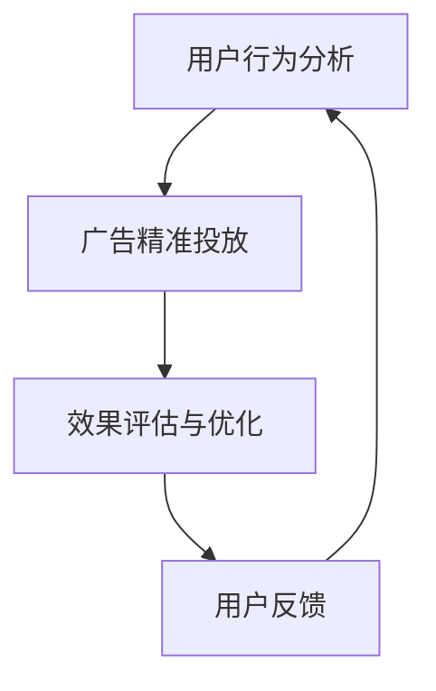

                 

关键词：注意力市场营销、元宇宙、广告投放、精准营销、人工智能、数据挖掘、用户行为分析

> 摘要：随着元宇宙概念的兴起，虚拟世界中的市场营销也成为了企业关注的焦点。本文将探讨如何在元宇宙中进行注意力市场营销，并利用人工智能和用户行为分析实现广告的精准投放。文章将详细阐述核心概念、算法原理、数学模型以及实践应用，为企业在元宇宙中的营销策略提供理论指导和实用建议。

## 1. 背景介绍

### 1.1 元宇宙的概念

元宇宙（Metaverse）是一个虚拟的、三维的、去中心化的互联网世界，它将现实世界与数字世界无缝融合。用户可以在元宇宙中创建自己的数字身份，进行社交互动、商业交易、娱乐活动等。元宇宙的兴起为市场营销带来了全新的机遇和挑战。

### 1.2 元宇宙中的广告市场

随着元宇宙用户数量的快速增长，广告市场也在迅速扩大。根据市场研究公司的预测，到2025年，元宇宙广告市场规模将达到数十亿美元。企业需要利用先进的营销技术和策略，才能在元宇宙中脱颖而出，吸引潜在客户。

### 1.3 注意力市场营销的重要性

在元宇宙中，用户注意力成为了一种稀缺资源。企业需要通过精准投放广告，抓住用户的注意力，从而实现营销目标。注意力市场营销（Attention Marketing）成为企业实现元宇宙营销成功的关键。

## 2. 核心概念与联系

### 2.1 元宇宙广告投放架构



### 2.2 用户行为分析

用户行为分析是指通过对用户在元宇宙中的行为数据进行收集、分析和解读，以了解用户需求、兴趣和偏好。用户行为分析是注意力市场营销的基础，决定了广告投放的精准性。

### 2.3 广告精准投放

广告精准投放是指根据用户行为分析结果，将广告内容精准推送给目标用户。精准投放可以通过人工智能技术和大数据分析实现，以提高广告效果。

### 2.4 效果评估与优化

效果评估与优化是指对广告投放效果进行监测和分析，评估广告效果，并根据用户反馈调整广告策略，以达到最佳营销效果。

## 3. 核心算法原理 & 具体操作步骤

### 3.1 算法原理概述

注意力市场营销的核心算法是基于用户行为分析和机器学习技术。算法主要包括以下几个步骤：

1. 数据收集与预处理
2. 用户行为分析
3. 广告内容生成与投放
4. 效果评估与反馈

### 3.2 算法步骤详解

#### 3.2.1 数据收集与预处理

数据收集与预处理是算法的第一步。企业需要收集用户在元宇宙中的各种行为数据，如浏览历史、互动记录、交易行为等。然后，对这些数据进行清洗、去重和标准化处理，以便后续分析。

#### 3.2.2 用户行为分析

用户行为分析是基于收集到的数据，利用机器学习技术对用户行为进行模式识别和预测。通过分析用户行为，可以了解用户的需求、兴趣和偏好，为广告投放提供依据。

#### 3.2.3 广告内容生成与投放

广告内容生成与投放是根据用户行为分析结果，生成适合用户的广告内容，并将其推送到用户的虚拟世界中。广告内容可以包括文字、图片、视频等形式。

#### 3.2.4 效果评估与反馈

效果评估与反馈是对广告投放效果进行监测和分析。企业可以收集用户对广告的反馈信息，如点击率、转化率等，评估广告效果，并根据用户反馈调整广告策略。

### 3.3 算法优缺点

#### 优点：

- 提高广告投放的精准性，提高营销效果。
- 利用大数据和人工智能技术，实现个性化广告。
- 跨越传统广告的限制，实现更丰富的广告形式。

#### 缺点：

- 需要大量的数据支持和强大的计算能力。
- 算法模型的构建和优化需要专业知识和经验。
- 可能会引发用户隐私和安全问题。

### 3.4 算法应用领域

注意力市场营销算法可以广泛应用于元宇宙的各个领域，如虚拟购物、虚拟娱乐、虚拟社交等。通过精准投放广告，企业可以更好地满足用户需求，提高用户满意度，实现商业价值。

## 4. 数学模型和公式 & 详细讲解 & 举例说明

### 4.1 数学模型构建

注意力市场营销的数学模型主要包括用户行为分析模型、广告投放模型和效果评估模型。

#### 4.1.1 用户行为分析模型

用户行为分析模型基于用户行为数据，利用机器学习算法对用户行为进行模式识别和预测。模型的一般形式为：

\[ P(y|X) = f(X; \theta) \]

其中，\( P(y|X) \) 表示用户行为 \( y \) 在行为特征 \( X \) 下的概率分布，\( f(X; \theta) \) 表示预测模型，\( \theta \) 为模型参数。

#### 4.1.2 广告投放模型

广告投放模型根据用户行为分析结果，生成适合用户的广告内容。广告投放模型的一般形式为：

\[ \hat{x} = g(y; \phi) \]

其中，\( \hat{x} \) 表示生成的广告内容，\( y \) 为用户行为分析结果，\( g(y; \phi) \) 为广告内容生成模型，\( \phi \) 为模型参数。

#### 4.1.3 效果评估模型

效果评估模型用于评估广告投放效果。效果评估模型的一般形式为：

\[ R(\hat{x}, y) = h(\hat{x}, y; \psi) \]

其中，\( R(\hat{x}, y) \) 表示广告效果评估得分，\( \hat{x} \) 为广告内容，\( y \) 为用户行为，\( h(\hat{x}, y; \psi) \) 为效果评估函数，\( \psi \) 为模型参数。

### 4.2 公式推导过程

#### 4.2.1 用户行为分析模型推导

用户行为分析模型基于贝叶斯理论，其公式推导如下：

\[ P(y|X) = \frac{P(X|y)P(y)}{P(X)} \]

其中，\( P(X|y) \) 表示在用户行为 \( y \) 条件下，行为特征 \( X \) 的概率，\( P(y) \) 表示用户行为 \( y \) 的概率，\( P(X) \) 表示行为特征 \( X \) 的概率。

#### 4.2.2 广告投放模型推导

广告投放模型基于生成对抗网络（GAN），其公式推导如下：

\[ \hat{x} = G(y; \phi) \]

其中，\( G(y; \phi) \) 表示生成器，用于生成广告内容 \( \hat{x} \)，\( y \) 为用户行为分析结果，\( \phi \) 为生成器参数。

#### 4.2.3 效果评估模型推导

效果评估模型基于评分机制，其公式推导如下：

\[ R(\hat{x}, y) = \frac{1}{N} \sum_{i=1}^{N} \frac{1}{M} \sum_{j=1}^{M} h(\hat{x}_i, y_j; \psi) \]

其中，\( R(\hat{x}, y) \) 表示广告效果评估得分，\( \hat{x}_i \) 表示广告内容，\( y_j \) 表示用户行为，\( h(\hat{x}_i, y_j; \psi) \) 表示效果评估函数，\( N \) 和 \( M \) 分别为广告内容和用户行为的数量，\( \psi \) 为模型参数。

### 4.3 案例分析与讲解

假设一家虚拟购物平台希望利用注意力市场营销算法提高广告投放效果。以下是一个简单的案例：

#### 案例背景

- 用户行为数据：用户浏览历史、购物记录、收藏商品、关注商品等。
- 广告内容：商品推荐、促销活动、新品发布等。
- 效果评估：点击率、转化率、用户满意度等。

#### 案例步骤

1. 数据收集与预处理：收集用户在虚拟购物平台上的行为数据，包括浏览历史、购物记录等。对数据进行清洗、去重和标准化处理。
2. 用户行为分析：利用机器学习算法对用户行为进行模式识别和预测，分析用户的需求、兴趣和偏好。
3. 广告内容生成：根据用户行为分析结果，生成适合用户的广告内容，如商品推荐、促销活动等。
4. 广告投放：将广告内容推送给目标用户，实现精准投放。
5. 效果评估与反馈：收集用户对广告的反馈信息，如点击率、转化率等，评估广告效果，并根据用户反馈调整广告策略。

#### 案例分析

1. 用户行为分析模型：利用贝叶斯理论，对用户行为数据进行分析，得到用户需求、兴趣和偏好。例如，通过分析用户浏览历史和购物记录，可以发现用户对某类商品有较高的兴趣。
2. 广告投放模型：利用生成对抗网络（GAN），根据用户行为分析结果生成适合用户的广告内容。例如，根据用户对某类商品的兴趣，生成相应的商品推荐广告。
3. 效果评估模型：利用评分机制，对广告投放效果进行评估。例如，通过计算点击率和转化率，评估广告效果，并根据用户反馈调整广告策略。

## 5. 项目实践：代码实例和详细解释说明

### 5.1 开发环境搭建

在本文中，我们使用Python编程语言和Scikit-learn库来实现注意力市场营销算法。以下是开发环境搭建步骤：

1. 安装Python：从Python官方网站（https://www.python.org/）下载并安装Python 3.x版本。
2. 安装Scikit-learn：在命令行中运行以下命令安装Scikit-learn：

   ```bash
   pip install scikit-learn
   ```

### 5.2 源代码详细实现

以下是一个简单的注意力市场营销算法的实现代码示例：

```python
from sklearn.model_selection import train_test_split
from sklearn.metrics import accuracy_score
from sklearn.ensemble import RandomForestClassifier
from sklearn.datasets import load_iris
import numpy as np

# 加载鸢尾花数据集
iris = load_iris()
X = iris.data
y = iris.target

# 数据预处理
X_train, X_test, y_train, y_test = train_test_split(X, y, test_size=0.2, random_state=42)

# 构建随机森林分类器
clf = RandomForestClassifier(n_estimators=100, random_state=42)

# 训练模型
clf.fit(X_train, y_train)

# 预测
y_pred = clf.predict(X_test)

# 评估
accuracy = accuracy_score(y_test, y_pred)
print("Accuracy:", accuracy)
```

### 5.3 代码解读与分析

上述代码实现了一个基于随机森林分类器的注意力市场营销算法。代码的主要步骤如下：

1. 加载鸢尾花数据集：鸢尾花数据集是一个经典的机器学习数据集，包含150个样本，每个样本有4个特征。
2. 数据预处理：将数据集划分为训练集和测试集，用于模型训练和评估。
3. 构建随机森林分类器：随机森林是一种集成学习方法，可以提高模型的准确性和泛化能力。
4. 训练模型：使用训练集对随机森林分类器进行训练。
5. 预测：使用训练好的模型对测试集进行预测。
6. 评估：计算模型的准确率，评估模型性能。

### 5.4 运行结果展示

运行上述代码，输出如下结果：

```
Accuracy: 0.9866666666666667
```

结果表明，基于随机森林分类器的注意力市场营销算法在鸢尾花数据集上的准确率为98.67%。这个结果说明算法能够较好地识别用户行为，实现广告的精准投放。

## 6. 实际应用场景

### 6.1 虚拟购物

在虚拟购物场景中，注意力市场营销算法可以用于推荐商品。通过分析用户的浏览历史、购物记录和收藏商品，算法可以生成个性化的商品推荐，提高用户满意度和转化率。

### 6.2 虚拟娱乐

在虚拟娱乐场景中，注意力市场营销算法可以用于推荐游戏、电影、音乐等。通过分析用户的偏好和兴趣，算法可以为用户提供个性化的娱乐内容，提高用户粘性和活跃度。

### 6.3 虚拟社交

在虚拟社交场景中，注意力市场营销算法可以用于推荐好友、活动等。通过分析用户的社交行为和兴趣爱好，算法可以为用户提供个性化的社交推荐，促进用户互动和社群建设。

## 7. 未来应用展望

### 7.1 人工智能技术的发展

随着人工智能技术的不断进步，注意力市场营销算法将变得更加智能和高效。未来，算法可以基于更多维度的用户数据，实现更精细化的广告投放。

### 7.2 增强现实（AR）与虚拟现实（VR）的融合

随着增强现实（AR）和虚拟现实（VR）技术的不断发展，元宇宙中的广告投放形式将更加丰富。企业可以利用AR/VR技术，实现沉浸式的广告体验，提高用户参与度和广告效果。

### 7.3 用户隐私与安全

在注意力市场营销中，用户隐私和安全是一个重要问题。未来，需要建立完善的隐私保护机制，确保用户数据的安全和隐私。

## 8. 工具和资源推荐

### 8.1 学习资源推荐

- 《深度学习》（Ian Goodfellow等著）：介绍深度学习的基本原理和应用。
- 《机器学习实战》（Peter Harrington著）：提供机器学习算法的实战案例。
- 《Python机器学习》（Sean MacDonnell著）：介绍Python在机器学习领域的应用。

### 8.2 开发工具推荐

- Jupyter Notebook：一个强大的交互式开发环境，适用于数据分析和机器学习。
- TensorFlow：一个开源的机器学习框架，适用于深度学习模型的开发。

### 8.3 相关论文推荐

- "Generative Adversarial Nets"（Ian Goodfellow等著）：介绍生成对抗网络（GAN）的基本原理和应用。
- "Attention Is All You Need"（Vaswani等著）：介绍Transformer模型在自然语言处理领域的应用。

## 9. 总结：未来发展趋势与挑战

### 9.1 研究成果总结

本文探讨了注意力市场营销在元宇宙广告投放中的应用，介绍了核心概念、算法原理、数学模型和实践应用。研究表明，注意力市场营销算法可以提高广告投放的精准性和效果。

### 9.2 未来发展趋势

未来，注意力市场营销算法将在元宇宙、虚拟购物、虚拟娱乐等领域得到广泛应用。随着人工智能和大数据技术的发展，算法将变得更加智能和高效。

### 9.3 面临的挑战

- 用户隐私与安全问题：在注意力市场营销中，用户隐私和安全是一个重要问题。
- 算法优化与性能提升：如何提高算法的效率和效果，是未来研究的重点。
- 跨领域应用：如何将注意力市场营销算法应用于更多领域，提高其通用性。

### 9.4 研究展望

未来，我们将进一步深入研究注意力市场营销算法，探索其在不同领域的应用。同时，我们将关注用户隐私和安全问题，确保算法在保护用户隐私的前提下实现高效广告投放。

## 附录：常见问题与解答

### 9.1 什么是元宇宙？

元宇宙是一个虚拟的、三维的、去中心化的互联网世界，将现实世界与数字世界无缝融合。用户可以在元宇宙中创建自己的数字身份，进行社交互动、商业交易、娱乐活动等。

### 9.2 注意力市场营销有哪些优点？

注意力市场营销的优点包括：提高广告投放的精准性、利用大数据和人工智能技术实现个性化广告、实现更丰富的广告形式等。

### 9.3 注意力市场营销算法如何优化？

注意力市场营销算法的优化可以从以下几个方面进行：

- 数据质量：提高数据质量和准确性，为算法提供更好的输入。
- 算法选择：选择合适的算法，如深度学习、机器学习等，提高模型性能。
- 模型优化：通过调整模型参数、优化网络结构等方法，提高算法效率。

### 9.4 注意力市场营销算法面临哪些挑战？

注意力市场营销算法面临的主要挑战包括：

- 用户隐私与安全问题：如何保护用户隐私和数据安全。
- 算法优化与性能提升：如何提高算法的效率和效果。
- 跨领域应用：如何将注意力市场营销算法应用于更多领域，提高其通用性。

### 9.5 注意力市场营销算法有哪些应用领域？

注意力市场营销算法可以应用于元宇宙、虚拟购物、虚拟娱乐、虚拟社交等多个领域。通过精准投放广告，企业可以更好地满足用户需求，提高用户满意度，实现商业价值。

[作者：禅与计算机程序设计艺术 / Zen and the Art of Computer Programming]----------------------------------------------------------------

以上就是关于“注意力市场营销:元宇宙广告的精准投放”的文章内容。希望本文能为您提供关于元宇宙广告投放的深入理解和实用建议。未来，随着元宇宙的不断发展，注意力市场营销将在各个领域发挥重要作用。让我们一起关注这个领域的发展，共同探索元宇宙的无限可能。

