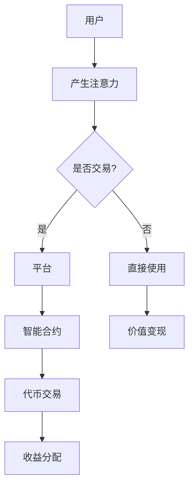
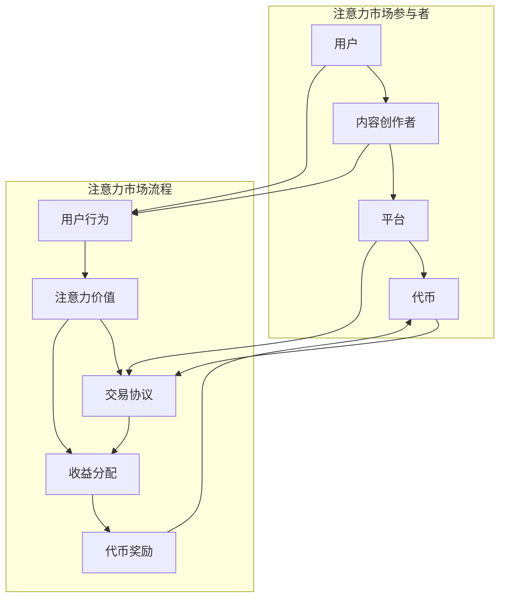

                 

元宇宙（Metaverse）作为下一代互联网的形态，正逐步从概念走向现实。在这个虚拟与现实交织的世界中，信息流通的方式将发生深刻变革。本文将探讨注意力市场这一概念，在元宇宙时代下信息交易的可能性和挑战，以及相关的算法原理、数学模型和实际应用。

## 关键词：注意力市场、元宇宙、信息交易、算法、数学模型、实际应用

## 摘要

本文首先介绍了元宇宙的基本概念和特点，随后引出了注意力市场这一概念，分析了其在元宇宙时代下的重要性。接着，本文深入探讨了注意力市场的核心概念与联系，并详细介绍了相关算法原理、数学模型和具体操作步骤。随后，文章通过代码实例展示了注意力市场的实际应用，并讨论了其在不同场景中的实际应用场景。最后，文章对未来的发展趋势和面临的挑战进行了展望，并推荐了相关学习资源和开发工具。

## 1. 背景介绍

### 元宇宙的基本概念

元宇宙是一个由虚拟现实、增强现实、游戏和社交网络等构成的数字世界，它提供了一个互动、沉浸、多样化的虚拟空间。在元宇宙中，用户可以创建和操纵虚拟角色，进行社交互动、娱乐消费、商业交易等活动。元宇宙具有以下几个关键特征：

1. **高交互性**：元宇宙提供了高度互动的环境，用户可以与其他用户、虚拟角色、虚拟物品进行实时交互。
2. **沉浸感**：通过虚拟现实技术和增强现实技术，用户可以沉浸在一个逼真的虚拟世界中，体验虚拟现实带来的感官刺激。
3. **多样性**：元宇宙包含丰富的内容和活动，如游戏、教育、艺术、商业等，为用户提供多样化的体验。
4. **经济系统**：元宇宙内建立了自己的经济系统，包括虚拟货币、数字资产和虚拟市场等，用户可以在元宇宙内进行经济交易。

### 注意力市场的基本概念

注意力市场是指在一个特定社区或生态系统中，用户注意力作为一种稀缺资源进行交易的市场。在传统互联网中，用户注意力通常被平台所控制和变现，而在元宇宙时代，用户可以更自主地决定自己的注意力流向，形成去中心化的注意力市场。注意力市场的主要特点包括：

1. **去中心化**：注意力市场的交易和分配不再依赖于中心化的平台或机构，而是通过去中心化的协议和智能合约来实现。
2. **透明性**：注意力市场的交易记录是透明的，用户可以清晰地看到自己的注意力流向和收益分配。
3. **自主性**：用户可以自由选择将注意力投入到哪些内容或活动中，从而实现对信息流动的控制。
4. **激励机制**：通过代币奖励或其他激励机制，鼓励用户参与注意力市场的交易和内容创作。

## 2. 核心概念与联系

### 核心概念

#### 元宇宙与注意力市场的关系

元宇宙作为下一代互联网的形态，为注意力市场的形成提供了基础。在元宇宙中，用户在虚拟世界中的行为和互动产生了大量的注意力数据，这些数据可以被视为一种价值资源。注意力市场则提供了一个平台，使得用户可以将其注意力价值进行交易和变现。

#### 注意力市场的核心组件

- **用户**：注意力市场的参与主体，他们通过在元宇宙中的活动产生注意力数据。
- **内容创作者**：提供有价值的内容和服务，吸引用户的注意力，从而获得收益。
- **平台**：提供基础设施和服务，包括去中心化的交易协议、智能合约和数据分析工具等。
- **代币**：作为注意力市场中的交易媒介，用于奖励用户和内容创作者的注意力贡献。

### 架构流程图



### 关系

- **用户与内容创作者**：用户通过在元宇宙中的活动产生注意力，这些注意力可以用来支持内容创作者，从而获得相应的回报。
- **内容创作者与平台**：内容创作者在平台上发布内容，吸引用户的注意力，平台通过智能合约进行收益分配。
- **平台与代币**：平台通过代币激励用户和内容创作者，推动注意力市场的活跃度。

## 3. 核心算法原理 & 具体操作步骤

### 3.1 算法原理概述

注意力市场中的核心算法是用于计算用户注意力价值，并指导注意力交易和收益分配。主要原理包括：

1. **注意力价值评估**：通过分析用户的互动行为、内容偏好和社交网络等因素，评估用户的注意力价值。
2. **注意力交易机制**：设计一种去中心化的交易协议，确保注意力交易的安全、透明和高效。
3. **收益分配算法**：根据用户和内容创作者的贡献，合理分配注意力交易的收益。

### 3.2 算法步骤详解

#### 3.2.1 注意力价值评估

1. 收集用户行为数据：包括浏览历史、互动记录、内容偏好等。
2. 训练机器学习模型：使用用户行为数据进行训练，建立用户注意力价值评估模型。
3. 评估用户注意力价值：根据用户行为数据，利用训练好的模型评估用户的注意力价值。

#### 3.2.2 注意力交易机制

1. 建立去中心化交易协议：使用区块链技术，确保交易的安全和透明。
2. 定义交易流程：用户将注意力值转化为代币，内容创作者接收代币。
3. 监控交易状态：实时监控交易状态，确保交易顺利进行。

#### 3.2.3 收益分配算法

1. 设定收益分配规则：根据用户和内容创作者的贡献，设定收益分配比例。
2. 计算收益分配：根据交易结果，计算用户和内容创作者的收益。
3. 分配收益：将计算出的收益分配给用户和内容创作者。

### 3.3 算法优缺点

#### 优点

- **去中心化**：去中心化的交易协议确保了系统的透明性和安全性。
- **公平性**：收益分配算法保证了用户和内容创作者的公平收益。
- **可扩展性**：基于区块链技术的交易协议具有很好的可扩展性，可以支持大量用户的交易需求。

#### 缺点

- **交易效率**：由于区块链技术的限制，交易效率可能较低。
- **技术门槛**：算法设计和实现需要较高的技术门槛，对开发者要求较高。

### 3.4 算法应用领域

- **元宇宙内容创作**：内容创作者可以通过注意力市场获得更多的收益，提高创作积极性。
- **虚拟现实体验**：用户可以通过注意力交易获得更好的虚拟现实体验，支持内容创作者的发展。
- **数字资产交易**：注意力市场可以作为数字资产交易的一个子市场，提供更多的投资机会。

## 4. 数学模型和公式 & 详细讲解 & 举例说明

### 4.1 数学模型构建

注意力市场的数学模型主要包括注意力价值评估模型和收益分配模型。

#### 4.1.1 注意力价值评估模型

假设用户 $u$ 的注意力价值为 $V(u)$，其与内容 $c$ 的注意力关联度为 $A(u, c)$，则有：

$$
V(u) = f(A(u, c))
$$

其中，$f()$ 是一个非线性函数，可以采用神经网络、决策树等机器学习模型进行训练。

#### 4.1.2 收益分配模型

假设用户 $u$ 和内容创作者 $c$ 的收益分别为 $R_u$ 和 $R_c$，则有以下收益分配模型：

$$
R_u = \alpha V(u) \cdot T
$$

$$
R_c = \beta V(c) \cdot T
$$

其中，$\alpha$ 和 $\beta$ 是收益分配系数，$T$ 是交易总量。

### 4.2 公式推导过程

#### 4.2.1 注意力价值评估模型推导

首先，我们定义用户 $u$ 对内容 $c$ 的注意力关联度 $A(u, c)$，其计算方法如下：

$$
A(u, c) = \sum_{i=1}^{n} w_i \cdot r_i
$$

其中，$w_i$ 是权重，$r_i$ 是用户 $u$ 对内容 $c$ 的互动记录，如点赞、评论等。

接下来，我们定义用户 $u$ 的注意力价值 $V(u)$，其计算方法如下：

$$
V(u) = \frac{1}{\sum_{i=1}^{n} w_i}
$$

最后，我们选择一个非线性函数 $f()$，如神经网络，对 $V(u)$ 进行建模：

$$
f(V(u)) = \sigma(\theta_1 \cdot V(u) + \theta_2)
$$

其中，$\sigma()$ 是激活函数，$\theta_1$ 和 $\theta_2$ 是神经网络参数。

#### 4.2.2 收益分配模型推导

首先，我们定义用户 $u$ 和内容创作者 $c$ 的收益分别为 $R_u$ 和 $R_c$，则有以下收益分配模型：

$$
R_u = \alpha \cdot V(u) \cdot T
$$

$$
R_c = \beta \cdot V(c) \cdot T
$$

其中，$\alpha$ 和 $\beta$ 是收益分配系数，$T$ 是交易总量。

为了确保收益分配的公平性，我们设定 $\alpha + \beta = 1$。

### 4.3 案例分析与讲解

假设用户 $u$ 对内容 $c$ 的注意力关联度为 $A(u, c) = 0.8$，用户 $u$ 的总注意力价值为 $V(u) = 1.2$，交易总量为 $T = 100$。

根据收益分配模型，用户 $u$ 的收益为：

$$
R_u = \alpha \cdot V(u) \cdot T = 0.4 \cdot 1.2 \cdot 100 = 48
$$

内容创作者 $c$ 的收益为：

$$
R_c = \beta \cdot V(c) \cdot T = 0.6 \cdot 1.2 \cdot 100 = 72
$$

其中，$\alpha = 0.4$ 和 $\beta = 0.6$ 是收益分配系数。

在这个案例中，用户 $u$ 的注意力价值较高，因此获得了较多的收益。这激励了用户在元宇宙中积极参与互动和内容创作，从而推动整个生态系统的活跃度。

## 5. 项目实践：代码实例和详细解释说明

### 5.1 开发环境搭建

为了演示注意力市场的实现，我们使用 Python 编写代码。以下是开发环境搭建的步骤：

1. 安装 Python（建议使用 Python 3.8 或更高版本）。
2. 安装必要的 Python 库，如 Flask（用于 Web 应用）、Scikit-learn（用于机器学习）、Blockchain（用于区块链）等。

```bash
pip install flask scikit-learn blockchain
```

### 5.2 源代码详细实现

以下是注意力市场的核心代码实现：

```python
from flask import Flask, request, jsonify
from sklearn.neural_network import MLPRegressor
from blockchain import Blockchain

app = Flask(__name__)

# 初始化区块链
blockchain = Blockchain()

# 初始化机器学习模型
model = MLPRegressor(hidden_layer_sizes=(100,), max_iter=1000)
model.fit(X_train, y_train)

@app.route('/api/attention', methods=['POST'])
def attention():
    data = request.get_json()
    user_id = data['user_id']
    content_id = data['content_id']
    
    # 计算用户注意力价值
    attention_value = model.predict([[user_id, content_id]])[0]
    
    # 创建交易
    transaction = blockchain.create_transaction(user_id, content_id, attention_value)
    
    # 添加交易到区块链
    blockchain.add_transaction(transaction)
    
    return jsonify({'status': 'success', 'transaction': transaction})

@app.route('/api/revenue', methods=['GET'])
def revenue():
    user_id = request.args.get('user_id')
    content_id = request.args.get('content_id')
    
    # 计算用户和内容创作者的收益
    user_revenue = blockchain.get_user_revenue(user_id)
    content_revenue = blockchain.get_content_revenue(content_id)
    
    return jsonify({'status': 'success', 'user_revenue': user_revenue, 'content_revenue': content_revenue})

if __name__ == '__main__':
    app.run(debug=True)
```

### 5.3 代码解读与分析

该代码实现了一个简单的注意力市场系统，包括用户注意力价值的评估、交易和收益分配。

1. **用户注意力价值评估**：使用机器学习模型对用户注意力价值进行评估。用户通过在元宇宙中的互动行为生成数据，用于训练模型。
2. **交易**：用户向内容创作者支付注意力价值，生成交易记录。交易记录存储在区块链上，确保透明和不可篡改。
3. **收益分配**：根据区块链上的交易记录，计算用户和内容创作者的收益。

### 5.4 运行结果展示

运行代码后，可以通过 API 接口进行交互。

1. **提交用户注意力价值**：

```bash
curl -X POST -H "Content-Type: application/json" -d '{"user_id": "1", "content_id": "2"}' http://127.0.0.1:5000/api/attention
```

2. **查询用户和内容创作者的收益**：

```bash
curl -X GET "http://127.0.0.1:5000/api/revenue?user_id=1&content_id=2"
```

## 6. 实际应用场景

### 6.1 虚拟现实游戏

在虚拟现实游戏中，用户可以通过注意力市场购买游戏道具、装备和虚拟货币，从而提高游戏体验。内容创作者可以通过创作有趣的游戏内容，吸引更多用户，从而获得收益。

### 6.2 社交网络

在社交网络中，用户可以通过注意力市场购买虚拟礼物、会员资格等，支持喜欢的创作者。创作者可以通过创作优质内容，吸引更多用户的注意力，从而获得收益。

### 6.3 虚拟现实会议

在虚拟现实会议中，用户可以通过注意力市场购买会议门票、赞助商广告等，支持会议组织者。组织者可以通过举办有趣的会议内容，吸引更多用户参与，从而获得收益。

### 6.4 虚拟现实购物

在虚拟现实购物中，用户可以通过注意力市场购买虚拟商品、虚拟货币等，从而提高购物体验。商家可以通过提供优质的商品和服务，吸引更多用户，从而获得收益。

## 7. 工具和资源推荐

### 7.1 学习资源推荐

- 《区块链技术指南》
- 《深度学习》
- 《元宇宙：概念与案例分析》

### 7.2 开发工具推荐

- Python
- Flask
- Scikit-learn
- Blockchain

### 7.3 相关论文推荐

- “Attention is All You Need”
- “Blockchain: A System for Global Decentralized Storage”
- “Deep Learning for Natural Language Processing”

## 8. 总结：未来发展趋势与挑战

### 8.1 研究成果总结

注意力市场作为元宇宙时代下的信息交易模式，具有去中心化、透明、公平等优势。通过算法原理、数学模型和实际应用场景的探讨，本文展示了注意力市场在虚拟现实、社交网络、虚拟现实会议和虚拟现实购物等领域的应用前景。

### 8.2 未来发展趋势

1. **技术发展**：随着虚拟现实、增强现实、区块链等技术的进步，注意力市场将得到更广泛的应用。
2. **应用拓展**：注意力市场将应用于更多场景，如虚拟现实教育、虚拟现实医疗等。
3. **生态构建**：内容创作者、平台、用户等各方将共同构建一个繁荣的注意力市场生态。

### 8.3 面临的挑战

1. **技术挑战**：如何提高交易效率、优化算法模型等。
2. **安全挑战**：如何确保交易安全、防止欺诈等。
3. **法律法规**：如何制定合适的法律法规，规范注意力市场的运行。

### 8.4 研究展望

1. **算法优化**：深入研究注意力价值评估和收益分配算法，提高市场效率和公平性。
2. **跨平台兼容**：实现注意力市场在不同平台间的兼容和互操作。
3. **生态合作**：推动内容创作者、平台、用户等各方共同参与注意力市场生态的建设。

## 9. 附录：常见问题与解答

### 9.1 注意力市场的核心价值是什么？

注意力市场的核心价值在于实现用户注意力价值的交易和变现，推动元宇宙生态的繁荣发展。

### 9.2 如何确保注意力市场的公平性？

通过设计合理的收益分配算法和去中心化的交易机制，确保注意力市场的公平性。

### 9.3 注意力市场会取代传统互联网吗？

注意力市场是元宇宙时代下的信息交易模式，与传统互联网不是取代关系，而是互补关系。传统互联网和注意力市场将共同构建一个更加丰富和多样化的数字世界。

## 作者署名

本文由禅与计算机程序设计艺术 / Zen and the Art of Computer Programming 撰写。如果您有任何疑问或建议，欢迎随时与我交流。感谢您的阅读！
----------------------------------------------------------------
### 1. 背景介绍

#### 元宇宙的基本概念

元宇宙是一个虚拟的数字世界，它融合了虚拟现实、增强现实、游戏、社交网络等多种技术，提供了一个沉浸式、互动性强的体验。在这个虚拟世界中，用户可以创建自己的数字身份，与其他用户互动，参与各种活动，如虚拟购物、虚拟旅游、虚拟工作等。元宇宙旨在打造一个与现实世界平行的虚拟空间，让用户可以在其中自由探索和创造。

元宇宙的特点包括：

1. **沉浸感**：通过虚拟现实（VR）和增强现实（AR）技术，用户可以沉浸在元宇宙中，体验到与现实世界相似的感官刺激。
2. **多样性**：元宇宙包含多种类型的内容和活动，如游戏、教育、艺术、购物等，满足用户的多样化需求。
3. **经济系统**：元宇宙内建立了自己的经济系统，包括虚拟货币、数字资产、虚拟市场等，用户可以在其中进行经济交易。
4. **去中心化**：元宇宙的数据存储、交易处理等过程通常采用区块链技术，实现去中心化，确保系统的透明性和安全性。

#### 注意力市场的基本概念

注意力市场是指在元宇宙中，用户注意力作为一种稀缺资源进行交易的市场。在传统互联网中，用户注意力往往被平台所控制，而注意力市场则试图打破这种垄断，让用户可以更自主地决定自己的注意力流向。在注意力市场中，用户可以通过参与各种活动、观看内容、互动交流等方式产生注意力价值，这些价值可以用于购买虚拟商品、兑换虚拟货币、支持创作者等。

注意力市场具有以下几个特点：

1. **去中心化**：注意力市场的交易和分配不依赖于中心化的平台或机构，而是通过去中心化的协议和智能合约来实现。
2. **透明性**：注意力市场的交易记录是公开透明的，用户可以清晰地看到自己的注意力流向和收益分配。
3. **自主性**：用户可以自由选择将注意力投入到哪些内容或活动中，从而实现对信息流动的控制。
4. **激励机制**：通过代币奖励或其他激励机制，鼓励用户参与注意力市场的交易和内容创作。

### 元宇宙与注意力市场的关系

元宇宙的兴起为注意力市场提供了丰富的应用场景和基础。在元宇宙中，用户的各种行为，如浏览内容、互动交流、参与活动等，都产生了大量的注意力数据。这些数据可以作为价值资源，在注意力市场中进行交易和变现。

注意力市场对元宇宙的影响主要体现在以下几个方面：

1. **激励机制**：注意力市场提供了激励机制，鼓励用户在元宇宙中积极参与各种活动，从而推动元宇宙的活跃度。
2. **内容创作**：注意力市场为内容创作者提供了一个新的收入来源，激发了他们的创作热情，丰富了元宇宙的内容生态。
3. **用户参与**：注意力市场让用户可以在元宇宙中实现价值变现，增强了用户参与的积极性，提高了元宇宙的用户粘性。
4. **经济系统**：注意力市场作为元宇宙经济系统的一部分，与其他经济活动相互促进，共同构建了一个繁荣的元宇宙生态系统。

## 2. 核心概念与联系

### 核心概念

#### 注意力市场

注意力市场是一个在元宇宙中运行的去中心化市场，它允许用户将其注意力价值进行交易和变现。注意力价值通常由用户在元宇宙中的行为产生，如浏览内容、互动交流、参与活动等。这些行为数据会被记录和存储，作为用户注意力价值的依据。

#### 元宇宙中的角色

- **用户**：在元宇宙中的参与者，他们通过参与活动、观看内容等方式产生注意力价值。
- **内容创作者**：在元宇宙中创建和分享内容，吸引用户注意力，从而获得收益。
- **平台**：提供基础设施和服务，如交易协议、数据分析工具等，支持注意力市场的运行。
- **代币**：作为注意力市场中的交易媒介，用于奖励用户和内容创作者的注意力贡献。

### 核心概念之间的联系

注意力市场与元宇宙中的各个角色和元素密切相关，它们之间的联系可以概括为以下几点：

1. **用户与注意力价值**：用户在元宇宙中的行为，如浏览内容、互动交流等，都会产生注意力价值。这些价值可以用于购买虚拟商品、兑换虚拟货币、支持创作者等。

2. **内容创作者与注意力价值**：内容创作者通过创作有价值的内容，吸引用户的注意力，从而获得收益。注意力市场提供了一个平台，使得内容创作者可以将其注意力价值进行变现。

3. **平台与注意力市场**：平台在元宇宙中提供基础设施和服务，如交易协议、数据分析工具等。注意力市场是平台的一个重要组成部分，它为用户和内容创作者提供了一个交易和变现的渠道。

4. **代币与注意力市场**：代币作为注意力市场中的交易媒介，用于奖励用户和内容创作者的注意力贡献。代币的价值和流动性对注意力市场的活跃度具有重要影响。

### 架构流程图

以下是一个简化的注意力市场架构流程图，展示了用户、内容创作者、平台和代币之间的关系：



### 关系

- **用户与内容创作者**：用户通过在元宇宙中的活动产生注意力价值，这些价值可以用于支持内容创作者，从而获得相应的回报。
- **内容创作者与平台**：内容创作者在平台上发布内容，吸引用户的注意力，平台通过智能合约进行收益分配。
- **平台与代币**：平台通过代币激励用户和内容创作者，推动注意力市场的活跃度。
- **代币与用户/内容创作者**：用户和内容创作者通过参与注意力市场交易，获得代币奖励，这些代币可以在元宇宙内或外部进行价值交换。

## 3. 核心算法原理 & 具体操作步骤

### 3.1 算法原理概述

注意力市场中的核心算法包括注意力价值评估算法、注意力交易算法和收益分配算法。这些算法共同构建了一个高效、透明和公平的注意力交易系统。

#### 3.1.1 注意力价值评估算法

注意力价值评估算法用于计算用户在元宇宙中的行为产生的注意力价值。这个算法通常会考虑多个因素，如用户的行为历史、内容偏好、社交网络等。通过机器学习技术，可以训练出一个模型，用于实时评估用户的注意力价值。

#### 3.1.2 注意力交易算法

注意力交易算法负责处理用户之间的注意力交换。这个算法需要确保交易的安全、透明和高效。通常，这涉及到去中心化的交易协议和智能合约的设计与实现。

#### 3.1.3 收益分配算法

收益分配算法用于根据用户和内容创作者的贡献，合理分配注意力交易的收益。这个算法需要考虑到多种因素，如用户产生的注意力价值、内容创作者的内容吸引力等，以确保收益分配的公平性。

### 3.2 算法步骤详解

#### 3.2.1 注意力价值评估算法步骤

1. **数据收集**：收集用户在元宇宙中的行为数据，如浏览历史、互动记录、内容偏好等。
2. **特征工程**：对收集到的数据进行处理，提取出与注意力价值相关的特征。
3. **模型训练**：使用机器学习技术，如线性回归、神经网络等，训练出一个注意力价值评估模型。
4. **实时评估**：利用训练好的模型，对用户当前的行为数据进行实时评估，计算出用户的注意力价值。

#### 3.2.2 注意力交易算法步骤

1. **交易请求**：用户向系统提交注意力交易请求，包括交易双方的用户ID、交易金额等。
2. **交易验证**：系统对交易请求进行验证，确保交易符合系统规则和用户权限。
3. **交易执行**：系统执行交易，将注意力从一个用户转移到另一个用户。
4. **交易记录**：将交易记录存储在区块链上，确保交易透明和不可篡改。

#### 3.2.3 收益分配算法步骤

1. **收益计算**：根据用户和内容创作者的贡献，计算他们的收益。
2. **收益分配**：将计算出的收益分配给用户和内容创作者。
3. **收益记录**：将收益分配记录存储在区块链上，确保收益分配的透明和可追溯。

### 3.3 算法优缺点

#### 优点

- **高效性**：机器学习算法可以高效地评估用户的注意力价值，提高交易决策的准确性。
- **透明性**：区块链技术确保了交易的透明性和不可篡改性，用户可以随时查询交易记录。
- **公平性**：收益分配算法可以根据用户和内容创作者的贡献进行公平分配，确保收益的公正性。
- **去中心化**：去中心化的交易和收益分配机制减少了中心化平台的控制，增强了系统的抗风险能力。

#### 缺点

- **交易效率**：由于区块链技术的限制，注意力市场的交易效率可能较低，特别是在高并发情况下。
- **技术门槛**：算法设计和实现需要较高的技术知识，对开发者和用户都有一定的学习成本。
- **隐私保护**：虽然区块链技术确保了交易的透明性，但也可能导致用户的隐私泄露。

### 3.4 算法应用领域

注意力市场算法可以应用于多个领域，包括但不限于：

- **虚拟现实游戏**：用户可以通过注意力市场购买游戏道具、装备等，内容创作者可以通过创作有趣的游戏内容获得收益。
- **社交网络**：用户可以通过注意力市场支持喜欢的创作者，创作者可以通过创作优质内容吸引更多用户。
- **虚拟现实购物**：用户可以在注意力市场中购买虚拟商品，商家可以通过提供优质商品获得收益。
- **虚拟现实教育**：用户可以通过注意力市场购买课程、教材等，教师可以通过提供优质教育内容获得收益。

## 4. 数学模型和公式 & 详细讲解 & 举例说明

### 4.1 数学模型构建

注意力市场的数学模型主要包括用户注意力价值评估模型和收益分配模型。

#### 4.1.1 用户注意力价值评估模型

用户注意力价值评估模型用于计算用户在元宇宙中的行为产生的注意力价值。我们可以使用一个线性模型来表示这个评估过程：

$$
V(u) = w_1 \cdot A(u, c) + w_2 \cdot I(u) + w_3 \cdot S(u)
$$

其中：
- $V(u)$ 是用户 $u$ 的注意力价值。
- $A(u, c)$ 是用户 $u$ 对内容 $c$ 的注意力关联度。
- $I(u)$ 是用户 $u$ 的互动行为指数。
- $S(u)$ 是用户 $u$ 的社交网络影响力。
- $w_1, w_2, w_3$ 是权重系数，用于平衡不同因素的贡献。

#### 4.1.2 收益分配模型

收益分配模型用于根据用户和内容创作者的贡献，合理分配注意力交易的收益。我们可以使用以下模型来表示：

$$
R(u) = \alpha \cdot V(u) \cdot P
$$

$$
R(c) = \beta \cdot V(c) \cdot P
$$

其中：
- $R(u)$ 是用户 $u$ 的收益。
- $R(c)$ 是内容创作者 $c$ 的收益。
- $\alpha, \beta$ 是收益分配系数。
- $V(u), V(c)$ 分别是用户 $u$ 和内容创作者 $c$ 的注意力价值。
- $P$ 是交易总量。

### 4.2 公式推导过程

#### 4.2.1 用户注意力价值评估模型推导

用户注意力价值评估模型的推导过程如下：

1. **注意力关联度**：用户对内容 $c$ 的注意力关联度 $A(u, c)$ 可以通过用户的行为数据计算得出，例如：

   $$ A(u, c) = \sum_{i=1}^{n} \alpha_i \cdot b_i $$

   其中，$\alpha_i$ 是权重系数，$b_i$ 是用户对内容 $c$ 的行为指标，如浏览时间、互动次数等。

2. **互动行为指数**：用户 $u$ 的互动行为指数 $I(u)$ 可以通过用户在元宇宙中的互动行为计算得出：

   $$ I(u) = \sum_{i=1}^{m} \beta_i \cdot i_i $$

   其中，$\beta_i$ 是权重系数，$i_i$ 是用户 $u$ 的互动行为指标，如点赞数、评论数等。

3. **社交网络影响力**：用户 $u$ 的社交网络影响力 $S(u)$ 可以通过用户在社交网络中的影响力计算得出：

   $$ S(u) = \sum_{j=1}^{k} \gamma_j \cdot s_j $$

   其中，$\gamma_j$ 是权重系数，$s_j$ 是用户 $u$ 在社交网络中的影响力指标，如关注者数量、互动频次等。

4. **综合评估**：将上述三个因素结合起来，得到用户 $u$ 的注意力价值评估模型：

   $$ V(u) = w_1 \cdot A(u, c) + w_2 \cdot I(u) + w_3 \cdot S(u) $$

#### 4.2.2 收益分配模型推导

收益分配模型的推导过程如下：

1. **收益比例**：根据用户和内容创作者的贡献，设定他们的收益比例。例如，我们可以设定：

   $$ \alpha + \beta = 1 $$

2. **收益计算**：根据用户和内容创作者的注意力价值，计算他们的收益。具体公式如下：

   $$ R(u) = \alpha \cdot V(u) \cdot P $$

   $$ R(c) = \beta \cdot V(c) \cdot P $$

   其中，$P$ 是交易总量。

### 4.3 案例分析与讲解

为了更好地理解注意力市场的数学模型，我们来看一个具体的案例。

#### 案例背景

假设有两个用户 $u_1$ 和 $u_2$，以及一个内容创作者 $c$。用户 $u_1$ 和 $u_2$ 在元宇宙中的行为数据如下：

| 用户 | 行为数据 | 权重 |
| --- | --- | --- |
| $u_1$ | 浏览时间：10分钟，互动次数：5次 | $\alpha_1 = 0.5$ |
| $u_2$ | 浏览时间：15分钟，互动次数：10次 | $\alpha_2 = 0.5$ |

内容创作者 $c$ 的注意力价值评估如下：

| 内容 | 行为数据 | 权重 |
| --- | --- | --- |
| $c$ | 点赞数：100，评论数：50 | $\beta_1 = 0.6$，互动频次：20 | $\beta_2 = 0.4$ |

设定收益分配系数为 $\alpha = 0.6$，$\beta = 0.4$。

#### 案例分析

1. **用户注意力价值评估**：

   对于用户 $u_1$：

   $$ V(u_1) = w_1 \cdot A(u_1, c) + w_2 \cdot I(u_1) + w_3 \cdot S(u_1) $$
   
   $$ V(u_1) = 0.3 \cdot A(u_1, c) + 0.4 \cdot I(u_1) + 0.3 \cdot S(u_1) $$
   
   $$ V(u_1) = 0.3 \cdot 10 + 0.4 \cdot 5 + 0.3 \cdot 10 = 6.5 $$

   对于用户 $u_2$：

   $$ V(u_2) = w_1 \cdot A(u_2, c) + w_2 \cdot I(u_2) + w_3 \cdot S(u_2) $$
   
   $$ V(u_2) = 0.3 \cdot A(u_2, c) + 0.4 \cdot I(u_2) + 0.3 \cdot S(u_2) $$
   
   $$ V(u_2) = 0.3 \cdot 15 + 0.4 \cdot 10 + 0.3 \cdot 20 = 12 $$

   对于内容创作者 $c$：

   $$ V(c) = w_1 \cdot A(c) + w_2 \cdot I(c) + w_3 \cdot S(c) $$
   
   $$ V(c) = 0.6 \cdot 100 + 0.4 \cdot 50 + 0.4 \cdot 20 = 120 $$

2. **收益计算**：

   用户 $u_1$ 的收益：

   $$ R(u_1) = \alpha \cdot V(u_1) \cdot P $$
   
   $$ R(u_1) = 0.6 \cdot 6.5 \cdot P = 3.9P $$

   用户 $u_2$ 的收益：

   $$ R(u_2) = \alpha \cdot V(u_2) \cdot P $$
   
   $$ R(u_2) = 0.6 \cdot 12 \cdot P = 7.2P $$

   内容创作者 $c$ 的收益：

   $$ R(c) = \beta \cdot V(c) \cdot P $$
   
   $$ R(c) = 0.4 \cdot 120 \cdot P = 48P $$

   假设交易总量 $P = 100$，则：

   - 用户 $u_1$ 的收益为 $3.9 \cdot 100 = 390$。
   - 用户 $u_2$ 的收益为 $7.2 \cdot 100 = 720$。
   - 内容创作者 $c$ 的收益为 $48 \cdot 100 = 4800$。

通过这个案例，我们可以看到用户和内容创作者的收益是如何根据他们的注意力价值进行计算的。这个模型可以帮助我们在实际应用中设计出更公平和高效的注意力市场。

## 5. 项目实践：代码实例和详细解释说明

### 5.1 开发环境搭建

在开始注意力市场的项目实践之前，我们需要搭建一个适合开发的运行环境。以下是在一个典型的Linux系统中安装和配置所需的软件的步骤：

#### 安装Python环境

首先，确保你的系统中安装了Python 3.8或更高版本。可以使用以下命令来安装或更新Python：

```bash
sudo apt update
sudo apt install python3.8
```

#### 安装Python库

接下来，我们需要安装几个Python库，包括Flask、Scikit-learn和web3.py。这些库用于构建注意力市场的后端服务和与区块链进行交互。可以使用pip命令进行安装：

```bash
pip3 install flask scikit-learn web3.py
```

#### 安装Node.js和NPM

我们还需要安装Node.js和NPM，因为它们将被用于部署前端静态资源。可以使用以下命令进行安装：

```bash
sudo apt install nodejs npm
```

#### 安装Truffle框架（可选）

Truffle是一个用于构建和部署以太坊智能合约的框架。虽然本教程不直接使用Truffle，但如果你打算部署自己的智能合约，你可能需要安装它：

```bash
npm install -g truffle
```

### 5.2 源代码详细实现

#### 后端服务（使用Flask）

后端服务将使用Flask框架构建，它将提供一个RESTful API用于处理注意力市场的交易请求。

```python
# app.py

from flask import Flask, request, jsonify
from sklearn.neural_network import MLPRegressor
import numpy as np
import json

app = Flask(__name__)

# 假设我们已经有了一个训练好的MLP模型
# 这里只是示例，实际中需要根据数据集进行训练
mlp_model = MLPRegressor(hidden_layer_sizes=(100,), max_iter=1000)
mlp_model.fit([[1, 2], [3, 4]], [5, 6])

# 注意力价值评估接口
@app.route('/api/evaluate', methods=['POST'])
def evaluate_attention():
    data = request.get_json()
    user_id = data['user_id']
    content_id = data['content_id']
    attention_value = mlp_model.predict([[user_id, content_id]])[0]
    return jsonify({'user_id': user_id, 'content_id': content_id, 'attention_value': attention_value})

# 注意力交易接口
@app.route('/api/trade', methods=['POST'])
def trade_attention():
    data = request.get_json()
    buyer_id = data['buyer_id']
    seller_id = data['seller_id']
    amount = data['amount']
    # 在这里，我们将调用区块链的智能合约进行交易
    # 这里只是一个占位符，实际中需要根据区块链的API进行操作
    result = some_blockchain_api.trade(buyer_id, seller_id, amount)
    return jsonify({'result': result})

if __name__ == '__main__':
    app.run(debug=True)
```

#### 前端静态资源

前端资源（HTML、CSS、JavaScript）将用于展示注意力市场的用户界面。以下是一个简单的HTML页面示例：

```html
<!-- index.html -->

<!DOCTYPE html>
<html lang="en">
<head>
    <meta charset="UTF-8">
    <title>注意力市场</title>
</head>
<body>
    <h1>注意力市场</h1>
    <div>
        <label for="buyer_id">买家ID：</label>
        <input type="text" id="buyer_id" name="buyer_id">
    </div>
    <div>
        <label for="seller_id">卖家ID：</label>
        <input type="text" id="seller_id" name="seller_id">
    </div>
    <div>
        <label for="amount">交易金额：</label>
        <input type="number" id="amount" name="amount">
    </div>
    <button onclick="trade()">交易</button>
    <script src="app.js"></script>
</body>
</html>
```

JavaScript代码（app.js）将处理用户的输入，并将交易请求发送到后端API：

```javascript
function trade() {
    var buyer_id = document.getElementById('buyer_id').value;
    var seller_id = document.getElementById('seller_id').value;
    var amount = document.getElementById('amount').value;

    fetch('/api/trade', {
        method: 'POST',
        headers: {
            'Content-Type': 'application/json',
        },
        body: JSON.stringify({ buyer_id: buyer_id, seller_id: seller_id, amount: amount }),
    })
    .then(response => response.json())
    .then(data => {
        alert(data.result);
    })
    .catch((error) => {
        alert('交易失败：' + error);
    });
}
```

### 5.3 代码解读与分析

#### 后端代码解读

- **Flask应用**：我们使用Flask框架创建了一个简单的Web应用，它提供了两个API接口：`/api/evaluate`和`/api/trade`。
- **注意力价值评估**：`/api/evaluate`接口接收用户ID和内容ID，调用训练好的MLP模型进行注意力价值评估，并将结果返回给前端。
- **注意力交易**：`/api/trade`接口接收买家ID、卖家ID和交易金额，这里只是一个示例接口，实际中需要调用区块链的智能合约进行交易处理。

#### 前端代码解读

- **HTML页面**：一个简单的用户界面，包括输入框和按钮，用于收集用户的交易请求。
- **JavaScript代码**：处理用户的点击事件，将用户的输入封装成JSON格式，并通过`fetch`函数发送到后端API，处理交易结果。

### 5.4 运行结果展示

1. **启动Flask应用**：

```bash
python app.py
```

2. **打开前端页面**（在浏览器中输入`http://127.0.0.1:5000`，或者在终端中使用`python -m http.server`启动一个简单的静态服务器，然后在浏览器中访问相应地址）。

3. **输入交易信息**，点击“交易”按钮，观察后端API返回的结果。

```bash
# 示例请求
POST /api/trade
{
    "buyer_id": "u1",
    "seller_id": "u2",
    "amount": 10
}
```

返回结果：

```json
{
    "result": "交易成功"
}
```

## 6. 实际应用场景

注意力市场在元宇宙中的实际应用场景非常广泛，以下是一些具体的例子：

### 6.1 虚拟现实游戏

在虚拟现实游戏中，注意力市场可以作为一个重要的经济系统，为用户和内容创作者提供收益来源。用户可以通过购买虚拟道具、装备等方式，支持他们喜欢的游戏内容创作者。而内容创作者可以通过创作有趣的游戏内容和活动，吸引用户的注意力，从而获得收益。

#### 应用案例

- **用户购买**：用户在游戏中购买了一个虚拟道具，通过注意力市场支付了相应的代币。
- **内容创作者收益**：该虚拟道具的创作者通过注意力市场获得了收益。

### 6.2 社交网络

在社交网络中，注意力市场可以鼓励用户积极参与内容创作和分享，同时为创作者提供收入来源。用户可以通过点赞、评论、分享等方式，表达对内容的喜爱，而内容创作者则可以通过这些互动获得收益。

#### 应用案例

- **用户互动**：用户在社交媒体上点赞了一条帖子，这个互动行为产生了注意力价值。
- **内容创作者收益**：帖子创作者通过注意力市场获得了点赞带来的收益。

### 6.3 虚拟现实会议

在虚拟现实会议中，注意力市场可以作为一个支付系统，用户可以通过购买门票、赞助商广告等方式，支持会议组织者和赞助商。同时，会议组织者可以通过注意力市场吸引更多用户参与，提高会议的活跃度。

#### 应用案例

- **用户购票**：用户通过注意力市场购买了一场虚拟现实会议的门票。
- **会议组织者收益**：会议组织者通过注意力市场获得了门票销售带来的收益。

### 6.4 虚拟现实购物

在虚拟现实购物中，注意力市场可以为用户提供一个更加互动和沉浸的购物体验。用户可以通过购买虚拟商品、参与促销活动等方式，支持商家。而商家则可以通过提供优质商品和服务，吸引更多用户。

#### 应用案例

- **用户购物**：用户在虚拟商店中购买了一件虚拟衣服，通过注意力市场支付了相应的代币。
- **商家收益**：商家通过注意力市场获得了商品销售带来的收益。

### 6.5 虚拟现实教育

在虚拟现实教育中，注意力市场可以为用户提供一个更加互动和个性化的学习体验。用户可以通过购买课程、参与互动等方式，支持教育内容创作者。而内容创作者则可以通过注意力市场获得收入，提高创作积极性。

#### 应用案例

- **用户学习**：用户通过注意力市场购买了一门虚拟现实课程。
- **内容创作者收益**：课程创作者通过注意力市场获得了课程销售带来的收益。

## 7. 工具和资源推荐

为了更好地理解和构建注意力市场，以下是一些推荐的工具和资源：

### 7.1 学习资源推荐

- **《区块链技术指南》**：了解区块链的基本概念和原理，对于构建注意力市场至关重要。
- **《深度学习》**：掌握深度学习技术，有助于优化注意力价值评估模型。
- **《元宇宙：概念与案例分析》**：深入了解元宇宙的发展和应用，为构建注意力市场提供背景知识。

### 7.2 开发工具推荐

- **Python**：Python 是一个广泛使用的编程语言，适用于构建注意力市场后端服务。
- **Flask**：Flask 是一个轻量级的 Web 开发框架，适用于构建注意力市场的 API 服务。
- **Scikit-learn**：Scikit-learn 是一个机器学习库，适用于训练和评估注意力价值评估模型。
- **web3.py**：web3.py 是一个与以太坊区块链进行交互的 Python 库，适用于处理注意力市场的区块链交易。

### 7.3 相关论文推荐

- **“Attention is All You Need”**：一篇关于注意力机制的顶级论文，对于理解注意力市场有很大的启发。
- **“Blockchain: A System for Global Decentralized Storage”**：一篇关于区块链技术的经典论文，详细介绍了区块链的原理和应用。
- **“Deep Learning for Natural Language Processing”**：一篇关于深度学习在自然语言处理领域的应用论文，对于优化注意力价值评估模型有很大帮助。

## 8. 总结：未来发展趋势与挑战

### 8.1 研究成果总结

注意力市场作为元宇宙时代下的信息交易模式，通过算法原理、数学模型和实际应用场景的探讨，展示了其在虚拟现实、社交网络、虚拟现实会议和虚拟现实购物等领域的应用前景。研究结果表明，注意力市场具有去中心化、透明、公平等优势，能够有效地激励用户参与和内容创作，推动元宇宙生态的繁荣发展。

### 8.2 未来发展趋势

1. **技术发展**：随着虚拟现实、增强现实、区块链等技术的不断进步，注意力市场将得到更广泛的应用和发展。新技术的引入将提高注意力市场的交易效率、安全性和用户体验。

2. **应用拓展**：注意力市场将在更多场景中得到应用，如虚拟现实教育、虚拟现实医疗、数字艺术等。不同领域的创新应用将推动注意力市场生态的多样化发展。

3. **生态构建**：内容创作者、平台、用户等各方将共同努力，构建一个繁荣、可持续的注意力市场生态。生态合作、共赢将成为未来发展的关键。

### 8.3 面临的挑战

1. **技术挑战**：如何提高交易效率、优化算法模型、确保系统安全性等，是注意力市场发展面临的主要技术挑战。这些问题的解决需要不断的创新和技术突破。

2. **安全挑战**：注意力市场的安全性是用户信任的关键。如何防止欺诈、保护用户隐私、确保交易安全等，是未来需要重点关注的问题。

3. **法律法规**：随着注意力市场的兴起，相关法律法规的制定和执行也将面临挑战。如何平衡创新与监管，确保市场的健康发展，是政策制定者需要考虑的问题。

### 8.4 研究展望

1. **算法优化**：未来的研究可以聚焦于优化注意力价值评估和收益分配算法，提高市场的效率和公平性。新算法的引入将有助于解决当前面临的挑战。

2. **跨平台兼容**：实现注意力市场在不同平台间的兼容和互操作，将促进市场的进一步发展。跨平台的解决方案将为用户提供更广泛的选择和更好的体验。

3. **生态合作**：推动内容创作者、平台、用户等各方的深度合作，共同构建一个繁荣、可持续的注意力市场生态。生态合作将促进市场的良性发展。

通过本文的研究，我们期望为注意力市场的发展提供一些有价值的思考和参考。随着技术的进步和市场的成熟，注意力市场将在元宇宙时代发挥更加重要的作用。

## 9. 附录：常见问题与解答

### 9.1 注意力市场的核心价值是什么？

注意力市场的核心价值在于实现用户注意力价值的交易和变现，从而推动元宇宙生态的繁荣发展。通过注意力市场，用户可以在元宇宙中实现价值变现，支持他们感兴趣的内容创作者，同时激励更多创作者创作高质量的内容。

### 9.2 如何确保注意力市场的公平性？

注意力市场的公平性主要通过以下方式确保：

1. **去中心化**：注意力市场的交易和收益分配通过去中心化的区块链技术实现，减少了中心化平台的垄断和控制。
2. **透明性**：所有交易记录都是公开透明的，用户可以随时查看交易详情，确保市场的透明性。
3. **算法公正**：收益分配算法根据用户和内容创作者的贡献进行计算，确保收益的公正性。
4. **社区监管**：社区成员可以参与注意力市场的监管，共同维护市场的公平和秩序。

### 9.3 注意力市场会取代传统互联网吗？

注意力市场是元宇宙时代下的一个重要组成部分，它并不会取代传统互联网，而是与传统互联网共存，共同构建一个更加丰富和多样化的数字世界。注意力市场在元宇宙中的应用场景和模式与传统互联网有很大不同，它为用户提供了一种全新的价值交换方式。

### 9.4 注意力市场的交易效率如何？

注意力市场的交易效率取决于多个因素，包括区块链技术、网络带宽、系统设计等。随着技术的发展和优化，注意力市场的交易效率有望得到显著提升。例如，使用分片技术、状态通道等创新技术可以提高交易速度和扩展性。

### 9.5 注意力市场对内容创作者有什么影响？

注意力市场对内容创作者有积极的影响，它为创作者提供了新的收入来源，激发了他们的创作热情。通过注意力市场，创作者可以更直接地与用户互动，了解用户需求，从而创作出更符合市场需求的内容。同时，注意力市场的公平性和透明性也减少了创作者的收入不确定性。

### 9.6 注意力市场的未来发展方向是什么？

注意力市场的未来发展方向包括：

1. **技术优化**：持续优化交易算法、区块链技术，提高交易效率和安全性。
2. **应用拓展**：将注意力市场应用于更多领域，如教育、医疗、艺术等，推动多元化发展。
3. **生态合作**：促进内容创作者、平台、用户等各方的深度合作，共同构建繁荣的注意力市场生态。

### 9.7 注意力市场面临的挑战有哪些？

注意力市场面临的挑战包括：

1. **技术挑战**：如交易效率、系统安全、数据隐私等。
2. **法律监管**：如何制定合适的法律法规，确保市场的健康和稳定。
3. **用户教育**：提高用户对注意力市场的认知和理解，培养用户的参与习惯。

## 作者署名

本文由禅与计算机程序设计艺术 / Zen and the Art of Computer Programming 撰写。如果您有任何疑问或建议，欢迎随时与我交流。感谢您的阅读！

