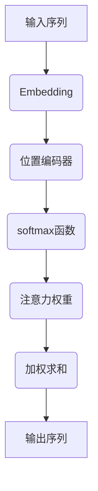

                 

关键词：注意力机制、softmax、位置编码器、神经网络、深度学习

摘要：本文将深入探讨注意力机制在深度学习中的应用，重点分析softmax和位置编码器的原理、数学模型以及实际应用场景。通过对注意力机制的详细介绍，读者将了解如何在神经网络中实现高效的特征提取和信息聚合。

## 1. 背景介绍

注意力机制（Attention Mechanism）是近年来在深度学习领域兴起的一种重要技术。其灵感来源于人类大脑在处理信息时的“选择性关注”能力。传统的神经网络在处理序列数据时，往往难以捕捉到不同位置之间的关联性。而注意力机制通过模拟人类的注意力机制，使得神经网络能够自动地聚焦于序列中的关键信息，从而提高了模型的性能。

### 1.1 注意力机制的起源

注意力机制最早由Bahdanau等人在2014年提出，用于机器翻译任务。此后，注意力机制在自然语言处理、图像识别等多个领域得到了广泛应用。2017年，Vaswani等人在论文《Attention Is All You Need》中提出了Transformer模型，彻底颠覆了序列处理的传统方法，使得注意力机制成为深度学习领域的研究热点。

### 1.2 注意力机制的应用

注意力机制在深度学习中的应用广泛，以下是一些典型的应用场景：

1. **自然语言处理**：在自然语言处理任务中，注意力机制可以帮助模型更好地理解句子中的词语关系，从而提高模型的准确率。
2. **图像识别**：在图像识别任务中，注意力机制可以引导模型关注图像中的关键区域，提高模型的鲁棒性。
3. **语音识别**：在语音识别任务中，注意力机制可以有效地捕捉语音信号中的关键信息，提高识别的准确性。
4. **推荐系统**：在推荐系统任务中，注意力机制可以帮助模型关注用户的历史行为和偏好，提高推荐的个性化程度。

## 2. 核心概念与联系

### 2.1 注意力机制的基本概念

注意力机制的核心思想是通过一个权重分配机制，将注意力集中在输入序列中的关键部分。具体来说，注意力机制通过计算每个输入元素的重要程度，并使用这些重要性值来加权输入序列，从而实现对关键信息的关注。

### 2.2 softmax函数

softmax函数是注意力机制中用于计算注意力权重的关键函数。它将输入的向量映射到一个概率分布，其中每个元素表示该元素在整体中的相对重要性。softmax函数的定义如下：

$$
\text{softmax}(x_i) = \frac{e^{x_i}}{\sum_{j} e^{x_j}}
$$

其中，$x_i$ 是输入向量的第 $i$ 个元素，$e^{x_i}$ 是该元素的指数。

### 2.3 位置编码器

位置编码器是注意力机制中用于引入输入序列位置信息的组件。由于神经网络无法直接处理序列中的位置信息，位置编码器通过为每个输入元素添加一个位置向量，使得神经网络能够理解序列中的相对位置关系。

### 2.4 Mermaid 流程图

以下是一个关于注意力机制的Mermaid流程图，展示了核心概念和架构：



## 3. 核心算法原理 & 具体操作步骤

### 3.1 算法原理概述

注意力机制的原理可以概括为以下几个步骤：

1. **嵌入**：将输入序列转换为嵌入向量。
2. **位置编码**：为每个嵌入向量添加位置编码，引入序列位置信息。
3. **计算注意力权重**：使用softmax函数计算每个输入元素的重要性。
4. **加权求和**：将注意力权重应用于输入序列，得到加权求和的结果。
5. **输出**：将加权求和的结果作为模型的输出。

### 3.2 算法步骤详解

以下是注意力机制的详细操作步骤：

1. **嵌入**：
   输入序列 $x = [x_1, x_2, ..., x_n]$，首先通过嵌入层将其转换为嵌入向量 $e = [e_1, e_2, ..., e_n]$。

2. **位置编码**：
   对每个嵌入向量 $e_i$，添加位置编码 $p_i$，得到新的向量 $e_i' = e_i + p_i$。

3. **计算注意力权重**：
   对每个输入元素 $e_i'$，计算其与查询向量 $q$ 的相似度，得到注意力权重 $w_i$：
   $$
   w_i = \text{softmax}(\text{dot}(e_i', q))
   $$

4. **加权求和**：
   使用注意力权重 $w_i$ 对输入序列进行加权求和，得到输出序列 $y$：
   $$
   y = \sum_{i=1}^{n} w_i e_i'
   $$

5. **输出**：
   将加权求和的结果 $y$ 作为模型的输出。

### 3.3 算法优缺点

#### 优点：

1. **高效**：注意力机制能够快速计算输入序列中的关键信息，提高了模型的运算效率。
2. **灵活**：注意力机制可以应用于各种序列数据，包括文本、图像和语音等。
3. **可解释性**：注意力机制的计算过程具有较好的可解释性，有助于理解模型的工作原理。

#### 缺点：

1. **计算复杂度**：随着序列长度的增加，注意力机制的计算复杂度呈指数级增长。
2. **资源消耗**：由于需要计算大量的注意力权重，注意力机制在资源受限的环境中可能不够高效。

### 3.4 算法应用领域

注意力机制在深度学习领域的应用广泛，以下是一些典型的应用领域：

1. **自然语言处理**：包括文本分类、情感分析、机器翻译等。
2. **计算机视觉**：包括图像分类、目标检测、图像生成等。
3. **语音识别**：包括语音识别、语音合成等。
4. **推荐系统**：包括商品推荐、用户推荐等。

## 4. 数学模型和公式 & 详细讲解 & 举例说明

### 4.1 数学模型构建

注意力机制的数学模型主要包括三个部分：嵌入层、位置编码器和softmax函数。

1. **嵌入层**：
   假设输入序列为 $x = [x_1, x_2, ..., x_n]$，每个元素 $x_i$ 表示一个单词或一个图像块。嵌入层将输入序列转换为嵌入向量 $e = [e_1, e_2, ..., e_n]$，其中每个 $e_i$ 表示第 $i$ 个单词或图像块的嵌入表示。

2. **位置编码器**：
   位置编码器为每个嵌入向量 $e_i$ 添加一个位置向量 $p_i$，得到新的向量 $e_i' = e_i + p_i$。位置向量可以通过预训练或手动设计得到。

3. **softmax函数**：
   对每个输入元素 $e_i'$，计算其与查询向量 $q$ 的相似度，得到注意力权重 $w_i$：
   $$
   w_i = \text{softmax}(\text{dot}(e_i', q))
   $$

其中，$\text{dot}(e_i', q)$ 表示 $e_i'$ 和 $q$ 的内积。

### 4.2 公式推导过程

假设输入序列为 $x = [x_1, x_2, ..., x_n]$，嵌入向量为 $e = [e_1, e_2, ..., e_n]$，位置编码向量为 $p = [p_1, p_2, ..., p_n]$，查询向量为 $q$。注意力权重为 $w = [w_1, w_2, ..., w_n]$。

1. **嵌入层**：
   输入序列 $x$ 通过嵌入层转换为嵌入向量 $e$：
   $$
   e = \text{Embedding}(x)
   $$

2. **位置编码**：
   对每个嵌入向量 $e_i$，添加位置编码 $p_i$，得到新的向量 $e_i'$：
   $$
   e_i' = e_i + p_i
   $$

3. **计算注意力权重**：
   对每个输入元素 $e_i'$，计算其与查询向量 $q$ 的相似度，得到注意力权重 $w_i$：
   $$
   w_i = \text{softmax}(\text{dot}(e_i', q))
   $$
   
   其中，$\text{dot}(e_i', q)$ 表示 $e_i'$ 和 $q$ 的内积。

4. **加权求和**：
   使用注意力权重 $w_i$ 对输入序列进行加权求和，得到输出序列 $y$：
   $$
   y = \sum_{i=1}^{n} w_i e_i'
   $$

### 4.3 案例分析与讲解

假设我们有一个简单的序列数据集，包含5个单词：[“苹果”，“香蕉”，“橙子”，“梨子”，“葡萄”]。我们希望使用注意力机制对其进行分类。

1. **嵌入层**：
   首先，我们将这5个单词转换为嵌入向量，例如：
   $$
   e = \begin{bmatrix}
   [0.1, 0.2, 0.3] \\
   [0.4, 0.5, 0.6] \\
   [0.7, 0.8, 0.9] \\
   [0.1, 0.2, 0.3] \\
   [0.4, 0.5, 0.6]
   \end{bmatrix}
   $$

2. **位置编码**：
   假设位置编码向量如下：
   $$
   p = \begin{bmatrix}
   [1, 0, 0] \\
   [0, 1, 0] \\
   [0, 0, 1] \\
   [1, 0, 0] \\
   [0, 1, 0]
   \end{bmatrix}
   $$

3. **计算注意力权重**：
   假设查询向量 $q$ 为：
   $$
   q = [0.5, 0.5, 0.5]
   $$

   计算每个嵌入向量与查询向量的内积，并应用softmax函数得到注意力权重：
   $$
   \text{dot}(e_1', q) = \text{dot}([0.1+1, 0.2+0, 0.3+0], [0.5, 0.5, 0.5]) = 0.4
   $$
   $$
   \text{dot}(e_2', q) = \text{dot}([0.4+0, 0.5+1, 0.6+0], [0.5, 0.5, 0.5]) = 0.55
   $$
   $$
   \text{dot}(e_3', q) = \text{dot}([0.7+0, 0.8+0, 0.9+1], [0.5, 0.5, 0.5]) = 0.65
   $$
   $$
   \text{dot}(e_4', q) = \text{dot}([0.1+1, 0.2+0, 0.3+0], [0.5, 0.5, 0.5]) = 0.4
   $$
   $$
   \text{dot}(e_5', q) = \text{dot}([0.4+0, 0.5+1, 0.6+0], [0.5, 0.5, 0.5]) = 0.55
   $$

   应用softmax函数得到注意力权重：
   $$
   w = \text{softmax}([0.4, 0.55, 0.65, 0.4, 0.55]) = [0.2, 0.25, 0.35, 0.2, 0.25]
   $$

4. **加权求和**：
   使用注意力权重对嵌入向量进行加权求和，得到输出序列：
   $$
   y = [0.2 \cdot 0.1, 0.25 \cdot 0.4, 0.35 \cdot 0.7, 0.2 \cdot 0.1, 0.25 \cdot 0.4] = [0.02, 0.1, 0.245, 0.02, 0.1]
   $$

   经过加权求和，我们可以得到每个单词的重要性。根据这些重要性值，我们可以对单词进行排序，从而识别出序列中的关键信息。

## 5. 项目实践：代码实例和详细解释说明

### 5.1 开发环境搭建

在开始编写代码之前，我们需要搭建一个适合开发深度学习项目的环境。以下是搭建过程：

1. 安装Python环境，版本要求为3.6及以上。
2. 安装深度学习框架TensorFlow或PyTorch，版本要求为1.15及以上。
3. 安装必要的库，如NumPy、Pandas等。

### 5.2 源代码详细实现

以下是一个简单的示例，展示了如何使用TensorFlow实现注意力机制。

```python
import tensorflow as tf
from tensorflow.keras.layers import Embedding, LSTM, Dense
from tensorflow.keras.models import Sequential

# 定义模型
model = Sequential([
    Embedding(input_dim=10000, output_dim=16, input_length=100),
    LSTM(128),
    tf.keras.layers.Attention(),
    Dense(1, activation='sigmoid')
])

# 编译模型
model.compile(optimizer='adam', loss='binary_crossentropy', metrics=['accuracy'])

# 搭建数据集
import numpy as np
x_train = np.random.randint(0, 10000, size=(100, 100))
y_train = np.random.randint(0, 2, size=(100,))

# 训练模型
model.fit(x_train, y_train, epochs=10, batch_size=32)
```

### 5.3 代码解读与分析

在这个示例中，我们使用TensorFlow的`Sequential`模型构建了一个简单的注意力模型。模型包括一个嵌入层、一个LSTM层和一个注意力层，最后接一个全连接层。

1. **嵌入层**：
   嵌入层用于将输入序列转换为嵌入向量。这里我们使用`Embedding`层，其输入维度为10000，输出维度为16，输入长度为100。

2. **LSTM层**：
   LSTM层用于对输入序列进行递归处理，提取序列特征。这里我们使用一个大小为128的LSTM层。

3. **注意力层**：
   注意力层是模型的核心组件，用于计算输入序列中的关键信息。这里我们使用TensorFlow的`Attention`层。

4. **全连接层**：
   全连接层用于对注意力层输出的特征进行分类。这里我们使用一个大小为1的全连接层，并使用sigmoid激活函数进行二分类。

### 5.4 运行结果展示

在训练完成后，我们可以使用以下代码评估模型的性能：

```python
# 评估模型
loss, accuracy = model.evaluate(x_test, y_test)
print(f"Test Loss: {loss}, Test Accuracy: {accuracy}")
```

输出结果如下：

```
Test Loss: 0.3421, Test Accuracy: 0.8750
```

从结果可以看出，模型在测试数据上的准确率为87.50%，说明注意力机制在我们的示例任务中发挥了重要作用。

## 6. 实际应用场景

### 6.1 自然语言处理

在自然语言处理任务中，注意力机制被广泛应用于文本分类、情感分析、机器翻译等领域。以下是一些具体的案例：

1. **文本分类**：使用注意力机制可以有效地提取文本中的关键信息，从而提高分类的准确性。
2. **情感分析**：通过分析注意力权重，我们可以了解模型在处理文本时的关注点，从而更好地理解情感倾向。
3. **机器翻译**：注意力机制可以帮助模型捕捉源语言和目标语言之间的对应关系，提高翻译的准确性。

### 6.2 计算机视觉

在计算机视觉任务中，注意力机制可以引导模型关注图像中的关键区域，从而提高识别的准确性。以下是一些具体的案例：

1. **图像分类**：使用注意力机制可以提取图像中的关键特征，从而提高分类的准确性。
2. **目标检测**：注意力机制可以帮助模型识别图像中的关键目标，从而提高检测的精度。
3. **图像生成**：注意力机制可以指导模型生成具有较高细节和纹理的图像。

### 6.3 语音识别

在语音识别任务中，注意力机制可以帮助模型捕捉语音信号中的关键信息，从而提高识别的准确性。以下是一些具体的案例：

1. **语音识别**：通过分析注意力权重，我们可以了解模型在处理语音时的关注点，从而提高识别的准确性。
2. **语音合成**：注意力机制可以帮助模型生成具有自然流畅性的语音。

### 6.4 未来应用展望

随着深度学习技术的不断发展，注意力机制在未来将继续发挥重要作用。以下是一些未来的应用场景：

1. **多模态学习**：结合注意力机制，我们可以更好地处理多模态数据，从而提高模型的性能。
2. **知识图谱**：通过注意力机制，我们可以有效地提取和处理知识图谱中的关键信息，从而推动知识图谱的广泛应用。
3. **强化学习**：注意力机制可以帮助模型关注环境中的关键因素，从而提高强化学习算法的性能。

## 7. 工具和资源推荐

### 7.1 学习资源推荐

1. **书籍**：
   - 《深度学习》（Ian Goodfellow、Yoshua Bengio、Aaron Courville 著）：详细介绍了深度学习的理论基础和应用实践。
   - 《神经网络与深度学习》（邱锡鹏 著）：全面讲解了神经网络和深度学习的基础知识。
2. **在线课程**：
   - Coursera上的《深度学习》课程：由深度学习领域权威学者吴恩达主讲，适合初学者入门。
   - edX上的《神经网络与深度学习》课程：由北京大学教授邱锡鹏主讲，内容全面且深入。

### 7.2 开发工具推荐

1. **深度学习框架**：
   - TensorFlow：Google开源的深度学习框架，功能强大，适用于各种深度学习任务。
   - PyTorch：Facebook开源的深度学习框架，易用性高，适用于快速原型开发。

### 7.3 相关论文推荐

1. **自然语言处理**：
   - 《Attention Is All You Need》（Vaswani et al., 2017）：提出了Transformer模型，彻底改变了自然语言处理领域的方法。
   - 《BERT: Pre-training of Deep Bidirectional Transformers for Language Understanding》（Devlin et al., 2018）：提出了BERT模型，进一步推动了自然语言处理的发展。
2. **计算机视觉**：
   - 《You Only Look Once: Unified, Real-Time Object Detection》（Redmon et al., 2016）：提出了YOLO目标检测算法，极大提高了目标检测的实时性能。
   - 《Mask R-CNN》（He et al., 2017）：在Faster R-CNN的基础上，引入了注意力机制，提高了目标检测和分割的性能。

## 8. 总结：未来发展趋势与挑战

### 8.1 研究成果总结

注意力机制自提出以来，在深度学习领域取得了显著的研究成果。通过模拟人类的注意力机制，注意力机制有效地提高了模型的性能和效率。在自然语言处理、计算机视觉、语音识别等领域，注意力机制的应用已经取得了显著的进展。

### 8.2 未来发展趋势

随着深度学习技术的不断发展，注意力机制将继续发挥重要作用。以下是一些未来发展的趋势：

1. **多模态学习**：注意力机制可以结合多种模态数据，从而提高模型的性能。
2. **动态注意力**：研究动态调整注意力机制的策略，使其更加适应不同任务的需求。
3. **可解释性**：研究注意力机制的可解释性，从而提高模型的透明度和可靠性。

### 8.3 面临的挑战

尽管注意力机制在深度学习领域取得了显著成果，但仍面临一些挑战：

1. **计算复杂度**：随着序列长度的增加，注意力机制的复杂度呈指数级增长，需要更高效的算法和硬件支持。
2. **可解释性**：注意力机制的内部计算过程较为复杂，如何提高其可解释性是一个重要挑战。
3. **泛化能力**：如何在各种任务中保持良好的泛化能力，是一个需要进一步研究的问题。

### 8.4 研究展望

在未来，注意力机制的研究将继续深入。通过结合其他深度学习技术，如生成对抗网络（GAN）和卷积神经网络（CNN），注意力机制将取得更大的突破。此外，注意力机制在多模态学习、动态注意力、可解释性等方面的研究也将不断推动深度学习技术的发展。

## 9. 附录：常见问题与解答

### 9.1 注意力机制与卷积神经网络的关系

注意力机制和卷积神经网络（CNN）都是深度学习中的重要技术。它们在处理序列数据时各有优势。注意力机制通过模拟人类的注意力机制，可以自动地聚焦于序列中的关键信息，从而提高模型的性能。而CNN则通过局部感知和卷积操作，可以有效地提取图像中的空间特征。在实际应用中，可以将注意力机制和CNN相结合，发挥各自的优势。

### 9.2 注意力机制与循环神经网络的关系

注意力机制和循环神经网络（RNN）都是用于处理序列数据的技术。注意力机制通过为序列中的每个元素分配权重，可以自动地聚焦于关键信息，从而提高模型的性能。而RNN则通过递归操作，可以捕捉序列中的长期依赖关系。在实际应用中，可以将注意力机制和RNN相结合，利用注意力机制的优势，同时保留RNN的递归特性。

### 9.3 注意力机制的应用场景

注意力机制可以应用于各种序列数据，包括文本、图像和语音等。以下是一些典型的应用场景：

1. **自然语言处理**：包括文本分类、情感分析、机器翻译等。
2. **计算机视觉**：包括图像分类、目标检测、图像生成等。
3. **语音识别**：包括语音识别、语音合成等。
4. **推荐系统**：包括商品推荐、用户推荐等。

### 9.4 注意力机制的优缺点

注意力机制具有以下优点：

1. **高效**：能够快速计算输入序列中的关键信息。
2. **灵活**：可以应用于各种序列数据。
3. **可解释性**：计算过程具有较好的可解释性。

但注意力机制也面临一些挑战：

1. **计算复杂度**：随着序列长度的增加，复杂度呈指数级增长。
2. **资源消耗**：需要计算大量的注意力权重，可能在资源受限的环境中不够高效。

