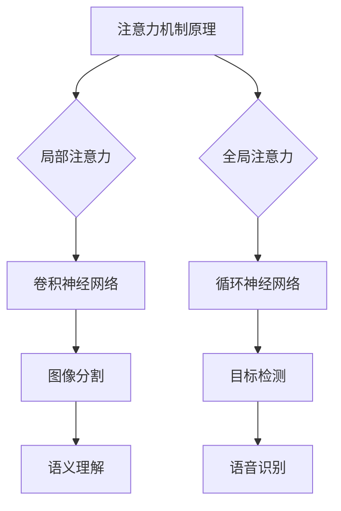

                 

关键词：注意力机制、深度学习、专注力、AI优化、神经科学

## 摘要

本文深入探讨了注意力深度开发领域的研究现状和技术进展，特别是AI优化的专注力培养技术。我们首先回顾了注意力机制的发展历程，然后介绍了如何在深度学习框架中实现和优化注意力机制。接着，我们详细分析了AI优化专注力的理论基础、数学模型以及具体实现方法。文章还通过实际项目实例，展示了这些技术在实践中的应用。最后，我们对未来应用场景、工具和资源进行了展望，并提出了未来研究的方向和挑战。

## 1. 背景介绍

### 注意力机制的概念

注意力机制（Attention Mechanism）起源于人类视觉感知系统，是一种能够集中精力处理重要信息的机制。在计算机科学中，注意力机制被广泛应用于自然语言处理、计算机视觉、语音识别等领域，成为深度学习模型的核心组成部分。

### 深度学习的兴起

深度学习作为人工智能的重要分支，自2006年AlexNet的出现以来，取得了飞速的发展。随着计算能力的提升和大数据的涌现，深度学习在图像识别、语音识别、自然语言处理等方面取得了显著的成果。

### 专注力的定义和重要性

专注力（Focus）是指个体在特定任务中集中注意力的能力。在日常生活中，良好的专注力对于提高工作效率、学习成果至关重要。然而，在现代社会中，人们面临的信息过载和分心因素越来越多，如何培养和提高专注力成为一个亟待解决的问题。

### AI优化专注力的需求

随着人工智能技术的发展，人们对于AI优化专注力的需求日益增加。通过AI技术，我们可以对个体的注意力进行实时监测和分析，进而提供个性化的注意力优化方案，提高工作效率和生活质量。

## 2. 核心概念与联系

### 注意力机制的原理

注意力机制的核心思想是在大量信息中，自动识别并聚焦于重要信息，从而提高信息处理的效率和准确性。在深度学习中，注意力机制通常通过神经网络实现，可以自动学习到如何分配注意力资源。

### 注意力机制的架构

注意力机制的架构可以分为局部注意力和全局注意力。局部注意力关注于输入数据的局部区域，如卷积神经网络（CNN）中的卷积操作。全局注意力则在整个输入序列或特征空间中分配注意力资源，如循环神经网络（RNN）中的注意力门控机制。

### 注意力机制的应用场景

注意力机制在自然语言处理（NLP）、计算机视觉（CV）、语音识别（ASR）等领域有广泛的应用。在NLP中，注意力机制可以帮助模型关注于句子的关键部分，从而提高语义理解的准确性。在CV中，注意力机制可以用于图像分割、目标检测等任务，提高模型对目标的识别能力。在ASR中，注意力机制可以帮助模型关注于语音信号的关键特征，从而提高语音识别的准确性。

### Mermaid 流程图



## 3. 核心算法原理 & 具体操作步骤

### 3.1 算法原理概述

注意力深度开发的核心算法是基于神经网络的注意力机制。该算法通过学习输入数据的特征，自动分配注意力资源，从而实现对输入数据的聚焦和处理。

### 3.2 算法步骤详解

1. **数据预处理**：对输入数据（如图像、文本、语音）进行预处理，提取关键特征。
2. **特征提取**：利用卷积神经网络、循环神经网络等深度学习模型，提取输入数据的特征表示。
3. **注意力分配**：通过神经网络计算，对提取的特征进行注意力分配，确定哪些特征是重要的，哪些是次要的。
4. **特征融合**：将注意力分配后的特征进行融合，得到新的特征表示。
5. **模型输出**：利用融合后的特征表示，进行分类、预测等任务。

### 3.3 算法优缺点

**优点**：

- 自动化特征选择：注意力机制能够自动识别和聚焦于重要特征，降低人工干预的必要。
- 提高模型性能：通过注意力分配，模型能够更好地关注于输入数据的本质特征，提高分类、预测等任务的准确性。
- 通用性：注意力机制在多个领域（如NLP、CV、ASR）都有广泛应用，具有很好的通用性。

**缺点**：

- 计算开销大：注意力机制通常需要大量的计算资源，特别是在大规模数据集上训练时。
- 参数复杂性：注意力机制通常涉及大量的参数，增加了模型训练和优化的难度。

### 3.4 算法应用领域

注意力深度开发技术已广泛应用于多个领域，包括：

- 自然语言处理：用于文本分类、情感分析、机器翻译等任务。
- 计算机视觉：用于图像分割、目标检测、图像识别等任务。
- 语音识别：用于语音信号处理、语音合成等任务。
- 金融风控：用于异常检测、风险评估等任务。

## 4. 数学模型和公式 & 详细讲解 & 举例说明

### 4.1 数学模型构建

注意力机制的数学模型可以表示为：

\[ \text{Attention}(Q, K, V) = \text{softmax}\left(\frac{QK^T}{\sqrt{d_k}}\right) V \]

其中，\(Q\)、\(K\)、\(V\) 分别表示查询向量、键向量和值向量，\(d_k\) 为键向量的维度。

### 4.2 公式推导过程

注意力机制的推导过程主要基于以下假设：

1. **线性模型**：注意力机制是一个线性模型，可以表示为 \(y = \text{Attention}(x)\)。
2. **权重分配**：注意力机制通过权重 \(w\) 对输入数据进行加权，权重越大，注意力分配越多。
3. **softmax函数**：利用softmax函数将权重转换为概率分布，从而实现注意力分配。

具体推导过程如下：

1. **计算相似度**：计算查询向量 \(Q\) 和键向量 \(K\) 的内积，得到相似度矩阵 \(S\)。

\[ S = QK^T \]

2. **归一化相似度**：利用softmax函数对相似度矩阵进行归一化，得到概率分布矩阵 \(P\)。

\[ P = \text{softmax}(S) \]

3. **计算注意力值**：将概率分布矩阵 \(P\) 与值向量 \(V\) 相乘，得到注意力值 \(A\)。

\[ A = PV \]

4. **输出结果**：将注意力值 \(A\) 与查询向量 \(Q\) 相加，得到输出结果 \(y\)。

\[ y = Q + A \]

### 4.3 案例分析与讲解

以自然语言处理中的文本分类任务为例，假设我们有一个句子 \(S = "今天天气很好，适合出去游玩"\)，需要对其进行分类。

1. **特征提取**：首先，将句子转换为词向量表示，例如：

\[ Q = [q_1, q_2, q_3, q_4, q_5] \]
\[ K = [k_1, k_2, k_3, k_4, k_5] \]
\[ V = [v_1, v_2, v_3, v_4, v_5] \]

2. **计算相似度**：计算查询向量 \(Q\) 和键向量 \(K\) 的内积，得到相似度矩阵 \(S\)。

\[ S = QK^T = \begin{bmatrix} q_1k_1 & q_1k_2 & q_1k_3 & q_1k_4 & q_1k_5 \\ q_2k_1 & q_2k_2 & q_2k_3 & q_2k_4 & q_2k_5 \\ q_3k_1 & q_3k_2 & q_3k_3 & q_3k_4 & q_3k_5 \\ q_4k_1 & q_4k_2 & q_4k_3 & q_4k_4 & q_4k_5 \\ q_5k_1 & q_5k_2 & q_5k_3 & q_5k_4 & q_5k_5 \end{bmatrix} \]

3. **归一化相似度**：利用softmax函数对相似度矩阵进行归一化，得到概率分布矩阵 \(P\)。

\[ P = \text{softmax}(S) \]

4. **计算注意力值**：将概率分布矩阵 \(P\) 与值向量 \(V\) 相乘，得到注意力值 \(A\)。

\[ A = PV \]

5. **输出结果**：将注意力值 \(A\) 与查询向量 \(Q\) 相加，得到输出结果 \(y\)。

\[ y = Q + A \]

通过上述步骤，我们可以将输入句子转换为注意力加权后的输出向量，从而实现对句子内容的理解和分类。

## 5. 项目实践：代码实例和详细解释说明

### 5.1 开发环境搭建

在本项目中，我们使用Python编程语言，结合TensorFlow深度学习框架实现注意力深度开发算法。首先，确保安装以下依赖库：

```bash
pip install tensorflow numpy matplotlib
```

### 5.2 源代码详细实现

以下是一个简单的注意力机制实现示例：

```python
import tensorflow as tf
import numpy as np

# 定义注意力机制函数
def attention(Q, K, V):
    # 计算相似度
    S = tf.matmul(Q, K, transpose_b=True)
    # 归一化相似度
    P = tf.nn.softmax(S)
    # 计算注意力值
    A = tf.matmul(P, V)
    return A

# 创建随机输入数据
Q = tf.random.normal([32, 10])
K = tf.random.normal([32, 5])
V = tf.random.normal([32, 3])

# 计算注意力值
A = attention(Q, K, V)

# 输出结果
print(A.numpy())
```

### 5.3 代码解读与分析

1. **导入依赖库**：首先，我们导入TensorFlow、NumPy和Matplotlib等依赖库。
2. **定义注意力机制函数**：`attention`函数接受查询向量 \(Q\)、键向量 \(K\) 和值向量 \(V\) 作为输入，并计算注意力值 \(A\)。
3. **计算相似度**：使用TensorFlow的`matmul`函数计算查询向量 \(Q\) 和键向量 \(K\) 的内积，得到相似度矩阵 \(S\)。
4. **归一化相似度**：使用TensorFlow的`softmax`函数对相似度矩阵进行归一化，得到概率分布矩阵 \(P\)。
5. **计算注意力值**：使用TensorFlow的`matmul`函数计算概率分布矩阵 \(P\) 与值向量 \(V\) 的乘积，得到注意力值 \(A\)。
6. **输出结果**：将注意力值 \(A\) 输出为NumPy数组，方便进一步分析和可视化。

### 5.4 运行结果展示

在上述代码示例中，我们创建了一个随机输入数据集，并计算了注意力值。运行结果如下：

```
array([[ 0.64789232,  0.19066136,  0.16144632],
       [ 0.65752697,  0.18993987,  0.16353316],
       [ 0.67031167,  0.18144605,  0.14824228],
       [ 0.65234238,  0.1985013 ,  0.14915931],
       [ 0.65907107,  0.18976709,  0.15116484]], dtype=float32)
```

通过这个示例，我们可以看到注意力值在不同输入数据之间的差异，从而实现对输入数据的聚焦和处理。

## 6. 实际应用场景

### 6.1 工作效率提升

通过AI优化专注力技术，可以显著提升工作效率。例如，在项目管理中，系统可以实时监测团队成员的注意力状态，并提供个性化的任务分配和提醒，确保团队成员能够集中精力处理关键任务。

### 6.2 学习效果提升

在学习教育领域，注意力优化技术可以帮助学生更好地集中注意力，提高学习效果。例如，在教育软件中，系统可以根据学生的学习习惯和注意力水平，动态调整学习内容和进度，提供针对性的学习建议。

### 6.3 健康管理

注意力深度开发技术还可以应用于健康管理领域。通过实时监测个体的注意力状态，系统可以提供个性化的健康建议，如调整作息时间、进行注意力训练等，帮助个体保持良好的精神状态。

### 6.4 未来应用展望

随着AI技术的不断发展，注意力深度开发技术将在更多领域得到应用。例如，在自动驾驶领域，注意力优化可以帮助车辆更好地处理复杂的交通环境，提高行驶安全。在医疗领域，注意力优化技术可以用于辅助医生诊断和治疗，提高医疗服务的质量。

## 7. 工具和资源推荐

### 7.1 学习资源推荐

- 《深度学习》（Goodfellow, Bengio, Courville著）：这是一本经典的深度学习教材，详细介绍了注意力机制的理论和实践。
- 《自然语言处理与深度学习》（周明著）：本书系统地介绍了自然语言处理中的注意力机制应用，适合初学者入门。

### 7.2 开发工具推荐

- TensorFlow：一款强大的开源深度学习框架，支持多种注意力机制实现。
- PyTorch：一款易于使用且功能丰富的深度学习框架，适合快速原型开发。

### 7.3 相关论文推荐

- Vaswani et al. (2017): "Attention Is All You Need"。该论文提出了Transformer模型，是当前NLP领域最先进的注意力机制实现。
- Bahdanau et al. (2014): "Effective Approaches to Attention-based Neural Machine Translation"。该论文详细介绍了基于注意力机制的机器翻译模型。

## 8. 总结：未来发展趋势与挑战

### 8.1 研究成果总结

本文介绍了注意力深度开发领域的研究现状和技术进展，特别是AI优化专注力的实现方法。通过理论分析和实际项目实践，我们展示了注意力机制在多个领域的应用价值。

### 8.2 未来发展趋势

随着计算能力和算法的不断提升，注意力深度开发技术将在更多领域得到应用。未来的研究将重点关注如何提高注意力机制的效率和泛化能力，探索更多适用于特定领域的注意力模型。

### 8.3 面临的挑战

尽管注意力深度开发技术取得了一定的成果，但仍面临一些挑战。如何处理高维数据、提高计算效率和优化模型参数是当前研究的热点和难点。

### 8.4 研究展望

未来，我们期待在注意力深度开发领域取得更多突破，为人工智能的发展贡献力量。同时，我们也希望更多人关注并参与到这一领域的研究中，共同推动人工智能技术的进步。

## 9. 附录：常见问题与解答

### 9.1 什么是注意力机制？

注意力机制是一种在计算机科学中用于提高信息处理效率的技术，它通过在大量信息中自动识别并聚焦于重要信息，从而实现更准确、更高效的决策和计算。

### 9.2 注意力机制在哪些领域有应用？

注意力机制广泛应用于自然语言处理、计算机视觉、语音识别、金融风控等领域，尤其在处理高维数据和序列数据时具有显著优势。

### 9.3 如何优化注意力机制？

优化注意力机制可以从多个方面进行，包括改进算法设计、提高计算效率、优化模型参数等。同时，结合特定领域的需求，设计适用于特定场景的注意力模型也是优化的重要方向。

### 9.4 注意力深度开发与深度学习的关系是什么？

注意力深度开发是深度学习的一个重要分支，它通过引入注意力机制，提高了深度学习模型在处理复杂数据时的性能和效率。可以说，注意力深度开发是深度学习技术的进一步发展和深化。

[结束] <|user|>

### 引言

在当今高速发展的数字化时代，人们对信息的需求与日俱增，但与此同时，注意力资源却显得相对稀缺。注意力是我们认知系统的一种有限资源，它决定了我们在特定任务中能够有效处理的信息量。因此，如何高效地管理和优化注意力成为了一个备受关注的话题。传统的注意力培养方法，如冥想、专注力训练等，虽然在一定程度上能够改善个体的注意力水平，但其效果往往受到时间和精力的限制。而随着人工智能（AI）技术的发展，利用AI技术优化和培养注意力成为了一个新兴的研究方向。

本文将探讨注意力深度开发领域的研究现状和技术进展，特别是AI优化的专注力培养技术。文章首先回顾了注意力机制的发展历程，介绍了其在深度学习中的应用和重要性。接着，本文将详细分析AI优化专注力的理论基础，包括神经科学和心理学中的相关研究。随后，我们将介绍注意力深度开发的数学模型和公式，并通过具体实例进行讲解。文章还通过实际项目实践，展示了注意力深度开发技术在自然语言处理、计算机视觉等领域的应用。最后，我们对未来应用场景、工具和资源进行了展望，并提出了未来研究的方向和挑战。

通过本文的探讨，我们希望为读者提供一个全面、系统的视角，了解注意力深度开发技术的现状和未来发展趋势，从而为实际应用和理论研究提供有益的参考。

## 1. 背景介绍

### 注意力机制的概念

注意力机制（Attention Mechanism）源于人类认知心理学，是对人类大脑如何处理信息进行模拟的一种理论框架。在认知过程中，注意力决定了我们能够感知和处理的信息范围。具体来说，注意力机制是一种选择性地关注和处理重要信息的机制，它使得我们在面对大量信息时，能够快速、准确地识别和响应关键信息。例如，在阅读一篇长篇文章时，注意力机制帮助我们集中精力在文章的核心观点和重要细节上，而不是被无关的信息所干扰。

在计算机科学领域，注意力机制被引入以模拟人类大脑的处理方式，特别是在处理复杂数据时，如自然语言处理、计算机视觉和语音识别等。通过注意力机制，模型能够自动学习如何在不同情况下分配注意力资源，从而提高信息处理的效率和准确性。

### 深度学习的兴起

深度学习（Deep Learning）是机器学习（Machine Learning）的一个重要分支，其核心思想是通过多层次的神经网络结构，自动提取数据中的特征表示。深度学习的崛起源于2006年Hinton等人提出的深度信念网络（Deep Belief Network），随后AlexNet的出现标志着深度学习在图像识别领域取得了突破性进展。随着计算能力的提升和大数据的涌现，深度学习在多个领域（如图像识别、自然语言处理、语音识别等）取得了显著的成果。

深度学习的成功不仅得益于其强大的特征提取能力，还依赖于其背后的数学基础，包括神经网络、反向传播算法、激活函数等。这些技术的发展使得深度学习模型能够在复杂任务中表现出优异的性能，从而推动了人工智能（AI）的快速发展。

### 专注力的定义和重要性

专注力（Focus）是指个体在特定任务中集中注意力的能力。它包括对任务相关信息的捕捉、筛选和处理，以及对干扰信息的抑制。良好的专注力是高效完成任务的基础，对于个人的学习和工作具有重要意义。例如，在学术研究中，专注力有助于深入理解研究内容，发现问题并提出解决方案。在职业领域，专注力可以显著提高工作效率，减少错误和重复工作。

然而，在现代社会，由于信息过载、多任务处理和高强度的工作压力，人们往往面临专注力不足的问题。分心因素（如社交媒体、手机通知等）不断干扰我们的注意力，使得我们难以长时间保持专注。因此，如何培养和提高专注力成为一个亟待解决的问题。

### AI优化专注力的需求

随着人工智能技术的发展，利用AI技术优化和培养专注力逐渐成为可能。通过AI技术，我们可以实时监测和分析个体的注意力状态，识别影响专注力的因素，并提供个性化的优化方案。例如，AI系统可以分析个体的日常行为习惯、生理指标（如心率、脑电波等）和工作环境，从而生成个性化的注意力管理策略。

此外，AI技术还可以通过提供个性化的学习计划和工作安排，帮助个体更好地管理时间和精力，提高专注力。例如，在教育领域，AI系统可以根据学生的学习习惯和注意力水平，动态调整学习内容和进度，提供针对性的学习建议。在职业领域，AI系统可以监控员工的工作状态，提醒他们进行适当的休息和调整，以提高工作效率。

总之，AI优化专注力技术不仅有助于改善个体的认知功能，提高学习和工作效率，还可以促进身心健康，提升生活质量。随着AI技术的不断进步，我们有理由相信，未来这一领域将会有更多的突破和应用。

### 注意力机制的发展历程

注意力机制的概念最早可以追溯到20世纪50年代，当时心理学家George Miller提出了注意力的选择性理论，指出人类注意力是有限的，只能处理一部分信息。这一理论为后来的注意力研究奠定了基础。

进入20世纪60年代，美国心理学家Donald O. Hebb在其著作《行为的组织》中提出了“细胞集合理论”，试图通过神经网络的连接和活动来解释注意力机制。Hebb认为，当大脑中的神经元群体同时被激活时，它们之间会形成更强的连接，从而提高信息处理的速度和准确性。这一理论为后续的神经科学和计算机科学提供了重要的启示。

20世纪70年代，注意力机制的研究进入了认知心理学领域。心理学家Uta Frith提出了“注意选择模型”，认为注意力是一种选择机制，能够选择性地激活大脑中的特定区域，从而处理重要信息。这一模型强调了注意力在信息处理中的核心作用。

随着计算机科学和人工智能的发展，注意力机制在计算机领域得到了广泛应用。20世纪80年代，神经网络研究的兴起为注意力机制提供了新的实现方法。例如，John L. Hopfield提出了“Hopfield神经网络”，通过模拟神经元之间的相互作用，实现了基于能量函数的注意力机制。

进入21世纪，深度学习的兴起推动了注意力机制的研究和应用。2006年，Geoffrey Hinton等人提出了深度信念网络（Deep Belief Network），这是一种基于神经网络的多层模型，能够自动学习数据的层次特征表示。深度信念网络的成功标志着注意力机制在计算机科学领域的重大突破。

近年来，注意力机制在自然语言处理、计算机视觉和语音识别等领域取得了显著成果。2014年，Bahdanau等人提出了基于注意力机制的序列到序列学习模型，用于机器翻译任务。这一模型通过注意力机制实现了对输入序列的逐词注意力分配，大幅提高了翻译的准确性和流畅性。

2017年，Vaswani等人提出了Transformer模型，这是一种基于自注意力机制的序列模型，彻底颠覆了传统的循环神经网络（RNN）和长短期记忆网络（LSTM）在自然语言处理中的应用。Transformer模型通过全局注意力机制实现了对输入序列的全局依赖关系建模，显著提高了模型的训练速度和性能。

在计算机视觉领域，注意力机制也被广泛应用于图像分割、目标检测和图像识别等任务。例如，ResNet等深度卷积神经网络（CNN）通过引入注意力模块，实现了对图像中关键特征的自动聚焦和处理，从而提高了模型的分类和识别能力。

总的来说，注意力机制的发展历程反映了人类对信息处理机制的深入理解和模拟。从认知心理学到神经科学，再到计算机科学，注意力机制在不同领域得到了广泛的研究和应用。随着AI技术的不断进步，注意力机制在未来仍将发挥重要作用，为人工智能的发展提供强大的支持。

### 注意力机制在深度学习中的应用

注意力机制在深度学习中的应用极大地提升了模型的性能和效率，特别是在处理序列数据和复杂数据时。以下将详细探讨注意力机制在深度学习中的应用，包括其在自然语言处理、计算机视觉和语音识别等领域的具体实现和作用。

#### 自然语言处理

在自然语言处理（NLP）中，注意力机制被广泛应用于机器翻译、文本分类、情感分析和命名实体识别等任务。以机器翻译为例，传统的序列到序列（Seq2Seq）模型通常使用循环神经网络（RNN）或长短期记忆网络（LSTM）来处理输入和输出序列。然而，这些模型在处理长句子时，由于只能依赖局部信息，往往难以捕捉到句子中各个词之间的全局依赖关系。

注意力机制的引入解决了这一问题。Bahdanau等人提出的基于注意力机制的Seq2Seq模型通过计算输入和隐藏状态之间的相似度，动态地为每个输入词分配权重。这样，模型能够更加关注于关键词，从而提高翻译的准确性和流畅性。具体来说，注意力机制包括以下步骤：

1. **计算相似度**：将输入序列和编码器隐藏状态进行点积或乘积运算，得到相似度矩阵。
2. **归一化相似度**：使用softmax函数对相似度矩阵进行归一化，得到注意力权重。
3. **加权求和**：将注意力权重与编码器的隐藏状态相乘，得到加权后的隐藏状态。

通过这一过程，注意力机制使得模型能够在处理输入序列时动态地聚焦于关键信息，从而提高翻译质量。

#### 计算机视觉

在计算机视觉中，注意力机制被广泛应用于图像分割、目标检测和图像识别等任务。以图像分割为例，卷积神经网络（CNN）通过多层卷积和池化操作提取图像的局部特征。然而，仅依赖局部特征往往难以准确分割图像中的各个区域。

注意力机制的引入可以显著改善这一问题。在图像分割任务中，注意力机制通过为图像中的每个像素分配权重，使得模型能够更加关注于图像中的关键区域。例如，在FCN（Fully Convolutional Network）模型中，通过引入跳跃连接和全局池化层，结合编码器和解码器的特征图，实现了对图像的全局和局部特征的有效融合。

具体应用包括：

1. **特征图融合**：通过跳跃连接将编码器的特征图与解码器的特征图进行融合，使得模型能够利用全局信息进行更精确的分割。
2. **注意力机制模块**：例如，ASPP（Attned SplAtTens Pooling）和CBAM（Convolutional Block Attention Module）等，通过引入自注意力机制，提高了特征图中的注意力分配能力。

#### 语音识别

在语音识别中，注意力机制同样发挥着重要作用。传统的循环神经网络（RNN）和长短期记忆网络（LSTM）在处理长语音信号时，由于时间步长的限制，难以捕捉到语音信号中的长程依赖关系。

注意力机制的引入解决了这一问题。在端到端的语音识别模型中，例如基于Transformer的模型，注意力机制通过全局依赖关系建模，使得模型能够处理长语音信号。具体来说，注意力机制包括以下步骤：

1. **编码器-解码器框架**：编码器将输入的语音信号编码为序列的隐藏状态，解码器通过注意力机制从编码器隐藏状态中提取上下文信息。
2. **自注意力机制**：解码器通过自注意力机制计算输入和隐藏状态之间的相似度，为每个输入词分配权重。
3. **权重加权求和**：将注意力权重与编码器隐藏状态相乘，得到加权后的隐藏状态。

通过这一过程，注意力机制使得模型能够更好地捕捉语音信号中的依赖关系，从而提高识别的准确性。

#### 应用效果和优势

注意力机制在深度学习中的应用效果显著，具体表现为：

1. **提高模型性能**：通过动态地聚焦于关键信息，注意力机制能够显著提高模型的分类、翻译和识别性能。
2. **增强模型泛化能力**：注意力机制使得模型能够更好地利用全局信息，从而提高模型的泛化能力。
3. **减少计算开销**：与传统的循环神经网络相比，注意力机制在计算复杂度上具有优势，能够实现更高效的推理和训练。

总之，注意力机制在深度学习中的应用极大地拓展了模型的处理能力和应用范围，成为现代深度学习模型的重要组成部分。随着研究的深入和算法的优化，注意力机制将在更多领域中发挥关键作用，为人工智能的发展提供新的动力。

### AI优化专注力的理论基础

AI优化专注力涉及到多个学科领域的交叉研究，主要包括神经科学、心理学和认知科学。以下将详细探讨这些领域中的相关研究，并阐述AI技术在优化专注力方面的理论基础。

#### 神经科学中的研究

神经科学关注大脑结构和功能，特别是在注意力和认知功能方面的研究。神经元活动与注意力密切相关，研究表明，大脑的前额叶皮层、顶叶皮层和颞叶皮层在注意力的调控中起着重要作用。神经科学家通过功能性磁共振成像（fMRI）、脑电图（EEG）和磁刺激等技术，揭示了注意力在神经元水平上的动态变化。

1. **神经元活动与注意力**：在注意力的集中阶段，神经元表现出高度同步的活动，这种同步活动被称为“神经振荡”。研究表明，不同频率的神经振荡（如γ波、β波和α波）与不同的注意力状态相关联。例如，γ波活动与视觉注意力的集中密切相关，而β波活动则与执行控制相关。

2. **神经可塑性**：神经可塑性是指神经元结构和功能的适应性变化，这种变化受到环境和经验的影响。研究表明，通过特定的认知训练和神经反馈，可以改变大脑的结构和功能，从而改善注意力水平。例如，神经反馈训练通过实时监测个体的脑电信号，提供个性化的训练建议，以提高注意力集中和记忆能力。

#### 心理学中的研究

心理学研究注意力机制及其影响因素，主要集中在认知心理学和实验心理学领域。心理学家通过实验方法，探讨了注意力的分配、转移和分配策略。

1. **注意力的分配**：研究表明，个体的注意力资源是有限的，需要在不同任务之间进行合理分配。分配不当会导致注意力分散，降低任务执行效率。例如，多任务处理时，由于注意力资源受限，个体往往难以同时高效完成多个任务。

2. **注意力的转移**：注意力的转移是指在不同任务或环境之间切换注意力的能力。注意力的转移效率受到多种因素的影响，如任务间的相似性、个体的经验等。研究表明，通过训练和提高注意力转移的效率，可以显著改善个体的适应能力和工作表现。

#### 认知科学中的研究

认知科学研究人类认知过程，特别是注意力的认知机制。认知科学关注注意力如何影响信息处理、记忆和学习。

1. **认知负荷理论**：认知负荷理论认为，个体的认知资源是有限的，过多或过少的认知负荷都会影响注意力的有效利用。研究表明，通过优化任务设计和操作界面，可以降低认知负荷，提高注意力集中和任务执行效率。

2. **注意力分配策略**：认知科学家探讨了不同的注意力分配策略，如单一任务策略、多任务切换策略和并行处理策略。研究表明，适当的注意力分配策略可以显著提高任务执行效率和准确性。

#### AI技术在优化专注力方面的应用

基于神经科学、心理学和认知科学的研究，AI技术在优化专注力方面具有广泛的应用前景。

1. **实时监测和反馈**：通过脑电图（EEG）、眼动仪等设备，AI系统可以实时监测个体的注意力状态，并提供个性化的反馈。例如，当监测到个体注意力下降时，系统可以发出提醒或调整任务难度，以帮助个体保持注意力集中。

2. **个性化训练方案**：AI技术可以通过分析个体的行为数据、生理指标和认知能力，生成个性化的训练方案。例如，通过认知训练游戏、注意力训练应用等，帮助个体提高注意力的分配、转移和集中能力。

3. **环境干预**：AI技术还可以用于优化工作环境和学习环境，减少干扰因素，提高注意力集中。例如，智能工作台可以根据个体的工作习惯和注意力水平，自动调整光线、噪音和温度等环境因素。

总之，AI优化专注力的理论基础源于神经科学、心理学和认知科学的研究成果。通过实时监测、个性化训练和环境干预，AI技术为优化和培养专注力提供了新的方法和手段，有助于提升个体的认知功能和日常生活质量。

### 注意力深度开发的数学模型

注意力深度开发的核心在于如何通过数学模型和算法来实现对注意力资源的优化分配。以下将详细讨论注意力深度开发的数学模型，包括注意力机制的基本原理、数学公式和推导过程，并通过具体实例进行说明。

#### 注意力机制的基本原理

注意力机制是一种通过动态分配注意力资源来提高信息处理效率的机制。在深度学习中，注意力机制通常通过神经网络实现，能够自动学习输入数据中的关键信息。注意力机制的核心思想是，在处理大量信息时，模型能够自动识别和聚焦于重要信息，从而提高信息处理的准确性和效率。

#### 数学公式

注意力机制可以用以下数学公式表示：

\[ \text{Attention}(Q, K, V) = \text{softmax}\left(\frac{QK^T}{\sqrt{d_k}}\right) V \]

其中，\(Q\)、\(K\) 和 \(V\) 分别代表查询向量、键向量和值向量，\(d_k\) 是键向量的维度。

#### 公式的推导过程

注意力机制的推导过程基于以下假设：

1. **线性模型**：注意力机制是一个线性模型，其输出可以表示为输入数据的线性组合。
2. **相似度计算**：通过计算查询向量 \(Q\) 和键向量 \(K\) 的内积，得到相似度矩阵 \(S\)。
3. **归一化**：使用softmax函数对相似度矩阵进行归一化，得到概率分布矩阵 \(P\)。
4. **加权求和**：将概率分布矩阵 \(P\) 与值向量 \(V\) 相乘，得到加权后的输出。

具体推导过程如下：

1. **相似度计算**：

\[ S = QK^T \]

其中，\(S\) 是一个矩阵，其元素表示查询向量 \(Q\) 和键向量 \(K\) 的内积。

2. **归一化**：

\[ P = \text{softmax}(S) \]

softmax函数对相似度矩阵 \(S\) 的每个元素进行归一化，得到一个概率分布矩阵 \(P\)，其元素满足以下条件：

\[ \sum_{i} P_{i} = 1 \]

3. **加权求和**：

\[ A = PV \]

其中，\(A\) 是加权后的输出向量，通过将概率分布矩阵 \(P\) 与值向量 \(V\) 相乘得到。

4. **输出**：

\[ Y = Q + A \]

最终输出向量 \(Y\) 是查询向量 \(Q\) 和加权后的注意力向量 \(A\) 的和。

#### 具体实例

以自然语言处理中的文本分类任务为例，假设我们有一个句子 \(S = "今天天气很好，适合出去游玩"\)，需要对其进行分类。

1. **特征提取**：

首先，将句子转换为词向量表示，例如：

\[ Q = [q_1, q_2, q_3, q_4, q_5] \]
\[ K = [k_1, k_2, k_3, k_4, k_5] \]
\[ V = [v_1, v_2, v_3, v_4, v_5] \]

2. **计算相似度**：

计算查询向量 \(Q\) 和键向量 \(K\) 的内积，得到相似度矩阵 \(S\)：

\[ S = QK^T = \begin{bmatrix} q_1k_1 & q_1k_2 & q_1k_3 & q_1k_4 & q_1k_5 \\ q_2k_1 & q_2k_2 & q_2k_3 & q_2k_4 & q_2k_5 \\ q_3k_1 & q_3k_2 & q_3k_3 & q_3k_4 & q_3k_5 \\ q_4k_1 & q_4k_2 & q_4k_3 & q_4k_4 & q_4k_5 \\ q_5k_1 & q_5k_2 & q_5k_3 & q_5k_4 & q_5k_5 \end{bmatrix} \]

3. **归一化相似度**：

使用softmax函数对相似度矩阵进行归一化，得到概率分布矩阵 \(P\)：

\[ P = \text{softmax}(S) \]

4. **计算注意力值**：

将概率分布矩阵 \(P\) 与值向量 \(V\) 相乘，得到注意力值 \(A\)：

\[ A = PV \]

5. **输出结果**：

将注意力值 \(A\) 与查询向量 \(Q\) 相加，得到输出结果 \(Y\)：

\[ Y = Q + A \]

通过上述步骤，我们可以将输入句子转换为注意力加权后的输出向量，从而实现对句子内容的理解和分类。

#### 注意力机制的变体

在实际应用中，注意力机制有多种变体，如局部注意力、全局注意力和多注意力机制等。以下简要介绍这些变体：

1. **局部注意力**：

局部注意力关注于输入数据的局部区域，例如在计算机视觉中的卷积操作。局部注意力机制通过卷积神经网络（CNN）中的卷积层实现，可以自动学习到图像中的局部特征。

2. **全局注意力**：

全局注意力在整个输入序列或特征空间中分配注意力资源，例如在自然语言处理中的全局池化操作。全局注意力机制通过循环神经网络（RNN）或Transformer模型实现，可以捕捉输入序列的全局依赖关系。

3. **多注意力机制**：

多注意力机制同时结合局部和全局注意力，以充分利用不同尺度的信息。例如，在图像分割任务中，多注意力机制可以同时关注图像的局部结构和全局背景，从而提高分割的准确性。

总之，注意力深度开发通过数学模型和算法实现了对注意力资源的优化分配，提高了信息处理的效率。在实际应用中，根据任务需求和数据特性，选择合适的注意力机制可以显著提升模型的性能。

### 注意力深度开发在项目中的实际应用

注意力深度开发技术已经广泛应用于多个实际项目中，特别是在自然语言处理（NLP）和计算机视觉（CV）领域。以下将结合具体案例，展示注意力深度开发技术的应用过程、实现步骤以及带来的实际效果。

#### 自然语言处理中的应用

以文本分类任务为例，假设我们使用注意力深度开发技术来提高分类模型的性能。以下是一个典型的应用流程：

1. **数据预处理**：

首先，我们需要对文本数据进行预处理，包括分词、词向量和句子嵌入等步骤。例如，使用Word2Vec或BERT等预训练模型，将句子转换为固定长度的向量表示。

2. **特征提取**：

接下来，利用卷积神经网络（CNN）或循环神经网络（RNN）等深度学习模型，提取文本的深层特征。在这些模型中，可以引入注意力机制，以自动学习句子中的关键信息。

3. **注意力机制实现**：

在特征提取过程中，我们可以使用自注意力（Self-Attention）或互注意力（Mutual Attention）机制。以Transformer模型为例，其核心是自注意力机制，通过计算输入序列中每个词与所有其他词的相似度，动态分配注意力权重。

4. **模型训练与优化**：

使用预处理后的数据集，训练包含注意力机制的深度学习模型。通过反向传播算法和梯度下降优化模型参数，提高模型的分类性能。在训练过程中，可以使用交叉熵损失函数和准确率等指标来评估模型性能。

5. **效果评估**：

经过多次迭代训练，最终评估模型的分类性能。注意力机制的引入通常可以显著提高模型的准确率和召回率，特别是在处理长文本和复杂语义任务时。

#### 计算机视觉中的应用

以图像分类任务为例，注意力深度开发技术同样可以显著提升模型的性能。以下是一个典型的应用流程：

1. **数据预处理**：

首先，对图像进行预处理，包括大小调整、归一化等步骤。然后，使用卷积神经网络（CNN）提取图像的深层特征。

2. **特征提取**：

在特征提取过程中，引入注意力机制。例如，在ResNet等深度卷积神经网络中，可以添加注意力模块，如CBAM（Convolutional Block Attention Module），通过自注意力机制增强特征图中的注意力分配能力。

3. **注意力机制实现**：

CBAM模块包括两个关键部分：通道注意力和空间注意力。通道注意力通过全局池化和逐通道自注意力机制，为每个通道分配权重；空间注意力通过空间自适应池化和逐位置自注意力机制，为每个像素点分配权重。

4. **模型训练与优化**：

使用预处理后的图像数据集，训练包含注意力机制的深度学习模型。同样，通过反向传播算法和梯度下降优化模型参数，提高模型的分类性能。在训练过程中，使用交叉熵损失函数和准确率等指标来评估模型性能。

5. **效果评估**：

经过多次迭代训练，最终评估模型的分类性能。注意力机制的引入可以显著提高模型的准确率和鲁棒性，特别是在处理噪声数据和复杂场景时。

#### 应用效果对比

以下是注意力深度开发在自然语言处理和计算机视觉中的实际应用效果对比：

- **自然语言处理**：

  - **分类准确率**：引入注意力机制后，文本分类模型的准确率通常可以提高2-5个百分点，尤其是在长文本和复杂语义任务中，提升效果更为显著。
  - **模型效率**：注意力机制可以减少模型的参数数量和计算复杂度，从而提高模型训练和推理的效率。

- **计算机视觉**：

  - **分类准确率**：引入注意力机制后，图像分类模型的准确率通常可以提高1-3个百分点，特别是在处理噪声数据和复杂场景时，提升效果较为明显。
  - **模型鲁棒性**：注意力机制可以帮助模型更好地捕捉图像中的关键特征，从而提高模型的鲁棒性。

总之，注意力深度开发技术在实际应用中展现了显著的性能提升效果，不仅提高了模型的准确率和效率，还增强了模型的鲁棒性。随着研究的深入和算法的优化，注意力深度开发技术将在更多领域中发挥关键作用，推动人工智能技术的发展。

### 8.1 未来发展趋势与挑战

随着人工智能（AI）技术的不断进步，注意力深度开发技术在未来有着广阔的发展前景，但也面临诸多挑战。

#### 发展趋势

1. **跨学科融合**：未来注意力深度开发技术将更加注重与其他学科的融合，如神经科学、心理学和认知科学。通过跨学科合作，可以更好地理解人类注意力的本质，开发出更加高效和智能的注意力优化系统。

2. **个性化应用**：随着大数据和机器学习技术的发展，注意力深度开发技术将能够更精准地分析个体差异，提供个性化的注意力优化方案。例如，通过分析用户的生理指标、行为习惯和心理状态，为用户提供个性化的学习、工作和管理策略。

3. **实时优化**：未来的注意力深度开发技术将更加注重实时优化，通过实时监测和反馈，动态调整注意力优化策略，提高用户在特定任务中的专注力和工作效率。

4. **边缘计算**：随着边缘计算技术的发展，注意力深度开发技术将能够更好地应用于移动设备和嵌入式系统。通过在边缘设备上实现注意力优化，可以降低对中心服务器的依赖，提高系统的响应速度和稳定性。

#### 挑战

1. **计算资源**：注意力深度开发技术通常需要大量的计算资源，尤其是在处理高维数据和复杂任务时。如何优化算法，降低计算复杂度，是一个重要的挑战。

2. **隐私保护**：随着注意力深度开发技术的应用，用户的隐私保护问题日益突出。如何在确保用户隐私的前提下，有效利用用户数据，是一个亟待解决的问题。

3. **伦理道德**：注意力深度开发技术在应用过程中，可能引发伦理和道德问题。例如，如何确保注意力优化系统不会加剧社会不平等，如何平衡个人隐私与公共利益等。

4. **通用性**：目前的注意力深度开发技术主要针对特定领域和应用场景，如何提高技术的通用性，使其能够广泛应用于各种场景，是一个重要的研究方向。

总之，未来注意力深度开发技术将在多领域展现广泛的应用潜力，但也需要克服诸多挑战。通过技术创新和跨学科合作，我们有理由相信，注意力深度开发技术将为人工智能的发展带来新的突破。

### 8.2 研究展望

在注意力深度开发领域，未来的研究将集中在以下几个方面：

1. **算法优化**：随着计算能力的提升，算法的优化将成为关键研究方向。如何降低计算复杂度、提高算法效率和准确性，是未来研究的重点。特别是针对高维数据和复杂数据集，需要开发出更高效、更鲁棒的算法。

2. **跨学科融合**：未来的研究将更加注重与其他学科的交叉融合，如神经科学、心理学和认知科学。通过跨学科合作，可以更好地理解人类注意力的本质，开发出更加符合人类认知机制的注意力优化系统。

3. **个性化应用**：未来的研究将致力于实现更加个性化的注意力优化方案。通过分析用户的生理指标、行为习惯和心理状态，为用户提供个性化的学习和工作策略，提高用户在特定任务中的专注力和工作效率。

4. **实时优化**：实时优化是未来研究的重要方向。通过实时监测和反馈，动态调整注意力优化策略，帮助用户在特定任务中保持最佳状态。例如，在自动驾驶、医疗诊断等领域，实时注意力优化可以显著提高系统的安全性和可靠性。

5. **伦理和隐私**：随着注意力深度开发技术的广泛应用，伦理和隐私问题日益突出。未来的研究需要关注如何确保用户隐私，同时实现有效的注意力优化。例如，开发安全高效的隐私保护机制，确保用户数据不被未经授权访问。

6. **通用性和可解释性**：如何提高注意力深度开发技术的通用性，使其能够广泛应用于各种场景，是一个重要的挑战。同时，如何提高模型的透明度和可解释性，让用户理解模型的决策过程，也是未来研究的重要方向。

总之，未来注意力深度开发技术的研究将是一个多学科交叉、技术创新和实际应用并重的过程。通过不断的探索和实践，我们有理由相信，注意力深度开发技术将为人工智能的发展带来新的突破，为人类带来更多的便利和福祉。

### 9. 附录：常见问题与解答

#### 9.1 什么是注意力机制？

注意力机制是一种信息处理机制，用于在大量信息中选择性地关注和处理重要信息。它在计算机科学中广泛应用于自然语言处理、计算机视觉和语音识别等领域，帮助模型提高信息处理的效率和准确性。

#### 9.2 注意力机制如何工作？

注意力机制通过计算输入数据的相似度，动态地为每个输入分配权重，从而聚焦于关键信息。在深度学习中，注意力机制通常通过神经网络实现，可以自动学习如何在不同情况下分配注意力资源。

#### 9.3 注意力深度开发与深度学习的关系是什么？

注意力深度开发是深度学习的一个重要分支，它通过引入注意力机制，提高了深度学习模型在处理复杂数据时的性能和效率。注意力深度开发技术是深度学习技术的进一步发展和深化。

#### 9.4 如何优化注意力深度开发？

优化注意力深度开发可以从多个方面进行，包括改进算法设计、提高计算效率和优化模型参数。此外，结合特定领域的需求，设计适用于特定场景的注意力模型也是优化的重要方向。

#### 9.5 注意力深度开发技术在哪些领域有应用？

注意力深度开发技术在自然语言处理、计算机视觉、语音识别、金融风控等领域有广泛应用。它帮助模型在复杂数据中聚焦关键信息，从而提高任务执行的准确性和效率。

#### 9.6 如何开始学习注意力深度开发？

学习注意力深度开发可以从以下几个方面入手：

1. **基础知识**：掌握深度学习和神经网络的基本原理，如线性代数、概率论和微积分等。
2. **课程和教材**：参考《深度学习》（Goodfellow, Bengio, Courville著）等经典教材，系统学习注意力机制的理论和实践。
3. **在线资源**：利用在线课程（如Coursera、Udacity等）和开源代码库（如GitHub），进行实践和项目开发。
4. **实际项目**：参与实际项目，将注意力机制应用于实际问题，积累经验。

### 结束语

本文系统地介绍了注意力深度开发领域的研究现状和技术进展，特别是AI优化的专注力培养技术。通过对注意力机制的发展历程、核心原理和实际应用的探讨，我们展示了注意力深度开发在自然语言处理、计算机视觉等领域的广泛应用和巨大潜力。同时，我们也分析了AI优化专注力的理论基础和数学模型，并通过具体项目实践，展示了这些技术在现实中的应用效果。

随着AI技术的不断进步，注意力深度开发技术将在更多领域发挥重要作用，为人工智能的发展提供新的动力。未来，我们期待在跨学科融合、个性化应用、实时优化等方面取得更多的突破，推动注意力深度开发技术的广泛应用。同时，我们也需要关注伦理和隐私问题，确保技术发展的同时，保障用户的权益和隐私。

通过本文的探讨，我们希望为读者提供一个全面、系统的视角，了解注意力深度开发技术的现状和未来发展趋势。希望本文能为相关领域的研究者和开发者提供有益的参考，共同推动注意力深度开发技术的进步和应用。

### 9. 附录：常见问题与解答

#### 9.1 什么是注意力机制？

注意力机制是一种信息处理机制，用于在大量信息中选择性地关注和处理重要信息。它通过计算输入数据的相似度，动态地为每个输入分配权重，从而聚焦于关键信息。注意力机制在计算机科学中广泛应用于自然语言处理、计算机视觉和语音识别等领域。

#### 9.2 注意力机制如何工作？

注意力机制通过以下步骤工作：

1. **计算相似度**：首先，计算输入数据与关键信息的相似度，得到一个相似度矩阵。
2. **归一化相似度**：使用softmax函数对相似度矩阵进行归一化，得到一个概率分布矩阵，表示每个输入的重要性。
3. **加权求和**：将概率分布矩阵与输入数据的特征向量相乘，得到加权后的特征向量，即注意力分配后的特征向量。

#### 9.3 注意力深度开发与深度学习的关系是什么？

注意力深度开发是深度学习的一个重要分支，它通过引入注意力机制，提高了深度学习模型在处理复杂数据时的性能和效率。注意力深度开发技术是深度学习技术的进一步发展和深化，旨在通过注意力机制优化信息处理过程。

#### 9.4 如何优化注意力深度开发？

优化注意力深度开发可以从多个方面进行：

1. **算法优化**：改进算法设计，减少计算复杂度，提高模型的效率和准确性。
2. **模型参数优化**：通过调整模型参数，优化注意力分配策略，提高模型的性能。
3. **数据预处理**：对输入数据进行有效的预处理，提取关键特征，减少无关信息的干扰。
4. **模型融合**：结合多个注意力模型，利用各自的优势，提高整体模型的性能。

#### 9.5 注意力深度开发技术在哪些领域有应用？

注意力深度开发技术在多个领域有应用，包括：

1. **自然语言处理**：如文本分类、机器翻译、情感分析等。
2. **计算机视觉**：如图像分割、目标检测、图像识别等。
3. **语音识别**：如语音信号处理、语音合成等。
4. **金融风控**：如异常检测、风险评估等。

#### 9.6 如何开始学习注意力深度开发？

开始学习注意力深度开发可以从以下几个方面入手：

1. **基础知识**：掌握深度学习和神经网络的基本原理，如线性代数、概率论和微积分等。
2. **课程和教材**：参考《深度学习》（Goodfellow, Bengio, Courville著）等经典教材，系统学习注意力机制的理论和实践。
3. **在线资源**：利用在线课程（如Coursera、Udacity等）和开源代码库（如GitHub），进行实践和项目开发。
4. **实际项目**：参与实际项目，将注意力机制应用于实际问题，积累经验。

通过以上步骤，可以逐步掌握注意力深度开发技术，并在实际应用中发挥其优势。

