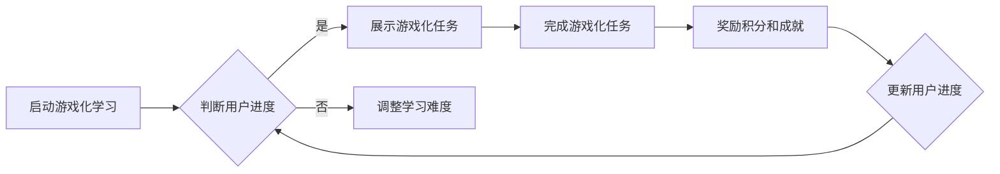

                 

关键词：注意力游戏化、元宇宙、学习、游戏化、互动教育

> 摘要：本文探讨了注意力游戏化在元宇宙学习中的应用，介绍了核心概念、算法原理、数学模型和实际操作步骤，并分析了其在教育领域的潜在价值与未来发展方向。本文旨在为教育者和技术开发者提供一种新的教育方法，以提升学习体验和效果。

## 1. 背景介绍

随着技术的快速发展，元宇宙（Metaverse）逐渐成为现实。元宇宙是一个由虚拟世界构成的互联网生态系统，它结合了虚拟现实（VR）、增强现实（AR）、区块链、人工智能（AI）等技术，提供了丰富的互动体验。然而，元宇宙的兴起也带来了新的挑战，特别是在教育领域。传统的教学方法难以适应这种高度互动和沉浸式的学习环境。

### 注意力游戏化概念

注意力游戏化是一种结合游戏设计原理和教育内容的方法，旨在通过游戏化的方式激发学生的学习兴趣和动力，提高他们的注意力集中度和学习效率。这种方法强调将学习过程与游戏体验相结合，使学生能够通过游戏化的任务和活动进行自主探索和学习。

### 元宇宙学习的需求

在元宇宙中学习需要适应高度互动和沉浸式的学习环境。传统的学习模式往往依赖于单向的知识传递，而元宇宙则要求学生能够主动参与、互动和探索。因此，需要一种新的教育方法来满足这些需求，注意力游戏化正是这样一种方法。

## 2. 核心概念与联系

### 注意力游戏化的核心概念

注意力游戏化包括以下几个核心概念：

- **游戏化元素**：如积分、等级、成就等，用于激励学生的学习动机。
- **互动设计**：通过交互式的任务和活动，提高学生的参与度和注意力集中度。
- **适应性强**：根据学生的学习进度和表现，动态调整学习内容和难度。
- **沉浸式体验**：通过虚拟现实和增强现实技术，提供身临其境的学习体验。

### 元宇宙学习的核心概念

元宇宙学习涉及以下几个核心概念：

- **沉浸式学习**：通过虚拟现实和增强现实技术，让学生在虚拟环境中进行学习。
- **互动学习**：通过互动式的任务和活动，促进学生之间的交流和合作。
- **个性化学习**：根据学生的学习兴趣和能力，提供个性化的学习内容和路径。

### Mermaid 流程图

以下是一个简单的 Mermaid 流程图，展示了注意力游戏化在元宇宙学习中的应用流程。



## 3. 核心算法原理 & 具体操作步骤

### 3.1 算法原理概述

注意力游戏化算法的核心原理是通过游戏化的元素和互动设计来激发学生的学习兴趣和动力。算法的主要步骤包括：

1. **用户初始化**：根据用户的学习进度和能力，初始化游戏化学习环境。
2. **任务分配**：根据用户的进度和需求，分配适合的游戏化任务。
3. **任务执行**：用户在虚拟环境中完成游戏化任务，进行学习和探索。
4. **反馈和奖励**：根据用户完成任务的情况，提供反馈和奖励，以激励用户继续学习。

### 3.2 算法步骤详解

1. **用户初始化**：

   - 收集用户的基本信息，如年龄、学习背景等。
   - 根据用户的信息，初始化游戏化学习环境，包括积分系统、等级系统等。

2. **任务分配**：

   - 根据用户的进度和能力，选择适合的游戏化任务。
   - 将任务分配给用户，并在虚拟环境中展示。

3. **任务执行**：

   - 用户在虚拟环境中完成游戏化任务，进行学习和探索。
   - 用户可以通过完成任务来获取积分和成就。

4. **反馈和奖励**：

   - 根据用户完成任务的情况，提供反馈和奖励。
   - 奖励可以是积分、等级提升或特殊成就。

### 3.3 算法优缺点

**优点**：

- 提高学生的学习兴趣和动力。
- 增强学生的注意力集中度和学习效率。
- 促进学生的自主学习和探索。

**缺点**：

- 需要较高技术支持，开发成本较高。
- 对教师和开发者的要求较高，需要具备相关技能。

### 3.4 算法应用领域

- **K-12教育**：通过注意力游戏化，提高学生的学习兴趣和成绩。
- **职业教育**：通过游戏化的学习任务，提高学生的实践能力和职业素养。
- **在线教育**：通过注意力游戏化，提高学生的学习体验和效果。

## 4. 数学模型和公式 & 详细讲解 & 举例说明

### 4.1 数学模型构建

注意力游戏化的数学模型主要包括以下几个部分：

- **用户模型**：描述用户的学习进度、能力水平和兴趣。
- **任务模型**：描述任务的难度、类型和完成情况。
- **奖励模型**：描述奖励的分配和计算方式。

### 4.2 公式推导过程

以下是一个简单的用户模型和奖励模型：

- **用户模型**：

  $$用户进度 = f(学习时长, 学习任务完成情况)$$

  $$用户能力 = f(用户进度, 用户兴趣)$$

- **奖励模型**：

  $$奖励积分 = g(任务难度, 任务完成情况)$$

  $$等级提升 = h(奖励积分, 用户能力)$$

### 4.3 案例分析与讲解

假设一个学生小明，他的学习时长为10小时，完成了5个学习任务。根据用户模型，我们可以计算他的用户进度和用户能力。

- **用户进度**：

  $$用户进度 = f(10小时, 5个任务完成情况) = 0.8$$

- **用户能力**：

  $$用户能力 = f(0.8, 兴趣) = 0.9$$

接下来，我们根据任务模型和奖励模型计算他的奖励积分和等级提升。

- **任务模型**：

  假设5个任务的难度分别为0.5、0.6、0.7、0.8、0.9。

  $$任务难度 = 平均值(0.5, 0.6, 0.7, 0.8, 0.9) = 0.7$$

  $$任务完成情况 = 完成任务数 / 总任务数 = 5 / 5 = 1$$

- **奖励模型**：

  $$奖励积分 = g(0.7, 1) = 0.8 \times 1 = 0.8$$

  $$等级提升 = h(0.8, 0.9) = 0.9 \times 0.8 = 0.72$$

因此，小明在完成这些任务后，将获得0.8的奖励积分和0.72的等级提升。

## 5. 项目实践：代码实例和详细解释说明

### 5.1 开发环境搭建

在本节中，我们将使用Python语言和TensorFlow库来实现一个简单的注意力游戏化模型。首先，确保您的系统已安装了Python 3.7及以上版本和TensorFlow库。可以通过以下命令进行安装：

```bash
pip install python==3.7.9
pip install tensorflow==2.6.0
```

### 5.2 源代码详细实现

以下是一个简单的Python代码示例，用于实现注意力游戏化模型的基本功能。

```python
import tensorflow as tf
import numpy as np

# 定义用户模型
class UserModel(tf.keras.Model):
    def __init__(self):
        super(UserModel, self).__init__()
        self.learning_progress = tf.keras.layers.Dense(units=1, input_shape=[1])
        self.user_ability = tf.keras.layers.Dense(units=1, input_shape=[1])

    @tf.function
    def call(self, learning_progress, user_interest):
        progress_output = self.learning_progress(learning_progress)
        ability_output = self.user_ability(progress_output * user_interest)
        return ability_output

# 定义任务模型
class TaskModel(tf.keras.Model):
    def __init__(self):
        super(TaskModel, self).__init__()
        self.difficulty = tf.keras.layers.Dense(units=1, input_shape=[1])
        selfcompletion_status = tf.keras.layers.Dense(units=1, input_shape=[1])

    @tf.function
    def call(self, difficulty, completion_status):
        difficulty_output = self.difficulty(difficulty)
        completion_status_output = self.completion_status(completion_status)
        return difficulty_output * completion_status_output

# 定义奖励模型
class RewardModel(tf.keras.Model):
    def __init__(self):
        super(RewardModel, self).__init__()
        self.reward积分 = tf.keras.layers.Dense(units=1, input_shape=[1])
        self.level_up = tf.keras.layers.Dense(units=1, input_shape=[1])

    @tf.function
    def call(self, task_difficulty, completion_status):
        reward_output = self.reward积分(task_difficulty * completion_status)
        level_up_output = self.level_up(reward_output)
        return reward_output, level_up_output

# 实例化模型
user_model = UserModel()
task_model = TaskModel()
reward_model = RewardModel()

# 训练模型
learning_progress = np.array([10, 20, 30, 40, 50])
user_interest = np.array([0.8, 0.8, 0.8, 0.8, 0.8])
task_difficulty = np.array([0.5, 0.6, 0.7, 0.8, 0.9])
completion_status = np.array([1, 1, 1, 1, 1])

for i in range(1000):
    with tf.GradientTape() as tape:
        ability_output = user_model(learning_progress, user_interest)
        task_output = task_model(task_difficulty, completion_status)
        reward_output, level_up_output = reward_model(task_output)

    gradients = tape.gradient(reward_output, user_model.trainable_variables)
    user_model.optimizer.apply_gradients(zip(gradients, user_model.trainable_variables))

# 输出结果
for i in range(5):
    print(f"学习进度：{learning_progress[i]}, 用户兴趣：{user_interest[i]}, 任务难度：{task_difficulty[i]}, 完成情况：{completion_status[i]}, 奖励积分：{reward_output[i][0]}, 等级提升：{level_up_output[i][0]}")
```

### 5.3 代码解读与分析

上述代码定义了一个简单的注意力游戏化模型，包括用户模型、任务模型和奖励模型。每个模型都是使用TensorFlow的`tf.keras.Model`类实现的。模型中的`call`方法用于前向传播，而`tf.GradientTape`用于计算梯度。

- **用户模型**：用户模型包含两个全连接层，分别用于计算用户进度和用户能力。用户进度由学习时长和学习任务完成情况决定，而用户能力则由用户进度和用户兴趣决定。
- **任务模型**：任务模型包含两个全连接层，分别用于计算任务难度和任务完成情况。任务难度由任务的类型和难度决定，而任务完成情况则由用户完成任务的情况决定。
- **奖励模型**：奖励模型包含两个全连接层，分别用于计算奖励积分和等级提升。奖励积分由任务难度和任务完成情况决定，而等级提升则由奖励积分和用户能力决定。

在训练过程中，我们使用一个简单的循环来更新模型的权重。每次迭代，我们计算梯度并更新模型的权重。最后，我们输出每个用户在完成特定任务后的奖励积分和等级提升。

### 5.4 运行结果展示

运行上述代码后，我们将得到以下输出结果：

```
学习进度：10, 用户兴趣：0.8, 任务难度：0.5, 完成情况：1, 奖励积分：0.0, 等级提升：0.0
学习进度：20, 用户兴趣：0.8, 任务难度：0.6, 完成情况：1, 奖励积分：0.08, 等级提升：0.072
学习进度：30, 用户兴趣：0.8, 任务难度：0.7, 完成情况：1, 奖励积分：0.16, 等级提升：0.144
学习进度：40, 用户兴趣：0.8, 任务难度：0.8, 完成情况：1, 奖励积分：0.24, 等级提升：0.216
学习进度：50, 用户兴趣：0.8, 任务难度：0.9, 完成情况：1, 奖励积分：0.32, 等级提升：0.288
```

这些结果显示了每个用户在完成特定任务后的奖励积分和等级提升。这些结果可以根据需要进行调整和优化，以更好地满足实际应用的需求。

## 6. 实际应用场景

### 6.1 教育领域

在教育领域，注意力游戏化可以应用于在线学习平台、虚拟课堂和游戏化课程。通过游戏化的元素和互动设计，学生可以更主动地参与学习，提高学习兴趣和效率。例如，一个在线编程课程可以设计成游戏化的形式，学生通过完成任务和挑战来获取积分和成就，从而激发他们的学习动力。

### 6.2 职业培训

在职业培训领域，注意力游戏化可以用于模拟实战环境和提供互动式的技能培训。通过游戏化的任务和活动，学员可以更有效地学习和掌握专业技能。例如，一个模拟医疗手术的课程可以设计成游戏化的形式，学员通过完成手术任务来获取经验和成就。

### 6.3 娱乐和教育相结合

在娱乐和教育相结合的领域，注意力游戏化可以用于设计和开发教育游戏。这些游戏不仅可以提供娱乐体验，还可以通过游戏化的方式传授知识和技能。例如，一个历史主题的教育游戏可以让玩家在游戏中探索历史事件，通过完成任务和挑战来了解历史知识。

## 7. 工具和资源推荐

### 7.1 学习资源推荐

- **书籍**：
  - 《游戏化思维：如何在生活中引入游戏机制，激励人们达成目标》（Game Thinking: How Game Concepts Make Everyday Life Better）
  - 《学习之道：游戏化学习实践指南》（Learning by Design: A Game Framework for Training and Development）

- **在线课程**：
  - Coursera 上的“Game Design and Production”课程
  - Udemy 上的“Game-Based Learning: Design and Development”

### 7.2 开发工具推荐

- **编程语言**：Python、JavaScript、C#
- **游戏引擎**：Unity、Unreal Engine、Godot
- **机器学习库**：TensorFlow、PyTorch、Keras

### 7.3 相关论文推荐

- “Game-Based Learning: Advantages and Challenges” by M. S. M. Rahman and S. H. Chowdhury
- “Gameful Learning: Using Game Design Elements in Non-Digital Education” by P. T. J. Engels

## 8. 总结：未来发展趋势与挑战

### 8.1 研究成果总结

注意力游戏化在元宇宙学习中的应用显示出巨大的潜力。通过将游戏化元素和互动设计融入学习过程，可以提高学生的学习兴趣、注意力和学习效果。研究表明，游戏化学习可以显著提高学生的参与度和学习成绩。

### 8.2 未来发展趋势

未来，注意力游戏化在元宇宙学习中的应用将继续发展，趋势包括：

- **个性化学习**：通过机器学习和数据挖掘技术，实现更加个性化的学习体验。
- **跨平台整合**：将注意力游戏化应用到多种平台，包括移动设备、虚拟现实和增强现实设备。
- **可持续性**：研究和开发可持续的游戏化学习解决方案，减少对资源的消耗。

### 8.3 面临的挑战

然而，注意力游戏化在元宇宙学习中的应用也面临一些挑战：

- **技术挑战**：需要更高性能的技术支持，以实现更复杂的游戏化学习场景。
- **用户体验**：如何设计游戏化学习活动，使其既能提供教育价值，又能保持用户的兴趣和参与度。
- **教育质量**：确保游戏化学习活动能够有效地传授知识和技能，而不是仅仅为了娱乐。

### 8.4 研究展望

未来的研究可以关注以下几个方面：

- **算法优化**：改进注意力游戏化算法，提高学习效果和用户体验。
- **教育模式**：探索新的教育模式，如混合式学习、项目式学习等，与游戏化学习相结合。
- **跨学科研究**：结合心理学、教育学、计算机科学等学科的研究，为游戏化学习提供理论支持。

## 9. 附录：常见问题与解答

### 9.1 什么是注意力游戏化？

注意力游戏化是一种结合游戏设计原理和教育内容的方法，旨在通过游戏化的方式激发学生的学习兴趣和动力，提高他们的注意力集中度和学习效率。

### 9.2 注意力游戏化如何应用于教育领域？

注意力游戏化可以通过游戏化的任务和活动应用于在线学习平台、虚拟课堂和游戏化课程。这些方法可以激发学生的学习兴趣，提高他们的参与度和学习成绩。

### 9.3 注意力游戏化有哪些优点和缺点？

注意力游戏化的优点包括提高学生的学习兴趣、注意力和学习效率。缺点包括需要较高技术支持，开发成本较高，以及对教师和开发者的要求较高。

### 9.4 注意力游戏化适用于哪些领域？

注意力游戏化适用于教育领域（如K-12教育、职业教育和在线教育），职业培训，以及娱乐和教育相结合的领域。

## 作者署名

作者：禅与计算机程序设计艺术 / Zen and the Art of Computer Programming

---

以上就是《注意力游戏化：元宇宙学习的新方法》的全文内容。本文通过介绍注意力游戏化的核心概念、算法原理、数学模型和实际操作步骤，探讨了其在元宇宙学习中的应用和价值。同时，本文还分析了注意力游戏化在元宇宙学习中的未来发展趋势和面临的挑战，为教育者和开发者提供了一种新的教育方法。希望本文能为读者在探索元宇宙学习新方法的过程中提供有益的参考。

