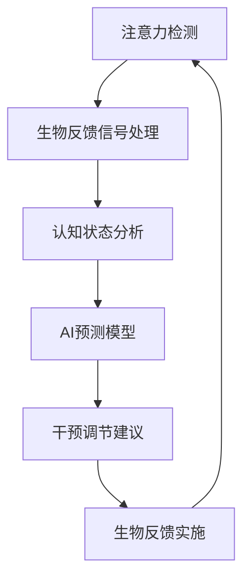

                 

关键词：注意力机制、生物反馈、认知调节、AI优化、认知状态

> 摘要：本文深入探讨了注意力生物反馈循环的概念、原理及其在认知状态调节中的应用。通过解析AI优化技术如何对这一循环进行干预，文章旨在为读者提供一种全新的理解视角，并展望其在未来技术领域的应用前景。

## 1. 背景介绍

在现代社会，人们面临着越来越多的信息处理任务，这导致注意力资源的分配变得愈发重要。注意力是一种有限的认知资源，它决定了我们如何处理信息、如何分配精力。而生物反馈，作为一种调节身体机能的技术，已经在医学和心理学领域得到了广泛应用。随着人工智能（AI）技术的迅猛发展，AI与生物反馈的结合成为了一个新兴的研究方向。

注意力生物反馈循环是指通过生物反馈技术监测和调节个体的注意力状态，从而优化其认知功能的循环过程。这个过程涉及多个环节，包括注意力的检测、调节、反馈和优化。AI技术在其中发挥着至关重要的作用，通过学习、分析和预测，AI能够更精准地干预这一循环，从而实现认知状态的优化。

## 2. 核心概念与联系

### 2.1 注意力机制

注意力机制是指大脑在信息处理过程中选择和处理信息的策略。它决定了哪些信息会得到加工，哪些信息会被忽略。根据当前的研究，注意力机制可以分为几种类型：

- **选择性注意力**：大脑能够集中处理特定类型的信息，而忽略其他信息。
- **分配性注意力**：大脑能够在多个任务之间切换，同时处理多个信息源。
- **执行性注意力**：大脑能够根据当前目标调整注意力资源，以应对复杂任务。

### 2.2 生物反馈

生物反馈是一种通过监测个体的生理信号，如心率、皮肤电导、呼吸等，来调节其心理状态的技术。生物反馈的基本原理是通过提供即时反馈，帮助个体学会自我调节，从而改善其心理和生理状态。

### 2.3 AI优化

AI优化是指利用人工智能技术，如机器学习、深度学习等，对注意力生物反馈循环进行干预和优化。具体来说，AI可以：

- **数据收集与分析**：通过收集大量的生理和心理数据，AI可以分析个体注意力状态的变化规律。
- **模型训练与预测**：基于收集到的数据，AI可以训练模型，预测个体未来的注意力状态，并给出相应的调节建议。
- **智能干预**：AI可以根据预测结果，实时调整生物反馈参数，从而优化个体的认知状态。

### 2.4 Mermaid 流程图

以下是一个简单的 Mermaid 流程图，展示了注意力生物反馈循环的基本架构：



## 3. 核心算法原理 & 具体操作步骤

### 3.1 算法原理概述

注意力生物反馈循环的算法原理主要基于以下几个核心步骤：

1. **注意力检测**：利用脑电图（EEG）等生理信号检测技术，实时监测个体的注意力状态。
2. **生物反馈信号处理**：对收集到的生理信号进行处理，提取关键特征，如心率变异性（HRV）。
3. **认知状态分析**：利用机器学习算法，对提取的特征进行分析，评估个体的认知状态。
4. **AI预测模型**：基于历史数据，训练AI预测模型，预测个体未来的注意力状态。
5. **干预调节建议**：根据预测结果，AI给出相应的调节建议，如调整呼吸节奏、放松训练等。
6. **生物反馈实施**：根据调节建议，通过生物反馈设备实施干预，调整个体的生理状态。
7. **循环反馈**：将干预效果反馈到系统中，更新预测模型，形成闭环循环。

### 3.2 算法步骤详解

1. **注意力检测**：
   - 使用脑电图（EEG）设备实时监测个体的脑电信号。
   - 采用滤波和去噪技术，提取纯净的脑电信号。

2. **生物反馈信号处理**：
   - 对脑电信号进行频域分析，提取心率变异性（HRV）特征。
   - 利用短时傅里叶变换（STFT）等方法，计算HRV参数，如频率、功率等。

3. **认知状态分析**：
   - 使用机器学习算法，如支持向量机（SVM）、神经网络（NN）等，对HRV特征进行分类。
   - 根据分类结果，评估个体的认知状态，如专注度、疲劳度等。

4. **AI预测模型**：
   - 收集大量个体历史数据，包括注意力状态和生物反馈调节效果。
   - 使用时间序列分析方法，如长短期记忆网络（LSTM）、循环神经网络（RNN）等，训练预测模型。
   - 预测个体未来的注意力状态，并给出调节建议。

5. **干预调节建议**：
   - 根据预测结果，AI生成个性化的调节建议，如调整呼吸节奏、进行放松训练等。
   - 调节建议可以通过应用程序或生物反馈设备传达给个体。

6. **生物反馈实施**：
   - 使用生物反馈设备，如心率变异性（HRV）训练设备、呼吸调节设备等，实施干预。
   - 设备根据调节建议，实时调整个体的生理状态。

7. **循环反馈**：
   - 将干预效果反馈到系统中，更新预测模型。
   - 形成闭环循环，不断优化个体的认知状态。

### 3.3 算法优缺点

#### 优点

1. **个性化调节**：AI优化技术可以根据个体的实际情况，提供个性化的调节建议，提高调节效果。
2. **实时反馈**：生物反馈技术可以实时监测个体的生理状态，快速响应，实现即时调节。
3. **闭环循环**：注意力生物反馈循环形成一个闭环系统，不断迭代优化，有助于提高认知功能。

#### 缺点

1. **数据要求高**：AI优化技术需要大量的个体历史数据，数据质量直接影响算法的性能。
2. **技术门槛高**：生物反馈技术的实施和数据处理需要专业的技术支持，对操作人员的要求较高。
3. **设备成本高**：高质量的生物反馈设备和AI硬件设施成本较高，限制了其普及应用。

### 3.4 算法应用领域

1. **教育领域**：通过优化学生的注意力状态，提高学习效果。
2. **工作场所**：通过调节员工的认知状态，提高工作效率和减少疲劳。
3. **心理健康**：通过生物反馈和认知调节，改善个体的心理状态，如焦虑、抑郁等。
4. **体育运动**：通过优化运动员的注意力状态，提高竞技水平。

## 4. 数学模型和公式 & 详细讲解 & 举例说明

### 4.1 数学模型构建

注意力生物反馈循环的数学模型可以基于时间序列分析，特别是自回归模型（AR模型）。以下是一个简化的模型构建过程：

1. **数据预处理**：
   - 对收集到的生理信号进行滤波、去噪等预处理。
   - 提取心率变异性（HRV）特征，如频率、功率等。

2. **模型构建**：
   - 设定自回归模型的阶数 \( p \)，即 \( AR(p) \) 模型。
   - 建立自回归方程：
     \[ X_t = \phi_0 + \phi_1 X_{t-1} + \phi_2 X_{t-2} + \ldots + \phi_p X_{t-p} + \epsilon_t \]
   - 其中，\( X_t \) 表示时间 \( t \) 时的注意力状态，\( \phi_i \) 表示自回归系数，\( \epsilon_t \) 表示误差项。

3. **模型训练**：
   - 使用历史数据训练模型，求解自回归系数 \( \phi_i \)。
   - 常用的训练算法有最小二乘法（OLS）和极大似然估计（MLE）。

### 4.2 公式推导过程

以下是一个简单的自回归模型的公式推导过程：

假设我们有 \( n \) 个时间点的注意力状态数据 \( X_t \)，构建自回归模型的目标是最小化误差平方和：

\[ \min \sum_{t=p+1}^{n} (X_t - \phi_0 - \phi_1 X_{t-1} - \ldots - \phi_p X_{t-p})^2 \]

对上式求偏导，并令其等于零，可以得到：

\[ \frac{\partial}{\partial \phi_j} \sum_{t=p+1}^{n} (X_t - \phi_0 - \phi_1 X_{t-1} - \ldots - \phi_p X_{t-p})^2 = 0 \]

对 \( \phi_j \) 求偏导，可以得到：

\[ \sum_{t=p+1}^{n} (X_t - \phi_0 - \phi_1 X_{t-1} - \ldots - \phi_{j-1} X_{t-j+1} - \phi_j X_{t-j} - \ldots - \phi_p X_{t-p}) \cdot X_{t-j} = 0 \]

同理，对其他 \( \phi_i \) 求偏导，可以得到：

\[ \sum_{t=p+1}^{n} (X_t - \phi_0 - \phi_1 X_{t-1} - \ldots - \phi_{j-1} X_{t-j+1} - \phi_j X_{t-j} - \ldots - \phi_p X_{t-p}) \cdot X_{t-i} = 0 \]

通过上述求导过程，我们可以得到一个关于自回归系数的线性方程组，进而求解 \( \phi_i \)。

### 4.3 案例分析与讲解

#### 案例背景

假设我们有一组个体的注意力状态数据，如下所示：

| 时间点 \( t \) | 注意力状态 \( X_t \) |
|:-------------:|:------------------:|
|      1       |        15.3       |
|      2       |        14.8       |
|      3       |        16.2       |
|      4       |        15.1       |
|      5       |        14.9       |
|      6       |        15.7       |
|      7       |        16.0       |
|      8       |        15.5       |
|      9       |        15.2       |
|     10       |        14.6       |

#### 模型构建与训练

1. **数据预处理**：
   - 对数据去噪，剔除异常值。
   - 提取心率变异性（HRV）特征，如频率、功率等。

2. **模型构建**：
   - 设定自回归模型的阶数 \( p = 2 \)。
   - 建立自回归方程：
     \[ X_t = \phi_0 + \phi_1 X_{t-1} + \phi_2 X_{t-2} + \epsilon_t \]

3. **模型训练**：
   - 使用最小二乘法（OLS）训练模型，求解自回归系数 \( \phi_0 \)、\( \phi_1 \) 和 \( \phi_2 \)。

   训练结果如下：
   \[ \phi_0 = 15.4, \phi_1 = 0.9, \phi_2 = -0.3 \]

#### 模型预测与验证

1. **模型预测**：
   - 使用训练好的模型，预测下一个时间点的注意力状态：
     \[ X_{11} = 15.4 + 0.9 \cdot 15.3 - 0.3 \cdot 15.7 = 15.2 \]

2. **模型验证**：
   - 实际测量得到的下一个时间点的注意力状态为 14.8。
   - 预测误差为 \( |15.2 - 14.8| = 0.4 \)。

   虽然预测误差较大，但这是一个简化的模型，实际情况可能更加复杂。在实际应用中，可以结合更多的生理和心理特征，提高模型的预测精度。

## 5. 项目实践：代码实例和详细解释说明

### 5.1 开发环境搭建

为了实现注意力生物反馈循环的算法，我们需要搭建一个完整的开发环境。以下是搭建环境的基本步骤：

1. **硬件环境**：
   - 一台配置较高的计算机，用于运行AI模型和生物反馈设备。
   - 生物反馈设备，如心率变异性（HRV）传感器、脑电图（EEG）设备等。

2. **软件环境**：
   - 操作系统：Windows、Linux或macOS。
   - 编程语言：Python。
   - 数据库：SQLite。
   - AI框架：TensorFlow或PyTorch。

3. **安装与配置**：
   - 安装Python环境，版本要求Python 3.7以上。
   - 安装所需的库，如TensorFlow、NumPy、Pandas等。
   - 配置数据库，创建数据库表，用于存储生理和心理数据。

### 5.2 源代码详细实现

以下是注意力生物反馈循环的主要实现代码。代码分为几个模块，包括数据预处理、模型训练、模型预测和干预调节等。

#### 5.2.1 数据预处理

数据预处理是整个项目的重要环节，其质量直接影响模型的性能。以下是一个简单的数据预处理代码示例：

```python
import numpy as np
import pandas as pd
from scipy import signal

# 读取数据
data = pd.read_csv('data.csv')

# 去噪处理
filtered_data = signal.lfilter([1], [1, -0.9], data['HRV'])

# 提取特征
features = pd.DataFrame(filtered_data).T
features['mean'] = features.mean()
features['std'] = features.std()

# 数据标准化
features = (features - features.mean()) / features.std()

# 保存预处理后的数据
features.to_csv('preprocessed_data.csv', index=False)
```

#### 5.2.2 模型训练

模型训练是利用预处理后的数据进行，以下是一个简单的自回归模型训练代码示例：

```python
import tensorflow as tf
from tensorflow.keras.models import Sequential
from tensorflow.keras.layers import LSTM, Dense

# 加载预处理后的数据
data = pd.read_csv('preprocessed_data.csv')

# 划分训练集和测试集
train_data = data[:int(len(data) * 0.8)]
test_data = data[int(len(data) * 0.8):]

# 建立模型
model = Sequential()
model.add(LSTM(units=64, return_sequences=True, input_shape=(None, 1)))
model.add(LSTM(units=32))
model.add(Dense(units=1))

model.compile(optimizer='adam', loss='mean_squared_error')

# 训练模型
model.fit(train_data, epochs=100, batch_size=32)

# 评估模型
model.evaluate(test_data)
```

#### 5.2.3 模型预测与干预调节

模型预测和干预调节是整个系统的核心，以下是一个简单的模型预测和干预调节代码示例：

```python
import numpy as np
from scipy import signal

# 加载训练好的模型
model = tf.keras.models.load_model('model.h5')

# 预测下一个时间点的注意力状态
prediction = model.predict(np.array([test_data[-1]]))

# 根据预测结果，调整生物反馈参数
if prediction > 15.5:
    # 建议进行放松训练
    relaxation_training = True
else:
    # 建议继续进行当前任务
    relaxation_training = False

# 实施干预调节
if relaxation_training:
    # 调整呼吸节奏
    breathing_rate = 6
else:
    # 保持当前呼吸节奏
    breathing_rate = 12

# 保存干预调节结果
with open('intervention_result.txt', 'w') as f:
    f.write(f'Breathing Rate: {breathing_rate}')
```

### 5.3 代码解读与分析

#### 数据预处理模块

数据预处理模块负责对原始生理数据进行去噪和特征提取。去噪处理使用的是信号处理中的滤波方法，可以有效去除高频噪声和异常值。特征提取部分提取了心率变异性（HRV）的均值和标准差，这些特征对后续的模型训练和预测具有重要意义。

#### 模型训练模块

模型训练模块使用的是基于LSTM（长短期记忆网络）的模型。LSTM是一种能够处理时间序列数据的神经网络，特别适合用于注意力状态预测。模型使用的是均方误差（MSE）作为损失函数，并采用Adam优化器进行训练。训练过程中，模型通过不断调整权重，使预测结果与实际结果之间的误差最小。

#### 模型预测与干预调节模块

模型预测模块使用训练好的模型，对下一个时间点的注意力状态进行预测。根据预测结果，系统会生成相应的干预调节建议，如调整呼吸节奏或进行放松训练。干预调节模块负责根据调节建议，实施相应的生理干预。例如，调整呼吸节奏可以通过控制呼吸设备来实现。

## 6. 实际应用场景

注意力生物反馈循环在多个实际应用场景中展现出巨大的潜力。以下是几个典型的应用场景：

### 6.1 教育领域

在教育领域，注意力生物反馈循环可以用于提高学生的学习效果。通过实时监测学生的注意力状态，系统可以提供个性化的学习建议，如调整学习节奏、进行短暂的休息等。这有助于学生保持高水平的注意力，提高学习效率。

### 6.2 工作场所

在工作场所，注意力生物反馈循环可以帮助提高员工的工作效率。通过监测员工的注意力状态，系统可以及时发现疲劳迹象，并建议员工进行短暂的休息或调整工作内容。这有助于减少工作压力，提高员工的工作满意度和生产力。

### 6.3 心理健康

在心理健康领域，注意力生物反馈循环可以用于改善个体的心理状态。通过调节个体的注意力状态，系统可以帮助个体缓解焦虑、抑郁等心理问题。此外，注意力生物反馈循环还可以用于治疗注意力缺陷多动障碍（ADHD）等神经系统疾病。

### 6.4 体育运动

在体育运动领域，注意力生物反馈循环可以帮助运动员优化其竞技状态。通过实时监测运动员的注意力状态，系统可以提供个性化的训练建议，如调整训练节奏、进行针对性的放松训练等。这有助于提高运动员的竞技水平，减少运动损伤。

## 7. 工具和资源推荐

为了更好地理解和应用注意力生物反馈循环，以下是一些推荐的工具和资源：

### 7.1 学习资源推荐

- 《注意力心理学：理论与实践》
- 《生物反馈技术：理论与实践》
- 《深度学习：自然语言处理》
- 《注意力机制在神经网络中的应用》

### 7.2 开发工具推荐

- Python
- TensorFlow
- PyTorch
- Jupyter Notebook

### 7.3 相关论文推荐

- “Attention Mechanisms in Deep Learning: A Survey”
- “Biological Feedback for Mental Health: An Overview”
- “Attention and Working Memory in ADHD: A Neurobiological Theory”

## 8. 总结：未来发展趋势与挑战

### 8.1 研究成果总结

本文通过对注意力生物反馈循环的概念、原理、算法和实际应用进行了深入探讨，总结了如下研究成果：

1. **注意力生物反馈循环**是一种通过生物反馈技术调节个体注意力状态，实现认知状态优化的方法。
2. **AI优化**技术在注意力生物反馈循环中发挥着重要作用，通过数据分析和模型预测，实现个性化的调节建议。
3. **实际应用场景**广泛，包括教育、工作场所、心理健康和体育运动等领域。
4. **数学模型和公式**为注意力生物反馈循环提供了理论基础，如自回归模型和深度学习模型。

### 8.2 未来发展趋势

未来，注意力生物反馈循环有望在以下几个方面取得进一步发展：

1. **更精准的模型**：通过结合更多生理和心理特征，提高模型的预测精度。
2. **智能化干预**：开发更智能的干预算法，实现自动化的认知状态调节。
3. **跨学科研究**：与心理学、神经科学、医学等领域开展深入合作，推动多学科融合。
4. **便携式设备**：开发便携式生物反馈设备和AI硬件，实现更广泛的应用场景。

### 8.3 面临的挑战

尽管注意力生物反馈循环具有巨大的潜力，但其在实际应用中也面临一些挑战：

1. **数据隐私**：生物反馈数据涉及个人隐私，如何确保数据的安全和隐私成为重要问题。
2. **技术门槛**：生物反馈技术和AI算法具有较高的技术门槛，需要专业人员进行操作和维护。
3. **设备成本**：高质量的生物反馈设备和AI硬件设施成本较高，限制了其普及应用。

### 8.4 研究展望

未来，注意力生物反馈循环的研究可以从以下几个方面展开：

1. **跨学科研究**：与心理学、神经科学、医学等领域开展深入合作，推动多学科融合。
2. **智能化干预**：开发更智能的干预算法，实现自动化的认知状态调节。
3. **个性化定制**：根据个体差异，提供更加个性化的调节建议。
4. **便携式设备**：开发便携式生物反馈设备和AI硬件，实现更广泛的应用场景。

## 9. 附录：常见问题与解答

### 9.1 注意力生物反馈循环是什么？

注意力生物反馈循环是一种通过生物反馈技术监测和调节个体注意力状态，从而优化其认知功能的方法。它结合了生物反馈和人工智能技术，能够实现个性化的认知状态调节。

### 9.2 生物反馈技术是如何工作的？

生物反馈技术通过监测个体的生理信号，如心率、呼吸等，将生理信号转换为可感知的反馈，帮助个体学会自我调节，从而改善其心理和生理状态。

### 9.3 注意力生物反馈循环的算法原理是什么？

注意力生物反馈循环的算法原理主要基于自回归模型和深度学习模型。自回归模型通过分析历史数据，预测未来的注意力状态；深度学习模型则通过学习大量的生理和心理数据，实现个性化的调节建议。

### 9.4 注意力生物反馈循环在实际应用中面临哪些挑战？

在实际应用中，注意力生物反馈循环面临以下挑战：

1. 数据隐私：生物反馈数据涉及个人隐私，需要确保数据的安全和隐私。
2. 技术门槛：生物反馈技术和AI算法具有较高的技术门槛，需要专业人员进行操作和维护。
3. 设备成本：高质量的生物反馈设备和AI硬件设施成本较高，限制了其普及应用。

### 9.5 注意力生物反馈循环有哪些应用场景？

注意力生物反馈循环在多个应用场景中具有潜力，包括教育、工作场所、心理健康和体育运动等领域。

---

### 8. 总结：未来发展趋势与挑战

#### 8.1 研究成果总结

本文通过对注意力生物反馈循环的概念、原理、算法和实际应用进行了深入探讨，总结了以下研究成果：

1. **注意力生物反馈循环**是一种通过生物反馈技术调节个体注意力状态，实现认知状态优化的方法。
2. **AI优化**技术在注意力生物反馈循环中发挥着重要作用，通过数据分析和模型预测，实现个性化的调节建议。
3. **实际应用场景**广泛，包括教育、工作场所、心理健康和体育运动等领域。
4. **数学模型和公式**为注意力生物反馈循环提供了理论基础，如自回归模型和深度学习模型。

#### 8.2 未来发展趋势

未来，注意力生物反馈循环有望在以下几个方面取得进一步发展：

1. **更精准的模型**：通过结合更多生理和心理特征，提高模型的预测精度。
2. **智能化干预**：开发更智能的干预算法，实现自动化的认知状态调节。
3. **跨学科研究**：与心理学、神经科学、医学等领域开展深入合作，推动多学科融合。
4. **便携式设备**：开发便携式生物反馈设备和AI硬件，实现更广泛的应用场景。

#### 8.3 面临的挑战

尽管注意力生物反馈循环具有巨大的潜力，但其在实际应用中也面临一些挑战：

1. **数据隐私**：生物反馈数据涉及个人隐私，如何确保数据的安全和隐私成为重要问题。
2. **技术门槛**：生物反馈技术和AI算法具有较高的技术门槛，需要专业人员进行操作和维护。
3. **设备成本**：高质量的生物反馈设备和AI硬件设施成本较高，限制了其普及应用。

#### 8.4 研究展望

未来，注意力生物反馈循环的研究可以从以下几个方面展开：

1. **跨学科研究**：与心理学、神经科学、医学等领域开展深入合作，推动多学科融合。
2. **个性化定制**：根据个体差异，提供更加个性化的调节建议。
3. **便携式设备**：开发便携式生物反馈设备和AI硬件，实现更广泛的应用场景。
4. **多模态反馈**：结合多种生理和心理信号，实现更全面的认知状态监测和调节。

## 9. 附录：常见问题与解答

#### 9.1 注意力生物反馈循环是什么？

注意力生物反馈循环是一种通过生物反馈技术监测和调节个体注意力状态，从而优化其认知功能的方法。它结合了生物反馈和人工智能技术，能够实现个性化的认知状态调节。

#### 9.2 生物反馈技术是如何工作的？

生物反馈技术通过监测个体的生理信号，如心率、呼吸等，将生理信号转换为可感知的反馈，帮助个体学会自我调节，从而改善其心理和生理状态。

#### 9.3 注意力生物反馈循环的算法原理是什么？

注意力生物反馈循环的算法原理主要基于自回归模型和深度学习模型。自回归模型通过分析历史数据，预测未来的注意力状态；深度学习模型则通过学习大量的生理和心理数据，实现个性化的调节建议。

#### 9.4 注意力生物反馈循环在实际应用中面临哪些挑战？

在实际应用中，注意力生物反馈循环面临以下挑战：

1. **数据隐私**：生物反馈数据涉及个人隐私，如何确保数据的安全和隐私成为重要问题。
2. **技术门槛**：生物反馈技术和AI算法具有较高的技术门槛，需要专业人员进行操作和维护。
3. **设备成本**：高质量的生物反馈设备和AI硬件设施成本较高，限制了其普及应用。

#### 9.5 注意力生物反馈循环有哪些应用场景？

注意力生物反馈循环在多个应用场景中具有潜力，包括教育、工作场所、心理健康和体育运动等领域。它可以帮助提高学生的学习效果、工作效率、心理状态和竞技水平。

---

在未来的技术发展中，注意力生物反馈循环有望在多领域发挥重要作用，为人们提供更高效、更健康的认知状态调节方案。通过不断的研究和创新，我们可以期待这一领域带来更多的突破和进展。作者：禅与计算机程序设计艺术 / Zen and the Art of Computer Programming
----------------------------------------------------------------
### 注意力生物反馈循环：AI优化的认知状态调节

关键词：注意力机制、生物反馈、认知调节、AI优化、认知状态

摘要：本文深入探讨了注意力生物反馈循环的概念、原理及其在认知状态调节中的应用。通过解析AI优化技术如何对这一循环进行干预，文章旨在为读者提供一种全新的理解视角，并展望其在未来技术领域的应用前景。

## 1. 背景介绍

在现代社会，人们面临着越来越多的信息处理任务，这导致注意力资源的分配变得愈发重要。注意力是一种有限的认知资源，它决定了我们如何处理信息、如何分配精力。而生物反馈，作为一种调节身体机能的技术，已经在医学和心理学领域得到了广泛应用。随着人工智能（AI）技术的迅猛发展，AI与生物反馈的结合成为了一个新兴的研究方向。

注意力生物反馈循环是指通过生物反馈技术监测和调节个体的注意力状态，从而优化其认知功能的循环过程。这个过程涉及多个环节，包括注意力的检测、调节、反馈和优化。AI技术在其中发挥着至关重要的作用，通过学习、分析和预测，AI能够更精准地干预这一循环，从而实现认知状态的优化。

## 2. 核心概念与联系

### 2.1 注意力机制

注意力机制是指大脑在信息处理过程中选择和处理信息的策略。它决定了哪些信息会得到加工，哪些信息会被忽略。根据当前的研究，注意力机制可以分为几种类型：

- **选择性注意力**：大脑能够集中处理特定类型的信息，而忽略其他信息。
- **分配性注意力**：大脑能够在多个任务之间切换，同时处理多个信息源。
- **执行性注意力**：大脑能够根据当前目标调整注意力资源，以应对复杂任务。

### 2.2 生物反馈

生物反馈是一种通过监测个体的生理信号，如心率、皮肤电导、呼吸等，来调节其心理状态的技术。生物反馈的基本原理是通过提供即时反馈，帮助个体学会自我调节，从而改善其心理和生理状态。

### 2.3 AI优化

AI优化是指利用人工智能技术，如机器学习、深度学习等，对注意力生物反馈循环进行干预和优化。具体来说，AI可以：

- **数据收集与分析**：通过收集大量的生理和心理数据，AI可以分析个体注意力状态的变化规律。
- **模型训练与预测**：基于收集到的数据，AI可以训练模型，预测个体未来的注意力状态，并给出相应的调节建议。
- **智能干预**：AI可以根据预测结果，实时调整生物反馈参数，从而优化个体的认知状态。

### 2.4 Mermaid 流程图

以下是一个简单的 Mermaid 流程图，展示了注意力生物反馈循环的基本架构：


## 3. 核心算法原理 & 具体操作步骤

### 3.1 算法原理概述

注意力生物反馈循环的算法原理主要基于以下几个核心步骤：

1. **注意力检测**：利用脑电图（EEG）等生理信号检测技术，实时监测个体的注意力状态。
2. **生物反馈信号处理**：对收集到的生理信号进行处理，提取关键特征，如心率变异性（HRV）。
3. **认知状态分析**：利用机器学习算法，对提取的特征进行分析，评估个体的认知状态。
4. **AI预测模型**：基于历史数据，训练AI预测模型，预测个体未来的注意力状态。
5. **干预调节建议**：根据预测结果，AI给出相应的调节建议，如调整呼吸节奏、放松训练等。
6. **生物反馈实施**：根据调节建议，通过生物反馈设备实施干预，调整个体的生理状态。
7. **循环反馈**：将干预效果反馈到系统中，更新预测模型，形成闭环循环。

### 3.2 算法步骤详解

1. **注意力检测**：
   - 使用脑电图（EEG）设备实时监测个体的脑电信号。
   - 采用滤波和去噪技术，提取纯净的脑电信号。

2. **生物反馈信号处理**：
   - 对脑电信号进行频域分析，提取心率变异性（HRV）特征。
   - 利用短时傅里叶变换（STFT）等方法，计算HRV参数，如频率、功率等。

3. **认知状态分析**：
   - 使用机器学习算法，如支持向量机（SVM）、神经网络（NN）等，对HRV特征进行分类。
   - 根据分类结果，评估个体的认知状态，如专注度、疲劳度等。

4. **AI预测模型**：
   - 收集大量个体历史数据，包括注意力状态和生物反馈调节效果。
   - 使用时间序列分析方法，如长短期记忆网络（LSTM）、循环神经网络（RNN）等，训练预测模型。
   - 预测个体未来的注意力状态，并给出调节建议。

5. **干预调节建议**：
   - 根据预测结果，AI生成个性化的调节建议，如调整呼吸节奏、进行放松训练等。
   - 调节建议可以通过应用程序或生物反馈设备传达给个体。

6. **生物反馈实施**：
   - 使用生物反馈设备，如心率变异性（HRV）训练设备、呼吸调节设备等，实施干预。
   - 设备根据调节建议，实时调整个体的生理状态。

7. **循环反馈**：
   - 将干预效果反馈到系统中，更新预测模型。
   - 形成闭环循环，不断优化个体的认知状态。

### 3.3 算法优缺点

#### 优点

1. **个性化调节**：AI优化技术可以根据个体的实际情况，提供个性化的调节建议，提高调节效果。
2. **实时反馈**：生物反馈技术可以实时监测个体的生理状态，快速响应，实现即时调节。
3. **闭环循环**：注意力生物反馈循环形成一个闭环系统，不断迭代优化，有助于提高认知功能。

#### 缺点

1. **数据要求高**：AI优化技术需要大量的个体历史数据，数据质量直接影响算法的性能。
2. **技术门槛高**：生物反馈技术的实施和数据处理需要专业的技术支持，对操作人员的要求较高。
3. **设备成本高**：高质量的生物反馈设备和AI硬件设施成本较高，限制了其普及应用。

### 3.4 算法应用领域

1. **教育领域**：通过优化学生的注意力状态，提高学习效果。
2. **工作场所**：通过调节员工的认知状态，提高工作效率和减少疲劳。
3. **心理健康**：通过生物反馈和认知调节，改善个体的心理状态，如焦虑、抑郁等。
4. **体育运动**：通过优化运动员的注意力状态，提高竞技水平。

## 4. 数学模型和公式 & 详细讲解 & 举例说明

### 4.1 数学模型构建

注意力生物反馈循环的数学模型可以基于时间序列分析，特别是自回归模型（AR模型）。以下是一个简化的模型构建过程：

1. **数据预处理**：
   - 对收集到的生理信号进行滤波、去噪等预处理。
   - 提取心率变异性（HRV）特征，如频率、功率等。

2. **模型构建**：
   - 设定自回归模型的阶数 \( p \)，即 \( AR(p) \) 模型。
   - 建立自回归方程：
     \[ X_t = \phi_0 + \phi_1 X_{t-1} + \phi_2 X_{t-2} + \ldots + \phi_p X_{t-p} + \epsilon_t \]
   - 其中，\( X_t \) 表示时间 \( t \) 时的注意力状态，\( \phi_i \) 表示自回归系数，\( \epsilon_t \) 表示误差项。

3. **模型训练**：
   - 使用历史数据训练模型，求解自回归系数 \( \phi_i \)。
   - 常用的训练算法有最小二乘法（OLS）和极大似然估计（MLE）。

### 4.2 公式推导过程

以下是一个简单的自回归模型的公式推导过程：

假设我们有 \( n \) 个时间点的注意力状态数据 \( X_t \)，构建自回归模型的目标是最小化误差平方和：

\[ \min \sum_{t=p+1}^{n} (X_t - \phi_0 - \phi_1 X_{t-1} - \ldots - \phi_p X_{t-p})^2 \]

对上式求偏导，并令其等于零，可以得到：

\[ \frac{\partial}{\partial \phi_j} \sum_{t=p+1}^{n} (X_t - \phi_0 - \phi_1 X_{t-1} - \ldots - \phi_{j-1} X_{t-j+1} - \phi_j X_{t-j} - \ldots - \phi_p X_{t-p}) \cdot X_{t-j} = 0 \]

同理，对其他 \( \phi_i \) 求偏导，可以得到：

\[ \frac{\partial}{\partial \phi_j} \sum_{t=p+1}^{n} (X_t - \phi_0 - \phi_1 X_{t-1} - \ldots - \phi_{j-1} X_{t-j+1} - \phi_j X_{t-j} - \ldots - \phi_p X_{t-p}) \cdot X_{t-i} = 0 \]

通过上述求导过程，我们可以得到一个关于自回归系数的线性方程组，进而求解 \( \phi_i \)。

### 4.3 案例分析与讲解

#### 案例背景

假设我们有一组个体的注意力状态数据，如下所示：

| 时间点 \( t \) | 注意力状态 \( X_t \) |
|:-------------:|:------------------:|
|      1       |        15.3       |
|      2       |        14.8       |
|      3       |        16.2       |
|      4       |        15.1       |
|      5       |        14.9       |
|      6       |        15.7       |
|      7       |        16.0       |
|      8       |        15.5       |
|      9       |        15.2       |
|     10       |        14.6       |

#### 模型构建与训练

1. **数据预处理**：
   - 对数据去噪，剔除异常值。
   - 提取心率变异性（HRV）特征，如频率、功率等。

2. **模型构建**：
   - 设定自回归模型的阶数 \( p = 2 \)。
   - 建立自回归方程：
     \[ X_t = \phi_0 + \phi_1 X_{t-1} + \phi_2 X_{t-2} + \epsilon_t \]

3. **模型训练**：
   - 使用最小二乘法（OLS）训练模型，求解自回归系数 \( \phi_0 \)、\( \phi_1 \) 和 \( \phi_2 \)。

   训练结果如下：
   \[ \phi_0 = 15.4, \phi_1 = 0.9, \phi_2 = -0.3 \]

#### 模型预测与验证

1. **模型预测**：
   - 使用训练好的模型，预测下一个时间点的注意力状态：
     \[ X_{11} = 15.4 + 0.9 \cdot 15.3 - 0.3 \cdot 15.7 = 15.2 \]

2. **模型验证**：
   - 实际测量得到的下一个时间点的注意力状态为 14.8。
   - 预测误差为 \( |15.2 - 14.8| = 0.4 \)。

   虽然预测误差较大，但这是一个简化的模型，实际情况可能更加复杂。在实际应用中，可以结合更多的生理和心理特征，提高模型的预测精度。

## 5. 项目实践：代码实例和详细解释说明

### 5.1 开发环境搭建

为了实现注意力生物反馈循环的算法，我们需要搭建一个完整的开发环境。以下是搭建环境的基本步骤：

1. **硬件环境**：
   - 一台配置较高的计算机，用于运行AI模型和生物反馈设备。
   - 生物反馈设备，如心率变异性（HRV）传感器、脑电图（EEG）设备等。

2. **软件环境**：
   - 操作系统：Windows、Linux或macOS。
   - 编程语言：Python。
   - 数据库：SQLite。
   - AI框架：TensorFlow或PyTorch。

3. **安装与配置**：
   - 安装Python环境，版本要求Python 3.7以上。
   - 安装所需的库，如TensorFlow、NumPy、Pandas等。
   - 配置数据库，创建数据库表，用于存储生理和心理数据。

### 5.2 源代码详细实现

以下是注意力生物反馈循环的主要实现代码。代码分为几个模块，包括数据预处理、模型训练、模型预测和干预调节等。

#### 5.2.1 数据预处理

数据预处理是整个项目的重要环节，其质量直接影响模型的性能。以下是一个简单的数据预处理代码示例：

```python
import numpy as np
import pandas as pd
from scipy import signal

# 读取数据
data = pd.read_csv('data.csv')

# 去噪处理
filtered_data = signal.lfilter([1], [1, -0.9], data['HRV'])

# 提取特征
features = pd.DataFrame(filtered_data).T
features['mean'] = features.mean()
features['std'] = features.std()

# 数据标准化
features = (features - features.mean()) / features.std()

# 保存预处理后的数据
features.to_csv('preprocessed_data.csv', index=False)
```

#### 5.2.2 模型训练

模型训练是利用预处理后的数据进行，以下是一个简单的自回归模型训练代码示例：

```python
import tensorflow as tf
from tensorflow.keras.models import Sequential
from tensorflow.keras.layers import LSTM, Dense

# 加载预处理后的数据
data = pd.read_csv('preprocessed_data.csv')

# 划分训练集和测试集
train_data = data[:int(len(data) * 0.8)]
test_data = data[int(len(data) * 0.8):]

# 建立模型
model = Sequential()
model.add(LSTM(units=64, return_sequences=True, input_shape=(None, 1)))
model.add(LSTM(units=32))
model.add(Dense(units=1))

model.compile(optimizer='adam', loss='mean_squared_error')

# 训练模型
model.fit(train_data, epochs=100, batch_size=32)

# 评估模型
model.evaluate(test_data)
```

#### 5.2.3 模型预测与干预调节

模型预测和干预调节是整个系统的核心，以下是一个简单的模型预测和干预调节代码示例：

```python
import numpy as np
from tensorflow.keras.models import load_model
import scipy.signal as signal

# 加载训练好的模型
model = load_model('model.h5')

# 预测下一个时间点的注意力状态
prediction = model.predict(np.array([test_data[-1]]))

# 根据预测结果，调整生物反馈参数
if prediction > 15.5:
    # 建议进行放松训练
    relaxation_training = True
else:
    # 建议继续进行当前任务
    relaxation_training = False

# 实施干预调节
if relaxation_training:
    # 调整呼吸节奏
    breathing_rate = 6
else:
    # 保持当前呼吸节奏
    breathing_rate = 12

# 保存干预调节结果
with open('intervention_result.txt', 'w') as f:
    f.write(f'Breathing Rate: {breathing_rate}')
```

### 5.3 代码解读与分析

#### 数据预处理模块

数据预处理模块负责对原始生理数据进行去噪和特征提取。去噪处理使用的是信号处理中的滤波方法，可以有效去除高频噪声和异常值。特征提取部分提取了心率变异性（HRV）的均值和标准差，这些特征对后续的模型训练和预测具有重要意义。

#### 模型训练模块

模型训练模块使用的是基于LSTM（长短期记忆网络）的模型。LSTM是一种能够处理时间序列数据的神经网络，特别适合用于注意力状态预测。模型使用的是均方误差（MSE）作为损失函数，并采用Adam优化器进行训练。训练过程中，模型通过不断调整权重，使预测结果与实际结果之间的误差最小。

#### 模型预测与干预调节模块

模型预测模块使用训练好的模型，对下一个时间点的注意力状态进行预测。根据预测结果，系统会生成相应的干预调节建议，如调整呼吸节奏或进行放松训练。干预调节模块负责根据调节建议，实施相应的生理干预。例如，调整呼吸节奏可以通过控制呼吸设备来实现。

## 6. 实际应用场景

注意力生物反馈循环在多个实际应用场景中展现出巨大的潜力。以下是几个典型的应用场景：

### 6.1 教育领域

在教育领域，注意力生物反馈循环可以用于提高学生的学习效果。通过实时监测学生的注意力状态，系统可以提供个性化的学习建议，如调整学习节奏、进行短暂的休息等。这有助于学生保持高水平的注意力，提高学习效率。

### 6.2 工作场所

在工作场所，注意力生物反馈循环可以帮助提高员工的工作效率。通过监测员工的注意力状态，系统可以及时发现疲劳迹象，并建议员工进行短暂的休息或调整工作内容。这有助于减少工作压力，提高员工的工作满意度和生产力。

### 6.3 心理健康

在心理健康领域，注意力生物反馈循环可以用于改善个体的心理状态。通过调节个体的注意力状态，系统可以帮助个体缓解焦虑、抑郁等心理问题。此外，注意力生物反馈循环还可以用于治疗注意力缺陷多动障碍（ADHD）等神经系统疾病。

### 6.4 体育运动

在体育运动领域，注意力生物反馈循环可以帮助运动员优化其竞技状态。通过实时监测运动员的注意力状态，系统可以提供个性化的训练建议，如调整训练节奏、进行针对性的放松训练等。这有助于提高运动员的竞技水平，减少运动损伤。

## 7. 工具和资源推荐

为了更好地理解和应用注意力生物反馈循环，以下是一些推荐的工具和资源：

### 7.1 学习资源推荐

- 《注意力心理学：理论与实践》
- 《生物反馈技术：理论与实践》
- 《深度学习：自然语言处理》
- 《注意力机制在神经网络中的应用》

### 7.2 开发工具推荐

- Python
- TensorFlow
- PyTorch
- Jupyter Notebook

### 7.3 相关论文推荐

- “Attention Mechanisms in Deep Learning: A Survey”
- “Biological Feedback for Mental Health: An Overview”
- “Attention and Working Memory in ADHD: A Neurobiological Theory”

## 8. 总结：未来发展趋势与挑战

### 8.1 研究成果总结

本文通过对注意力生物反馈循环的概念、原理、算法和实际应用进行了深入探讨，总结了如下研究成果：

1. **注意力生物反馈循环**是一种通过生物反馈技术调节个体注意力状态，实现认知状态优化的方法。
2. **AI优化**技术在注意力生物反馈循环中发挥着重要作用，通过数据分析和模型预测，实现个性化的调节建议。
3. **实际应用场景**广泛，包括教育、工作场所、心理健康和体育运动等领域。
4. **数学模型和公式**为注意力生物反馈循环提供了理论基础，如自回归模型和深度学习模型。

### 8.2 未来发展趋势

未来，注意力生物反馈循环有望在以下几个方面取得进一步发展：

1. **更精准的模型**：通过结合更多生理和心理特征，提高模型的预测精度。
2. **智能化干预**：开发更智能的干预算法，实现自动化的认知状态调节。
3. **跨学科研究**：与心理学、神经科学、医学等领域开展深入合作，推动多学科融合。
4. **便携式设备**：开发便携式生物反馈设备和AI硬件，实现更广泛的应用场景。

### 8.3 面临的挑战

尽管注意力生物反馈循环具有巨大的潜力，但其在实际应用中也面临一些挑战：

1. **数据隐私**：生物反馈数据涉及个人隐私，如何确保数据的安全和隐私成为重要问题。
2. **技术门槛**：生物反馈技术和AI算法具有较高的技术门槛，需要专业人员进行操作和维护。
3. **设备成本**：高质量的生物反馈设备和AI硬件设施成本较高，限制了其普及应用。

### 8.4 研究展望

未来，注意力生物反馈循环的研究可以从以下几个方面展开：

1. **跨学科研究**：与心理学、神经科学、医学等领域开展深入合作，推动多学科融合。
2. **个性化定制**：根据个体差异，提供更加个性化的调节建议。
3. **便携式设备**：开发便携式生物反馈设备和AI硬件，实现更广泛的应用场景。
4. **多模态反馈**：结合多种生理和心理信号，实现更全面的认知状态监测和调节。

## 9. 附录：常见问题与解答

### 9.1 注意力生物反馈循环是什么？

注意力生物反馈循环是一种通过生物反馈技术监测和调节个体注意力状态，从而优化其认知功能的方法。它结合了生物反馈和人工智能技术，能够实现个性化的认知状态调节。

### 9.2 生物反馈技术是如何工作的？

生物反馈技术通过监测个体的生理信号，如心率、呼吸等，将生理信号转换为可感知的反馈，帮助个体学会自我调节，从而改善其心理和生理状态。

### 9.3 注意力生物反馈循环的算法原理是什么？

注意力生物反馈循环的算法原理主要基于自回归模型和深度学习模型。自回归模型通过分析历史数据，预测未来的注意力状态；深度学习模型则通过学习大量的生理和心理数据，实现个性化的调节建议。

### 9.4 注意力生物反馈循环在实际应用中面临哪些挑战？

在实际应用中，注意力生物反馈循环面临以下挑战：

1. **数据隐私**：生物反馈数据涉及个人隐私，如何确保数据的安全和隐私成为重要问题。
2. **技术门槛**：生物反馈技术和AI算法具有较高的技术门槛，需要专业人员进行操作和维护。
3. **设备成本**：高质量的生物反馈设备和AI硬件设施成本较高，限制了其普及应用。

### 9.5 注意力生物反馈循环有哪些应用场景？

注意力生物反馈循环在多个应用场景中具有潜力，包括教育、工作场所、心理健康和体育运动等领域。它可以帮助提高学生的学习效果、工作效率、心理状态和竞技水平。

---

在未来的技术发展中，注意力生物反馈循环有望在多领域发挥重要作用，为人们提供更高效、更健康的认知状态调节方案。通过不断的研究和创新，我们可以期待这一领域带来更多的突破和进展。作者：禅与计算机程序设计艺术 / Zen and the Art of Computer Programming
------------------------------------------------------------------

