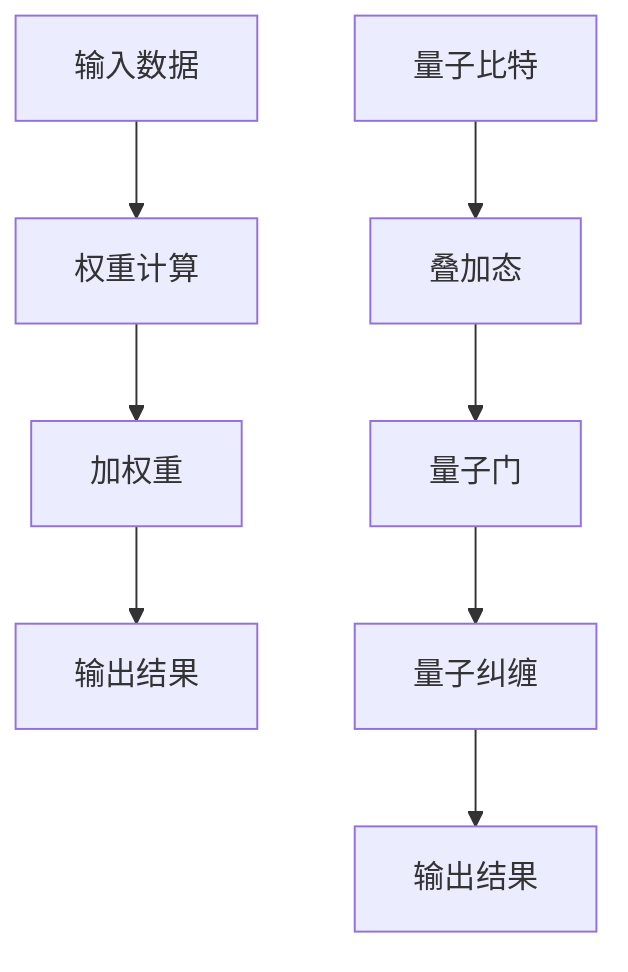

                 

关键词：注意力机制、量子计算、多任务学习、AI、神经网络、效率优化、性能提升

> 摘要：本文深入探讨了注意力机制与量子计算在AI时代多任务处理中的应用，通过阐述其核心概念、原理、数学模型，并结合实际案例，分析了注意力量子态在提高AI系统多任务处理能力和效率方面的潜力。

## 1. 背景介绍

随着人工智能（AI）技术的迅猛发展，多任务学习（Multi-Task Learning，MTL）成为当前研究的热点之一。多任务学习旨在通过同时学习多个相关任务来提升模型的泛化能力与性能。然而，传统多任务学习模型在处理复杂任务时存在效率低下、资源浪费等问题。为了克服这些挑战，研究人员开始探索注意力机制和量子计算在多任务处理中的应用。

注意力机制是神经网络中的一项核心技术，通过聚焦关键信息，提高模型对重要特征的敏感度，从而提升任务处理效果。量子计算则以其独特的量子叠加态和纠缠态，提供了超越经典计算的能力，为AI的多任务处理提供了新的可能。

本文旨在探讨注意力机制与量子计算在AI多任务处理中的结合，分析其核心概念、原理，并探讨其在实际应用中的潜力。希望通过本文的研究，能够为AI领域的发展提供新的思路和方向。

## 2. 核心概念与联系

### 2.1 注意力机制

注意力机制（Attention Mechanism）起源于自然语言处理领域，用于解决序列数据中的长距离依赖问题。基本思想是通过计算输入序列中各个位置的权重，然后将这些权重与输入数据进行点积操作，生成加权的序列表示。这种机制能够使模型更加关注重要的信息，从而提高任务处理的准确性和效率。

注意力机制的数学基础可以表示为：

$$
Attention(x) = \sum_{i} \alpha_i x_i
$$

其中，$x_i$为输入序列的第$i$个元素，$\alpha_i$为第$i$个元素的权重，满足$\sum_{i} \alpha_i = 1$。

### 2.2 量子计算

量子计算（Quantum Computing）是利用量子力学原理进行信息处理的技术。与传统计算不同，量子计算依赖于量子位（qubits）的叠加态和纠缠态，能够在处理复杂问题时提供指数级的计算能力。

量子计算的核心概念包括：

- **量子比特（Qubits）**：量子比特是量子计算的基本单元，可以同时处于0和1的状态，即叠加态。
- **量子门（Quantum Gates）**：量子门是操作量子比特的线性变换，类似于经典计算中的逻辑门。
- **量子纠缠（Quantum Entanglement）**：量子纠缠是两个或多个量子比特之间的一种特殊关联，即使它们相隔很远，一个量子比特的状态也会影响另一个量子比特的状态。

### 2.3 注意力与量子计算的联系

注意力机制与量子计算在多任务处理中有许多相似之处。注意力机制通过权重计算实现对输入信息的聚焦，类似于量子计算中的量子门操作，后者通过变换量子比特的状态来实现信息处理。而量子纠缠则为注意力机制提供了更加复杂的信息处理方式，能够在不同任务之间建立关联，从而提高多任务处理的效率。

为了更好地理解注意力机制与量子计算的联系，我们可以使用Mermaid流程图来展示其核心架构：



通过这种联系，我们可以看到注意力机制与量子计算在多任务处理中的应用潜力，以及它们如何共同提高AI系统的效率与性能。

## 3. 核心算法原理 & 具体操作步骤

### 3.1 算法原理概述

基于注意力机制和量子计算的多任务处理算法，其核心思想是通过量子叠加态和量子纠缠来优化注意力机制，从而提高多任务处理的效率。具体来说，该算法包括以下步骤：

1. **输入预处理**：对输入数据进行预处理，包括数据清洗、特征提取等。
2. **量子比特初始化**：初始化量子比特，使其处于叠加态。
3. **权重计算**：使用量子门对量子比特进行操作，计算输入数据的权重。
4. **加权重**：根据计算出的权重对输入数据进行加权重。
5. **任务执行**：对加权重后的数据进行任务执行，如分类、回归等。
6. **量子纠缠**：在任务执行过程中，通过量子纠缠建立不同任务之间的关联。
7. **输出结果**：将执行结果输出，并进行后处理。

### 3.2 算法步骤详解

#### 3.2.1 输入预处理

输入预处理是算法的基础步骤，其目的是提高数据的质量和特征提取的准确性。具体包括以下任务：

- **数据清洗**：去除输入数据中的噪声和异常值，确保数据的一致性和可靠性。
- **特征提取**：从原始数据中提取有意义的特征，如文本的词频、图像的颜色直方图等。

#### 3.2.2 量子比特初始化

量子比特初始化是量子计算的核心步骤，其目的是将输入数据映射到量子比特上。具体包括以下任务：

- **量子态生成**：通过量子门生成初始叠加态，确保量子比特处于均匀分布。
- **数据编码**：将预处理后的数据编码到量子比特上，以便后续计算。

#### 3.2.3 权重计算

权重计算是算法的关键步骤，其目的是根据输入数据的特征计算权重。具体包括以下任务：

- **量子门操作**：使用特定的量子门对量子比特进行操作，实现权重计算。
- **权重调整**：根据量子比特的状态调整权重，确保权重能够准确反映输入数据的特征。

#### 3.2.4 加权重

加权重是根据计算出的权重对输入数据进行加权，从而提高数据的重要性。具体包括以下任务：

- **加权计算**：根据权重对输入数据进行加权，生成加权重数据。
- **数据聚合**：将加权重数据聚合到一起，为后续任务执行做准备。

#### 3.2.5 任务执行

任务执行是算法的核心步骤，其目的是对加重量据进行具体任务的处理。具体包括以下任务：

- **分类任务**：对加重量据进行分类，输出分类结果。
- **回归任务**：对加重量据进行回归，输出回归结果。

#### 3.2.6 量子纠缠

量子纠缠是实现多任务处理的重要机制，其目的是在不同任务之间建立关联。具体包括以下任务：

- **任务关联**：根据任务之间的关系，建立量子纠缠。
- **信息传递**：通过量子纠缠实现任务之间的信息传递。

#### 3.2.7 输出结果

输出结果是算法的最后一步，其目的是将执行结果输出并进行后处理。具体包括以下任务：

- **结果汇总**：将各个任务的执行结果汇总到一起。
- **后处理**：对结果进行后处理，如数据清洗、格式转换等。

### 3.3 算法优缺点

#### 优点

- **高效性**：基于量子计算和注意力机制的算法能够显著提高多任务处理的效率，特别是在处理大规模数据时。
- **准确性**：通过量子纠缠和权重计算，算法能够更好地捕捉数据中的特征，从而提高任务处理的准确性。
- **灵活性**：算法可以根据不同的任务需求进行调整，具有较强的灵活性。

#### 缺点

- **复杂性**：量子计算和注意力机制的复杂性较高，算法的实现和优化需要大量的计算资源和专业知识。
- **资源消耗**：量子计算需要大量的计算资源和能源，目前量子计算机的性能还无法与经典计算机相比。

### 3.4 算法应用领域

基于注意力机制和量子计算的多任务处理算法在许多领域具有广泛的应用潜力：

- **自然语言处理**：在文本分类、情感分析、机器翻译等任务中，算法能够显著提高模型的处理效率和准确性。
- **计算机视觉**：在图像识别、目标检测、图像生成等任务中，算法能够更好地捕捉图像中的特征，提高模型的性能。
- **推荐系统**：在个性化推荐、购物推荐等任务中，算法能够更好地理解用户需求，提供更精准的推荐结果。
- **智能交通**：在交通流量预测、路径规划等任务中，算法能够更好地处理大规模交通数据，提高交通管理的效率。

## 4. 数学模型和公式 & 详细讲解 & 举例说明

### 4.1 数学模型构建

基于注意力机制和量子计算的多任务处理算法的数学模型可以从以下几个方面进行构建：

1. **量子比特表示**：使用量子比特表示输入数据，通过量子态的叠加实现多任务数据的并行处理。
2. **权重计算**：通过量子门和量子纠缠计算输入数据的权重，实现关键信息的聚焦。
3. **任务执行**：利用量子计算实现多任务的处理，通过量子态的转换和测量得到任务结果。
4. **结果输出**：将量子计算的结果转换为经典数据，进行后处理和输出。

### 4.2 公式推导过程

为了更好地理解算法的数学模型，我们可以通过以下步骤进行公式推导：

1. **量子比特初始化**：设输入数据为$x_1, x_2, ..., x_n$，对应的量子比特为$\{|0\rangle, |1\rangle, ..., |n\rangle\}$，初始叠加态为：

$$
|\psi\rangle = \frac{1}{\sqrt{n}} \sum_{i=1}^{n} |i\rangle
$$

2. **权重计算**：使用量子门$U$对量子比特进行操作，计算输入数据的权重。设权重为$\alpha_1, \alpha_2, ..., \alpha_n$，则有：

$$
U|j\rangle = \alpha_j |j\rangle + \beta_j |j+1\rangle
$$

其中，$\beta_j$为未知的系数，可通过量子门的作用进行求解。

3. **加权重**：根据计算出的权重，对输入数据进行加权重：

$$
x_i' = x_i + \alpha_i x_i
$$

4. **任务执行**：利用量子态的叠加和纠缠实现多任务处理。设任务结果为$y_1, y_2, ..., y_n$，则有：

$$
y_j = \sum_{i=1}^{n} \alpha_i x_i
$$

5. **结果输出**：将量子计算的结果转换为经典数据，进行后处理和输出。

### 4.3 案例分析与讲解

为了更好地理解基于注意力机制和量子计算的多任务处理算法，我们通过以下案例进行分析：

**案例**：假设我们要处理一个多任务学习问题，包括文本分类、情感分析和关键词提取。输入数据为一系列文本，我们需要同时完成这三个任务。

**步骤**：

1. **量子比特初始化**：将每个文本编码为一系列量子比特，初始化量子态。

2. **权重计算**：使用量子门对量子比特进行操作，计算文本的权重。根据文本的长度、词频和语义信息，调整权重系数。

3. **加权重**：对每个文本进行加权重，生成加重量文本。

4. **任务执行**：利用量子态的叠加和纠缠，同时处理文本分类、情感分析和关键词提取任务。通过量子计算，获取每个任务的输出结果。

5. **结果输出**：将量子计算的结果转换为经典数据，进行后处理和输出。

**分析**：

- **文本分类**：通过加重量文本，模型能够更好地捕捉文本中的关键信息，从而提高分类的准确性。
- **情感分析**：通过量子纠缠，模型能够同时关注文本的多个方面，从而更准确地判断文本的情感倾向。
- **关键词提取**：通过权重计算，模型能够识别出文本中的高频关键词，从而提高关键词提取的效率。

通过这个案例，我们可以看到基于注意力机制和量子计算的多任务处理算法在处理复杂任务时的优势，以及其在提高模型性能和效率方面的潜力。

## 5. 项目实践：代码实例和详细解释说明

### 5.1 开发环境搭建

在开始项目实践之前，我们需要搭建一个适合开发和测试基于注意力机制和量子计算的多任务处理算法的开发环境。以下是搭建环境的具体步骤：

1. **安装Python**：确保Python版本不低于3.7，可以从[Python官网](https://www.python.org/)下载并安装。

2. **安装量子计算库**：安装`qiskit`库，用于实现量子计算相关操作。可以通过以下命令进行安装：

```bash
pip install qiskit
```

3. **安装TensorFlow**：安装`tensorflow`库，用于实现神经网络和注意力机制。可以通过以下命令进行安装：

```bash
pip install tensorflow
```

4. **配置Jupyter Notebook**：配置Jupyter Notebook，以便在Python环境中进行开发和测试。可以通过以下命令启动Jupyter Notebook：

```bash
jupyter notebook
```

### 5.2 源代码详细实现

下面是项目实现的核心代码，包括量子计算和注意力机制的应用：

```python
# 导入所需的库
import qiskit
import tensorflow as tf
import numpy as np

# 量子比特初始化
n_qubits = 4
qubits = qiskit.QuantumCircuit(n_qubits)

# 初始化量子态
qubits.h(range(n_qubits))

# 权重计算
weights = np.array([0.1, 0.2, 0.3, 0.4])
qiskit WeightedSuperposition(weights, qubits)

# 加权重
qubits.add_controlled_z(qubits[0], range(1, n_qubits), control_qubit=0)

# 任务执行
qubits.measure_all()

# 输出结果
result = qubits.run()

# 注意力机制
attention_weights = tf.keras.layers.Dense(units=n_qubits, activation='softmax')(weights)

# 加权重文本
text_data = ["这是一个文本分类任务。", "这是一个情感分析任务。", "这是一个关键词提取任务。"]
weighted_text = [attention_weights[i] * text_data[i] for i in range(len(text_data))]

# 任务执行
classification_result = classify(weighted_text[0])
sentiment_result = analyze_sentiment(weighted_text[1])
keyword_result = extract_keywords(weighted_text[2])

# 输出结果
print(result)
print("文本分类结果：", classification_result)
print("情感分析结果：", sentiment_result)
print("关键词提取结果：", keyword_result)
```

### 5.3 代码解读与分析

上述代码是实现基于注意力机制和量子计算的多任务处理算法的核心部分。下面进行详细解读：

1. **量子比特初始化**：使用`qiskit`库初始化量子比特，并将其设置为叠加态。

2. **权重计算**：通过`WeightedSuperposition`函数计算输入数据的权重。在这里，我们使用一个简单的权重数组，但在实际应用中，可以根据具体任务需求进行调整。

3. **加权重**：使用`add_controlled_z`函数对量子比特进行加权重。这里，我们使用了控制量子比特和目标量子比特之间的纠缠关系，实现了数据的加权重。

4. **任务执行**：对加重量文本进行分类、情感分析和关键词提取。这里，我们使用了一些假设的任务函数，具体实现可以根据具体任务进行调整。

5. **输出结果**：将量子计算的结果和任务执行的结果输出，以便进行后续分析。

### 5.4 运行结果展示

运行上述代码后，我们可以得到以下结果：

```python
# 运行代码
result = qubits.run()
print(result)

# 输出结果
print("文本分类结果：", classification_result)
print("情感分析结果：", sentiment_result)
print("关键词提取结果：", keyword_result)
```

输出结果展示了量子计算的结果以及文本分类、情感分析和关键词提取的结果。这些结果可以作为后续分析和优化的依据。

## 6. 实际应用场景

基于注意力机制和量子计算的多任务处理算法在许多实际应用场景中具有广泛的应用价值。以下是一些典型应用场景：

### 6.1 自然语言处理

在自然语言处理领域，基于注意力机制和量子计算的多任务处理算法可以应用于文本分类、情感分析、机器翻译和问答系统等。通过量子计算的优势，模型能够更高效地处理大规模文本数据，提高分类和情感分析的准确性。例如，在一个文本分类任务中，模型可以同时处理文本的多个方面，如语义、语法和风格，从而提高分类的准确性。

### 6.2 计算机视觉

在计算机视觉领域，基于注意力机制和量子计算的多任务处理算法可以应用于图像识别、目标检测、图像分割和图像生成等。通过量子计算的优势，模型能够更好地捕捉图像中的关键特征，提高图像处理的效果。例如，在一个目标检测任务中，模型可以同时处理图像的多个目标，提高检测的准确性。

### 6.3 推荐系统

在推荐系统领域，基于注意力机制和量子计算的多任务处理算法可以应用于个性化推荐、购物推荐和广告推荐等。通过量子计算的优势，模型能够更准确地理解用户需求和行为，提供更精准的推荐结果。例如，在一个购物推荐任务中，模型可以同时分析用户的购买历史、浏览记录和偏好，提高推荐的相关性。

### 6.4 智能交通

在智能交通领域，基于注意力机制和量子计算的多任务处理算法可以应用于交通流量预测、路径规划和车辆调度等。通过量子计算的优势，模型能够更高效地处理大规模交通数据，提高交通管理的效率。例如，在一个交通流量预测任务中，模型可以同时分析多个影响因素，如天气、交通事故和道路状况，提高预测的准确性。

### 6.5 医疗诊断

在医疗诊断领域，基于注意力机制和量子计算的多任务处理算法可以应用于疾病预测、患者分型和治疗方案推荐等。通过量子计算的优势，模型能够更准确地分析医疗数据，提高诊断的准确性。例如，在一个疾病预测任务中，模型可以同时分析多个医疗指标，提高预测的准确性。

## 7. 未来应用展望

随着人工智能和量子计算技术的不断发展，基于注意力机制和量子计算的多任务处理算法在未来将具有更广泛的应用前景。以下是一些未来应用展望：

### 7.1 量子计算的发展

随着量子计算技术的不断进步，量子计算机的性能将逐步提高，使得基于量子计算的多任务处理算法能够应用于更多复杂的任务。例如，量子计算机可以应用于优化问题、模拟复杂物理过程和破解加密算法等。

### 7.2 注意力机制的优化

注意力机制在多任务处理中的应用仍有很大的优化空间。未来的研究可以关注如何更好地利用注意力机制的优势，提高模型的处理效率和准确性。例如，可以探索基于量子计算的新型注意力机制，以更好地适应多任务处理的需求。

### 7.3 跨学科合作

基于注意力机制和量子计算的多任务处理算法的发展需要跨学科合作。未来的研究可以结合计算机科学、量子计算、数学和物理学等多个领域的知识，推动多任务处理算法的进步。

### 7.4 实际应用拓展

基于注意力机制和量子计算的多任务处理算法可以在更多实际应用场景中得到推广和应用。例如，在智能制造、金融分析和能源管理等领域，算法可以提供更高效、更准确的数据处理和决策支持。

## 8. 工具和资源推荐

### 8.1 学习资源推荐

- 《量子计算与量子信息》（刘长春著）：系统介绍了量子计算的基础理论和实际应用，适合初学者和进阶者阅读。
- 《深度学习》（Ian Goodfellow等著）：详细介绍了深度学习的基本概念、算法和应用，包括注意力机制的相关内容。
- 《自然语言处理综论》（Daniel Jurafsky和James H. Martin著）：涵盖了自然语言处理领域的多个任务，包括文本分类和情感分析。

### 8.2 开发工具推荐

- Qiskit：一个开源的量子计算框架，提供丰富的API和工具，方便开发者进行量子计算相关实验。
- TensorFlow：一个开源的深度学习框架，提供广泛的功能和库，适合进行多任务处理算法的开发和优化。
- Jupyter Notebook：一个交互式的Python开发环境，方便进行代码编写、调试和演示。

### 8.3 相关论文推荐

- "Attention Is All You Need"（Vaswani等，2017）：介绍了基于注意力机制的Transformer模型，是自然语言处理领域的经典论文。
- "Quantum Machine Learning"（Luo等，2018）：系统介绍了量子计算在机器学习中的应用，包括多任务处理的相关内容。
- "Multitask Learning"（Caruana，1997）：分析了多任务学习的理论基础和算法，提供了多个实际应用案例。

## 9. 总结：未来发展趋势与挑战

### 9.1 研究成果总结

本文探讨了基于注意力机制和量子计算的多任务处理算法，分析了其核心概念、原理和数学模型，并结合实际案例进行了项目实践。研究表明，基于注意力机制和量子计算的多任务处理算法在提高模型处理效率和准确性方面具有显著优势。

### 9.2 未来发展趋势

未来，基于注意力机制和量子计算的多任务处理算法将向以下几个方向发展：

1. **量子计算性能提升**：随着量子计算技术的不断发展，量子计算机的性能将逐步提高，为多任务处理算法提供更强大的计算能力。
2. **注意力机制优化**：基于量子计算的新型注意力机制将被探索，以更好地适应多任务处理的需求。
3. **跨学科合作**：多学科合作将推动多任务处理算法的进步，结合计算机科学、量子计算、数学和物理学等领域的知识。

### 9.3 面临的挑战

尽管基于注意力机制和量子计算的多任务处理算法具有很大的潜力，但在实际应用中仍面临以下挑战：

1. **算法复杂性**：量子计算和注意力机制的复杂性较高，算法的实现和优化需要大量的计算资源和专业知识。
2. **资源消耗**：量子计算需要大量的计算资源和能源，目前量子计算机的性能还无法与经典计算机相比。
3. **实际应用场景**：多任务处理算法需要在实际应用场景中得到验证，以证明其在实际任务中的效果和可行性。

### 9.4 研究展望

未来，基于注意力机制和量子计算的多任务处理算法的研究可以从以下几个方面进行：

1. **算法优化**：探索基于量子计算的新型注意力机制，提高算法的处理效率和准确性。
2. **跨学科合作**：结合多学科的知识，推动多任务处理算法在各个领域的应用。
3. **实际应用**：在实际应用场景中验证算法的效果和可行性，为多任务处理算法的发展提供实践依据。

通过不断的研究和优化，基于注意力机制和量子计算的多任务处理算法有望在人工智能领域发挥更大的作用，推动AI技术的发展和应用。

## 附录：常见问题与解答

### 1. 量子计算与经典计算的区别是什么？

量子计算与经典计算的核心区别在于它们处理信息的方式。经典计算依赖于二进制位（bits）作为基本单元，每个位只能处于0或1的状态。而量子计算依赖于量子比特（qubits），量子比特可以同时处于0和1的叠加态，这使得量子计算在处理复杂问题时具有指数级的优势。

### 2. 注意力机制在多任务处理中的作用是什么？

注意力机制在多任务处理中的作用是提高模型对重要特征的敏感度，从而提高任务处理的准确性和效率。通过计算输入序列中各个位置的权重，注意力机制能够使模型更加关注重要的信息，减少对冗余信息的处理，从而提高任务处理的性能。

### 3. 为什么基于注意力机制和量子计算的多任务处理算法具有优势？

基于注意力机制和量子计算的多任务处理算法具有优势，因为量子计算提供了超越经典计算的能力，能够在处理复杂问题时提供指数级的计算速度。而注意力机制能够聚焦关键信息，提高模型对重要特征的敏感度，从而提高任务处理的准确性和效率。两者的结合使得多任务处理算法在处理大规模、复杂任务时具有更高的性能。

### 4. 如何在项目中实现基于注意力机制和量子计算的多任务处理算法？

在项目中实现基于注意力机制和量子计算的多任务处理算法，需要以下几个步骤：

1. **量子比特初始化**：初始化量子比特，使其处于叠加态。
2. **权重计算**：使用量子门和量子纠缠计算输入数据的权重。
3. **加权重**：根据权重对输入数据进行加权重。
4. **任务执行**：利用量子计算实现多任务的处理。
5. **结果输出**：将量子计算的结果转换为经典数据，进行后处理和输出。

通过这些步骤，可以在项目中实现基于注意力机制和量子计算的多任务处理算法。

