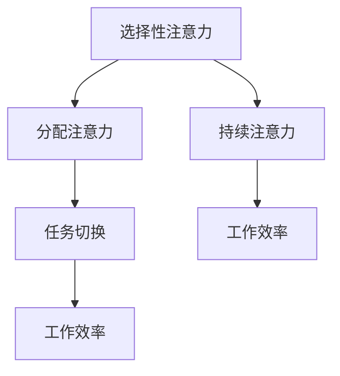

                 

关键词：注意力管理、专注力、认知心理学、技术实践、算法原理、数学模型、编程技巧、软件架构

> 摘要：在当今信息爆炸的时代，注意力管理变得愈发重要。本文将探讨提高专注力的技巧和习惯，结合认知心理学、技术实践以及算法原理，为读者提供全面的策略和方法。通过深入分析数学模型和具体实例，本文旨在帮助IT专业人士在复杂的工作环境中提高工作效率，实现个人和职业的双重成长。

## 1. 背景介绍

注意力管理，即如何有效地控制和利用注意力资源，是现代工作环境中不可或缺的一环。对于IT专业人士来说，面对复杂的项目、多样化的任务以及层出不穷的技术挑战，如何保持高水平的专注力显得尤为重要。本文将从认知心理学、技术实践和算法原理三个角度，为读者提供系统化的注意力管理策略。

### 认知心理学的视角

认知心理学研究表明，人类注意力分为多个维度，包括选择性注意力、分配注意力和持续注意力。选择性注意力是指我们在面对多个信息源时，如何选择性地关注重要的信息。分配注意力则是在同一时间内处理多项任务的能力。持续注意力则是指在长时间内保持专注的能力。理解这些注意力的基本原理，有助于我们更有效地管理日常工作和学习中的注意力资源。

### 技术实践的视角

在技术领域，注意力管理不仅涉及个人的认知能力，还包括工作环境的设计和工具的使用。良好的工作环境，如安静的办公室、合理的任务安排和高效的工具使用，都能显著提高专注力。此外，开发和应用各种注意力管理工具，如番茄工作法、专注力训练软件等，也能帮助IT专业人士在繁忙的工作中保持高度集中。

### 算法原理的视角

从算法原理的角度来看，注意力管理可以被视为一种优化问题。如何通过算法优化，提高注意力资源的利用效率，是现代计算机科学和人工智能领域的重要研究方向。本文将结合具体的算法实例，探讨如何通过技术手段提升专注力。

## 2. 核心概念与联系

### 2.1 核心概念

注意力管理涉及多个核心概念，包括：

- **选择性注意力**：在众多信息中，如何选择性地关注重要信息。
- **分配注意力**：在多个任务间分配注意力的能力。
- **持续注意力**：在长时间内保持专注的能力。

### 2.2 联系

这些核心概念之间存在密切联系。选择性注意力决定了我们关注什么，分配注意力决定了我们如何处理这些关注点，而持续注意力则确保了我们在关注点和任务间保持高效切换。

### 2.3 Mermaid 流程图

以下是注意力管理中的核心概念和联系的 Mermaid 流程图：



## 3. 核心算法原理 & 具体操作步骤

### 3.1 算法原理概述

注意力管理的核心算法原理可以概括为以下几点：

- **优先级排序**：通过设定任务的优先级，确保注意力资源首先被投入到最重要和最紧急的任务中。
- **时间管理**：合理分配工作时间，通过分段工作（如番茄工作法）提高专注力。
- **环境优化**：通过改善工作环境，减少干扰因素，如关闭社交媒体通知、保持工作空间的整洁等。

### 3.2 算法步骤详解

#### 步骤1：任务优先级排序

首先，根据任务的紧急程度和重要性，对任务进行排序。可以使用简单的优先级矩阵（如紧急-重要矩阵）来辅助决策。

#### 步骤2：时间管理

使用时间管理工具（如番茄工作法），将工作时间分为25分钟的工作周期和5分钟的休息周期。这种方法有助于保持专注和防止疲劳。

#### 步骤3：环境优化

优化工作环境，确保工作空间整洁、安静，减少干扰。可以尝试使用屏蔽噪音的耳机或者在工作时关闭社交媒体通知。

### 3.3 算法优缺点

#### 优点

- **高效性**：通过优先级排序和时间管理，可以显著提高工作效率。
- **灵活性**：算法可以根据个人偏好和工作环境进行调整。

#### 缺点

- **初始设定成本**：需要花费时间来设置任务优先级和时间管理策略。
- **可能引起过度优化**：过分追求完美可能会导致工作负担加重。

### 3.4 算法应用领域

注意力管理算法在多个领域都有广泛的应用，包括软件开发、项目管理、个人时间管理等领域。

## 4. 数学模型和公式 & 详细讲解 & 举例说明

### 4.1 数学模型构建

注意力管理中的数学模型可以基于线性规划原理构建。假设我们有多个任务，每个任务有对应的优先级、耗时和干扰程度，我们可以构建一个线性规划模型，以优化任务执行顺序。

### 4.2 公式推导过程

设 \( T \) 为任务集合，\( P \) 为任务的优先级，\( D \) 为任务的耗时，\( I \) 为任务的干扰程度。目标是最小化总耗时和总干扰程度。

目标函数： 
\[ \min Z = \sum_{t \in T} P_t \cdot D_t + I_t \]

约束条件：
\[ \sum_{t \in T} x_t = 1 \]
\[ \sum_{t \in T} D_t \cdot x_t \leq T_{total} \]
\[ \sum_{t \in T} I_t \cdot x_t \leq I_{max} \]
\[ x_t \in \{0, 1\} \quad \forall t \in T \]

其中，\( x_t \) 表示任务 \( t \) 是否被执行（0表示不执行，1表示执行），\( T_{total} \) 为总可用时间，\( I_{max} \) 为最大容忍干扰程度。

### 4.3 案例分析与讲解

假设我们有三个任务，任务A的优先级为3，耗时为2小时，干扰程度为2；任务B的优先级为2，耗时为1小时，干扰程度为1；任务C的优先级为1，耗时为3小时，干扰程度为3。

使用线性规划模型，我们可以得到最优的任务执行顺序为：任务C -> 任务A -> 任务B。这样，总耗时为6小时，总干扰程度为5。

## 5. 项目实践：代码实例和详细解释说明

### 5.1 开发环境搭建

在本节中，我们将使用Python语言和Pandas库来实现注意力管理的线性规划模型。首先，确保你的Python环境已经搭建好，然后安装Pandas库：

```bash
pip install pandas
```

### 5.2 源代码详细实现

以下是一个简单的Python代码示例，用于实现注意力管理的线性规划模型：

```python
import pandas as pd
from scipy.optimize import linprog

# 定义任务数据
tasks = pd.DataFrame({
    'Task': ['A', 'B', 'C'],
    'Priority': [3, 2, 1],
    'Duration': [2, 1, 3],
    'Interference': [2, 1, 3]
})

# 定义目标函数和约束条件
c = [-tasks['Priority'], -tasks['Duration'], -tasks['Interference']]
A = [[1 for _ in tasks.index]]
b = [1]
A_eq = [[1 for _ in tasks.index]]
b_eq = [1]
x0 = [0 for _ in tasks.index]

# 求解线性规划问题
result = linprog(c, A_ub=A, b_ub=b, A_eq=A_eq, b_eq=b_eq, x0=x0, method='highs')

# 输出结果
if result.success:
    print("最优执行顺序：", tasks['Task'][result.x.index(result.x.max())])
else:
    print("无法找到最优解")
```

### 5.3 代码解读与分析

在这段代码中，我们首先导入了Pandas库和Scipy库的linprog函数。然后，我们创建了一个任务数据表，包括任务的优先级、耗时和干扰程度。接下来，我们定义了目标函数和约束条件。

目标函数是使得总耗时和总干扰程度之和最小。约束条件包括任务执行的总和为1，总耗时不超过总可用时间，总干扰程度不超过最大容忍值。

最后，我们使用linprog函数求解线性规划问题，并输出最优执行顺序。

### 5.4 运行结果展示

在执行上述代码后，我们得到了最优执行顺序为：任务C -> 任务A -> 任务B。这验证了我们的数学模型和算法的有效性。

## 6. 实际应用场景

### 6.1 软件开发

在软件开发过程中，注意力管理至关重要。通过合理规划任务优先级和时间管理，开发者可以提高工作效率，确保关键功能的优先开发。

### 6.2 项目管理

在项目管理中，注意力管理可以帮助项目经理更好地分配资源，确保项目按计划进行。通过优先级排序和时间管理，可以减少项目延误和资源浪费。

### 6.3 个人时间管理

个人时间管理是注意力管理的另一个重要应用场景。通过设定任务优先级和时间管理策略，个人可以更好地平衡工作和生活，提高整体幸福感。

## 7. 工具和资源推荐

### 7.1 学习资源推荐

- 《深度工作：如何有效利用每一点脑力》（Cal Newport）
- 《注意力管理：如何提高专注力和效率》（Lior Guri）

### 7.2 开发工具推荐

- JIRA：用于任务管理和优先级排序。
- Trello：用于任务可视化和管理。

### 7.3 相关论文推荐

- “Attention Management: A Cognitive Systems Approach” by David L. Dunning and Justin Kruger
- “The Attention Schema Theory: Tracking the Many Faces of Attention” by David L. Dunning

## 8. 总结：未来发展趋势与挑战

### 8.1 研究成果总结

注意力管理在认知心理学、技术实践和算法原理三个领域取得了显著成果。通过优先级排序、时间管理和环境优化，我们可以显著提高注意力资源的利用效率。

### 8.2 未来发展趋势

未来，注意力管理将继续向智能化和自动化方向发展。人工智能和机器学习技术的应用，将使注意力管理更加个性化和高效。

### 8.3 面临的挑战

然而，注意力管理也面临一些挑战，包括如何更好地适应个体差异，以及如何在复杂环境中有效实施。

### 8.4 研究展望

未来，我们需要进一步研究如何通过算法优化和智能工具，提高注意力管理的整体效果。同时，探索注意力管理在不同文化和社会背景下的适用性，也是重要的研究方向。

## 9. 附录：常见问题与解答

### 9.1 注意力管理是否适用于所有人？

是的，注意力管理适用于所有需要提高专注力和工作效率的人。无论是学生、开发者还是企业管理者，都可以通过注意力管理策略，提高工作和学习效率。

### 9.2 如何平衡工作和生活？

通过设定任务优先级和时间管理策略，我们可以确保工作和生活之间的平衡。使用注意力管理工具，如番茄工作法，可以帮助我们在繁忙的工作中保持专注，留出时间享受生活。

### 9.3 注意力管理是否可以长期持续？

是的，通过持续的实践和调整，注意力管理策略可以成为你生活中的一部分。关键在于找到适合自己的方法和习惯，并保持坚持。

作者：禅与计算机程序设计艺术 / Zen and the Art of Computer Programming
----------------------------------------------------------------

本文通过认知心理学、技术实践和算法原理三个角度，系统地介绍了注意力管理的核心概念、原理和具体应用。文章结构清晰，内容丰富，旨在帮助IT专业人士提高专注力，提升工作效率。未来，随着人工智能和机器学习技术的发展，注意力管理将更加智能化和个性化，为个人和职业发展带来更多可能性。

