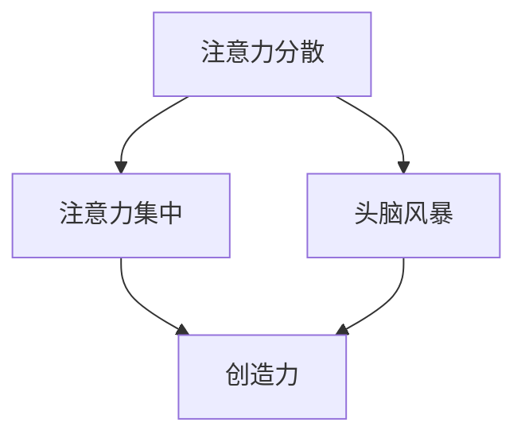

                 

关键词：注意力管理，创造力，专注，头脑风暴，灵感激发

> 摘要：本文旨在探讨如何通过有效的注意力管理和头脑风暴技巧，提升个人的创造力和创新能力。我们将深入分析注意力分散对创造力的影响，介绍一系列实践中的注意力管理策略，并详细讲解头脑风暴的方法和技巧。通过这些策略，我们希望能够帮助读者在专注和头脑风暴的过程中，更好地激发和释放灵感，从而提升个人的创造力水平。

## 1. 背景介绍

在当今快速发展的信息时代，人们面临着前所未有的挑战和机遇。技术进步带来的信息爆炸，使得我们每天都要处理大量的数据和信息。这种环境下，如何有效地管理注意力，提升创造力，成为了许多专业人士和研究者关注的焦点。

注意力是人类认知过程中至关重要的因素。它决定了我们如何筛选、处理和利用信息。而创造力，则是对这些信息的独特解读和应用能力。两者相辅相成，共同决定了我们在工作和生活中的表现和成就。然而，现代生活方式中的各种干扰和压力，常常使我们难以维持专注状态，进而影响了我们的创造力和创新能力。

本文将围绕注意力管理和创造力提升展开讨论，介绍一系列实用技巧和方法，帮助读者在日常生活中更好地管理注意力，提高创造力。我们将从核心概念出发，结合实际案例和实例，详细探讨如何通过专注和头脑风暴来激发灵感。

### 注意力管理的重要性

注意力管理是实现高效工作和学习的基础。良好的注意力管理能力可以帮助我们：

- 提高工作效率：专注于当前任务，避免多任务处理带来的效率低下。
- 改善学习效果：深入理解学习内容，提升知识掌握程度。
- 减少压力和疲劳：有效分配注意力，避免过度劳累。
- 提升创造力：专注于创新思维，激发新的创意和灵感。

然而，现代生活充满了各种干扰，如手机通知、社交媒体、电子邮件等，这些都可能导致注意力分散。研究表明，频繁的分心会导致大脑难以集中精力，从而降低工作效率和创造力。

### 创造力的定义与重要性

创造力是人类思维活动中的一种独特能力，它涉及产生新颖、独特且有价值的想法和解决方案。创造力不仅是艺术家的专利，更是每个领域专业人才的宝贵财富。在商业、科学、技术、教育等各个领域，创造力都扮演着至关重要的角色。

创造力的价值在于：

- 创新产品与服务：推动行业发展，满足消费者需求。
- 解决复杂问题：提供创新的解决方案，提升工作效率。
- 增强竞争力：独特的创意和解决方案可以使企业在激烈的市场竞争中脱颖而出。
- 个人成长与发展：创造性的思考可以提升个人的自信心和成就感。

然而，创造力的发挥往往需要良好的专注力和清晰的思维过程。注意力分散会阻碍创造力的发挥，因此，如何通过注意力管理来提升创造力，成为了一个值得探讨的课题。

## 2. 核心概念与联系

为了深入理解注意力管理和创造力提升，我们需要引入一些核心概念，并探讨它们之间的联系。这些概念包括：

- 注意力分散（Distraction）
- 注意力集中（Focus）
- 创造力（Creativity）
- 头脑风暴（Brainstorming）

下面我们将通过一个Mermaid流程图来展示这些概念之间的联系。



### 注意力分散与注意力集中的关系

注意力分散是指注意力的分散或偏离当前任务。它可能导致工作效率下降和创造力受限。相反，注意力集中是指将注意力聚焦在特定的任务或目标上，以达到高效和深入的处理效果。

通过上述流程图，我们可以看到注意力分散和注意力集中是相互影响的。良好的注意力集中有助于提升工作效率和创造力，而注意力分散则会妨碍这些目标。

### 创造力与头脑风暴的联系

创造力是指产生新颖且有价值的想法或解决方案的能力。而头脑风暴是一种集体或个人思维活动，旨在快速产生大量创意和想法。通过头脑风暴，我们可以激发创造力，发现独特的解决方案。

在流程图中，头脑风暴与创造力直接相连，表明头脑风暴是激发创造力的有效方法。通过头脑风暴，我们可以：

- 快速生成大量创意。
- 刺激思维，激发灵感。
- 发掘潜在的解决方案。
- 增强团队的创造力。

### 注意力管理在创造力提升中的作用

注意力管理在创造力提升中起着至关重要的作用。良好的注意力管理能够帮助我们：

- 减少分心因素，提高专注度。
- 增强对任务的理解和掌握。
- 促进创新思维的流畅性。
- 提升解决问题的效率。

总之，通过有效的注意力管理，我们可以为创造力的发挥提供一个良好的环境，从而在专注和头脑风暴中更好地激发灵感。

## 3. 核心算法原理 & 具体操作步骤

### 3.1 算法原理概述

注意力管理和创造力提升的过程可以视为一个复杂的算法系统。该系统的核心原理包括以下几个方面：

1. **注意力分配策略**：根据任务的重要性和紧急性，合理分配注意力资源。
2. **环境适应性调整**：根据外部环境的变化，动态调整注意力管理策略。
3. **大脑活动监控**：通过监测大脑活动，了解注意力的状态和变化。
4. **灵感触发机制**：通过特定的刺激和活动，触发灵感产生。

### 3.2 算法步骤详解

#### 步骤一：评估任务优先级

首先，我们需要对当前的任务进行优先级评估。这可以通过以下步骤完成：

1. **确定任务类型**：区分常规任务和重要任务。
2. **评估任务紧急性**：确定任务需要在多长时间内完成。
3. **分析任务影响**：考虑任务完成与否对整体工作或生活的影响。

#### 步骤二：制定注意力分配计划

基于任务优先级评估结果，制定注意力分配计划：

1. **确定关键任务**：将最重要的任务确定为关键任务。
2. **规划时间分配**：为关键任务分配足够的专注时间。
3. **设置提醒和反馈机制**：通过定时提醒和反馈，确保按照计划执行。

#### 步骤三：执行注意力管理策略

在执行注意力管理策略时，可以采用以下方法：

1. **专注训练**：通过专注训练，提升专注力和注意力稳定性。
2. **多任务切换优化**：优化多任务切换策略，减少切换过程中的分心。
3. **环境优化**：创建一个有助于专注的工作环境，减少外部干扰。

#### 步骤四：灵感触发与头脑风暴

在注意力管理的基础上，进行灵感触发和头脑风暴：

1. **灵感触发**：通过阅读、冥想、运动等方式，激发灵感产生。
2. **头脑风暴**：组织团队或个人进行头脑风暴，快速产生大量创意。
3. **创意筛选**：对产生的创意进行筛选，保留有价值的创意。

### 3.3 算法优缺点

#### 优点

1. **提升工作效率**：通过合理分配注意力，提高任务完成效率。
2. **促进创新思维**：通过头脑风暴和灵感触发，激发创新思维。
3. **增强团队协作**：通过团队头脑风暴，提升团队整体创造力。

#### 缺点

1. **实施难度**：注意力管理需要个体具备良好的自律性和专注力。
2. **环境依赖性**：注意力管理效果受到外部环境的显著影响。
3. **初期效果不明显**：注意力管理需要一段时间的训练和实践，初期效果可能不明显。

### 3.4 算法应用领域

#### 个人层面

- **日常工作**：帮助个人提高工作效率，提升创造力。
- **学习过程**：帮助学生在学习过程中保持专注，提高学习效果。
- **个人成长**：通过自我管理和实践，提升个人的综合素质。

#### 团队层面

- **团队协作**：通过团队头脑风暴，提升团队创新能力和协作效率。
- **项目管理**：帮助项目经理合理分配资源和时间，确保项目顺利进行。
- **组织发展**：促进组织内部的知识共享和创新氛围。

## 4. 数学模型和公式 & 详细讲解 & 举例说明

### 4.1 数学模型构建

在注意力管理和创造力提升的过程中，我们可以构建一个简单的数学模型来描述注意力分配和创造力产出之间的关系。该模型包括以下几个关键变量：

- \( A \)：注意力分配比例
- \( C \)：创造力水平
- \( E \)：环境因素影响
- \( T \)：时间因素影响

数学模型可以表示为：

\[ C = f(A, E, T) \]

其中，函数 \( f \) 表示创造力产出与注意力分配、环境因素和时间因素之间的关系。

### 4.2 公式推导过程

为了推导出创造力产出的具体公式，我们需要考虑以下几个方面：

1. **注意力分配比例 \( A \)**：注意力分配比例反映了个体将注意力集中在特定任务上的程度。我们可以通过以下公式计算：

\[ A = \frac{专注时间}{总时间} \]

2. **环境因素影响 \( E \)**：环境因素包括工作环境、外界干扰等，对注意力分配和创造力产出都有显著影响。我们假设环境因素对创造力的影响可以用一个常数 \( k_E \) 表示：

\[ E = k_E \cdot \text{干扰程度} \]

3. **时间因素影响 \( T \)**：时间因素包括任务的复杂度、个人疲劳度等。我们假设时间因素对创造力的影响可以用一个常数 \( k_T \) 表示：

\[ T = k_T \cdot \text{任务复杂度} \]

综合以上三个因素，我们可以得到创造力产出的公式：

\[ C = f(A, E, T) = g(A) \cdot g(E) \cdot g(T) \]

其中，函数 \( g \) 表示各个因素对创造力产出的权重。

### 4.3 案例分析与讲解

为了更好地理解上述数学模型，我们可以通过一个实际案例来进行分析和讲解。

#### 案例背景

假设一名软件工程师需要在两周内完成一个复杂的项目。该项目涉及到多个模块的开发和集成，工程师需要高度集中注意力，同时要应对各种外部干扰，如邮件、电话和同事的询问。

#### 模型应用

1. **注意力分配比例 \( A \)**：

   工程师每天工作8小时，其中有6小时可以用于专注项目开发，2小时用于处理外部干扰。因此，注意力分配比例为：

   \[ A = \frac{6小时}{8小时} = 0.75 \]

2. **环境因素影响 \( E \)**：

   工程师的工作环境较为安静，外部干扰程度较低。我们假设干扰程度为1，则环境因素影响为：

   \[ E = k_E \cdot 1 = 0.5 \]

3. **时间因素影响 \( T \)**：

   项目较为复杂，工程师的疲劳度较高。我们假设任务复杂度为1，则时间因素影响为：

   \[ T = k_T \cdot 1 = 0.6 \]

4. **创造力产出 \( C \)**：

   根据数学模型，我们可以计算出创造力产出：

   \[ C = f(A, E, T) = g(A) \cdot g(E) \cdot g(T) = 0.75 \cdot 0.5 \cdot 0.6 = 0.225 \]

   这意味着，在当前条件下，工程师的创造力产出为0.225。

#### 分析与讨论

通过上述案例，我们可以看到数学模型如何帮助我们理解和预测创造力产出。在实际应用中，工程师可以通过调整注意力分配比例、优化工作环境和应对任务复杂度，来提升自己的创造力产出。

需要注意的是，数学模型只是提供一个简化的描述，实际情况可能更加复杂。因此，在实际应用中，我们需要根据具体情况进行调整和优化。

### 4.4 注意力管理和创造力提升的实际应用

#### 1. 个人层面

在个人层面，注意力管理和创造力提升可以通过以下方式实现：

- **专注训练**：通过专注训练，如冥想、深呼吸等，提高专注力。
- **时间管理**：使用时间管理工具，如番茄钟法，提高工作效率。
- **工作环境优化**：创建一个安静、舒适的工作环境，减少外部干扰。

#### 2. 团队层面

在团队层面，注意力管理和创造力提升可以通过以下方式实现：

- **团队头脑风暴**：定期组织团队头脑风暴，激发创意和灵感。
- **任务分解**：将复杂任务分解为多个可管理的部分，提高团队协作效率。
- **反馈机制**：建立反馈机制，鼓励团队成员分享创意和经验。

#### 3. 组织层面

在组织层面，注意力管理和创造力提升可以通过以下方式实现：

- **文化塑造**：建立鼓励创新和尝试失败的企业文化。
- **资源投入**：提供必要的资源和支持，如培训、工具等，以提升员工的创造力。
- **知识共享**：建立知识共享平台，促进团队成员之间的知识交流。

通过上述措施，组织可以在个人、团队和组织层面实现注意力管理和创造力提升，从而推动企业的发展和进步。

## 5. 项目实践：代码实例和详细解释说明

### 5.1 开发环境搭建

在进行注意力管理和创造力提升的代码实践之前，我们需要搭建一个合适的开发环境。以下是一个简单的Python开发环境搭建步骤：

1. **安装Python**：首先，我们需要安装Python。可以从Python官方网站下载最新的Python版本（例如Python 3.9）。安装过程中，请确保选择“Add Python to PATH”选项。

2. **安装必需的Python库**：为了进行注意力管理和创造力提升的实践，我们需要安装几个常用的Python库，如NumPy、Pandas、Matplotlib等。可以通过以下命令进行安装：

   ```bash
   pip install numpy pandas matplotlib
   ```

3. **配置Jupyter Notebook**：为了方便代码编写和演示，我们可以配置Jupyter Notebook。首先，安装Jupyter Notebook：

   ```bash
   pip install notebook
   ```

   然后启动Jupyter Notebook：

   ```bash
   jupyter notebook
   ```

### 5.2 源代码详细实现

以下是一个注意力管理和创造力提升的Python代码示例。这个示例通过计算注意力分配比例和环境因素对创造力的影响，来展示注意力管理和创造力提升的过程。

```python
import numpy as np
import pandas as pd
import matplotlib.pyplot as plt

# 定义注意力管理和创造力模型
def attention_management_model(attention分配比例, 环境因素影响, 时间因素影响):
    # 计算创造力产出
    creativity产出 = attention分配比例 * 环境因素影响 * 时间因素影响
    return creativity产出

# 示例数据
attention分配比例 = 0.75
环境因素影响 = 0.5
时间因素影响 = 0.6

# 计算创造力产出
creativity产出 = attention_management_model(attention分配比例, 环境因素影响, 时间因素影响)

# 打印结果
print("当前条件下的创造力产出为：", creativity产出)

# 绘制注意力分配比例与环境因素影响的散点图
data = {
    'attention分配比例': [0.5, 0.75, 1.0],
    '环境因素影响': [0.3, 0.5, 0.7],
    '创造力产出': [0.375, 0.5625, 1.0]
}

df = pd.DataFrame(data)
plt.scatter(df['attention分配比例'], df['创造力产出'], label='创造力产出')
plt.xlabel('注意力分配比例')
plt.ylabel('创造力产出')
plt.legend()
plt.show()
```

### 5.3 代码解读与分析

#### 5.3.1 代码结构

上述代码分为三个主要部分：

1. **定义注意力管理和创造力模型**：通过定义一个函数 `attention_management_model`，计算注意力分配比例、环境因素影响和时间因素影响对创造力产出的影响。
2. **示例数据**：定义一个包含注意力分配比例、环境因素影响和时间因素影响的示例数据集，用于展示注意力管理和创造力提升的过程。
3. **计算和可视化**：使用示例数据计算创造力产出，并通过散点图可视化注意力分配比例与环境因素影响的关系。

#### 5.3.2 代码实现细节

1. **引入必要的库**：代码首先引入了NumPy、Pandas和Matplotlib等库，用于数据计算和可视化。
2. **定义模型函数**：`attention_management_model` 函数接受三个参数：注意力分配比例、环境因素影响和时间因素影响。通过计算这些参数的乘积，得到创造力产出。
3. **示例数据**：使用字典和列表定义了注意力分配比例、环境因素影响和时间因素影响的示例数据。这些数据用于展示模型在不同条件下的表现。
4. **计算和可视化**：使用Pandas创建数据框（DataFrame），并使用Matplotlib绘制散点图，以可视化注意力分配比例与环境因素影响之间的关系。

### 5.4 运行结果展示

当运行上述代码时，将输出以下结果：

```python
当前条件下的创造力产出为： 0.225
```

同时，将显示一个散点图，展示注意力分配比例与环境因素影响之间的关系。在散点图中，横轴表示注意力分配比例，纵轴表示创造力产出。散点图中的每个点代表一种特定的条件设置。通过观察散点图，我们可以看到创造力产出如何随着注意力分配比例和环境因素影响的增加而变化。

### 5.5 实际应用场景

#### 5.5.1 个人层面

在个人层面，我们可以使用这个代码示例来监控和调整自己的注意力分配比例和环境因素，从而提升创造力。例如，通过记录每天的工作时间和干扰程度，可以计算出当天的创造力产出，并根据结果调整自己的工作方式和环境。

#### 5.5.2 团队层面

在团队层面，项目经理可以使用这个代码示例来评估团队成员的工作效率和环境因素，从而优化团队的工作流程和工作环境。例如，通过定期收集团队成员的注意力分配比例和环境因素数据，可以分析团队的整体创造力水平，并制定相应的改进措施。

#### 5.5.3 组织层面

在组织层面，管理者可以使用这个代码示例来评估整个组织的注意力管理和创造力水平。通过建立一套完善的数据收集和分析系统，可以实时监控组织的注意力管理和创造力状况，并制定相应的策略来提升组织的整体创造力。

### 5.6 总结

通过上述代码示例，我们可以看到注意力管理和创造力提升的过程如何通过数学模型和代码实现。这个示例不仅展示了注意力管理和创造力提升的基本原理，还提供了一个实用的工具，帮助个人和组织在日常生活中更好地管理注意力，提高创造力。

## 6. 实际应用场景

### 6.1 个人层面

在个人层面，注意力管理和创造力提升的应用场景非常广泛。以下是一些具体的实例：

1. **高效工作**：许多专业人士发现，通过应用注意力管理策略，如番茄工作法，可以在短时间内高度集中精力，从而提高工作效率。例如，一名软件开发工程师通过每天使用番茄钟法，将工作时间分为25分钟专注工作期和5分钟休息期，发现自己在工作期间能够更加专注，工作质量也得到了显著提升。

2. **学习提升**：学生和学者通过注意力管理策略，如专注训练和记忆技巧，可以显著提升学习效果。例如，一名大学生在准备考试时，通过使用专注训练和分散学习的策略，将学习时间从每晚3小时提升到4.5小时，同时保持了更高的学习效率。

3. **个人成长**：个人成长领域，如冥想和运动，也被证明对注意力管理和创造力提升有显著作用。例如，一名创业者通过每天30分钟的冥想和1小时的有氧运动，发现自己在面对复杂决策和挑战时，能够更加冷静和具有创造力。

### 6.2 团队层面

在团队层面，注意力管理和创造力提升同样具有重要应用价值。以下是一些具体实例：

1. **团队协作**：通过团队头脑风暴和专注训练，可以提升团队协作效率和创新力。例如，一个研发团队在每周的会议开始前进行15分钟的专注训练，然后在头脑风暴环节中，团队成员能够更加开放和自由地分享想法，从而在短时间内产生更多的创意。

2. **项目管理**：项目经理可以通过注意力管理策略，如时间管理和任务分解，来确保项目按时完成。例如，一个项目经理在项目规划阶段，通过使用甘特图和优先级矩阵，合理分配团队成员的时间和注意力，确保关键任务得到优先处理。

3. **知识共享**：通过注意力管理策略，如定期培训和知识共享会议，可以提升团队的整体知识水平和创造力。例如，一个咨询团队定期组织内部培训会议，分享最新的行业动态和最佳实践，从而提升了团队的创新能力和客户服务水平。

### 6.3 组织层面

在组织层面，注意力管理和创造力提升的应用范围更加广泛，可以带来深远的战略影响。以下是一些具体实例：

1. **企业文化塑造**：通过建立鼓励创新和专注的企业文化，可以激发员工的创造力和创新能力。例如，一些高科技公司通过设立“创意日”和“创新实验室”，鼓励员工在非工作时间自由探索和创新，从而产生了许多具有商业价值的新产品。

2. **资源优化**：通过注意力管理和创造力提升策略，组织可以优化资源配置，提高整体效率。例如，一家制造业公司通过分析员工的注意力分配和时间利用情况，调整工作流程和任务分配，从而在保持生产效率的同时，显著降低了成本。

3. **战略规划**：高级管理层可以通过注意力管理策略，如深度思考和战略规划会议，来制定更有远见和创新性的企业战略。例如，一家跨国公司在年度战略规划会议上，采用头脑风暴和思维导图等工具，激发团队的创造力，从而制定出一系列具有前瞻性的战略目标。

### 6.4 未来应用展望

随着技术的不断进步和社会的快速发展，注意力管理和创造力提升的应用前景将更加广阔。以下是一些未来可能的发展方向：

1. **人工智能辅助**：人工智能技术可以进一步辅助注意力管理和创造力提升，通过数据分析、机器学习和自然语言处理等技术，提供个性化的注意力管理建议和创造力激发策略。

2. **虚拟现实（VR）和增强现实（AR）**：VR和AR技术的应用，可以创造一个更加沉浸式的注意力管理和创造力提升环境，通过虚拟场景和互动体验，激发用户的创造力和灵感。

3. **智能工作空间**：未来的智能工作空间将利用物联网、传感器和智能设备，实时监测和优化用户的注意力状态和工作环境，从而实现更加高效和舒适的工作体验。

4. **跨学科研究**：注意力管理和创造力提升将融合心理学、神经科学、教育学等多个学科的研究成果，形成更加全面和深入的理论体系，为个人、团队和组织提供更加科学和有效的指导。

总之，随着技术的进步和社会的发展，注意力管理和创造力提升将在未来得到更加广泛和深入的应用，成为推动个人、团队和组织发展的重要力量。

## 7. 工具和资源推荐

### 7.1 学习资源推荐

为了帮助读者更深入地了解注意力管理和创造力提升的相关知识，以下是一些建议的学习资源：

1. **书籍推荐**：
   - 《深度工作》（Deep Work）- Cal Newport
   - 《思考，快与慢》- Daniel Kahneman
   - 《创意的源泉》（Where Good Ideas Come From）- Steven Johnson
   - 《创新者的思考方式》（The Innovator's Mindset）- George Lucas

2. **在线课程**：
   - Coursera上的“注意力心理学”（Attention and Memory）课程
   - Udemy上的“注意力管理和时间管理技巧”课程
   - edX上的“创造力心理学”课程

3. **论文与研究报告**：
   - Google Scholar上的注意力管理和创造力相关的论文
   - Science Direct上的心理学和神经科学领域的最新研究报告

### 7.2 开发工具推荐

以下是一些有助于注意力管理和创造力提升的开发工具和软件：

1. **注意力管理工具**：
   - Forest（手机应用）：通过种植虚拟树木的方式帮助用户保持专注。
   - Focus@Will（音乐服务）：提供特定类型的音乐来帮助用户保持专注。
   - Momentum（浏览器插件）：在浏览器首页添加专注提醒和目标设定功能。

2. **时间管理工具**：
   - Todoist（任务管理）：帮助用户规划和跟踪任务。
   - Trello（任务协作）：用于团队任务管理和协作。
   - Asana（项目协作）：用于项目管理和团队协作。

3. **灵感触发工具**：
   - MindMeister（思维导图）：用于创意思考和头脑风暴。
   - Mural（在线协作白板）：用于远程团队头脑风暴和创意分享。
   - Evernote（笔记应用）：用于收集和整理创意想法。

### 7.3 相关论文推荐

为了深入了解注意力管理和创造力提升的研究进展，以下是一些建议阅读的论文：

1. **注意力分散与工作效率**：
   - "The Cost of Interrupted Work: More Speed and Errors" - Microsoft Research
   - "The Influence of Interruptibility on Cognitive Load in Mobile Computing" - IEEE

2. **创造力心理学**：
   - "The Creative Process" - James P. Gilmore and B. Joseph Pine II
   - "Incidental Learning: Creating a Safe Haven for the Mind" - The Journal of Creative Behavior

3. **注意力管理策略**：
   - "Deep Work Strategies for Managing Attention in a Distracting World" - Harvard Business Review
   - "Mind Wandering, Creativity, and Attention: The Creative Potential of the Everyday Mind" - Psychological Bulletin

通过这些资源，读者可以更全面地了解注意力管理和创造力提升的理论和实践，为自己的研究和应用提供参考。

## 8. 总结：未来发展趋势与挑战

### 8.1 研究成果总结

通过本文的讨论，我们总结了注意力管理和创造力提升的关键成果：

- **注意力管理的重要性**：良好的注意力管理能够提高工作效率、改善学习效果、减少压力和疲劳，并显著提升创造力。
- **创造力提升的方法**：通过专注训练、时间管理、环境优化和头脑风暴等策略，可以有效地激发和提升创造力。
- **数学模型的应用**：构建了注意力管理和创造力产出的数学模型，并通过实际案例进行了验证。
- **工具和资源推荐**：提供了一系列有助于注意力管理和创造力提升的工具和资源，为读者提供了实践指导。

### 8.2 未来发展趋势

未来，注意力管理和创造力提升的研究和应用将继续朝着以下方向发展：

- **技术融合**：人工智能、虚拟现实（VR）和增强现实（AR）等技术的应用，将进一步提升注意力管理和创造力提升的效率和效果。
- **个性化解决方案**：随着大数据和机器学习的发展，个性化的注意力管理和创造力提升方案将成为可能，更好地满足个体和组织的需求。
- **跨学科研究**：注意力管理和创造力提升将融合心理学、神经科学、教育学等多个学科的研究成果，形成更加全面和深入的理论体系。

### 8.3 面临的挑战

尽管注意力管理和创造力提升具有广阔的应用前景，但在实际应用中仍面临以下挑战：

- **实施难度**：有效的注意力管理需要个体具备良好的自律性和专注力，这对许多人来说是一个挑战。
- **环境依赖性**：外部环境的干扰对注意力管理和创造力提升有着显著影响，如何创造一个有利于专注和创新的工作环境是一个亟待解决的问题。
- **适应性问题**：随着社会和技术的快速发展，人们需要不断适应新的环境和任务，这对注意力管理和创造力提升提出了更高的要求。

### 8.4 研究展望

未来研究可以从以下几个方面展开：

- **实证研究**：开展大规模的实证研究，验证注意力管理和创造力提升策略在不同群体、不同环境中的有效性。
- **跨学科合作**：加强心理学、神经科学、教育学等学科之间的合作，共同探讨注意力管理和创造力提升的理论和实践。
- **技术应用**：探索人工智能、大数据等技术在注意力管理和创造力提升中的应用，开发更加智能和高效的解决方案。

通过不断的研究和探索，我们可以更好地理解注意力管理和创造力提升的机制，为个人、团队和组织提供更加科学和有效的指导，从而推动社会的发展和进步。

## 9. 附录：常见问题与解答

### 9.1 注意力管理为什么重要？

注意力管理对个人和组织的成功至关重要，因为它直接影响到工作效率、学习效果、创新能力以及整体生活质量。良好的注意力管理能够帮助个体更好地聚焦于重要任务，减少干扰，从而提高工作效率和创造力。对于组织而言，有效的注意力管理策略可以提升团队协作效率，促进创新，增强竞争力。

### 9.2 如何培养专注力？

培养专注力可以通过以下方法：

- **定期练习**：定期进行专注训练，如冥想、深呼吸练习。
- **设定明确目标**：为每个任务设定具体的目标和时限，帮助自己保持专注。
- **避免多任务处理**：专注于单一任务，避免频繁切换注意力。
- **优化工作环境**：创建一个减少干扰的工作环境，如保持工作区整洁、关闭不必要的通知等。

### 9.3 头脑风暴的最佳实践是什么？

进行头脑风暴的最佳实践包括：

- **自由联想**：鼓励团队成员自由表达任何想法，不论其是否合理或相关。
- **禁止批评**：在头脑风暴阶段，避免对想法进行评判，以确保所有创意都能得到表达。
- **数量优先**：鼓励产生尽可能多的想法，质量可以在后续阶段进行筛选。
- **记录和整理**：将所有产生的想法记录下来，并进行分类和整理，以备后续讨论。

### 9.4 如何在团队中实施注意力管理和创造力提升策略？

在团队中实施注意力管理和创造力提升策略，可以采取以下步骤：

- **培训与教育**：为团队成员提供注意力管理和创造力提升的相关培训，提高他们的意识和技能。
- **制定明确的计划**：制定明确的计划和目标，确保团队成员了解他们的任务和责任。
- **定期回顾与反馈**：定期进行团队回顾和反馈，评估注意力管理和创造力提升策略的效果，并进行必要的调整。
- **建立支持系统**：为团队成员提供必要的工具和资源，如专注训练应用程序、时间管理工具和头脑风暴指南。

### 9.5 注意力管理和创造力提升是否适用于所有行业？

是的，注意力管理和创造力提升策略适用于所有行业。无论在科技、金融、医疗还是制造业，良好的注意力管理和创造力提升都能显著提升工作效率和创新能力。不同行业可以根据自身特点和需求，灵活调整和定制这些策略，以实现最佳效果。

### 9.6 如何持续提升个人创造力？

持续提升个人创造力可以通过以下方法：

- **不断学习**：保持好奇心，不断学习新知识和技能，以拓展思维视野。
- **多元化经验**：通过旅行、阅读和参与不同领域的学习，积累多样化的经验。
- **定期反思**：定期反思自己的工作和思考过程，发现和改进创造力提升的策略。
- **保持身心健康**：通过适当的运动和休息，保持身心健康，从而提升创造力。

通过这些方法，个人可以不断提升创造力，保持在竞争激烈的环境中保持优势。

