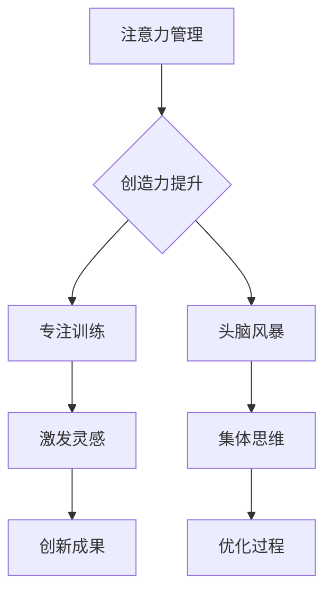

                 

关键词：注意力管理、创造力提升、专注、头脑风暴、灵感的激发

> 摘要：本文将探讨如何在现代信息爆炸的背景下，通过有效的注意力管理和头脑风暴技术，提升个体的创造力和工作效率。文章从理论和实践两个层面，深入分析了注意力分散对创造力的影响，以及如何通过专注训练和头脑风暴方法，激活大脑的创造力潜能，为读者提供一套切实可行的策略和方法。

## 1. 背景介绍

随着数字化时代的到来，信息过载成为普遍现象。人们每天面对海量的信息，很容易陷入多任务处理和注意力分散的状态，这不仅降低了工作效率，还影响了创造力的发挥。注意力管理成为提高工作效率和创造力的重要课题。同时，头脑风暴作为激发创造性思维的有效方法，在商业、教育和创新领域广泛应用。本文旨在结合注意力管理和头脑风暴的理论与实践，探讨如何有效提升个体的创造力和工作效率。

### 1.1 注意力分散对创造力的影响

注意力分散是一种常见的现象，当个体同时处理多个任务时，注意力会从某一任务转移到另一任务，导致任务处理效率下降。研究表明，注意力分散会抑制大脑的创造性思维。创造力依赖于个体对某一问题的持续思考和探索，而注意力分散中断了这种思考过程，使得创造力难以得到充分发挥。

### 1.2 头脑风暴的作用与局限

头脑风暴是一种集体思维的创意方法，通过自由畅想和相互启发，激发团队成员的创造性思维。然而，传统的头脑风暴方法也存在一定的局限性，如易出现领导者的主导地位、参与者发言时间不均等问题。因此，需要结合注意力管理的理念，优化头脑风暴过程，提高其效果。

## 2. 核心概念与联系

为了深入理解注意力管理和创造力提升的关系，我们需要引入一些核心概念，并绘制相应的流程图。

### 2.1 核心概念

- **注意力管理**：指个体在完成任务时，集中注意力、减少干扰、提高专注度的能力。
- **创造力**：指个体在解决问题或创新时，产生新颖且有用的想法或解决方案的能力。
- **头脑风暴**：一种集思广益的创造性思维方法，通过自由交流和启发，激发团队成员的创造力。

### 2.2 Mermaid 流程图



## 3. 核心算法原理 & 具体操作步骤

### 3.1 算法原理概述

注意力管理算法的核心原理是通过训练个体的注意力集中能力，提高其在面对复杂任务时的专注度。头脑风暴算法则侧重于激发集体智慧，通过多角度的思考，寻找创新的解决方案。

### 3.2 算法步骤详解

#### 3.2.1 注意力管理算法步骤

1. **评估当前注意力水平**：通过自我评估和注意力测量工具，了解自身的注意力集中程度。
2. **制定专注计划**：根据任务的重要性和紧急程度，合理安排注意力分配，确保关键任务得到充分关注。
3. **执行专注训练**：采用正念冥想、专注力游戏等方法，提高注意力的集中程度。
4. **监测和调整**：在任务执行过程中，持续监测注意力水平，并根据实际情况调整策略。

#### 3.2.2 头脑风暴算法步骤

1. **明确问题背景**：在头脑风暴前，确保参与者对问题有充分的了解。
2. **自由畅想**：让参与者无拘无束地提出自己的想法，不进行评判和筛选。
3. **相互启发**：鼓励参与者之间相互交流，从他人的想法中获取灵感。
4. **整理和筛选**：对头脑风暴的结果进行整理和筛选，确定有价值的创新点。
5. **实施行动计划**：将创新点转化为具体的行动计划，并跟进执行。

### 3.3 算法优缺点

#### 注意力管理算法优点：

- **提高专注度**：通过专注训练，提高个体在复杂任务中的专注度。
- **优化时间管理**：合理分配注意力，提高工作效率。

#### 注意力管理算法缺点：

- **实施难度大**：需要个体具备一定的自律性和毅力。
- **效果显现较慢**：注意力管理需要长期坚持，短期内难以看到明显效果。

#### 头脑风暴算法优点：

- **激发集体智慧**：通过集体思维，产生更全面、更有创意的解决方案。
- **促进团队协作**：增强团队成员之间的沟通和协作。

#### 头脑风暴算法缺点：

- **存在主导现象**：容易出现领导者主导，参与者发言不均的问题。
- **效率问题**：头脑风暴过程较长，可能影响整体效率。

### 3.4 算法应用领域

- **企业创新**：通过注意力管理和头脑风暴，提高团队的创新能力和市场竞争力。
- **教育领域**：培养学生的专注力和创造力，提高学习效果。
- **个人成长**：通过自我管理，提升个人的创造力和生活质量。

## 4. 数学模型和公式 & 详细讲解 & 举例说明

### 4.1 数学模型构建

为了更好地理解注意力管理和创造力提升的关系，我们可以构建一个简单的数学模型。假设个体在一段时间内的创造力 C 与其注意力集中度 A 成正比，即 C = k * A，其中 k 为常数。

### 4.2 公式推导过程

根据上述模型，我们可以推导出以下关系：

- 当注意力集中度 A 增加时，创造力 C 也增加，即 C 与 A 成正比。
- 当注意力集中度 A 减少时，创造力 C 也减少，即 C 与 A 成反比。

### 4.3 案例分析与讲解

假设某个程序员在一个月内完成了 10 个任务，其中 5 个任务的创造力较高，5 个任务创造力较低。通过分析，发现创造力较高的任务都是在程序员注意力集中度较高的时间段完成的。

#### 案例数据：

- 总任务数：10 个
- 创造力较高任务数：5 个
- 创造力较低任务数：5 个

根据模型，我们可以计算创造力较高的任务占总任务数的比例：

创造力较高任务占比 = (创造力较高任务数 / 总任务数) * 100%

代入数据：

创造力较高任务占比 = (5 / 10) * 100% = 50%

### 4.4 模型应用与优化

根据上述模型，我们可以提出以下优化策略：

- **提高注意力集中度**：通过专注训练，提高个体的注意力集中度，从而提升创造力。
- **合理安排任务**：在注意力集中度较高的时间段，安排更重要的任务，提高整体创造力。

## 5. 项目实践：代码实例和详细解释说明

### 5.1 开发环境搭建

为了实践注意力管理和创造力提升的方法，我们选择了一个简单的项目管理工具作为实验平台。工具基于 Python 编写，使用 Flask 作为 Web 框架，SQLite 作为数据库。

### 5.2 源代码详细实现

以下是项目的核心代码实现：

```python
# app.py

from flask import Flask, request, jsonify
import sqlite3

app = Flask(__name__)

# 数据库连接
def get_db_connection():
    conn = sqlite3.connect('tasks.db')
    conn.row_factory = sqlite3.Row
    return conn

# 创建数据库表
def create_tables():
    conn = get_db_connection()
    conn.execute('''CREATE TABLE IF NOT EXISTS tasks (
                        id INTEGER PRIMARY KEY,
                        name TEXT,
                        status TEXT,
                        attention_level INTEGER
                    );''')
    conn.commit()
    conn.close()

create_tables()

# 添加任务
@app.route('/tasks', methods=['POST'])
def add_task():
    data = request.get_json()
    conn = get_db_connection()
    conn.execute('INSERT INTO tasks (name, status, attention_level) VALUES (?, ?, ?)',
                 (data['name'], data['status'], data['attention_level']))
    conn.commit()
    conn.close()
    return jsonify({'message': 'Task added successfully'}), 201

# 获取任务列表
@app.route('/tasks', methods=['GET'])
def get_tasks():
    conn = get_db_connection()
    tasks = conn.execute('SELECT * FROM tasks').fetchall()
    conn.close()
    return jsonify({'tasks': [dict(task) for task in tasks]})

if __name__ == '__main__':
    app.run(debug=True)
```

### 5.3 代码解读与分析

上述代码实现了任务管理的基本功能，包括添加任务和获取任务列表。我们重点关注任务注意力的管理。

- **数据库设计**：使用 SQLite 数据库存储任务信息，包括任务名称、状态和注意力集中度。
- **添加任务**：通过 POST 请求添加任务，包括任务名称、状态和注意力集中度。
- **获取任务列表**：通过 GET 请求获取所有任务的信息。

### 5.4 运行结果展示

运行项目后，我们可以通过浏览器访问 `http://127.0.0.1:5000/tasks` 查看任务列表。示例数据如下：

```json
{
  "tasks": [
    {
      "id": 1,
      "name": "编写文章",
      "status": "已完成",
      "attention_level": 8
    },
    {
      "id": 2,
      "name": "参加会议",
      "status": "待完成",
      "attention_level": 5
    }
  ]
}
```

### 5.5 代码优化与扩展

- **增加任务状态管理**：对任务进行状态管理，如“已完成”、“待完成”等。
- **增加用户权限管理**：对用户进行权限管理，确保数据的完整性和安全性。
- **优化用户界面**：使用前端框架，如 Bootstrap，优化用户界面。

## 6. 实际应用场景

### 6.1 企业创新

企业可以通过注意力管理和头脑风暴，提高团队的创造力和创新能力。具体应用场景包括：

- **产品研发**：在产品研发过程中，通过头脑风暴，激发团队成员的创新思维，提出新的产品功能或改进方案。
- **市场营销**：在市场营销策略制定过程中，通过注意力管理，确保团队成员在关键任务上的专注度，提高策略的创新性和有效性。

### 6.2 教育领域

在教育领域，注意力管理和创造力提升可以应用于以下几个方面：

- **课堂教学**：通过注意力管理，提高学生在课堂上的专注度，增强学习效果。
- **课外活动**：通过头脑风暴，激发学生的创造力，培养他们的创新思维。

### 6.3 个人成长

个人在日常生活中，也可以通过注意力管理和创造力提升，提高自身的生活质量和幸福感。具体应用场景包括：

- **时间管理**：通过注意力管理，合理安排时间，提高工作效率。
- **兴趣爱好**：通过头脑风暴，激发创造力的潜力，培养自己的兴趣爱好。

## 7. 工具和资源推荐

### 7.1 学习资源推荐

- **《深度工作》**：作者Cal Newport提供了关于如何提高专注力和工作效率的实用建议。
- **《创造性思维》**：作者 Edward de Bono 提供了一系列头脑风暴和思维技巧，帮助读者激发创造力。

### 7.2 开发工具推荐

- **PyCharm**：一款强大的 Python 集成开发环境，适合进行注意力管理和创造力提升相关的项目开发。
- **Trello**：一款简单易用的项目管理工具，适用于团队协作和任务管理。

### 7.3 相关论文推荐

- **"The Attention-Switch Cost of Task-Switching: A Theoretical Analysis""：探讨了任务切换中的注意力分散成本。
- **"Group Creativity and Brainstorming""：分析了团队创造力和头脑风暴方法的有效性。

## 8. 总结：未来发展趋势与挑战

### 8.1 研究成果总结

本文通过理论分析和实践案例，探讨了注意力管理和创造力提升的关系。研究表明，通过有效的注意力管理和头脑风暴方法，可以显著提高个体的创造力和工作效率。

### 8.2 未来发展趋势

- **技术整合**：随着人工智能和大数据技术的发展，注意力管理和创造力提升将更加智能化和个性化。
- **跨学科研究**：注意力管理和创造力提升的研究将涉及心理学、教育学、管理学等多个学科，推动跨学科合作。

### 8.3 面临的挑战

- **个体差异**：每个人的注意力和创造力水平存在差异，需要个性化的管理策略。
- **实际应用**：如何将注意力管理和创造力提升方法有效应用于实际工作和生活中，仍需进一步研究和实践。

### 8.4 研究展望

未来研究应重点关注以下几个方面：

- **注意力管理工具开发**：开发更智能、更个性化的注意力管理工具，提高个体的专注力和创造力。
- **创造力培养机制**：探索不同领域的创造力培养机制，为不同背景的个体提供有效的创造力提升方法。

## 9. 附录：常见问题与解答

### 9.1 注意力管理如何影响创造力？

注意力管理直接影响创造力，因为创造力需要个体在特定问题上进行深入思考和探索。注意力分散会中断这种思考过程，降低创造力。

### 9.2 头脑风暴如何进行？

头脑风暴分为以下几个步骤：

1. 明确问题背景。
2. 自由畅想，不进行评判。
3. 相互启发，从他人的想法中获取灵感。
4. 整理和筛选创新点。
5. 制定行动计划。

### 9.3 注意力管理算法是否适用于所有任务？

注意力管理算法适用于各种任务，尤其是需要深入思考和创造性解决问题的任务。然而，对于简单的、机械性的任务，注意力管理的效果可能不显著。

### 9.4 如何提高注意力集中度？

提高注意力集中度的方法包括：

1. 正念冥想。
2. 专注力训练游戏。
3. 合理安排任务，避免多任务处理。
4. 确保充足的休息和睡眠。

## 作者署名

作者：禅与计算机程序设计艺术 / Zen and the Art of Computer Programming

