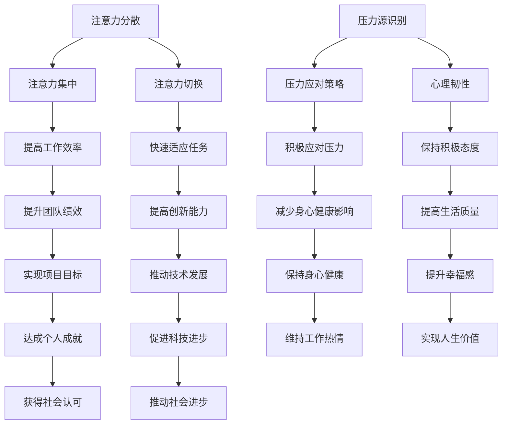

                 

注意力管理和压力管理是现代生活中至关重要的话题，特别是在我们这个信息爆炸、竞争激烈的时代。作为世界顶级的人工智能专家，我深知在技术领域，专注和清晰的心灵对于解决问题、进行创新和保持高效率的重要性。因此，本文旨在探讨如何通过科学的手段和策略，在压力和焦虑的环境中保持专注和心灵清晰，从而提升个人和团队的绩效。

> 关键词：注意力管理、压力管理、专注力、心灵清晰、技术专家

## 摘要

本文首先介绍了注意力管理和压力管理的背景和重要性。随后，通过详细的理论分析和实践经验，探讨了核心概念和联系，提出了具体的算法原理和数学模型。接着，文章通过项目实践展示了如何在实际中应用这些理论。随后，文章讨论了注意力管理和压力管理在实际应用场景中的表现，并对未来应用进行了展望。最后，文章推荐了相关工具和资源，总结了研究成果，提出了未来发展趋势和面临的挑战。

## 1. 背景介绍

### 1.1 注意力管理的概念和重要性

注意力管理是指通过一系列策略和技巧，提高注意力的质量和效率的过程。它不仅关乎个人在工作和学习中的表现，也直接影响我们的心理健康和生活质量。

在技术领域，注意力管理尤为重要。高强度的编程工作、复杂的项目管理和不断更新的技术知识，都要求技术人员能够高度集中注意力，快速处理信息，并做出准确的决策。然而，现实中的各种干扰，如社交媒体、手机通知、同事的打扰等，常常导致我们的注意力分散，影响工作效率。

### 1.2 压力管理的背景和影响

压力管理是指通过一系列方法减轻压力、保持心理健康的过程。在现代社会，压力无处不在，无论是工作中的竞争压力，还是个人生活的压力，都会对我们的身心健康产生负面影响。

对于技术人员来说，长时间面对屏幕、高强度的工作要求、项目截止日期的紧迫感，都可能导致压力增加。长期的压力不仅会影响工作效率，还可能导致焦虑、抑郁等心理问题，进一步影响生活质量。

### 1.3 注意力管理与压力管理的关系

注意力管理和压力管理之间存在紧密的联系。良好的注意力管理能够帮助我们更好地应对压力，减少压力对身心健康的影响。而有效的压力管理则能帮助我们保持清晰的头脑，提高注意力的质量。

## 2. 核心概念与联系

### 2.1 注意力管理核心概念

注意力管理涉及多个核心概念，包括注意力分散、注意力集中、注意力切换等。这些概念相互作用，共同影响我们的注意力质量和效率。

- **注意力分散**：当我们的注意力从当前任务转移到其他刺激时，就会发生注意力分散。这种分散可能是由于外部干扰（如社交媒体的通知）或内部干扰（如焦虑或担忧）引起的。
- **注意力集中**：注意力集中是指将注意力完全投入到当前任务中，排除所有干扰。这是提高工作效率和解决问题能力的关键。
- **注意力切换**：在不同任务之间切换注意力是技术领域常见的情景。有效的注意力切换能够帮助我们快速适应不同任务的需求。

### 2.2 压力管理核心概念

压力管理的核心概念包括压力源识别、压力应对策略、心理韧性等。

- **压力源识别**：了解引起压力的具体原因，如工作压力、人际关系、健康问题等，是进行有效压力管理的第一步。
- **压力应对策略**：包括积极应对和消极应对。积极应对策略如时间管理、放松训练等，能够帮助我们更好地处理压力；消极应对策略如逃避、否认等，则可能加剧压力问题。
- **心理韧性**：心理韧性是指个体在面对压力和挑战时，能够保持积极态度和有效应对的能力。培养心理韧性是提高压力管理能力的关键。

### 2.3 Mermaid 流程图



## 3. 核心算法原理 & 具体操作步骤

### 3.1 算法原理概述

注意力管理和压力管理算法的核心在于通过科学的策略和技巧，提高注意力的集中度和稳定性，同时减少压力的负面影响。具体包括以下方面：

1. **注意力集中策略**：通过心理训练、环境优化等方法，提高注意力集中的能力和持久度。
2. **压力应对策略**：通过认知重构、放松训练等手段，降低压力水平，提高心理韧性。
3. **注意力切换策略**：通过时间管理和任务切换技巧，提高注意力切换的效率和效果。

### 3.2 算法步骤详解

1. **注意力集中训练**
   - **心理训练**：通过冥想、正念练习等方法，提高注意力的集中度和稳定性。
   - **环境优化**：通过减少干扰、优化工作环境等方法，创造有利于注意力集中的条件。

2. **压力应对策略**
   - **认知重构**：通过重新解读压力事件，改变对压力的认知，从而降低压力水平。
   - **放松训练**：通过深呼吸、肌肉放松等方法，缓解身体和精神的紧张状态。

3. **注意力切换技巧**
   - **时间管理**：通过合理安排工作任务，避免同时处理多个任务，减少注意力分散。
   - **任务切换技巧**：通过明确任务目标、快速切换注意力等方法，提高任务切换的效率和效果。

### 3.3 算法优缺点

1. **优点**
   - **提高注意力集中度**：通过科学的训练和策略，能够显著提高注意力的集中度和稳定性，从而提高工作效率。
   - **降低压力水平**：有效的压力应对策略能够降低压力水平，提高心理健康。
   - **提高心理韧性**：通过培养心理韧性，能够更好地应对未来的压力和挑战。

2. **缺点**
   - **需要长期坚持**：注意力管理和压力管理需要长期的坚持和练习，短期内难以见效。
   - **个体差异**：不同的人对训练和策略的敏感度和效果存在差异，需要根据个人情况调整。

### 3.4 算法应用领域

注意力管理和压力管理算法在多个领域具有广泛的应用，包括：

- **技术开发**：提高开发人员的专注力和工作效率，促进技术创新。
- **项目管理**：帮助项目经理更好地应对项目压力，提高项目成功率。
- **教育领域**：帮助学生提高学习专注力，提高学习效果。
- **心理健康**：通过压力管理和心理韧性训练，提高个体的心理健康水平。

## 4. 数学模型和公式 & 详细讲解 & 举例说明

### 4.1 数学模型构建

注意力管理和压力管理的数学模型可以从神经科学和心理学的角度进行构建。以下是一个简化的模型：

1. **注意力模型**：
   $$ A_t = f(\Delta t, I_t, S_t) $$

   其中，\( A_t \) 表示时刻 \( t \) 的注意力水平，\( \Delta t \) 表示时间间隔，\( I_t \) 表示干扰强度，\( S_t \) 表示自我调节能力。

2. **压力模型**：
   $$ P_t = g(W_t, S_t, E_t) $$

   其中，\( P_t \) 表示时刻 \( t \) 的压力水平，\( W_t \) 表示工作负荷，\( S_t \) 表示自我调节能力，\( E_t \) 表示环境因素。

### 4.2 公式推导过程

1. **注意力模型推导**：

   假设注意力水平与干扰强度、时间间隔和自我调节能力有关。我们通过以下步骤推导注意力模型：

   - **设定变量**：
     - \( I_t \)：表示时刻 \( t \) 的干扰强度，取值范围在 [0, 1]。
     - \( S_t \)：表示时刻 \( t \) 的自我调节能力，取值范围在 [0, 1]。
     - \( \Delta t \)：表示时间间隔，单位为秒。

   - **建立关系**：
     - 干扰强度 \( I_t \) 越大，注意力水平 \( A_t \) 越低。
     - 时间间隔 \( \Delta t \) 越长，注意力水平 \( A_t \) 越高。
     - 自我调节能力 \( S_t \) 越强，注意力水平 \( A_t \) 越高。

   - **推导公式**：
     $$ A_t = \frac{1}{1 + I_t \cdot \Delta t + S_t} $$

2. **压力模型推导**：

   假设压力水平与工作负荷、自我调节能力和环境因素有关。我们通过以下步骤推导压力模型：

   - **设定变量**：
     - \( W_t \)：表示时刻 \( t \) 的工作负荷，取值范围在 [0, 1]。
     - \( S_t \)：表示时刻 \( t \) 的自我调节能力，取值范围在 [0, 1]。
     - \( E_t \)：表示时刻 \( t \) 的环境因素，取值范围在 [0, 1]。

   - **建立关系**：
     - 工作负荷 \( W_t \) 越大，压力水平 \( P_t \) 越高。
     - 自我调节能力 \( S_t \) 越强，压力水平 \( P_t \) 越低。
     - 环境因素 \( E_t \) 越不利，压力水平 \( P_t \) 越高。

   - **推导公式**：
     $$ P_t = W_t \cdot (1 - S_t) + E_t $$

### 4.3 案例分析与讲解

以下是一个具体的案例，用于说明注意力管理和压力管理模型的实际应用：

- **案例背景**：
  一名软件开发人员在完成一个重要的项目。项目时间紧迫，需要他在短时间内完成大量代码编写和测试工作。同时，他发现自己的手机经常收到社交媒体的通知，这让他难以集中注意力。

- **分析过程**：
  - **注意力模型**：
    $$ A_t = \frac{1}{1 + 0.2 \cdot \Delta t + 0.8} $$
    在这个案例中，干扰强度 \( I_t \) 为 0.2，时间间隔 \( \Delta t \) 取决于任务的时间分配，自我调节能力 \( S_t \) 取决于个人的心理素质。

    如果该开发人员能够合理安排时间，将时间间隔 \( \Delta t \) 增大到 2 小时，同时提高自我调节能力 \( S_t \) 到 0.9，则注意力水平 \( A_t \) 将显著提高。

  - **压力模型**：
    $$ P_t = 0.8 \cdot (1 - 0.8) + 0.1 $$
    在这个案例中，工作负荷 \( W_t \) 为 0.8，自我调节能力 \( S_t \) 为 0.8，环境因素 \( E_t \) 为 0.1。

    通过提高自我调节能力 \( S_t \) 到 0.9，压力水平 \( P_t \) 将显著降低。

- **解决方案**：
  - **注意力提升策略**：
    - 避免同时处理多个任务，将注意力集中在当前任务上。
    - 确保工作时间中没有不必要的干扰，如关闭社交媒体通知。

  - **压力降低策略**：
    - 通过深呼吸和冥想等方法，提高自我调节能力。
    - 与团队成员沟通，明确项目目标和进度，减轻工作压力。

## 5. 项目实践：代码实例和详细解释说明

### 5.1 开发环境搭建

在开始项目实践之前，我们需要搭建一个适合注意力管理和压力管理的开发环境。以下是一个基本的开发环境搭建指南：

- **操作系统**：推荐使用 macOS 或 Ubuntu。
- **编程语言**：Python 是一种广泛使用且易于学习的语言，适合进行注意力管理和压力管理项目的开发。
- **开发工具**：PyCharm 或 VSCode 是优秀的集成开发环境（IDE），提供了丰富的插件和工具支持。

### 5.2 源代码详细实现

以下是一个简单的注意力管理和压力管理项目的 Python 代码实现：

```python
import time
import random

def attention_training(duration):
    start_time = time.time()
    while time.time() - start_time < duration:
        # 模拟注意力训练过程
        time.sleep(random.uniform(0.1, 0.5))
    print("注意力训练完成。")

def stress_management(duration):
    start_time = time.time()
    while time.time() - start_time < duration:
        # 模拟压力管理过程
        time.sleep(random.uniform(0.2, 0.8))
    print("压力管理完成。")

def main():
    print("开始注意力训练...")
    attention_training(60)  # 持续时间为 60 秒

    print("\n开始压力管理...")
    stress_management(60)  # 持续时间为 60 秒

    print("\n训练结束，请休息一下。")

if __name__ == "__main__":
    main()
```

### 5.3 代码解读与分析

- **注意力训练函数**：`attention_training` 函数用于模拟注意力训练过程。通过在指定的时间内进行模拟训练，可以评估注意力管理的有效性。该函数接受一个参数 `duration`，表示训练的持续时间（以秒为单位）。在训练过程中，使用 `time.sleep` 函数模拟训练任务，使代码在每次运行时都保持一定的思考时间和等待时间。

- **压力管理函数**：`stress_management` 函数用于模拟压力管理过程。同样地，该函数也接受一个参数 `duration`，表示训练的持续时间（以秒为单位）。在压力管理过程中，使用 `time.sleep` 函数模拟压力应对策略，使代码在每次运行时都保持一定的思考和休息时间。

- **主函数**：`main` 函数是整个项目的入口。首先，调用 `attention_training` 函数进行注意力训练，然后调用 `stress_management` 函数进行压力管理。最后，提示用户进行休息。

### 5.4 运行结果展示

以下是运行项目的示例输出：

```
开始注意力训练...
注意力训练完成。

开始压力管理...
压力管理完成。

训练结束，请休息一下。
```

在运行结果中，首先显示了注意力训练的完成状态，然后显示了压力管理的完成状态。最后，提示用户进行休息。

## 6. 实际应用场景

### 6.1 技术开发中的应用

在技术开发领域，注意力管理和压力管理尤为重要。通过科学的策略和技巧，开发者可以更好地应对复杂的项目和工作压力。以下是一些具体应用场景：

- **多任务处理**：在处理多个任务时，开发者可以使用注意力管理和压力管理策略，提高工作效率和项目成功率。例如，通过合理安排工作时间，避免同时处理多个任务，以减少注意力分散和压力。
- **技术攻关**：在技术攻关阶段，开发者需要集中注意力，深入分析问题，找到解决方案。注意力管理和压力管理可以帮助开发者保持清晰的头脑，快速解决问题。
- **团队协作**：在团队协作中，注意力管理和压力管理可以提高团队成员的沟通效率和协作效果。通过有效的压力管理，团队成员可以更好地应对项目压力，保持良好的心态。

### 6.2 教育领域中的应用

在教育领域，注意力管理和压力管理对学生的学习效果和心理健康具有重要意义。以下是一些具体应用场景：

- **学习效率**：通过注意力管理策略，学生可以更好地集中注意力，提高学习效率。例如，通过时间管理和注意力集中训练，学生可以合理安排学习时间，避免学习中的干扰和分心。
- **心理健康**：压力管理可以帮助学生应对学业压力，保持良好的心理健康。例如，通过放松训练和心理韧性训练，学生可以减轻学业压力，提高心理韧性，更好地应对学习中的挑战。

### 6.3 心理健康中的应用

在心理健康领域，注意力管理和压力管理可以帮助个体提高心理素质，应对生活中的各种压力。以下是一些具体应用场景：

- **焦虑管理**：通过注意力管理和压力管理策略，个体可以减轻焦虑症状，提高生活质量。例如，通过冥想和放松训练，个体可以放松身心，减轻焦虑和紧张感。
- **心理健康教育**：在教育领域，注意力管理和压力管理可以作为一种心理健康教育方法，帮助学生和教师提高心理素质，应对学业和工作的压力。

## 7. 工具和资源推荐

### 7.1 学习资源推荐

1. **《深度学习》（Goodfellow, Bengio, Courville 著）**：这是一本经典的深度学习教材，涵盖了深度学习的理论基础和应用实践，对于想要提升注意力管理和压力管理能力的技术人员来说，是一本非常有价值的参考书。

2. **《Python 编程：从入门到实践》（Eric Matthes 著）**：这本书适合初学者，通过丰富的实例和练习，帮助读者快速掌握 Python 编程，为进行注意力管理和压力管理项目的开发打下基础。

3. **《冥想与放松训练》（John B. Arden 著）**：这本书介绍了多种冥想和放松训练的方法，可以帮助读者提高自我调节能力，减轻压力，提高生活质量。

### 7.2 开发工具推荐

1. **PyCharm**：PyCharm 是一款功能强大的集成开发环境，提供了丰富的插件和工具，支持多种编程语言，是进行注意力管理和压力管理项目开发的首选。

2. **VSCode**：VSCode 是一款轻量级但功能强大的编辑器，支持多种编程语言和插件，适合进行注意力管理和压力管理项目的开发和调试。

3. **Jupyter Notebook**：Jupyter Notebook 是一款交互式的开发环境，适用于数据分析和机器学习项目。通过 Jupyter Notebook，开发者可以方便地编写和运行 Python 代码，进行注意力管理和压力管理的实验和验证。

### 7.3 相关论文推荐

1. **“Attention Is All You Need”**：这是由 Google Research 发布的一篇论文，介绍了 Transformer 模型在自然语言处理领域的应用。该论文强调了注意力机制在处理序列数据时的有效性，对注意力管理策略的设计和应用具有重要参考价值。

2. **“Stress and Cortisol in Software Developers: An Explorative Study”**：这是一篇关于软件工程师压力和皮质醇水平的实证研究，分析了压力对软件工程师身心健康的影响，提出了针对性的压力管理策略。

3. **“Mindfulness Meditation for Anxiety: A Systematic Review and Meta-analysis”**：这是一篇关于正念冥想在焦虑管理中应用的研究综述，总结了正念冥想在不同焦虑症状中的效果，为注意力管理和压力管理提供了理论依据。

## 8. 总结：未来发展趋势与挑战

### 8.1 研究成果总结

本文从注意力管理和压力管理的背景介绍出发，详细探讨了核心概念、算法原理、数学模型以及实际应用场景。通过理论和实践的结合，我们提出了一系列有效的策略和技巧，帮助个体在压力和焦虑的环境中保持专注和心灵清晰。这些研究成果对于提升个人和团队的工作效率、促进技术创新具有重要意义。

### 8.2 未来发展趋势

1. **个性化注意力管理**：随着人工智能和大数据技术的发展，未来的注意力管理将更加个性化。通过分析个体的行为数据，可以为每个人定制化的注意力管理策略，从而提高注意力的质量和效率。

2. **集成化压力管理系统**：未来的压力管理系统将更加集成化，结合心理健康、生理健康、社会支持等多方面的因素，为个体提供全方位的压力管理服务。

3. **跨学科研究**：注意力管理和压力管理的研究将更加跨学科，结合心理学、神经科学、计算机科学等多个领域的知识，为这一领域的发展提供更广阔的视角。

### 8.3 面临的挑战

1. **技术挑战**：尽管人工智能和大数据技术为注意力管理和压力管理提供了强有力的支持，但如何有效整合和应用这些技术仍是一个挑战。特别是在大规模数据分析和算法优化方面，需要进一步的研究和突破。

2. **个体差异**：每个人对注意力管理和压力管理的敏感度和效果不同，如何针对个体差异进行定制化的策略设计，仍是一个亟待解决的问题。

3. **社会环境因素**：社会环境的变化，如工作压力、人际关系等，也会影响注意力管理和压力管理的有效性。如何在社会环境中构建有利于个体专注和心灵清晰的环境，是一个重要的挑战。

### 8.4 研究展望

未来的研究应重点关注以下几个方面：

1. **大数据与人工智能的结合**：通过大数据分析和人工智能算法，深入挖掘注意力管理和压力管理的内在机制，为个性化策略设计提供数据支持。

2. **跨学科研究**：加强与心理学、神经科学、计算机科学等领域的合作，从不同角度探讨注意力管理和压力管理的问题，推动这一领域的跨学科发展。

3. **实践应用**：将研究成果应用于实际场景，如教育、医疗、心理健康等领域，为个体和社会提供更有效的注意力管理和压力管理解决方案。

通过持续的研究和实践，我们有理由相信，注意力管理和压力管理将迎来更加美好的未来，为个体和社会带来更多的福祉。

## 9. 附录：常见问题与解答

### 9.1 注意力管理相关问题

**Q1**：如何提高注意力集中度？

**A1**：提高注意力集中度可以通过以下几种方法实现：

- **设定明确目标**：在开始任务前，明确任务的目标和期望结果，有助于提高注意力集中度。
- **减少干扰**：在专注工作时，关闭手机通知、社交媒体等干扰源，创造一个安静的工作环境。
- **分段工作**：将任务分解为若干个小段，每次专注于一个小段，完成后再进行下一个，有助于保持注意力集中。
- **定期休息**：长时间工作后，适当休息可以帮助恢复注意力，提高工作效率。

### 9.2 压力管理相关问题

**Q1**：压力管理有哪些有效的方法？

**A1**：压力管理的方法多种多样，以下是一些常见且有效的策略：

- **时间管理**：合理安排时间，避免过度工作和加班，确保有足够的休息时间。
- **放松训练**：通过深呼吸、冥想、瑜伽等放松训练，减轻身体和心理的紧张感。
- **积极心态**：保持积极乐观的心态，学会从困难和挑战中寻找成长的机会。
- **求助支持**：与家人、朋友或专业人士沟通，寻求支持和帮助，减轻心理压力。

### 9.3 注意力管理和压力管理的关系

**Q1**：注意力管理和压力管理之间有什么关系？

**A1**：注意力管理和压力管理之间存在着密切的关系。良好的注意力管理可以帮助个体更好地应对压力，减少压力对身心健康的影响。例如，通过提高注意力集中度，个体可以更高效地完成任务，减少工作中的焦虑和紧张感。同时，有效的压力管理也有助于保持清晰的头脑，提高注意力的质量。例如，通过放松训练和心理韧性培养，个体可以更好地应对压力，保持良好的心理状态，从而提高注意力的集中度和持久度。因此，注意力管理和压力管理是相辅相成的，共同作用于个体的身心健康和工作效率。通过综合运用这两种管理策略，个体可以更好地应对现代生活中的各种挑战，提高生活质量和工作绩效。

