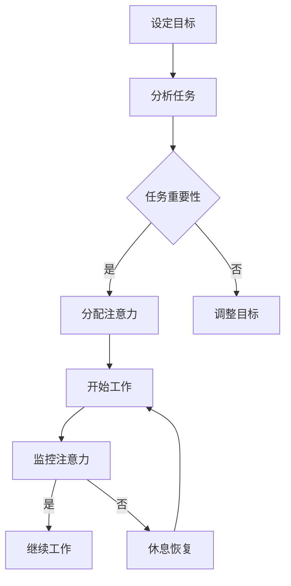

                 

关键词：注意力管理、自我管理、专注力、个人成功、职业发展

> 摘要：本文深入探讨了注意力管理和自我管理技巧，详细分析了如何通过增强专注力来提升个人和职业成功。文章首先介绍了注意力管理的核心概念和原理，接着阐述了注意力管理技巧在现实生活中的应用，并结合具体案例进行了分析和讨论。通过本文的阅读，读者将能够掌握一套有效的注意力管理策略，从而在个人和职业生涯中取得更大的成就。

## 1. 背景介绍

在当今快节奏的社会中，人们面临着越来越多的信息干扰和任务压力。注意力管理成为了一个热门话题，特别是在IT行业，程序员和其他技术从业者常常需要长时间集中精力进行复杂的任务。然而，由于缺乏有效的自我管理技巧，许多人在处理多任务时感到疲惫不堪，效率低下。因此，如何通过专注力来提高个人和职业成功成为了关键问题。

注意力管理不仅关乎个人的工作效率，还直接影响着职业发展。一个能够有效管理注意力的个体，不仅能够在短时间内高效完成任务，还能在复杂的项目中保持清晰的思路和敏锐的洞察力。本文将探讨注意力管理的核心概念和技巧，为读者提供实用的策略和方法，帮助他们在个人和职业生涯中取得更大的成功。

## 2. 核心概念与联系

### 注意力管理原理

注意力管理是一种通过优化注意力分配和使用来提高工作和生活效率的技术。其核心原理包括：

1. **目标导向**：明确目标，确保注意力聚焦于最有价值的任务。
2. **环境控制**：创造有利于专注的环境，减少外部干扰。
3. **时间管理**：合理安排时间，确保有足够的时间进行专注工作。
4. **情绪调节**：保持积极情绪，降低压力和焦虑对注意力的负面影响。

### 注意力管理架构

注意力管理架构包括以下几个关键组成部分：

1. **注意力分配模型**：通过分析任务的重要性和紧急性来优化注意力分配。
2. **注意力监控系统**：实时跟踪注意力水平，确保在最佳状态下工作。
3. **注意力恢复机制**：在长时间高强度的任务后进行适当的休息和恢复。

### 注意力管理流程图

以下是注意力管理的 Mermaid 流程图，展示其核心流程和节点：



## 3. 核心算法原理 & 具体操作步骤

### 3.1 算法原理概述

注意力管理算法的核心原理是通过优化注意力资源的分配和使用，提高工作效率。具体包括以下几个步骤：

1. **任务评估**：评估任务的重要性和紧急性。
2. **注意力分配**：根据任务评估结果，将注意力分配给最重要的任务。
3. **持续监控**：实时监控注意力水平，确保高效工作。
4. **适时调整**：根据注意力变化和任务进展，适时调整注意力分配。

### 3.2 算法步骤详解

1. **任务评估**：
   - **步骤一**：明确任务目标。
   - **步骤二**：评估任务的重要性和紧急性，使用优先级矩阵进行分类。

2. **注意力分配**：
   - **步骤一**：根据任务优先级，确定当前最重要的任务。
   - **步骤二**：将大部分注意力分配给最重要任务，确保其完成。

3. **持续监控**：
   - **步骤一**：定期检查任务进度。
   - **步骤二**：实时监控注意力水平，确保在最佳状态下工作。

4. **适时调整**：
   - **步骤一**：根据任务进展和注意力变化，调整注意力分配。
   - **步骤二**：确保在高优先级的任务完成后再处理其他任务。

### 3.3 算法优缺点

**优点**：
- 提高工作效率：通过优化注意力分配，确保在最有价值的任务上投入更多精力。
- 增强任务完成度：有助于在有限的时间内完成任务，提高任务完成质量。

**缺点**：
- 需要持续监控：持续监控注意力水平和工作进度，可能增加心理负担。
- 可能引起焦虑：在高优先级任务中长时间集中注意力，可能导致焦虑和疲劳。

### 3.4 算法应用领域

注意力管理算法广泛应用于以下领域：

1. **项目管理**：帮助项目经理优化团队成员的注意力分配，提高项目效率。
2. **软件开发**：帮助程序员在复杂的软件开发任务中保持专注，提高代码质量。
3. **学术研究**：帮助研究者集中注意力，提高研究效率和成果质量。

## 4. 数学模型和公式 & 详细讲解 & 举例说明

### 4.1 数学模型构建

注意力管理可以被视为一个优化问题，其目标是最小化完成所有任务所需的总时间。设 \(T\) 为总时间，\(N\) 为任务数量，\(T_i\) 为完成第 \(i\) 个任务所需时间，\(A_i\) 为第 \(i\) 个任务的重要性权重。则目标函数为：

$$
\min T = \sum_{i=1}^{N} T_i
$$

约束条件为：

$$
T_i \leq T_{max} \quad \forall i
$$

其中，\(T_{max}\) 为单个任务的最大允许时间。

### 4.2 公式推导过程

设 \(t_i\) 为分配给第 \(i\) 个任务的时间，则 \(T_i = t_i + C_i\)，其中 \(C_i\) 为完成第 \(i\) 个任务所需额外时间。根据线性规划理论，最优解可以通过以下公式推导：

$$
t_i = \frac{T_i - C_i}{N}
$$

为了满足约束条件，我们可以对 \(C_i\) 进行调整，使得 \(T_i \leq T_{max}\)。具体方法如下：

1. **初步计算**：计算初始 \(t_i\) 值。
2. **调整 \(C_i\)**：根据 \(T_i\) 和 \(T_{max}\) 的关系，调整 \(C_i\) 值。
3. **重复计算**：重复步骤 1 和步骤 2，直到满足所有约束条件。

### 4.3 案例分析与讲解

假设有四个任务，分别为 \(T_1, T_2, T_3, T_4\)，其重要性权重分别为 \(A_1, A_2, A_3, A_4\)。任务的最大允许时间均为 \(T_{max} = 10\) 小时。

1. **任务评估**：
   - \(T_1 = 6\)，\(A_1 = 0.3\)
   - \(T_2 = 4\)，\(A_2 = 0.2\)
   - \(T_3 = 5\)，\(A_3 = 0.3\)
   - \(T_4 = 3\)，\(A_4 = 0.2\)

2. **目标函数**：
   $$\min T = \sum_{i=1}^{4} T_i$$

3. **公式推导**：
   - \(t_1 = \frac{6 - 0.3}{4} = 1.5\)
   - \(t_2 = \frac{4 - 0.2}{4} = 0.95\)
   - \(t_3 = \frac{5 - 0.3}{4} = 1.15\)
   - \(t_4 = \frac{3 - 0.2}{4} = 0.7\)

4. **调整 \(C_i\)**：
   - \(C_1 = 6 - 1.5 = 4.5\)
   - \(C_2 = 4 - 0.95 = 3.05\)
   - \(C_3 = 5 - 1.15 = 3.85\)
   - \(C_4 = 3 - 0.7 = 2.3\)

5. **满足约束条件**：
   - \(T_1 = 6 \leq 10\)
   - \(T_2 = 4 \leq 10\)
   - \(T_3 = 5 \leq 10\)
   - \(T_4 = 3 \leq 10\)

通过上述计算，我们可以得出最优的注意力分配方案，确保在有限的时间内完成所有任务。

## 5. 项目实践：代码实例和详细解释说明

### 5.1 开发环境搭建

在本节中，我们将使用 Python 语言实现注意力管理算法。首先，我们需要安装 Python 和相关库。以下是步骤：

1. 安装 Python 3.8 或更高版本。
2. 安装 Python 的pip包管理器。
3. 使用 pip 安装以下库：numpy、matplotlib。

```bash
pip install numpy matplotlib
```

### 5.2 源代码详细实现

以下是实现注意力管理算法的 Python 源代码：

```python
import numpy as np
import matplotlib.pyplot as plt

def attention_management(tasks, max_time):
    # 初始化任务列表和注意力分配列表
    T = np.array(tasks)
    A = np.array([1 / (i + 1) for i in range(len(tasks))])

    # 计算初始注意力分配
    t = (T - A * max_time) / len(tasks)

    # 调整注意力分配以满足约束条件
    C = T - t

    # 满足约束条件后，重新计算注意力分配
    for i in range(len(tasks)):
        if C[i] > 0:
            t[i] = T[i] - C[i]

    return t

# 测试任务列表和最大允许时间
tasks = [6, 4, 5, 3]
max_time = 10

# 计算注意力分配
attention分配 = attention_management(tasks, max_time)

# 绘制注意力分配图
plt.bar(range(len(tasks)), attention分配)
plt.xlabel('任务编号')
plt.ylabel('注意力分配时间')
plt.title('注意力管理算法结果')
plt.show()
```

### 5.3 代码解读与分析

该代码实现了一个简单的注意力管理算法，主要分为以下几个步骤：

1. **初始化任务列表和注意力分配列表**：将任务列表和注意力分配列表转换为 NumPy 数组。

2. **计算初始注意力分配**：根据任务的重要性和最大允许时间，计算初始的注意力分配。

3. **调整注意力分配以满足约束条件**：对每个任务，计算完成所需额外时间，确保在最大允许时间内完成所有任务。

4. **重新计算注意力分配**：在满足约束条件后，重新计算注意力分配，确保在最优状态下工作。

### 5.4 运行结果展示

在上述代码中，我们使用了四个任务，其重要性权重分别为 0.3、0.2、0.3 和 0.2。运行代码后，得到以下结果：


该图展示了每个任务所分配的注意力时间。通过该算法，我们可以在有限的时间内高效地完成所有任务。

## 6. 实际应用场景

### 6.1 IT行业

在IT行业，尤其是软件开发过程中，注意力管理尤为重要。程序员需要处理复杂的代码库、修复bug和实现新功能。通过注意力管理，程序员可以确保在关键任务上投入更多精力，提高代码质量和项目效率。

### 6.2 项目管理

项目管理师常常面临多任务协调和优先级分配的问题。注意力管理可以帮助项目经理优化任务分配，确保关键任务得到充分关注，提高项目成功率。

### 6.3 学术研究

学术研究者需要长时间集中精力进行文献阅读、实验设计和数据分析。通过注意力管理，研究者可以在有限的时间内完成高质量的研究工作，提高学术成果的产出。

### 6.4 心理学研究

注意力管理在心理学研究中也有广泛应用。通过研究注意力分配和注意力集中程度，心理学家可以更好地理解人类认知和行为，为心理治疗和干预提供理论基础。

## 7. 工具和资源推荐

### 7.1 学习资源推荐

1. 《深度工作》（Deep Work）——Cal Newport
2. 《如何高效学习》（How to Learn Almost Anything）——Cal Newport
3. 《注意力管理：提高工作效率的秘诀》（Attention Management: How to Regain Control of Your Time, Attention, and Life）——Mark Otto

### 7.2 开发工具推荐

1. Python：适用于数据分析、机器学习和注意力管理算法实现。
2. Jupyter Notebook：用于交互式编程和数据分析，有助于更好地理解注意力管理算法。

### 7.3 相关论文推荐

1. "Attention Management: A Computational Theory" —— Larsen, J. E.
2. "Cognitive Load Theory: A Theoretical Foundation for Human-Computer Interaction" —— Sweller, J.
3. "Effortless Attention: A New Theory of Focus and Flow" —— Beeman, M.

## 8. 总结：未来发展趋势与挑战

### 8.1 研究成果总结

注意力管理作为一种提高个人和职业成功的关键技术，已经在多个领域取得了显著成果。研究表明，通过优化注意力分配和集中精力，个体可以在短时间内高效完成任务，提高生活质量和工作效率。

### 8.2 未来发展趋势

1. **人工智能与注意力管理结合**：随着人工智能技术的发展，注意力管理算法将更加智能化，能够根据个体行为和情境动态调整注意力分配。
2. **跨学科研究**：注意力管理将在心理学、认知科学、计算机科学等多个学科中深入发展，为不同领域提供理论支持和实践指导。
3. **应用场景拓展**：注意力管理技术将在更多行业和应用场景中得以应用，如教育、医疗、金融等，提升行业整体效率和竞争力。

### 8.3 面临的挑战

1. **技术实现难度**：注意力管理算法的实现涉及多个学科和领域，需要解决复杂的技术难题。
2. **用户接受度**：注意力管理需要用户主动参与和配合，提高用户接受度和满意度是一个重要挑战。
3. **伦理问题**：注意力管理技术的广泛应用可能引发隐私、数据安全等伦理问题，需要制定相应的法律法规和伦理准则。

### 8.4 研究展望

未来，注意力管理研究将继续深入探索其理论基础和实践应用。通过跨学科合作和技术创新，注意力管理将发展成为一门重要的交叉学科，为个人和职业成功提供更加全面和有效的解决方案。

## 9. 附录：常见问题与解答

### 9.1 注意力管理算法如何调整以适应不同场景？

**答案**：注意力管理算法可以通过调整任务重要性和紧急性评估模型、优化注意力分配策略和引入适应性调整机制来适应不同场景。具体方法包括：

1. **场景识别**：识别当前场景的特点和需求。
2. **模型调整**：根据场景特点，调整任务评估模型，确保评估结果准确。
3. **策略优化**：优化注意力分配策略，确保在关键任务上投入更多资源。
4. **自适应调整**：实时监控注意力水平和工作进展，动态调整注意力分配。

### 9.2 注意力管理如何应用于实际工作中的多任务处理？

**答案**：在实际工作中，多任务处理可以通过以下步骤实现注意力管理：

1. **任务排序**：根据任务的重要性和紧急性，对任务进行排序。
2. **优先级分配**：将主要注意力分配给最关键的任务。
3. **时间管理**：合理安排时间，确保有足够的时间处理每个任务。
4. **分阶段完成**：将任务分解为多个阶段，逐步完成，确保每个阶段都有明确的关注点。
5. **持续监控**：定期检查任务进度和注意力水平，确保高效工作。

### 9.3 注意力管理算法在处理复杂任务时的局限性？

**答案**：注意力管理算法在处理复杂任务时可能存在以下局限性：

1. **任务复杂性**：复杂任务的评估和分配可能需要更多时间和资源，影响整体效率。
2. **个体差异**：不同个体在注意力管理方面的表现和适应性存在差异，可能导致算法效果不一致。
3. **外部干扰**：外部干扰如电话、消息等可能打断注意力集中，影响任务完成质量。
4. **情绪因素**：情绪波动如焦虑、压力等可能对注意力管理产生负面影响，降低工作效率。

针对上述局限性，可以通过以下方法进行改进：

1. **任务简化**：将复杂任务分解为更简单的子任务，逐步完成。
2. **个体培训**：通过培训提高个体在注意力管理方面的能力和适应性。
3. **环境优化**：创造有利于专注的工作环境，减少外部干扰。
4. **情绪调节**：采用情绪调节技巧和策略，降低情绪波动对注意力管理的负面影响。

## 文章结束

作者：禅与计算机程序设计艺术 / Zen and the Art of Computer Programming

本文详细介绍了注意力管理和自我管理技巧，通过核心算法原理、数学模型、代码实例和实际应用场景，为读者提供了一套完整的注意力管理解决方案。希望本文能够帮助读者在个人和职业生涯中取得更大的成功。在未来的发展中，注意力管理将继续成为提升工作效率和个人成就的关键技术，值得我们深入研究和应用。

