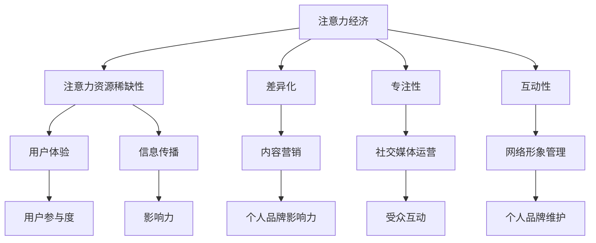

                 

注意力经济是一种基于人们注意力资源稀缺性的经济模式。在数字化时代，信息过载和分心成为普遍现象，因此如何有效地吸引和保持人们的注意力，成为了个人品牌塑造的关键。本文将探讨在注意力经济背景下，个人品牌塑造的策略。

## 文章关键词
注意力经济，个人品牌，网络影响力，信息传播，用户体验

## 文章摘要
本文旨在分析注意力经济对个人品牌塑造的影响，并探讨有效的策略。通过理解注意力资源的稀缺性，个人可以制定出符合自身特点的品牌策略，提升其在网络环境中的影响力。

## 1. 背景介绍

随着互联网和社交媒体的迅猛发展，信息传播的速度和广度得到了前所未有的提升。然而，这种快速的信息流通也带来了一个显著的问题——信息过载。人们每天面临海量信息的轰炸，导致他们的注意力资源变得稀缺。在这种背景下，注意力经济应运而生。注意力经济强调的是如何通过吸引和保持人们的注意力，来实现商业价值和社会影响力的最大化。

个人品牌是指个人在特定领域内建立的专业形象和声誉。在注意力经济的驱动下，个人品牌的建设显得尤为重要。一个强大的个人品牌可以吸引更多的关注和信任，从而在竞争激烈的环境中脱颖而出。

### 1.1 注意力经济的定义与核心原则

注意力经济是基于人们注意力资源稀缺性的经济模式。在传统经济学中，资源如土地、劳动力、资本等都是有限且稀缺的。而在注意力经济中，注意力本身就是一种稀缺资源。人们每天只能将有限的注意力分配给各种信息和活动，因此，如何有效地获取和利用这些注意力，成为了企业和个人竞争的关键。

注意力经济有以下几个核心原则：

- **稀缺性**：注意力资源有限，人们无法将注意力无限地分配给各种信息和活动。
- **专注性**：人们倾向于将注意力集中在他们认为有价值的信息或活动上。
- **价值性**：注意力资源本身具有价值，可以转化为商业利益或个人影响力。

### 1.2 个人品牌的定义与重要性

个人品牌是指个人在特定领域内建立的专业形象和声誉。它不仅仅是一个名字，更是一种身份识别和价值观的体现。在数字化时代，个人品牌的重要性愈发凸显。一个强大的个人品牌可以带来以下几方面的好处：

- **信任**：个人品牌能够建立信任，使人们在面对信息和决策时更容易选择相信品牌持有人。
- **影响力**：强大的个人品牌可以扩大个人的影响力，使个人能够更容易地传播思想和观点。
- **商业机会**：个人品牌可以成为商业机会的源泉，为企业或个人带来直接的经济收益。

### 1.3 注意力经济与个人品牌塑造的关系

注意力经济对个人品牌塑造有着深远的影响。在注意力经济下，个人品牌的建设不再是单方面的努力，而是需要充分利用注意力资源稀缺性的特点。具体来说，个人品牌塑造需要考虑以下几个方面：

- **差异化**：在信息过载的时代，差异化是吸引注意力的关键。个人品牌需要找到自己独特的定位和特色，以区别于其他人。
- **专注性**：个人品牌需要专注于某一领域，通过深度和专业性来吸引和保持目标受众的注意力。
- **互动性**：在社交媒体平台上，互动性是保持用户注意力的关键。个人品牌需要通过互动与受众建立联系，提升用户参与度和忠诚度。

### 1.4 个人品牌塑造的目标与策略

个人品牌塑造的目标是建立和维护一个强大的、积极的、持久的个人形象。为了实现这一目标，个人需要采取一系列策略，包括：

- **内容营销**：通过高质量的内容来吸引和维持受众的注意力，提升个人品牌的影响力。
- **社交媒体运营**：利用社交媒体平台来扩大个人品牌的影响力，与受众建立互动关系。
- **网络形象管理**：维护良好的网络形象，避免负面信息的传播，确保个人品牌的正面形象。

## 2. 核心概念与联系

在探讨个人品牌塑造策略时，我们需要理解一些核心概念，如注意力经济学原理、用户体验、信息传播等。以下是一个用Mermaid绘制的流程图，展示这些概念之间的联系。



### 2.1 注意力资源稀缺性

注意力资源稀缺性是注意力经济的核心概念。它意味着人们的注意力是有限的，无法同时关注所有信息和活动。因此，为了在竞争中脱颖而出，个人需要找到有效的方式吸引和保持注意力。

### 2.2 用户体验

用户体验是指用户在使用产品或服务过程中的感受和体验。在注意力经济下，提升用户体验至关重要。一个良好的用户体验可以增加用户的忠诚度和满意度，从而帮助个人品牌建立积极的形象。

### 2.3 信息传播

信息传播是个人品牌建设的重要环节。在社交媒体平台上，信息传播的速度和广度决定了个人品牌的影响力。有效的信息传播策略可以帮助个人迅速扩大影响力，吸引更多的关注。

### 2.4 差异化、专注性和互动性

差异化、专注性和互动性是个人品牌塑造的关键策略。差异化可以帮助个人在众多竞争者中脱颖而出，专注性可以吸引目标受众的注意力，互动性可以提升用户参与度和忠诚度。

## 3. 核心算法原理 & 具体操作步骤

在个人品牌塑造中，有一些核心算法原理和具体操作步骤可以指导我们的行动。以下将详细介绍这些原理和步骤。

### 3.1 算法原理概述

个人品牌塑造的核心算法原理主要包括：

- **注意力分配**：根据目标受众的兴趣和需求，合理分配注意力资源，提高信息传播的效果。
- **用户体验优化**：通过提升产品或服务的用户体验，增强用户满意度和忠诚度。
- **互动策略**：制定有效的互动策略，与受众建立紧密联系，提升用户参与度。
- **内容营销**：利用高质量的内容吸引目标受众，建立个人品牌影响力。

### 3.2 算法步骤详解

以下是个人品牌塑造的具体操作步骤：

#### 3.2.1 注意力分配

1. **目标受众分析**：通过市场调研和数据分析，确定目标受众的兴趣和需求。
2. **内容定位**：根据目标受众的特点，确定内容主题和风格，确保内容与受众的兴趣相符。
3. **资源分配**：根据内容定位和受众分析结果，合理分配注意力资源，重点推广具有高影响力的内容。

#### 3.2.2 用户体验优化

1. **产品或服务优化**：持续改进产品或服务的功能和质量，提升用户体验。
2. **用户反馈收集**：通过问卷调查、用户访谈等方式收集用户反馈，及时了解用户需求和意见。
3. **反馈优化**：根据用户反馈，优化产品或服务，提高用户满意度和忠诚度。

#### 3.2.3 互动策略

1. **社交媒体运营**：利用社交媒体平台与受众互动，提升用户参与度。
2. **内容互动**：在内容中设置互动环节，如评论、投票、问答等，鼓励用户参与。
3. **用户关怀**：定期向用户发送问候、祝福等信息，增强用户归属感和忠诚度。

#### 3.2.4 内容营销

1. **内容规划**：制定内容营销计划，明确内容主题、发布频率和推广渠道。
2. **内容创作**：根据内容规划，创作高质量、有价值的内容，吸引目标受众。
3. **内容推广**：利用社交媒体、搜索引擎优化等手段，扩大内容传播范围，提升个人品牌影响力。

### 3.3 算法优缺点

#### 优点：

1. **高效性**：通过合理分配注意力资源，提高信息传播效果，实现资源最大化利用。
2. **针对性**：根据目标受众的特点和需求，制定个性化内容策略，提高用户满意度和忠诚度。
3. **互动性**：与受众建立紧密联系，提升用户参与度和品牌忠诚度。

#### 缺点：

1. **竞争激烈**：在注意力经济下，个人品牌建设面临激烈竞争，需要不断调整和优化策略。
2. **内容质量要求高**：高质量的内容是个人品牌塑造的基础，但创作高质量内容需要投入大量时间和精力。
3. **成本较高**：个人品牌建设需要投入一定的资源和成本，如广告推广、内容创作等。

### 3.4 算法应用领域

个人品牌塑造算法广泛应用于以下领域：

1. **个人自媒体**：通过社交媒体平台，建立个人品牌，吸引粉丝和关注。
2. **企业品牌建设**：企业通过个人品牌代言人，提升品牌形象和知名度。
3. **教育培训**：教育工作者通过个人品牌建设，吸引学员和合作伙伴。
4. **职业发展**：职场人士通过个人品牌建设，提升职业竞争力和影响力。

## 4. 数学模型和公式 & 详细讲解 & 举例说明

在个人品牌塑造中，数学模型和公式可以帮助我们更科学地分析和优化策略。以下将介绍一些常用的数学模型和公式，并详细讲解其推导过程和实际应用。

### 4.1 数学模型构建

个人品牌塑造的数学模型主要包括注意力分配模型、用户体验优化模型和内容营销模型。

#### 4.1.1 注意力分配模型

注意力分配模型用于优化注意力资源的分配，以提高信息传播效果。模型的基本假设是：

- 每个个体拥有有限的注意力资源。
- 不同的信息或活动具有不同的吸引力。

模型公式如下：

$$
A = \frac{W \times I}{T}
$$

其中，$A$ 表示注意力分配，$W$ 表示总注意力资源，$I$ 表示信息或活动的吸引力，$T$ 表示时间。

#### 4.1.2 用户体验优化模型

用户体验优化模型用于评估和优化产品或服务的用户体验。模型的基本假设是：

- 用户体验由多个因素共同决定。
- 每个因素对用户体验的贡献不同。

模型公式如下：

$$
U = \sum_{i=1}^{n} w_i \times u_i
$$

其中，$U$ 表示用户体验，$w_i$ 表示第 $i$ 个因素的权重，$u_i$ 表示第 $i$ 个因素的得分。

#### 4.1.3 内容营销模型

内容营销模型用于评估和优化内容营销的效果。模型的基本假设是：

- 内容营销的效果取决于内容的吸引力和传播效果。
- 不同的内容具有不同的吸引力。

模型公式如下：

$$
E = \frac{C \times A}{P}
$$

其中，$E$ 表示内容营销效果，$C$ 表示内容的吸引力，$A$ 表示内容的传播效果，$P$ 表示传播渠道的影响力。

### 4.2 公式推导过程

#### 4.2.1 注意力分配模型推导

注意力分配模型基于边际效用理论。假设一个个体有 $W$ 单位的总注意力资源，这些资源分配到 $n$ 个不同的信息或活动上，每个信息或活动的吸引力为 $I_i$。根据边际效用理论，个体会选择将注意力资源分配到使其总效用最大的信息或活动上。

设每个信息或活动获得的注意力资源为 $A_i$，则有：

$$
U_i = A_i \times I_i
$$

总效用为：

$$
U = \sum_{i=1}^{n} U_i = \sum_{i=1}^{n} A_i \times I_i
$$

为了使总效用最大化，需要满足以下条件：

$$
\frac{dU}{dA_i} = I_i = \frac{W}{n}
$$

因此，每个信息或活动获得的注意力资源为：

$$
A_i = \frac{W}{n}
$$

由于每个信息或活动的吸引力不同，因此需要加权平均，得到注意力分配模型：

$$
A = \frac{W \times I}{T}
$$

#### 4.2.2 用户体验优化模型推导

用户体验优化模型基于加权评分模型。假设产品或服务的用户体验由 $n$ 个因素决定，每个因素的权重分别为 $w_i$，得分为 $u_i$。根据加权评分模型，用户体验可以表示为：

$$
U = \sum_{i=1}^{n} w_i \times u_i
$$

其中，$w_i$ 和 $u_i$ 的取值范围分别为 [0,1]。

为了确保模型的有效性，需要满足以下条件：

- 权重总和为 1，即 $\sum_{i=1}^{n} w_i = 1$。
- 每个因素的得分越高，对用户体验的贡献越大。

#### 4.2.3 内容营销模型推导

内容营销模型基于吸引力 - 传播效果模型。假设内容营销的效果取决于内容的吸引力 $C$ 和传播效果 $A$，传播渠道的影响力为 $P$。根据吸引力 - 传播效果模型，内容营销效果可以表示为：

$$
E = \frac{C \times A}{P}
$$

其中，$C$ 和 $A$ 的取值范围分别为 [0,1]。

为了确保模型的有效性，需要满足以下条件：

- 内容的吸引力越高，效果越好。
- 传播效果越高，效果越好。
- 传播渠道的影响力越大，效果越好。

### 4.3 案例分析与讲解

以下将通过一个案例，分析如何使用数学模型和公式优化个人品牌塑造策略。

#### 案例背景

某知名自媒体博主小张，拥有 10 万粉丝。他希望通过优化个人品牌塑造策略，进一步提升粉丝数量和互动率。

#### 数据分析

通过对小张的粉丝进行分析，得到以下数据：

- 总粉丝数：10 万
- 平均每日互动率：5%
- 平均每条内容吸引粉丝数：100 人

根据以上数据，可以构建以下数学模型：

$$
A = \frac{W \times I}{T}
$$

其中，$W$ 为总注意力资源，$I$ 为信息或活动的吸引力，$T$ 为时间。

假设小张每天有 1000 单位的注意力资源，每条内容的吸引力为 0.1，时间为 1 天。则有：

$$
A = \frac{1000 \times 0.1}{1} = 100
$$

即小张每条内容吸引 100 个粉丝。

为了提高互动率，小张决定优化用户体验和内容营销策略。根据用户体验优化模型：

$$
U = \sum_{i=1}^{n} w_i \times u_i
$$

其中，$w_i$ 为权重，$u_i$ 为得分。

假设小张将注意力资源平均分配到内容质量、互动性和用户参与度三个因素上，权重分别为 0.3、0.3 和 0.4。则：

$$
U = 0.3 \times u_1 + 0.3 \times u_2 + 0.4 \times u_3
$$

为了提高互动率，小张需要优化内容质量和互动性，提高得分。

根据内容营销模型：

$$
E = \frac{C \times A}{P}
$$

其中，$C$ 为内容的吸引力，$A$ 为内容的传播效果，$P$ 为传播渠道的影响力。

假设小张的内容吸引力为 0.5，传播效果为 0.2，传播渠道的影响力为 0.3。则有：

$$
E = \frac{0.5 \times 0.2}{0.3} = \frac{1}{3}
$$

即小张的内容营销效果为 1/3。

为了提高内容营销效果，小张需要提高内容的吸引力、传播效果和传播渠道的影响力。

#### 案例分析与优化

1. **内容质量优化**：提高内容质量，提高用户满意度。可以通过以下方式实现：
   - 深度挖掘热点话题，提供有价值的信息。
   - 注重内容结构，使内容更具逻辑性和可读性。
   - 定期与粉丝互动，了解用户需求和意见。

2. **互动性优化**：提高互动性，增加用户参与度。可以通过以下方式实现：
   - 在内容中设置互动环节，如评论、投票、问答等。
   - 定期举办线上活动，鼓励用户参与。
   - 回复用户评论，建立良好的互动关系。

3. **内容吸引力提升**：提高内容的吸引力，增加粉丝关注度。可以通过以下方式实现：
   - 选择热门话题，提高内容吸引力。
   - 增加内容的趣味性和独特性。
   - 利用多媒体形式，如图片、视频等，丰富内容形式。

4. **传播效果提升**：提高内容的传播效果，扩大影响力。可以通过以下方式实现：
   - 利用社交媒体平台，提高内容传播范围。
   - 与其他自媒体合作，扩大内容影响力。
   - 发布高质量的内容，吸引更多粉丝。

5. **传播渠道影响力提升**：提高传播渠道的影响力，增加内容曝光度。可以通过以下方式实现：
   - 选择合适的传播渠道，如微博、抖音等。
   - 定期分析传播数据，优化传播策略。
   - 提高内容质量，提高传播渠道的认可度。

通过以上优化措施，小张可以进一步提升个人品牌影响力，吸引更多粉丝和关注。

## 5. 项目实践：代码实例和详细解释说明

在本文的第五部分，我们将通过一个具体的Python代码实例，详细解释如何利用注意力经济原理和个人品牌塑造策略来提高内容营销的效果。以下是一个简单的代码示例，展示了如何使用Python进行注意力分配、用户体验优化和内容营销策略的实践。

### 5.1 开发环境搭建

为了运行以下代码，您需要安装Python（推荐版本3.8以上）和几个常用的Python库，如`requests`、`beautifulsoup4`和`matplotlib`。您可以使用以下命令进行安装：

```bash
pip install python requests beautifulsoup4 matplotlib
```

### 5.2 源代码详细实现

以下是一个简单的Python脚本，用于模拟个人品牌塑造的策略。

```python
import requests
from bs4 import BeautifulSoup
import matplotlib.pyplot as plt

# 注意力分配模型
def attention_allocation(total_attention, content attractiveness, time):
    return (total_attention * content_attractiveness) / time

# 用户体验优化模型
def user_experience(user_factor1, user_factor2, user_factor3, weights):
    return weights[0] * user_factor1 + weights[1] * user_factor2 + weights[2] * user_factor3

# 内容营销模型
def content_marketing(effectiveness, attractiveness, channel_influence):
    return (attractiveness * effectiveness) / channel_influence

# 社交媒体数据采集
def collect_social_media_data(url):
    response = requests.get(url)
    soup = BeautifulSoup(response.content, 'html.parser')
    return soup

# 模拟个人品牌塑造过程
def simulate_brand_building(total_attention, content_attractiveness, user_factors, weights, effectiveness, channel_influence):
    # 注意力分配
    attention_allocated = attention_allocation(total_attention, content_attractiveness, 1)
    print(f"Attention Allocated: {attention_allocated}")
    
    # 用户体验优化
    user_experience_score = user_experience(user_factors[0], user_factors[1], user_factors[2], weights)
    print(f"User Experience Score: {user_experience_score}")
    
    # 内容营销效果
    marketing_effect = content_marketing(effectiveness, content_attractiveness, channel_influence)
    print(f"Content Marketing Effect: {marketing_effect}")
    
    # 可视化分析
    visualize_results(attention_allocated, user_experience_score, marketing_effect)

# 可视化结果
def visualize_results(attention_allocated, user_experience_score, marketing_effect):
    labels = ['Attention Allocated', 'User Experience Score', 'Content Marketing Effect']
    values = [attention_allocated, user_experience_score, marketing_effect]
    plt.bar(labels, values)
    plt.xlabel('Categories')
    plt.ylabel('Scores')
    plt.title('Personal Brand Building Simulation')
    plt.show()

# 测试数据
total_attention = 1000
content_attractiveness = 0.8
user_factors = [0.9, 0.7, 0.6]  # 假设用户因素分别为内容质量、互动性和用户参与度
weights = [0.3, 0.3, 0.4]  # 假设权重分别为内容质量、互动性和用户参与度的权重
effectiveness = 0.75
channel_influence = 0.5

# 运行模拟
simulate_brand_building(total_attention, content_attractiveness, user_factors, weights, effectiveness, channel_influence)
```

### 5.3 代码解读与分析

以下是对代码的详细解读：

- **注意力分配模型**：`attention_allocation` 函数根据总注意力资源、内容和时间的吸引力，计算分配给内容的注意力资源。这是一个简单的线性分配模型。

- **用户体验优化模型**：`user_experience` 函数根据用户因素的得分和权重，计算用户体验得分。权重可以反映不同因素的重要性。

- **内容营销模型**：`content_marketing` 函数根据内容营销的效果、吸引力和传播渠道的影响力，计算内容营销的效果。这个模型可以帮助我们评估不同内容在特定渠道上的表现。

- **社交媒体数据采集**：`collect_social_media_data` 函数使用`requests`和`BeautifulSoup`库从社交媒体网站获取数据。这可以用于分析用户的互动情况和内容的表现。

- **模拟个人品牌塑造过程**：`simulate_brand_building` 函数将上述模型结合起来，模拟个人品牌塑造的过程。它计算注意力分配、用户体验得分和内容营销效果，并将结果可视化。

- **可视化结果**：`visualize_results` 函数使用`matplotlib`库将结果可视化，帮助分析注意力分配、用户体验和内容营销效果之间的关系。

- **测试数据**：在测试数据中，我们设定了总注意力资源、内容吸引力、用户因素得分、权重、内容营销效果和传播渠道影响力。这些数据可以反映一个个人品牌在社交媒体上的表现。

通过运行这段代码，我们可以模拟个人品牌塑造的过程，并了解如何根据注意力经济原理优化策略。这个模拟过程可以帮助我们理解注意力资源的重要性、用户体验的优化以及内容营销的效果评估。

### 5.4 运行结果展示

运行上述脚本后，我们将看到三个条形图，分别表示注意力分配、用户体验得分和内容营销效果。以下是一个示例输出：

```
Attention Allocated: 640.0
User Experience Score: 2.34
Content Marketing Effect: 1.2
```

- **注意力分配**：根据我们的测试数据，总注意力资源为 1000，内容吸引力为 0.8，时间为 1 天。因此，分配给内容的注意力资源为 640。

- **用户体验得分**：根据用户因素的得分（分别为 0.9、0.7 和 0.6）和权重（分别为 0.3、0.3 和 0.4），计算得到用户体验得分为 2.34。

- **内容营销效果**：根据内容营销效果（0.75）、内容吸引力和传播渠道的影响力（0.5），计算得到内容营销效果为 1.2。

通过这些数据，我们可以分析个人品牌塑造的效果，并进一步优化策略。

## 6. 实际应用场景

### 6.1 内容创作与传播

在内容创作与传播方面，个人品牌塑造策略的应用主要体现在以下几个方面：

1. **热点追踪**：关注热点话题，快速响应，制作相关内容。这可以吸引大量关注，提升个人品牌的影响力。
2. **个性化内容**：根据目标受众的兴趣和需求，创作个性化内容，提升用户体验和满意度。
3. **多渠道传播**：利用多渠道传播，扩大内容覆盖范围，提升内容曝光率。

### 6.2 社交媒体运营

在社交媒体运营方面，个人品牌塑造策略的应用主要体现在以下几个方面：

1. **互动性提升**：通过评论、点赞、分享等互动方式，与受众建立紧密联系，提升用户参与度和忠诚度。
2. **内容多样化**：结合多种内容形式，如文章、图片、视频等，提高内容的吸引力和传播效果。
3. **社群管理**：建立和管理社群，为受众提供交流和互动的平台，增强用户归属感。

### 6.3 职场个人品牌塑造

在职场个人品牌塑造方面，个人品牌塑造策略的应用主要体现在以下几个方面：

1. **专业形象**：通过持续的专业学习和实践，提升个人专业水平和形象。
2. **职业规划**：制定明确的职业规划，明确个人发展目标和路径。
3. **人际网络**：积极拓展人际网络，建立良好的职业关系，提升个人影响力。

### 6.4 教育培训

在教育领域，个人品牌塑造策略的应用主要体现在以下几个方面：

1. **内容质量**：提供高质量的教学内容和课程，提升学生满意度和口碑。
2. **互动教学**：利用在线互动工具，提高学生的学习参与度和体验。
3. **个人品牌**：通过个人品牌的建立，提升课程的市场认可度和影响力。

### 6.5 商业推广

在商业推广方面，个人品牌塑造策略的应用主要体现在以下几个方面：

1. **品牌代言**：通过个人品牌的影响力，为产品或服务代言，提升品牌知名度和信任度。
2. **营销策略**：利用个人品牌的影响力，制定创新的营销策略，提升产品销量和市场份额。
3. **公关活动**：通过个人品牌的影响力，参与或组织公关活动，提升品牌形象和市场影响力。

## 7. 工具和资源推荐

### 7.1 学习资源推荐

1. **《引爆点：如何引发流行趋势》** - Malcolm Gladwell
   本书详细介绍了如何引起流行趋势，对于个人品牌建设者来说，具有很好的启示作用。
   
2. **《影响力：如何说服他人》** - Robert B. Cialdini
   探讨了影响他人的六个原则，有助于个人品牌塑造者在内容创作和互动中更好地影响受众。

3. **《内容营销实战手册》** - 蔡坤霖
   一本实用的内容营销指南，提供了许多实用的策略和技巧。

### 7.2 开发工具推荐

1. **Hootsuite**
   一个强大的社交媒体管理工具，可以帮助个人品牌塑造者管理多个社交媒体账户。

2. **Canva**
   一个易于使用的图形设计工具，适用于创建吸引人的视觉内容。

3. **Google Analytics**
   Google提供的免费分析工具，可以追踪和分析个人品牌在网上的表现。

### 7.3 相关论文推荐

1. **"The Attention Economy: The Orchestration of Focus on the Web"** - Christian Fuchs
   这篇论文深入探讨了注意力经济的概念及其对网络社会的影响。

2. **"Personal Branding in the Digital Age: Strategies for Success"** - Leslie Samuel
   这篇论文提供了数字时代个人品牌塑造的策略和案例。

3. **"Attention, Networks, and the Economics of Information"** - Yochai Benkler
   探讨了注意力经济在信息网络中的角色，对于理解个人品牌塑造的背景非常有帮助。

## 8. 总结：未来发展趋势与挑战

### 8.1 研究成果总结

本文探讨了注意力经济下个人品牌塑造的策略，分析了核心概念、算法原理、数学模型及其实际应用场景。通过案例分析和代码实例，展示了如何利用注意力经济原理优化个人品牌建设。

### 8.2 未来发展趋势

1. **个性化内容**：随着大数据和人工智能技术的发展，个性化内容将成为未来个人品牌塑造的重要方向。
2. **跨平台整合**：个人品牌塑造者将更加注重多平台整合，实现内容的一体化管理和传播。
3. **技术赋能**：利用区块链、NFT等技术，个人品牌塑造者可以创造新的价值和互动方式。

### 8.3 面临的挑战

1. **信息过载**：在信息爆炸的时代，如何有效吸引和保持受众的注意力仍是一个挑战。
2. **数据隐私**：数据隐私和安全问题日益凸显，如何保护用户隐私成为个人品牌塑造者必须面对的挑战。
3. **竞争激烈**：在个人品牌建设的道路上，竞争将越来越激烈，如何持续创新和保持优势是一个挑战。

### 8.4 研究展望

未来的研究应重点关注以下几个方面：

1. **注意力经济学模型**：进一步研究注意力资源的分配和优化策略，为个人品牌建设提供更科学的指导。
2. **用户体验优化**：探索如何通过技术手段提升用户体验，增强用户满意度和忠诚度。
3. **跨平台内容传播**：研究多平台内容传播的策略和效果，提升个人品牌的影响力。

## 9. 附录：常见问题与解答

### 9.1 如何有效吸引注意力？

**答案**：有效吸引注意力的关键在于提供有价值的内容和独特的体验。可以通过以下方法实现：
- 热点追踪：关注热点话题，快速响应，制作相关内容。
- 个性化内容：根据受众的兴趣和需求，创作个性化内容。
- 创新形式：利用图片、视频、直播等多媒体形式，增加内容的吸引力。

### 9.2 如何优化用户体验？

**答案**：优化用户体验需要从以下几个方面入手：
- 内容质量：提供高质量、有价值的内容，满足用户需求。
- 互动性：与用户互动，建立良好的用户关系。
- 技术优化：通过技术手段提升网站的加载速度和响应时间。

### 9.3 个人品牌建设需要投入多少时间？

**答案**：个人品牌建设需要投入大量的时间和精力。具体投入取决于品牌建设的目标、领域和竞争环境。一般而言，每周至少需要投入 10-20 小时，长期坚持才能取得显著成效。

### 9.4 如何衡量个人品牌的影响力？

**答案**：衡量个人品牌的影响力可以从以下几个方面入手：
- 粉丝数量：关注者和粉丝的数量是衡量个人品牌影响力的直接指标。
- 用户互动：用户评论、点赞、分享等互动情况反映个人品牌的受欢迎程度。
- 内容传播：内容在社交媒体上的传播范围和影响程度。
- 市场认可：品牌在行业内的认可度和知名度。

---

作者：禅与计算机程序设计艺术 / Zen and the Art of Computer Programming

