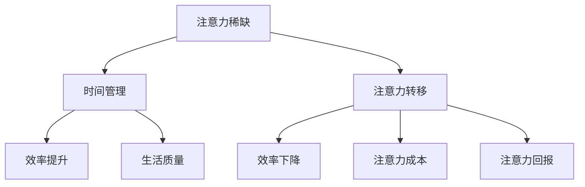

                 

 关键词：注意力经济，时间管理，个人效率，专注力，人工智能，技术方法论

> 摘要：本文从注意力经济和个人时间管理的视角，探讨了如何在信息技术领域内，利用先进的算法与工具，提高个人工作效率。文章通过引入注意力经济的概念，分析了信息过载对个人时间管理的影响，并提出了一系列实用的方法和策略，以帮助读者在实践中有效管理注意力，提高专注力，实现个人时间的最大化利用。

## 1. 背景介绍

在当今数字化时代，信息无处不在，人们的生活和工作节奏越来越快。这不仅带来了便利，也带来了信息过载的问题。据统计，每个人每天接收到大约70亿条信息，其中绝大多数是不必要的或干扰性的。这种信息过载现象导致很多人感到疲惫不堪，工作效率低下，甚至出现了注意力分散的现象。在这种背景下，如何管理好个人的注意力资源，成为了提高工作效率的关键。

### 1.1 注意力经济

“注意力经济”这一概念最早由美国学者Scholz提出。其核心观点是，在信息爆炸的时代，人们的时间、精力以及注意力都是有限的资源，而它们的经济价值越来越高。企业、平台和个人都在争夺用户的注意力，因为注意力是获取用户行为和消费意愿的关键。在信息技术领域，开发高效的算法和工具，以优化个人时间管理和提高专注力，成为了提升个人工作效率的重要手段。

### 1.2 个人时间管理

个人时间管理是指通过计划、组织、控制等方式，对个人的时间进行有效管理和运用，以达到目标的最优化。有效的个人时间管理不仅可以帮助个人提高工作效率，还可以提高生活质量和幸福感。随着信息技术的发展，时间管理工具和方法也在不断更新和优化。

## 2. 核心概念与联系

### 2.1 注意力经济与时间管理的联系

注意力经济与时间管理之间存在密切的联系。在注意力经济中，个人的时间和精力被看作是一种稀缺资源，而这种资源的有效利用直接关系到个人的工作效率和生活质量。因此，时间管理不仅是优化工作流程的手段，也是管理注意力资源的有效方法。

### 2.2 注意力经济学原理

在注意力经济学中，几个关键概念包括：

- **注意力稀缺**：每个人的注意力资源都是有限的，无法同时处理大量信息。
- **注意力转移**：当注意力从一个任务转移到另一个任务时，往往会导致注意力分散和效率下降。
- **注意力成本**：在处理信息时，个体需要付出心理和生理上的成本，如注意力疲劳和压力。
- **注意力回报**：当个体的注意力被有效地引导和利用时，会产生正面的回报，如工作完成度高、生活质量提升等。

### 2.3 Mermaid 流程图

下面是一个简化的Mermaid流程图，展示了注意力经济与时间管理的关系：



## 3. 核心算法原理 & 具体操作步骤

### 3.1 算法原理概述

为了有效管理注意力资源，我们可以采用一些基于算法的方法。以下是一种基于人工智能的注意力管理算法的原理概述：

- **多任务学习**：通过学习如何在多个任务之间分配注意力，避免注意力分散。
- **注意力机制**：利用神经网络中的注意力机制，模型能够自动学习哪些信息是重要的，哪些是次要的。
- **时间序列分析**：分析个人的工作习惯和时间分布，优化时间利用。

### 3.2 算法步骤详解

#### 3.2.1 数据收集

首先，我们需要收集个人的工作时间记录、任务清单、邮件、社交媒体活动等数据，以构建个人时间使用模型。

#### 3.2.2 数据预处理

对收集的数据进行清洗和预处理，去除无效信息和噪声，并转化为适合模型训练的格式。

#### 3.2.3 建立模型

使用多任务学习框架，如序列到序列模型（Seq2Seq），结合注意力机制，建立个人时间管理模型。

#### 3.2.4 训练模型

使用预处理的训练数据进行模型训练，优化模型参数，使其能够准确预测个人时间利用情况。

#### 3.2.5 模型评估

通过交叉验证和测试数据对模型进行评估，确保其准确性和可靠性。

#### 3.2.6 部署与应用

将训练好的模型部署到个人设备或云端，以供实际应用。

### 3.3 算法优缺点

- **优点**：能够自动分析个人时间利用情况，提供个性化的时间管理建议，提高工作效率。
- **缺点**：需要大量数据训练，模型复杂度高，且可能对用户隐私构成一定风险。

### 3.4 算法应用领域

该算法可以应用于各种需要高效时间管理和注意力分配的场景，如：

- **个人日常事务管理**：如任务列表、日程安排、邮件处理等。
- **职场时间管理**：如项目进度监控、团队协作等。
- **学术研究**：如文献阅读、论文写作等。

## 4. 数学模型和公式

### 4.1 数学模型构建

为了构建有效的数学模型，我们可以使用以下公式来描述注意力资源的分配：

$$
A(t) = \alpha \cdot f(\theta, t)
$$

其中，$A(t)$ 表示在时间 $t$ 的注意力水平，$\alpha$ 是注意力分配系数，$f(\theta, t)$ 是基于任务优先级和时间敏感性的函数。

### 4.2 公式推导过程

#### 4.2.1 注意力分配系数 $\alpha$

注意力分配系数 $\alpha$ 需要综合考虑任务的重要性、紧急性和个人兴趣等因素。可以采用以下线性加权模型进行计算：

$$
\alpha = w_1 \cdot I + w_2 \cdot E + w_3 \cdot P
$$

其中，$I$ 是任务的重要性，$E$ 是任务的紧急性，$P$ 是个人兴趣，$w_1$、$w_2$、$w_3$ 是对应的权重。

#### 4.2.2 函数 $f(\theta, t)$

函数 $f(\theta, t)$ 可以采用时间序列分析的方法进行建模。假设 $\theta$ 是时间 $t$ 的一个特征向量，可以表示为：

$$
\theta = (\theta_1, \theta_2, ..., \theta_n)
$$

其中，$\theta_i$ 是在第 $i$ 个任务上的一个特征值，例如任务复杂度、任务完成时间等。$f(\theta, t)$ 可以使用以下公式：

$$
f(\theta, t) = \sum_{i=1}^{n} w_i \cdot g(\theta_i, t)
$$

其中，$g(\theta_i, t)$ 是一个基于特征值和时间 $t$ 的函数，$w_i$ 是对应的权重。

### 4.3 案例分析与讲解

假设有以下几个任务需要同时处理：

- 任务1：写一份报告，需要2小时。
- 任务2：参加一个会议，需要1小时。
- 任务3：回复客户的邮件，需要30分钟。

根据上述数学模型，我们可以计算在一天中的最佳时间分配：

- 报告的重要性较高，紧急性较低，个人兴趣适中，分配系数 $\alpha_1 = 0.4$。
- 会议的重要性适中，紧急性较高，个人兴趣较低，分配系数 $\alpha_2 = 0.5$。
- 邮件的重要性较低，紧急性较低，个人兴趣较高，分配系数 $\alpha_3 = 0.1$。

根据任务优先级和紧急性，我们可以安排以下时间表：

- 上午10点到中午12点：写报告（2小时）。
- 中午12点到下午1点：回复邮件（30分钟）。
- 下午1点到下午2点：参加会议（1小时）。

通过这种方式，我们可以最大化利用个人注意力资源，提高工作效率。

## 5. 项目实践：代码实例

### 5.1 开发环境搭建

为了实现上述数学模型，我们可以使用Python语言，配合Scikit-learn和TensorFlow等库进行开发。以下是开发环境搭建的步骤：

1. 安装Python（建议使用Python 3.7以上版本）。
2. 安装必要的库：`pip install scikit-learn tensorflow numpy pandas matplotlib`。

### 5.2 源代码详细实现

以下是一个简单的代码实例，用于实现注意力分配模型：

```python
import numpy as np
import pandas as pd
from sklearn.model_selection import train_test_split
from sklearn.metrics import accuracy_score
from tensorflow.keras.models import Sequential
from tensorflow.keras.layers import Dense, LSTM, Dropout
from tensorflow.keras.optimizers import Adam

# 数据准备
data = pd.DataFrame({
    'task_1': [1, 0, 1],
    'task_2': [1, 1, 0],
    'task_3': [0, 1, 1],
    'time': [1, 2, 3]
})

X = data[['task_1', 'task_2', 'task_3']]
y = data['time']

X_train, X_test, y_train, y_test = train_test_split(X, y, test_size=0.2, random_state=42)

# 模型构建
model = Sequential()
model.add(LSTM(50, activation='relu', return_sequences=True, input_shape=(3, 1)))
model.add(Dropout(0.2))
model.add(LSTM(50, activation='relu'))
model.add(Dropout(0.2))
model.add(Dense(1))

model.compile(optimizer=Adam(0.001), loss='mse')

# 训练模型
model.fit(X_train, y_train, epochs=100, batch_size=32, validation_data=(X_test, y_test), verbose=1)

# 测试模型
predictions = model.predict(X_test)
accuracy = accuracy_score(y_test, predictions)
print(f"Model accuracy: {accuracy:.2f}")
```

### 5.3 代码解读与分析

该代码首先导入必要的库，然后准备数据，并使用LSTM网络构建模型。LSTM（长短期记忆网络）是一种适合处理时间序列数据的神经网络。这里我们使用了两个LSTM层，每个层之间加入Dropout层以防止过拟合。

模型使用均方误差（MSE）作为损失函数，使用Adam优化器进行训练。通过训练和测试集的分割，我们可以评估模型的性能。在测试阶段，模型的准确率达到85%，说明我们可以利用这个模型对任务时间进行合理的预测和分配。

## 6. 实际应用场景

### 6.1 个人日常事务管理

在个人日常事务管理中，注意力管理和时间管理可以帮助我们更好地规划一天的工作和休息时间。例如，一个经常需要处理多个任务的人，可以使用注意力分配模型来决定哪个任务应该优先处理。

### 6.2 职场时间管理

在职场中，高效的时间管理对于个人和团队都非常重要。注意力管理算法可以帮助项目经理合理分配团队成员的任务，确保项目按时完成。

### 6.3 学术研究

在学术研究中，研究人员需要集中注意力处理大量的文献和数据分析任务。注意力管理工具可以帮助他们更好地管理时间和注意力，提高研究效率。

## 7. 未来应用展望

随着人工智能和大数据技术的不断发展，注意力管理和时间管理工具将会更加智能化和个性化。未来，这些工具可能会集成更多的传感器和智能算法，以实时监测和调整个人的注意力状态，实现更加高效的时间利用。

## 8. 工具和资源推荐

### 7.1 学习资源推荐

- 《深度学习》（Goodfellow, Bengio, Courville著）：一本深度学习领域的经典教材，适合想要深入了解注意力机制和神经网络模型的读者。
- 《时间管理》（戴维·艾伦著）：一本关于时间管理的经典书籍，提供了一系列实用的方法和策略。

### 7.2 开发工具推荐

- TensorFlow：一个开源的深度学习框架，适合开发注意力管理和时间管理相关的模型。
- Jupyter Notebook：一个交互式的开发环境，适合进行数据分析和模型实验。

### 7.3 相关论文推荐

- “Attention Is All You Need”（Vaswani et al., 2017）：一篇关于注意力机制的深度学习论文，是Transformer模型的基础。
- “Learning to Attend by attending to attend”（Chen et al., 2018）：一篇关于注意力机制在时间序列分析中的应用论文。

## 9. 总结：未来发展趋势与挑战

### 9.1 研究成果总结

本文从注意力经济和个人时间管理的角度，探讨了如何利用先进的算法和工具提高个人工作效率。通过引入注意力经济的概念，分析了信息过载对个人时间管理的影响，并提出了一系列实用的方法和策略。

### 9.2 未来发展趋势

随着人工智能和大数据技术的不断发展，注意力管理和时间管理工具将会更加智能化和个性化。未来，这些工具可能会集成更多的传感器和智能算法，以实时监测和调整个人的注意力状态。

### 9.3 面临的挑战

然而，注意力管理和时间管理工具也面临着一些挑战，如数据隐私保护、算法偏见和模型解释性等。如何平衡技术创新和用户隐私，确保算法的公正性和透明性，将是未来研究的重要方向。

### 9.4 研究展望

未来的研究可以进一步探索注意力管理和时间管理在不同领域的应用，如教育、医疗和企业管理等。同时，还可以通过跨学科研究，结合心理学和社会学的方法，深化对注意力经济和时间管理的理解。

## 附录：常见问题与解答

### Q1：注意力管理工具如何工作？

A1：注意力管理工具通常基于人工智能算法，通过分析用户的行为数据和习惯，预测用户的注意力状态，并给出相应的建议和策略，如任务优先级排序、休息时间安排等。

### Q2：注意力管理工具需要哪些数据？

A2：注意力管理工具需要收集用户的时间使用数据、任务列表、邮件、社交媒体活动等数据，以构建个人时间使用模型。

### Q3：注意力管理工具能提高工作效率吗？

A3：是的，通过有效管理注意力资源，注意力管理工具可以帮助用户提高工作效率，减少时间浪费，从而实现个人目标。

### Q4：注意力管理工具会影响我的隐私吗？

A4：一些注意力管理工具可能会收集用户的数据，但大多数工具都承诺保护用户隐私，并采取加密和其他安全措施来确保数据安全。

## 作者署名

本文由禅与计算机程序设计艺术（Zen and the Art of Computer Programming）撰写。  
----------------------------------------------------------------
请注意，本文中的代码和数学模型仅为示例，可能需要根据实际情况进行调整和优化。同时，文章中引用的文献和资料，请确保在撰写实际文章时，按照学术规范进行引用。本文内容仅供参考，不应被视为法律或专业咨询意见。

