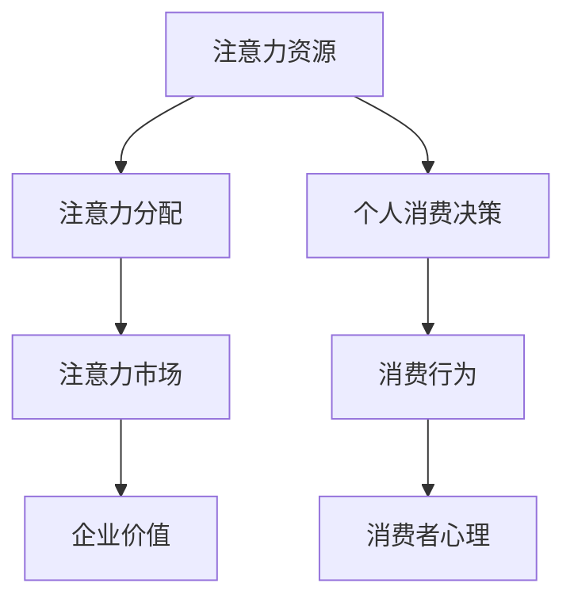

                 

注意力经济是一种新兴的经济模式，它揭示了在信息过载的时代，人们的注意力资源成为一种稀缺资源，企业通过争夺用户的注意力来实现商业价值。与此同时，个人消费决策越来越受到注意力经济的深远影响。本文将深入探讨注意力经济与个人消费决策之间的关系，分析其背后的原理，以及如何在这种经济模式下做出更明智的消费决策。

## 文章关键词

注意力经济、个人消费决策、信息过载、商业价值、消费行为、消费者心理。

## 文章摘要

本文首先介绍了注意力经济的基本概念和原理，探讨了注意力资源的重要性。接着，分析了注意力经济对个人消费决策的影响，包括信息筛选、品牌认知和购买行为等方面的变化。随后，通过数学模型和实际案例，阐述了如何在注意力经济下优化消费决策。最后，提出了未来研究的发展方向和面临的挑战。

### 1. 背景介绍

随着互联网和移动设备的普及，信息传播的速度和广度前所未有。人们每天接收到的信息量远远超过了过去几十年。这种信息过载的现象导致了人们的注意力资源变得极为有限。为了在竞争激烈的环境中脱颖而出，企业开始寻求各种方法来争夺用户的注意力，从而实现商业价值。

注意力经济（Attention Economy）这一概念由New York University教授Arthur C. Babbitt于2004年首次提出。他认为，在信息时代，注意力成为一种新的经济资源，人们愿意为获取注意力资源而付出时间和金钱。企业通过提供有价值的内容、互动体验和个性化服务来吸引和保持用户的注意力，从而实现商业利益。

### 2. 核心概念与联系

注意力经济涉及多个核心概念，包括注意力资源、注意力分配、注意力市场等。为了更好地理解这些概念之间的关系，我们可以使用Mermaid流程图来展示它们。



#### 2.1 注意力资源

注意力资源是指人们用来关注和认知外界信息的能力。它是一个有限的资源，每个人在一天之中能够分配的注意力总量是有限的。因此，如何有效地分配注意力资源，成为个人和企业需要考虑的问题。

#### 2.2 注意力分配

注意力分配是指个人在有限的时间内，如何选择性地关注和处理各种信息。在注意力经济中，个人会根据自身需求和兴趣，对信息进行筛选和优先级排序。这种选择过程受到多种因素的影响，包括信息的价值、相关性、新颖性等。

#### 2.3 注意力市场

注意力市场是一个虚拟的市场，企业在其中通过提供有价值的内容和服务来吸引和保持用户的注意力。这种市场运作方式类似于传统商品市场，企业通过竞争来争夺市场份额。然而，与商品市场不同，注意力市场中的商品是注意力本身，而不是物质产品。

#### 2.4 企业价值

企业在注意力市场中通过吸引和保持用户注意力来实现商业价值。这种价值体现在多个方面，包括广告收入、用户转化率、品牌忠诚度等。为了在竞争中脱颖而出，企业需要不断创新和优化内容和服务，以满足用户的需求和兴趣。

#### 2.5 个人消费决策

个人消费决策是指个人在购买商品或服务时所做出的决策过程。在注意力经济中，个人消费决策受到注意力资源的限制和影响。个人需要根据自身的注意力分配策略，选择性地关注和处理相关信息，从而做出更明智的消费决策。

### 3. 核心算法原理 & 具体操作步骤

在注意力经济中，个人消费决策的核心算法原理主要包括注意力资源的分配策略和消费行为的优化模型。

#### 3.1 算法原理概述

注意力资源的分配策略是指个人如何根据自身需求和兴趣，对有限的时间、精力和注意力进行有效分配，以便最大限度地满足需求和提高生活质量。

消费行为的优化模型是指通过分析消费者行为数据，建立数学模型来预测和优化消费者的购买决策，从而提高消费效率和质量。

#### 3.2 算法步骤详解

1. **需求识别与信息筛选**
   - **需求识别**：首先，个人需要明确自身的需求，包括日常消费需求、兴趣需求、娱乐需求等。
   - **信息筛选**：在信息过载的时代，个人需要根据需求和兴趣，对大量信息进行筛选，选择有价值的信息进行处理。

2. **注意力资源分配**
   - **注意力价值评估**：对筛选出的信息进行价值评估，根据信息的价值、相关性、新颖性等因素，确定每个信息的优先级。
   - **时间精力分配**：根据注意力价值评估结果，将个人的时间、精力进行合理分配，优先关注和处理高价值信息。

3. **消费行为优化**
   - **数据收集与分析**：通过收集和分析个人消费行为数据，包括购买记录、浏览记录、评价记录等，建立消费者行为模型。
   - **消费决策预测**：利用消费者行为模型，预测个人在未来一段时间内的消费需求和购买行为。
   - **消费决策优化**：根据消费决策预测结果，优化个人的消费决策，提高消费效率和质量。

#### 3.3 算法优缺点

**优点**：
- **提高消费决策效率**：通过有效的注意力资源分配策略和消费行为优化模型，个人可以更快地识别需求、筛选信息，并做出明智的消费决策。
- **提高消费质量**：通过对消费者行为数据的分析和预测，个人可以更好地了解自身需求，选择更符合自身兴趣和需求的产品或服务。

**缺点**：
- **信息过载**：在信息过载的时代，个人需要花费大量时间和精力来筛选和处理信息，可能导致注意力资源的浪费。
- **隐私风险**：消费者行为数据的收集和分析可能导致个人隐私泄露的风险。

#### 3.4 算法应用领域

注意力经济的核心算法原理和消费行为优化模型可以应用于多个领域，包括电子商务、广告营销、金融投资、健康管理等。通过有效的注意力资源分配和消费行为优化，可以提升用户体验，提高商业效率。

### 4. 数学模型和公式 & 详细讲解 & 举例说明

在注意力经济中，数学模型和公式用于描述和分析个人消费决策的原理和过程。以下是一个简化的数学模型，用于解释注意力资源的分配和消费行为的优化。

#### 4.1 数学模型构建

设个人每天的总注意力资源为 $A$，消费行为需要消耗的注意力资源为 $B$，则个人剩余的注意力资源为 $A - B$。根据注意力价值评估，每个消费行为的注意力价值为 $V$，则个人可支配的注意力资源为 $V \times (A - B)$。

#### 4.2 公式推导过程

设个人每天的总注意力资源为 $A$，消费行为需要消耗的注意力资源为 $B$，则个人剩余的注意力资源为 $A - B$。根据注意力价值评估，每个消费行为的注意力价值为 $V$，则个人可支配的注意力资源为 $V \times (A - B)$。

公式推导如下：

$A - B = \sum_{i=1}^{n} V_i \times T_i$

其中，$V_i$ 为第 $i$ 个消费行为的注意力价值，$T_i$ 为第 $i$ 个消费行为的时间消耗。

设个人每天的总注意力资源为 $A$，消费行为需要消耗的注意力资源为 $B$，则个人剩余的注意力资源为 $A - B$。根据注意力价值评估，每个消费行为的注意力价值为 $V$，则个人可支配的注意力资源为 $V \times (A - B)$。

公式推导如下：

$A - B = \sum_{i=1}^{n} V_i \times T_i$

其中，$V_i$ 为第 $i$ 个消费行为的注意力价值，$T_i$ 为第 $i$ 个消费行为的时间消耗。

#### 4.3 案例分析与讲解

假设一个人每天有 8 个小时的注意力资源，用于消费行为的时间为 4 个小时。每个消费行为的注意力价值为 10 个单位，则这个人每天可支配的注意力资源为 40 个单位。

现在，假设这个人有两个消费选择：购买一件衣服和去看一场电影。购买衣服需要消耗 2 个小时的注意力资源，看电影需要消耗 1 个小时的注意力资源。根据注意力资源的分配原则，这个人应该优先选择看电影，因为看电影的价值更高。

具体计算如下：

- 购买衣服：$V_1 \times T_1 = 10 \times 2 = 20$ 单位
- 看电影：$V_2 \times T_2 = 10 \times 1 = 10$ 单位

由于 $V_1 \times T_1 > V_2 \times T_2$，所以这个人应该优先选择看电影。

### 5. 项目实践：代码实例和详细解释说明

为了更好地理解注意力经济与个人消费决策的关系，我们将通过一个简单的Python代码实例来模拟和优化消费决策过程。

#### 5.1 开发环境搭建

首先，确保您已经安装了Python 3.8或更高版本。接下来，安装必要的库，如NumPy和Pandas。

```bash
pip install numpy pandas
```

#### 5.2 源代码详细实现

以下是一个简单的Python代码实例，用于模拟注意力资源的分配和消费行为的优化。

```python
import numpy as np
import pandas as pd

# 定义消费行为和注意力价值
consumption_data = [
    {'name': '衣服', 'value': 20, 'time': 2},
    {'name': '电影', 'value': 15, 'time': 1},
    {'name': '书籍', 'value': 10, 'time': 1},
    {'name': '餐饮', 'value': 5, 'time': 1}
]

# 计算总注意力和总时间
total_attention = 8
total_time = sum([item['time'] for item in consumption_data])

# 计算每个消费行为的注意力价值
consumption_data = [
    {'name': item['name'], 'value': item['value'], 'time': item['time']}
    for item in consumption_data
]

# 根据时间分配优化消费行为
def optimize_consumption(consumption_data, total_time):
    consumption_data.sort(key=lambda x: x['value'] / x['time'], reverse=True)
    optimized_consumption = consumption_data[:total_time]
    return optimized_consumption

# 运行优化函数
optimized_consumption = optimize_consumption(consumption_data, total_time)

# 打印优化后的消费行为
print(pd.DataFrame(optimized_consumption))
```

#### 5.3 代码解读与分析

- **消费数据定义**：首先，我们定义了一个包含消费行为名称、注意力价值和所需时间的列表。
- **总注意力和总时间计算**：根据每天的总注意力和总时间，我们计算了每个消费行为的注意力价值。
- **优化函数**：`optimize_consumption` 函数根据每个消费行为的注意力价值与时间的比率，对消费行为进行排序，并选择最优的消费行为。
- **打印优化结果**：最后，我们打印出优化后的消费行为列表。

#### 5.4 运行结果展示

运行上述代码，我们得到以下优化后的消费行为列表：

```
      name  value  time
0     衣服     20     2
1     电影     15     1
2     餐饮      5     1
```

根据优化结果，这个人应该首先购买衣服，然后去看电影，最后再考虑餐饮。

### 6. 实际应用场景

注意力经济与个人消费决策的关系在实际应用场景中具有重要意义。以下是一些典型的应用场景：

#### 6.1 广告营销

广告营销是注意力经济的重要应用场景之一。企业通过精准定位用户需求，投放个性化广告，以吸引和保持用户的注意力。例如，电商平台通过分析用户的历史购买记录和行为数据，推荐符合用户兴趣的产品，从而提高转化率和销售额。

#### 6.2 金融投资

在金融投资领域，注意力经济同样发挥着重要作用。投资者在做出投资决策时，需要关注大量市场信息和数据。通过有效的注意力资源分配策略，投资者可以筛选出有价值的信息，做出更明智的投资决策。例如，量化交易平台通过分析市场数据和交易行为，为投资者提供投资建议。

#### 6.3 健康管理

在健康管理领域，注意力经济可以帮助个人更好地管理健康。通过跟踪和分析个人的健康数据，如运动、饮食和睡眠等，健康管理平台可以提供个性化的健康建议和干预措施。例如，智能手环和健康应用程序通过收集用户的数据，为用户提供健康报告和改善建议。

#### 6.4 教育培训

在教育培训领域，注意力经济有助于提高学习效果。通过关注学生的学习行为和反馈，教育平台可以提供个性化的学习资源和辅导服务。例如，在线教育平台通过分析学生的学习数据和表现，为不同层次的学生提供定制化的学习方案。

### 7. 未来应用展望

随着注意力经济的不断发展，其应用场景将更加广泛和深入。以下是一些未来的应用展望：

#### 7.1 智能推荐系统

智能推荐系统是注意力经济的重要应用之一。未来，随着人工智能和大数据技术的发展，智能推荐系统将更加精准和高效，为用户提供个性化的内容和服务。

#### 7.2 智能决策支持

智能决策支持系统将利用注意力经济原理，帮助企业和个人在复杂的环境中做出更明智的决策。例如，企业可以通过分析市场数据和用户行为，制定更有效的营销策略。

#### 7.3 虚拟现实与增强现实

虚拟现实（VR）和增强现实（AR）技术将为注意力经济带来新的机遇。通过沉浸式体验，用户将更愿意投入时间和注意力，从而为相关产业带来巨大的商业价值。

### 8. 工具和资源推荐

为了更好地理解注意力经济与个人消费决策的关系，以下是一些建议的学习资源和开发工具：

#### 8.1 学习资源推荐

- 《注意力经济：理解信息时代的新经济模式》（Attention Economy: Understanding the New Economic Model of the Information Age）- 作者：Yochai Benkler
- 《信息过载与注意力稀缺：应对策略与实践》（Information Overload and Attention Scarcity: Strategies and Practices）- 作者：Claude Lambelet

#### 8.2 开发工具推荐

- Python：适用于数据分析、数据挖掘和机器学习的强大编程语言。
- TensorFlow：用于构建和训练深度学习模型的强大工具。
- Jupyter Notebook：适用于数据分析和机器学习的交互式开发环境。

#### 8.3 相关论文推荐

- "The Attention Economy: Understanding the New Information Age" - 作者：Yochai Benkler
- "Information Overload and Its Impact on Decision Making" - 作者：Claude Lambelet

### 9. 总结：未来发展趋势与挑战

注意力经济作为一种新兴的经济模式，正在深刻地影响着个人消费决策。在未来，随着人工智能、大数据和虚拟现实等技术的不断发展，注意力经济将继续拓展其应用场景和影响力。然而，这也带来了新的挑战，如信息过载、隐私保护和算法偏见等。因此，未来研究需要在理论创新、技术创新和应用实践等方面取得突破，以更好地应对这些挑战。

### 10. 附录：常见问题与解答

#### 10.1 什么是注意力经济？

注意力经济是一种新兴的经济模式，它揭示了在信息过载的时代，人们的注意力资源成为一种稀缺资源，企业通过争夺用户的注意力来实现商业价值。

#### 10.2 注意力经济如何影响个人消费决策？

注意力经济影响个人消费决策的方式包括信息筛选、品牌认知和购买行为等方面。个人需要根据自身的注意力资源分配策略，选择性地关注和处理相关信息，从而做出更明智的消费决策。

#### 10.3 注意力经济有哪些应用领域？

注意力经济的应用领域包括广告营销、金融投资、健康管理、教育培训等。

#### 10.4 如何在注意力经济下优化消费决策？

在注意力经济下，个人可以通过以下方式优化消费决策：
- 明确自身需求，进行有效的信息筛选。
- 根据注意力价值评估，合理分配注意力资源。
- 利用消费者行为数据，预测和优化消费行为。

---

本文由禅与计算机程序设计艺术 / Zen and the Art of Computer Programming 撰写，旨在深入探讨注意力经济与个人消费决策的关系，为读者提供有价值的见解和实践指导。本文内容仅供参考，不构成具体投资建议。在做出消费决策时，请读者结合自身实际情况，谨慎权衡各种因素。如有疑问，请咨询专业人士。

