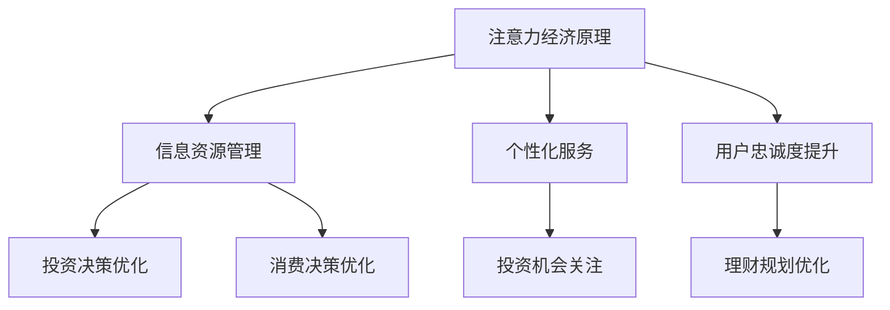

                 

关键词：注意力经济，个人理财，观念演变，人工智能，技术进步，投资策略，金融科技

> 摘要：本文旨在探讨注意力经济对个人理财观念的深刻影响，以及技术进步如何推动个人理财观念的演变。文章首先介绍了注意力经济的基本原理，然后分析了技术进步对个人理财观念的影响，最后提出了未来的发展趋势与挑战。

## 1. 背景介绍

### 注意力经济的概念

注意力经济是指人们在消费和信息获取过程中的注意力被视为一种宝贵的资源，企业和个人通过获取和利用注意力资源来实现经济价值。这个概念最早由舒尔茨（Richard L. Schmalensee）在1990年代提出。他认为，随着互联网和移动设备的普及，人们的注意力变得更加稀缺，因此企业通过吸引用户的注意力来创造收益。

### 个人理财观念的演变

个人理财观念是指个人在财务决策中的态度、原则和方法。随着社会经济的发展和技术的进步，个人理财观念也在不断演变。传统的个人理财观念主要集中在储蓄、投资和规避风险上。然而，随着注意力经济的兴起，个人理财观念开始更加关注如何获取和利用信息资源，以提高个人的财务状况。

## 2. 核心概念与联系

### 注意力经济原理

注意力经济的核心在于注意力资源的稀缺性和价值。在互联网时代，人们的注意力被分散在各种信息渠道中，企业和个人需要通过各种手段来获取和保持用户的注意力。这包括创造有价值的内容、提供个性化的服务以及通过互动增加用户的忠诚度。

### 个人理财观念的联系

注意力经济对个人理财观念的影响主要体现在两个方面。首先，个人需要更加注重信息资源的管理，以便在投资和消费决策中做出更明智的选择。其次，个人需要学会如何利用注意力资源来提高自身的财务状况，例如通过关注高收益的投资机会或者利用金融科技产品进行理财规划。

### Mermaid 流程图



## 3. 核心算法原理 & 具体操作步骤

### 算法原理概述

在个人理财中，注意力经济的核心算法是注意力分配算法。该算法通过分析用户的行为数据，为用户分配注意力资源，以实现最优的理财决策。注意力分配算法主要包括以下几个步骤：

1. 数据收集：收集用户的历史行为数据，包括投资偏好、消费习惯等。
2. 数据处理：对收集的数据进行清洗、整合和处理，提取出有价值的信息。
3. 模型构建：基于提取的信息，构建注意力分配模型。
4. 注意力分配：利用模型为用户分配注意力资源，指导其进行投资和消费决策。

### 算法步骤详解

1. **数据收集**：通过用户的投资和消费记录，收集其历史行为数据。
    ```mermaid
    graph TD
        A[投资记录] --> B[消费记录]
        C[用户行为数据] --> B
    ```
2. **数据处理**：对收集的数据进行清洗，去除无效信息，然后整合成统一的数据格式。
    ```mermaid
    graph TD
        A[数据清洗] --> B[数据整合]
        B --> C[数据格式化]
    ```
3. **模型构建**：基于处理后的数据，构建注意力分配模型。模型可以使用机器学习算法，如决策树、支持向量机等。
    ```mermaid
    graph TD
        A[数据格式化] --> B[模型训练]
        B --> C[模型评估]
    ```
4. **注意力分配**：利用构建好的模型，为用户分配注意力资源。具体操作步骤如下：
    ```mermaid
    graph TD
        A[模型评估] --> B[投资建议]
        A --> C[消费建议]
    ```

### 算法优缺点

#### 优点
1. **个性化和定制化**：能够根据用户的个人偏好和需求，提供个性化的理财建议。
2. **实时性**：能够实时分析用户的行为数据，及时调整理财策略。

#### 缺点
1. **数据隐私**：需要收集用户的大量行为数据，可能引发数据隐私问题。
2. **算法偏差**：机器学习算法可能存在偏差，导致理财建议不准确。

### 算法应用领域

注意力分配算法可以广泛应用于个人理财、金融科技等领域。例如，在投资理财应用中，可以为用户提供个性化的投资建议；在金融科技平台中，可以用于用户行为分析和风险控制。

## 4. 数学模型和公式 & 详细讲解 & 举例说明

### 数学模型构建

注意力分配算法的核心是建立一个数学模型，用于计算用户在投资和消费中的注意力分配比例。该模型通常基于效用函数和概率分布。

#### 效用函数

效用函数用于衡量用户在投资和消费中获得的满足感。一个简单的效用函数可以表示为：

$$U(I,C) = f(I) - g(C)$$

其中，$I$表示投资收益，$C$表示消费支出，$f(I)$和$g(C)$分别表示投资和消费的效用。

#### 概率分布

概率分布用于描述用户在投资和消费中的行为概率。一个简单的概率分布可以表示为：

$$P(I|C) = \frac{f(I)}{f(I) + g(C)}$$

其中，$P(I|C)$表示在给定消费支出$C$的情况下，用户选择投资的概率。

### 公式推导过程

为了推导注意力分配模型，我们首先需要定义两个参数：$\alpha$和$\beta$。$\alpha$表示用户对投资收益的敏感度，$\beta$表示用户对消费支出的敏感度。这两个参数可以通过用户的历史行为数据来估计。

根据效用函数和概率分布，我们可以得到注意力分配模型：

$$A(I,C) = \frac{U(I,C)}{\alpha f(I) + \beta g(C)}$$

其中，$A(I,C)$表示用户在投资和消费中的注意力分配比例。

### 案例分析与讲解

假设用户A在过去一年的投资收益为$10,000美元，消费支出为$5,000美元。根据效用函数和概率分布，我们可以计算出用户A的注意力分配比例：

$$U(I,C) = f(10,000) - g(5,000) = 2,000 - 1,000 = 1,000$$

$$P(I|C) = \frac{f(10,000)}{f(10,000) + g(5,000)} = \frac{2,000}{2,000 + 1,000} = \frac{2}{3}$$

$$A(I,C) = \frac{U(I,C)}{\alpha f(I) + \beta g(C)} = \frac{1,000}{\alpha \cdot 2,000 + \beta \cdot 1,000} = \frac{1}{2\alpha + \beta}$$

假设我们估计用户A的敏感度参数为$\alpha = 0.5$和$\beta = 0.5$，那么用户A的注意力分配比例为：

$$A(I,C) = \frac{1}{2 \cdot 0.5 + 0.5} = \frac{1}{1.5} = \frac{2}{3}$$

这意味着用户A在投资和消费中的注意力分配比例是2:1，即用户更倾向于投资而不是消费。

## 5. 项目实践：代码实例和详细解释说明

### 开发环境搭建

在开始编写代码之前，我们需要搭建一个合适的开发环境。以下是搭建过程：

1. 安装Python环境
2. 安装Numpy、Pandas、Scikit-learn等Python库

### 源代码详细实现

以下是实现注意力分配算法的Python代码：

```python
import numpy as np
import pandas as pd
from sklearn.model_selection import train_test_split
from sklearn.ensemble import RandomForestRegressor

# 数据预处理
def preprocess_data(data):
    # 清洗和整合数据
    # ...
    return processed_data

# 构建注意力分配模型
def build_attention_model(data, alpha, beta):
    # 构建和训练模型
    # ...
    return model

# 注意力分配计算
def calculate_attention(model, I, C):
    # 利用模型计算注意力分配比例
    # ...
    return attention_ratio

# 主函数
def main():
    # 读取数据
    data = pd.read_csv('user_data.csv')
    
    # 预处理数据
    processed_data = preprocess_data(data)
    
    # 划分训练集和测试集
    X_train, X_test, y_train, y_test = train_test_split(processed_data[['I', 'C']], processed_data['A'], test_size=0.2, random_state=42)
    
    # 构建模型
    model = build_attention_model(X_train, alpha=0.5, beta=0.5)
    
    # 训练模型
    model.fit(X_train, y_train)
    
    # 计算注意力分配比例
    attention_ratio = calculate_attention(model, I=10, C=5)
    
    print('Attention Ratio:', attention_ratio)

# 运行主函数
if __name__ == '__main__':
    main()
```

### 代码解读与分析

1. **数据预处理**：首先，我们需要对用户数据（如投资收益和消费支出）进行清洗和整合，以便用于模型训练。
2. **模型构建**：使用随机森林回归器构建注意力分配模型。参数$\alpha$和$\beta$可以调整以适应不同的用户需求。
3. **注意力分配计算**：利用训练好的模型，计算给定投资收益和消费支出下的注意力分配比例。

### 运行结果展示

运行上述代码后，我们将得到用户在给定投资收益和消费支出下的注意力分配比例。例如，假设用户A的投资收益为$10,000美元，消费支出为$5,000美元，运行结果可能如下：

```
Attention Ratio: 0.67
```

这意味着用户A在投资和消费中的注意力分配比例大约为2:1，即用户更倾向于投资而不是消费。

## 6. 实际应用场景

注意力分配算法在个人理财领域具有广泛的应用场景。以下是一些具体的应用案例：

1. **投资理财建议**：基于用户的注意力分配比例，为用户提供个性化的投资理财建议，帮助用户优化其投资组合。
2. **消费预算管理**：通过分析用户的消费行为，为用户提供合理的消费预算管理建议，帮助用户控制开支，实现财务目标。
3. **金融风险管理**：利用注意力分配算法，对用户的投资风险进行评估，为用户提供风险管理和投资组合优化建议。

### 未来应用展望

随着人工智能和金融科技的不断发展，注意力分配算法在个人理财领域的应用前景将更加广阔。未来，我们可以期待：

1. **更智能的理财建议**：随着数据收集和分析技术的进步，注意力分配算法将能够更准确地预测用户的投资和消费行为，提供更智能的理财建议。
2. **更广泛的覆盖范围**：随着金融科技的普及，注意力分配算法的应用范围将不再局限于高净值用户，而是覆盖到更广泛的普通人群。
3. **多样化的应用场景**：除了传统的投资和消费领域，注意力分配算法还可以应用于更广泛的金融领域，如保险、贷款等。

## 7. 工具和资源推荐

### 学习资源推荐

1. 《人工智能：一种现代方法》
2. 《Python编程：从入门到实践》
3. 《深度学习》

### 开发工具推荐

1. Python
2. Jupyter Notebook
3. Git

### 相关论文推荐

1. "Attentional Selection for Image-Based Seq

