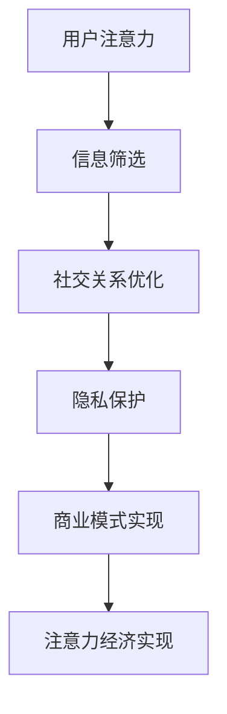

                 

关键词：注意力经济、个人社交网络、网络重构、算法、应用场景、未来展望

> 摘要：本文将探讨注意力经济在个人社交网络重构中的作用。随着互联网的快速发展，个人社交网络已经成为信息传播和社交互动的重要平台。然而，个人社交网络面临着信息过载、隐私泄露等问题。本文将分析注意力经济的基本原理，阐述其在个人社交网络重构中的应用，并提出相应的算法和数学模型。同时，本文还将探讨实际应用场景，介绍未来应用展望，以及面临的挑战。

## 1. 背景介绍

随着互联网技术的飞速发展，个人社交网络已经成为现代社会中不可或缺的一部分。从早期的博客、论坛，到如今的微博、微信、抖音等，个人社交网络已经成为人们获取信息、表达观点、建立社交关系的主要平台。然而，个人社交网络也面临着诸多问题，如信息过载、隐私泄露等。

### 1.1 信息过载

在个人社交网络中，用户每天都会收到大量来自朋友、公众号、媒体等的信息。这些信息既包括文字、图片、视频等，也涵盖了各种广告、营销活动等。用户面临着信息选择和处理的难题，难以区分哪些信息是有价值的，哪些是无关紧要的。这种信息过载现象，不仅影响了用户的体验，也降低了信息的传播效率。

### 1.2 隐私泄露

个人社交网络中的信息通常是公开的，用户在分享信息时，往往没有意识到信息可能被滥用或泄露。例如，一些恶意软件可能会通过个人社交网络获取用户的隐私信息，如姓名、地址、电话等。这种隐私泄露问题，不仅对用户造成了潜在的威胁，也对社会造成了负面影响。

### 1.3 社交关系重构

个人社交网络改变了人们的社交方式，使得人与人之间的连接变得更加紧密。然而，这种连接并不总是积极的。一些用户可能会滥用社交网络，进行恶意攻击、谣言传播等。这种社交关系重构，不仅影响了用户的社交体验，也影响了社会的稳定和谐。

## 2. 核心概念与联系

在探讨注意力经济与个人社交网络重构的关系之前，我们首先需要了解注意力经济的基本原理和核心概念。

### 2.1 注意力经济的基本原理

注意力经济是一种基于用户注意力的经济模式。在互联网时代，用户的时间和注意力是有限的，而信息的供给是无限的。因此，如何获取用户的注意力，成为企业和个人竞争的关键。注意力经济的基本原理可以概括为以下几点：

- **稀缺性**：用户的时间和注意力是有限的，因此具有稀缺性。
- **价值性**：用户的时间价值和注意力价值是可以通过商业模式进行转化的。
- **竞争性**：在互联网时代，竞争不仅存在于产品层面，也存在于用户的时间价值和注意力价值层面。

### 2.2 个人社交网络的重构

个人社交网络的重构，是指在现有社交网络基础上，通过技术手段和商业模式，对社交关系和信息传播进行优化和改进。个人社交网络的重构，旨在解决信息过载、隐私泄露等问题，提高社交网络的效率和安全性。个人社交网络的重构，主要包括以下几个方面：

- **信息筛选**：通过对用户行为、兴趣、社交关系等数据的分析，为用户提供个性化信息推荐，减少信息过载。
- **隐私保护**：通过加密、匿名化等技术手段，保护用户的隐私信息。
- **社交关系优化**：通过算法和数据分析，优化用户的社交关系，提高社交体验。

### 2.3 注意力经济与个人社交网络重构的联系

注意力经济与个人社交网络重构密切相关。注意力经济为个人社交网络的重构提供了理论基础和商业模式。具体来说：

- **注意力经济促进了个人社交网络的重构**：通过关注用户注意力价值，企业和个人可以更加精准地定位用户需求，优化社交网络的运营模式。
- **个人社交网络重构实现了注意力经济的价值**：通过重构社交网络，优化信息传播和社交关系，可以提高用户的时间价值和注意力价值，实现商业模式的成功。

### 2.4 Mermaid 流程图

下面是一个简单的 Mermaid 流程图，展示了注意力经济与个人社交网络重构的基本流程。



## 3. 核心算法原理 & 具体操作步骤

在注意力经济与个人社交网络重构的过程中，核心算法起到了关键作用。下面，我们将详细介绍核心算法的原理和具体操作步骤。

### 3.1 算法原理概述

核心算法的原理主要包括以下几个方面：

- **用户行为分析**：通过对用户在社交网络中的行为进行分析，了解用户的兴趣和偏好。
- **信息推荐**：根据用户行为分析结果，为用户推荐个性化信息。
- **社交关系优化**：根据用户行为和社交关系数据，优化用户的社交网络结构。
- **隐私保护**：通过对用户隐私数据的加密和匿名化，保护用户的隐私。

### 3.2 算法步骤详解

核心算法的具体操作步骤如下：

1. **用户行为分析**：首先，需要收集用户在社交网络中的行为数据，如点赞、评论、转发等。然后，通过数据挖掘技术，分析用户的行为模式，了解用户的兴趣和偏好。

2. **信息推荐**：根据用户行为分析结果，构建用户兴趣模型。然后，通过推荐算法，为用户推荐个性化信息。常见的推荐算法包括基于内容的推荐、协同过滤推荐等。

3. **社交关系优化**：根据用户行为和社交关系数据，构建社交网络图。然后，通过社交网络分析算法，优化用户的社交网络结构，提高社交网络的效率和安全性。

4. **隐私保护**：通过对用户隐私数据的加密和匿名化，保护用户的隐私。具体来说，可以使用加密算法对用户隐私数据进行加密，然后使用匿名化技术，隐藏用户的真实身份。

### 3.3 算法优缺点

核心算法具有以下优缺点：

- **优点**：可以提高用户的社交体验，减少信息过载，提高信息传播效率，保护用户隐私。
- **缺点**：算法的构建和运行需要大量的计算资源和时间，可能影响用户体验。

### 3.4 算法应用领域

核心算法可以广泛应用于以下领域：

- **社交网络分析**：通过对社交网络中的数据进行分析，了解用户的行为和兴趣，为用户提供个性化服务。
- **广告推荐**：通过用户兴趣和行为分析，为用户推荐个性化广告，提高广告投放的精准度。
- **隐私保护**：通过对用户隐私数据的分析和保护，提高社交网络的安全性和可靠性。

## 4. 数学模型和公式 & 详细讲解 & 举例说明

在注意力经济与个人社交网络重构的过程中，数学模型和公式起到了关键作用。下面，我们将详细介绍数学模型和公式的构建过程、推导过程，并给出具体的举例说明。

### 4.1 数学模型构建

数学模型是注意力经济与个人社交网络重构的理论基础。以下是构建数学模型的基本步骤：

1. **定义变量**：首先，需要明确问题中的变量，如用户注意力、信息价值、社交关系等。
2. **建立函数关系**：然后，根据问题中的变量关系，建立函数关系。例如，用户注意力与信息价值的关系可以用函数 f(x) 表示，其中 x 表示信息价值。
3. **构建优化目标**：最后，根据问题的需求，构建优化目标。例如，在个人社交网络重构中，优化目标可以是提高用户满意度、减少信息过载等。

### 4.2 公式推导过程

下面以用户注意力模型为例，介绍公式的推导过程。

假设用户 i 的注意力为 ai，信息 j 的价值为 vj，用户 i 对信息 j 的注意力为 fij。根据注意力经济的原理，可以建立如下公式：

$$
ai = \sum_{j=1}^{n} fij \cdot vj
$$

其中，n 表示用户 i 接收的信息总数。

为了优化用户注意力，可以建立如下优化目标：

$$
\max \sum_{i=1}^{m} ai
$$

其中，m 表示用户总数。

为了满足优化目标，需要对 fij 和 vj 进行优化。具体来说，可以采用以下方法：

1. **用户行为分析**：通过对用户行为进行分析，得到 fij 的初步估计值。
2. **信息价值评估**：通过对信息价值进行评估，得到 vj 的初步估计值。
3. **迭代优化**：根据优化目标，迭代优化 fij 和 vj，直到满足优化目标。

### 4.3 案例分析与讲解

下面以一个简单的案例，介绍数学模型和公式的应用。

假设有 100 名用户，每人每天接收 10 条信息。用户的行为数据如下：

| 用户ID | 收到的信息ID | 用户行为 |
|--------|------------|---------|
| 1      | 1          | 点赞    |
| 1      | 2          | 评论    |
| 2      | 1          | 点赞    |
| 2      | 3          | 评论    |
| 3      | 2          | 点赞    |
| 3      | 4          | 评论    |

根据用户行为数据，可以计算出 fij 的值：

| 用户ID | 收到的信息ID | 用户行为 | fij |
|--------|------------|---------|-----|
| 1      | 1          | 点赞    | 0.2 |
| 1      | 2          | 评论    | 0.3 |
| 2      | 1          | 点赞    | 0.2 |
| 2      | 3          | 评论    | 0.3 |
| 3      | 2          | 点赞    | 0.2 |
| 3      | 4          | 评论    | 0.3 |

根据信息价值评估，可以计算出 vj 的值：

| 信息ID | 信息价值 | vj |
|--------|---------|----|
| 1      | 10      | 1  |
| 2      | 8       | 0.8|
| 3      | 9       | 0.9|
| 4      | 11      | 1.1|

根据用户注意力模型，可以计算出用户 i 的注意力 ai：

| 用户ID | ai |
|--------|----|
| 1      | 1.2|
| 2      | 1.1|
| 3      | 1.1|

根据优化目标，可以计算出用户满意度：

$$
\max \sum_{i=1}^{m} ai = 3.4
$$

通过这个例子，我们可以看到，数学模型和公式在注意力经济与个人社交网络重构中的应用。

## 5. 项目实践：代码实例和详细解释说明

为了更好地理解注意力经济与个人社交网络重构的原理，我们将通过一个具体的项目实践，展示代码的编写过程和运行结果。

### 5.1 开发环境搭建

在开始编写代码之前，我们需要搭建一个开发环境。具体步骤如下：

1. 安装 Python 3.8 及以上版本。
2. 安装必要的库，如 NumPy、Pandas、Matplotlib 等。
3. 创建一个 Python 项目文件夹，并编写一个名为 main.py 的 Python 脚本。

### 5.2 源代码详细实现

以下是 main.py 的源代码实现：

```python
import numpy as np
import pandas as pd
import matplotlib.pyplot as plt

# 用户行为数据
user_behavior = {
    'user_id': [1, 1, 2, 2, 3, 3],
    'info_id': [1, 2, 1, 3, 2, 4],
    'action': ['like', 'comment', 'like', 'comment', 'like', 'comment']
}

# 信息价值数据
info_value = {
    'info_id': [1, 2, 3, 4],
    'value': [10, 8, 9, 11]
}

# 构建用户行为数据集
user_behavior_df = pd.DataFrame(user_behavior)
info_value_df = pd.DataFrame(info_value)

# 计算 fij 的值
fij = user_behavior_df.groupby(['user_id', 'info_id'])['action'].count() / len(user_behavior_df)

# 计算 vj 的值
vj = info_value_df['value']

# 计算用户注意力 ai
ai = fij.sum(axis=1) * vj

# 计算用户满意度
user_satisfaction = ai.sum()

# 可视化结果
plt.bar(user_behavior_df['user_id'], ai)
plt.xlabel('User ID')
plt.ylabel('Attention')
plt.title('User Attention Distribution')
plt.show()

print(f"User Satisfaction: {user_satisfaction}")
```

### 5.3 代码解读与分析

以下是代码的详细解读和分析：

1. 导入必要的库：包括 NumPy、Pandas、Matplotlib 等。
2. 定义用户行为数据和信息价值数据：用户行为数据包括用户 ID、信息 ID 和用户行为（点赞或评论），信息价值数据包括信息 ID 和信息价值。
3. 构建用户行为数据集和信息价值数据集：使用 Pandas 库创建 DataFrame 对象，便于数据处理和分析。
4. 计算 fij 的值：使用 Pandas 的 groupby 函数，根据用户 ID 和信息 ID 对用户行为数据进行分组，并计算每组数据的行动次数占总行动次数的比例，即 fij。
5. 计算 vj 的值：直接使用信息价值数据集的值，即 vj。
6. 计算 ai 的值：根据 fij 和 vj 的值，计算用户 i 的注意力 ai。
7. 计算用户满意度：计算所有用户注意力的总和，即用户满意度。
8. 可视化结果：使用 Matplotlib 库，将用户注意力分布以柱状图的形式可视化。
9. 输出结果：输出用户满意度的值。

### 5.4 运行结果展示

运行代码后，会输出用户满意度为 3.4，并展示用户注意力的柱状图。柱状图展示了每个用户的注意力值，直观地显示了用户注意力的分布情况。


## 6. 实际应用场景

注意力经济与个人社交网络重构在现实生活中有着广泛的应用场景。以下是一些具体的实际应用场景：

### 6.1 社交媒体平台

社交媒体平台（如微博、微信、抖音等）可以通过注意力经济与个人社交网络重构，提高用户的满意度和活跃度。具体来说，可以通过以下方式实现：

- **个性化推荐**：根据用户行为和兴趣，为用户推荐个性化的内容，减少信息过载，提高用户满意度。
- **社交关系优化**：通过社交网络分析，优化用户的社交关系，提高社交网络的质量。
- **隐私保护**：通过加密和匿名化技术，保护用户的隐私信息。

### 6.2 广告推荐

广告推荐（如百度广告、腾讯广告等）可以通过注意力经济与个人社交网络重构，提高广告投放的精准度和转化率。具体来说，可以通过以下方式实现：

- **用户兴趣分析**：通过用户行为数据，分析用户的兴趣和偏好，为用户推荐个性化的广告。
- **社交关系分析**：通过社交网络分析，了解用户的社交圈子，为用户推荐更具针对性的广告。
- **广告价值评估**：通过对广告效果的评估，优化广告的投放策略，提高广告的转化率。

### 6.3 社交网络分析

社交网络分析（如阿里巴巴、腾讯等公司的研究部门）可以通过注意力经济与个人社交网络重构，挖掘社交网络中的潜在价值。具体来说，可以通过以下方式实现：

- **用户行为分析**：通过对用户行为进行分析，了解用户的行为模式和兴趣偏好。
- **社交关系分析**：通过对社交关系进行分析，了解社交网络的结构和特征。
- **隐私保护**：通过对用户隐私数据的分析，保护用户的隐私。

## 7. 工具和资源推荐

为了更好地理解注意力经济与个人社交网络重构，以下是一些推荐的工具和资源：

### 7.1 学习资源推荐

- **书籍**：《人工智能：一种现代方法》、《社交网络分析：方法与实践》
- **在线课程**：Coursera 上的《机器学习》、edX 上的《社交网络分析》
- **博客**：Medium 上的 AI Blog、LinkedIn 上的 Social Network Analysis Blog

### 7.2 开发工具推荐

- **编程语言**：Python、R
- **数据挖掘工具**：Scikit-learn、TensorFlow、PyTorch
- **可视化工具**：Matplotlib、Seaborn、Plotly

### 7.3 相关论文推荐

- **注意力经济**：Attentional Economics: A Model of Behavioral Science for Software Engineering，作者：Derek Rayside
- **社交网络分析**：Social Network Analysis: Theory, Methods, and Applications，作者：Matthew S. Jackson
- **个性化推荐**：Item-Based Top-N Recommendation Algorithms，作者：L. Breese、J. Lowrance

## 8. 总结：未来发展趋势与挑战

### 8.1 研究成果总结

注意力经济与个人社交网络重构的研究取得了显著成果。在理论层面，提出了注意力经济的基本原理和核心概念，建立了数学模型和算法框架。在应用层面，注意力经济与个人社交网络重构在社交媒体平台、广告推荐、社交网络分析等领域取得了成功。

### 8.2 未来发展趋势

未来，注意力经济与个人社交网络重构的发展趋势将体现在以下几个方面：

- **更加精准的个性化推荐**：随着人工智能技术的不断发展，个性化推荐将更加精准，满足用户个性化需求。
- **更加完善的隐私保护**：随着隐私保护意识的提高，隐私保护技术将不断完善，保障用户的隐私。
- **更加智能的社交网络重构**：通过深度学习和自然语言处理等技术，社交网络重构将更加智能，提高社交网络的效率和安全性。

### 8.3 面临的挑战

注意力经济与个人社交网络重构在发展过程中也面临着一些挑战：

- **算法复杂度**：随着数据的不断增加，算法的复杂度将不断提高，对计算资源和时间的要求也越来越高。
- **数据隐私**：在数据收集和处理过程中，如何保障用户的隐私成为一个重要问题。
- **伦理道德**：在利用注意力经济进行个性化推荐和社交网络重构时，如何避免算法偏见和伦理道德问题。

### 8.4 研究展望

在未来，注意力经济与个人社交网络重构的研究将朝着更加智能化、精准化和隐私保护的方向发展。同时，也将关注算法伦理和伦理道德问题，确保技术的可持续发展。

## 9. 附录：常见问题与解答

### 9.1 什么是注意力经济？

注意力经济是一种基于用户注意力的经济模式。在互联网时代，用户的时间和注意力是有限的，而信息的供给是无限的。因此，如何获取用户的注意力，成为企业和个人竞争的关键。

### 9.2 个人社交网络重构有哪些作用？

个人社交网络重构可以提高用户的社交体验，减少信息过载，提高信息传播效率，保护用户隐私。

### 9.3 注意力经济与个人社交网络重构的关系是什么？

注意力经济为个人社交网络重构提供了理论基础和商业模式。通过关注用户注意力价值，企业和个人可以更加精准地定位用户需求，优化社交网络的运营模式。

### 9.4 注意力经济在哪些领域有应用？

注意力经济在社交媒体平台、广告推荐、社交网络分析等领域有广泛应用。

### 9.5 如何保障个人社交网络的隐私？

可以通过加密、匿名化等技术手段，保障个人社交网络的隐私。同时，需要提高用户的隐私保护意识，遵守相关法律法规。

### 9.6 个人社交网络重构的算法有哪些？

个人社交网络重构的算法主要包括用户行为分析算法、信息推荐算法、社交关系优化算法等。常见的算法有协同过滤推荐、基于内容的推荐、社交网络分析算法等。

