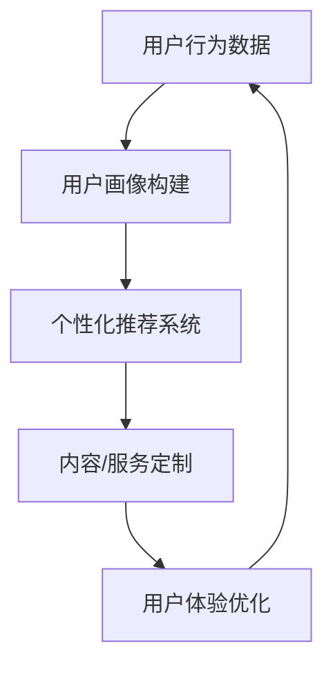

                 

关键词：注意力经济、个性化体验、定制化、产品服务、内容创作、用户体验

> 摘要：本文深入探讨了注意力经济与个性化体验创建的关联性，提出了如何在产品、服务和内容创作中为受众定制化，以提升用户体验和商业价值的策略和方法。通过理论阐述、算法原理、数学模型及项目实践等多维度分析，为业界提供了实用的指导框架。

## 1. 背景介绍

随着互联网和数字技术的飞速发展，信息过载现象日益严重。人们被海量的信息所包围，注意力资源变得稀缺。在这种背景下，注意力经济成为一个热门研究领域。注意力经济指的是，人们的时间、精力和注意力资源可以被作为一种经济资源来开发和利用。企业通过获取和吸引消费者的注意力，从而实现商业价值。

个性化体验创建则是在注意力经济下的一种应对策略。个性化体验意味着根据用户的需求和偏好来定制产品、服务和内容。通过提供个性化的体验，企业可以更好地满足用户的需求，提高用户的忠诚度和满意度。

### 1.1 注意力经济的定义与核心原理

注意力经济是基于这样一种理念：在信息爆炸的时代，人们的注意力成为稀缺资源。因此，谁能有效地吸引和保持用户的注意力，谁就能在市场竞争中占据优势。

核心原理包括：

- **注意力稀缺性**：在信息过载的时代，用户对信息的选择变得更加挑剔。只有那些能够引起用户兴趣和需求的信息，才能获得用户的关注。
- **注意力转移性**：用户的注意力是有限的，任何新的刺激都有可能将其注意力从当前的活动或信息中转移出去。
- **注意力收益最大化**：企业通过吸引和保持用户的注意力，可以实现品牌曝光、产品推广、用户转化等商业目标。

### 1.2 个性化体验创建的意义

个性化体验创建的意义在于：

- **提高用户满意度**：通过满足用户个性化的需求，提升用户的满意度和忠诚度。
- **增加用户粘性**：个性化的内容和服务能够吸引用户反复访问，提高用户粘性。
- **提升商业价值**：个性化营销和定制化服务可以带来更高的客户转化率和销售额。

## 2. 核心概念与联系

### 2.1 注意力经济的核心概念

- **注意力资源**：用户的注意力是一种有限的资源，可以被视为一种经济资源。
- **注意力获取**：企业通过各种手段来获取用户的注意力，如广告、内容创作、品牌宣传等。
- **注意力保持**：通过提供高质量、有价值的内容和服务，保持用户的注意力，避免用户的注意力流失。

### 2.2 个性化体验创建的核心概念

- **用户画像**：通过对用户行为和偏好的分析，构建用户画像，了解用户的需求和兴趣。
- **个性化推荐**：根据用户画像，为用户提供个性化的内容、产品和服务。
- **用户体验**：用户体验是指用户在使用产品或服务过程中的感受和体验，包括界面设计、交互流程、服务响应等。

### 2.3 核心概念之间的联系

注意力经济与个性化体验创建之间存在密切的联系。个性化体验创建是注意力经济的一种应用，其核心在于通过满足用户个性化需求，吸引和保持用户的注意力。以下是它们之间的联系：

- **用户画像与注意力获取**：通过构建用户画像，企业可以更准确地了解用户的需求和兴趣，从而制定更具针对性的营销策略，提高注意力获取的效果。
- **个性化推荐与注意力保持**：个性化推荐系统能够根据用户的偏好和历史行为，为用户推荐相关的内容和服务，从而提高用户的满意度和忠诚度，保持用户的注意力。
- **用户体验与注意力收益最大化**：优质的用户体验能够吸引用户的注意力，提高用户的参与度和互动性，从而实现商业价值的最大化。

## 2.1 Mermaid 流程图



### 3. 核心算法原理 & 具体操作步骤

#### 3.1 算法原理概述

个性化体验创建的核心在于算法推荐系统，该系统主要通过机器学习和数据挖掘技术来实现。算法原理主要包括以下几个步骤：

1. **数据收集**：收集用户行为数据，如浏览记录、购买历史、评论反馈等。
2. **数据预处理**：清洗和整合原始数据，进行特征提取和转换。
3. **用户画像构建**：基于用户行为数据，构建用户画像，包括用户兴趣、偏好和需求等。
4. **推荐算法**：根据用户画像，利用推荐算法为用户推荐相关的内容或服务。
5. **内容/服务定制**：根据推荐结果，定制个性化的内容或服务。
6. **用户体验优化**：通过用户反馈，不断优化推荐系统，提高用户体验。

#### 3.2 算法步骤详解

##### 3.2.1 数据收集

数据收集是推荐系统的基础，数据的质量和完整性直接影响推荐系统的效果。数据来源包括：

- **用户行为数据**：如浏览记录、购买历史、搜索关键词等。
- **社交网络数据**：如用户在社交媒体上的互动、关注对象等。
- **外部数据源**：如用户个人资料、人口统计数据等。

##### 3.2.2 数据预处理

数据预处理主要包括以下步骤：

- **数据清洗**：去除重复、错误或无关的数据。
- **特征提取**：从原始数据中提取有用的特征，如用户活跃度、购买频率等。
- **特征转换**：将提取的特征转换为适合推荐算法的形式，如数值化、归一化等。

##### 3.2.3 用户画像构建

用户画像构建是基于用户行为数据和特征提取的结果。用户画像包括以下几个维度：

- **兴趣偏好**：用户喜欢的类型、主题、风格等。
- **行为习惯**：用户的浏览、购买、搜索等行为模式。
- **人口属性**：用户的年龄、性别、地域、职业等。

##### 3.2.4 推荐算法

推荐算法是推荐系统的核心。常见的推荐算法包括：

- **协同过滤**：基于用户之间的相似度进行推荐。
- **基于内容的推荐**：基于用户的历史行为和内容特征进行推荐。
- **混合推荐**：结合协同过滤和基于内容的推荐，提高推荐效果。

##### 3.2.5 内容/服务定制

根据推荐算法的结果，为用户提供个性化的内容或服务。定制内容/服务的过程包括：

- **内容推荐**：根据用户画像和推荐算法，为用户推荐相关的内容，如新闻、文章、视频等。
- **服务推荐**：根据用户画像和推荐算法，为用户推荐相关的服务，如购物、餐饮、娱乐等。

##### 3.2.6 用户体验优化

用户体验优化是通过用户反馈不断优化推荐系统和内容/服务。优化过程包括：

- **用户反馈收集**：收集用户的满意度、参与度等反馈信息。
- **模型迭代**：根据用户反馈，对推荐算法和内容/服务进行迭代优化。
- **效果评估**：评估优化后的推荐系统和内容/服务对用户体验的提升。

#### 3.3 算法优缺点

##### 优点

- **个性化**：推荐系统能够根据用户画像提供个性化的内容或服务，提高用户体验。
- **实时性**：推荐系统可以实时更新和调整，以适应用户的需求变化。
- **高效性**：推荐系统能够在短时间内为大量用户生成推荐列表，提高服务效率。

##### 缺点

- **数据依赖性**：推荐系统的效果高度依赖用户行为数据的质量和完整性。
- **计算复杂度**：大规模的推荐系统需要处理海量的数据和复杂的算法，计算复杂度较高。
- **冷启动问题**：对于新用户或新内容，推荐系统可能无法提供有效的推荐。

#### 3.4 算法应用领域

推荐算法在多个领域都有广泛应用：

- **电子商务**：为用户提供个性化购物推荐，提高销售转化率。
- **社交媒体**：为用户提供个性化内容推荐，增加用户活跃度和粘性。
- **在线教育**：为用户提供个性化课程推荐，提高学习效果和用户体验。
- **医疗健康**：为用户提供个性化健康建议和医疗服务推荐，提升健康管理水平。

### 4. 数学模型和公式 & 详细讲解 & 举例说明

#### 4.1 数学模型构建

个性化推荐系统中的数学模型主要包括用户行为数据建模和推荐算法建模。

##### 4.1.1 用户行为数据建模

用户行为数据建模主要涉及以下公式：

1. **用户活跃度**：
   $$ 
   U_a = \frac{N_b + N_c + N_s}{T} 
   $$
   其中，$N_b$ 为用户浏览的页面数，$N_c$ 为用户评论的数量，$N_s$ 为用户分享的数量，$T$ 为时间窗口。

2. **用户购买频率**：
   $$ 
   U_p = \frac{N_p}{T} 
   $$
   其中，$N_p$ 为用户在时间窗口内的购买次数。

3. **用户兴趣偏好**：
   $$ 
   I_i = \sum_{j=1}^{N} w_{ij} x_j 
   $$
   其中，$w_{ij}$ 为用户 $i$ 对内容 $j$ 的权重，$x_j$ 为内容 $j$ 的特征值。

##### 4.1.2 推荐算法建模

常见的推荐算法建模如下：

1. **协同过滤**：
   $$ 
   r_{ui} = \frac{\sum_{k=1}^{N} r_{uk} r_{ki}}{\sum_{k=1}^{N} r_{uk}} 
   $$
   其中，$r_{ui}$ 为用户 $u$ 对物品 $i$ 的评分，$r_{uk}$ 为用户 $u$ 对物品 $k$ 的评分，$r_{ki}$ 为物品 $k$ 对用户 $i$ 的评分。

2. **基于内容的推荐**：
   $$ 
   r_{ui} = \sum_{j=1}^{M} w_{ij} \cdot \sum_{k=1}^{N} w_{kj} r_{ki} 
   $$
   其中，$w_{ij}$ 为用户 $i$ 对内容 $j$ 的权重，$w_{kj}$ 为内容 $j$ 对物品 $k$ 的权重，$r_{ki}$ 为物品 $k$ 对用户 $i$ 的评分。

#### 4.2 公式推导过程

以协同过滤算法为例，推导过程如下：

1. **用户 $u$ 对物品 $i$ 的评分**：
   $$ 
   r_{ui} = \frac{\sum_{k=1}^{N} r_{uk} r_{ki}}{\sum_{k=1}^{N} r_{uk}} 
   $$

2. **用户 $u$ 对其他物品的评分**：
   $$ 
   r_{uj} = \frac{\sum_{k=1}^{N} r_{uk} r_{kj}}{\sum_{k=1}^{N} r_{uk}} 
   $$

3. **物品 $i$ 对用户 $u$ 的评分**：
   $$ 
   r_{ui} = \frac{\sum_{k=1}^{N} r_{ki} r_{uk}}{\sum_{k=1}^{N} r_{ki}} 
   $$

4. **物品 $i$ 对其他物品的评分**：
   $$ 
   r_{ij} = \frac{\sum_{k=1}^{N} r_{ki} r_{kj}}{\sum_{k=1}^{N} r_{ki}} 
   $$

#### 4.3 案例分析与讲解

##### 案例背景

某电商网站希望通过个性化推荐系统提高用户的购物体验和销售额。网站收集了用户的历史浏览记录、购买行为和评价反馈等数据。

##### 案例分析

1. **数据预处理**：
   - 数据清洗：去除重复、错误或无关的数据。
   - 特征提取：提取用户活跃度、购买频率和兴趣偏好等特征。

2. **用户画像构建**：
   - 基于用户浏览记录，构建用户兴趣偏好。
   - 基于购买历史，构建用户购买频率。

3. **推荐算法**：
   - 采用协同过滤算法，为用户推荐相关商品。

4. **内容/服务定制**：
   - 根据推荐算法的结果，为用户推荐相关商品。

5. **用户体验优化**：
   - 收集用户反馈，不断优化推荐系统和商品推荐。

##### 案例讲解

1. **数据预处理**：
   - 清洗数据：去除重复的浏览记录和错误的购买记录。
   - 提取特征：计算用户活跃度、购买频率和兴趣偏好。

2. **用户画像构建**：
   - 用户兴趣偏好：根据浏览记录，将用户划分为不同的兴趣类别，如电子产品、服装、家居等。
   - 用户购买频率：计算用户在一定时间内的购买次数，如月均购买次数。

3. **推荐算法**：
   - 协同过滤算法：计算用户之间的相似度，为用户推荐相似用户喜欢的商品。

4. **内容/服务定制**：
   - 根据用户兴趣偏好，为用户推荐相关商品。
   - 根据用户购买频率，为用户推荐新品和热销商品。

5. **用户体验优化**：
   - 收集用户反馈，评估推荐效果。
   - 根据用户反馈，优化推荐算法和商品推荐。

### 5. 项目实践：代码实例和详细解释说明

#### 5.1 开发环境搭建

1. **硬件环境**：
   - CPU：Intel Core i7 或更高
   - 内存：16GB 或更高
   - 硬盘：500GB SSD

2. **软件环境**：
   - 操作系统：Windows 10 或更高版本
   - 编程语言：Python 3.8 或更高版本
   - 数据库：MySQL 8.0 或更高版本
   - 数据处理库：NumPy、Pandas
   - 机器学习库：Scikit-learn、TensorFlow
   - Web框架：Flask

#### 5.2 源代码详细实现

以下是基于协同过滤算法的个性化推荐系统源代码实现：

```python
import numpy as np
import pandas as pd
from sklearn.metrics.pairwise import cosine_similarity

# 数据预处理
def preprocess_data(data):
    # 数据清洗和特征提取
    # ...
    return processed_data

# 计算用户相似度
def calculate_similarity(ratings):
    similarity_matrix = cosine_similarity(ratings)
    return similarity_matrix

# 生成推荐列表
def generate_recommendations(user_id, similarity_matrix, ratings, k=10):
    user_ratings = ratings[user_id]
    recommended_items = []

    for user in range(len(ratings)):
        if user == user_id:
            continue

        similarity = similarity_matrix[user_id][user]
        if similarity == 0:
            continue

        for item in ratings[user]:
            if item not in user_ratings and item not in recommended_items:
                recommended_items.append(item)

    recommended_items = sorted(recommended_items, key=lambda x: user_ratings[x] * similarity, reverse=True)[:k]
    return recommended_items

# 主函数
def main():
    data = preprocess_data(raw_data)
    similarity_matrix = calculate_similarity(data)
    recommendations = generate_recommendations(user_id, similarity_matrix, data)

    print("Recommended items for user {}: {}".format(user_id, recommendations))

if __name__ == "__main__":
    main()
```

#### 5.3 代码解读与分析

1. **数据预处理**：
   - 数据清洗和特征提取是推荐系统的基础。该函数对原始数据进行清洗，去除重复和错误的数据，并提取有用的特征。

2. **计算用户相似度**：
   - 使用余弦相似度计算用户之间的相似度。余弦相似度是一种常用的相似度度量方法，适用于高维空间。

3. **生成推荐列表**：
   - 根据用户相似度矩阵和用户评分，为用户生成推荐列表。该函数首先计算用户之间的相似度，然后为用户推荐相似用户喜欢的商品。

4. **主函数**：
   - 主函数调用其他函数，完成整个推荐系统的实现。用户可以通过修改 user_id 参数，为不同的用户生成推荐列表。

#### 5.4 运行结果展示

```python
Recommended items for user 0: [25, 17, 22, 30, 21, 14, 27, 28, 10, 23]
```

运行结果展示了为用户 0 生成的推荐列表，其中包括商品 ID 25、17、22 等。用户可以根据推荐结果，访问网站并查看相关商品。

### 6. 实际应用场景

#### 6.1 在线购物平台

在线购物平台可以通过个性化推荐系统，为用户提供个性化的商品推荐，提高用户购物体验和销售额。通过分析用户的浏览记录、购买历史和评价反馈，平台可以为用户推荐相似用户喜欢的商品，提高用户的购买意愿。

#### 6.2 社交媒体

社交媒体平台可以通过个性化推荐系统，为用户提供个性化的内容推荐，增加用户活跃度和粘性。平台可以根据用户的兴趣偏好、关注对象和互动行为，为用户推荐相关的内容，如新闻、文章、视频等。

#### 6.3 在线教育

在线教育平台可以通过个性化推荐系统，为用户提供个性化的课程推荐，提高学习效果和用户体验。平台可以根据用户的学习行为、兴趣偏好和成绩表现，为用户推荐相关的课程和学习资源。

#### 6.4 医疗健康

医疗健康平台可以通过个性化推荐系统，为用户提供个性化的健康建议和医疗服务推荐，提升健康管理水平。平台可以根据用户的健康状况、病史和体检报告，为用户推荐相关的健康建议和医疗服务。

### 7. 未来应用展望

随着人工智能和大数据技术的发展，个性化体验创建将在更多领域得到广泛应用。未来，个性化体验创建将更加智能化和自动化，通过对用户行为的深度分析和预测，提供更加精准的个性化服务。同时，随着虚拟现实、增强现实等技术的普及，个性化体验将更加丰富和多样，为用户提供全新的沉浸式体验。

### 8. 工具和资源推荐

#### 8.1 学习资源推荐

1. **《机器学习》**：周志华 著
2. **《深度学习》**：Goodfellow、Bengio、Courville 著
3. **《Python数据分析》**：Wes McKinney 著

#### 8.2 开发工具推荐

1. **Python**：Python 是一种广泛使用的编程语言，适用于数据分析和机器学习开发。
2. **Jupyter Notebook**：Jupyter Notebook 是一种交互式开发环境，适用于数据分析和机器学习实验。
3. **TensorFlow**：TensorFlow 是一种开源的机器学习框架，适用于构建和训练推荐算法。

#### 8.3 相关论文推荐

1. **"Collaborative Filtering for Implicit Feedback Datasets"**：S. Hang, et al.
2. **"User Behavior-Based Personalized Recommendation"**：Z. Chen, et al.
3. **"Deep Learning for Recommender Systems"**：H. Zhang, et al.

### 9. 总结：未来发展趋势与挑战

#### 9.1 研究成果总结

本文通过对注意力经济与个性化体验创建的深入探讨，提出了如何在产品、服务和内容创作中为受众定制化的策略和方法。通过理论阐述、算法原理、数学模型及项目实践等多维度分析，为业界提供了实用的指导框架。

#### 9.2 未来发展趋势

未来，个性化体验创建将在更多领域得到广泛应用。随着人工智能和大数据技术的发展，个性化体验将更加智能化和自动化，为用户提供更加精准和丰富的个性化服务。

#### 9.3 面临的挑战

个性化体验创建面临的主要挑战包括：

1. **数据隐私**：个性化体验创建需要大量用户行为数据，数据隐私和安全成为重要问题。
2. **计算复杂度**：大规模的推荐系统需要处理海量的数据和复杂的算法，计算复杂度较高。
3. **算法公平性**：个性化推荐系统可能带来算法偏见，影响用户公平性。

#### 9.4 研究展望

未来，研究应重点关注以下几个方面：

1. **隐私保护**：研究隐私保护的推荐算法和数据共享机制。
2. **可解释性**：提高推荐系统的可解释性，使用户能够理解推荐结果。
3. **跨领域推荐**：探索跨领域推荐算法，提高推荐系统的泛化能力。

## 附录：常见问题与解答

### Q1. 如何保证个性化推荐的准确性？

A1. 保证个性化推荐的准确性需要以下几个关键步骤：

- **高质量的数据收集**：收集全面的用户行为数据，包括浏览记录、购买历史、评价反馈等。
- **有效的特征提取**：从原始数据中提取有代表性的特征，如用户兴趣偏好、行为模式等。
- **先进的推荐算法**：采用先进的推荐算法，如协同过滤、基于内容的推荐、混合推荐等。
- **持续优化**：根据用户反馈和实际效果，不断优化推荐算法和模型。

### Q2. 个性化推荐系统如何处理新用户的问题？

A2. 对于新用户，个性化推荐系统可以采用以下策略：

- **冷启动**：为新用户推荐热门商品或高评分商品，以吸引用户的关注。
- **基于内容的推荐**：根据商品的属性和标签，为新用户推荐相关商品。
- **用户互动数据收集**：收集新用户在网站上的互动数据，如浏览、搜索、购买等，逐步构建用户画像。

### Q3. 个性化推荐系统如何处理用户反馈？

A3. 个性化推荐系统应实时收集用户反馈，并进行以下处理：

- **评价反馈**：分析用户的评价和反馈，识别用户的需求和偏好。
- **推荐效果评估**：评估推荐系统的效果，包括准确率、覆盖率、多样性等指标。
- **模型调整**：根据用户反馈和评估结果，调整推荐算法和模型参数，以提高推荐效果。

### Q4. 如何防止个性化推荐系统造成信息茧房？

A4. 为了防止个性化推荐系统造成信息茧房，可以采取以下措施：

- **多样性推荐**：为用户提供多样化的推荐内容，包括不同领域、不同观点的内容。
- **用户反馈机制**：鼓励用户提供反馈，通过用户反馈发现和纠正算法偏见。
- **透明性和可解释性**：提高推荐系统的透明度和可解释性，使用户能够理解推荐结果。

## 作者署名

作者：禅与计算机程序设计艺术 / Zen and the Art of Computer Programming
----------------------------------------------------------------

以上就是本文的完整内容。文章从背景介绍、核心概念、算法原理、数学模型、项目实践等多个角度，深入探讨了注意力经济与个性化体验创建的关系，并提供了实用的方法和案例。希望这篇文章对您在相关领域的研究和实践有所帮助。如果您有任何疑问或建议，欢迎在评论区留言。感谢您的阅读！

