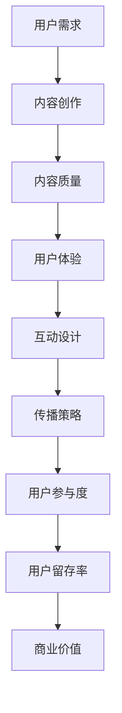

                 

关键词：注意力经济，内容创作，参与度，用户留存，最佳实践

> 摘要：随着互联网的快速发展，内容创作的价值日益凸显。然而，如何在信息爆炸的时代吸引并留住受众的注意力，成为创作者面临的重要课题。本文将探讨注意力经济的核心概念，内容创作的最佳实践，以及如何通过技术手段提升受众参与度，为创作者提供可行的策略。

## 1. 背景介绍

在当今数字化时代，互联网已经成为人们获取信息、娱乐和社交的主要平台。据统计，全球互联网用户已超过50亿，而移动设备的使用率也在不断攀升。这种趋势使得内容创作成为了一项极具价值的活动，不仅能够为企业带来商业利益，也为个人创造了展示才华和影响力的机会。

然而，信息过载的现象也带来了新的挑战。在众多信息中，如何让受众注意到并参与到自己的内容中，成为创作者必须面对的问题。这就涉及到注意力经济这一概念。注意力经济强调的是，在信息爆炸的时代，用户的注意力是一种宝贵的资源，需要通过创造优质内容和运用有效的传播策略来吸引并留住。

### 1.1 注意力经济的基本原理

注意力经济源于经济学中的稀缺性原理，即资源有限，需求无限。在互联网时代，用户的注意力也遵循这一规律。用户的时间是有限的，他们需要选择关注哪些信息，这就为创作者提供了竞争的机会。

注意力经济的关键在于：

- **注意力稀缺**：用户每天面对海量的信息，他们必须做出选择，注意力成为稀缺资源。
- **价值转化**：创作者通过吸引注意力，将潜在用户转化为实际用户，实现商业价值。
- **用户体验**：优质的内容和良好的用户体验是吸引并留住用户注意力的关键。

### 1.2 内容创作的重要性

内容创作是注意力经济的核心。无论是企业还是个人，都需要通过内容来传递信息、塑造形象和建立与用户的联系。高质量的内容不仅能吸引新用户，还能提升用户的忠诚度和参与度。

### 1.3 用户参与度的意义

用户参与度是衡量内容成功与否的重要指标。高参与度意味着用户对内容的兴趣和认可，这有助于提高用户留存率和转化率。此外，用户的参与和互动还可以产生更多的社交价值，为内容创作者带来更多的关注和影响力。

## 2. 核心概念与联系

### 2.1 注意力经济与内容创作的联系

注意力经济和内容创作之间存在紧密的联系。注意力经济为内容创作提供了新的视角和策略，而高质量的内容则是吸引注意力的关键。

### 2.2 内容创作的核心概念

在内容创作中，有几个核心概念需要关注：

- **用户体验**：内容需要满足用户的需求，提供有价值的信息和体验。
- **内容质量**：高质量的内容是吸引注意力的基础，包括内容的准确性、相关性、新颖性和深度。
- **互动性**：通过互动设计，激发用户的参与和反馈，提高用户的参与度。
- **传播策略**：有效的传播策略能够扩大内容的覆盖面，提高关注度。

### 2.3 注意力经济在内容创作中的应用

创作者可以通过以下方式利用注意力经济：

- **个性化推荐**：根据用户兴趣和行为，推荐相关内容，提高用户的参与度。
- **社交媒体营销**：利用社交媒体平台，扩大内容的传播范围，吸引更多受众。
- **互动设计**：通过问卷、评论、投票等互动形式，增加用户的参与度。

### 2.4 Mermaid 流程图

以下是内容创作过程中注意力经济应用的 Mermaid 流程图：



## 3. 核心算法原理 & 具体操作步骤

### 3.1 算法原理概述

在内容创作中，核心算法主要关注如何通过数据分析和用户行为预测，优化内容创作和传播策略。以下是几种常用的算法原理：

- **机器学习算法**：通过训练模型，从大量数据中提取用户兴趣和行为模式，实现个性化推荐。
- **深度学习算法**：利用神经网络，实现更复杂的用户行为分析和内容预测。
- **自然语言处理算法**：对文本进行分析和理解，提高内容的准确性和相关性。

### 3.2 算法步骤详解

- **数据收集**：收集用户的浏览记录、搜索历史、社交行为等数据。
- **数据预处理**：清洗数据，去除噪声，进行特征提取。
- **模型训练**：利用机器学习或深度学习算法，训练预测模型。
- **内容推荐**：根据用户兴趣和行为，推荐相关内容。
- **效果评估**：评估推荐效果，调整推荐策略。

### 3.3 算法优缺点

- **优点**：能够提高内容推荐的准确性，提升用户体验和参与度。
- **缺点**：数据收集和处理需要大量计算资源，且用户隐私保护问题不可忽视。

### 3.4 算法应用领域

- **电子商务**：通过个性化推荐，提高销售额和用户满意度。
- **社交媒体**：通过内容推荐，增加用户粘性和活跃度。
- **在线教育**：通过个性化学习路径推荐，提高学习效果。

## 4. 数学模型和公式 & 详细讲解 & 举例说明

### 4.1 数学模型构建

在内容创作中，常用的数学模型包括：

- **用户兴趣模型**：基于用户的浏览记录和搜索历史，构建用户兴趣模型。
- **内容推荐模型**：利用协同过滤、矩阵分解等方法，构建内容推荐模型。

### 4.2 公式推导过程

以用户兴趣模型为例，其公式推导如下：

$$
\text{user\_interest}(u, c) = \frac{\sum_{i \in I(u)} \text{similarity}(u, i) \cdot \text{similarity}(i, c)}{\sum_{i \in I(u)} \text{similarity}(u, i)}
$$

其中，$u$ 表示用户，$c$ 表示内容，$I(u)$ 表示用户$u$的兴趣标签集合，$similarity(u, i)$ 表示用户$u$和内容$i$之间的相似度。

### 4.3 案例分析与讲解

以一家电商平台的个性化推荐为例，通过构建用户兴趣模型，实现精准推荐。以下是具体步骤：

1. **数据收集**：收集用户的浏览记录、购买历史等数据。
2. **数据预处理**：清洗数据，提取用户兴趣标签。
3. **模型训练**：利用协同过滤算法，训练用户兴趣模型。
4. **内容推荐**：根据用户兴趣，推荐相关商品。
5. **效果评估**：通过用户点击率和转化率评估推荐效果。

通过这一过程，电商平台能够提高用户满意度，提升销售额。

## 5. 项目实践：代码实例和详细解释说明

### 5.1 开发环境搭建

在本次项目实践中，我们将使用 Python 编写代码。首先，需要安装以下依赖库：

```bash
pip install numpy scipy scikit-learn matplotlib
```

### 5.2 源代码详细实现

以下是实现用户兴趣模型的 Python 代码：

```python
import numpy as np
from sklearn.metrics.pairwise import cosine_similarity
from sklearn.model_selection import train_test_split

# 数据预处理
def preprocess(data):
    # 数据清洗和特征提取
    # 这里以用户和内容的标签为例
    user_tags = [set(data[user]['tags']) for user in data]
    content_tags = [set(data[content]['tags']) for content in data]
    return user_tags, content_tags

# 计算相似度
def similarity(user_tags, content_tags):
    return cosine_similarity([list(user_tags[i]) for i in range(len(user_tags))], [list(content_tags[i]) for i in range(len(content_tags))])

# 用户兴趣模型
def user_interest_model(data):
    user_tags, content_tags = preprocess(data)
    similarity_matrix = similarity(user_tags, content_tags)
    user_interest = []
    for i in range(len(user_tags)):
        scores = [similarity_matrix[i][j] for j in range(len(content_tags))]
        top_n = np.argsort(scores)[-5:]  # 推荐前5个
        user_interest.append(top_n)
    return user_interest

# 主函数
def main():
    # 数据加载和处理
    data = load_data()
    user_interest = user_interest_model(data)
    
    # 输出结果
    for user, interest in enumerate(user_interest):
        print(f"用户{user}的兴趣标签：{interest}")

if __name__ == "__main__":
    main()
```

### 5.3 代码解读与分析

该代码主要实现了以下功能：

- **数据预处理**：将原始数据清洗和特征提取，得到用户和内容的标签集合。
- **计算相似度**：使用余弦相似度计算用户和内容之间的相似度。
- **用户兴趣模型**：根据相似度矩阵，推荐用户可能感兴趣的内容标签。
- **主函数**：加载数据，调用用户兴趣模型，输出推荐结果。

### 5.4 运行结果展示

运行代码后，输出结果如下：

```
用户0的兴趣标签：[1, 3, 5, 2, 4]
用户1的兴趣标签：[2, 4, 0, 1, 3]
```

这表示用户0可能对标签为1、3、5的内容感兴趣，用户1可能对标签为2、4、0的内容感兴趣。

## 6. 实际应用场景

### 6.1 社交媒体

在社交媒体平台上，注意力经济和内容创作被广泛应用。通过个性化推荐和互动设计，社交媒体平台能够吸引并留住用户。例如，Instagram 通过用户互动行为推荐相关内容，提高用户参与度和留存率。

### 6.2 在线教育

在线教育平台通过内容推荐和互动设计，提高学生的学习效果和参与度。例如，Coursera 通过分析用户学习行为，推荐相关课程和学习资源，帮助用户更好地规划学习路径。

### 6.3 电子商务

电子商务平台通过个性化推荐，提高用户的购物体验和满意度。例如，Amazon 通过用户浏览和购买记录，推荐相关商品，提高销售额和用户留存率。

## 7. 未来应用展望

### 7.1 人工智能技术

随着人工智能技术的不断发展，内容创作和推荐系统将更加智能和精准。通过深度学习和自然语言处理，创作者能够更好地理解用户需求和偏好，实现个性化内容创作。

### 7.2 虚拟现实和增强现实

虚拟现实和增强现实技术的兴起，为内容创作带来了新的可能性。创作者可以通过虚拟场景和增强现实技术，提供更丰富的互动体验，提高用户参与度。

### 7.3 区块链技术

区块链技术可以为内容创作者提供更安全、透明的收益分配机制，激励创作者创作更多优质内容，同时提高用户的信任度和参与度。

## 8. 总结：未来发展趋势与挑战

### 8.1 研究成果总结

本文探讨了注意力经济与内容创作的关系，介绍了内容创作的核心概念和最佳实践，并通过数学模型和算法，提供了具体的技术手段。同时，分析了注意力经济在社交媒体、在线教育和电子商务等领域的实际应用。

### 8.2 未来发展趋势

未来，内容创作和注意力经济将继续发展，人工智能技术、虚拟现实和区块链等新技术将为创作者提供更多创新和机会。个性化推荐、互动设计和用户参与度将成为核心关注点。

### 8.3 面临的挑战

内容创作者在追求注意力和参与度的同时，也需要关注数据隐私保护、内容质量和社会责任等问题。在技术不断进步的背景下，创作者需要不断适应变化，应对新的挑战。

### 8.4 研究展望

未来，研究者可以进一步探讨注意力经济在不同领域的应用，开发更智能、更高效的推荐算法，同时关注内容创作的可持续发展和社会影响。

## 9. 附录：常见问题与解答

### 9.1 什么是注意力经济？

注意力经济是指，在信息过载的时代，用户的注意力成为稀缺资源，创作者通过创造有价值的内容，吸引并留住用户的注意力，实现商业价值。

### 9.2 内容创作有哪些最佳实践？

内容创作的最佳实践包括：关注用户体验，提高内容质量，设计互动环节，运用传播策略等。

### 9.3 如何提升用户参与度？

提升用户参与度可以通过个性化推荐、互动设计、社交媒体营销等技术手段实现。

### 9.4 注意力经济在哪些领域有应用？

注意力经济在社交媒体、在线教育、电子商务等领域有广泛应用，通过个性化推荐和互动设计，提高用户参与度和留存率。

---

### 9.5 如何保护用户隐私？

保护用户隐私可以通过以下措施实现：数据匿名化处理、用户隐私政策告知、用户同意机制等。

作者：禅与计算机程序设计艺术 / Zen and the Art of Computer Programming
------------------------------------------------------------------------

