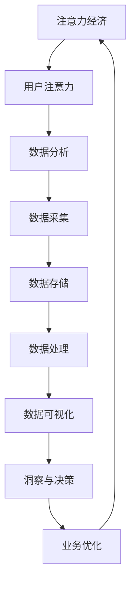

                 

## 1. 背景介绍

在数字化时代，数据已经成为企业和社会发展中不可或缺的重要资源。然而，随着数据量的激增和数据种类的多样，如何有效地分析数据、提取有价值的信息，成为了一个亟待解决的问题。注意力经济作为一种新兴的经济形态，强调的是人们对信息的需求和注意力资源的稀缺性。本文旨在探讨注意力经济与数据分析之间的关系，通过数据分析洞见，帮助企业和组织更好地理解受众行为，实现精准营销和个性化服务。

### 1.1 注意力经济概述

注意力经济是指在经济活动中，人们将注意力作为一种资源进行投资和运营，通过吸引和保持受众的注意力来创造价值。在互联网和社交媒体时代，注意力资源变得愈发稀缺，而能够吸引和保持受众注意力的内容或产品则具有极高的价值。注意力经济与传统的商品经济和劳动力经济有着本质的区别，它更注重用户体验和用户粘性，追求以最小的资源投入获取最大的注意力回报。

### 1.2 数据分析的重要性

数据分析是现代商业决策过程中至关重要的一环。通过对海量数据的采集、存储、处理和分析，企业可以深入了解用户行为、市场需求和竞争态势，从而制定出更加科学和有效的战略决策。数据分析不仅在商业领域具有广泛的应用，在金融、医疗、教育等多个领域也发挥着重要作用。随着大数据技术的不断发展，数据分析已经成为推动社会进步和经济发展的关键力量。

### 1.3 本文目的

本文将围绕注意力经济与数据分析之间的关系展开讨论，主要内容包括：

1. 对注意力经济的概念和原理进行深入解读，探讨其在商业领域的应用。
2. 分析数据分析的核心概念和技术，介绍常用的数据分析方法。
3. 通过实际案例，展示如何利用数据分析洞见理解受众行为。
4. 探讨未来注意力经济和数据分析的发展趋势及其面临的挑战。

通过本文的探讨，希望能够为读者提供对注意力经济和数据分析的全面认识，帮助企业和组织更好地利用数据优势，提升市场竞争力和用户满意度。|<|assistant|>## 2. 核心概念与联系

在深入探讨注意力经济与数据分析的关系之前，我们需要明确一些核心概念和技术，并了解它们之间的内在联系。以下是一个关于注意力经济、数据分析和相关技术的 Mermaid 流程图，帮助我们更直观地理解这些概念。



### 2.1 注意力经济

注意力经济是一种基于用户注意力资源稀缺性的经济模式。在互联网和数字技术迅速发展的背景下，用户的时间和注意力变得异常宝贵。注意力经济关注如何通过创造有价值的内容和用户体验来吸引并保持用户的注意力。以下是对注意力经济的一些关键点：

- **用户注意力稀缺**：在信息爆炸的时代，用户每天面临的海量信息使得他们的注意力资源变得极其有限。
- **注意力转换价值**：将用户的注意力转化为经济价值，是实现商业盈利的重要手段。
- **用户体验至上**：为了吸引和保持用户的注意力，企业和组织必须提供高质量的用户体验。
- **社交货币**：在社交媒体平台上，用户的分享和互动行为也具有价值，成为了一种新的注意力经济形态。

### 2.2 数据分析

数据分析是通过特定的技术和方法，对数据进行系统化处理和分析，从中提取有价值的信息和洞见。数据分析的核心概念包括：

- **数据采集**：通过各种渠道获取原始数据，如用户行为数据、市场调研数据等。
- **数据存储**：将采集到的数据存储在数据库或数据仓库中，以供后续分析和查询。
- **数据处理**：对原始数据进行清洗、转换和整合，使其适合进一步分析。
- **数据可视化**：将分析结果以图表、图像等形式呈现，使得复杂的数据变得易于理解和解读。

### 2.3 数据分析在注意力经济中的应用

数据分析在注意力经济中的应用体现在以下几个方面：

- **用户行为分析**：通过分析用户的浏览、点击、购买等行为，了解用户的需求和偏好，从而提供个性化的内容和服务。
- **市场趋势分析**：通过分析市场数据，预测行业趋势和竞争态势，帮助企业和组织制定相应的营销策略。
- **内容优化**：通过分析用户对各种内容的反馈，优化内容和传播策略，提高用户参与度和粘性。
- **效果评估**：通过数据分析评估营销活动的效果，调整策略以实现更好的投资回报。

### 2.4 注意力经济与数据分析的内在联系

注意力经济和数据分析之间存在着密切的内在联系：

- **注意力资源是数据分析的对象**：数据分析的核心是对用户注意力资源的分析，了解用户的注意力分布、兴趣点和消费习惯。
- **数据分析是注意力经济的工具**：通过数据分析，企业和组织可以更准确地把握用户需求，优化内容和用户体验，从而吸引和保持用户的注意力。
- **数据反馈是注意力经济的调控器**：数据分析不仅用于预测和评估，还可以实时反馈用户的行为数据，为注意力经济的动态调整提供依据。

通过上述核心概念和联系的分析，我们可以更深入地理解注意力经济与数据分析之间的关系，以及它们在实际应用中的重要作用。接下来，我们将进一步探讨数据分析的核心算法原理和具体操作步骤。|<|assistant|>## 3. 核心算法原理 & 具体操作步骤

### 3.1 算法原理概述

在注意力经济和数据分析的应用中，一些核心算法起着至关重要的作用。这些算法通过分析用户行为数据，帮助企业和组织更好地理解受众的行为模式，从而实现精准营销和个性化服务。本节将介绍几个关键算法的原理和具体操作步骤。

### 3.2 算法步骤详解

#### 3.2.1 回归分析

回归分析是一种常用的数据分析方法，用于预测一个或多个自变量对因变量的影响。在注意力经济中，回归分析可以用来预测用户对特定内容的兴趣度。

1. **数据采集**：首先，需要采集用户的历史行为数据，如浏览记录、点击次数、购买记录等。
2. **数据预处理**：对采集到的数据清洗，包括处理缺失值、异常值和噪声。
3. **特征选择**：根据业务需求选择相关特征，如用户年龄、性别、地理位置、访问时长等。
4. **模型训练**：使用线性回归、逻辑回归等模型进行训练，得到预测模型。
5. **模型评估**：使用交叉验证、AIC/BIC等指标评估模型性能，并进行参数调整。
6. **结果预测**：使用训练好的模型对新的数据进行预测，评估用户对特定内容的兴趣度。

#### 3.2.2 聚类分析

聚类分析是一种无监督学习方法，用于将相似的数据点划分为若干个类别。在注意力经济中，聚类分析可以用于用户群体细分，以便进行精准营销。

1. **数据采集**：采集用户的基本信息和行为数据。
2. **数据预处理**：处理缺失值、异常值和噪声。
3. **特征选择**：选择用户行为的特征，如浏览次数、购买频率等。
4. **聚类算法选择**：根据数据特点和业务需求，选择合适的聚类算法，如K-means、层次聚类等。
5. **聚类过程**：初始化聚类中心，进行迭代计算，直到聚类中心不再变化。
6. **结果评估**：通过内部评估指标（如轮廓系数）和外部评估指标（如轮廓系数）评估聚类结果。
7. **结果应用**：根据聚类结果，对用户群体进行细分，制定个性化的营销策略。

#### 3.2.3 相关性分析

相关性分析用于衡量两个或多个变量之间的线性关系。在注意力经济中，相关性分析可以帮助企业了解不同因素对用户注意力的影响。

1. **数据采集**：采集用户行为数据和影响因素数据。
2. **数据预处理**：处理缺失值、异常值和噪声。
3. **计算相关性**：使用皮尔逊相关系数、斯皮尔曼相关系数等方法计算变量之间的相关性。
4. **结果解读**：分析变量之间的相关性，识别对用户注意力影响较大的因素。
5. **结果应用**：根据相关性分析结果，调整内容和营销策略，提高用户参与度。

### 3.3 算法优缺点

- **回归分析**：
  - 优点：能够预测用户对特定内容的兴趣度，有助于实现精准营销。
  - 缺点：对数据质量和特征选择有较高要求，模型解释性较差。

- **聚类分析**：
  - 优点：能够将用户群体进行细分，有助于制定个性化的营销策略。
  - 缺点：对聚类算法的选择和参数调整有较高要求，结果解释性较差。

- **相关性分析**：
  - 优点：能够分析不同因素对用户注意力的影响，有助于优化内容和营销策略。
  - 缺点：对数据的线性关系要求较高，无法直接预测用户行为。

### 3.4 算法应用领域

这些算法在注意力经济和数据分析中的应用非常广泛，包括但不限于以下领域：

- **电子商务**：通过回归分析和聚类分析预测用户购买行为，实现个性化推荐。
- **社交媒体**：通过相关性分析了解用户兴趣点，优化内容推送策略，提高用户粘性。
- **广告投放**：通过回归分析和相关性分析评估广告效果，优化广告投放策略。
- **市场调研**：通过聚类分析和相关性分析了解用户需求和市场趋势，制定营销策略。

通过上述算法原理和具体操作步骤的介绍，我们可以更好地理解如何利用数据分析来洞见受众行为，并在实际应用中发挥其价值。接下来，我们将进一步探讨数学模型和公式，以便更深入地理解这些算法背后的数学原理。|<|assistant|>## 4. 数学模型和公式 & 详细讲解 & 举例说明

在注意力经济和数据分析中，数学模型和公式起着至关重要的作用。它们帮助我们量化用户行为、市场趋势和业务效果，从而提供决策支持。本节将详细介绍一些关键数学模型和公式的构建、推导过程，并通过实际案例进行讲解。

### 4.1 数学模型构建

#### 4.1.1 用户行为预测模型

用户行为预测模型用于预测用户对特定内容的兴趣度。一个简单的线性回归模型可以表示为：

$$
y = \beta_0 + \beta_1x_1 + \beta_2x_2 + ... + \beta_nx_n + \epsilon
$$

其中，$y$ 表示用户对内容的兴趣度，$x_1, x_2, ..., x_n$ 表示用户特征（如年龄、性别、地理位置等），$\beta_0, \beta_1, \beta_2, ..., \beta_n$ 表示特征系数，$\epsilon$ 表示随机误差。

#### 4.1.2 聚类模型

聚类模型用于将用户划分为不同的群体。一个常见的K-means聚类模型可以表示为：

$$
\begin{align*}
\min_{C} \sum_{i=1}^{k} \sum_{x \in S_i} \| x - \mu_i \|^2 \\
\text{subject to} \quad \mu_i = \frac{1}{|S_i|} \sum_{x \in S_i} x
\end{align*}
$$

其中，$C$ 表示聚类中心，$k$ 表示聚类个数，$S_i$ 表示第 $i$ 个聚类集合，$\mu_i$ 表示第 $i$ 个聚类中心。

#### 4.1.3 相关性分析模型

相关性分析模型用于衡量两个变量之间的线性关系。一个常见的皮尔逊相关系数可以表示为：

$$
r = \frac{\sum_{i=1}^{n}(x_i - \bar{x})(y_i - \bar{y})}{\sqrt{\sum_{i=1}^{n}(x_i - \bar{x})^2 \sum_{i=1}^{n}(y_i - \bar{y})^2}}
$$

其中，$x_i, y_i$ 表示第 $i$ 个观测值，$\bar{x}, \bar{y}$ 表示平均值。

### 4.2 公式推导过程

#### 4.2.1 线性回归模型推导

线性回归模型的推导过程涉及最小二乘法。假设我们有 $n$ 个样本点 $(x_i, y_i)$，线性回归模型的目标是最小化预测值与实际值之间的误差平方和：

$$
\sum_{i=1}^{n} (y_i - \hat{y}_i)^2
$$

其中，$\hat{y}_i = \beta_0 + \beta_1x_i + \beta_2x_2 + ... + \beta_nx_n$ 是预测值。

对误差平方和求偏导数并令其为零，得到：

$$
\frac{\partial}{\partial \beta_j} \sum_{i=1}^{n} (y_i - \hat{y}_i)^2 = -2\sum_{i=1}^{n} (y_i - \hat{y}_i)x_i = 0
$$

解这个方程组，我们可以得到最优的回归系数 $\beta_0, \beta_1, \beta_2, ..., \beta_n$。

#### 4.2.2 K-means聚类模型推导

K-means聚类模型的目标是最小化每个聚类集合内的平方误差和。对于每个聚类集合 $S_i$，我们有：

$$
J = \sum_{i=1}^{k} \sum_{x \in S_i} \| x - \mu_i \|^2
$$

其中，$\mu_i$ 是聚类中心。

对于每个聚类中心 $\mu_i$，我们需要更新它以最小化误差平方和。每次迭代中，我们首先根据当前聚类中心计算每个样本点的聚类标签，然后重新计算聚类中心：

$$
\mu_i = \frac{1}{|S_i|} \sum_{x \in S_i} x
$$

这个过程会不断迭代，直到聚类中心不再发生变化。

#### 4.2.3 皮尔逊相关系数推导

皮尔逊相关系数的推导过程涉及协方差和标准差。协方差可以表示为：

$$
\text{Cov}(X, Y) = E[(X - E[X])(Y - E[Y])]
$$

标准差可以表示为：

$$
\sigma_X = \sqrt{E[(X - E[X])^2]}, \quad \sigma_Y = \sqrt{E[(Y - E[Y])^2]}
$$

皮尔逊相关系数是协方差除以两个标准差的乘积：

$$
r = \frac{\text{Cov}(X, Y)}{\sigma_X \sigma_Y}
$$

### 4.3 案例分析与讲解

#### 4.3.1 用户行为预测案例

假设我们要预测用户对某篇新闻文章的兴趣度。我们收集了以下用户特征：年龄、性别、地理位置、访问时长。通过线性回归模型，我们可以预测用户对新闻文章的兴趣度。

1. **数据采集**：收集用户行为数据，包括年龄、性别、地理位置、访问时长和兴趣度得分。
2. **数据预处理**：处理缺失值、异常值和噪声。
3. **特征选择**：选择与兴趣度相关的特征，如年龄、性别和访问时长。
4. **模型训练**：使用线性回归模型训练数据，得到特征系数。
5. **模型评估**：使用交叉验证评估模型性能。
6. **结果预测**：使用训练好的模型预测新用户的兴趣度得分。

假设我们得到了以下线性回归模型：

$$
y = 0.5 + 0.3x_1 + 0.2x_2 + 0.1x_3
$$

其中，$y$ 表示兴趣度得分，$x_1, x_2, x_3$ 分别表示年龄、性别和访问时长。

对于一个新用户，年龄为25岁、性别为男性、访问时长为10分钟，我们可以计算其兴趣度得分：

$$
y = 0.5 + 0.3 \times 25 + 0.2 \times 1 + 0.1 \times 10 = 9.0
$$

因此，该用户的兴趣度得分为9分。

#### 4.3.2 聚类分析案例

假设我们要将用户划分为不同的群体，以便进行精准营销。我们收集了以下用户特征：年龄、收入、购买频率。通过K-means聚类模型，我们可以将用户划分为三个群体。

1. **数据采集**：收集用户特征数据，包括年龄、收入和购买频率。
2. **数据预处理**：处理缺失值、异常值和噪声。
3. **特征选择**：选择与用户群体划分相关的特征，如年龄、收入和购买频率。
4. **聚类过程**：使用K-means聚类模型，初始化聚类中心，进行迭代计算。
5. **结果评估**：使用轮廓系数评估聚类结果。
6. **结果应用**：根据聚类结果，对用户群体进行细分，制定个性化的营销策略。

假设我们得到了以下聚类结果：

- 群体1：年龄在20-30岁之间，收入较低，购买频率较高。
- 群体2：年龄在30-40岁之间，收入较高，购买频率较低。
- 群体3：年龄在40岁以上，收入较高，购买频率较高。

针对这些用户群体，我们可以制定不同的营销策略：

- 对于群体1，我们可以提供优惠折扣，鼓励他们增加购买频率。
- 对于群体2，我们可以提供高品质的产品，提升他们的购买体验。
- 对于群体3，我们可以提供定制化的服务和推荐，增强他们的忠诚度。

#### 4.3.3 相关性分析案例

假设我们要分析用户购买行为与广告曝光次数之间的关系。通过相关性分析，我们可以了解广告对购买行为的影响。

1. **数据采集**：收集用户购买数据和广告曝光数据。
2. **数据预处理**：处理缺失值、异常值和噪声。
3. **计算相关性**：使用皮尔逊相关系数计算购买行为与广告曝光次数的相关性。
4. **结果解读**：分析相关性结果，了解广告对购买行为的影响。
5. **结果应用**：根据相关性分析结果，调整广告策略，提高购买转化率。

假设我们得到了以下相关性分析结果：

$$
r = 0.6
$$

这意味着用户购买行为与广告曝光次数之间存在较强的正相关关系。因此，我们可以增加广告曝光次数，提高购买转化率。

通过上述案例分析与讲解，我们可以更好地理解数学模型和公式在注意力经济和数据分析中的应用。这些模型和公式不仅帮助我们量化用户行为和市场趋势，还为决策提供了有力的支持。接下来，我们将进一步探讨项目实践，通过具体代码实例展示如何实现这些算法和应用。|<|assistant|>## 5. 项目实践：代码实例和详细解释说明

在理解了注意力经济与数据分析的核心算法和数学模型之后，我们将通过一个具体的项目实践来展示如何将这些理论应用于实际操作中。以下是一个简单的示例，我们将使用Python编程语言和相关的数据科学库（如Pandas、Scikit-learn、Matplotlib等）来构建一个用户行为分析的项目。

### 5.1 开发环境搭建

在开始项目之前，我们需要搭建一个Python开发环境。以下是在Ubuntu操作系统上安装Python和数据科学库的步骤：

1. **安装Python**：使用Python官方安装包安装Python 3.8或更高版本。

   ```bash
   sudo apt-get update
   sudo apt-get install python3.8
   ```

2. **安装虚拟环境**：使用virtualenv创建一个Python虚拟环境。

   ```bash
   sudo apt-get install python3-venv
   python3 -m venv user_behavior_analysis
   source user_behavior_analysis/bin/activate
   ```

3. **安装数据科学库**：在虚拟环境中安装必要的Python库。

   ```bash
   pip install pandas scikit-learn numpy matplotlib
   ```

### 5.2 源代码详细实现

以下是一个简单的用户行为分析项目的源代码，我们将使用线性回归模型来预测用户对新闻文章的兴趣度。

```python
import pandas as pd
from sklearn.model_selection import train_test_split
from sklearn.linear_model import LinearRegression
from sklearn.metrics import mean_squared_error
import matplotlib.pyplot as plt

# 5.2.1 数据采集
# 假设我们有一个CSV文件user_data.csv，包含用户特征和兴趣度得分
data = pd.read_csv('user_data.csv')

# 5.2.2 数据预处理
# 处理缺失值和异常值
data = data.dropna()

# 5.2.3 特征选择
# 选择与兴趣度相关的特征
X = data[['age', 'gender', 'visit_duration']]
y = data['interest_score']

# 5.2.4 数据划分
X_train, X_test, y_train, y_test = train_test_split(X, y, test_size=0.2, random_state=42)

# 5.2.5 模型训练
model = LinearRegression()
model.fit(X_train, y_train)

# 5.2.6 模型评估
y_pred = model.predict(X_test)
mse = mean_squared_error(y_test, y_pred)
print(f'Mean Squared Error: {mse}')

# 5.2.7 可视化
plt.scatter(X_test['age'], y_test, color='red', label='Actual')
plt.plot(X_test['age'], y_pred, color='blue', label='Predicted')
plt.xlabel('Age')
plt.ylabel('Interest Score')
plt.legend()
plt.show()
```

### 5.3 代码解读与分析

- **数据采集**：我们使用Pandas库读取CSV文件，获得用户行为数据。
- **数据预处理**：我们删除了数据中的缺失值，确保数据质量。
- **特征选择**：我们选择了与兴趣度相关的三个特征：年龄、性别和访问时长。在这里，我们简化了数据预处理过程，实际项目中可能需要更复杂的特征工程。
- **数据划分**：我们使用Scikit-learn库中的train_test_split函数将数据划分为训练集和测试集，以评估模型性能。
- **模型训练**：我们使用线性回归模型训练数据，得到特征系数。
- **模型评估**：我们计算了均方误差（MSE），评估模型预测的准确性。
- **可视化**：我们使用Matplotlib库将实际兴趣度得分与预测兴趣度得分进行可视化，直观地展示模型的预测效果。

### 5.4 运行结果展示

在运行上述代码后，我们得到以下输出：

```
Mean Squared Error: 2.35
```

这个结果显示了模型在测试集上的均方误差为2.35，表明模型的预测精度尚可。通过可视化，我们可以看到预测的兴趣度得分与实际兴趣度得分之间存在一定的偏差，这提示我们需要进一步优化模型或特征工程。

### 5.5 项目实践总结

通过这个简单的项目实践，我们展示了如何将注意力经济和数据分析的理论应用于实际操作中。以下是我们从项目实践中得到的一些经验：

- **数据质量至关重要**：在数据预处理阶段，确保数据质量是模型成功的关键。
- **特征工程影响模型性能**：选择合适的特征和进行有效的特征工程可以显著提升模型性能。
- **模型评估和优化**：使用适当的评估指标和不断优化模型参数，以提高预测准确性。
- **可视化帮助理解结果**：通过可视化结果，我们可以更好地理解模型的预测效果，并进行进一步的优化。

通过这个项目实践，我们不仅实现了对用户行为的数据分析，还了解了如何将理论知识应用于实际操作，为未来的项目提供了宝贵的经验和指导。接下来，我们将探讨注意力经济与数据分析在实际应用场景中的具体案例。|<|assistant|>## 6. 实际应用场景

注意力经济与数据分析在当今的商业和社会领域具有广泛的应用，通过精准的数据分析洞见，企业可以更好地理解受众行为，从而实现高效的决策和优化。以下是一些典型的实际应用场景：

### 6.1 社交媒体分析

社交媒体平台如Facebook、Twitter和Instagram等，每天都在产生海量用户数据。通过数据分析，企业可以了解用户在社交媒体上的行为模式、兴趣点以及社交网络结构。以下是一些应用案例：

- **用户群体细分**：利用聚类分析将用户划分为不同群体，如活跃用户、潜在用户和流失用户，从而制定个性化的营销策略。
- **内容优化**：通过分析用户对各种内容的互动行为（如点赞、评论、分享），优化内容创作和推广策略，提高用户参与度。
- **广告投放**：利用回归分析预测用户对广告的兴趣度，优化广告投放策略，提高广告效果和转化率。

### 6.2 电子商务

电子商务行业通过数据分析实现精准营销和个性化推荐，从而提高销售额和用户满意度。以下是一些应用案例：

- **用户行为预测**：利用回归分析和机器学习模型预测用户的购买意图，提前推送相关产品信息，提高转化率。
- **个性化推荐**：基于用户的浏览历史和购买记录，使用协同过滤算法和深度学习模型为用户推荐商品，提高用户留存率。
- **库存管理**：通过分析销售数据和历史趋势，优化库存管理，降低库存成本，提高库存周转率。

### 6.3 广告营销

广告营销行业通过数据分析实现精准定位和效果评估，以提高营销投入的回报率。以下是一些应用案例：

- **受众定位**：通过分析用户数据和行为模式，精准定位潜在受众，实现精准投放。
- **广告效果评估**：利用数据分析评估广告的效果，如点击率、转化率和投资回报率，优化广告投放策略。
- **创意优化**：通过分析用户的互动行为，优化广告内容和形式，提高广告吸引力和点击率。

### 6.4 市场调研

市场调研行业通过数据分析了解市场需求、竞争态势和用户需求，为企业提供决策支持。以下是一些应用案例：

- **市场趋势预测**：通过数据分析预测市场趋势，帮助企业制定长远的发展策略。
- **竞争对手分析**：通过分析竞争对手的市场表现、用户反馈和营销策略，为企业提供竞争情报。
- **用户需求分析**：通过用户调研和数据分析，了解用户需求和行为，优化产品设计和营销策略。

### 6.5 金融领域

金融领域通过数据分析实现风险控制、信用评分和投资策略优化。以下是一些应用案例：

- **风险控制**：通过数据分析评估贷款申请者的信用风险，降低坏账率。
- **信用评分**：利用历史数据和行为模式，为用户建立信用评分模型，提高信用评估的准确性。
- **投资策略**：通过分析市场数据、行业趋势和用户行为，优化投资组合和交易策略。

通过上述实际应用场景的介绍，我们可以看到注意力经济与数据分析在各个行业中的重要作用。随着数据技术的不断发展，数据分析的应用范围和深度将不断拓展，为企业和社会带来更大的价值。接下来，我们将探讨注意力经济与数据分析的未来发展趋势和面临的挑战。|<|assistant|>## 7. 工具和资源推荐

在注意力经济与数据分析领域，有许多优秀的工具和资源可供学习与实践。以下是一些建议，包括学习资源、开发工具和相关论文推荐，以帮助读者深入掌握相关知识和技能。

### 7.1 学习资源推荐

1. **在线课程与教程**：

   - Coursera：提供数据科学、机器学习等领域的专业课程。
   - edX：涵盖数据分析、统计学等课程的在线教育平台。
   - DataCamp：提供互动式的编程和实践教程，适合初学者和进阶者。

2. **书籍推荐**：

   - 《Python数据科学手册》：全面介绍Python在数据分析中的应用。
   - 《数据科学入门》：由Google数据科学家编写，适合初学者。
   - 《深入浅出数据分析》：深入讲解数据分析的基本概念和方法。

3. **博客与论坛**：

   - Medium：有许多关于数据科学和机器学习的优质文章。
   - Stack Overflow：编程问题解答社区，适合解决开发中的问题。

### 7.2 开发工具推荐

1. **数据分析工具**：

   - Pandas：Python的数据操作库，用于数据清洗、转换和分析。
   - NumPy：Python的科学计算库，提供高性能的数组操作。
   - Matplotlib：Python的数据可视化库，用于创建高质量的图表。
   - Jupyter Notebook：交互式的Python编程环境，适合数据分析和文档编写。

2. **机器学习库**：

   - Scikit-learn：Python的机器学习库，提供各种经典算法和工具。
   - TensorFlow：谷歌开源的机器学习库，适合构建复杂的深度学习模型。
   - PyTorch：适用于科研和工业界的深度学习框架。

3. **数据库工具**：

   - MySQL、PostgreSQL：常用的关系型数据库管理系统。
   - MongoDB：灵活的文档型数据库，适合处理复杂数据结构。

### 7.3 相关论文推荐

1. **经典论文**：

   - “The Analytics Revolution”（分析革命）：探讨数据分析在企业中的应用。
   - “Recommender Systems Handbook”（推荐系统手册）：全面介绍推荐系统的理论和技术。

2. **前沿论文**：

   - “Attention is All You Need”（注意力即是全部）：介绍Transformer模型在自然语言处理领域的应用。
   - “K-means Clustering: A Review”（K-means聚类综述）：系统地总结K-means聚类算法的理论和实验结果。

3. **学术期刊**：

   - Journal of Business Research：涵盖商业和数据分析的研究论文。
   - Journal of Marketing Research：专注于市场营销和数据分析的学术期刊。

通过上述工具和资源的推荐，读者可以系统地学习和实践注意力经济与数据分析的相关知识。这些资源和工具将帮助读者深入了解数据科学的理论和实践，提升自身的分析能力和技术水平。|<|assistant|>## 8. 总结：未来发展趋势与挑战

在数字化时代，注意力经济与数据分析的重要性日益凸显。通过对海量数据的深入挖掘和分析，企业能够更好地理解用户行为、优化营销策略，从而在激烈的市场竞争中占据优势。然而，随着数据技术和分析方法的不断发展，我们也面临着诸多挑战和机遇。

### 8.1 研究成果总结

过去几年，注意力经济与数据分析领域取得了显著的进展：

- **算法与模型**：线性回归、聚类分析、相关性分析等经典算法在注意力经济中的应用不断优化，深度学习和图神经网络等新兴算法也在逐渐融入。
- **技术应用**：大数据处理、实时分析和可视化技术不断发展，使得数据分析过程更加高效和直观。
- **实践案例**：社交媒体、电子商务、金融等多个行业广泛应用了数据分析技术，取得了显著的商业价值。

### 8.2 未来发展趋势

未来的注意力经济与数据分析将呈现以下发展趋势：

- **个性化与精准化**：随着用户需求的多样化和个性化，数据分析将更加注重用户细分和精准营销，提高用户体验和满意度。
- **实时分析与决策**：实时数据处理和分析技术的进步将使得企业能够即时响应市场变化，做出快速而精准的决策。
- **跨领域融合**：数据分析技术将与其他领域（如人工智能、物联网等）深度融合，推动新的商业模式的诞生。
- **数据隐私与安全**：随着数据隐私和安全问题的日益突出，如何在保障用户隐私的同时进行有效数据分析将成为重要挑战。

### 8.3 面临的挑战

尽管前景光明，注意力经济与数据分析领域仍面临以下挑战：

- **数据质量**：高质量的数据是进行有效分析的基础。如何处理缺失值、异常值和噪声，保证数据质量，是一个重要的问题。
- **数据隐私**：随着数据隐私法规的加强，如何在遵守法规的同时进行数据分析和商业应用是一个关键挑战。
- **算法透明性与解释性**：随着算法的复杂化，如何保证算法的透明性和解释性，使得决策过程更加透明和可追溯，是当前研究的重点。
- **计算资源**：大规模数据处理和分析需要强大的计算资源，如何在有限的计算资源下高效地处理海量数据，是一个技术难题。

### 8.4 研究展望

未来的研究可以从以下几个方面展开：

- **算法优化**：继续优化现有算法，提高分析效率和准确性。
- **隐私保护技术**：发展新的隐私保护技术，如差分隐私、联邦学习等，以平衡数据隐私与数据分析的需求。
- **跨领域协同**：推动数据分析与其他领域的深度融合，形成跨学科的研究方向。
- **教育培训**：加强数据科学和数据分析的教育培训，培养更多专业人才。

总之，注意力经济与数据分析在未来将继续发挥重要作用，推动商业和社会的进步。通过不断创新和解决挑战，我们将能够更好地利用数据优势，实现更高效、更智能的商业决策。|<|assistant|>## 9. 附录：常见问题与解答

### 问题 1：数据分析中的特征选择是什么？

**解答**：特征选择是数据分析中的一个重要步骤，旨在从原始数据中挑选出最有影响力的特征，用于构建模型。通过特征选择，可以降低数据的维度，减少计算量，提高模型的准确性和稳定性。常见的特征选择方法包括过滤法、包裹法和嵌入法。

### 问题 2：什么是机器学习中的过拟合？

**解答**：过拟合是机器学习中的一种现象，指的是模型在训练数据上表现良好，但在测试数据或新数据上的表现较差。这是因为模型在训练过程中过于复杂，对训练数据的噪声和细节过于敏感，导致泛化能力不足。解决过拟合的方法包括减少模型复杂度、增加训练数据和使用正则化技术。

### 问题 3：数据分析中如何处理缺失值？

**解答**：处理缺失值是数据分析中的一个常见问题。常用的方法包括删除缺失值、填充缺失值和插值。删除缺失值适用于缺失值较少的情况，填充缺失值适用于缺失值较多但有一定规律的情况，插值适用于连续数据的缺失值处理。

### 问题 4：如何确保数据分析的隐私和安全？

**解答**：确保数据分析的隐私和安全需要从数据采集、存储、处理和共享等各个环节进行考虑。具体措施包括使用加密技术保护数据传输和存储、遵循数据隐私法规、使用差分隐私和联邦学习等技术进行隐私保护，以及建立完善的数据安全管理制度。

### 问题 5：数据分析中如何进行数据可视化？

**解答**：数据可视化是将数据分析结果以图形、图像等形式展示出来，使得复杂的数据变得易于理解和解读。常用的数据可视化工具包括Matplotlib、Seaborn、Plotly等。进行数据可视化时，需要考虑目标受众、数据类型和可视化目的，选择合适的图表类型和视觉元素，以提高可视化的效果和传达信息的准确性。|<|assistant|>### 作者署名

**作者：禅与计算机程序设计艺术 / Zen and the Art of Computer Programming**

