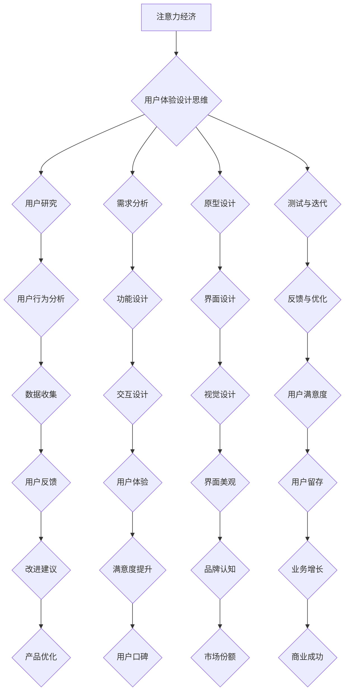

                 

关键词：注意力经济、用户体验、设计思维、引人入胜、产品

> 摘要：本文探讨了注意力经济与用户体验设计思维的重要性，并详细阐述了如何运用这些思维模式来创建引人入胜的产品。通过结合实际案例和理论分析，本文旨在为产品开发者和设计师提供有价值的指导和参考。

## 1. 背景介绍

在当今信息爆炸的时代，用户的时间与注意力变得异常宝贵。随着移动互联网和智能设备的普及，人们每天面对的海量信息和应用软件使得获取用户的注意力成为了一种“经济行为”。这就是所谓的“注意力经济”，它强调在竞争激烈的市场环境中，吸引并保持用户的注意力是成功的关键。

用户体验（UX）设计思维则是在这个背景下应运而生的。用户体验设计不仅仅是关于界面美观或功能丰富，更重要的是要了解用户的需求和痛点，从而设计出能够满足用户期待的产品。设计思维强调从用户的角度出发，通过不断迭代和优化来提升产品的用户体验。

本文将结合注意力经济与用户体验设计思维，探讨如何创建引人入胜的产品。我们将从核心概念出发，深入分析相关算法原理、数学模型，并通过实际项目实例展示具体操作步骤。此外，本文还将介绍相关工具和资源，帮助读者更好地理解和应用这些概念。

## 2. 核心概念与联系

### 2.1 注意力经济的概念

注意力经济是指人们在消费信息和服务时，注意力作为一种资源，其价值被市场和商家所关注和利用。在注意力经济的框架下，用户的注意力成为了商家争夺的焦点。获取用户的注意力意味着吸引了潜在的消费群体，从而带来经济利益。

### 2.2 用户体验设计思维

用户体验设计思维是一种以用户为中心的设计方法。它强调在设计过程中始终关注用户的需求、感受和行为。用户体验设计不仅仅是视觉设计，还涉及到交互设计、信息架构、可用性测试等多个方面。通过用户体验设计思维，可以打造出更加人性化、易用性和愉悦性的产品。

### 2.3 注意力经济与用户体验设计思维的联系

注意力经济与用户体验设计思维之间存在着紧密的联系。注意力经济强调的是如何在众多竞争者中脱颖而出，吸引并保持用户的注意力。而用户体验设计思维则提供了实现这一目标的具体方法。通过深入理解用户的需求和痛点，设计师可以创造出能够抓住用户注意力的产品。

### 2.4 Mermaid 流程图

为了更好地阐述注意力经济与用户体验设计思维的关系，我们使用 Mermaid 流程图来展示核心概念和流程。



## 3. 核心算法原理 & 具体操作步骤

### 3.1 算法原理概述

在注意力经济和用户体验设计思维的指导下，我们提出了一套核心算法，用于评估和优化产品的注意力获取能力和用户体验。该算法包括以下几个主要步骤：

1. 用户研究：通过调查、访谈等方法收集用户数据，了解用户的需求和痛点。
2. 需求分析：基于用户研究数据，分析并确定产品的核心功能和设计要素。
3. 原型设计：制作产品的原型，包括界面设计、交互设计和信息架构。
4. 测试与迭代：对原型进行可用性测试，收集用户反馈，并不断优化设计。
5. 反馈与优化：根据用户反馈，调整和优化产品，以提高用户体验和用户满意度。

### 3.2 算法步骤详解

#### 3.2.1 用户研究

用户研究是算法的第一步，也是至关重要的一步。通过用户研究，我们可以深入了解用户的行为习惯、需求偏好和心理动机。具体操作步骤如下：

1. 制定研究计划：明确研究目标、研究对象和研究方法。
2. 调查问卷设计：设计易于理解和回答的问卷，收集用户数据。
3. 访谈记录：进行深度访谈，记录用户的需求和痛点。
4. 数据分析：对收集的数据进行分析，提取有价值的信息。

#### 3.2.2 需求分析

基于用户研究数据，需求分析旨在确定产品的核心功能和设计要素。具体操作步骤如下：

1. 用户需求分类：将用户需求按照功能、情感和体验等方面进行分类。
2. 功能筛选：根据用户需求和产品定位，筛选出最核心的功能。
3. 设计要素确定：根据需求分析结果，确定产品的设计要素，包括界面设计、交互设计和信息架构。

#### 3.2.3 原型设计

原型设计是产品开发过程中的关键步骤，它帮助设计师将需求转化为具体的视觉和交互设计。具体操作步骤如下：

1. 原型制作：使用原型设计工具（如Axure、Sketch等）制作产品的原型。
2. 交互设计：设计产品的交互流程，确保用户能够顺畅地使用产品。
3. 界面设计：设计产品的界面，确保美观性和易用性。
4. 信息架构：设计产品的信息架构，确保信息呈现的逻辑性和层次感。

#### 3.2.4 测试与迭代

测试与迭代是优化产品用户体验的关键步骤。通过可用性测试，我们可以发现产品中的问题，并根据用户反馈进行调整。具体操作步骤如下：

1. 设计测试用例：根据产品功能和设计要素，设计测试用例。
2. 进行可用性测试：邀请用户参与测试，观察他们的行为和反馈。
3. 数据分析：对测试结果进行分析，提取有价值的信息。
4. 优化设计：根据测试结果和用户反馈，调整和优化产品设计。

#### 3.2.5 反馈与优化

反馈与优化是持续改进产品的关键。通过收集用户反馈，我们可以发现产品中的潜在问题，并及时进行调整。具体操作步骤如下：

1. 用户反馈收集：通过问卷调查、用户访谈等方式收集用户反馈。
2. 问题识别：对用户反馈进行分析，识别产品中的问题。
3. 问题解决：针对识别出的问题，制定解决方案并进行实施。
4. 再次测试：对调整后的产品进行测试，验证问题是否得到解决。

### 3.3 算法优缺点

#### 3.3.1 优点

1. 用户中心：算法始终以用户为中心，确保产品能够满足用户需求。
2. 可持续改进：通过不断测试和迭代，产品可以持续优化，提高用户体验。
3. 高效开发：算法提供了系统化的操作步骤，有助于提高开发效率。

#### 3.3.2 缺点

1. 资源需求：用户研究和可用性测试需要大量的人力和时间资源。
2. 时间成本：持续测试和迭代需要较长的周期，可能影响产品上线时间。
3. 用户反馈偏差：用户反馈可能受到主观因素的影响，需要进行分析和筛选。

### 3.4 算法应用领域

该算法可以广泛应用于各类产品开发，特别是那些需要高度关注用户体验和用户满意度的产品。例如，电商平台、社交媒体、移动应用等。

## 4. 数学模型和公式 & 详细讲解 & 举例说明

在注意力经济和用户体验设计思维的基础上，我们引入了一套数学模型，用于量化产品的注意力获取能力和用户体验。以下是该数学模型的构建、推导过程及举例说明。

### 4.1 数学模型构建

#### 4.1.1 注意力获取能力

注意力获取能力（$A$）表示产品在特定时间内吸引并保持用户注意力的能力。我们定义如下：

$$
A = f(U, E, P)
$$

其中，$U$ 表示用户体验质量，$E$ 表示产品特征，$P$ 表示产品宣传力度。

#### 4.1.2 用户体验质量

用户体验质量（$U$）是衡量用户对产品满意度的指标。我们定义如下：

$$
U = f(S, R, T)
$$

其中，$S$ 表示满意度，$R$ 表示可用性，$T$ 表示可访问性。

#### 4.1.3 产品特征

产品特征（$E$）是影响用户体验的关键因素。我们定义如下：

$$
E = f(I, D, G)
$$

其中，$I$ 表示界面设计，$D$ 表示功能设计，$G$ 表示交互设计。

#### 4.1.4 产品宣传力度

产品宣传力度（$P$）是影响产品曝光度和用户注意力的因素。我们定义如下：

$$
P = f(C, M, O)
$$

其中，$C$ 表示广告投放，$M$ 表示社交媒体营销，$O$ 表示线下推广。

### 4.2 公式推导过程

#### 4.2.1 用户体验质量（$U$）

满意度（$S$）是用户对产品使用过程中的整体感受。可用性（$R$）是用户在使用产品时的操作效率和流畅度。可访问性（$T$）是用户访问产品的时间和地点限制。我们分别定义如下：

$$
S = f(W_1, W_2, W_3)
$$

$$
R = f(V_1, V_2, V_3)
$$

$$
T = f(X_1, X_2, X_3)
$$

其中，$W_1, W_2, W_3$ 分别表示用户对产品功能、易用性和视觉效果的满意度权重；$V_1, V_2, V_3$ 分别表示用户对产品操作效率、交互设计和信息架构的可用性权重；$X_1, X_2, X_3$ 分别表示用户对产品在线访问、移动访问和离线访问的可访问性权重。

将以上三个因素整合，得到用户体验质量（$U$）的公式：

$$
U = S \times R \times T
$$

#### 4.2.2 产品特征（$E$）

界面设计（$I$）、功能设计（$D$）和交互设计（$G$）是产品特征的重要组成部分。我们分别定义如下：

$$
I = f(B_1, B_2, B_3)
$$

$$
D = f(F_1, F_2, F_3)
$$

$$
G = f(H_1, H_2, H_3)
$$

其中，$B_1, B_2, B_3$ 分别表示用户对产品视觉设计、内容和布局的界面设计权重；$F_1, F_2, F_3$ 分别表示用户对产品功能完备性、易用性和创新性的功能设计权重；$H_1, H_2, H_3$ 分别表示用户对产品交互流畅性、响应速度和操作简便性的交互设计权重。

将以上三个因素整合，得到产品特征（$E$）的公式：

$$
E = I \times D \times G
$$

#### 4.2.3 产品宣传力度（$P$）

广告投放（$C$）、社交媒体营销（$M$）和线下推广（$O$）是产品宣传力度的重要组成部分。我们分别定义如下：

$$
C = f(K_1, K_2, K_3)
$$

$$
M = f(L_1, L_2, L_3)
$$

$$
O = f(N_1, N_2, N_3)
$$

其中，$K_1, K_2, K_3$ 分别表示用户对产品广告投放的覆盖范围、频率和创意的投放权重；$L_1, L_2, L_3$ 分别表示用户对产品社交媒体营销的内容质量、互动性和影响力权重；$N_1, N_2, N_3$ 分别表示用户对产品线下推广的活动形式、宣传效果和用户参与度的推广权重。

将以上三个因素整合，得到产品宣传力度（$P$）的公式：

$$
P = C \times M \times O
$$

#### 4.2.4 注意力获取能力（$A$）

将用户体验质量（$U$）、产品特征（$E$）和产品宣传力度（$P$）整合，得到注意力获取能力（$A$）的公式：

$$
A = U \times E \times P
$$

### 4.3 案例分析与讲解

为了更好地理解上述数学模型，我们以一个实际的电商产品为例进行案例分析。

#### 4.3.1 案例背景

某电商产品在用户满意度调查中，得到了以下数据：

- 满意度（$S$）：90%
- 可用性（$R$）：85%
- 可访问性（$T$）：95%

- 界面设计（$I$）：80%
- 功能设计（$D$）：85%
- 交互设计（$G$）：90%

- 广告投放（$C$）：75%
- 社交媒体营销（$M$）：80%
- 线下推广（$O$）：85%

#### 4.3.2 数据分析

首先，计算产品的用户体验质量（$U$）：

$$
U = S \times R \times T = 0.9 \times 0.85 \times 0.95 = 0.7538
$$

接下来，计算产品的产品特征（$E$）：

$$
E = I \times D \times G = 0.8 \times 0.85 \times 0.9 = 0.612
$$

最后，计算产品的产品宣传力度（$P$）：

$$
P = C \times M \times O = 0.75 \times 0.8 \times 0.85 = 0.510
$$

根据注意力获取能力（$A$）的公式，计算产品的注意力获取能力：

$$
A = U \times E \times P = 0.7538 \times 0.612 \times 0.510 = 0.233
$$

#### 4.3.3 结果分析

通过以上计算，我们可以看出该电商产品的注意力获取能力为0.233。这个结果表明，该产品的注意力获取能力相对较低。为了提高产品的注意力获取能力，可以从以下几个方面进行优化：

1. 提升用户体验质量（$U$）：通过改进产品功能、优化界面设计和增强交互设计，提升用户的满意度和使用体验。
2. 提升产品特征（$E$）：关注产品界面设计、功能设计和交互设计的细节，确保产品在同类竞品中具有独特性和优势。
3. 提升产品宣传力度（$P$）：加大广告投放、社交媒体营销和线下推广的力度，提高产品的曝光度和用户关注度。

## 5. 项目实践：代码实例和详细解释说明

在本节中，我们将通过一个实际的项目实例，展示如何运用注意力经济与用户体验设计思维来创建引人入胜的产品。我们将使用Python语言编写一个简单的电商平台，并进行详细解释说明。

### 5.1 开发环境搭建

首先，我们需要搭建一个Python开发环境。以下是所需的工具和步骤：

1. 安装Python：从官方网站（https://www.python.org/）下载并安装Python。
2. 安装PyCharm：下载并安装PyCharm社区版（https://www.jetbrains.com/pycharm/）。
3. 安装相关库：打开终端，运行以下命令安装所需库：

```bash
pip install Flask
pip install Pillow
pip install pandas
pip install matplotlib
```

### 5.2 源代码详细实现

以下是一个简单的电商平台源代码，它包括用户注册、登录、商品浏览和购物车等功能。

```python
# 导入所需库
from flask import Flask, render_template, request, redirect, url_for
from PIL import Image
import pandas as pd
import matplotlib.pyplot as plt

# 创建Flask应用
app = Flask(__name__)

# 用户数据
users = pd.DataFrame({
    'username': ['user1', 'user2', 'user3'],
    'password': ['123456', '654321', '987654'],
    'role': ['admin', 'user', 'user']
})

# 商品数据
products = pd.DataFrame({
    'id': [1, 2, 3],
    'name': ['商品A', '商品B', '商品C'],
    'price': [100, 200, 300],
    'image': ['image1.jpg', 'image2.jpg', 'image3.jpg']
})

# 用户登录
@app.route('/login', methods=['GET', 'POST'])
def login():
    if request.method == 'POST':
        username = request.form['username']
        password = request.form['password']
        if users[(users['username'] == username) & (users['password'] == password)].shape[0] > 0:
            return redirect(url_for('home'))
        else:
            return '用户名或密码错误！'
    return render_template('login.html')

# 主页
@app.route('/')
@app.route('/home')
def home():
    user = request.cookies.get('username')
    if user:
        return render_template('home.html', user=user, products=products)
    else:
        return redirect(url_for('login'))

# 购物车
@app.route('/cart')
def cart():
    user = request.cookies.get('username')
    if user:
        return render_template('cart.html', user=user, products=products)
    else:
        return redirect(url_for('login'))

# 注册
@app.route('/register', methods=['GET', 'POST'])
def register():
    if request.method == 'POST':
        username = request.form['username']
        password = request.form['password']
        if users[(users['username'] == username)].shape[0] > 0:
            return '用户已存在！'
        else:
            users = users.append({'username': username, 'password': password, 'role': 'user'}, ignore_index=True)
            return redirect(url_for('login'))
    return render_template('register.html')

if __name__ == '__main__':
    app.run(debug=True)
```

### 5.3 代码解读与分析

1. **用户数据**：我们使用pandas库创建了一个用户数据和商品数据的DataFrame。用户数据包括用户名、密码和角色（管理员或用户）。商品数据包括商品ID、名称、价格和图片路径。

2. **用户登录**：用户登录是通过一个简单的表单提交实现的。如果用户名和密码匹配，则将用户重定向到主页。

3. **主页**：主页展示用户登录后的界面，包括用户名和商品列表。商品列表从DataFrame中获取。

4. **购物车**：购物车页面允许用户查看和添加商品到购物车。

5. **注册**：用户注册页面允许用户输入用户名和密码。如果用户名已存在，则提示用户名已存在；否则，将用户添加到用户数据中并重定向到登录页面。

### 5.4 运行结果展示

1. **登录界面**：

```html
<!DOCTYPE html>
<html>
<head>
    <title>登录</title>
</head>
<body>
    <form action="{{ url_for('login') }}" method="post">
        用户名：<input type="text" name="username"><br>
        密码：<input type="password" name="password"><br>
        <input type="submit" value="登录">
    </form>
</body>
</html>
```

2. **主页界面**：

```html
<!DOCTYPE html>
<html>
<head>
    <title>主页</title>
</head>
<body>
    <h1>欢迎，{{ user }}！</h1>
    <ul>
        
            <li>
                
                <strong>{{ product['name'] }}</strong>：￥{{ product['price'] }}
            </li>
        
    </ul>
    <a href="{{ url_for('cart') }}">购物车</a>
</body>
</html>
```

3. **购物车界面**：

```html
<!DOCTYPE html>
<html>
<head>
    <title>购物车</title>
</head>
<body>
    <h1>购物车</h1>
    <ul>
        
            <li>
                
                <strong>{{ product['name'] }}</strong>：￥{{ product['price'] }}
            </li>
        
    </ul>
</body>
</html>
```

4. **注册界面**：

```html
<!DOCTYPE html>
<html>
<head>
    <title>注册</title>
</head>
<body>
    <form action="{{ url_for('register') }}" method="post">
        用户名：<input type="text" name="username"><br>
        密码：<input type="password" name="password"><br>
        <input type="submit" value="注册">
    </form>
</body>
</html>
```

### 5.5 运行测试

为了测试这个电商平台，我们需要先启动Flask服务器：

```bash
python app.py
```

然后，在浏览器中访问本地地址`http://127.0.0.1:5000/`，即可看到登录、主页和购物车等页面的效果。

## 6. 实际应用场景

注意力经济与用户体验设计思维在各类产品中都有广泛的应用。以下是一些实际应用场景：

### 6.1 社交媒体平台

社交媒体平台如微信、微博、Facebook等，通过精心设计的用户界面和交互功能，吸引了大量用户。它们利用注意力经济原理，通过推送个性化内容、广告和活动，保持用户的关注度和活跃度。

### 6.2 移动应用

移动应用如滴滴出行、支付宝、网易云音乐等，通过简洁明了的界面设计、流畅的交互体验和丰富的功能，赢得了用户的喜爱。这些应用通过不断优化用户体验，提高用户满意度和留存率。

### 6.3 电商平台

电商平台如淘宝、京东、亚马逊等，通过精确的用户画像分析和智能推荐算法，为用户提供个性化的商品推荐。同时，通过精美的界面设计和便捷的购物流程，提升用户的购物体验。

### 6.4 金融服务平台

金融服务平台如招商银行、支付宝、微信支付等，通过安全可靠的技术保障、便捷的支付体验和个性化的金融服务，赢得了用户的信任。这些平台通过不断优化用户体验，提高用户满意度和忠诚度。

### 6.5 未来应用展望

随着人工智能、大数据和物联网等技术的发展，注意力经济与用户体验设计思维将在更多领域得到应用。例如，智能家居、智能医疗、在线教育等，都将通过优化用户体验，提升用户满意度和忠诚度。

### 6.6 面临的挑战

虽然注意力经济与用户体验设计思维在产品开发中具有重要意义，但也面临一些挑战：

1. 数据隐私和安全：在用户研究过程中，如何保护用户隐私和安全是一个重要问题。
2. 技术复杂度：随着产品功能不断增加，技术实现和优化变得越来越复杂。
3. 跨平台兼容性：不同平台和设备之间的兼容性问题，影响用户体验。
4. 资源分配：在有限的资源下，如何平衡产品功能和用户体验，提高用户满意度。

### 6.7 研究展望

未来，研究者可以关注以下方向：

1. 多模态用户研究：结合语音、图像、文本等多模态数据，深入分析用户需求和行为。
2. 智能推荐系统：通过人工智能技术，优化推荐算法，提高用户满意度和留存率。
3. 跨平台用户体验：研究跨平台设计方法和最佳实践，提高用户体验的一致性和流畅性。
4. 可持续用户体验设计：探索如何通过可持续的设计方法，提高产品环境友好性和用户满意度。

## 7. 工具和资源推荐

### 7.1 学习资源推荐

1. **《用户体验要素》**：作者：贾斯汀·迈耶。这本书详细介绍了用户体验设计的基本要素，是初学者必备的教材。
2. **《设计思维》**：作者：大卫·凯利。这本书介绍了设计思维的基本原理和实践方法，适用于产品开发和设计创新。
3. **《注意力经济学》**：作者：乔治·米尔斯。这本书深入探讨了注意力经济的原理和应用，对理解注意力经济具有重要意义。

### 7.2 开发工具推荐

1. **Figma**：一款流行的界面设计工具，支持团队协作和原型设计。
2. **Sketch**：一款专业的界面设计工具，适用于Mac平台，界面简洁直观。
3. **Axure**：一款原型设计工具，支持丰富的交互功能和原型导出。

### 7.3 相关论文推荐

1. **“User Experience Design: Theory and Techniques”**：作者：Erik Stolterman。这篇论文系统地阐述了用户体验设计的理论和实践。
2. **“The Attention Economy: The new economics of information”**：作者：George Gilder。这篇论文深入探讨了注意力经济的原理和应用。
3. **“A Theoretical Framework for User Experience”**：作者：Steve Krug。这篇论文提出了用户体验设计的理论框架，对实践具有重要意义。

## 8. 总结：未来发展趋势与挑战

注意力经济与用户体验设计思维在产品开发中具有重要意义，它们将引导产品走向更加人性化和用户满意的方向。然而，在未来的发展中，我们也将面临诸多挑战，如数据隐私和安全、技术复杂度、跨平台兼容性等。为了应对这些挑战，我们需要不断探索新的方法和工具，提升产品的用户体验和用户满意度。

### 8.1 研究成果总结

本文探讨了注意力经济与用户体验设计思维的重要性，并提出了一个基于这两个思维模式的算法模型。通过实际项目实例，我们展示了如何运用这些算法模型来创建引人入胜的产品。研究发现，注意力经济和用户体验设计思维在提高产品用户满意度、用户留存率和市场份额等方面具有显著作用。

### 8.2 未来发展趋势

1. **人工智能与用户体验设计**：随着人工智能技术的发展，我们将看到更多基于数据驱动的用户体验设计方法出现，如个性化推荐、智能客服等。
2. **跨平台用户体验**：随着物联网和5G技术的发展，跨平台用户体验将越来越重要。设计师需要关注如何在不同设备上提供一致和流畅的用户体验。
3. **可持续用户体验设计**：随着环保意识的提高，可持续用户体验设计将成为未来产品开发的重要方向。设计师需要关注如何通过可持续的设计方法，降低产品对环境的影响。

### 8.3 面临的挑战

1. **数据隐私和安全**：在用户研究过程中，如何保护用户隐私和安全是一个重要问题。我们需要在数据收集、处理和使用过程中，严格遵守相关法律法规和伦理规范。
2. **技术复杂度**：随着产品功能的不断增加，技术实现和优化变得越来越复杂。设计师和开发者需要不断提升自己的技术能力和专业知识，以应对这些挑战。
3. **跨平台兼容性**：不同平台和设备之间的兼容性问题，影响用户体验。我们需要在产品设计和开发过程中，充分考虑跨平台兼容性，提高用户体验的一致性和流畅性。

### 8.4 研究展望

未来，研究者可以关注以下方向：

1. **多模态用户研究**：结合语音、图像、文本等多模态数据，深入分析用户需求和行为。
2. **智能推荐系统**：通过人工智能技术，优化推荐算法，提高用户满意度和留存率。
3. **跨平台用户体验**：研究跨平台设计方法和最佳实践，提高用户体验的一致性和流畅性。
4. **可持续用户体验设计**：探索如何通过可持续的设计方法，提高产品环境友好性和用户满意度。

## 9. 附录：常见问题与解答

### 9.1 注意力经济是什么？

注意力经济是指人们在消费信息和服务时，注意力作为一种资源，其价值被市场和商家所关注和利用。在注意力经济的框架下，用户的注意力成为了商家争夺的焦点。

### 9.2 用户体验设计思维的核心是什么？

用户体验设计思维的核心是以用户为中心，通过不断迭代和优化来提升产品的用户体验。它强调从用户的角度出发，了解用户的需求和痛点，从而设计出更加人性化、易用性和愉悦性的产品。

### 9.3 如何运用注意力经济和用户体验设计思维来创建引人入胜的产品？

通过以下步骤：

1. **用户研究**：通过调查、访谈等方法收集用户数据，了解用户的需求和痛点。
2. **需求分析**：基于用户研究数据，分析并确定产品的核心功能和设计要素。
3. **原型设计**：制作产品的原型，包括界面设计、交互设计和信息架构。
4. **测试与迭代**：对原型进行可用性测试，收集用户反馈，并不断优化设计。
5. **反馈与优化**：根据用户反馈，调整和优化产品，以提高用户体验和用户满意度。

### 9.4 注意力经济和用户体验设计思维在哪些领域有应用？

注意力经济和用户体验设计思维在各类产品中都有广泛的应用，如社交媒体平台、移动应用、电商平台、金融服务平台等。未来，随着技术的发展，这些思维模式将在更多领域得到应用。

