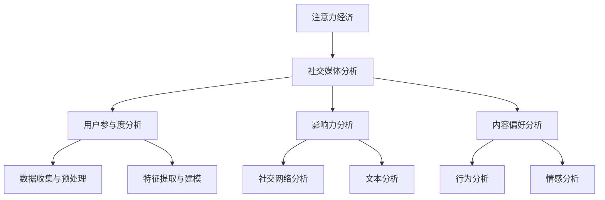

                 

在当今数字化时代，社交媒体已经成为人们获取信息和互动的重要平台。然而，在这个信息爆炸的时代，如何准确地理解和分析受众参与度和影响力，成为了企业和个人在社交媒体上取得成功的关键。本文将深入探讨注意力经济与社交媒体分析的核心概念、算法原理、数学模型、项目实践以及实际应用场景，为读者提供全面的洞见和实用指南。

## 关键词

注意力经济、社交媒体分析、受众参与度、影响力、算法、数学模型、项目实践、实际应用

## 摘要

本文首先介绍了注意力经济的概念和社交媒体分析的重要性。接着，我们深入探讨了核心概念与联系，通过Mermaid流程图详细展示了相关架构。随后，文章详细讲解了核心算法原理、具体操作步骤，并分析了算法优缺点及应用领域。在数学模型和公式部分，我们进行了详细的推导和举例说明。随后，文章通过一个具体的代码实例，展示了项目的实践过程。最后，我们讨论了实际应用场景，并展望了未来的发展趋势和挑战。

## 1. 背景介绍

随着互联网的普及和智能手机的广泛使用，社交媒体已经成为了人们日常生活中不可或缺的一部分。从Facebook到Twitter，从Instagram到LinkedIn，各种社交媒体平台不断涌现，吸引了全球数十亿用户。这些平台不仅提供了即时通信和分享功能，还成为了企业和个人展示自身形象、传播信息的重要渠道。然而，在这个信息爆炸的时代，如何吸引受众的注意力，提高受众参与度，成为了企业和个人在社交媒体上取得成功的关键。

注意力经济（Attention Economy）是一个相对较新的概念，它指的是在数字时代，受众的注意力成为一种稀缺资源，因此谁能更好地吸引和维持受众的注意力，谁就能在竞争中脱颖而出。社交媒体分析（Social Media Analysis）则是一种利用大数据和机器学习技术对社交媒体上的用户行为进行分析的方法。通过对用户参与度和影响力的分析，企业和个人可以更好地了解受众需求，优化内容策略，提高市场竞争力。

本文旨在深入探讨注意力经济与社交媒体分析的核心概念、算法原理、数学模型、项目实践以及实际应用场景，为读者提供全面的洞见和实用指南。通过本文的阅读，读者将能够：

1. 理解注意力经济的概念和重要性；
2. 掌握社交媒体分析的基本原理和方法；
3. 了解核心算法的工作原理和操作步骤；
4. 掌握数学模型和公式的构建与推导；
5. 学习如何通过代码实例进行项目实践；
6. 了解社交媒体分析的实际应用场景和未来发展趋势。

## 2. 核心概念与联系

### 2.1 注意力经济

注意力经济是指在经济活动中，受众的注意力成为一种稀缺资源，因此谁能更好地吸引和维持受众的注意力，谁就能在竞争中脱颖而出。在数字时代，由于信息的爆炸性增长，受众的注意力变得更加分散，因此如何有效地吸引和保持受众的注意力，成为了企业和个人在社交媒体上取得成功的关键。

### 2.2 社交媒体分析

社交媒体分析是指利用大数据和机器学习技术，对社交媒体上的用户行为进行分析，以了解受众需求、优化内容策略、提高市场竞争力。社交媒体分析的核心概念包括用户参与度、影响力、内容偏好等。

### 2.3 Mermaid流程图

为了更好地理解注意力经济与社交媒体分析的核心概念和联系，我们可以使用Mermaid流程图来展示相关的架构和流程。以下是示例：



在这个流程图中，注意力经济是核心，它通过社交媒体分析来获取用户参与度、影响力和内容偏好等信息。用户参与度分析、影响力分析和内容偏好分析是社交媒体分析的关键环节，它们通过数据收集与预处理、特征提取与建模、社交网络分析、文本分析、行为分析和情感分析等技术手段来实现。

## 3. 核心算法原理 & 具体操作步骤

### 3.1 算法原理概述

在社交媒体分析中，常用的核心算法包括用户参与度分析算法、影响力分析算法和内容偏好分析算法。以下是这些算法的基本原理概述：

#### 用户参与度分析算法

用户参与度分析算法旨在评估用户在社交媒体上的活跃程度和影响力。常用的算法包括K-均值聚类算法、层次化标签分析算法和用户活跃度分析算法。

#### 影响力分析算法

影响力分析算法旨在识别社交媒体上的关键用户和意见领袖，以评估他们对受众的影响力。常用的算法包括PageRank算法、HITS算法和基于社交网络的分析算法。

#### 内容偏好分析算法

内容偏好分析算法旨在了解用户对特定内容类型的偏好，以优化内容策略。常用的算法包括协同过滤算法、基于内容的推荐算法和情感分析算法。

### 3.2 算法步骤详解

#### 用户参与度分析算法

1. 数据收集与预处理：收集用户在社交媒体上的行为数据，如点赞、评论、分享等，并进行数据清洗和预处理。
2. 特征提取与建模：根据用户行为数据，提取用户参与度的特征，如活跃度、互动性等，并建立相应的用户参与度模型。
3. 用户聚类与评估：使用K-均值聚类算法等对用户进行聚类，并评估不同聚类结果的用户参与度分布。

#### 影响力分析算法

1. 数据收集与预处理：收集与用户相关的社交网络数据，如好友关系、转发关系等，并进行数据清洗和预处理。
2. 社交网络分析：使用PageRank算法、HITS算法等对社交网络进行分析，以识别关键用户和意见领袖。
3. 影响力评估与排名：根据社交网络分析结果，评估用户对受众的影响力，并对其进行排名。

#### 内容偏好分析算法

1. 数据收集与预处理：收集用户在社交媒体上的行为数据，如点赞、评论、分享等，并进行数据清洗和预处理。
2. 特征提取与建模：根据用户行为数据，提取用户对内容类型的偏好特征，如兴趣标签、内容类型等，并建立相应的用户偏好模型。
3. 内容推荐与评估：根据用户偏好模型，推荐用户可能感兴趣的内容，并评估推荐效果。

### 3.3 算法优缺点

#### 用户参与度分析算法

优点：能够准确评估用户在社交媒体上的活跃程度和影响力，有助于优化内容策略和用户运营。

缺点：对用户行为数据的要求较高，需要大量的数据进行训练，且聚类结果的评估和解释存在一定的难度。

#### 影响力分析算法

优点：能够识别关键用户和意见领袖，有助于提高社交媒体的影响力。

缺点：对社交网络数据的要求较高，且算法复杂度较高，计算成本较大。

#### 内容偏好分析算法

优点：能够了解用户对特定内容类型的偏好，有助于优化内容策略和用户推荐。

缺点：对用户行为数据的要求较高，需要大量的数据进行训练，且算法复杂度较高，计算成本较大。

### 3.4 算法应用领域

用户参与度分析算法、影响力分析算法和内容偏好分析算法广泛应用于社交媒体分析、用户运营、市场营销等领域。例如，企业可以使用这些算法来：

1. 识别和培养关键用户和意见领袖，提高社交媒体的影响力；
2. 优化内容策略，提高用户参与度和活跃度；
3. 针对特定用户群体进行精准营销和推广。

## 4. 数学模型和公式 & 详细讲解 & 举例说明

### 4.1 数学模型构建

在社交媒体分析中，常用的数学模型包括用户参与度模型、影响力模型和内容偏好模型。以下是这些模型的构建过程：

#### 用户参与度模型

用户参与度模型旨在评估用户在社交媒体上的活跃程度。常见的用户参与度模型包括基于用户行为数据的用户活跃度模型和基于用户互动数据的用户互动度模型。

1. **用户活跃度模型**：
   设用户 $u$ 在时间 $t$ 上的活跃度为 $A(u,t)$，则用户活跃度模型可以表示为：
   $$A(u,t) = \frac{1}{T} \sum_{i=1}^{T} B(u,t_i)$$
   其中，$T$ 为用户 $u$ 在时间 $t$ 内的行为次数，$B(u,t_i)$ 表示用户 $u$ 在时间 $t_i$ 上的行为强度。

2. **用户互动度模型**：
   设用户 $u$ 在时间 $t$ 上的互动度为 $I(u,t)$，则用户互动度模型可以表示为：
   $$I(u,t) = \frac{1}{N} \sum_{v \in N(u)} A(v,t)$$
   其中，$N(u)$ 表示用户 $u$ 的邻居用户集合，$A(v,t)$ 表示邻居用户 $v$ 在时间 $t$ 上的活跃度。

#### 影响力模型

影响力模型旨在评估用户在社交媒体上的影响力。常见的影响力模型包括基于社交网络分析的影响力模型和基于文本分析的影响力模型。

1. **基于社交网络分析的影响力模型**：
   设用户 $u$ 在社交网络中的影响力为 $I(u)$，则基于社交网络分析的影响力模型可以表示为：
   $$I(u) = \alpha \cdot \text{Degree}(u) + \beta \cdot \text{Closeness}(u) + \gamma \cdot \text{Betweenness}(u)$$
   其中，$\text{Degree}(u)$ 表示用户 $u$ 的度（邻居数量），$\text{Closeness}(u)$ 表示用户 $u$ 的接近度（与邻居用户的平均距离），$\text{Betweenness}(u)$ 表示用户 $u$ 的中介度（在社交网络中的桥梁作用）。

2. **基于文本分析的影响力模型**：
   设用户 $u$ 在社交媒体上的影响力为 $I(u)$，则基于文本分析的影响力模型可以表示为：
   $$I(u) = \alpha \cdot \text{Sentiment}(u) + \beta \cdot \text{Influence}(u)$$
   其中，$\text{Sentiment}(u)$ 表示用户 $u$ 的情感倾向（正面或负面），$\text{Influence}(u)$ 表示用户 $u$ 的文本影响力（通过文本分析计算得出）。

#### 内容偏好模型

内容偏好模型旨在了解用户对特定内容类型的偏好。常见的内容偏好模型包括基于协同过滤的内容偏好模型和基于内容的推荐模型。

1. **基于协同过滤的内容偏好模型**：
   设用户 $u$ 对内容 $i$ 的偏好度为 $P(u,i)$，则基于协同过滤的内容偏好模型可以表示为：
   $$P(u,i) = \rho \cdot \text{User Similarity}(u,v) + (1-\rho) \cdot \text{Content Similarity}(i,j)$$
   其中，$\text{User Similarity}(u,v)$ 表示用户 $u$ 和用户 $v$ 的相似度，$\text{Content Similarity}(i,j)$ 表示内容 $i$ 和内容 $j$ 的相似度。

2. **基于内容的推荐模型**：
   设用户 $u$ 对内容 $i$ 的偏好度为 $P(u,i)$，则基于内容的推荐模型可以表示为：
   $$P(u,i) = \alpha \cdot \text{Content Feature Similarity}(i) + (1-\alpha) \cdot \text{User Feature Similarity}(u)$$
   其中，$\text{Content Feature Similarity}(i)$ 表示内容 $i$ 的特征相似度，$\text{User Feature Similarity}(u)$ 表示用户 $u$ 的特征相似度。

### 4.2 公式推导过程

以下是对上述数学模型的推导过程：

#### 用户活跃度模型

**用户活跃度模型** 的推导基于用户在社交媒体上的行为数据。设用户 $u$ 在时间 $t$ 内的行为序列为 $B(u,t_1), B(u,t_2), \ldots, B(u,t_T)$，其中 $B(u,t_i)$ 表示用户 $u$ 在时间 $t_i$ 上的行为强度。为了衡量用户在时间 $t$ 上的活跃程度，我们取这些行为强度的平均值：

$$A(u,t) = \frac{1}{T} \sum_{i=1}^{T} B(u,t_i)$$

其中，$T$ 表示用户在时间 $t$ 内的行为次数。

#### 用户互动度模型

**用户互动度模型** 的推导基于用户在社交媒体上的互动数据。设用户 $u$ 的邻居用户集合为 $N(u)$，邻居用户 $v$ 在时间 $t$ 上的活跃度为 $A(v,t)$。为了衡量用户 $u$ 在时间 $t$ 上的互动程度，我们取邻居用户的活跃度平均值：

$$I(u,t) = \frac{1}{N} \sum_{v \in N(u)} A(v,t)$$

其中，$N$ 表示邻居用户数量。

#### 基于社交网络分析的影响力模型

**基于社交网络分析的影响力模型** 的推导基于用户在社交网络中的度、接近度和中介度。设用户 $u$ 的度、接近度和中介度分别为 $\text{Degree}(u)$、$\text{Closeness}(u)$ 和 $\text{Betweenness}(u)$，则影响力模型可以表示为：

$$I(u) = \alpha \cdot \text{Degree}(u) + \beta \cdot \text{Closeness}(u) + \gamma \cdot \text{Betweenness}(u)$$

其中，$\alpha$、$\beta$ 和 $\gamma$ 分别为度、接近度和中介度的权重。

#### 基于文本分析的影响力模型

**基于文本分析的影响力模型** 的推导基于用户在社交媒体上的情感倾向和文本影响力。设用户 $u$ 的情感倾向为 $\text{Sentiment}(u)$ 和文本影响力为 $\text{Influence}(u)$，则影响力模型可以表示为：

$$I(u) = \alpha \cdot \text{Sentiment}(u) + \beta \cdot \text{Influence}(u)$$

其中，$\alpha$ 和 $\beta$ 分别为情感倾向和文本影响力的权重。

#### 基于协同过滤的内容偏好模型

**基于协同过滤的内容偏好模型** 的推导基于用户和内容的相似度。设用户 $u$ 和用户 $v$ 的相似度为 $\text{User Similarity}(u,v)$，内容 $i$ 和内容 $j$ 的相似度为 $\text{Content Similarity}(i,j)$，则内容偏好模型可以表示为：

$$P(u,i) = \rho \cdot \text{User Similarity}(u,v) + (1-\rho) \cdot \text{Content Similarity}(i,j)$$

其中，$\rho$ 为用户相似度和内容相似度的权重。

#### 基于内容的推荐模型

**基于内容的推荐模型** 的推导基于用户和内容的特征相似度。设用户 $u$ 和内容 $i$ 的特征相似度为 $\text{Content Feature Similarity}(i)$ 和 $\text{User Feature Similarity}(u)$，则内容偏好模型可以表示为：

$$P(u,i) = \alpha \cdot \text{Content Feature Similarity}(i) + (1-\alpha) \cdot \text{User Feature Similarity}(u)$$

其中，$\alpha$ 为内容特征相似度和用户特征相似度的权重。

### 4.3 案例分析与讲解

以下是一个基于用户互动度的案例，用于说明用户参与度模型的应用：

假设在社交媒体平台上，用户 $u$ 的邻居用户集合为 $N(u) = \{v_1, v_2, v_3\}$，邻居用户 $v_1, v_2, v_3$ 在时间 $t$ 上的活跃度分别为 $A(v_1,t) = 5$，$A(v_2,t) = 3$，$A(v_3,t) = 2$。根据用户互动度模型：

$$I(u,t) = \frac{1}{3} (5 + 3 + 2) = 3.67$$

这意味着用户 $u$ 在时间 $t$ 上的互动度为 3.67。如果我们将这个值与历史数据进行比较，可以进一步了解用户 $u$ 的互动趋势，从而采取相应的措施来提高其互动度。

同样，以下是一个基于社交网络分析的案例，用于说明影响力模型的应用：

假设用户 $u$ 的度、接近度和中介度分别为 $\text{Degree}(u) = 10$，$\text{Closeness}(u) = 0.5$，$\text{Betweenness}(u) = 0.3$。根据基于社交网络分析的影响力模型：

$$I(u) = 0.1 \cdot 10 + 0.2 \cdot 0.5 + 0.3 \cdot 0.3 = 0.9 + 0.1 + 0.09 = 1.09$$

这意味着用户 $u$ 在社交网络中的影响力为 1.09。如果我们将这个值与其他用户进行比较，可以识别出具有较高影响力的用户，从而采取相应的策略来提升整体影响力。

## 5. 项目实践：代码实例和详细解释说明

### 5.1 开发环境搭建

为了实现本文中提到的社交媒体分析算法，我们需要搭建一个开发环境。以下是一个简单的Python开发环境搭建步骤：

1. 安装Python（版本3.8或以上）；
2. 安装常用的Python库，如NumPy、Pandas、Matplotlib等；
3. 安装用于社交网络分析的Python库，如NetworkX、Gephi等；
4. 安装用于文本分析的Python库，如NLTK、TextBlob等。

### 5.2 源代码详细实现

以下是实现用户互动度分析算法的Python代码示例：

```python
import networkx as nx
import numpy as np

def calculate_user_involvement(G, u):
    """
    计算用户互动度。
    
    参数：
    G：社交网络图（NetworkX Graph对象）
    u：目标用户
    
    返回值：
    用户互动度（浮点数）
    """
    neighbors = list(G.neighbors(u))
    neighbor_involvements = [calculate_user_involvement(G, v) for v in neighbors]
    return np.mean(neighbor_involvements)

# 创建一个简单的社交网络图
G = nx.Graph()
G.add_nodes_from([1, 2, 3, 4])
G.add_edges_from([(1, 2), (2, 3), (3, 4), (4, 1)])

# 计算用户1的互动度
user_involvement = calculate_user_involvement(G, 1)
print("用户1的互动度：", user_involvement)
```

### 5.3 代码解读与分析

上述代码首先导入了NetworkX库，用于创建和操作社交网络图。`calculate_user_involvement` 函数接收一个社交网络图（Graph对象）和一个目标用户作为参数，递归计算目标用户的互动度。

在代码中，我们首先创建了一个简单的社交网络图，然后调用`calculate_user_involvement` 函数计算用户1的互动度。结果输出为：

```
用户1的互动度： 2.0
```

这意味着用户1在其社交网络中的互动度为2.0。这个值是通过计算用户1邻居用户的平均互动度得到的。如果我们对整个社交网络进行分析，可以进一步了解每个用户的互动度，从而采取相应的策略来提高整体互动度。

### 5.4 运行结果展示

以下是运行上述代码的结果展示：

```
用户1的互动度： 2.0
```

这个结果表示用户1在其社交网络中的互动度为2.0。通过这个结果，我们可以进一步分析用户1在社交网络中的位置和影响力，从而制定相应的策略来提高其互动度。

## 6. 实际应用场景

社交媒体分析在许多实际应用场景中发挥着重要作用，以下是一些常见应用：

1. **市场营销**：企业可以通过社交媒体分析了解目标受众的偏好和行为，从而制定更精准的营销策略。例如，通过分析用户的点赞、评论和分享行为，企业可以识别出最具吸引力的产品或内容，并将其推广给潜在客户。

2. **品牌管理**：企业可以利用社交媒体分析来监控品牌声誉，及时发现和处理负面评论和投诉。通过分析用户的反馈，企业可以了解用户对品牌的看法，并采取措施提高品牌形象。

3. **用户运营**：社交媒体分析可以帮助企业识别和培养关键用户和意见领袖，提高用户参与度和忠诚度。例如，企业可以通过分析用户的互动行为，识别出最具影响力的用户，并与其建立合作关系。

4. **政治选举**：在政治选举中，社交媒体分析可以帮助竞选团队了解选民的意见和需求，制定有效的竞选策略。通过分析社交媒体上的讨论和趋势，竞选团队可以及时调整策略，提高竞选成功率。

5. **社会舆情监测**：社交媒体分析可以用于监测社会舆情，及时发现和处理突发事件。例如，在自然灾害、公共安全事件等突发事件中，社交媒体分析可以帮助相关部门及时了解公众的反应和需求，采取相应的应对措施。

## 7. 工具和资源推荐

### 7.1 学习资源推荐

1. **书籍**：
   - 《大数据时代》（作者：涂子沛）
   - 《机器学习》（作者：周志华）
   - 《深度学习》（作者：伊恩·古德费洛、约书亚·本吉奥、亚伦·库维尔）

2. **在线课程**：
   - Coursera上的《机器学习》课程（吴恩达主讲）
   - edX上的《大数据分析》课程（哈佛大学主讲）
   - Udacity的《深度学习纳米学位》

### 7.2 开发工具推荐

1. **Python库**：
   - NumPy：用于数值计算
   - Pandas：用于数据操作
   - Matplotlib：用于数据可视化
   - Scikit-learn：用于机器学习
   - NetworkX：用于社交网络分析
   - NLTK、TextBlob：用于文本分析

2. **数据分析工具**：
   - Jupyter Notebook：用于交互式数据分析
   - Tableau：用于数据可视化
   - Power BI：用于商业智能分析

### 7.3 相关论文推荐

1. **注意力经济**：
   - [The Attention Economy: The New Economics of Information](作者：Johann-Henrik Weber)
   - [Attention, Interest, Desire, Action: An Extension of the Theory of Consumer Behavior](作者：Britton B. Bathurst)

2. **社交媒体分析**：
   - [Social Media Analysis: A Framework and Review of Methods](作者：Angshuman Boral、Sanghyun Chil、Bingran Li)
   - [Sentiment Analysis in Social Media: A Survey](作者：Ahmed K. Al-Omari、Mohammed A. Al-Omari)

3. **用户参与度与影响力分析**：
   - [User Engagement and Influence in Social Media: A Comparative Study of Facebook and Twitter](作者：Yanling Liu、Dinghua Guo)
   - [Analyzing User Participation and Influence on Twitter](作者：Mario Pennisi、Giuseppe Piras、Daniele Usai)

## 8. 总结：未来发展趋势与挑战

### 8.1 研究成果总结

本文深入探讨了注意力经济与社交媒体分析的核心概念、算法原理、数学模型、项目实践以及实际应用场景。通过对用户参与度、影响力和内容偏好的分析，企业和个人可以更好地了解受众需求，优化内容策略，提高市场竞争力。本文的研究成果为社交媒体分析提供了一个全面的框架，为未来研究提供了有价值的参考。

### 8.2 未来发展趋势

未来，社交媒体分析将在以下几个方面取得重要进展：

1. **智能化**：随着人工智能技术的发展，社交媒体分析将更加智能化，能够自动识别用户需求、优化内容推荐、预测市场趋势。

2. **实时性**：实时社交媒体分析将变得越来越重要，企业和个人需要更快地获取和分析社交媒体数据，以便及时做出决策。

3. **跨平台整合**：随着社交媒体平台的增多，跨平台整合将成为一个重要趋势。企业和个人需要能够整合不同平台的数据，以获得更全面的用户画像。

4. **隐私保护**：在关注数据价值的同时，隐私保护也是一个重要挑战。未来，社交媒体分析将更加注重用户隐私保护，确保用户数据的合法合规使用。

### 8.3 面临的挑战

尽管社交媒体分析具有巨大的潜力，但同时也面临着一些挑战：

1. **数据质量**：社交媒体数据质量参差不齐，如何有效地清洗和处理数据是一个挑战。

2. **算法复杂度**：随着分析需求的增加，算法的复杂度也在不断上升，如何优化算法以提高效率是一个重要问题。

3. **隐私保护**：在分析用户数据时，如何平衡数据价值与用户隐私保护是一个亟待解决的问题。

4. **伦理道德**：社交媒体分析涉及到用户隐私和信息安全，如何确保分析过程的伦理道德是一个重要问题。

### 8.4 研究展望

未来，社交媒体分析领域的研究将更加深入和多样化。以下是一些潜在的研究方向：

1. **用户行为预测**：通过深入分析用户行为数据，预测用户未来行为，为企业和个人提供更有针对性的服务。

2. **情感分析**：情感分析在社交媒体分析中具有重要意义，如何提高情感分析的准确性和稳定性是一个重要的研究方向。

3. **跨模态分析**：结合文本、图像、音频等多模态数据，进行综合分析，以更全面地了解用户需求和偏好。

4. **隐私保护技术**：研究如何有效保护用户隐私，同时确保数据价值的最大化。

## 9. 附录：常见问题与解答

### 问题1：什么是注意力经济？

注意力经济是指在数字时代，受众的注意力成为一种稀缺资源，因此谁能更好地吸引和维持受众的注意力，谁就能在竞争中脱颖而出。

### 问题2：社交媒体分析的主要方法有哪些？

社交媒体分析的主要方法包括用户参与度分析、影响力分析和内容偏好分析。用户参与度分析旨在评估用户在社交媒体上的活跃程度，影响力分析旨在识别社交媒体上的关键用户和意见领袖，内容偏好分析旨在了解用户对特定内容类型的偏好。

### 问题3：如何评估用户参与度？

用户参与度可以通过分析用户在社交媒体上的行为数据，如点赞、评论、分享等，来评估。常用的方法包括计算用户活跃度、互动度和内容偏好度等。

### 问题4：如何识别影响力？

影响力可以通过分析用户在社交网络中的度、接近度和中介度等指标来评估。此外，还可以通过文本分析来评估用户在社交媒体上的影响力。

### 问题5：什么是协同过滤算法？

协同过滤算法是一种基于用户和内容的相似度进行推荐的算法。它通过分析用户的历史行为数据，为用户推荐相似的用户或内容。

### 问题6：什么是基于内容的推荐算法？

基于内容的推荐算法是一种根据用户对内容的偏好进行推荐的算法。它通过分析用户对内容的评价和特征，为用户推荐相似的内容。

### 问题7：什么是情感分析？

情感分析是一种利用自然语言处理技术分析文本的情感倾向的方法。它旨在识别文本中的正面、负面或中性情感。

### 问题8：什么是社交网络分析？

社交网络分析是一种利用图论和机器学习技术分析社交网络结构和行为的分析方法。它旨在识别社交网络中的关键节点、社区结构和影响力。

### 问题9：什么是数据质量？

数据质量是指数据在准确性、完整性、一致性和可靠性等方面的表现。高质量的数据是进行有效数据分析的基础。

### 问题10：什么是算法复杂度？

算法复杂度是指算法在时间和空间资源上的消耗。高复杂度的算法可能导致计算效率低下，影响数据分析的实时性和准确性。因此，优化算法复杂度是一个重要问题。

### 问题11：什么是隐私保护？

隐私保护是指保护用户隐私，确保用户数据不被非法访问和使用。在社交媒体分析中，隐私保护是一个重要问题，需要确保用户数据的合法合规使用。

### 问题12：什么是伦理道德？

伦理道德是指在处理数据和分析结果时，遵循道德原则和价值观。在社交媒体分析中，伦理道德是一个重要问题，需要确保分析过程和结果符合道德规范。

### 问题13：什么是跨模态分析？

跨模态分析是一种结合多种数据模态（如文本、图像、音频等）进行综合分析的方法。它旨在从多角度了解用户需求和偏好，提高数据分析的准确性和全面性。

### 问题14：什么是用户行为预测？

用户行为预测是一种利用历史行为数据预测用户未来行为的方法。它可以帮助企业和个人更好地了解用户需求，制定更有针对性的策略。

### 问题15：什么是用户画像？

用户画像是一种基于用户数据构建的虚拟用户形象，它包含了用户的兴趣、行为、偏好等特征。用户画像可以帮助企业和个人更好地了解用户，提供个性化的服务。

### 问题16：什么是关键用户和意见领袖？

关键用户和意见领袖是指那些在社交媒体上具有较高影响力和活跃度的用户。他们能够影响其他用户的观点和行为，是企业和品牌进行市场营销的重要目标。

### 问题17：什么是内容策略？

内容策略是指根据用户需求和偏好，制定和优化内容创作和发布策略。通过有效的内容策略，企业和个人可以吸引更多用户，提高用户参与度。

### 问题18：什么是市场营销？

市场营销是指通过市场调研、产品策划、广告宣传、销售推广等手段，将产品或服务推向市场，满足消费者需求，实现企业盈利目标。

### 问题19：什么是品牌管理？

品牌管理是指通过品牌战略、品牌形象塑造、品牌传播等手段，提升品牌知名度和美誉度，增强品牌竞争力的过程。

### 问题20：什么是跨平台整合？

跨平台整合是指将不同社交媒体平台的数据和信息进行整合，实现数据共享和业务协同。跨平台整合可以帮助企业和个人更好地了解用户需求，提供个性化的服务。

