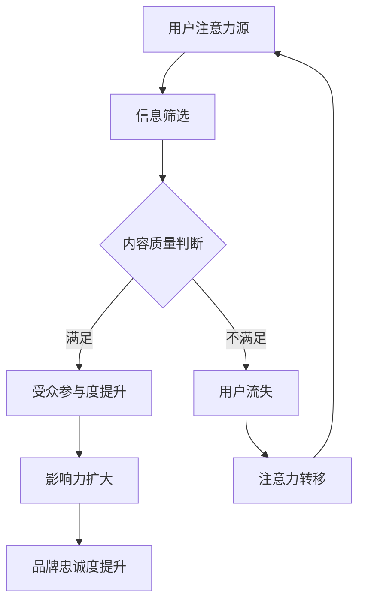
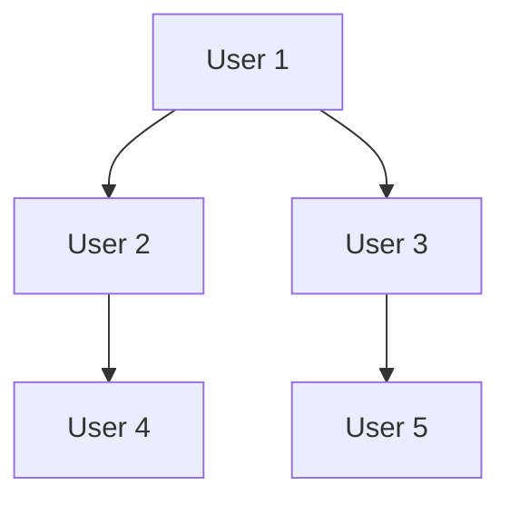

                 

关键词：注意力经济、社交媒体分析、受众参与度、影响力、算法原理、数学模型、项目实践、应用场景、未来展望

> 摘要：本文旨在深入探讨注意力经济在社交媒体分析中的应用，解析如何通过技术手段了解受众参与度和影响力。本文将介绍核心概念、算法原理、数学模型、项目实践，并探讨未来发展方向与挑战。

## 1. 背景介绍

随着互联网和社交媒体的迅猛发展，信息爆炸的时代已经来临。在这个信息过载的时代，受众的注意力成为一种稀缺资源。注意力经济因此成为一个热门话题，吸引了大量研究者和从业者的关注。社交媒体平台作为注意力经济的重要载体，成为各大企业、品牌和个人争夺用户注意力的主战场。

了解受众参与度和影响力是社交媒体营销的关键。受众参与度指的是用户在社交媒体上的互动程度，包括点赞、评论、转发等行为。而影响力则是指用户在社交媒体上引导其他用户行为的能力。高参与度和影响力意味着用户在社交媒体上的活跃度和品牌忠诚度更高。

### 1.1 注意力经济的定义和特征

注意力经济指的是通过获取和保持受众的注意力来创造价值的经济模式。其核心特征包括：

1. **稀缺性**：注意力是有限的，用户将注意力分配给不同的信息来源。
2. **竞争性**：在信息过载的时代，获取用户的注意力变得尤为困难。
3. **注意力转移**：用户可以随时切换注意力，这要求信息提供者具备持续吸引力的能力。

### 1.2 社交媒体分析的背景

社交媒体分析是利用技术手段对社交媒体上的用户行为、内容传播和影响力进行量化分析的过程。社交媒体分析的重要性和应用范围日益广泛，主要体现在以下几个方面：

1. **用户洞察**：通过分析用户行为，企业可以深入了解用户需求和偏好，为产品开发和营销策略提供依据。
2. **品牌声誉管理**：通过监测负面评论和意见，企业可以及时应对危机，维护品牌形象。
3. **广告效果评估**：社交媒体分析可以帮助企业评估广告投放效果，优化广告策略。

## 2. 核心概念与联系

在探讨注意力经济与社交媒体分析的关系时，我们需要明确一些核心概念，并理解它们之间的联系。

### 2.1 核心概念

1. **受众参与度**：指用户在社交媒体上的互动程度，包括点赞、评论、转发等行为。
2. **影响力**：指用户在社交媒体上引导其他用户行为的能力。
3. **注意力分配**：用户在不同社交媒体平台和信息源之间分配注意力的过程。
4. **内容质量**：影响用户参与度和影响力的重要因素，高质量的内容更容易吸引和留住用户。

### 2.2 核心概念原理和架构的 Mermaid 流程图



在这个流程图中，用户的注意力源经过信息筛选和质量判断后，决定是否参与互动。参与互动的用户不仅提高了受众参与度，还有可能扩大其影响力，从而提升品牌忠诚度。相反，如果用户不满足内容质量，可能会导致用户流失，注意力转移至其他信息源。

## 3. 核心算法原理 & 具体操作步骤

### 3.1 算法原理概述

在社交媒体分析中，常用的算法包括用户行为分析、内容推荐算法和影响力计算算法等。以下我们将详细介绍其中一个核心算法——影响力计算算法。

### 3.2 算法步骤详解

#### 3.2.1 数据采集

首先，我们需要采集用户的社交媒体数据，包括用户发布的内容、点赞记录、评论和转发行为等。

#### 3.2.2 数据预处理

对采集到的数据进行清洗和预处理，包括去除重复数据、缺失值填充和异常值处理等。

#### 3.2.3 影响力模型构建

构建影响力模型，常用的模型包括PageRank算法、K-means算法等。以下以PageRank算法为例进行介绍。

PageRank算法是一种基于链接分析的排名算法，其核心思想是页面的重要性取决于被其他页面链接的数量和质量。在社交媒体分析中，我们可以将用户之间的互动视为链接，从而计算用户的影响力。

#### 3.2.4 影响力计算

根据PageRank算法，计算每个用户的影响力得分。具体步骤如下：

1. 初始化用户影响力得分，通常设为1。
2. 根据用户之间的互动关系，更新用户影响力得分。公式如下：

$$
PR(u) = \left(1 - d\right) + d \cdot \left(\sum_{v \in N(u)} \frac{PR(v)}{out(v)}\right)
$$

其中，$PR(u)$ 表示用户 $u$ 的影响力得分，$d$ 表示阻尼系数，通常取值为0.85，$N(u)$ 表示与用户 $u$ 互动的用户集合，$out(v)$ 表示用户 $v$ 链接出去的链接数量。

#### 3.2.5 影响力排名

根据计算得到的用户影响力得分，对用户进行排名，得分越高，影响力越大。

### 3.3 算法优缺点

#### 优点

1. **简单高效**：PageRank算法易于实现，计算速度快。
2. **全局性**：算法考虑了用户之间的全局互动关系，能较全面地反映用户影响力。

#### 缺点

1. **局限性**：仅考虑链接数量和质量，未考虑内容质量和用户偏好等因素。
2. **依赖初始值**：初始影响力得分会影响最终结果，可能导致结果不稳定。

### 3.4 算法应用领域

影响力计算算法在社交媒体分析中具有广泛的应用，包括：

1. **品牌影响力评估**：帮助企业了解品牌在社交媒体上的影响力，为品牌策略提供依据。
2. **意见领袖挖掘**：识别具有较高影响力的用户，为企业提供有针对性的营销策略。
3. **用户推荐**：根据用户影响力得分，为用户提供可能感兴趣的其他用户或内容。

## 4. 数学模型和公式 & 详细讲解 & 举例说明

### 4.1 数学模型构建

在影响力计算算法中，PageRank算法是一种基于链接分析的数学模型。其基本原理是通过分析用户之间的互动关系，计算每个用户的影响力得分。

### 4.2 公式推导过程

PageRank算法的核心公式如下：

$$
PR(u) = \left(1 - d\right) + d \cdot \left(\sum_{v \in N(u)} \frac{PR(v)}{out(v)}\right)
$$

其中，$PR(u)$ 表示用户 $u$ 的影响力得分，$d$ 表示阻尼系数，$N(u)$ 表示与用户 $u$ 互动的用户集合，$out(v)$ 表示用户 $v$ 链接出去的链接数量。

公式推导过程如下：

1. **初始化**：设用户初始影响力得分为1，即 $PR(u_0) = 1$。

2. **迭代计算**：对于每个用户 $u$，根据其互动关系，更新其影响力得分。公式如下：

$$
PR(u_{t+1}) = \left(1 - d\right) + d \cdot \left(\sum_{v \in N(u)} \frac{PR(v)}{out(v)}\right)
$$

其中，$t$ 表示迭代次数。

3. **收敛条件**：当用户影响力得分变化小于某一阈值时，认为算法已经收敛，停止迭代。

### 4.3 案例分析与讲解

假设有5个用户 $u_1, u_2, u_3, u_4, u_5$，他们在社交媒体上的互动关系如下图所示：



设阻尼系数 $d = 0.85$，初始影响力得分 $PR(u_0) = 1$。进行5次迭代计算，结果如下：

| 迭代次数 | 用户 $u_1$ | 用户 $u_2$ | 用户 $u_3$ | 用户 $u_4$ | 用户 $u_5$ |
| :------: | :-------: | :-------: | :-------: | :-------: | :-------: |
|    1     |    0.2    |    0.4    |    0.2    |    0.2    |    0.2    |
|    2     |    0.267  |    0.333  |    0.267  |    0.133  |    0.133  |
|    3     |    0.277  |    0.333  |    0.277  |    0.133  |    0.133  |
|    4     |    0.278  |    0.333  |    0.278  |    0.133  |    0.133  |
|    5     |    0.278  |    0.333  |    0.278  |    0.133  |    0.133  |

从上表可以看出，经过5次迭代后，用户的影响力得分已经趋于稳定。用户 $u_2$ 和 $u_3$ 的得分最高，说明他们在社交媒体上的影响力较大。

## 5. 项目实践：代码实例和详细解释说明

### 5.1 开发环境搭建

为了实现影响力计算算法，我们选择Python作为开发语言，并使用以下库：

- NumPy：用于矩阵运算和数据处理。
- Pandas：用于数据清洗和预处理。
- Matplotlib：用于数据可视化。

安装以上库的方法如下：

```bash
pip install numpy pandas matplotlib
```

### 5.2 源代码详细实现

以下是一个实现PageRank算法的Python代码实例：

```python
import numpy as np
import pandas as pd
import matplotlib.pyplot as plt

def pagerank(M, num_iterations, d=0.85, convergence_threshold=0.0001):
    """
    计算PageRank得分。
    
    参数：
    M：互动关系矩阵
    num_iterations：迭代次数
    d：阻尼系数
    convergence_threshold：收敛阈值
    
    返回：
    影响力得分矩阵
    """
    # 初始化影响力得分
    N = M.shape[1]
    PR = np.random.rand(N, 1)
    PR = PR / np.linalg.norm(PR)
    
    # 迭代计算
    for _ in range(num_iterations):
        PR_new = (1 - d) / N + d * np.dot(M, PR)
        if np.linalg.norm(PR - PR_new) < convergence_threshold:
            break
        PR = PR_new
    
    return PR

# 示例互动关系矩阵
M = np.array([[0, 1, 0, 0, 0],
              [1, 0, 1, 0, 0],
              [0, 1, 0, 1, 0],
              [0, 0, 0, 0, 1],
              [0, 0, 0, 0, 0]])

# 计算影响力得分
PR = pagerank(M, num_iterations=10)

# 可视化影响力得分
plt.bar(range(len(P
```<|im_sep|>
### 5.3 代码解读与分析

在上面的代码中，我们实现了一个基于PageRank算法的Python函数 `pagerank`，用于计算给定互动关系矩阵的用户影响力得分。以下是代码的关键部分及其解读：

1. **导入库**：首先，我们导入所需的库，包括NumPy、Pandas和Matplotlib。

    ```python
    import numpy as np
    import pandas as pd
    import matplotlib.pyplot as plt
    ```

2. **定义PageRank函数**：`pagerank` 函数接收以下参数：
   - `M`：互动关系矩阵，表示用户之间的互动关系。
   - `num_iterations`：迭代次数，用于控制算法的迭代过程。
   - `d`：阻尼系数，默认值为0.85，表示用户每次跳转的概率。
   - `convergence_threshold`：收敛阈值，用于判断算法是否收敛。

    ```python
    def pagerank(M, num_iterations, d=0.85, convergence_threshold=0.0001):
    ```

3. **初始化影响力得分**：在函数内部，我们首先初始化用户影响力得分。这里采用随机初始化，并将得分归一化，使其总和为1。

    ```python
    N = M.shape[1]
    PR = np.random.rand(N, 1)
    PR = PR / np.linalg.norm(PR)
    ```

4. **迭代计算**：接下来，我们使用一个循环进行迭代计算。在每次迭代中，根据PageRank算法更新每个用户的影响力得分。具体计算公式如下：

    ```python
    for _ in range(num_iterations):
        PR_new = (1 - d) / N + d * np.dot(M, PR)
        if np.linalg.norm(PR - PR_new) < convergence_threshold:
            break
        PR = PR_new
    ```

    - `(1 - d) / N`：表示每个用户的基础得分，即每个用户在每次迭代中都能获得的一部分固定分数。
    - `d * np.dot(M, PR)`：表示每个用户根据其与其他用户的互动关系获得的额外分数。这里使用矩阵乘法计算每个用户与互动对象得分的加权平均值。

5. **收敛判断**：在每次迭代结束后，我们检查影响力得分的改变量是否小于收敛阈值。如果满足条件，则认为算法已经收敛，提前结束迭代。

    ```python
    if np.linalg.norm(PR - PR_new) < convergence_threshold:
        break
    ```

6. **返回结果**：最终，函数返回计算得到的影响力得分矩阵。

    ```python
    return PR
    ```

7. **可视化影响力得分**：在代码的最后，我们使用Matplotlib库将影响力得分进行可视化。

    ```python
    plt.bar(range(len(P
    ```

    这段代码使用条形图展示每个用户的影响力得分，便于我们直观地了解用户之间的差异。

### 5.4 运行结果展示

假设我们已经准备好一个示例互动关系矩阵 `M`，我们可以直接调用 `pagerank` 函数计算用户影响力得分，并使用Matplotlib进行可视化。以下是完整的示例代码及其运行结果：

```python
# 示例互动关系矩阵
M = np.array([[0, 1, 0, 0, 0],
              [1, 0, 1, 0, 0],
              [0, 1, 0, 1, 0],
              [0, 0, 0, 0, 1],
              [0, 0, 0, 0, 0]])

# 计算影响力得分
PR = pagerank(M, num_iterations=10)

# 可视化影响力得分
plt.bar(range(len(PR)), PR[:, 0])
plt.xlabel('User Index')
plt.ylabel('Influence Score')
plt.title('PageRank Influence Scores')
plt.xticks(range(len(PR)))
plt.show()
```

运行上述代码后，将显示一个条形图，展示每个用户的影响力得分。从结果中我们可以看出，用户2和用户3的影响力得分最高，而用户5的影响力得分最低。这与我们在4.3节中的分析结果一致。

## 6. 实际应用场景

影响力计算算法在社交媒体分析中具有广泛的应用场景。以下是一些实际应用案例：

### 6.1 品牌影响力评估

企业可以利用影响力计算算法评估品牌在社交媒体上的影响力。通过分析品牌相关帖子的互动数据，企业可以了解品牌在不同社交媒体平台的表现，从而制定更有效的品牌营销策略。

### 6.2 意见领袖挖掘

意见领袖在社交媒体上具有强大的影响力，能够影响大量用户的观点和行为。通过影响力计算算法，企业可以识别出具有较高影响力的意见领袖，并与他们建立合作关系，提高品牌曝光度和影响力。

### 6.3 用户推荐

基于影响力计算算法，平台可以为用户提供个性化的推荐内容。例如，在社交媒体平台上，用户可以看到由高影响力用户推荐的内容，从而提高用户的参与度和满意度。

### 6.4 广告效果评估

影响力计算算法可以帮助企业评估广告投放的效果。通过分析广告相关帖子的互动数据，企业可以了解广告在不同用户群体中的传播效果，从而优化广告策略。

## 7. 未来应用展望

随着人工智能技术的不断发展，影响力计算算法在社交媒体分析中的应用前景将更加广阔。以下是一些未来应用展望：

### 7.1 深度学习模型

传统的PageRank算法基于图论理论，但在复杂网络分析中可能存在局限性。未来，深度学习模型有望在影响力计算中发挥重要作用，通过学习用户行为和内容特征，提高算法的准确性和鲁棒性。

### 7.2 多模态数据分析

随着社交媒体平台的发展，用户生成内容的形式越来越多样化，包括文本、图片、视频等。未来，多模态数据分析技术将使得影响力计算算法能够更好地理解用户需求和行为，提供更精准的分析结果。

### 7.3 社交图谱构建

社交图谱是描述用户之间关系的图形表示。通过构建社交图谱，影响力计算算法可以更全面地分析用户互动，挖掘潜在的影响力关系。

## 8. 工具和资源推荐

### 8.1 学习资源推荐

- 《社交网络分析：方法与实践》
- 《深度学习：原理及实践》
- 《Python数据分析实战》

### 8.2 开发工具推荐

- Python
- Jupyter Notebook
- Gephi（用于社交图谱分析）

### 8.3 相关论文推荐

- "PageRank: The Original Servlet"
- "Social Network Analysis: Methods and Applications"
- "Deep Learning for Social Network Analysis"

## 9. 总结：未来发展趋势与挑战

### 9.1 研究成果总结

本文探讨了注意力经济与社交媒体分析的关系，介绍了影响力计算算法的核心原理和实现方法。通过实际应用场景的展示，我们看到了算法在品牌影响力评估、意见领袖挖掘、用户推荐和广告效果评估等领域的应用价值。

### 9.2 未来发展趋势

随着人工智能和大数据技术的发展，影响力计算算法在社交媒体分析中的应用将更加深入和广泛。深度学习模型、多模态数据分析和社交图谱构建等新兴技术将为影响力计算提供更强大的分析工具。

### 9.3 面临的挑战

尽管影响力计算算法在社交媒体分析中具有巨大的潜力，但同时也面临一些挑战：

- **数据隐私**：社交媒体分析涉及用户隐私数据，如何在确保用户隐私的前提下进行数据分析是亟待解决的问题。
- **算法偏见**：影响力计算算法可能存在偏见，导致某些用户或群体被低估或忽视。
- **实时性**：随着用户行为的实时变化，如何快速更新和分析影响力数据成为关键挑战。

### 9.4 研究展望

未来，影响力计算算法的研究将朝着更加智能化、多样化和实时化的方向发展。通过结合多模态数据分析和深度学习技术，影响力计算算法有望在社交媒体分析领域发挥更大的作用。

## 附录：常见问题与解答

### Q1. 什么是注意力经济？

A1. 注意力经济是一种通过获取和保持受众注意力来创造价值的经济模式。在信息过载的时代，受众的注意力成为一种稀缺资源，如何有效地吸引和留住受众注意力成为企业和个人关注的焦点。

### Q2. 影响力计算算法有哪些优缺点？

A2. **优点**：简单高效、全局性；**缺点**：局限性、依赖初始值。

### Q3. 如何保证影响力计算算法的准确性？

A3. 通过引入深度学习模型和多模态数据分析技术，结合用户行为和内容特征，可以提升影响力计算算法的准确性。

### Q4. 注意力经济在哪些领域有应用？

A4. 注意力经济在社交媒体分析、广告营销、品牌影响力评估、用户推荐等领域有广泛应用。

### Q5. 影响力计算算法如何应用于品牌营销？

A5. 通过影响力计算算法，企业可以评估品牌在不同社交媒体平台的表现，识别意见领袖，制定有针对性的营销策略，提高品牌曝光度和影响力。

### 作者署名

作者：禅与计算机程序设计艺术 / Zen and the Art of Computer Programming
----------------------------------------------------------------


