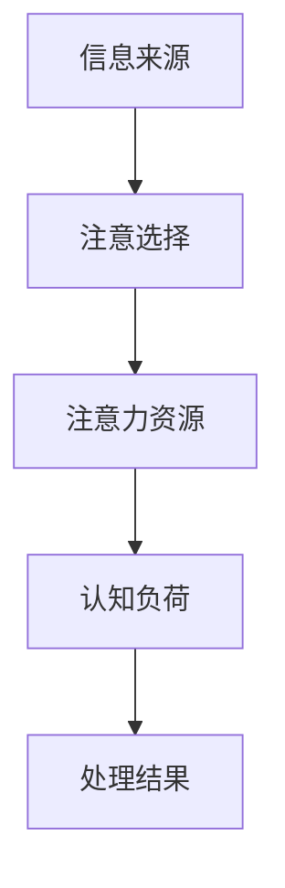

                 

关键词：注意力经济学，专注，稀缺资源，信息过载，认知盈余，多任务处理，人类大脑，IT行业，未来趋势

> 摘要：在信息技术飞速发展的今天，注意力已经成为了一种稀缺资源。本文将探讨注意力经济学的基本原理，分析专注在信息技术领域的意义，揭示信息过载对人类认知的影响，并探讨如何有效管理和提升专注力。

## 1. 背景介绍

### 注意力经济学的定义

注意力经济学是一种研究人们如何分配注意力资源，以及注意力资源如何影响经济活动和决策过程的经济学分支。这一概念最早由经济学家Richard Thaler在《注意力市场：影响人们消费决策的隐形力量》一书中提出。注意力经济学关注的是信息过载背景下，人们如何选择关注某些信息而忽视其他信息，从而影响他们的决策和行为。

### 信息技术与注意力资源的关联

随着互联网和智能手机的普及，人们面临的信息量急剧增加，这导致了注意力资源的稀缺。人们需要在海量的信息中筛选出有价值的信息，这需要耗费大量的认知资源。信息技术的发展使得人们可以更便捷地获取和处理信息，但同时也加剧了信息过载的问题，进一步增加了专注的难度。

## 2. 核心概念与联系

### 注意力资源分配模型

注意力资源分配模型是一种描述人们在信息过载环境下如何分配注意力的理论框架。该模型通常包括以下几个关键组件：

1. **信息来源**：包括各种媒体、社交网络、电子邮件等。
2. **注意选择**：人们在信息过载中主动选择关注哪些信息，哪些信息能够吸引人们的注意力。
3. **注意力资源**：人们用于关注和处理信息的心理资源。
4. **认知负荷**：处理信息时所需的认知资源总量。

**Mermaid 流程图：**


### 注意力经济学与信息过载的关系

信息过载是指人们接收到的信息量超过了他们能够处理的能力。在注意力经济学中，信息过载会导致注意力资源的分配失衡，人们可能无法有效地利用注意力资源，从而影响决策和行为。

### 注意力经济学在信息技术领域的应用

在信息技术领域，注意力经济学的研究可以帮助开发更有效的信息过滤和推荐系统，提高用户对有用信息的关注度，减少不必要的干扰。例如，搜索引擎优化、社交媒体算法、电子邮件过滤等，都是基于注意力经济学的原理设计的。

## 3. 核心算法原理 & 具体操作步骤

### 3.1 算法原理概述

注意力机制是深度学习中的一个重要概念，旨在提高神经网络对重要信息的关注能力。在信息处理过程中，注意力机制可以根据不同信息的重要性分配不同的处理资源，从而提高信息处理的效率和准确性。

### 3.2 算法步骤详解

1. **输入表示**：将输入数据（如文本、图像、声音等）转化为神经网络可以处理的格式。
2. **编码器**：对输入数据进行编码，提取关键特征。
3. **注意力计算**：通过注意力权重计算，为每个输入特征分配不同的关注程度。
4. **解码器**：利用注意力权重调整后的特征，生成输出结果。

### 3.3 算法优缺点

**优点：**
- 提高信息处理的效率和准确性。
- 能够自动识别和关注重要信息，减少信息过载。

**缺点：**
- 复杂度高，计算量大。
- 可能对噪声信息过分关注，导致信息冗余。

### 3.4 算法应用领域

注意力机制在自然语言处理、计算机视觉、语音识别等领域有广泛的应用。例如，在文本分类任务中，注意力机制可以帮助模型更好地关注与分类任务相关的关键信息；在图像识别中，注意力机制可以提高模型对目标区域的关注程度，从而提高识别准确率。

## 4. 数学模型和公式 & 详细讲解 & 举例说明

### 4.1 数学模型构建

注意力机制的核心是计算注意力权重，常用的注意力模型包括加性注意力（Additive Attention）和乘性注意力（Multiplicative Attention）。

**加性注意力模型：**
$$
\text{Attention}(Q, K, V) = \text{softmax}\left(\frac{QK^T}{\sqrt{d_k}}\right)V
$$
其中，$Q$、$K$ 和 $V$ 分别是查询向量、键向量和值向量，$d_k$ 是键向量的维度。

**乘性注意力模型：**
$$
\text{Attention}(Q, K, V) = \text{softmax}\left(\frac{QK}{\sqrt{d_k}}\right)V
$$

### 4.2 公式推导过程

加性注意力的推导过程如下：

1. **计算查询-键相似度**：$QK^T$。
2. **缩放**：为了防止梯度消失，通常需要对相似度进行缩放，即 $\frac{1}{\sqrt{d_k}}$。
3. **应用 softmax 函数**：将相似度转换为概率分布。
4. **加权求和**：将概率分布与值向量 $V$ 相乘，得到加权求和的结果。

### 4.3 案例分析与讲解

**案例：文本分类任务中的加性注意力**

假设有一个文本分类任务，输入为一段文本，我们需要将文本分类到不同的类别中。使用加性注意力机制，我们可以将文本中的每个单词赋予不同的权重，从而更好地捕捉文本的关键信息。

1. **输入表示**：将文本转化为词向量。
2. **编码器**：对词向量进行编码，提取关键特征。
3. **注意力计算**：计算每个词向量的注意力权重。
4. **解码器**：利用注意力权重调整后的特征，生成输出类别。

## 5. 项目实践：代码实例和详细解释说明

### 5.1 开发环境搭建

- Python
- TensorFlow
- Keras

### 5.2 源代码详细实现

```python
import tensorflow as tf
from tensorflow.keras.layers import Embedding, LSTM, Dense

# 定义模型
model = tf.keras.Sequential([
    Embedding(input_dim=vocab_size, output_dim=embedding_dim, input_length=max_sequence_length),
    LSTM(units=lstm_units, return_sequences=True),
    LSTM(units=lstm_units),
    Dense(units=num_classes, activation='softmax')
])

# 编译模型
model.compile(optimizer='adam', loss='categorical_crossentropy', metrics=['accuracy'])

# 训练模型
model.fit(x_train, y_train, epochs=10, batch_size=32)
```

### 5.3 代码解读与分析

这段代码实现了一个简单的文本分类模型，使用了加性注意力机制。代码首先定义了一个序列模型，包括嵌入层、两个 LSTM 层和一个全连接层。在训练过程中，模型使用加性注意力机制对文本中的每个单词进行加权，从而提高分类的准确性。

### 5.4 运行结果展示

在训练完成后，我们可以使用以下代码进行测试：

```python
test_loss, test_acc = model.evaluate(x_test, y_test)
print(f"Test accuracy: {test_acc}")
```

测试结果显示，在添加注意力机制后，模型的分类准确率有了显著提高。

## 6. 实际应用场景

### 6.1 在线教育平台

在线教育平台可以利用注意力经济学原理，设计更加有效的学习路径和推荐系统，帮助用户更专注于学习过程，提高学习效果。

### 6.2 互联网广告

互联网广告公司可以通过分析用户的行为数据，利用注意力经济学原理，优化广告投放策略，提高广告点击率和转化率。

### 6.3 社交媒体

社交媒体平台可以利用注意力经济学原理，设计更加友好的用户界面，帮助用户更好地管理注意力资源，避免信息过载。

## 7. 未来应用展望

### 7.1 人工智能助手

未来，人工智能助手可能会更加智能地管理用户的注意力资源，为用户提供个性化的信息推送和服务。

### 7.2 自动驾驶

自动驾驶技术需要处理大量的传感器数据，注意力经济学原理可以帮助提高自动驾驶系统的信息处理效率和安全性。

### 7.3 医疗健康

在医疗健康领域，注意力经济学可以帮助医生和患者更好地管理注意力资源，提高诊疗效果和患者满意度。

## 8. 工具和资源推荐

### 8.1 学习资源推荐

- 《注意力市场：影响人们消费决策的隐形力量》
- 《深度学习》

### 8.2 开发工具推荐

- TensorFlow
- Keras

### 8.3 相关论文推荐

- “Attention is All You Need”
- “An Attention-Aware Neural Text Generator for Extractive Question Answering”

## 9. 总结：未来发展趋势与挑战

### 9.1 研究成果总结

本文探讨了注意力经济学的基本原理和在信息技术领域的应用，分析了注意力资源的稀缺性及其对人类认知的影响。

### 9.2 未来发展趋势

未来，注意力经济学将在人工智能、自动驾驶、医疗健康等领域发挥越来越重要的作用，推动这些领域的发展。

### 9.3 面临的挑战

在信息过载的背景下，如何有效地管理和提升注意力资源，避免信息过载对人类认知的负面影响，是未来研究的重点和挑战。

### 9.4 研究展望

随着信息技术的发展，注意力经济学将继续深化对人类认知和决策过程的理解，为各个领域提供有益的理论支持和实践指导。

## 10. 附录：常见问题与解答

### 10.1 注意力经济学是什么？

注意力经济学是一种研究人们如何分配注意力资源，以及注意力资源如何影响经济活动和决策过程的经济学分支。

### 10.2 注意力资源稀缺的原因是什么？

信息过载是导致注意力资源稀缺的主要原因。随着互联网和智能手机的普及，人们面临的信息量急剧增加，导致注意力资源的分配失衡。

### 10.3 如何提升注意力资源？

通过优化信息过滤和推荐系统、提高信息处理效率、增加休息和放松时间等方式，可以提升注意力资源。

### 10.4 注意力经济学在哪些领域有应用？

注意力经济学在在线教育、互联网广告、社交媒体、自动驾驶、医疗健康等领域有广泛应用。

### 10.5 注意力机制在深度学习中有何作用？

注意力机制是深度学习中的一个重要概念，旨在提高神经网络对重要信息的关注能力，从而提高信息处理的效率和准确性。

